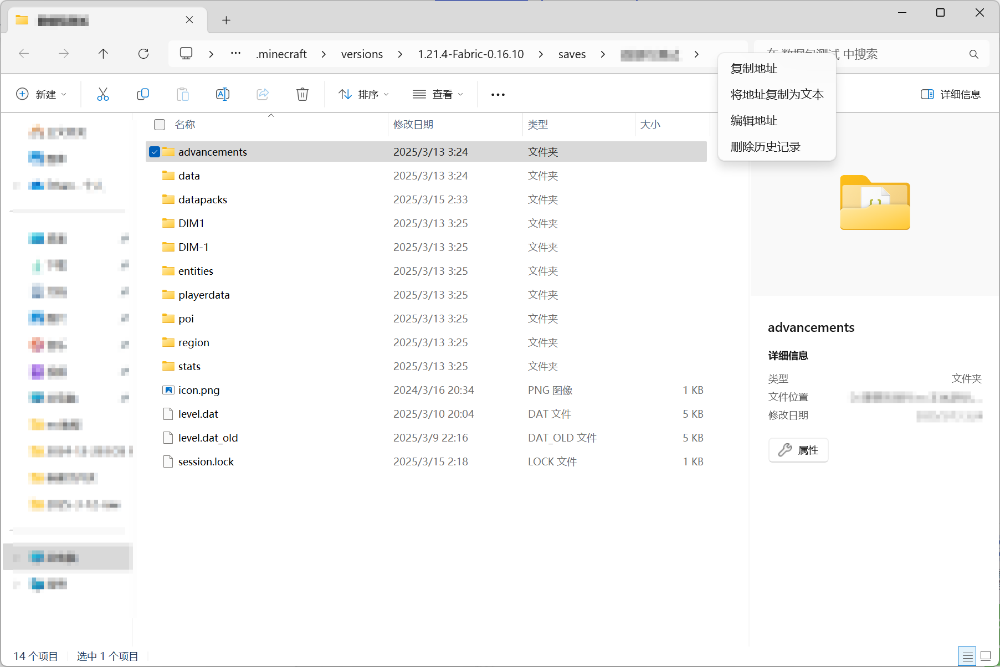
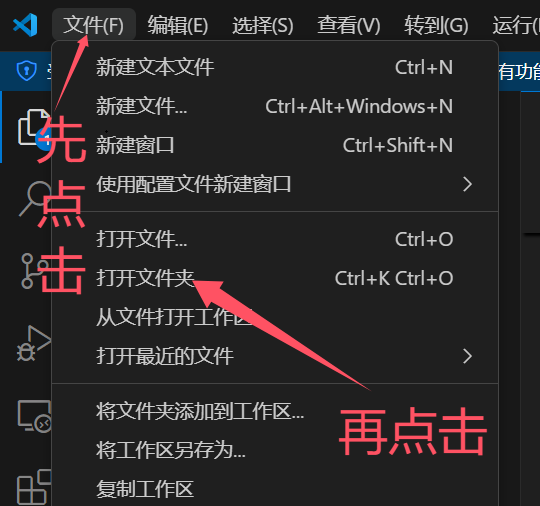
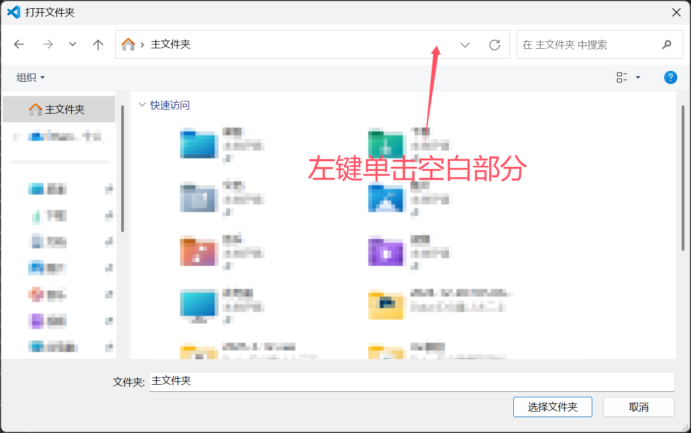
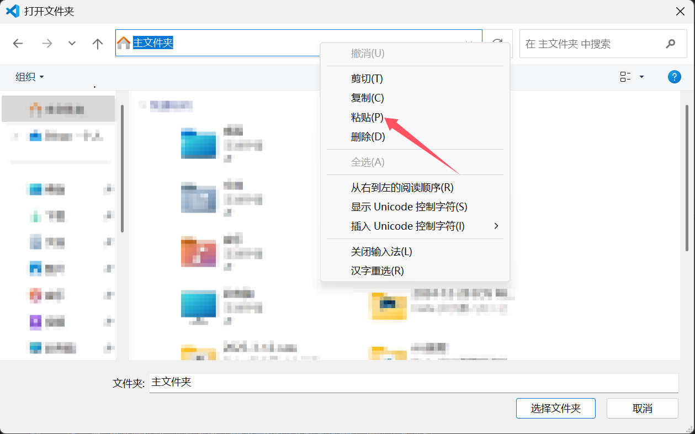
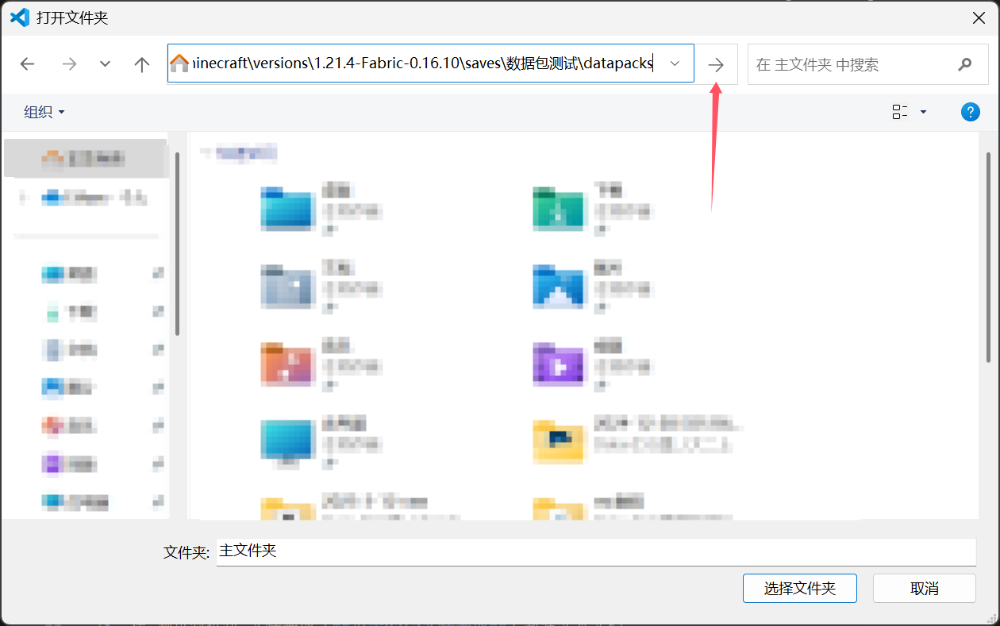
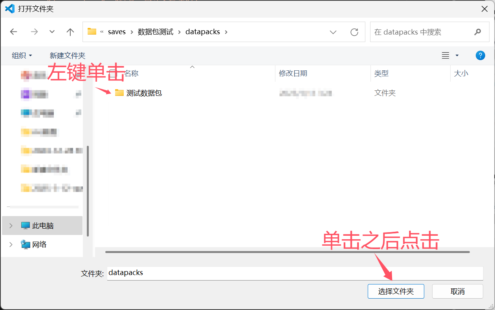
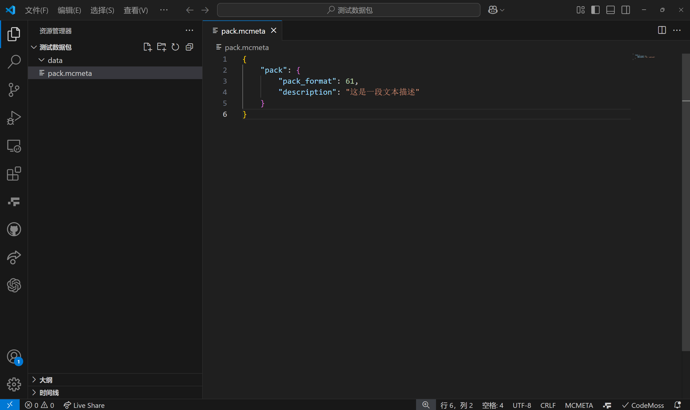

::: tip Translation notice
This page was translated with machine translation and may contain inaccuracies. If you can help improve it, please open an issue or submit a pull request.
:::


<FeatureHead
    title = "data pack quick start"
    authorName = "ethansansansansansan"
    resourceLink = 'http://underline.icu/mcfunction-guide/%E6%95%B0%E6%8D%AE%E5%8C%85%E5%BF%AB%E9%80%9F%E5%85%A5%E9%97%A8/1/main.html'
/>

## hint

This tutorial will try to allow readers with zero foundation or a little coding foundation to quickly get started with data pack.
Through practical case explanations, readers can gradually understand and become proficient in writing data packs.

If you just read this tutorial and don't do it, you will hardly learn anything. Please be sure to follow the step-by-step tutorial to do it!

## Create data pack

Before you begin, open the display extension in your file explorer and create an empty data pack.
You can install code editors such as vscode, editplus, or codeblock in advance to write data packs. It is recommended to use vscode.

If you use vscode, it is recommended to install the Simplified Chinese plug-in and the Datapack Helper Plus plug-in.

After installation, open the datapacks folder in your game archive and create a new "test data pack" folder in it. Create files and folders according to the following structure:

```txt
测试数据包
    data（文件夹）
    pack.mcmeta
```


The contents of `pack.mcmeta` are:

```json
{
    "pack": {
        "pack_format": 61,
        "description": "这是一段文本描述"
    }
}
```


<details>
<summary>Detailed steps to create data pack (using vscode)</summary>

> ---
> The vscode installation steps are as follows:
> 1. Install vscode and open it after completion.
> 2. Press and hold &lt;kbd&gt;Ctrl&lt;/kbd&gt;+&lt;kbd&gt;Shit&lt;/kbd&gt;+&lt;kbd&gt;X&lt;/kbd&gt; to open the plug-in interface.
> 3. Search for "Simplified Chinese" in the search bar just below "EXTENSIONS: MARKETPLACE" on the left, find the "Install" button of the globe icon plug-in, then search for "spyglass", and find the "Install" button of the blue telescope icon plug-in.
> 4. Restart vscode. You can see that the language has been set to Chinese and everything is ready.
>
> The steps to create a data pack are as follows:
> 1. Click "Single Player Game" on the game page.
> 2. **Click** to select the archive you want to create a data pack for.
> 3. Click "Edit" below.
> 4. Click "Open world folder".
> 5. A folder page will pop up. Double-click the "datapacks" folder inside. This folder should be empty after entering.
> 6. Create a new folder in the "datapacks" folder and name it "test data pack".
> 7. After completion, right-click the upper path bar and click "Copy address as text". As shown in the picture: 
> 8. Open vscode, click the "File" button in the upper left corner, and then click the "Open Folder" button. A folder will pop up. Paste the previously copied address into the address box and click "→". Then left-click the "Test data pack" folder and click "Select Folder". As shown in the picture: 
> 10. Create files and folders according to structure, as shown in the figure: 
> ---

</details>

<details>
<summary>Detailed steps to create data pack (without using vscode)</summary>

> ---
> The steps are as follows:
>
> 1. Click "Single Player Game" on the game page.
> 2. **Click** to select the archive you want to create a data pack for.
> 3. Click "Edit" below.
> 4. Click "Open world folder".
> 5. A folder page will pop up. Double-click the "datapacks" folder inside. This folder should be empty after entering.
> 6. Create a new folder in the "datapacks" folder and name it "test data pack".
> 7. Double-click to enter the "test data pack" folder and create a new folder named "data".
> 8. Create a new text document in the "test data pack" folder (**not in the data folder**).
> 9. Rename "New text document.txt" to "pack.mcmeta" (after modification, if you do not see the warning: "If you change the file extension, the file may be unusable...", it means that you have not opened the display file suffix, please open it first and then operate, otherwise the operation will be invalid).
> 10. Use a code editor or Notepad (Notepad is not recommended, it may come with a BOM header, which will invalidate the file) to open the "pack.mcmeta" file and enter the following content: `{"pack": {"pack_format": 61,"description": "This is a text description"}}`
> ---

</details>

## Create function

Function can be understood as a custom command. Multiple instructions can be written in the function and run in order from top to bottom.

Now we write a function that explodes instantly at its own location and sends a "Bang!" message.

Create the abc folder under data, create the function folder within the abc folder, and create the boom.mcfunction file within the function folder. The file structure is as follows:
```
测试数据包
    data
        abc/function            #abc文件夹里面有个function文件夹
            boom.mcfunction     #function文件夹里面有个boom.mcfunction文件
    pack.mcmeta
```


In "boom.mcfunction", enter the following:
```mcfunction
summon tnt
say 嘭！
```


You can also create functions in other folders, such as:
```
测试数据包
    data
        abc/function
            boom.mcfunction
        hahahaha/function
            6666.mcfunction
        minecraft/function
            lalala.mcfunction
    pack.mcmeta
```


## run function

When you enter the archive, MC will not read the data pack you modified in real time. You need to manually run the `/reload` command to reload the data pack.

Run the `/reload` command to let the game read the "boom.mcfunction" you just wrote.

Run `/function abc:boom` in the chat box. If an explosion occurs under your feet and the chat box outputs "Bang!", it means that your function is running successfully.

<details>
<summary>Why "abc:boom"? </summary>

> ---
> "abc:boom" actually reads "abc/function/boom.mcfunction", but every time it is written like this, it will be very long and troublesome, so the "/function/" in the middle is replaced with ":", the ".mcfunction" suffix at the end is removed, and it is written as "abc:boom".
>
> Note that only "/function/" will be replaced with a colon, and subsequent slashes will not change. For example, "abc:boom/test" reads "abc/function/boom/test.mcfunction"
>
> ---

</details>


## Automatically repeat functions

Sometimes we want some commands to be executed repeatedly, similar to the purple loop command block (generally run every 0.05 seconds).
In data pack, we cannot directly register the command into the loop. We need to put the command into the function, and then let the **function** execute repeatedly.

**Be sure to pay attention to whether the file is followed by ".json" or ".mcfunction", don't get confused! **

This can be achieved by registering a vanillafunctiontag. Create a minecraft folder in the data folder, a tags folder in the minecraft folder, a function folder in the tags folder, and a tick.json file in the function folder. The structure is as follows:
```
测试数据包
    data
        minecraft/tags/function
            tick.json
        abc/function
                boom.mcfunction
    pack.mcmeta
```


We can put in a function that we want to run in a loop. It is recommended to create a new tick function to specifically handle all loop logic. The steps are as follows:

1. Create a function "tick.mcfunction" in the function folder of the abc file, parallel to boom.mcfunction. The structure is as follows:
```
测试数据包
    data
        minecraft/tags/function
            tick.json
        abc
            function
                boom.mcfunction
                tick.mcfunction
    pack.mcmeta
```

2. In "tick.json", enter the following (don't forget "abc:tick" means "abc/function/tick.mcfunction"):
```json
{
    "values": [
        "abc:tick"
    ]
}
```


<details>
<summary>Why should "tick.json" be placed in the "minecraft/tags/function" folder? </summary>

> ---
>
> There is a built-in data pack in the internal code of vanillamc, which contains the file "minecraft/tags/function/tick.json".
> What you do is use the "minecraft/tags/function/tick.json" in your own data pack to overwrite the "minecraft/tags/function/tick.json" in the vanilla data pack. We can compare it to when drawing a resource pack. I want to use the grass block texture I drew to cover the vanilla grass block texture. As long as the folder and file names are exactly the same as those in vanilla, it will be automatically overwritten.
>
> The "coverage" here actually does not completely cover vanilla's "tick.json", but merges your "tick.json" with the "tick.json" of vanilla's own data pack. Saying "coverage" is just for convenience of understanding.
>
> ---

</details>

After that, we can add the loop command to "tick.mcfunction". Try letting the world say "Hello, my world!"

In "tick.mcfunction", enter the following:
```mcfunction
say 你好，我的世界！
```

Return to the game and enter command`/reload` in the chat box.

If you see the chat box flashing "Hello, my world!", it means the operation is successful.


## Automatic initialization function

You can also have the function be executed when you first enter the game or after running `/reload` as an initialization command.

Registration steps and [Automatically repeat function](#tick) are almost identical. The steps are as follows:

1. Create a minecraft folder in the data folder, a tags folder in the minecraft folder, a function folder in the tags folder, and a tick.json file in the function folder. The structure is as follows:
```
测试数据包
    data
        minecraft/tags/function
            load.json（新加的）
            tick.json
        abc
            function
                boom.mcfunction
                tick.mcfunction
    pack.mcmeta
```

2. Create a function "load.mcfunction" in the function folder of the abc file, parallel to boom.mcfunction. The structure is as follows:
```
测试数据包
    data
        minecraft/tags/function
            load.json（新加的）
            tick.json
        abc
            function
                boom.mcfunction
                load.mcfunction（新加的）
                tick.mcfunction
    pack.mcmeta
```

3. In "load.json", enter the following:
```json
{
    "values": [
        "abc:load"
    ]
}
```

After that, we can add the initialization command to "load.mcfunction".
