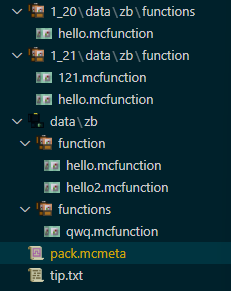

::: tip Translation notice
This page was translated with machine translation and may contain inaccuracies. If you can help improve it, please open an issue or submit a pull request.
:::


<FeatureHead
    title = "How to merge data packs of multiple versions?"
    authorName = "Dreamy_Blaze"
/>

## Strong coupling of data pack

As we all know, Minecraft's data pack (Datapack) and game version are strongly coupled (data pack loaded into a non-specified version of Minecraft will most likely be discarded). Before the official version of 1.20.2 was updated, data pack authors usually implemented version loading in this way:

- If the syntax changes between the two versions are large: copy the data pack multiple times, make modifications according to the version format differences (json or mcfunction), and publish them separately. It is direct and efficient. It is inconvenient to copy and modify multiple files multiple times.
- If the syntax changes between the two versions are minor: both are loaded into the same data pack, based on command syntax differences or [data versionDataVersion](https://zh.minecraft.wiki/w/%E6%95%B0%E6%8D%AE%E7%89%88%E6%9C%AC"[Chinese wiki] Data version") to load different functions, etc. (data pack syntax check is based on files, and erroneous files will be ignored). The advantage is that there are more compatible versions. However, when `/reload` is reloaded or restarted in a multi-person server, the server background will report errors one by one for files that are not of that version.

After Minecraft is officially updated to version 1.20.2, data pack authors can now use the officially provided setting of "loading different sub-data packs with different versions". This setting can be implemented by editing the data pack metadata file **pack.mcmeta**. This simple and effective method is not well known today (the Wiki only talks about the syntax but no examples (especially the folder structure), making it difficult to understand the specific operation of the sub-package function).

## Override subpackages based on version

Here is an example format of a data pack**pack.mcmeta** file:

```json
{
    "pack": {
        "pack_format": 61,
        "description": "子包测试"
    },
    "overlays": {
        "entries": [
            {
                "directory": "1_21",
                "formats": 48
            },
            {
                "directory": "1_20",
                "formats": {
                    "min_inclusive": 15,
                    "max_inclusive": 26
                }
            }
        ]
    }
}
```


explain:

The data pack version is 61, corresponding to 1.21.4. If the data pack is installed in the archive of 1.21-1.21.1 (data pack version 48), the `1_21`subpackage will be enabled. If it is installed in the archive of 1.20.2-1.20.4 (data pack version 48), the`1_21`subpackage will be enabled. In the archive of packversion18-26), the subpackage of`1_20`will be enabled (the corresponding MCversion of 15 is 1.20, but the subpackage`overlays` is supported starting from 1.20.2, so the minimum version must be 1.20.2. If it is lower than 18, it will not cause the data pack to fail to load, and it can only load the main package content like the old version);

`pack_format: 61`means that the main version is 1.21.4. In addition to the`pack`tag, define an`overlays`tag, which only includes an`entries`list. Each composite tag in the list is a sub-package to be overwritten by the corresponding version on the original data pack. Each composite tag must include the two tags`directory`(subpackage directory) and`formats` (the version&version interval to be covered).

Then the file directory structure of data pack should be like this:



In the picture, the `data`folder at the same level as`pack.mcmeta`is the content of the main package. There are`data`folders in the`1_20`and`1_21` folders, which are two sub-package parts;
If the sub-package has files with the same path as the main package (for example, there are three `hello.mcfunction`in the same`zb`namespace as shown above), when loading the corresponding version of the sub-package, the file of the main package will be overwritten (that is, only the sub-package function will be executed, and the main package function will be ignored. After all, they are called`overlays`, and the priority must be greater than the main package)
Note: Starting from 1.21, most folders in the data pack are named in the original singular form (functions->function);

- In 1.21.4, the `hello.mcfunction`and`hello2.mcfunction` files in the function folder in the main package data/zb will be loaded, and the sub-packages will not be loaded;
- In 1.21, the `hello2.mcfunction`of the function folder in the main package data/zb and the`hello.mcfunction`and`121.mcfunction`files in the sub-package`1_21`/data/zb will be loaded. The `hello`function of the main package is overwritten by the`hello` in the sub-package;
- In 1.20.2, the `qwq.mcfunction`file in the functions folder in the main package data/zb and the`hello.mcfunction`file in the sub-package`1_20`/data/zb will be loaded (the folders before 1.21 were all in plural form).

**Well, that is to say, if there is a `json`or`mcfunction` file with the same path as the main package in the activated sub-package, it will be overwritten in file units. (Subpackage first)**

When creating a 1.20.2+ data pack, it is a good choice to use the method of loading sub-packages with different versions.
Of course, in works spanning 1.21, it is quite awkward for the same data pack to maintain function and functions folders at the same time. Sub-packages can also be divided into two packages based on 1.21, for example:
1.20.2-1.20.4 is the version before the item stack component is updated, and 1.20.5-1.20.6 is the version after the item stack component is updated. The same data pack is used between these versions, and different sub-package strategies are loaded according to different versions (the folders are all plural);
After 1.21, every official syntax update for Minecraft can be overwritten in a sub-package, so there is no need to copy multiple data pack modifications (the folders are all odd-numbered).

