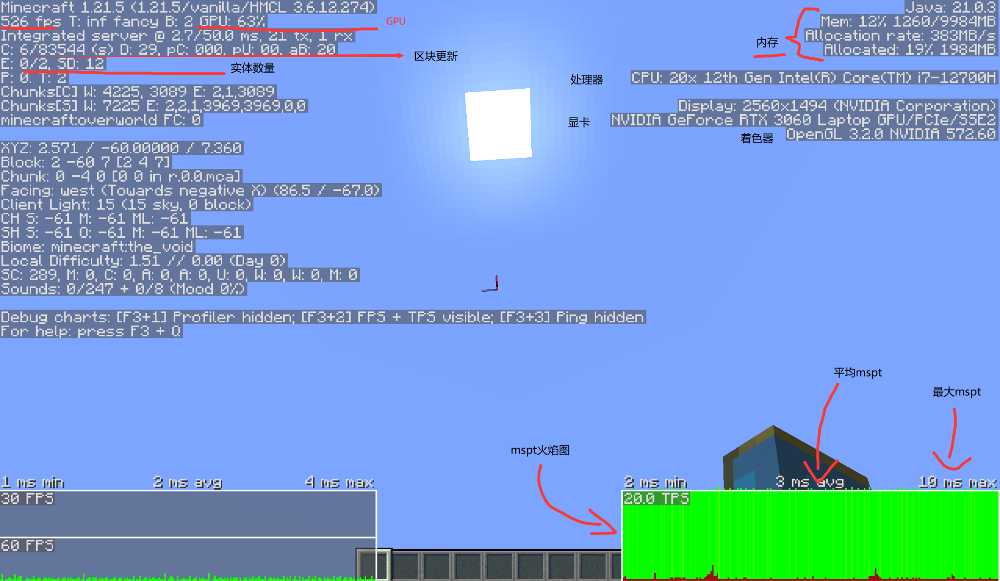
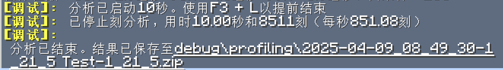
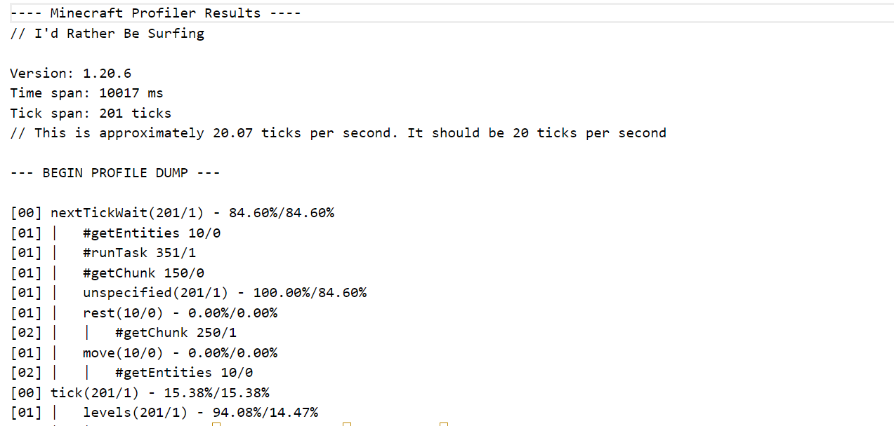
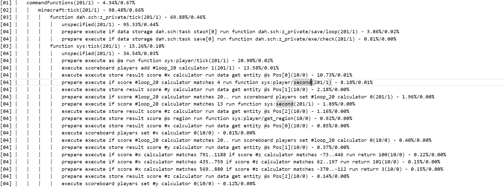
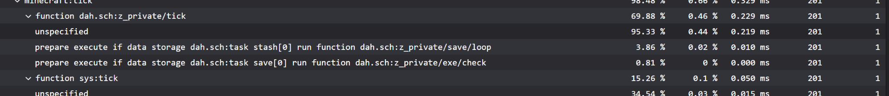

---
title: 'A brief description of data pack optimization principles and analysis methods'
---

::: tip Translation notice
This page was translated with machine translation and may contain inaccuracies. If you can help improve it, please open an issue or submit a pull request.
:::


<FeatureHead
    title = "Brief description of data pack optimization principles and analysis methods"
    authorName = "Dahesor"
    resourceLink = '数据包优化原则以及分析方式简述.pdf'
/>


## What is data pack optimization?
As we all know, mcfunction is a very inefficient language. Content mcfunction that can be easily implemented using conventional languages ​​requires the use of a large amount of computer resources. And there are many seemingly short commands that actually require a lot of performance to process. As your data pack gets larger and larger, the pressure on the game to run it will gradually increase. In order to ensure a smooth experience for the player (depending on the difficulty of optimization, it may be 'not a bad experience for the player'), we should reduce the running burden caused by the data pack as much as possible. By adjusting the structure and frequency of commands and functions, improving the writing of some commands, etc., reducing the resources consumed to implement the same function is optimization.


## When should you optimize your data pack?
Although optimization is important, blindly pursuing the ultimate optimization is not necessarily good development thinking. Before considering optimization, the first thing to consider is how to efficiently implement the desired content. Just ensure that the operating pressure is not unbearable. The considerations before actually developing the content should also be structural rather than minutiae. Detailed optimization is something that can be analyzed slowly later. In short, don’t let optimization limit your efforts.


## Optimization goal
The data pack consists of different parts. The operating frequency and conditions of different parts are different, so the requirements for optimization are also different.

Obviously, what needs to be optimized as much as possible is the function under #tick. These functions are running all the time and are directly related to the overall optimization of the data pack. On the contrary, those parts that will only run when triggered by special conditions do not need to be optimized to the same degree. For example, some instantaneous behavior is performed after the player releases a skill or clicks a button. Even if these things are wasted a little, the impact will hardly add up to a significant level.


## Performance principles and development habits
Going back to optimize after realizing that the data pack needs to be optimized will make you take a lot of detours, so it is very important to do some common optimization points well the first time you write it, or at least don't do it wrong. This chapter is mainly responsible for introducing this part of the content.


### `/fill`and`/clone`
There is no doubt that as long as the scope of influence is large enough, these two commands are the most performance-consuming commands. As long as there are hundreds of blocks involved, I recommend that you do everything possible to avoid high-frequency use. An example is an early map similar to grid parkour. Coral blocks were used in one grid, but it could not prevent the coral blocks from dying and turning gray. So the production team decided to use more than a dozen high-frequency `/fill`commands to replace all dead corals in this grid with their living versions every tick. Although this grid is not very big, the game still spends 50% of the time on these`/fill` commands every tick, and the computer fan is whirring.

In fact, you can use the resource pack to change the texture, paint the dead coral colorful, or replace it with other blocks.

For blocks of a higher order of magnitude, such as tens of thousands or hundreds of thousands of blocks filled at once, the game may take several seconds to respond. Even more deadly is the lighting update. When the block affected by the command changes a large range of lighting (such as creating a ceiling to block a large range of sunlight), the update cost will be increased exponentially.


### Other high-consumption commands
Here are some other "dangerous" commands. Some of these commands may cause noticeable lag with just one command:
 - `/fillbiome`: When changing the mob biome on a large scale
 - `/forceload`: Too many chunks are often loaded, or too many chunks are added at once.
 - `/gamerule randomTickSpeed`: When the random tick is set too high
 - `/locate`: The game will need to constantly search for the target. Some rare structures may even take seconds
 - `/particle`: When there are too many or too large particle commands, it will challenge the client rendering performance, and also cause the server to send a large number of packets to occupy the bandwidth, etc.
 - `/place`: when placing a large number of blocks
 - `/spreadplayers`: Trying to spread players over a large area may cause lags of up to several seconds at a time
 - `/tick`: Increasing the frequency of calculations is the easiest way to put pressure on the game


### NBT operation
Except for the rare and extreme commands listed above, NBT operations are probably the most stressful on the computer among all common behaviors. Whether you use `/data get`, `nbt=`and other means to read or match NBT, or use`/data`or`/execute store`and other means to write NBT, it is a great performance. Depending on the situation, the performance pressure is dozens to hundreds of times that of a command like`/scoreboard`.

The slowest NBT operation is the operation for the player. Reading a player's NBT takes several times longer than reading from other sources.

Below this are operations for entity and blockentity. This is much faster than the player (nearly 40%), but it can be avoided and should be avoided.

The fastest performance is reading command storage. Compared with scoreboard, although storage is still much slower, the performance has reached an acceptable level.


### NBT cache
Therefore, combined with the above points, we found that when we need to perform multiple reads and operations on a target's NBT, instead of operating directly on the target, it is better to copy the data into a storage first, and then overwrite it to the original position when all operations are completed:

For example, when we want to use NBT matching to determine the player's handheld item:

If SelectedItem is detected every time:
```mcfunction
# 拿着石头时说1
execute if data entity @s SelectedItem{id:"minecraft:stone"} run say 1
# 拿着泥土时说2
execute if data entity @s SelectedItem{id:"minecraft:dirt"} run say 2
# 拿着玻璃时说3
execute if data entity @s SelectedItem{id:"minecraft:glass"} run say 3
```


This will access the player's NBT three times, instead of this:
```mcfunction
# 这个命令会将玩家手中物品的信息存储到test:ram的temp中
data modify storage test:ram temp set from entity @s SelectedItem
# 拿着石头时说1
execute if data storage test:ram temp{id:"minecraft:stone"} run say 1
# 拿着泥土时说2
execute if data storage test:ram temp{id:"minecraft:dirt"} run say 2
# 拿着玻璃时说3
execute if data storage test:ram temp{id:"minecraft:glass"} run say 3
```


Although there is an extra step of copying NBT into the cache first, it will save a lot of performance overall. (Although in actual operation the above example can use `/execute if items`)

This method of first copying NBT into the cache and then operating it is called NBT cache. Whenever an NBT operation requires more than two commands, the NBT cache should always be used.

### A brief analysis of selector

Another big drain on performance is selectors, especially @eselector.

Selecting a qualified entity from a large number of entities in a world (that it may have) is also a performance-consuming behavior.

The fastest way to select an entity is @sselector. This selector can directly select "self" in the current running environment, which is the fastest. In addition, when using UUID to directly select an entity, with the blessing of a hash table, the game can quickly find the corresponding entity. After this, it is @a, @p, and @rselector who are responsible for selecting the player.

The most performance-consuming selector is @e. However, we can reduce the consumption of this selector through some means.
1. Whenever possible, always include type=

Suppose you want to select zombies with the target tag. You may think that writing @e[tag=target] is a good way, because only one condition is provided, and the game only needs to check one condition. However, in fact @e[type=zombie,tag=target] is much better (as long as the entities in the world are not only zombies), because checking the type of the entity is much faster than checking the tag of the entity. The game will always check type= first, so although there is one more step, type= can wipe out a large number of entities first, and only a small number of them need to perform the slower detection of tag=.

2. As long as the dimension is determined, always include distance=

@e will check entities in all dimensions by default, but most of the time we only need to check the entities in the current dimension. At this time, you only need to include any range parameters, such as distance= or dxdydz, which will cause the game to only check the entity of the current dimension. Therefore, in the zombie example above, if you only need to find the target of the current dimension, you can further optimize it to @e[type=zombie,tag=target,distance=0..]. Among them, distance=0.. seems to be an invalid condition, but it actually plays a role in limiting the dimension.

3. Whenever the scope is determined, always limit the scope

Entity storage in MC is based on chunk. Minimizing the chunks involved in entity retrieval can greatly improve the performance of the selector. Therefore, when the location of the entity you need to select is determined, always include a distance= that limits the range to reduce the chunks involved:
```mcfunction
summon item ~ ~ ~ {Item:{id:"stone",count:1},Tags:["target"]}
execute as @e[type=item,tag=target,distance=..1] run say 我是石头物品
```

In the function of the above example, we try to use the selector to find the just-generated entity. Although distance=..1 seems to add a condition and become more cumbersome, it actually limits chunks and reduces performance burden.

4. Additional instructions
We just discussed that NBT operations and reads are very slow. So @e[nbt={...}] is probably the worst selector you can write. You should avoid using nbt= whenever possible and always use scores= or tag= etc. instead when possible.

By the way, scores= is slightly slower than tag=. Therefore, using tags is a better choice when judging Boolean values.

The parameters of the selector are judged in a specific order, regardless of the order you write them. type is always executed first, followed by experience value, game mode, team, score, tag, etc. nbt=always judged last.


### Number of entities
A large part of a game's performance overhead is entities. These dynamic guys require game tracking updates every second. Reducing the number of entities as much as possible is the best optimization you can do. Also don't use armor stands or potion effect clouds to mark entities anymore. Professional markup entities are hundreds of times better than them. It should be noted that some things that appear to be blocks are actually entities, such as paintings and item display boxes.

Some blocks also require the game to track updates. These blocks can also store their own NBT data like entities. They are called blockentities. Reducing the number of blockentities can also reduce game overhead.


### A brief analysis of `/execute`
Next we focus on the `/execute`command. An`/execute` is composed of several subcommands. The more sub-commands, the greater the performance consumption. In addition, when a subcommand cannot continue to be executed, the parts that are not yet involved will be discarded directly, no longer consuming performance.

——Does that mean that the `/execute` command should be as short as possible?

Theoretically yes. `/execute as @a[scores={scb=1..}]`is theoretically faster than`/execute as @a if score @s scb matches 1..`. However, this difference is very small. There is no need to specifically pursue the former. Excessive pursuit of performance at the expense of efficiency and readability is not worth the gain.

The real focus of this section is the second half, that is, 'when a subcommand cannot continue to be executed, the parts that have not yet been involved will be directly discarded'.

This means that when you use complex conditional judgments (such as parallel if or unless), you should put the subcommand that is most likely to fail at the front and the subcommand that consumes the most performance at the end.

Put the part that is most likely to fail at the front, so there is a high chance that you will stop at the beginning and not go back. Putting the subcommands that consume the most performance—such as NBT checks like `/execute if data`—at the end can reduce the frequency of this step as much as possible.


### Macro analysis
1.20.2 version adds function macro. While providing powerful functions, macros must be temporarily parsed every time they are run, which consumes resources (normal functions are all parsed when loaded).

The main performance source of macro parsing is the command length. In other words, the longer the command containing macros, the more resources it requires. Commands using macros should be as short as possible.

But don't be too afraid of macros. As long as it's used properly it won't cause any problems.


### function
The most powerful function of function is that it allows multiple commands to share the same environment. Using functions can also greatly reduce the frequency of using `/execute` and selector:
```mcfunction
execute as @e[type=item,tag=target,distance=..1] run say 我是石头物品
execute as @e[type=item,tag=target,distance=..1] run say 哇卡哇卡哇卡
execute as @e[type=item,tag=target,distance=..1] run say Features~!
```

Writing this way we need to use `/execute` three times with the selector to adjust the running environment.

```mcfunction
execute as @e[type=item,tag=target,distance=..1] run function foo:bar
#函数foo:bar
say 我是石头物品
say 哇卡哇卡哇卡
say Features~!
```

Although creating a function in this way is a little more troublesome, it can significantly save performance. Don't be afraid of trouble in places that need optimization the most, such as `#tick`, which runs frequently!


### `/return`
This command can end the running of a function early. Using it can not only reduce the number of lines used in the structure, but also save a lot of performance! For example, if you need to perform different functions based on a different score, you can write like this:
```mcfunction
execute if score @s foo matches 1 run return run say 情况1
execute if score @s foo matches 2 run return run say 情况2
execute if score @s foo matches 3 run return run say 情况3
```

We use return run to interrupt the execution of the function, so if the situation is 1, then the last two commands will not be executed at all.


### Execution frequency
In addition to optimizing the command itself, you can also start with how often a function runs. Not all functions need to be executed every moment. Some visual content, or content that is not time-sensitive, can be appropriately reduced in frequency.

For example, you want to use the entity's display name to display its health above its head. Updating NBT with a large number of entities every moment is extremely performance-consuming. However, this kind of visual content does not need to be updated with such high precision - as long as the logical health value calculation remains high frequency. As for the display of health value, the player may not be aware of it at all if the update frequency is reduced to 1 or 2 times per second.


## How to analyze data pack
The previous section introduced how to optimize data pack during development. However, many times we will find that some parts still need to be optimized after everything is completed. In this chapter, we will discuss how to efficiently find these points that need optimization.

The `F3`screen will provide you with a lot of useful information. Pressing`F3+2` also displays a useful mspt flame graph.



The flame graph in the lower right corner is the mspt flame graph (should be added in 1.20.4).

**MSPT, Milliseconds Per Tick** refers to the time it takes for the game to perform operations for one game tick. The larger this number, the greater the performance burden. Once this value exceeds 50ms, it will cause the game's server to freeze (assuming a regular 20 ticks per second). When developing data packs, you should pay attention to changes in this icon under various circumstances. If the mspt is too large, you need to consider whether this is caused by your data pack.

Note that mspt is related to device performance. Please consider players whose devices are not as powerful as yours. Your mspt may not freeze when it reaches 25, but this may not be the case if you use the player on an older machine.

In addition to viewing flame graphs, you can also use the `/tick query` command to get mspt information.

Another more comprehensive way to analyze is the `/perf`command, or in solo,`F3+L`. Press `F3+L`, the game will start a 10-second debugging analysis, and after the analysis is completed, a zip file containing the results of this analysis will be generated in the `.minecraft/debug/profiling` folder. This file contains the running status of all functioncommands and the time they consume:


Unzip the zip file and find the `profiling.txt`file in the`server` folder. You can see a tree structure similar to this:


Press `Ctrl+F`and search for`commandFunctions`. The following shows the consumption of all commands executed by `#tick`:


Let’s take a look at one line alone:

```mcfunction
function dah.sch:z_private/tick(201/1) - 69.88%/0.46%
```


This is a function in my data pack. Finally, there is a string of data: (201/1)
- 69.88%/0.46%. The 201 represents that the command was executed 201 times during the ten seconds of analysis and debugging, and the following 1 represents an average of 1 execution per moment. The second half is two percentages: the last 0.46% represents how much time is spent on this project in each moment of the game. In other words, every moment the game spends about 0.5% or 1/200 of its time running my function. The first 69.88% represents the percentage of time spent executing the project on its parent item. Here its parent is `minecraft:tick`, which means that this function takes up about two-thirds of the time that is run at each tick.

move your gaze towards
```
commandFunctions(201/1) - 4.34%/0.67%。
```

Based on the above, this means that the game spends 0.67% of its time processing data pack function commands per tick. This is a pretty healthy number, which means that at least this part of the data pack basically does not affect game performance. However, if your percentage is too large, you may need to check the details to see which function or commands are occupying resources unreasonably.

Projects that take up more time will automatically be sorted at the top of the file. Therefore, the most performance-consuming command in the above figure is `execute if data storage dah.sch:task stash[0] run function dah.sch:z_private/save/loop`. How about it, is NBT examination scary?

It is worth mentioning that foreign misode also includes an analyzer for report files on his generator website:https://misode.github.io/report/. You can directly drop the resulting zip file into it. This analyzer will not only layout the data more beautifully, but also automatically calculate the time consumption of each command based on other data:


Additional details about the report:
* Commands executed by the command block are also included, which you can find under blockTicks.
* The zip file also contains a lot of other data, such as all loaded entities, chunks, game rules used, etc. Please check the relevant pages of the wiki for details (https://zh.minecraft.wiki/w/?curid=125799）


## Conclusion
This article briefly discusses the basic principles and tools of performance optimization. Although data pack optimization is very important, don't put the cart before the horse. Worrying too much about optimization will often only hinder your efforts. The author hopes that readers can grasp this balance and experience the endless charm (dense fog) of vanilla mod and map creation (Editor's note: not charm).
