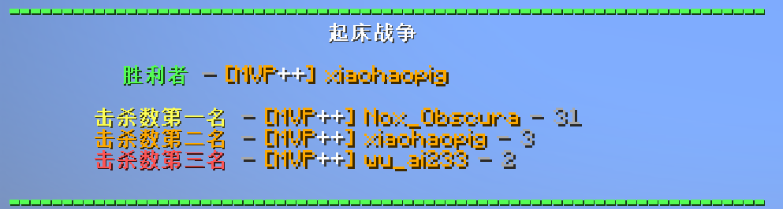

<FeatureHead
    title = "Ranking based on scoreboard score"
    authorName = "Nox_Obscura"
    resourceLink = 'https://b23.tv/gBF3viI'/>

## Introduction:
Server mini-games always have a link to display rankings, but the scoreboard does not provide an interface for output sorting, so we must implement it ourselves. This article provides a very effective sorting method, which may be helpful to small game authors.

## Features:
1: Supports unlimited number of people, unlimited score size, and fast calculation speed.  
2: The idea and method are simple and suitable for beginners.  
3: It is considered the first release on the entire network. No similar content has been found before release [only the Bedrock version and the calculation method with entity]

## Idea analysis:
(Required scoreboard: score, temp, ranked)
(The virtual player used in calculations is usually preceded by "." to distinguish the real player [Important], such as ".Ranked" and ".Result" appearing below)

1. First of course, we need a target scoreboard, which we call "score" and let it store the player's score.
2. Secondly, in order not to destroy the score scoreboard data, we need a cache scoreboard to operate, recorded as "temp", and copy the score score to temp.  
3. Use recursion to subtract points from the temp scoreboards of all players. The one that reaches 0 first is the one with the lowest ranking, and stores it in the scoreboard "ranked" for statistical ranking.  
4. By analogy, when all playertemp scoreboards are reset to zero, the one with the most ranked scoreboard points will be the highest ranked.  
5. Make the virtual player.Ranked score = the score of the highest-ranked player, add .Result to count the number of players participating in the ranking, and an .Opposite virtual player to perform reverse selection.  
6. When there is a player score = .Ranked score, output the .Opposite score (because it is an inverse selection, so it will start from 1), and make the .Opposite score + 1, .Ranked score - 1 to find the second-ranked player, and so on.  
7. When the .Opposite score is consistent with the .Result score, it means that all players have been ranked. Just clear the data of all other scoreboards except the score scoreboard.

## Implementation example
This data pack is just a "wheel" that can be changed and added to your own mini-game. I also added this data pack to my own War of Resistance data pack after making this data pack, and the effect is remarkable!

