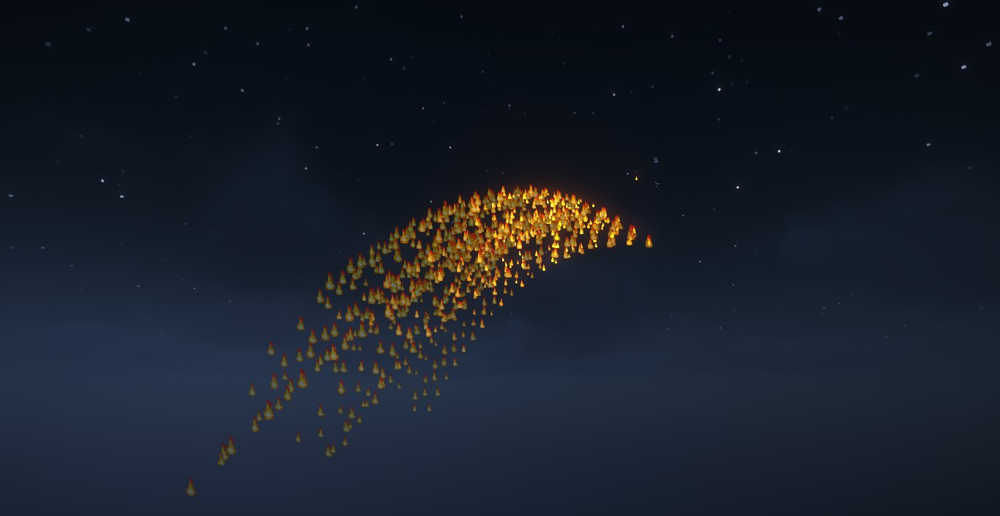
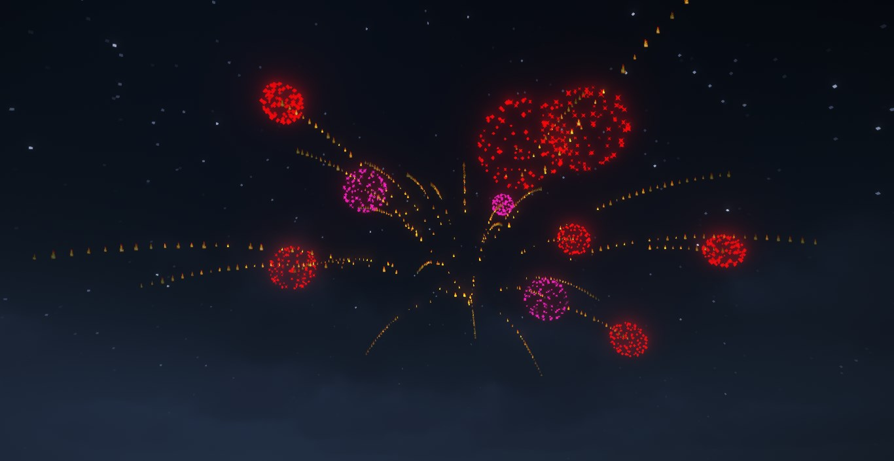
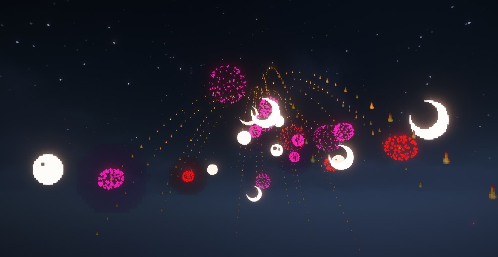
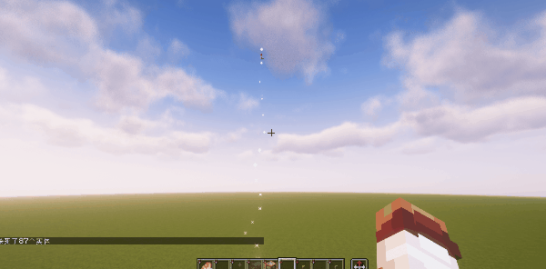

::: tip Translation notice
This page was translated with machine translation and may contain inaccuracies. If you can help improve it, please open an issue or submit a pull request.
:::

<!-- markdownlint-disable MD033 MD041 -->
<FeaturedHead
    title = "Fireworks are coming!"
    authorName = "SKSAMA"
    resourceLink = 'https://ymqlgthbsakuradream.github.io/posts/minecraft/Archive.20250416.html'
    cover='../../../../../feature/archive/202505/_assets/1.jpg'
/>

There were no fireworks in this year's Hailantern Festival, which was a pity, so I planned to make a fireworks data pack in MC, but it was postponed to April (

## Demo

Using the API function provided by the data pack, you can easily create fireworks. The data pack provides a number of optional parameters to enrich the fireworks effect\
See the end of the article for detailed parameter descriptions

First of all, by setting different physical properties and condition restrictions, different parabolic diffusion effects can be made\
Doing so will generate a number of parabolas, the number of which is controlled by the parameter `n`\
The parameter `t` controls the existence time of each parabola.
```mcfunction
function sklibs:skfirework/fx/spread {
　 config:{
　　　yaw:[-50,-10],
　　　pitch:[30, 80],
　　　t: [20,60],
　　　n: 60,
　　　v: 0.5,
　　　g: 0.04,
　　　tick_cmdv:[{cmd:"particle flame ~ ~ ~ 0 0 0 0 1 force"}]
　　　cmdv:[]
　 }
}
```

v=0.5 g=0.01\


v=0.5 g=0.04\


v=0.5 g=0.04 yaw∈[-50,-10] pitch∈[30,80]\


Then, let each parabola generate fireworks when the existing time decreases to 0
```mcfunction
function sklibs:skfirework/fx/spread {
　 config:{
　　　yaw:[-50,-10],
　　　pitch:[30, 80],
　　　t: [20,60],
　　　n: 60,
　　　v: 0.5,
　　　g: 0.04,
　　　tick_cmdv: [{cmd:"particle flame ~ ~ ~ 0 0 0 0 1 force"}],
　　　cmdv: [{
　　　　cmd: "function sklibs:skfirework/fx/firework",
　　　　args:{
　　　　　 config:{
　　　　　　　shape: 0,
　　　　　　　colors: [{from:[I;13047173],to:[I;16761035]},{from:[I;16711680],to:[I;10824234]}],
　　　　　　　n: 1
　　　　　 }
　　　　}
　　　}]
　 }
}
```


It can be observed that the above command adds the following parameters
When the existing time of the parabola is reduced to 0, the function event in the parameter `cmdv`will be executed, and the`sklibs:skfirework/fx/firework`function will be called to generate fireworks, where`args` is the parameter of the function
```snbt
cmdv:[{
　 cmd:"function sklibs:skfirework/fx/firework",
　 args:{
　　　config:{
　　　　shape:0,
　　　　colors:[{from: [I;13047173],to: [I;16761035]},{from: [I;16711680],to: [I;10824234]}],
　　　　n:1
　　　}
　 }
}]
```

The effect is as shown in the figure\


At this time, our fireworks will explode instantly when the command is executed, but the fireworks should rise a certain distance before exploding. Use the launch function to control the delay of the fireworks.
```mcfunction
function sklibs:skfirework/fx/launch {
　 config: {
　　　life: 50,
　　　cmdv: [
　　　　{
　　　　　 cmd: "function sklibs:skfirework/fx/spread",
　　　　　 args: {
　　　　　　　config: {
　　　　　　　  n: 30,
　　　　　　　　v: 0.5,
　　　　　　　　g: 0.04,
　　　　　　　　tick_cmdv: [{cmd:"particle flame ~ ~ ~ 0 0 0 0 1 force"}],
　　　　　　　　cmdv: [
　　　　　　　　　 {
　　　　　　　　　 cmd: "function sklibs:skfirework/fx/firework",
　　　　　　　　　 args: {
　　　　　　　　　　　config: {
　　　　　　　　　　　　shape: 0,
　　　　　　　　　　　　colors: [
　　　　　　　　　　　　　 {from: [I;13047173],to: [I;16761035]},
　　　　　　　　　　　　　 {from: [I;16711680],to: [I;10824234]}
　　　　　　　　　　　　],
　　　　　　　　　　　　n: 1
　　　　　　　　　　　}
　　　　　　　　　 }
　　　　　　　　}]
　　　　　　　}
　　　　　 }
　　　　}]
　　　}
　 }
```

Example: Add TNT explosion effects and sound effects to fireworks\

```mcfunction
function sklibs:skfirework/fx/launch {
　 config:{
　　　life: 50,
　　　cmdv: [
　　　　{cmd: "playsound minecraft:entity.firework_rocket.large_blast ambient @a ~ ~ ~ 1000"},
　　　　{cmd: "summon tnt ~ ~ ~"},
　　　　{cmd: "summon tnt ~ ~ ~"},
　　　　{cmd: "summon tnt ~ ~ ~"},
　　　　{cmd: "summon tnt ~ ~ ~"},
　　　　{cmd: "function sklibs:skfirework/fx/spread",
　　　　args: {config: {
　　　　　 n: 30,
　　　　　 v: .5,
　　　　　 g: 0.04,
　　　　　 tick_cmdv: [{cmd:"particle flame ~ ~ ~ 0 0 0 0 1 force"}],
　　　　　 cmdv: [
　　　　　　　{cmd: "summon tnt ~ ~ ~"},
　　　　　　　{cmd: "function sklibs:skfirework/fx/firework",
　　　　　　　args: {config:{
　　　　　　　shape: 0,
　　　　　　　colors: [{from:[I;13047173],to:[I;16761035]},{from:[I;16711680],to:[I;10824234]}],
　　　　　　　n: 1
　　　　　 }}}]
　　　}}}]
　 }
}
```


Example: Fireworks that can diffuse twice
```mcfunction
function sklibs:skfirework/fx/launch {
　 config: {
　　　life: 30,
　　　cmdv: [
　　　　{cmd: "playsound minecraft:entity.firework_rocket.large_blast ambient @a ~ ~ ~ 1000"},
　　　　{cmd: "function sklibs:skfirework/fx/spread",
　　　　args: {config: {
　　　　　 t: [40,70],
　　　　　 n: 6,
　　　　　 v: 1,
　　　　　 g: 0.02,
　　　　　 tick_cmdv: [{cmd:"particle dragon_breath ~ ~ ~ 0 0 0 0 1 force"}],
　　　　　 cmdv: [
　　　　　　　{cmd: "playsound minecraft:entity.firework_rocket.large_blast ambient @a ~ ~ ~ 1000"},
　　　　　　　{cmd: "summon tnt ~ ~ ~"},
　　　　　　　{cmd: "function sklibs:skfirework/fx/spread",
　　　　　　　args: {config: {
　　　　　　　　n: 30,
　　　　　　　　v: 0.5,
　　　　　　　　g: 0.01,
　　　　　　　　tick_cmdv: [{cmd:"particle flame ~ ~ ~ 0 0 0 0 1 force"}],
　　　　　　　　cmdv: [
　　　　　　　　　 {cmd: "function sklibs:skfirework/fx/firework",
　　　　　　　　　 args: {config: {
　　　　　　　　　 shape: 0,
　　　　　　　　　 twinkle: 1,
　　　　　　　　　 colors: [{from:[I;13047173],to:[I;16761035]},{from:[I;16766720],to:[I;16777184]}],
　　　　　　　　　 n: 1
　　　　　　　　}}}]
　　　　　 }}}]
　　　}}}]
　 }
}
```


Example: Pig Fireworks (loved to hear\

```mcfunction
function sklibs:skfirework/fx/launch {
　 config: {
　　　life: 30,
　　　cmdv: [
　　　　{cmd: "playsound minecraft:entity.firework_rocket.large_blast ambient @a ~ ~ ~ 1000"},
　　　　{cmd: "function sklibs:skfirework/fx/spread",
　　　　args: {config: {
　　　　　 n: 30,
　　　　　 v: 0.5,
　　　　　 g: 0.01,
　　　　　 tick_cmdv: [{cmd:"particle end_rod ~ ~ ~ 0 0 0 0 1 force"}],
　　　　　 cmdv: [
　　　　　　　{cmd: "summon pig ~ ~ ~ {CustomName:\"猪猪\",CustomNameVisible:true}"},
　　　　　　　{cmd: "function sklibs:skfirework/fx/firework",
　　　　　　　args: {config: {
　　　　　　　shape: 0,
　　　　　　　colors: [{from:[I;13047173],to:[I;16761035]},{from:[I;16766720],to:[I;16777184]}],
　　　　　　　n: 1
　　　　　 }}}]
　　　}}}]
　 }
}
```


## data pack download

Game version: 1.21.4\
data pack version 1.0

[1.21.4_SK_Firework_1.0.zip](https://ymqlgthbsakuradream.github.io/posts/minecraft/Archive.20250416/1.21.4_SK_Firework_1.0.zip)\
[1.21.4_SK prepackage_Alpha.zip](https://ymqlgthbsakuradream.github.io/posts/minecraft/Archive.20250416/1.21.4_SK%E5%89%8D%E7%BD%AE%E5%8C%85_Alpha.zip)\
(Regarding the front-end package, it is currently under development. I will write an article to introduce it after it is basically completed)

## APIfunction

`sklibs:skfirework/fx/launch`
Fireworks start function, used to create the lift-off stage of fireworks

<div class="nbttree">

<node type="compound" name="config" />function parameters
- <node type="int" name="life" />Lift-off time (tick)
- <node type="homolist" name="cmdv" />command executed after the lift-off time delay has expired
  - <node type="compound" name="(list element)" :colon="false" />
**Common tags for function objects**

    - <node type="string" name="cmd" />The function that needs to be executed
    - <node type="compound" name="args" />function parameters


</div>

`sklibs:skfirework/fx/spread`\
Fireworks diffusion function
<div class="nbttree">

<node type="compound" name="config" />function parameters
- <node type="int" name="n" />Quantity
- <node type="homolist" name="yaw" />Yaw angle random range, default [-180, 180]
- <node type="homolist" name="pitch" />Pitch angle random interval, default [-90, -20]
- <node type="homolist" name="t" />Delay random interval, default [20,60]
- <node type="double" name="v" />Initial velocity (grid/tick), default 0.4d
- <node type="double" name="g" />Gravity acceleration (grid/tick), default 0.01d
- <node type="homolist" name="cmdv" />Command executed after the delay ends
  - <node type="compound" name="(list element)" :colon="false" />
**Common tags for function objects**

    - <node type="string" name="cmd" />The function that needs to be executed
    - <node type="compound" name="args" />function parameters

- <node type="homolist" name="tick_cmdv" />The command executed every tick during the delay period
  - <node type="compound" name="(list element)" :colon="false" />
**Common tags for function objects**

    - <node type="string" name="cmd" />The function that needs to be executed
    - <node type="compound" name="args" />function parameters


</div>

`sklibs:skfirework/fx/firework`\
Fireworks generation function, generates vanilla fireworks of the specified style according to parameters
<div class="nbttree">

<node type="compound" name="config" />function parameters
- <node type="int" name="life" />Fireworks display delay (default is 0)
- <node type="homolist" name="colors" />Random colors
  - <node type="compound" name="(list element)" :colon="false" />
**tags common to random color items**

    - <node type="homolist" name="from" />Initial decimal color HEX code value array, one number in the array represents a color
    - <node type="homolist" name="to" />Gradient to an array of decimal color HEX code values, one number in the array represents a color
    - <node type="int" name="shape" />Firework shape (0: small ball, 1: big ball, 2: star, 3: creeper, 4: explosion)
    - <node type="int" name="trail" />Whether to display the trail
    - Whether <node type="int" name="colors" /> flashes
    - <node type="int" name="colors" />The number of fireworks stacks
    - <node type="homolist" name="tags" />String tag added to fireworks


</div>

