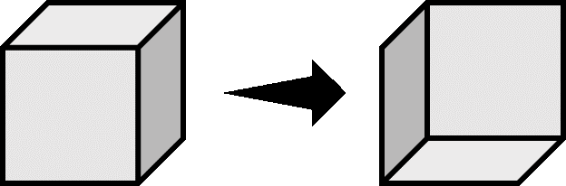
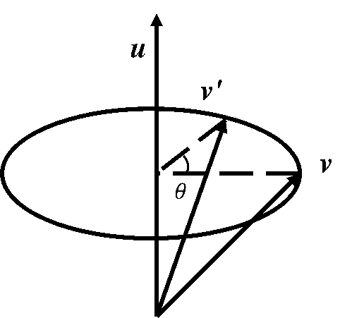

<!-- markdownlint-disable MD033 MD041 -->

<FeatureHead
    title = "Research on Display Entity Rendering Transformations"
    authorName = "Xu Muxian"
    resourceLink = 'https://www.bilibili.com/video/BV1hC5YzAE5w'
    cover='../../../../../feature/archive/202505/_assets/2.png'
/>

## Introduction

Display entities are one of the technical entities of Minecraft, and their role is mainly reflected in the visual aspect. These entities have no collision boxes, do not have any autonomous behavior, and can only be generated through technical means. If you don't specify NBT when generating, nothing will be displayed. Developers of vanilla technology can use the regular fields of the display entity to display some common content, such as normal-shaped blocks, items, and text. However, it would be a bit monotonous if only the display entity is used to display these regular contents. \
Show the entity`transformation`The field is a more complex field in the entity format. It uses matrix form or decomposition form to represent the rendering transformation of the entity, thereby creating some special effects.

## Matrix form

When using matrix form, the fields`transformation`The data type is a list. There are 16 elements in the list, and these elements are all single-precision floating point numbers. This list is used to represent a$4×4$The row-major order affine transformation matrix of . In order to express the transformation of points in the three-dimensional space in matrix form, the original space is mapped to the affine space. For each point in the three-dimensional space$(x_0,y_0,z_0)$, add a$1$To represent a point in affine space, that is$(x_0,y_0,z_0,1)$. Let the point undergo a certain affine transformation$\boldsymbol{A}$located after$(x',y',z',1)$, then it is written in the form of matrix multiplication:$$
\left[\begin{matrix}
  x'\\y'\\z'\\1
\end{matrix}\right]=\left[\begin{matrix}
  a_{11}&a_{12}&a_{13}&a_{14}\\
  a_{21}&a_{22}&a_{23}&a_{24}\\
  a_{31}&a_{32}&a_{33}&a_{34}\\
  a_{41}&a_{42}&a_{43}&a_{44}\\
\end{matrix}\right]\left[\begin{matrix}
  x_0\\y_0\\z_0\\1
\end{matrix}\right]
$$Basic transformation forms include translation, rotation, scaling (mirror), and shearing. All transformations are based on the actual coordinates of the entity.

### Panning

Assume that any point on the display entity$(x_0,y_0,z_0,1)$exist$x$、$y$、$z$Axis translation respectively$a$、$b$、$c$get points after$(x',y',z',1)$,but$$\left\{\begin{matrix*}[l]
  x'&=&x_0&&&&&+&a\\
  y'&=&&&y_0&&&+&b\\
  z'&=&&&&&z_0&+&c\\
  1&=&&&&&&&1
\end{matrix*}\right.$$Then the translation matrix$\boldsymbol{T}$for$$\boldsymbol{T}(a,b,c)=\left[\begin{matrix}
  1&0&0&a\\
  0&1&0&b\\
  0&0&1&c\\
  0&0&0&1
\end{matrix}\right]
$$
### Rotate

There are three ways of rotation, namely around$x$axis, around$y$axis and winding$z$axis rotation. to go around$x$axis rotation$\alpha$For example, assume that the entity has a point$A$and entity anchor point$O$The straight line formed by$z$The angle between the axes is$\varphi$,make$\overrightarrow{OA}$The modulus is$l$, then there is$$\left\{\begin{array}{l}
  x=x\\
  y=l\cos{\varphi}\\
  z=l\sin{\varphi}
\end{array}\right.
$$

$\overrightarrow{OA}$around$x$axis rotation$\alpha$get$\overrightarrow{OA'}$, at this time there is$$\left\{\begin{array}{l}
  x'=x\\
  y'=l\cos(\varphi+\alpha)=l\cos\varphi\cos\alpha-l\sin\varphi\sin\alpha\\
  z'=l\sin(\varphi+\alpha)=l\sin\varphi\cos\alpha+l\cos\varphi\sin\alpha
\end{array}\right.
$$So there is$$\left\{\begin{array}{l}
  x'=x\\
  y'=y\cos\alpha-z\sin\alpha\\
  z'=y\sin\alpha+z\cos\alpha
\end{array}\right.
$$Convert it to an affine matrix and get$$\boldsymbol{R}_{x}(\alpha)=\left[\begin{matrix}
1&0&0&0\\
0&\cos{\alpha}&-\sin{\alpha}&0\\
0&\sin{\alpha}&\cos{\alpha}&0\\
0&0&0&1
\end{matrix}\right]
$$In the same way, around$y$axis rotation$\beta$The matrix form of$$\boldsymbol{R}_{y}(\beta)=\left[\begin{matrix}
  \cos{\beta}&0&\sin{\beta}&0\\
  0&1&0&0\\
  -\sin{\beta}&0&\cos{\beta}&0\\
  0&0&0&1
\end{matrix}\right]
$$around$z$axis rotation$\gamma$The matrix form of$$\boldsymbol{R}_{z}(\gamma)=\left[\begin{matrix}
  \cos{\gamma}&-\sin{\gamma}&0&0\\
  \sin{\gamma}&\cos{\gamma}&0&0\\
  0&0&1&0\\
  0&0&0&1
\end{matrix}\right]
$$
### Zoom

Assume that any point on the display entity$(x_0,y_0,z_0,1)$along$x$、$y$、$z$Axis scaled separately$m$、$n$、$p$Get points after doubling$(x',y',z',1)$,but$$\left\{\begin{matrix*}[l]
  x'&=&mx_0&&&&&&\\
  y'&=&&&ny_0&&&&\\
  z'&=&&&&&pz_0&&\\
  1&=&&&&&&&1
\end{matrix*}\right.
$$Then the scaling matrix$\boldsymbol{S}$for$$\boldsymbol{S}(m,n,p)=\left[\begin{matrix}
  m&0&0&0\\
  0&n&0&0\\
  0&0&p&0\\
  0&0&0&1
\end{matrix}\right]
$$like$m=n=p$, it is uniform scaling; otherwise, it is non-uniform scaling.

### Mirror

For a scaling matrix, in particular, if$m$、$n$、$p$If at least one of the three is negative, a mirror transformation will be performed. Negative scaling factors invert the coordinate system on the corresponding axis and change the direction of the surface normal, resulting in concave rendering. \

\

If you display any point on the entity$(x_0,y_0,z_0,1)$along$x$Axis mirroring, no changes in other directions, easy to get the mirror matrix$$
\boldsymbol{M}_{x}(m)=\left[\begin{matrix}
  m&0&0&0\\
  0&1&0&0\\
  0&0&1&0\\
  0&0&0&1
\end{matrix}\right]
$$in$m&lt;0$. The same principle can be followed$y$axis mirror, along$z$axis mirror matrix$\boldsymbol{M}_{y}(n)$、$\boldsymbol{M}_{z}(p)$. Mirror transformations in multiple directions also
It is easy to derive, for example, in$x$axis,$y$axis, and$z$The matrix required to apply mirror transformation simultaneously in the axis direction ($m&lt;0$，$n&lt;0$，$p&lt;0$)for$$
\boldsymbol{M}_{x,y,z}(m,n,p)=\left[\begin{matrix}
  m&0&0&0\\
  0&n&0&0\\
  0&0&p&0\\
  0&0&0&1
\end{matrix}\right]
$$
### Cut

The shear transformation moves all points on the entity in a certain direction. The distance of any point on the straight line passing through the origin in that direction changes linearly with the distance between the straight line and the origin, which makes the image tilt. A shear transformation occurs in a plane composed of two orthogonal coordinate axes, with shearing in one direction and no transformation in the other direction. There are six pairs of orthogonal relationships between coordinate axes in the three-dimensional coordinate system, so there are six elementary shear transformations.


As shown in the figure, when the image is sheared in one direction, it actually has a shearing angle with the other direction.$\theta_{i,j}$, subscript ($i,j$) represents the$i$Cut in the direction and match$j$The direction is at a certain shear angle. If the horizontal direction in the figure is$x$axis, the longitudinal direction is$y$axis, the shear angle is recorded as$\theta_{x,y}$, obviously there are$$\left\{\begin{matrix*}[l]
  x'&=&x_0+&y_{0}\tan{\theta_{x,y}}&&&&\\
  y'&=&&y_0&&&&\\
  z'&=&&&&z_0&&\\
  1&=&&&&&&&1
\end{matrix*}\right.
$$but$x$Make shear in the axial direction and connect it with$y$The matrix required for a certain shear angle in the axis direction$\boldsymbol{H}$for$$
\boldsymbol{H}(\theta_{x,y})=\left[\begin{matrix}
  1&\tan{\theta_{x,y}}&0&0\\
  0&1&0&0\\
  0&0&1&0\\
  0&0&0&1
\end{matrix}\right]
$$In the same way, the matrices required for the other six shear transformations can be derived. When the direction of the shear transformation is$x$axis, element$\tan{\theta_{i,j}}$must be located in the first row of the matrix,$y$The axis is the second row,$z$The axis is the third row; the direction at a shear angle to the transformation direction is$x$axis, element$\tan{\theta_{i,j}}$Must be in the first column,$y$The axis is the second column,$z$The axis is the third column. For example, a clipping transformation in$z$axis direction, and$x$The axis direction is at a shear angle, then$\tan{\theta_{z,x}}$Located in the third row and first column. \
The shear matrices described above only transform in one direction and form a certain shear angle with the other direction. If multiple different shear transformations are applied at the same time and the elements are filled in using the above rules, the shear matrix can be recorded as$$
\boldsymbol{H}(\theta_{x,y},\theta_{x,z},\theta_{y,x},\theta_{y,z},\theta_{z,x},\theta_{z,y})=\left[\begin{matrix}
  1&\tan{\theta_{x,y}}&\tan{\theta_{x,z}}&0\\
  \tan{\theta_{y,x}}&1&\tan{\theta_{y,z}}&0\\
  \tan{\theta_{z,x}}&\tan{\theta_{z,y}}&1&0\\
  0&0&0&1
\end{matrix}\right]
$$If the shear transformation in a certain direction is not used, the corresponding position in the matrix will be$\tan{\theta_{i,j}}$written as$0$That’s it.

### Combination Transformation

One transformation may not suffice, and sometimes multiple transformations need to be applied simultaneously to represent complex transformations. For a finite number of affine transformations$\boldsymbol{A}_1$、$\boldsymbol{A}_2$、……$\boldsymbol{A}_n$, apply them to one point in turn$\boldsymbol{x}$, then the point obtained after transformation$\boldsymbol{x'}$for$$
\boldsymbol{x'}=\boldsymbol{A}_{n}\boldsymbol{A}_{n-1}\cdots\boldsymbol{A}_{2}\boldsymbol{A}_{1}\boldsymbol{x}
$$Note that matrix multiplication follows the operation rules from right to left and does not support commutative law, but supports associative law, so there is$$
\boldsymbol{x'}=(\boldsymbol{A}_{n}\boldsymbol{A}_{n-1}\cdots\boldsymbol{A}_{2}\boldsymbol{A}_{1})\boldsymbol{x}
$$make$\boldsymbol{A}=\boldsymbol{A}_{n}\boldsymbol{A}_{n-1}\cdots\boldsymbol{A}_{2}\boldsymbol{A}_{1}$,but$\boldsymbol{x}=\boldsymbol{A}\boldsymbol{x'}$,in$\boldsymbol{A}$is the combined transformation matrix. The order of various transformations in a combined transformation is very important, as the previous transformation may affect the result of the next transformation.

in tag`transformation`The matrices used in are all combined transformation matrices.

### Application examples

Modify a block to display the NBT data of the entity so that it flows around the$y$axis rotation$30^{\circ}$, around$x$axis rotation$45^{\circ}$, around$z$axis rotation$90^{\circ}$.
Find the combined transformation matrix, paying attention to the calculation from right to left:$$
\begin{align}
  \boldsymbol{A}&=\boldsymbol{R}_{z}(90^{\circ})\boldsymbol{R}_{x}(45^{\circ})\boldsymbol{R}_{y}(30^{\circ})\nonumber\\
  &=\left[\begin{matrix}\cos{90^{\circ}}&-\sin{90^{\circ}}&0&0\\\sin{90^{\circ}}&\cos{90^{\circ}}&0&0\\0&0&1&0\\0&0&0&1\end{matrix}\right]\left[\begin{matrix}1&0&0&0\\0&\cos{45^{\circ}}&-\sin{45^{\circ}}&0\\0&\sin{45^{\circ}}&\cos{45^{\circ}}&0\\0&0&0&1\end{matrix}\right]\left[\begin{matrix}\cos{30^{\circ}}&0&\sin{30^{\circ}}&0\\0&1&0&0\\-\sin{30^{\circ}}&0&\cos{30^{\circ}}&0\\0&0&0&1\end{matrix}\right]\nonumber\\
  &=\left[\begin{matrix}-\cfrac{\sqrt{2}}{4}&-\cfrac{\sqrt{2}}{2}&\cfrac{\sqrt{6}}{4}&0\\\cfrac{\sqrt{3}}{2}&0&\cfrac{1}{2}&0\\-\cfrac{\sqrt{2}}{4}&\cfrac{\sqrt{2}}{2}&\cfrac{\sqrt{6}}{4}&0\\0&0&0&1\end{matrix}\right]\approx\left[\begin{matrix}-0.35&-0.71&0.61&0\\0.87&0&0.5&0\\-0.35&0.71&0.61&0\\0&0&0&1\end{matrix}\right]\nonumber
\end{align}
$$Therefore, command should be

```mcfunction
data merge entity @e[type=block_display,limit=1] {transformation:[-0.35f,-0.71f,0.61f,0.0f,0.87f,0.0f,0.5f,0.0f,-0.35f,0.71f,0.61f,0.0f,0.0f,0.0f,0.0f,1.0f]}
```
## Decomposed form

for these$4\times 4$affine transformation matrix of size$\boldsymbol{A}$, whose elements$a_{41}$、$a_{42}$、$a_{43}$is always 0,$a_{44}$is always 1, if not 1, the entire matrix is$\cfrac{1}{a_{44}}$scaling, so that$a_{44}$is 1. It can be written in blocks as follows:$$
\boldsymbol{A}=\left[\begin{array}{ccc|c}
  a_{11}&a_{12}&a_{13}&a_{14}\\
  a_{21}&a_{22}&a_{23}&a_{24}\\
  a_{31}&a_{32}&a_{33}&a_{34}\\
  \hline
  a_{41}&a_{42}&a_{43}&a_{44}\\
\end{array}\right]=\left[\begin{matrix}
  \boldsymbol{B}_{3\times 3}&\boldsymbol{T}_{3\times 1}\\
  \boldsymbol{O}_{1\times 3}&\boldsymbol{E}_{1\times 1}\\
\end{matrix}\right]
$$The block array in the formula$\boldsymbol{B}$It's the upper left corner$3\times 3$Area, this area represents the linear transformation of the model, and stores all linear transformation data including rotation, scaling, mirroring and shearing. Note that this block array is not suitable for translation transformation, because translation transformation is not a linear transformation. And the block array$\boldsymbol{T}$The three elements of are used only by translation transformations. \
decomposed form`transformation`Field is a block array$\boldsymbol{B}$Data used after singular value decomposition. For any square matrix of order 3$\boldsymbol{B}$, there is always a third-order orthogonal square matrix$\boldsymbol{U}$and$\boldsymbol{V}$, 3rd order diagonal matrix$\boldsymbol{\varSigma}$,have$$
\boldsymbol{B}=\boldsymbol{U\varSigma}\boldsymbol{V}^\mathrm{T}
$$In the formula:\$\boldsymbol{V}^\mathrm{T}$--matrix$\boldsymbol{V}$the transposed matrix. \
say$\boldsymbol{U}$is the left singular vector matrix,$\boldsymbol{V}$is the right singular vector matrix, diagonal matrix$\boldsymbol{\varSigma}$The three elements on the middle diagonal are called singular values. The calculation method of singular value decomposition is introduced below. \
Taking the transposed matrix on the left and right sides of the equal sign in the above equation, we get$$\boldsymbol{B}^\mathrm{T}=\boldsymbol{V\varSigma}\boldsymbol{U}^\mathrm{T}$$Because of the square matrix$\boldsymbol{U}$and$\boldsymbol{V}$is orthogonal, therefore$\boldsymbol{V}^\mathrm{T}\boldsymbol{V}=\boldsymbol{E}$、$\boldsymbol{U}^\mathrm{T}\boldsymbol{U}=\boldsymbol{E}$. then there is$$\boldsymbol{B}\boldsymbol{B}^\mathrm{T}=\boldsymbol{U\varSigma}\boldsymbol{V}^\mathrm{T}\boldsymbol{V\varSigma}\boldsymbol{U}^\mathrm{T}=\boldsymbol{U}\boldsymbol{\varSigma}^{2}\boldsymbol{U}^\mathrm{T}$$Transform the above formula:$$\boldsymbol{U}^\mathrm{T}(\boldsymbol{B}\boldsymbol{B}^\mathrm{T})\boldsymbol{U}=\boldsymbol{\varSigma}^{2}$$phalanx$\boldsymbol{B}\boldsymbol{B}^\mathrm{T}$is a real symmetric matrix, obviously the above formula describes the$\boldsymbol{B}\boldsymbol{B}^\mathrm{T}$Similar diagonalization process, where$\boldsymbol{\varSigma}=\left[\begin{matrix}\sigma_1&&\\&\sigma_2&\\&&\sigma_3\end{matrix}\right]$, the orthogonal matrix used is the left singular vector matrix$\boldsymbol{U}$. If you remember$\lambda_1$、$\lambda_2$、$\lambda_3$yes$\boldsymbol{B}\boldsymbol{B}^\mathrm{T}$The three eigenvalues ​​of , these eigenvalues ​​are non-negative, readers can prove by themselves, so we have$$\boldsymbol{\varSigma}^{2}=\left[\begin{matrix}\lambda_1&&\\&\lambda_2&\\&&\lambda_3\end{matrix}\right]=\left[\begin{matrix}\sigma_1^2&&\\&\sigma_2^2&\\&&\sigma_3^2\end{matrix}\right]$$find out$\boldsymbol{B}\boldsymbol{B}^\mathrm{T}$The diagonal matrix can be obtained by the three eigenvalues ​​of$\boldsymbol{\varSigma}$. therefore,$\boldsymbol{\varSigma}$and$\boldsymbol{U}$The solution steps are as follows——\
Step 1:\
From the characteristic equation$\left\lvert\lambda\boldsymbol{E}-\boldsymbol{B}\boldsymbol{B}^\mathrm{T}\right\rvert=0$beg$\boldsymbol{B}\boldsymbol{B}^\mathrm{T}$All eigenvalues ​​of$\lambda_i$, and then find the diagonal matrix$\boldsymbol{\varSigma}=\mathrm{diag}(\sigma_1,\sigma_2,\sigma_3)=\mathrm{diag}(\sqrt{\lambda_1},\sqrt{\lambda_2},\sqrt{\lambda_3})$. \
Step 2:\
For each eigenvalue$\lambda_i$, by the system of equations$(\lambda_{i}\boldsymbol{E}-\boldsymbol{B}\boldsymbol{B}^\mathrm{T})\boldsymbol{x}=\boldsymbol{0}$Find the corresponding feature vector$\boldsymbol{\alpha_i}$. \
Step 3: \
If the obtained eigenvectors are not orthogonal to each other, then for the eigenvectors$\boldsymbol{\alpha_i}$Perform orthogonalization, and record the vector after orthogonalization as$\boldsymbol{\beta_i}$. \
Step 4:\
If the vector obtained$\boldsymbol{\beta_i}$If there is no unitization, then unitize it as$\boldsymbol{\gamma_i}$,make$\boldsymbol{U}=\left[\gamma_1,\gamma_2,\gamma_3\right]$. Calculation completed. \
For the right singular vector matrix$\boldsymbol{V}$,have$$\boldsymbol{B}^\mathrm{T}\boldsymbol{B}=\boldsymbol{V\varSigma}\boldsymbol{U}^\mathrm{T}\boldsymbol{U\varSigma}\boldsymbol{V}^\mathrm{T}=\boldsymbol{V}\boldsymbol{\varSigma}^{2}\boldsymbol{V}^\mathrm{T}$$In the same way, the right singular vector matrix can be obtained. The calculation steps are the same as the above steps for calculating the left singular vector matrix, where$\boldsymbol{\varSigma}$It is the same matrix as above, so there is no need to repeat the calculation. like$\boldsymbol{B}$reversible, then$$\boldsymbol{V}=\boldsymbol{B}^{-1}\boldsymbol{U\varSigma}$$In this way, the right singular vector matrix can be directly obtained without performing diagonalization calculations.$\boldsymbol{V}$. \
The results of matrix singular value decomposition have geometric meaning, where$\boldsymbol{U}$、$\boldsymbol{V}$is the rotation transformation matrix,$\boldsymbol{\varSigma}$is the scaling transformation matrix. Any transformation can be decomposed into four processes: initial rotation transformation, scaling transformation, second rotation transformation and translation transformation. Therefore, use$\boldsymbol{V}$Represents the initial rotation transformation, use$\boldsymbol{\varSigma}$Represents scaling transformation, use$\boldsymbol{U}$Represents another rotation transformation, and then introduces a translation vector on this basis$\boldsymbol{T}$, then we can get the transformation matrix$\boldsymbol{A}$The decomposed form of , at this time the field`transformation`It is a compound tag:

<div class="nbttree">

<node type="compound" name="transformation" />root tag
- <node type="compound" /><node type="homolist" name="right_rotation" />The rotation transformation before the model is scaled and transformed, that is, the initial rotation transformation. Related to V in singular value decomposition. There are two available data forms: axial angle form and quaternion form. You can use axial angle form when writing, but when storing data, it will always be converted into quaternion form.
- <node type="homolist" name="scale" />The scaling transformation of the model, related to ∑ in singular value decomposition. Use three-dimensional vectors.
- <node type="compound" /><node type="homolist" name="left_rotation" />The rotation transformation after the model is scaled and transformed, that is, rotated again, is related to U in singular value decomposition. There are also two expression methods: axis-angle form and quaternion form. You can use axial angle form when writing, but when storing data, it will always be converted into quaternion form.
- <node type="homolist" name="translation" />The translation transformation T of the model. Corresponds to the elements in the first three rows of the last column of the matrix form. Use three-dimensional vectors.

</div>

for`right_rotation`and`left_rotation`These two fields have two data forms: axis angle form and quaternion form to represent rotation. These two data forms are introduced below:

### Axial angle type

Angular rotation can be understood as: a vector$\boldsymbol{v}$Around an axis of length 1 passing through the origin (i.e. the actual position of the entity)$\boldsymbol{u}$rotation angle$\theta$get vector$\boldsymbol{v}'$. At this time there is$\left\lVert\boldsymbol{u}\right\rVert=1$. \
\
For the convenience of analysis, the vector$\boldsymbol{v}$decomposed into parallel to the axis$\boldsymbol{u}$vector of$\boldsymbol{v}_{\parallel}$and orthogonal to the axis$\boldsymbol{u}$vector of$\boldsymbol{v}_{\perp}$, so there is$$\boldsymbol{v}=\boldsymbol{v}_{\parallel}+\boldsymbol{v}_{\perp}$$\
Will$\boldsymbol{v}_{\parallel}$Use containing$\boldsymbol{v}$and$\boldsymbol{u}$The formula expression of , that is, calculating$\boldsymbol{v}$exist$\boldsymbol{u}$Projection on:$$\boldsymbol{v}_{\parallel}=\left\lVert\boldsymbol{v}_{\parallel}\right\rVert\frac{\boldsymbol{u}}{\left\lVert\boldsymbol{u}\right\rVert}=\frac{(\boldsymbol{u}\cdot\boldsymbol{v})\boldsymbol{u}}{\left\lVert\boldsymbol{u}\right\rVert\left\lVert\boldsymbol{u}\right\rVert}=(\boldsymbol{u}\cdot\boldsymbol{v})\boldsymbol{u}$$So we can get$\boldsymbol{v}_{\perp}$expression$$\boldsymbol{v}_{\perp}=\boldsymbol{v}-\boldsymbol{v}_{\parallel}=\boldsymbol{v}-(\boldsymbol{u}\cdot\boldsymbol{v})\boldsymbol{u}$$for vectors$\boldsymbol{v}'$, which can also be decomposed to get$$\boldsymbol{v}'=\boldsymbol{v}_{\parallel}'+\boldsymbol{v}_{\perp}'$$In fact, in the vector$\boldsymbol{v}$During the rotation process, the vector$\boldsymbol{v}_{\parallel}$No changes occurred, i.e.$$\boldsymbol{v}_{\parallel}'=\boldsymbol{v}_{\parallel}$$\
Now consider the vector$\boldsymbol{v}_{\perp}$of rotation. It is not difficult to find that the rotation of the vector actually occurs on the circumference. At this time, it is orthogonal to$\boldsymbol{u}$There are no other available axes in the plane of the axis, for which construction is simultaneously orthogonal to$\boldsymbol{u}$and$\boldsymbol{v}_{\perp}$axis$\boldsymbol{w}$,have$$\boldsymbol{w}=\boldsymbol{u}\times\boldsymbol{v}_{\perp}$$Depend on$$\left\lVert\boldsymbol{w}\right\rVert=\left\lVert\boldsymbol{u}\times\boldsymbol{v}_{\perp}\right\rVert=\left\lVert\boldsymbol{u}\right\rVert\cdot\left\lVert\boldsymbol{v}_{\perp}\right\rVert\cdot\sin{90^{\circ}}=\left\lVert\boldsymbol{v}_{\perp}\right\rVert$$Know$\boldsymbol{w}$and$\boldsymbol{v}_{\perp}$are equal, so the vector$\boldsymbol{v}_{\perp}'$can be decomposed into parallel$\boldsymbol{w}$of$\boldsymbol{v}_{\boldsymbol{w}}'$and parallel to$\boldsymbol{v}_{\perp}$of$\boldsymbol{v}_{\boldsymbol{v}}'$,have$$\boldsymbol{v}_{\perp}'=\boldsymbol{v}_{\boldsymbol{w}}'+\boldsymbol{v}_{\boldsymbol{v}}'=\boldsymbol{w}\sin{\theta}+\boldsymbol{v}_{\perp}\cos{\theta}=(\boldsymbol{u}\times\boldsymbol{v}_{\perp})\sin{\theta}+\boldsymbol{v}_{\perp}\cos{\theta}$$so get$$\begin{align}
  \boldsymbol{v}'&=\boldsymbol{v}_{\parallel}'+\boldsymbol{v}_{\perp}'\nonumber\\
  &=\boldsymbol{v}_{\parallel}+(\boldsymbol{u}\times\boldsymbol{v}_{\perp})\sin{\theta}+\boldsymbol{v}_{\perp}\cos{\theta}\nonumber\\
  &=\boldsymbol{v}_{\parallel}+[\boldsymbol{u}\times(\boldsymbol{v}-\boldsymbol{v}_{\parallel})]\sin{\theta}+\boldsymbol{v}_{\perp}\cos{\theta}\nonumber\\
  &=\boldsymbol{v}_{\parallel}+(\boldsymbol{u}\times\boldsymbol{v})\sin{\theta}+\boldsymbol{v}_{\perp}\cos{\theta}\nonumber\\
  &=(\boldsymbol{u}\cdot\boldsymbol{v})\boldsymbol{u}+(\boldsymbol{u}\times\boldsymbol{v})\sin{\theta}+[\boldsymbol{v}-\boldsymbol{v}_{\parallel}=\boldsymbol{v}-(\boldsymbol{u}\cdot\boldsymbol{v})\boldsymbol{u}]\cos{\theta}\nonumber\\
  &=(\boldsymbol{u}\cdot\boldsymbol{v})\boldsymbol{u}(1-\cos{\theta})+(\boldsymbol{u}\times\boldsymbol{v})\sin{\theta}+\boldsymbol{v}\cos{\theta}\nonumber
\end{align}$$Use axis-angle expression to represent fields when rotating`right_rotation`and`left_rotation`For compound tag:

<div class="nbttree">

<node type="compound" name="xxx_rotation" />left_rotation or right_rotation
- <node type="float" name="angle" />The angle of rotation around the axis, that is, the θ angle, in the angle system.
- <node type="homolist" name="axis" />An ordered array of three elements used to define the rotation axis vector uu. Generally it can be written as a unit vector.

</div>

### Quaternion form
When using quaternion form to represent rotation, the field`right_rotation`and`left_rotation`The type is a list and the data format is:

<div class="nbttree">

<node type="homolist" name="left_rotation" /> or <node type="homolist" name="right_rotation" />: Represents the four elements of the quaternion, in order x, y, z, w.
- <node type="float" name="(list element)" :colon="false" />An element in a quaternion

</div>


All quaternions can be written in the following form:$$q=w+x\boldsymbol{i}+y\boldsymbol{j}+z\boldsymbol{k}$$in$w$、$x$、$y$、$z\in\mathbb{R}$,say$x\boldsymbol{i}+y\boldsymbol{j}+z\boldsymbol{k}$is a quaternion$q$The imaginary part of$w$For the real part. Generally, vectors can be used$q=(w,x,y,z)$to represent a quaternion, or to$(x,y,z)$treated as a vector$\boldsymbol{v}$, representing quaternions in scalar and vector form$q=(w,\boldsymbol{v})$. The modulus of a quaternion is$\left\lVert q\right\rVert=\sqrt{w^2+x^2+y^2+z^2}$, stipulation: when$\left\lVert q\right\rVert=1$, the quaternion is a unit quaternion. At the same time, there is also a provision: when$w=0$When , the quaternion can be called a pure quaternion. \
For the rotation axis and vector in the axis-angle formula, it can be written in the form of pure quaternions, such as$u=(0,\boldsymbol{u})$、$v=(0,\boldsymbol{v})$. So there are:$$v=v_{\parallel}+v_{\perp}$$
$$v'=v_{\parallel}'+v_{\perp}'$$
$v_{\parallel}$The rotation can be expressed as$$v_{\parallel}'=v_{\parallel}$$If$(u\sin{\theta}+\cos{\theta})$treated as a quaternion$q$,Right now$q=(\cos{\theta},\boldsymbol{u}\sin{\theta})$, then we can get$$v_{\perp}'=qv_{\perp}$$Notice that the quaternion q above has the following properties:$$\left\lVert q\right\rVert=\sqrt{\cos^2{\theta}+\boldsymbol{u}\sin{\theta}\cdot\boldsymbol{u}\sin{\theta}}=\sqrt{\cos^2{\theta}+\left\lVert\boldsymbol{u}\right\rVert^{2}\sin^2{\theta}}=1$$This is a unit quaternion. Quaternions generally used for rotation transformation are unit quaternions. \emphasize{Non-unit quaternions will cause the model to be scaled while rotating}. So the vector rotation expressed in quaternion form is$$v'=v_{\parallel}'+v_{\perp}'=v_{\parallel}+qv_{\perp}$$make$q=p^2$,in$p=\left(\cos{\cfrac{\theta}{2}},\boldsymbol{u}\sin{\cfrac{\theta}{2}}\right)$,but$$\begin{align}
  v'&=v_{\parallel}+qv_{\perp}\nonumber\\
  &=pp^{*}v_{\parallel}+p^{2}v_{\perp}\nonumber\\
  &=pv_{\parallel}p^{*}+pv_{\perp}p^{*}\nonumber\\
  &=p(v_{\parallel}+v_{\perp})p^{*}\nonumber\\
  &=pvp^{*}\nonumber
\end{align}$$In the formula:$p^{*}$——Quaternions$p$The conjugate of$p=(w,\boldsymbol{v})$,but$p^{*}=(w,-\boldsymbol{v})$. \
As a result, the rotation formula expressed in quaternion form is obtained:$$v'=qvq^{*}$$in$q=\left(\cos{\cfrac{\theta}{2}},\boldsymbol{u}\sin{\cfrac{\theta}{2}}\right)$. Each element in this quaternion is$w=\cos{\cfrac{\theta}{2}}$，$x=u_{x}\sin{\cfrac{\theta}{2}}$，$y=u_{y}\sin{\cfrac{\theta}{2}}$，$z=u_{z}\sin{\cfrac{\theta}{2}}$\
In the formula:\$\theta$——Around the axis$\boldsymbol{u}$The angle of rotation, the direction is counterclockwise. \$u_{i}$——Rotation axis$\boldsymbol{u}$on the coordinate axis$i$on the weight. \
For a rendering transformation, let the quaternion used for its initial rotation be$q_r$, the quaternion used to rotate again is$q_l$, let the scaled data$s=(s_x,s_y,s_z)$, shift data$t=(t_x,t_y,t_z)$. Display any point on the entity$A(x_0,y_0,z_0)$Construct quaternions$$q_{0}=x_0\boldsymbol{i}+y_0\boldsymbol{j}+z_0\boldsymbol{k}=(0,\overrightarrow{OA})$$Perform the first rotation and get$$q_{1}=q_{r}q_{0}q_{r}^{*}$$Then applying the scaling transformation, we get$$q_{2}=s_{x}q_{1x}\boldsymbol{i}+s_{y}q_{1y}\boldsymbol{j}+s_{z}q_{1z}\boldsymbol{k}$$Under the combined action of the initial rotation and scaling transformation, the relative position of each point in the model will change. Only when rotating the quaternion for the first time$q_r=(1,\boldsymbol{0})$(no rotation occurs) or scale the data$s=(1,1,1)$(without scaling), the model will not deform. After that, the model will determine the final rotation angle based on another rotation transformation, and we get$$q_{3}=q_{l}q_{2}q_{l}^{*}$$Finally, a translation transformation is applied to determine the final position of the model to obtain the point$A$Final position:$$q=q_{3}+t$$
### Application examples
Use block to display entity to display a glass. Requirement: Generate this display entity so that the diagonal line of the glass body is equal to$y$The axes are parallel. Rotate the display entity diagonally around the body, taking 4 seconds to rotate once. \
The diagonal line of the body in the model starts from$O(0,0,0)$arrive$A(1,1,1)$, now we need to make the model transform without deforming$\overrightarrow{OA}$transformed into$(0,1,0)$（$y$axis direction vector) parallel. It is now possible to directly determine the quaternion used to rotate again$q_l$, the quantity to be determined is the rotation angle$\theta$and axis of rotation$\boldsymbol{u}$. \
Calculate the angle of rotation: convert$\overrightarrow{OA}$Unitized, we get$\left(\cfrac{1}{\sqrt{3}},\cfrac{1}{\sqrt{3}},\cfrac{1}{\sqrt{3}}\right)$,therefore$$\theta=\arccos{\left[\left(\frac{1}{\sqrt{3}},\frac{1}{\sqrt{3}},\frac{1}{\sqrt{3}}\right)\cdot(0,1,0)\right]}=\arccos{\frac{1}{\sqrt{3}}}\approx 54.74^{\circ}$$The axis of rotation is perpendicular to the vector before and after rotation, we have$$\boldsymbol{u}=\left(\frac{1}{\sqrt{3}},\frac{1}{\sqrt{3}},\frac{1}{\sqrt{3}}\right)\times (0,1,0)=\left(-\frac{1}{\sqrt{3}},0,\frac{1}{\sqrt{3}}\right)$$convert it into units$\left(-\cfrac{1}{\sqrt{2}},0,\cfrac{1}{\sqrt{2}}\right)$. If using the axial angle form,`left_rotation`The data is:

```snbt
left_rotation:{angle: 54.74f, axis: [-0.71f, 0.0f, 0.71f]}
```
Compute rotated quaternion again$$q=\left(\cos{\cfrac{\theta}{2}},u_{x}\sin{\cfrac{\theta}{2}},u_{y}\sin{\cfrac{\theta}{2}},u_{z}\sin{\cfrac{\theta}{2}}\right)\approx (0.89,-0.33,0,0.33)$$The model does not require initial rotation, scaling and translation, so$q_r=(1,0,0,0)$，$s=(1,1,1)$，$t=(0,0,0)$. decomposed form`transformation`The fields are:

```snbt
transformation:{right_rotation: [0.0f, 0.0f, 0.0f, 1.0f], scale: [1.0f, 1.0f, 1.0f], left_rotation: [-0.33f, 0.0f, 0.33f, 0.89f], translation: [1.0f, 1.0f, 1.0f]}
```
The commands required to generate this display entity are:

```mcfunction
summon block_display ~ ~ ~ {block_state:{Name:"minecraft:glass"},transformation:{right_rotation:[0.0f,0.0f,0.0f,1.0f],scale:[1.0f,1.0f,1.0f],left_rotation:[-0.33f,0.0f,0.33f,0.89f],translation:[1.0f,1.0f,1.0f]}}
```
Field`left_rotation`The value of is defined, and the rotation animation is done by interpolation, which can be`right_rotation`Definition, the quantity to be determined is still the rotation angle$\theta$and axis of rotation$\boldsymbol{u}$. Obviously the axis of rotation is the body diagonal of the block model. At this time, the body diagonal is equal to$y$The axes are parallel, but the transformation is still based on the local coordinate of the model, so the axis vector is$(1,1,1)$, unitized into$\left(\cfrac{1}{\sqrt{3}},\cfrac{1}{\sqrt{3}},\cfrac{1}{\sqrt{3}}\right)$. When making interpolation animations, you can set four fixed rotation angles:$0^{\circ}$、$90^{\circ}$、$180^{\circ}$、$270^{\circ}$, so that the model is cyclically transformed in this order, and the duration of each interpolation is$4\div 4=1$Second$=20$gt. \
by$\theta=90^{\circ}$For example, if the axial angle formula is used, then`right_rotation`The data is

```snbt
right_rotation: {angle: 90, axis: [0.58f, 0.58f, 0.58f]}
```
Convert to quaternion form$q\approx (0.71,0.41,0.41,0.41)$,Right now

```snbt
right_rotation:[0.41f,0.41f,0.41f,0.71f]
```
Same reason$\theta=180^{\circ}$、$\theta=270^{\circ}$、$\theta=0^{\circ}$The data are respectively

```snbt
right_rotation:[0.58f,0.58f,0.58f,0.0f]}
```

```snbt
right_rotation:[0.41f,0.41f,0.41f,-0.71f]}
```

```snbt
right_rotation:[0.0f,0.0f,0.0f,1.0f]}
```
In order to smoothly transition the rotation angle of the model to$\theta=90^{\circ}$, the command for interpolation animation is

```mcfunction
data merge entity @n[type=block_display] {transformation:{right_rotation:[0.41f,0.41f,0.41f,0.71f]},interpolation_duration:20}
```
After the command is executed, apply the command block circuit or function plan so that after 20gt, when the defined interpolation animation ends, the rotation angle of the model begins to smoothly transition to$\theta=180^{\circ}$：
```
mcfunction
data merge entity @n[type=block_display] {transformation:{right_rotation:[0.58f,0.58f,0.58f,0.0f]},interpolation_duration:20}
```
After 20gt, a smooth transition begins to$\theta=270^{\circ}$：
```
mcfunction
data merge entity @n[type=block_display] {transformation:{right_rotation:[0.41f,0.41f,0.41f,-0.71f]},interpolation_duration:20}
```
After 20gt, a smooth transition begins to$\theta=0^{\circ}$：
```
mcfunction
data merge entity @n[type=block_display] {transformation:{right_rotation:[0.0f,0.0f,0.0f,1.0f]},interpolation_duration:20}
```
After 20gt, a smooth transition begins to$\theta=90^{\circ}$, forming a cycle. If the command is executed in the command block circuit, a clock circuit with a period of 80gt can be manufactured. There needs to be a delay of 20gt between each command block, and at least 5 repeaters need to be used. If the command is executed in the function, you can`data\minecraft\function\animation`Created under`90.mcfunction`、`180.mcfunction`、`270.mcfunction`、`0.mcfunction`Four functions. For example, function`90.mcfunction`The content can look like this:

```mcfunction
data merge entity @n[type=block_display] {transformation:{right_rotation:[0.41f,0.41f,0.41f,0.71f]},interpolation_duration:20}
schedule function minecraft:animation/180 20t
```
## References
[1][https://zh.minecraft.wiki/w/展示实体](https://zh.minecraft.wiki/w/?curid=101695)\
[2] [https://krasjet.github.io/quaternion/quaternion.pdf](https://krasjet.github.io/quaternion/quaternion.pdf)\
[3] [https://blog.csdn.net/YiYeZhiNian/article/details/106750302](https://blog.csdn.net/YiYeZhiNian/article/details/106750302)\
[4] [https://zhuanlan.zhihu.com/p/45404840](https://zhuanlan.zhihu.com/p/45404840)\
[5] [https://zhuanlan.zhihu.com/p/183973440](https://zhuanlan.zhihu.com/p/183973440)
