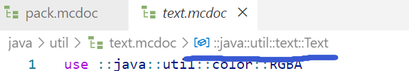

::: tip Translation notice
This page was translated with machine translation and may contain inaccuracies. If you can help improve it, please open an issue or submit a pull request.
:::

<!-- markdownlint-disable MD033 MD041 -->


<FeatureHead
    title = "Spyglass (Dahanbatch) Advanced Instructions"
    authorName = "Dahesor"
/>

## What is Spyglass

Spyglass (i.e. Datapack Helper Plus, DHP or Dahanbatch, hereinafter referred to as `Spyglass`) is a plug-in developed by members of the Minecraft Java Edition community. It mainly supports Vscode and can provide vanilla mod writers with IntelliSense-like support, such as code completion, vulnerability reporting, syntax highlighting, link jumping and other functions. Its founder is SPGoding, and it is now updated and maintained by multiple community members. Don’t tell me you’re not using this plugin—get it installed now!

* Identifier: `spgoding.datapack-language-server`
* [Github page](https://github.com/SpyglassMC/Spyglass)
* [Vscode Marketplace](https://marketplace.visualstudio.com/items?itemName=SPGoding.datapack-language-server)
* [Official Document](https://spyglassmc.com/)

## Spyglass.json file

`spyglass.json` is the configuration file of Spyglass. You can create this JSON file in the root directory to customize the behavior of Spyglass in the current workspace, such as whether to leave spaces in NBT. If you are interested, you can read the documentation.

Today we mainly focus on two parameters under the environment `env`: game version `gameVersion`and dependency file path`dependencies`.

Let’s take a look at `gameVersion` first. example:

```json
{
	"env": {
		"gameVersion": "1.21.5"
	}
}
```

By default, Spyglass will check the `pack.mcmeta`file and find the highest version number among`pack_format`and`supported_formats` inside, as the game version. All grammatical corrections and completions provided by Spyglass will be based on this version.

But as long as you create the `spyglass.json`file in the root directory and write the JSON in the above example into it, no matter how you fill in`pack_format`, Spyglass will use `1.21.5` as the version.

A little digression here. After changing the configuration file, you need to reload Vscode to make it take effect. This requires you to press `Ctrl+P` (`Cmd+P`on Mac) to pop up the window above, enter`>Developer: Reload Window`, find the command `Developer: Reload Window`, and press Enter to execute. Sometimes, Spyglass will have bugs, such as being unable to read the correct version. At this time, you can use the same method to find command`>Spyglass: Reset Project Cache` and try to execute it.

——But more useful than `gameVersion`is`dependencies`. This list allows you to list a series of file paths, and Spyglass will try to read the contents of these paths as a running environment for the data pack you are writing.

For example, sometimes you may decide to use libraries written by others and stuff these libraries into the datapacks folder. However, Spyglass does not know that these libraries provide you with a lot of additional functions, so every time you try to call functions in these libraries, you will see ugly yellow wavy lines to remind you that this function does not exist. What to do? Do this:

```json
{
	"env": {
		"dependencies": [
			"file:///C:/path/.minecraft/saves/WorldName/datapacks/library.zip",
			"@vanilla-datapack",
			"@vanilla-resourcepack",
			"@vanilla-mcdoc"
		],
		"gameVersion": "1.21.5"
	}
}
```

Just write the path to the target library into `dependencies`, and Spyglass will read all the functions, advancements, loot tables, scoreboards, storage, teams... anything you can think of in this package and feed them to the current environment. That is to say, you will be able to get the completion, error correction, etc. of all the content provided by the library in the current data pack. You can even Ctrl+click the link to jump to see what is written in each file, just like this library is stuffed into the current data pack.

By the way, the `@vanilla-XXX` below is the default data, including all vanillatag, loot table, item, entity, blah blah... Be sure to keep it.

By the way, the above path is for Windows. Linux generally does not have a drive letter, similar to `file:///path/to/libs.zip`.

One more thing, Chinese characters and spaces are allowed in the path.

Of course, this data pack, which is regarded as a dependent environment, does not have to be zip-packed; you can also point it directly to a folder.

- -and more! After Spyglass was updated not long ago, support for most resource pack contents was officially added, and now the data pack can be completed with resource pack contents! If you are used to putting `assets`and`data`in the same folder, you may have discovered that now the`translate`of the text component in the data pack or the`item_model` of the item stacking component can already obtain the completion of the language files and item model mapping in the resource pack!

But I am more accustomed to putting resource packs under `resourcepacks`. Is there a way for data pack to get these completions without putting `assets`and`data`once? Of course! Just write the path of the resource pack into`dependencies`:

```json
{
	"env": {
		"dependencies": [
			"file:///C:/path/.minecraft/saves/WorldName/datapacks/library.zip",
			"file:///C:/path/.minecraft/resourcepacks/my_pack/",
			"@vanilla-datapack",
			"@vanilla-resourcepack",
			"@vanilla-mcdoc"
		],
		"gameVersion": "1.21.5"
	}
}
```

Now you can get the translation keys, fonts, item models of the resource pack in the data pack, etc. Help! Unfortunately this is not real-time - the runtime environment is only updated once when Spyglass is initialized. Whenever you modify the resource pack, you need `Developer: Reload Window` to update the data pack environment.

## Powerful mcdoc file

`mcdoc`is a specification file that describes what should be included in Minecraft vanilla data pack and resource pack, JSON or SNBT in different places. For example, mcdoc told Spyglass zombies that there is an NBT called`DrownedConversionTime`, and the type is `int`; the item modifier `set_lore`has a parameter called`entity`, which is a string and must have specific content; or the `providers` in the font file is a list...

A collection of mcdoc files specifying vanilla content is maintained by the Spyglass team at [SpyglassMC/vanilla-mcdoc](https://github.com/SpyglassMC/vanilla-mcdoc). Spyglass will also save a copy on your computer. The default location for Windows is `%localappdata%/spyglassmc-nodejs/Cache/downloader/mc-je/vanilla-mcdoc.tar.gz`. Other operating systems can execute command `Spyglass: Open Cache Folder`and find`./downloader/mc-je/vanilla-mcdoc.tar.gz`.

`mcdoc`is a powerful function - by creating a custom mcdoc file, we can provide completion and error correction for our own Storage, item custom component`custom_data`, custom NBT structure under the marked `data`, etc. As long as you are willing to spend a little time writing a mcdoc document for your own data structure, then when you operate these NBTs in the data pack, you can get the various supports provided by Spyglass just like operating vanillaNBT.

Next, this article will briefly introduce how to implement:

First, you need to install the Mcdoc Syntax Highlighting plug-in, with the identifier `misodee.vscode-mcdoc` ([Marketplace](https://marketplace.visualstudio.com/items?itemName=Misodee.vscode-mcdoc)）。

Secondly, copy a collection of mcdoc files with vanilla content from the above Github or local file, decompress it and open it in a separate Vscode window. These files will become important references for our custom files.

Next, you can create the folder `mcdoc`in the root directory of your data pack. Generally speaking, this folder will be at the same level as your`data` folder (if the data pack is opened directly by Vscode).

Next, you can create a customized `.mcdoc`file in the mcdoc folder. For example, we create a`test.mcdoc`.

## .mcdoc syntax

Due to space limitations, we will not go too deep into how to write mcdoc files, but will only briefly introduce the commonly used parts; for detailed instructions, you can read [Official Documents] (https://spyglassmc.com/user/mcdoc/) or refer to the contents of `vanilla-mcdoc`.

Define compound tags:

```mcdoc
struct myStruct{
}
```

This defines a composite tag called `myStruct` with nothing in it.

If you want to add a key-value pair to a composite tag, you can write it in the form of `key name: value type`. The accepted basic types include `boolean`(Boolean value),`byte`(byte type),`short`(short integer),`int`(integer),`long`(long integer),`float`(single precision floating point),`double`(double precision floating point),`string` (string).

Different tags are separated by commas `,`:

```mcdoc
struct myStruct{
	myInt: int,
	myShort: short,
	myString: string,
}
```

This mcdoc will allow you to write an NBTtag like `{myInt:4, myShort: 7s, myString:"Dahesor"}`.
 * All tags are required by default. To make a tag optional, add `?` after the key name.
 * If you want to limit the range of values, you can add `@min..max`.
 * Adding `#[]`in front of the type can specify specific rules that the value must comply with. For example,`#[id="function"] string`specifies that this string must be the namespaceID of a function. After use, Spyglass will also pop up the completion window for all functions when providing completion, just like when writing the`function`command. There are many specific rules like this, you can find them in`vanilla-mcdoc`.
```mcdoc
struct myStruct{
	myInt: int @ 5..,
	myShort?: short,
	myFunction: #[id="function"] string,
}
```


Here `myShort`is an optional tag, the value of`myInt`should be at least 5, and`myFunction` must be the namespaceID of a function.

If the value is of any type, you can write `any`. If the value is a list, you can use `[]`to surround the individual elements of the list. Supports using`@min..max` to limit list length.

If the value is another `struct`, its name can be referenced, or it can be written directly in it and supports anonymity.

To embed the contents of a `struct`into another`struct`, use the `...structName` format:

```mcdoc
struct myStruct{
	anyThing: any,
	ListOfInt: [int],
	struct_anonymous: struct{
		AnotherList: [short @ ..3] @ 4,
	},
	struct_reference: StructTwo,
	...StructThree
}

struct StructTwo{}
struct StructThree{
	myInt: int,
	myShort: short,
}
```


The `type`type allows you to choose one of multiple value types. Written within brackets`()`and separated by`|`. You can also write it directly in `struct`:
```mcdoc
type myType = (int|string)

struct myStruct{
	value: myType,
	children: (struct{} | boolean)
}
```


The `enum`type requires a selection from multiple given values. You must first declare the type of the value within brackets`()`. Each option is given in the form `name=value`. The `value`is what is actually typed, and the`name` is just something like a pronoun.
It can be declared outside, or written inside and anonymous.

Key names are allowed to reference enums. The format is `[enum]`:

```mcdoc
enum(string) myFood{
	Apple = "apple",
	Bread = "bread",
	Dried_Kelp = "dried_kelp",
}

struct myStruct{
	favorite: myFood,
	[myFood]: struct{
		saturation: int
	}
}
```


To reference content declared in other files, use `use`, using two double quotes `::`to enter the folder or module. You can quote content from other custom files of your own, or content from`vanilla-mcdoc`. For example, if I want to reference the `enum(string) ItemNames`in`utils.mcdoc`in my mcdoc folder, I need to write`use::mcdoc::utils::ItemNames`.

You can use vscode to open `vanilla-mcdoc`. With the Mcdoc Syntax Highlighting plug-in installed, place the cursor in a module and the path to the module should be displayed above.



For example, here is the mcdoc path of the 1.21.5+ text component.
```mcdoc
use::java::util::text::Text

struct myStruct{
	CustomText: Text
}
```

Here the value of `ItemName` is defined as the text component, which is the referenced Text.

The last and most important question is how to tell Spyglass what the Struct we specified is used for? `dispatch`is used here. The syntax is`dispatch item[subproject] to type`.

A commonly used item (formally called `dispatcher key`but there are not many here) is`minecraft:storage`, which is a custom command storage storage. At this time, `subproject` is a Storage namespace:

```mcdoc
use::java::util::text::Text

dispatch minecraft:storage["foo:bar"] to myStruct

struct myStruct{
	CustomText: Text
}
```

If you did everything right, you will now be able to get completion when working on `CustomText`under`foo:bar`. Spyglass will use the value of `CustomText`as a text component to complete and correct errors. (Try`data modify storage foo:bar CustomText set value...`!)

If you want to customize the `custom_data`of an item or the`data`of any mob after 1.21.5, the project name used is`mcdoc:custom_data`. The subproject is the key name of the first-level NBT under `custom_data`or`data`:

To define `data`for a marker entity before 1.21.5, use`mcdoc:marker_data`.

```mcdoc
dispatch mcdoc:custom_data["weapon_type"] to string
dispatch mcdoc:custom_data["att_lock"] to byte
dispatch mcdoc:custom_data["crafted"] to byte
dispatch mcdoc:custom_data["data"] to struct{
	someting?: any
}
dispatch mcdoc:custom_data["why"] to MyStruct

struct MyStruct{}
```


There's a lot more to mcdoc syntax. For example, deciding which keys are allowed to appear based on the value of a specific key, such as providing comments for each key-value pair, etc... Readers are asked to read the documentation or browse `vanilla-mcdoc`; the author also summarizes his experience in this way.

## Conclusion

The mcdoc folder can be released with the data pack, or it can be read as dependencies once as an environment. It might be interesting if all libraries provide mcdoc, and their public functions, scoreboards, etc., are made into specially crafted dependency.zip files for Spyglass to read efficiently.

At least now I can't do without the convenience provided by mcdoc and dependencies. I hope readers can benefit from this article to some extent, making the data pack development that has been exhausted by Mojang~ (April Fool's Day) a little easier.
