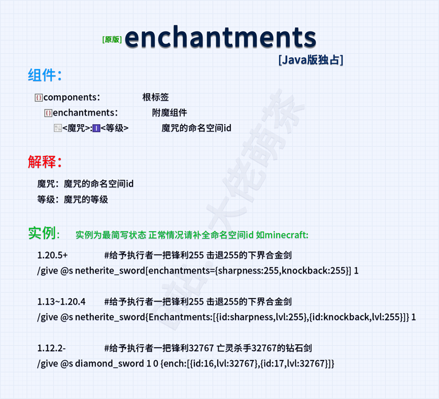
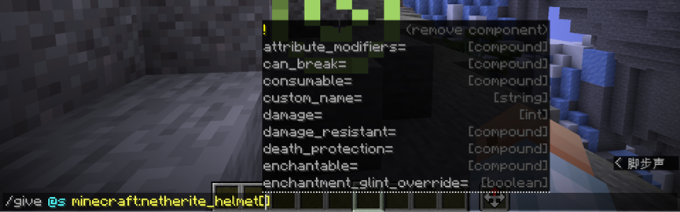
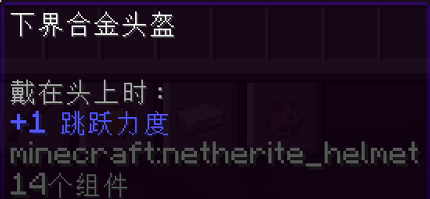
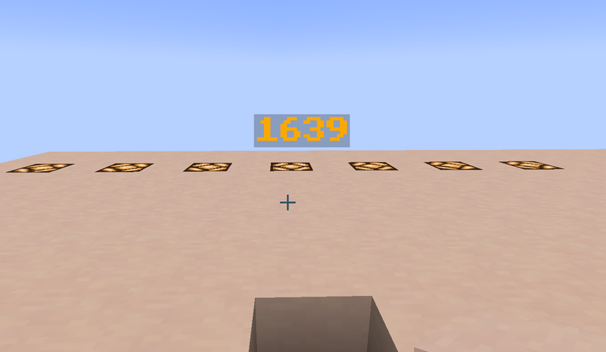
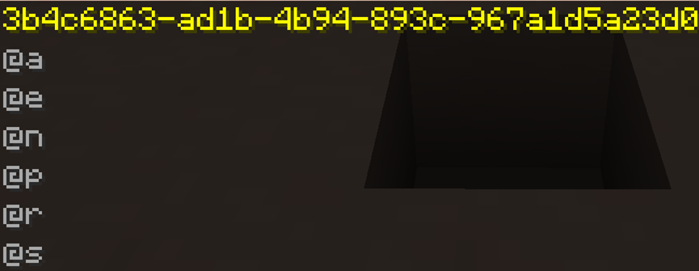
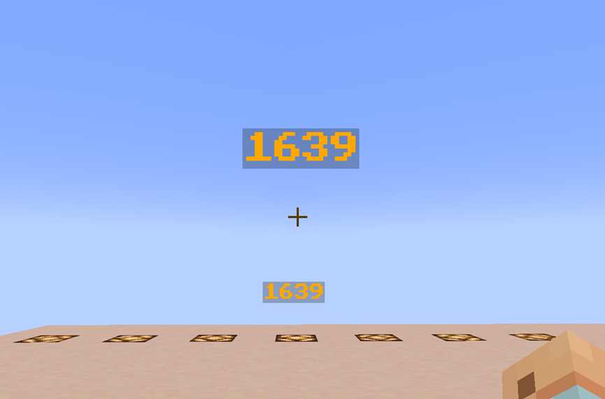
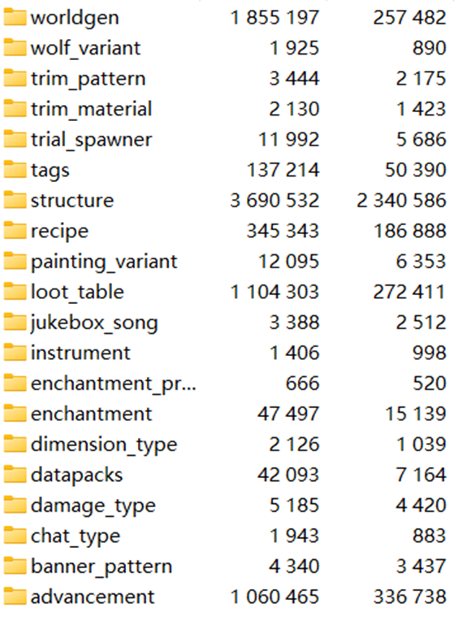

::: tip Translation notice
This page was translated with machine translation and may contain inaccuracies. If you can help improve it, please open an issue or submit a pull request.
:::

<!-- markdownlint-disable MD033 MD041 -->


<FeatureHead
    title = "Getting Started with Data Pack and Command - How Beginners Can Adapt Quickly"
    authorName = "doom_decapitator"
/>

## Introduction
For beginners of Java version data pack and command, it is very common to encounter problems with entity data format or data components that cannot be written. This article aims to find ways for beginners to learn and use command and data pack.
## Access to a treasure trove of wisdom: Minecraft Wiki
[Minecraft Wiki](https://zh.minecraft.wiki/) provides a relatively authoritative command and data pack document reference, including detailed syntax, cases and updates, and is a core learning resource. When encountering related problems, the first thing to think of is Minecraft Wiki as the key to solving puzzles.

**2 hours** in QQ and Tieba groups are not as good as **a few minutes** on the Wiki. Let me give you an example of how to read the Wiki and find the answer yourself.
One day Xiao Ming asked:

**"How to give yourself a hoe of fortune 114514"**

(In fact, most versions cannot reach 114514)

He copied the command given by **Baidu Search** and it didn't take effect. Xiao Ming still didn't get a valid hoe, and fell into an endless loop of "**change parameters-report an error-ask again**". After struggling for an hour, he still couldn't write (a slight exaggeration). Xiao Ming decided to check the Minecraft Wiki according to the opinions of the group friends and search for relevant content. Only then did he discover the reason why the instructions given to him by the group friends did not take effect.

After 1.20.5, **item's NBT format** is replaced by **item stacking component**. Through practice, Xiao Ming learned how to write the corresponding enchantments in different versions. The above is a case study about applying wiki to learning. Different versions have different formats and writing methods. The wiki is the most authoritative guide.



**Reference for writing enchantments in different versions**
 * **1.12-**: The supported type is short
```mcfunction
give @p minecraft:diamond_hoe 1 0 {ench:[{id:35,lvl:32767}]}
```

 * **1.13-1.17.1** The supported type is int(2147483647)
```mcfunction
give @s minecraft:diamond_hoe{Enchantments:[{id:"minecraft:fortune",lvl:114514}]}
```

 * **1.17.1-1.20.5** can support type 32767 (Short) but will be limited to 0~255
```mcfunction
give @s minecraft:diamond_hoe{Enchantments:[{id:"minecraft:fortune",lvl:32767}]}
```

(actually parsed to 255)
 * **1.20.5+** 1 ≤ value ≤ 255
```mcfunction
give @s diamond_hoe[enchantments={levels:{fortune:255}}] 1
```

For learning data pack, Minecraft Wiki also gives relevant guidance and authoritative content - [data pack - Chinese Minecraft Wiki](https://zh.minecraft.wiki/w/?curid=33058), in [Tutorial - Chinese Minecraft Wiki](https://zh.minecraft.wiki/w/?curid=5792), a large number of tutorials have been written by players, including the initial tutorial for making data pack: [Tutorial: Making data pack - Chinese Minecraft Wiki](https://zh.minecraft.wiki/w/?curid=36294) and other tutorial cases.

## Configure Datapack Helper Plus
[Tutorial: Making data pack#Installing auxiliary plug-ins](https://zh.minecraft.wiki/w/?curid=36294#%E5%AE%89%E8%A3%85%E8%BE%85%E5%8A%A9%E6%8F%92%E4%BB%B6)

**D**atapack **H**elper **P**lus, **DHP** are an inevitable part of every data pack producer. For details, please refer to [Datapack Helper Plus by Spyglass - Visual Studio Marketplace](https://marketplace.visualstudio.com/items?itemName=SPGoding.datapack-language-server), among which the command completion and command prompt functions are truly indispensable for data packplayer; DHP may encounter loading problems, you can refer to Mengcha’s DHP repair video [Solving my worlddata pack tool error problem-Datapack Helper Plus
](https://www.bilibili.com/video/BV1XM6UYAE4j) For some players whose formats are not clear, you can create data pack files and create corresponding files to tinker with and continuously adjust;

### Project features
 * **Multi-language support**: DHP supports multiple languages, including German, English, French, Italian, Japanese and Simplified Chinese, to meet the needs of developers around the world.
 * **Semantic Highlighting**: Provides semantic coloring of command parameters to enhance code readability and maintainability.
 * **Auto-completion**: The intelligent completion function covers simple commands to complex NBT tags, greatly reducing input errors.
 * **Code Snippets**: Built-in multiple code snippets to speed up the writing of commonly used code structures.
 * **Diagnostics and Code Action**: Detect code errors in real time and provide quick fix options.
 * **Formatting and Code Folding**: Automatically format code, support folding of code blocks, and optimize code layout.

## In-office auxiliary tools such as NBT Autocomplete
[NBT Autocomplete - Minecraft Mod](https://modrinth.com/mod/nbt-autocomplete)

NBT Autocomplete, or nbtac for short, supports the NBT completion function and can help players assist in completing NBT in the game. When you enter an NBTtag for an entity, block, or item, the game displays a list of available tags and their types. Example: Give the player an **attribute modifier** to **increase the value of &lt;jump strength&gt;1 when worn on the head**

Reference Wiki: [attribute_modifiers](https://zh.minecraft.wiki/w/?curid=113905#attribute_modifiers)






You can see that the NBT is automatically completed for the player, which is simple and efficient. In-game editing greatly shortens the time.

## Get data and modify data: datacommand
datacommand is an indispensable part of Minecraft data learning. Related tutorials: [MCcommand Tutorial "True" Starting from Scratch (12) NBT Data Reading and Modification](https://www.bilibili.com/read/cv36068052/)。

The `data get` command can be used to view the data of entity, block or item. A player who has just started learning Minecraft commands and data packs, or a player who has a certain foundation but wants to learn more about data operations, may try to create custom items, adjust entity behavior, or make more complex data packs. But when you encounter the problem that data types are not applied correctly, you need tools to obtain and inspect the data.

For novice players, the `data get` command can help the player see the essence through the phenomenon. Let's combine it with Wiki and take an armor stand as an example. The picture below shows an armor stand:



At first glance, it looks like a floating character, written "1639". However this is actually an entity, let's take a look at `/data get entity`. Note that /data get can only obtain the data of a single entity, so the selector must be restricted during operation, for example, to obtain a single nearest armor stand:
```mcfunction
data get entity @e[type=minecraft:armor_stand,limit=1,sort=nearest]`
```

The target selector has a dedicated entry in the wiki: [target selector](https://zh.minecraft.wiki/w/?curid=31547)


Or for the entity pointed by the mouse pointer, you can directly use the Tab key to refer to the entity's unique UUID. For details, see [Universal Unique Identifier - Chinese Minecraft Wiki](https://zh.minecraft.wiki/w/?curid=56543). For the item pointed by the mouse pointer, you can also use the `F3+I` shortcut key to obtain the entity data with one click.




Next, we will score the armor stand named "1639". Of course, our analysis is actually inseparable from the Minecraft Wiki. Please refer to [Armor Stand] (https://zh.minecraft.wiki/w/?curid=13139). for example:

* `CustomName`** refers to the custom name of the current entity**;
* `CustomNameVisible`** indicates whether the entity always renders the name, in layman's terms, it means whether the player can see it**;
* `Invulnerable`** is also an important tag, which determines whether the entity can resist most damage. If true, the entity will only take damage from creative players and damage belonging to the **`#bypasses_invulnerability`**tag**.

On the surface, it doesn’t feel like an entity. In fact, `data get`reveals its original shape. Our study of entity data can also start from this perspective: we can copy it! But it must be mentioned here that you must understand SNBT, which corresponds to [SNBT format - Chinese Minecraft Wiki](https://zh.minecraft.wiki/w/?curid=145849). An example here is that`b`in`OnGround:1b`is a Boolean value,`1`represents`true`, and `0`represents`false`.

We summon an armor stand, using several of the tags as examples:

**Summons an invincible armor stand with the name 1639 on the spot. The name is displayed but the body is invisible. **
```mcfunction
summon minecraft:armor_stand ~ ~ ~ {Invulnerable:1b,CustomName:'{"text":"1639","bold":true,"italic":false,"color":"gold"}',CustomNameVisible:true,Invisible:1b}
```



We can also modify the entity data of the armor stand through datacommand. Here we show the more complex usage of datacommand. We only modify simple entity data. For example:

**Merge and modify the CustomNametag, making the name "1639" turn dark red**
```mcfunction
data merge entity @e[type=minecraft:armor_stand,sort=nearest,limit=1] {CustomName:'{"text":"1639","bold":true,"italic":false,"color":"dark_red"}'}
```

For novice players, many other questions can also be solved using `data get`, and it is universal; for example, the enchantment problem mentioned above, we obtain data from the enchantment item on hand, for example, we have a **Looting III** acacia ship in hand:

**Get the data of the main hand item**
```mcfunction
data get entity @s SelectedItem
```


The related writing method of enchantment in this version is also clear. After switching to 1.20.1, the item stack component has not been changed (now merged into the array component). You can see:


A rough explanation of this part will start here.

## Disassemble the vanilla.jar file for imitation
Newer versions of Minecraft (1.6+) have moved to a more modular file structure (.minecraft/versions folder). We find the `.jar` file corresponding to the version and decompress it (unzip it to another place, not where it is) or open the compressed package. Follow the path \data\minecraft and you can see the structure of the vanilladata pack.




Corresponds exactly to the Minecraft wikidata pack introduction. We can create by imitating the vanilla data pack format and data pack content. For example, we create a **Precision Collection II**; by modifying `silk_touch.json`and`spawner.json` under **vanillanamespace**, we can roughly show that the Precision Collection II can dig monster spawners, and the enchantment table will not enchant **Precision Collection II**. This is an example of disassembling the vanilla.jar file to do data pack:

**Doom_CustomEnchantment/data/minecraft:silk_touch.json**

```json
{
  "anvil_cost": 8,
  "description": {
    "translate": "enchantment.minecraft.silk_touch"
  },
  "effects": {
    "minecraft:block_experience": [
      {
        "effect": {
          "type": "minecraft:set",
          "value": 0.0
        }
      }
    ]
  },
  "exclusive_set": "#minecraft:exclusive_set/mining",
  "max_cost": {
    "base": 65,
    "per_level_above_first": -50
  },
  "max_level": 2,
  "min_cost": {
    "base": 15,
    "per_level_above_first": 0
  },
  "slots": [
    "mainhand"
  ],
  "supported_items": "#minecraft:enchantable/mining_loot",
  "weight": 1
}

```


**Doom_CustomEnchantment/data/minecraft/loot_table/blocks/spawer.json**

```json
{
  "type": "minecraft:block",
  "random_sequence": "minecraft:blocks/spawner",
  "pools": [
    {
      "rolls": 1,
      "entries": [
        {
          "type": "item",
          "name": "spawner",
          "conditions": [
            {
              "condition": "match_tool",
              "predicate": {
                "components": {
                  "enchantments": {
                    "silk_touch": 2
                  }
                }
              }
            },
            {
              "condition": "random_chance",
              "chance": 0.25
            }
          ]
        }
      ]
    }
  ]
}
```


There are many similar examples, such as the enchantment compatibility package made by Mengcha:

[Enchantments do not conflict/Enchantments are compatible with each other - MC Encyclopedia | The largest Chinese MOD encyclopedia for Minecraft](https://www.mcmod.cn/class/17763.html)。

## Disassemble the data pack instance
There are data packs produced by players in various Minecraft maps, such as the data pack adapted to **Ragecraft 4 UnderWorld** produced by suso, as well as on major platform forums and platforms (such as [**Planet MC**](https://www.planetminecraft.com/)，[**Modrinth**](https://modrinth.com/)) There are also a large number of data packs. There are also many examples in the tutorial module of the Minecraft Wiki, such as [Tutorial: Custom Structure Generation](https://zh.minecraft.wiki/w/?curid=113843)。

These data packs are valuable experience and reference for novices to use command to create data packs. There are also a large number of data packs that act as wheels that can be imitated, for example: [Bookshelf](https://github.com/Gunivers/Bookshelf/), and [Black Box Library](https://github.com/RockNRui/Black-Box-Library). However, the use must abide by the open source agreement**.

We also recommend [Cartographer 2.0](https://github.com/pearuhdox/Cartographer-2.0) "Big Package", in which you can refer to the custom enchantment part. For learning about function calculations, you can refer to [Xiaodou Database 3.0](https://github.com/xiaodou8593/math3.0)。

## Video Teaching and Vanilla Library
Learning data pack is inseparable from data pack video teaching. There are many ups in station b who provide video teaching, such as [Cengcha](https://space.bilibili.com/320500029/upload/video),[Celestial Leopard Nebula](https://space.bilibili.com/19856853), [Start a small business](https://space.bilibili.com/133430292?spm_id_from=333.337.0.0)、[Dahesor](https://space.bilibili.com/436796403?spm_id_from=333.337.0.0)、[CR_019](https://search.bilibili.com/all?keyword=cr019&from_source=webtop_search&spm_id_from=333.1387&search_source=5), etc.; in addition, [Vanilla Library](https://cr-019.github.io/datapack-index/There are a large number of data pack learning tutorials in ), which is a paradise for data pack creators.

## Summarize
Mastering data pack and command requires going through the spiral process of "**imitation-understanding-creation**". It is recommended to start by modifying the existing data pack (such as modifying the villager transaction table, etc.) and gradually transition to independent creation. When encountering an error, make good use of in-game prompts (F3 debugging screen) and log files to locate the problem. Every mistake is a valuable opportunity to understand the working mechanism of data pack. Continuous practice will help you build an intuitive understanding of the data structure.
