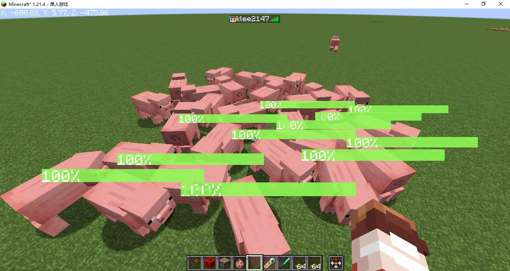
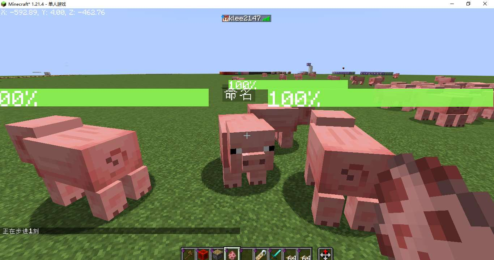

::: tip Translation notice
This page was translated with machine translation and may contain inaccuracies. If you can help improve it, please open an issue or submit a pull request.
:::

<!-- markdownlint-disable MD033 MD041 -->


<FeatureHead
    title = "vanilla health bar!"
    authorName = "SKSAMA"
    resourceLink = 'https://ymqlgthbsakuradream.github.io/posts/minecraft/Archive.20250504.html'
/>

## introduction

It all started last week. That night I was quietly playing Genshin on my computer, and I suddenly realized something. In vanillaMC, neither mobs nor monsters show their health bars, which is very unfriendly to vanillaplayer.

After searching on site b, I found that someone has already created a similar command. For details, see [BV1PZfzYCEXy](https://www.bilibili.com/video/BV1PZfzYCEXy/), I was really surprised to be able to create a blood bar easing in vanilla. Unfortunately, this does not support the Java version, so I made a health bar display data pack suitable for the Java version.

**It has the following features**

* Health bar easing effect\

* Multiple mob support
* Good normal performance

* The health bar does not conflict with the mob name


## Overview of ideas

### 1. Health bar text

Stacking "|" characters can achieve a simple health bar
```mcfunction
tellraw @a [{"text":"||||||||"}]
```

<center></center>

However, we do not want empty pixels in the middle of the health bar. We can insert negative spaces between two characters to solve the problem.
[NegetiveSpaceFont](https://github.com/AmberWat/NegativeSpaceFont)resource pack, you can easily insert negative spaces.
```mcfunction
tellraw @a [\
    {"text":"|"},{"translate":"space.-1"},\
    {"text":"|"},{"translate":"space.-1"},\
    {"text":"|"},{"translate":"space.-1"}\
]\
```

<center></center>

Write the health bar text into the language file and call it through the translation key. Each line corresponds to a health percentage. Since text components cannot be written in the language file, you need to find the Unicode code point corresponding to the negative space `space.-1`and use the escape character`\uXXXX`to represent it. Disassemble the NegativeSpaceFontresource In the language file of pack, some unknown characters were found. This is because these characters have been parsed once. Use a hexadecimal text converter to convert the unknown characters corresponding to`space.-1`and get`daffdfff`, then its corresponding escape character should be `\udaff\udfff`.
```json
{
    "newlayer":"󀀀",
    "space.-infinity":"󀀁",
    "space.infinity":"󟿿",
    "space.-max":"󎀀",
    "space.-8192":"󎀀",
    "space.-8191":"󎀁",
    ...
    "space.-1":"󏿿",
    ...
}
```

The finally written health bar text language file is as follows, `\udb00\udc01`means$1$Positive space in pixels, represented by`\udaff\udfff`$1$Negative spacing in pixels, `\udaff\udf9c` is$100$Negative pixel space, placed at the end for the cursor to return to positive. handwriting$100$It was impossible to create a running language file, so a python program was used.
```json
{
	"skapi.healthbar.0":"\udb00\udc01\udb00\udc01\udb00\udc01\udb00\udc01\udb00\udc01\udb00\udc01\udb00\udc01\udb00\udc01\udb00\udc01\udb00\udc01\udb00\udc01\udb00\udc01\udb00\udc01\udb00\udc01\udb00\udc01\udb00\udc01\udb00\udc01\udb00\udc01\udb00\udc01\udb00\udc01\udb00\udc01\udb00\udc01\udb00\udc01\udb00\udc01\udb00\udc01\udb00\udc01\udb00\udc01\udb00\udc01\udb00\udc01\udb00\udc01\udb00\udc01\udb00\udc01\udb00\udc01\udb00\udc01\udb00\udc01\udb00\udc01\udb00\udc01\udb00\udc01\udb00\udc01\udb00\udc01\udb00\udc01\udb00\udc01\udb00\udc01\udb00\udc01\udb00\udc01\udb00\udc01\udb00\udc01\udb00\udc01\udb00\udc01\udb00\udc01\udb00\udc01\udb00\udc01\udb00\udc01\udb00\udc01\udb00\udc01\udb00\udc01\udb00\udc01\udb00\udc01\udb00\udc01\udb00\udc01\udb00\udc01\udb00\udc01\udb00\udc01\udb00\udc01\udb00\udc01\udb00\udc01\udb00\udc01\udb00\udc01\udb00\udc01\udb00\udc01\udb00\udc01\udb00\udc01\udb00\udc01\udb00\udc01\udb00\udc01\udb00\udc01\udb00\udc01\udb00\udc01\udb00\udc01\udb00\udc01\udb00\udc01\udb00\udc01\udb00\udc01\udb00\udc01\udb00\udc01\udb00\udc01\udb00\udc01\udb00\udc01\udb00\udc01\udb00\udc01\udb00\udc01\udb00\udc01\udb00\udc01\udb00\udc01\udb00\udc01\udb00\udc01\udb00\udc01\udb00\udc01\udb00\udc01\udb00\udc01\udaff\udf9c",
	"skapi.healthbar.1":"|\udaff\udfff\udb00\udc01\udb00\udc01\udb00\udc01\udb00\udc01\udb00\udc01\udb00\udc01\udb00\udc01\udb00\udc01\udb00\udc01\udb00\udc01\udb00\udc01\udb00\udc01\udb00\udc01\udb00\udc01\udb00\udc01\udb00\udc01\udb00\udc01\udb00\udc01\udb00\udc01\udb00\udc01\udb00\udc01\udb00\udc01\udb00\udc01\udb00\udc01\udb00\udc01\udb00\udc01\udb00\udc01\udb00\udc01\udb00\udc01\udb00\udc01\udb00\udc01\udb00\udc01\udb00\udc01\udb00\udc01\udb00\udc01\udb00\udc01\udb00\udc01\udb00\udc01\udb00\udc01\udb00\udc01\udb00\udc01\udb00\udc01\udb00\udc01\udb00\udc01\udb00\udc01\udb00\udc01\udb00\udc01\udb00\udc01\udb00\udc01\udb00\udc01\udb00\udc01\udb00\udc01\udb00\udc01\udb00\udc01\udb00\udc01\udb00\udc01\udb00\udc01\udb00\udc01\udb00\udc01\udb00\udc01\udb00\udc01\udb00\udc01\udb00\udc01\udb00\udc01\udb00\udc01\udb00\udc01\udb00\udc01\udb00\udc01\udb00\udc01\udb00\udc01\udb00\udc01\udb00\udc01\udb00\udc01\udb00\udc01\udb00\udc01\udb00\udc01\udb00\udc01\udb00\udc01\udb00\udc01\udb00\udc01\udb00\udc01\udb00\udc01\udb00\udc01\udb00\udc01\udb00\udc01\udb00\udc01\udb00\udc01\udb00\udc01\udb00\udc01\udb00\udc01\udb00\udc01\udb00\udc01\udb00\udc01\udb00\udc01\udb00\udc01\udb00\udc01\udb00\udc01\udb00\udc01\udb00\udc01\udaff\udf9c",
	"skapi.healthbar.2":"|\udaff\udfff|\udaff\udfff\udb00\udc01\udb00\udc01\udb00\udc01\udb00\udc01\udb00\udc01\udb00\udc01\udb00\udc01\udb00\udc01\udb00\udc01\udb00\udc01\udb00\udc01\udb00\udc01\udb00\udc01\udb00\udc01\udb00\udc01\udb00\udc01\udb00\udc01\udb00\udc01\udb00\udc01\udb00\udc01\udb00\udc01\udb00\udc01\udb00\udc01\udb00\udc01\udb00\udc01\udb00\udc01\udb00\udc01\udb00\udc01\udb00\udc01\udb00\udc01\udb00\udc01\udb00\udc01\udb00\udc01\udb00\udc01\udb00\udc01\udb00\udc01\udb00\udc01\udb00\udc01\udb00\udc01\udb00\udc01\udb00\udc01\udb00\udc01\udb00\udc01\udb00\udc01\udb00\udc01\udb00\udc01\udb00\udc01\udb00\udc01\udb00\udc01\udb00\udc01\udb00\udc01\udb00\udc01\udb00\udc01\udb00\udc01\udb00\udc01\udb00\udc01\udb00\udc01\udb00\udc01\udb00\udc01\udb00\udc01\udb00\udc01\udb00\udc01\udb00\udc01\udb00\udc01\udb00\udc01\udb00\udc01\udb00\udc01\udb00\udc01\udb00\udc01\udb00\udc01\udb00\udc01\udb00\udc01\udb00\udc01\udb00\udc01\udb00\udc01\udb00\udc01\udb00\udc01\udb00\udc01\udb00\udc01\udb00\udc01\udb00\udc01\udb00\udc01\udb00\udc01\udb00\udc01\udb00\udc01\udb00\udc01\udb00\udc01\udb00\udc01\udb00\udc01\udb00\udc01\udb00\udc01\udb00\udc01\udb00\udc01\udb00\udc01\udb00\udc01\udb00\udc01\udb00\udc01\udb00\udc01\udaff\udf9c",
    ...
}
```

```python
with open("1.txt","w") as f:
    f.write("{\n")
    for i in range(0,101):
        f.write('\t"skapi.healthbar.%d":"%s%s\\udaff\\udf9c",\n'%(i,"|\\udaff\\udfff"*i,"\\udb00\\udc01"*(100-i)))
    f.write("}")
```

In this way, any percentage of the health bar can be called up through the translation key:
```mcfunction
tellraw @a [\
    {"translate":"skapi.healthbar.2"},{"text":"\n"},\
    {"translate":"skapi.healthbar.50"},{"text":"\n"},\
    {"translate":"skapi.healthbar.100"},{"text":"\n"}\
]
```

<center></center>

The superposition of health bars is also very easy to implement.
```mcfunction
tellraw @a [\
    {"translate":"skapi.healthbar.70","color":"yellow"},\
    {"translate":"skapi.healthbar.40","color":"green"}\
]
```

<center></center>

### 2. Health bar and blood bar easing calculation

You need to first convert the blood volume into a percentage of blood volume, record the mob's current blood volume (/data, Health) and maximum blood volume (/attribute, max_health), and calculate the ratio to obtain the percentage.
The easing effect is also easy to achieve, following the following rules:
1. If **Slow Health Percent** is less than **Health Percent** then **Slow Health Percent** is set to **Health Percent**
2. If **Slow Health Percent** is greater than **Health Percent** then **Slow Health Percent** is reduced$3$
```mcfunction
# load.mcfunction

# 当前血量
scoreboard objectives add skapi.health dummy

# 最大血量
scoreboard objectives add skapi.health_max dummy

# 血量百分比
scoreboard objectives add skapi.health_percent dummy

# 缓动血量百分比
scoreboard objectives add skapi.health_temp dummy
```

```mcfunction
# tick/_2.mcfunction

# 计算血量百分比
execute store result score @s skapi.health run data get entity @s Health 100000
execute store result score @s skapi.health_max run attribute @s max_health base get 1000
execute store result score @s skapi.health_percent run scoreboard players operation @s skapi.health /= @s skapi.health_max

# 检测当前实体是否有skapi.health_temp计分板，没有则创建
execute unless function sklibs:health/tick/_2.test run scoreboard players operation @s skapi.health_temp = @s skapi.health_percent

# 刷新缓动血量百分比
execute if score @s skapi.health_temp > @s skapi.health_percent run scoreboard players remove @s skapi.health_temp 3
execute if score @s skapi.health_temp < @s skapi.health_percent run scoreboard players operation @s skapi.health_temp = @s skapi.health_percent
```

```mcfunction
# tick/_2.test.mcfunction

execute if score @s skapi.health_temp matches -2147483648..2147483647 run return 1
```


### 3. Blood volume display

Use `CustomName` to display health on mob head
```mcfunction
# tick/_2.mcfunction

# 显示血条
execute store result storage minecraft:skapi.health args.now int 1 run scoreboard players get @s skapi.health_percent
execute store result storage minecraft:skapi.health args.fade int 1 run scoreboard players get @s skapi.health_temp
function sklibs:health/tick/_3.display with storage minecraft:skapi.health args
```

```mcfunction
# tick/_3.display.mcfunction

# 四行文本分别为：负空格居中血条，缓动血条，实际血条，血量百分比文本
$data modify entity @s CustomName set value '[\
    {"translate":"space.-50"},\
    {"translate":"skapi.healthbar.$(fade)","color":"yellow"},\
    {"translate":"skapi.healthbar.$(now)","color":"green"},\
    {"text":"$(fade)%","color":"white"}\
]'
```

### 4.UUID allocation
The test found that the dying mob cannot refresh the health bar normally. In other words, the mob cannot refresh the health bar normally during the time period when the mob plays the death animation. This is because the dying mob cannot be selected through `@e`selector, and the dying mob can only be selected through `@s`, `UUID`, `on origin`, etc.

Solution: Put the UUID of the entity whose health bar is to be displayed into a list, traverse the list, and operate the entity corresponding to each UUID. If the mob corresponding to the UUID does not exist, delete the UUID.

Note: The UUID array to string conversion method here comes from the Carl math library large_number
```mcfunction
# tick.mcfunction

# 注册实体
# 标签sklibs:islive_1.21.4记录了所有活体生物，不包括盔甲架，矿车等
execute as @e[type=#sklibs:islive_1.21.4,tag=!skhealth] run function sklibs:health/tick/_0.register

# 遍历已注册实体列表
# SK前置库提供的方法，以下三行分别为：被遍历的列表，循环体，循环变量
data modify storage skapi.arrays temp.foreachTarget set from storage skapi.health uuids
data modify storage skapi.arrays temp.foreachTemp.cmd set value "function sklibs:health/tick/_1 with storage skapi.health i"
data modify storage skapi.arrays temp.foreachTemp.i set value "storage skapi.health i"
function sklibs:skapi_arrays/foreach
```

```mcfunction
# tick/_0.register.mcfunction

data modify entity @s CustomNameVisible set value true
tag @s add skhealth

# 存储UUID
data modify storage skapi.math uuid_list_for_hyphen.input set from entity @s UUID
function sklibs:skapi_math/uuidarray2string
data modify storage skapi.health uuids append value {a:"temp"}
data modify storage skapi.health uuids[{a:"temp"}].a set from storage skapi.math uuid_list_for_hyphen.output
```

```mcfunction
# tick/_1.mcfunction

# 实体不存在，则删除该实体的的UUID
$execute unless entity $(a) run return run function sklibs:health/tick/_1.noentity with storage skapi.health i

# 执行实体tick
$execute as $(a) at @s run function sklibs:health/tick/_2
```

```mcfunction
# tick/_1.noentity.mcfunction

$data remove storage skapi.health uuids[{a:"$(a)"}]
return 0
```


### 5. Solve performance issues

Updating a large number of entities consumes a huge amount of performance. The solution is to only update the entities within the player 5 grid. If the entity is not within the player 5 grid, delete its UUID from the list to reduce the number of loops and reduce performance expenses.
```mcfunction
# tick.mcfunction

# 注册实体
# execute as @e[type=#sklibs:islive_1.21.4,tag=!skhealth] run function sklibs:health/tick/_0.register
execute as @a at @s as @e[type=#sklibs:islive_1.21.4,distance=0..5,tag=!skhealth]run function sklibs:health/tick/_0.register
```

```mcfunction
# tick/_1.mcfunction

...

# 实体不在玩家5格以内，则删除该实体的的UUID，终止血条显示
$execute as $(a) at @s unless entity @e[type=player,distance=0..5] run return run function sklibs:health/tick/_1.unloaded with storage skapi.health i

...
```

```mcfunction
# tick/_1.unloaded.mcfunction

$data remove storage skapi.health uuids[{a:"$(a)"}]
data remove entity @s CustomName
data modify entity @s CustomNameVisible set value false
tag @s remove skhealth
return 0
```

### 6. Resolve name conflict issues

Because the health bar occupies the `CutomName` of the entity for display
* Feature 1: If the entity has been named, its name will be covered by the health bar.
* Feature 2: When the health bar is displayed, use a name tag to name the entity, and the name will be overwritten immediately.

Repair feature 1, add unless data entity @s CustomName judgment when registering an entity. If the entity already has a name, the entity will not be registered\
Repair feature 2, add judgment in entitytick, if the entity has been renamed, delete the UUID of the entity in the UUID list, and stop displaying the health bar. To determine whether it has been renamed, you only need to roughly determine whether the name starts with `{`~~ (No one will use a name starting with `{`)~~
```mcfunction
# tick/_2.mcfunction

# 如果实体已被命过名，则删除UUID
data modify storage minecraft:skapi.health name set value ""
data modify storage minecraft:skapi.health name set string entity @s CustomName 0 1
execute if data entity @s CustomName unless data storage minecraft:skapi.health {name:'{'} run return run function sklibs:health/tick/_2.named with storage skapi.health i

...
```

```mcfunction
# tick/_2.named.mcfunction

$data remove storage skapi.health uuids[{a:"$(a)"}]
data modify entity @s CustomNameVisible set value false
tag @s remove skhealth
return 0
```

### 7. Safe initialization
In some special circumstances, such as re-entering the archive after the game crashes, there is a probability that some entities have been registered but there is no corresponding UUID in the UUID list, further causing the health bar to display abnormally. In this case, you need to unregister all registered entities and clear the UUID list when the data pack is loaded.
```mcfunction
# load.mcfunction

execute as @e[tag=skhealth] run function sklibs:health/load/_0
data modify storage skapi.health uuids set value []

...
```

```mcfunction
# load/_0.mcfunction

tag @s remove skhealth
data remove entity @s CustomName
data modify entity @s CustomNameVisible set value false
```


## data pack download

**Applicable version: 1.21.4**

**data pack**
* [1.21.4_SK_Health.zip](https://ymqlgthbsakuradream.github.io/posts/minecraft/Archive.20250504/1.21.4_SK_Health.zip)
* [1.21.4_SK prepackage_Alpha.zip](https://ymqlgthbsakuradream.github.io/posts/minecraft/Archive.20250416/1.21.4_SK%E5%89%8D%E7%BD%AE%E5%8C%85_Alpha.zip)\
(Regarding the front-end package, it is currently under development. I will write an article to introduce it after it is basically completed)

**resource pack**
* [1.21.4_SK_Health_RP.zip](https://ymqlgthbsakuradream.github.io/posts/minecraft/Archive.20250504/1.21.4_SK_Health_RP.zip)
* [NegetiveSpaceFont](https://github.com/AmberWat/NegativeSpaceFont/archive/refs/heads/master.zip) ([Github page](https://github.com/AmberWat/NegativeSpaceFont))

**ACKNOWLEDGMENT**
* [Carr Math Library large_number](https://github.com/kaer-3058/large_number)\
(No need to download, the relevant methods have been integrated into the SK pre-package)
