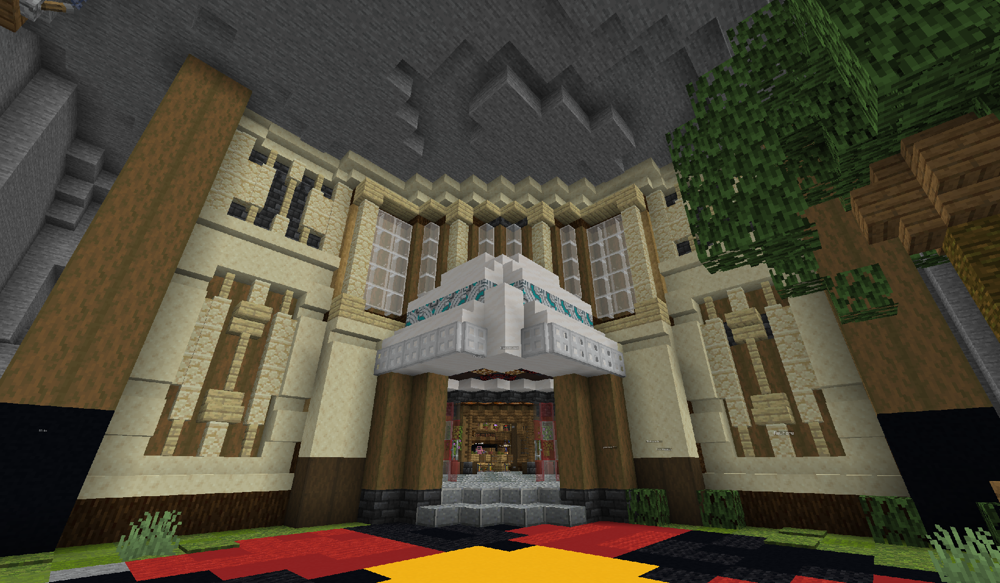
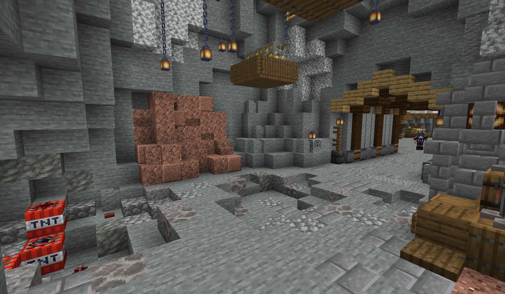
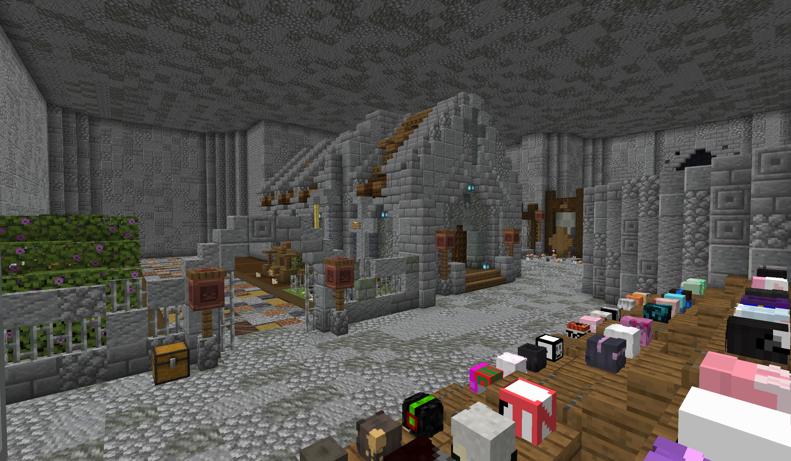
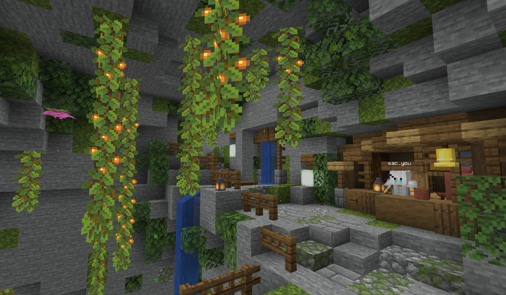
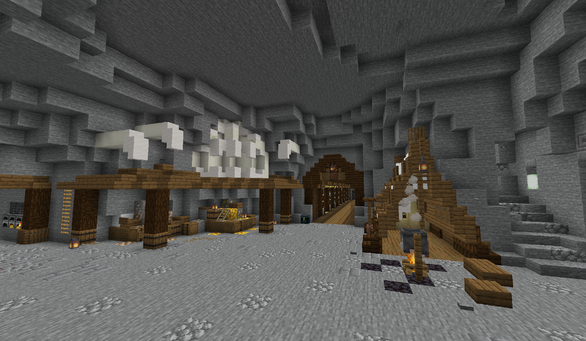

<!-- markdownlint-disable MD033 MD041 -->


<FeatureHead
    title = "Digging Underground"
    authorName = "sao_you"
    cover = '../../../../../feature/archive/202505/_assets/6.png'
    resourceLink = 'https://wwdj.lanzout.com/b00mpggbvi'
/>

## Introduction

Digging Underground is a survival PVP map. At the beginning of the game, players will dig ores in caves to make different equipment and weapons, and then engage in PVP with other players to achieve final victory.

**Map contains:**
* 29 unique characters
* 40+ unique props
* 8 different mines
* Multiple customization settings!

## Still iterating!

Some content is still being updated and adjusted, so stay tuned!

If you encounter any problems while playing or have any suggestions for the map, please be sure to provide feedback to the author!

**⚠️Character: The fossil has not been completed yet, please do not select**

## Screenshot











## Map Notes

Map commands:

```mcfunction
#reset game
function command:stop_game

#Unlock all characters
function command:enlock
#[sic]Editor's note

#Reset player properties
tag [player ID] remove __init__
```
## Author's note

Relatively speaking, this is my first time making a data pack map, so during development there were more feedbacks about character values being set too high or the design being too poor. \
The biggest one is the lack of map experience. Whether it is UI design or code optimization, it is still at a lower than average level, which leads to a boring game experience, or overly complex map design, and a hodgepodge...\
Of course, during a year and a half of exploration, I gradually learned high-quality maps, learned from other maps and made good modifications to keep the map relatively playable. \
I am also very grateful to Vanilla Library for giving me this opportunity to show myself. Thank you for your dedication and efforts!`(editor's note: keep it up!)`
## Map downloadhttps://wwdj.lanzout.com/b00mpggbvi\
Password:saoyou