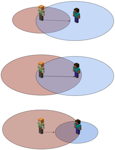

<script setup>
    import SpotlightHead from '/.vitepress/vue/SpotlightHead.vue'
	import ColorLine from '/.vitepress/vue/ColorLine.vue'
</script>
<SpotlightHead
    title = "Vanilla News - Λojang Spotlight - May 2025"
    authorName = "Alumopper"
    cover='../../../../../feature/archive/202505/_assets/spotlight.jpg'
	type=1
/>

Here is ***Vanilla*** news, the most ***Vanilla*** technical snapshot news in Minecraft. Our reporter *Vanilla Fox* reports the latest snapshot news for you~

Mojang has updated a total of four snapshots this month: 25w16a, 25w17a, 25w18a, and 25w19a. The data packversion number has reached **76**, and the resource packversion number has reached **60**.

Let’s talk about the conclusion first. This month’s update has good functionality, is less destructive, and has average optimization. Overall, it is at the **big cup** level.

In this month’s update, Mojang provides us with the path point function mentioned in the preview, and also makes optimized changes to the Uniform variables in the shader.

<ColorLine />

> [!TIP]
>
> For more important destructive changes, they will be marked with 💥

## Waypoint/waypoint

In 25w17a, Mojang removed waypoints for experimental content, meaning [locating bar](https://zh.minecraft.wiki/w/定位栏) and waypoint related content have been officially added to the game.

What is a waypoint? As content that is updated together with the positioning bar, a waypoint is a location in the world that can be projected into the player's positioning bar, which is the waypoint indicator seen on the positioning bar. These indicators indicate the relative angle of the waypoint relative to the direction the player is currently looking. Generally speaking, only the player can generate path points, but if a mob`waypoint_transmit_range`Greater than 0, it can also generate indicators in the positioning bar of nearby players.

Whether the waypoint indicator appears is mainly controlled by two properties: [waypoint transmission distance](https://zh.minecraft.wiki/w/属性/路径点传输距离)（`waypoint_transmit_range`) and [way point receiving distance](https://zh.minecraft.wiki/w/?curid=149918)（`waypoint_receive_range`), hereafter referred to as transmission distance and reception distance. Think of the mob as a broadcast station and the player as a radio. The transmission distance defines how far the mob can broadcast its position to the player, while the reception distance defines the maximum distance the player can receive broadcasts from mobs. Therefore, only when the transmission distance of a mob within the player's receiving distance is greater than the distance between itself and the player, the player can receive the coordinate information (path point) of the mob and display the location of the mob on its positioning bar.

> [!NOTE]
>
> The following figure shows the "way point broadcast process" between two players. The red range represents the waypoint transmission distance, and the blue range represents the waypoint reception distance. Steve can only see Alex's waypoint icon if Alex's transmit range includes Steve and Steve's receive range includes Alex
>
> 
>
> From: [Properties/Waypoint Reception Distance - Chinese Minecraft Wiki](https://zh.minecraft.wiki/w/属性/路径点接收距离)

The positioning bar usually occupies the position of the player's experience bar. However, if the player's experience changes, or if an interface that requires experience is opened (such as the anvil and enchanting table interface), the experience bar will be displayed. Of course, you can also use`locatorBar`Game rules to control whether to display the positioning bar.

Mojang provides [`waypoint`](https://zh.minecraft.wiki/w/?curid=149568) to perform some operations on the waypoint. use`waypoint modify &lt;waypoint&gt; (color|style) ...`You can change the style or color of the path point, where`waypoint`Needs to be a single entity. Generally speaking, we can use a markerentity to create a custom path point and then modify this`marker`Related properties to control the display of waypoints.

The icon of the path point can also be changed through the [Path Point Icon Style] in the resource pack (https://zh.minecraft.wiki/w/资源包#路径点图标样式) specifies a custom texture.

## 💥Uniform block

In 25w16a, Mojang changed the Uniform variables of all core shaders in the shader into Uniform blocks, making Uniform variables transparent and visible. For example, in`include/globals.glsl`Among them:

```glsl
#version 150

layout(std140) uniform Globals {
    vec2 ScreenSize;
    float GlintAlpha;
    float GameTime;
    int MenuBlurRadius;
};
```
All correspond to the previously implicit Uniform variables provided by default. In the shader, you can directly use [Uniform block](zhuanlan.zhihu.com/p/33093968) Uniform variables defined in.

At the same time, in the Json format of the rendering process of the post-processing pipeline, the definition of Uniform is also defined in the format of the Uniform block. It turns out that the Uniform variable is defined`uniforms`The field now corresponds to a uniform block in the shader, and this uniform block will be shared between the fragment shader and the vertex shader. For example, for a post-processing pipeline program`blur.json`There is

```json
{
	"vertex_shader": "minecraft:post/blur",
	"fragment_shader": "minecraft:post/box_blur",
	"inputs": [
		{
            "sampler_name": "In",
            "target": "minecraft:main",
            "bilinear": true
		}
	],
	"output": "swap",
	"uniforms": {
		"BlurConfig": [
			{
				"name": "BlurDir",
				"type": "vec2",
				"value": [ 1.0, 0.0 ]
			},
			{
				"name": "Radius",
				"type": "float",
				"value": 0.0
			}
		]
	}
}
```
corresponding to`post/blur.vsh`and`post/box_blur.fsh`There are Uniform block definitions in:

```glsl
layout(std140) uniform BlurConfig {
    vec2 BlurDir;
    float Radius;
};
```
Note that the definition of variables in the uniform block in Json must be strictly consistent with the definition order in the shader. And the Uniform block in Json corresponds to`name`Although the field has been deprecated, that is, it has nothing to do with the definition in the shader, for readability considerations, it is still recommended to write it and keep it consistent with the shader.

Some uniform blocks are automatically passed in by the game, while others need to be passed in manually through Json. The specific Uniform blocks that need to be passed in to the post-processing pipeline program, as well as the Uniform blocks newly defined in this update to make the original Uniform variables transparent are in [Update Log](https://zh.minecraft.wiki/w/25w16a) are explained in the shader and post-processing pipeline sections.

## Others

In 25w16a, the restriction that the rotation angle of the block model must be a multiple of 22.5 in the resource pack model definition is lifted.

In 25w18a, added for all mobs with AI (entities containing tags common to AImob)`home_pos`field (which defines the central location of "home") and`home_radius`Field (defines the range radius of "home"). These fields will set a "home" range for the mob, and then the mob's pathfinding range will only be limited to the "home" range. It's worth noting that bats, slimes, magma cubes, phantoms, and ender dragons can ignore the effects of this field.

💥In 25w18a, all Json file parsers have been changed to must be parsed in strict mode, requiring all Json to strictly comply with the Json format specification. In other words, you can no longer use single quotes to represent strings, nor can you use trailing commas at the end of lists and objects. You can no longer use comments in Json - although you may have never realized that you can do this, because commonly used data pack development tools, such as VSCode and DHP, parse Json in strict mode by default (unless you set the language to Json with comment), so there is almost no impact.

In addition, some new fields have been added to some entities, as well as changes related to projectile accuracy, which I will not go into details here. For specific content, please go to Wiki to view~

[25w19a - Chinese Minecraft Wiki](https://zh.minecraft.wiki/w/25w19a)

[25w18a - Chinese Minecraft Wiki](https://zh.minecraft.wiki/w/25w18a)

[25w17a - Chinese Minecraft Wiki](https://zh.minecraft.wiki/w/25w17a)

[25w16a - Chinese Minecraft Wiki](https://zh.minecraft.wiki/w/25w16a)