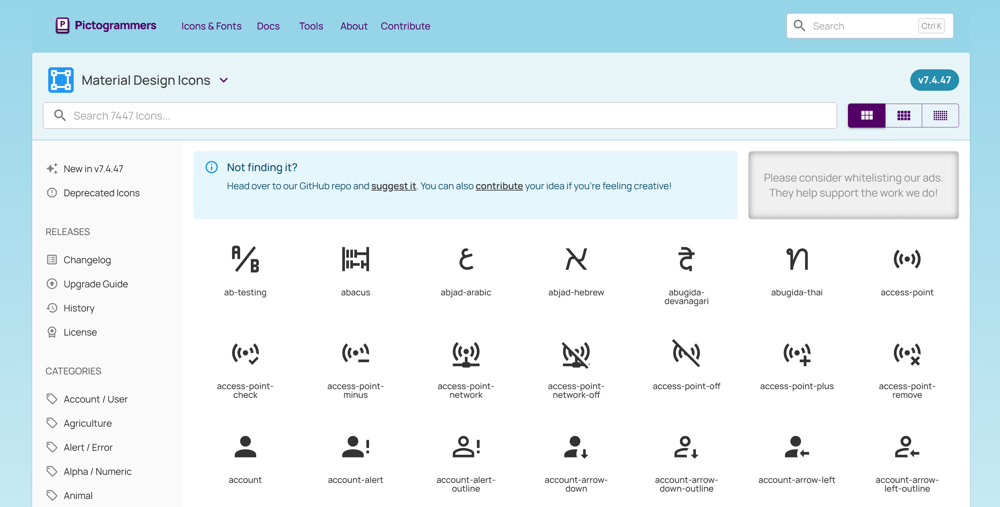
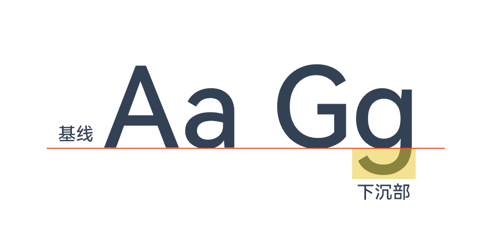
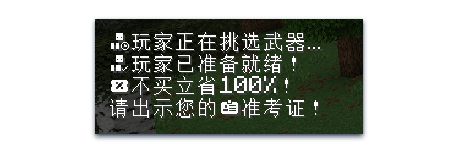
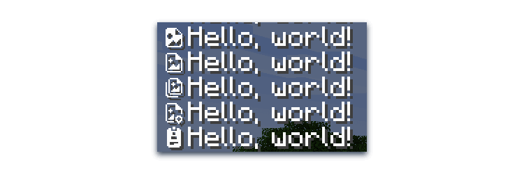
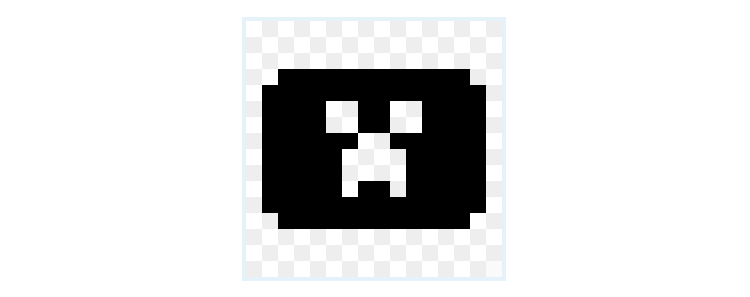
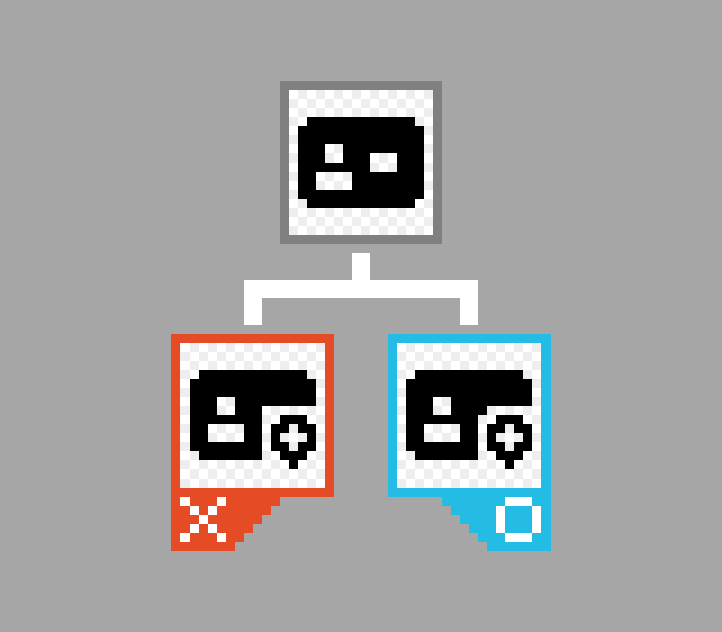
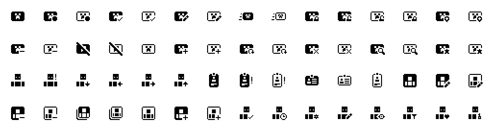
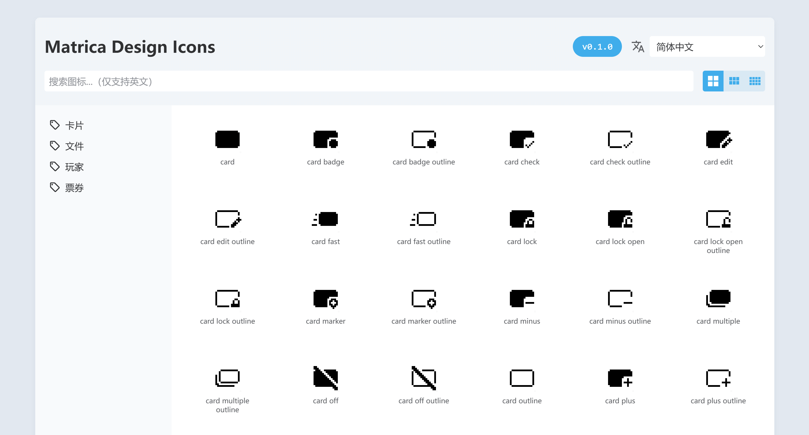
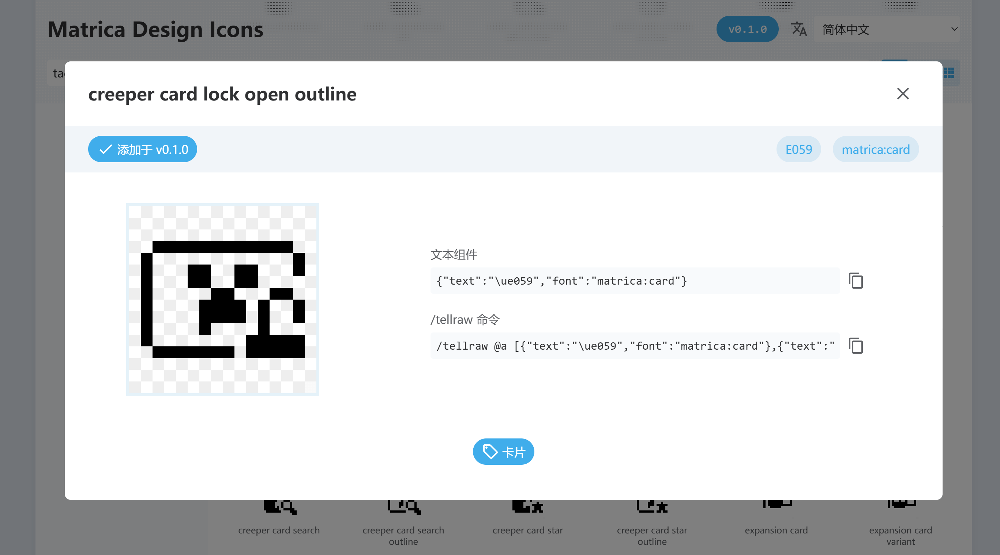

<FeatureHead
    title = "A feasibility attempt at the Minecraft icon asset library resource pack"
    authorName = "Sheep-realms"
    resourceLink = 'https://github.com/sheep-realms/Matrica-Design-Icons'/>


Have you ever thought about where the various beautiful icons in major websites and apps come from? Some large companies usually design a set of icon asset libraries on demand. After all, what they design is what suits them best. Independent developers and small projects will use public icon asset libraries.

There are a large number of such icon asset libraries available on the market. For developers, if they want to use these icon asset libraries, they only need to import them into their own projects. These icons are usually a single color, and developers can fill them with any color they want.

However, there are usually thousands or even tens of thousands of icons in the icon library. How to find the icon you need among them? To solve this problem, icon libraries usually provide a query tool to help users quickly find the icons they need.



One day, the author suddenly thought of an idea: Can we design a set of icon asset libraries that can be used in Minecraft? For this reason, the author briefly searched on major resource websites and found no similar products. Since maybe no one has done this, let’s make one ourselves!


## Implementation plan

Starting with Minecraft Java Edition 1.16 Snapshot 20w17a, the text component supports specifying fonts, which makes it easier to create a library of icon assets and turn them into an easy-to-use resource pack. Creators can insert icons as text anywhere there is text.

But doing this will inevitably require replacing some characters. What characters can we replace?

First of all, we cannot replace those characters that we may use, whether it is a rare character or a weird Martian script. We must try our best not to destroy the characters that humans may use. While you'll generally be fine using the default fonts, don't forget that Minecraft has an accessibility feature - Narrator. The narrator will read out the characters used as icons, which is clearly inappropriate.

The author first thought of the private use area (Area A) of the Unicode extension plane, that is`E0000`to`EFFFF`. But soon ran into a problem, Minecraft did not support the`\u{e0000}`The format's escape characters represent characters outside the base plane, but are converted to two code units. Although the conversion process is not complicated, I think there is no need to cause unnecessary trouble for yourself.

Fortunately, there is also a private area in the Unicode basic multilingual plane, that is`E000`to`F8FF`. Although it's a little less, we can define multiple fonts, so we don't need to worry too much about capacity.

> In fact, many icon libraries on the market will use fonts to replace private area characters as one of the import solutions. You may have seen a box or garbled characters appear on the web page where the icon should be displayed when the network is not connected.

Therefore, by creating a font definition JSON and a 16 × 16 character icon matrix diagram, we can complete the mapping between icons and text:

::: details font definition JSON

``` json
{
    "providers": [
        {
            "type": "space",
            "advances": {
                " ": 4
            }
        },
        {
            "type": "bitmap",
            "file": "minecraft:font/test.png",
			"height": 8,
            "ascent": 7,
            "chars": [
				"\ue000\ue001\ue002\ue003\ue004\ue005\ue006\ue007\ue008\ue009\ue00a\ue00b\ue00c\ue00d\ue00e\ue00f",
				"\ue010\ue011\ue012\ue013\ue014\ue015\ue016\ue017\ue018\ue019\ue01a\ue01b\ue01c\ue01d\ue01e\ue01f",
				"\ue020\ue021\ue022\ue023\ue024\ue025\ue026\ue027\ue028\ue029\ue02a\ue02b\ue02c\ue02d\ue02e\ue02f",
				"\ue030\ue031\ue032\ue033\ue034\ue035\ue036\ue037\ue038\ue039\ue03a\ue03b\ue03c\ue03d\ue03e\ue03f",
				"\ue040\ue041\ue042\ue043\ue044\ue045\ue046\ue047\ue048\ue049\ue04a\ue04b\ue04c\ue04d\ue04e\ue04f",
				"\ue050\ue051\ue052\ue053\ue054\ue055\ue056\ue057\ue058\ue059\ue05a\ue05b\ue05c\ue05d\ue05e\ue05f",
				"\ue060\ue061\ue062\ue063\ue064\ue065\ue066\ue067\ue068\ue069\ue06a\ue06b\ue06c\ue06d\ue06e\ue06f",
				"\ue070\ue071\ue072\ue073\ue074\ue075\ue076\ue077\ue078\ue079\ue07a\ue07b\ue07c\ue07d\ue07e\ue07f",
				"\ue080\ue081\ue082\ue083\ue084\ue085\ue086\ue087\ue088\ue089\ue08a\ue08b\ue08c\ue08d\ue08e\ue08f",
				"\ue090\ue091\ue092\ue093\ue094\ue095\ue096\ue097\ue098\ue099\ue09a\ue09b\ue09c\ue09d\ue09e\ue09f",
				"\ue0a0\ue0a1\ue0a2\ue0a3\ue0a4\ue0a5\ue0a6\ue0a7\ue0a8\ue0a9\ue0aa\ue0ab\ue0ac\ue0ad\ue0ae\ue0af",
				"\ue0b0\ue0b1\ue0b2\ue0b3\ue0b4\ue0b5\ue0b6\ue0b7\ue0b8\ue0b9\ue0ba\ue0bb\ue0bc\ue0bd\ue0be\ue0bf",
				"\ue0c0\ue0c1\ue0c2\ue0c3\ue0c4\ue0c5\ue0c6\ue0c7\ue0c8\ue0c9\ue0ca\ue0cb\ue0cc\ue0cd\ue0ce\ue0cf",
				"\ue0d0\ue0d1\ue0d2\ue0d3\ue0d4\ue0d5\ue0d6\ue0d7\ue0d8\ue0d9\ue0da\ue0db\ue0dc\ue0dd\ue0de\ue0df",
				"\ue0e0\ue0e1\ue0e2\ue0e3\ue0e4\ue0e5\ue0e6\ue0e7\ue0e8\ue0e9\ue0ea\ue0eb\ue0ec\ue0ed\ue0ee\ue0ef",
				"\ue0f0\ue0f1\ue0f2\ue0f3\ue0f4\ue0f5\ue0f6\ue0f7\ue0f8\ue0f9\ue0fa\ue0fb\ue0fc\ue0fd\ue0fe\ue0ff"
            ]
        }
    ]
}
```
By the way, the definition of space width is added here just to facilitate adding a gap between two icons.

:::

Of course, the 16 × 16 matrix is just a habit. If you want, it is not impossible to stuff all the icons into one picture, but it is not recommended.

At this point, the implementation plan of the resource pack part has been determined to be feasible.


## Select reference

The author chose Material Design Icons as a reference, mainly because of personal preference. However, converting this icon library to pixel icons is indeed a good choice for the following reasons:

- Material Design (translated as texture design, material design, material design) is a design language that has been iterated for more than ten years, and its quality has been widely recognized.
- Material Design has ready-made design guidelines for reference.
- Material Design provides a variety of icon line thickness versions, which is very beneficial for pixelation.
- Material Design refuses to design three-dimensional icons, which can greatly reduce the difficulty of pixelation.

If we want to design an icon library from scratch, it means we have to create a design language from scratch. Programmers have a saying: "Don't reinvent the wheel!"

To sum up, using Material Design Icons as a reference is a good choice.

So when naming this resource pack, the author combined the words Material and Minecraft and named it Matrica Design Icons.


## Draw icon

Now, we finally get to draw the icons! But wait, how big do we want the icon to be?


### Determine icon size and baseline position

The author first thought of 16 × 16 - after all, this is the size used by most blocks and items in Minecraft, and its expressive power is sufficient.

Then determine the baseline location. Wait, what is a baseline?

Okay, let’s take a tutorial on font design right away.



To put it simply, most English letters will "stand" on the baseline, while some English letters will have a sinking part (such as g j p q y).

In Minecraft, the height of English characters is 8 (regardless of how many pixels there are), and the position of the baseline is 7 from top to bottom. We stuck with this setting.



Under normal circumstances, Chinese characters will also "stand" on the baseline. Except Minecraft! This causes a problem: the icon looks just right in Chinese characters, but looks slightly offset in Western characters.



In fact, until the baseline position supports floating point numbers, this is already the optimal position, and trying other positions will only offset it further.


### Design Rules

In order to make the visual presentation of icons uniform, we also need to determine some rules.


#### Boundary restrictions

In order to make the visual size of the icon uniform, the author sets the outermost circle of pixels as the border. Main elements should not cross this boundary, but decorative elements can.




#### Discard unreadable details

Pixelation can cause a lot of detail to be lost, so don't sacrifice readability for the sake of detail. Be careful when a widget that is not connected to other widgets is obscured and only has 2 or 3 pixels left; it may not look good. When there is only 1 pixel left, don’t hesitate and discard it directly.




#### Localization

Obviously, icons designed to be universal in various fields may not necessarily meet the needs of use in Minecraft. Therefore, we should incorporate some Minecraft elements and make some localized modifications.



Now that we have drawn some icons, the question arises: How can we find these icons more easily?


## Create icon search tool

Very good, this is no longer the field of art design, we seem to have entered an unimagined field.

Fortunately, this is not a difficult task for the author. After spending a little time and fixing a few bugs, some bugs, a lot of bugs, and a ton of bugs, we made this icon finder tool.



Well, if we continue to elaborate further, this article may be a magic teaching article for our target audience. Let’s pick out a few key points.

To put it simply, we put a web page into the resource pack, and users can query the icon by opening this web page in the browser. Of course, we have also prepared an online web page, but the online web page only provides the latest version query.

Users can click on the icon listed to learn the details of the icon, copy the text component and command.



As shown in the figure above, using this icon requires specifying`matrica:card`font, use`\ue059`character.

Of course, this tool cannot identify which icons are in the resource pack by itself, and the icon information needs to be entered manually.

At this point, we have completed the construction of all basic functions of this resource pack.


## resource pack packaging

Different from other resource packs, this resource pack requires a special packaging method. After all, not everyone will use the web pages in the resource pack, and different versions need to be provided to ordinary players and creators.

Since the resource pack is hosted on GitHub, we can use GitHub's workflow for automated packaging. When making a resource pack for ordinary players, take away all the web pages and other messy things, and return the resource pack to what it should look like. In addition, you can also do some tricks, such as providing different resource pack icons for different versions.

In addition, GitHub can also provide static web page hosting services, so the icon finder tool in the resource pack can also be used online.


## Postscript

Currently, this resource pack is still being filled with new content, and there are not many icons available. It is foreseeable that there will still be a long time before the official version is released, and it may not even be completed. Still, it was an interesting attempt to explore the possibility of making a resource pack of icon asset libraries.


## External links

- [Matrica Design Icons resource pack’s GitHub repository](https://github.com/sheep-realms/Matrica-Design-Icons)
- [Material Design Icons](https://pictogrammers.com/library/mdi/)