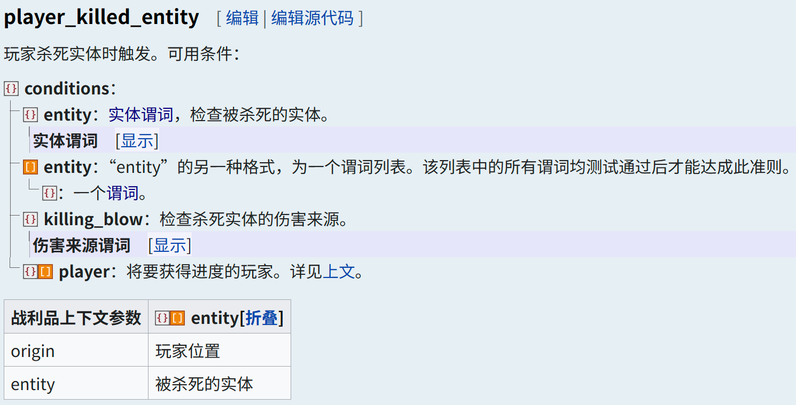
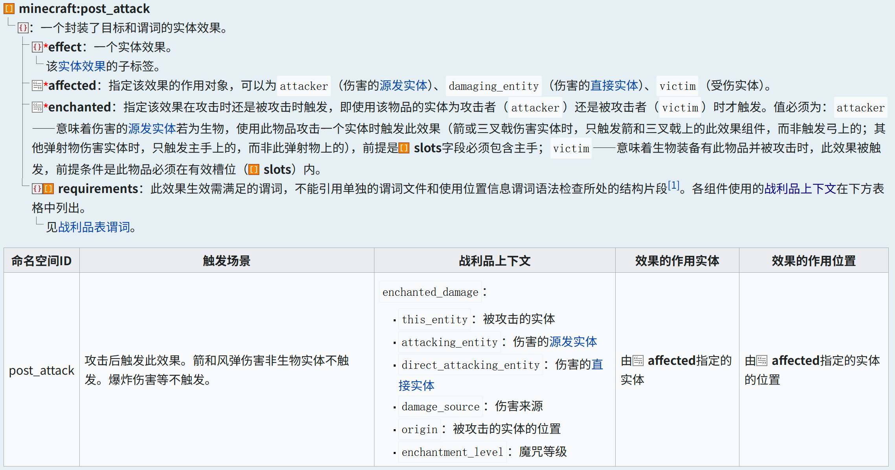
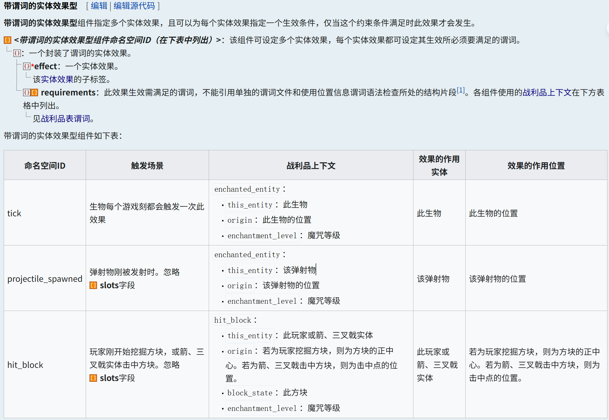
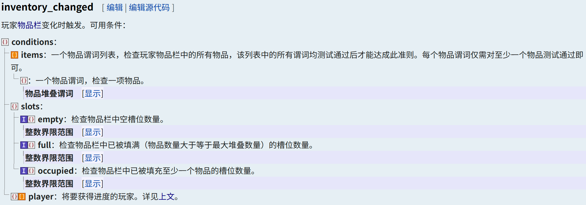
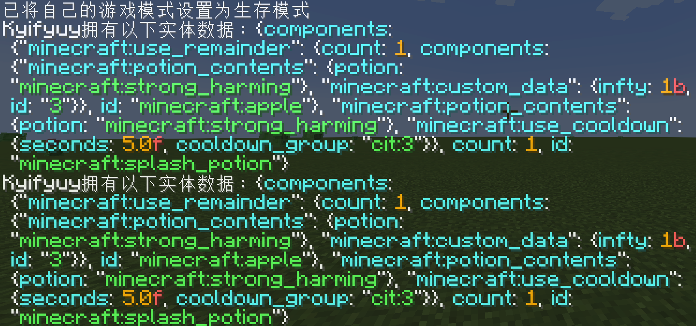

<FeatureHead
    title = "How to better edit custom item interactive attributes with high version (detailed explanation of triggers)"
    authorName = "Qi Bai"
/>


## Introduction

Adding your own custom items to vanilla Minecraft has always been a passion of many data packers. Adding items to the game is divided into two parts: resource pack and data pack. The resource pack is responsible for managing the model and animation of the item, and the data pack is responsible for managing the **interactive features** of the item. In the earlier versions that did not have the item component, we could only "modify" it with the help of the features of the item provided by vanilla to achieve our goals. Thanks to vanilla's rich weapon and tool system, in scenarios involving attacks, mining, etc. (i.e., left-click interaction), since the attack involves entity interaction, there are relatively direct monitoring methods, but it is somewhat powerless when it comes to block interaction monitoring. When it comes to use (i.e., right-click interaction), it is often unsatisfactory. The use of many items involves consumption and it is difficult for us to avoid the reflection of other game mechanisms borne by these items, which greatly limits the freedom of creators to create custom items. With the high version update, the update of advancement guidelines and the componentization of item data and spells have broken the long-standing troubles, allowing creators to simply combine item components and triggers like building blocks to achieve the functions they want.

This article will start from several commonly used item components and triggers, and introduce **concrete examples** to explain how to create a custom item from scratch in a high version. It aims to guide developers to quickly become familiar with **properties**, **item components**, **advancement**, **custom spells**, **loot table**, **loot context** and other contents. It integrates multiple usage scenarios to facilitate the use of creators, and introduces some **experiences** to provide ideas for creators.

## A. Trigger method

First of all, I want to declare here that the triggering methods discussed in this article only depend on the item itself, and do not involve interactive entity triggering and other similar triggering methods. According to the content in the introduction, we will temporarily divide the interaction methods of the item into three types: **left click trigger**, **right click trigger** and **passive trigger**. Considering the space issue, this article only discusses the first two triggers.

### Left click trigger

Since the vanilla listening method still has limitations, for the management of the left-click interaction effect of the item, we can only edit the interaction effect in the two interaction scenarios of **attack** and **mining** of the object.

#### Attack (entity interaction)

The attack involves interaction with the entity. We can consider using entity-related triggers. As of the latest version (1.21.6-pre3), the triggers related to attacking entities are:

| type | namespaceID | description |
| :--: | :----------------------------------------------------------------: | :----------------------------------------------------------------: |
| advancement | [`killed_by_arrow`](https://zh.minecraft.wiki/w/进度定义格式#killed_by_arrow) | [arrow](https://zh.minecraft.wiki/w/箭) triggers on the player who fired the arrow after killing the entity |
| advancement | [`player_hurt_entity`](https://zh.minecraft.wiki/w/进度定义格式#player_hurt_entity) | Triggered when player damages entity (including himself) |
| advancement | [`player_killed_entity`](https://zh.minecraft.wiki/w/进度定义格式#player_killed_entity) | triggered when player kills entity |
| Spell | [`post_attack`](https://zh.minecraft.wiki/w/魔咒定义格式#带目标和谓词的实体效果型) | This effect is triggered after an attack. Arrow and wind bullet damage will not be triggered if it is not mobentity. Explosion damage, etc. will not be triggered. |

Suppose we now have a requirement: **Add a killing effect to the weapon, and give the player a 5s Swiftness I effect after killing the undead mob**.

- Use advancement triggers:`player_killed_entity`Directly, we can directly pass`player_killed_entity`Advancement monitors the event that the player kills the entity, and then operates the player. In order to achieve our needs, we need to add`...\advancement\`Write a json file in the directory as a trigger.

  Observe the trigger formats provided by the wiki



<details class="details custom-block">
      <summary>...\advancement\1.json</summary>
      <div class="language-mcfunction vp-adaptive-theme">
          <button title="Copy Code" class="copy"></button>
          <span class="lang">JSON</span>
          <pre class="shiki shiki-themes github-light github-dark vp-code" tabindex="0">
          <code>
  {
      "criteria": { // A set of criteria for this advancement
          "1":{ // Criterion name
              "trigger": "player_killed_entity", // Trigger ID
              "conditions": { // The predicate to be satisfied by this trigger
                  "entity": { // Check for killed entities
                      "type": "#undead" // Whether the type satisfies undead mob
                  },
                  "killing_blow": { // Check the source of damage
                      "source_entity": { // Check the source entity of the damage
                          "equipment": { // Check the equipment on the entity
                              "mainhand": { // Check the main hand slot item
                                  "predicates": { // Check whether a component of the entity meets a certain condition
                                      "custom_data": { // Check whether custom data exists "1": true
                                          "1": true
                                      }
                                  }
                              }
                          }
                      }
                  }
              }
          }
      },
      "rewards": { //rewards
          "function": "cit:1" // Reward function
      }
  }
          </code>
          </pre>
      </div>
  </details>

  Then, in the reward function`cit:1`Write the following content to give the player effect that achieves the trigger

  > It should be noted that the **command context** parameter passed by advancement is always the player who achieved advancement and its position. Therefore, we use @s directly in the reward function.

```mcfunction
  #Withdrawadvancement
  advancement revoke @s only cit:1
  #Gives the player agility 1 effect lasting 5s
  effect give @s minecraft:speed 5 0
  ```
- Use enchantment triggers:`post_attack`We pass in the data pack`...\enchantment\`Edit a json file under the path as the magic trigger.



<details class="details custom-block">
      <summary>...\enchantment\1.json</summary>
      <p><em>The enchantment trigger focuses on effects</em></p>
      <div class="language-mcfunction vp-adaptive-theme">
          <button title="Copy Code" class="copy"></button>
          <span class="lang">JSON</span>
          <pre class="shiki shiki-themes github-light github-dark vp-code" tabindex="0">
          <code>
  {
      "anvil_cost": 2, // (value ≥ 0) The amount of increase in experience level consumed by each level of enchantments when merging enchantments
      "description": "Behead", // (Text component) The name of the spell displayed in the item prompt box
      "effects": { // The enchantment effect components that make up the enchantment
          "post_attack": [{ // Trigger ID
              "effect": { // An entity effect
                  "type": "apply_mob_effect", // If the active entity is mob, apply a random multiplier and random duration status effect to it.
                  "to_apply": "minecraft:speed", // Speed effect
                  "max_amplifier": 0, // Maximum magnification
                  "min_amplifier": 0, // minimum magnification
                  "max_duration": 5, // Maximum duration
                  "min_duration": 5 // Minimum duration
              },
              "affected": "attacker", // The original entity that specifies the damage is the target of the effect.
              "enchanted": "attacker", // This effect is triggered when attacking
              "requirements": [{ // The predicate to be satisfied by this trigger
                  "condition": "entity_properties", // Define the characteristics that the entity must satisfy
                  "entity": "this", // injured entity
                  "predicate": { // predicate applied to entity
                      "type": "#undead", // Whether the type satisfies undead mob
                      "nbt": "{Health:0.0f}" // Whether to die
                  }
              }]
          }]
      },
      "max_level": 1, // The upper limit of spell level
      "max_cost": { // The maximum modified enchantment level of the enchantment
          "base": 18,"per_level_above_first": 8
      },
      "min_cost": { // Minimum modified enchantment level of the enchantment
          "base": 8,
          "per_level_above_first": 10
      },
      "slots": ["mainhand"], // takes effect in main hand
      "supported_items": "#minecraft:enchantable/sword", // Can be enchanted on the sword through an anvil
      "weight": 5 // Enchantment weight
  }
          </code>
          </pre>
      </div>
  </details>

#### Mining (block interaction)

Unlike attacks, mining is an interaction with a block. Likewise, we list the available triggers

| type | namespaceID | description |
| :--: | :----------------------------------------------------------------: | :----------------------------------------------------------------: |
| advancement | [`bee_nest_destroyed`](https://zh.minecraft.wiki/w/进度定义格式#bee_nest_destroyed) | player destroys [hive (block)](https://zh.minecraft.wiki/w/蜂巢（方块）) or [beehive](https://zh.minecraft.wiki/w/蜂箱) |
| Spell | [`hit_block`](https://zh.minecraft.wiki/w/魔咒定义格式#带谓词的实体效果型) | The player** just started mining the block**, or the arrow or trident entity hits the block |

It can be found that for the interaction event between the left click and the block, the universal trigger provided in the game is and only the magic component.`hit_block`, and this component can only be triggered at the moment when mining begins.

Suppose we have the following needs: **Write a magic spell that turns stone into gold, which will turn a stone into gold ore after being clicked with the enchanted blaze rod**.

Using the Enchantment Trigger:`hit_block`



<details class="details custom-block">
    <summary>...\enchantment\2.json</summary>
    <p><em>Related comments reference example 1-2</em></p>
    <div class="language-mcfunction vp-adaptive-theme">
        <button title="Copy Code" class="copy"></button>
        <span class="lang">JSON</span>
        <pre class="shiki shiki-themes github-light github-dark vp-code" tabindex="0">
        <code>
{
    "anvil_cost": 2,
    "description": "Midas to gold",
    "effects": {
        "hit_block": [{
            "effect": {
                "type": "replace_block",
                "block_state": {
                    "type": "simple_state_provider",
                    "state": {
                        "Name": "minecraft:gold_ore"
                    }
                },
                "predicate": {
                    "type": "matching_blocks",
                    "blocks": "minecraft:stone"
                }
            }
        }]
    },
    "max_level": 1,
    "max_cost": {
        "base": 18,
        "per_level_above_first": 8
    },
    "min_cost": {
        "base": 8,
        "per_level_above_first": 10
    },
    "slots": ["mainhand"],
    "supported_items": "minecraft:blaze_rod",
    "weight": 5
}
        </code>
        </pre>
    </div>
</details>

In some scenarios, we may need to monitor the end of the mining event instead of the start, and the game does not provide a direct interface to monitor the event. Is there nothing we can do? In fact, we can read the statistical information about block mining in the game through the scoreboard, combined with the tick function, to monitor the end of mining.

Suppose we have current needs: **After the player destroys a monster spawner, give the player 10s of urgency 2 and strength 2**.`load`function is responsible for initializing the scoreboard

```mcfunction
#Monster Spawner Mining Statistics Scoreboard
scoreboard objectives add _Spawner_ minecraft.mined:minecraft.spawner
```


`tick`The function is responsible for monitoring the event that the player destroys the monster spawner.

```mcfunction
#Monster spawner mining monitoring
execute as @a if score @s _Spawner_ matches 1 run function cit:2
```


`cit:2`Execute reward function in

```mcfunction
#Reset monster spawner listening scoreboard
scoreboard players reset @s _Spawner_
#Gives a status effect to the player who destroys the monster spawner.
effect give @s minecraft:haste 10 1
effect give @s minecraft:strength 10 1
```
However, this method still has certain flaws. For example, it cannot transmit the coordinate information of the mined block, and it cannot distinguish the mining tools used by the player. If you want to solve these two problems, you can use **blockloot table** in combination, but we will not go into details here.

### Right click trigger

In the above, we discussed how to apply common left-click triggers through three examples. Next, we will discuss the related content of item right-click triggering. Although right-click triggering was also a headache in early versions, thanks to the update of the new version item stack component, we can now edit the right-click event of the item very conveniently.

Similar to left-click triggering, it also has interaction types related to entities and blocks. The specific implementation can be compared to several examples of left-click triggering discussed above. The difference is that with the help of the item component, we can realize some functions by relying only on the item itself for right-click triggering. Common props such as firearms and staffs.

Suppose we now have a requirement: **Create a splash damage potion that can be thrown infinitely and has a CD of 5s**.

The first step is to create a loot table for the item.

<details class="details custom-block">
    <summary>...\loot_table\3.json</summary>
    <div class="language-mcfunction vp-adaptive-theme">
        <button title="Copy Code" class="copy"></button>
        <span class="lang">JSON</span>
        <pre class="shiki shiki-themes github-light github-dark vp-code" tabindex="0">
        <code>
{
    "pools": [{ // Random pool of loot
        "entries": [{ // Extract items
            "type": "item", // Generate a single item stack
            "name": "minecraft:splash_potion", // splash potion
            "functions": [{ // item decorator
                "function": "minecraft:set_components", // Set item components
                "components": { // item component
                    "potion_contents": "strong_harming", // Potion properties: instant damage II
                    "use_cooldown": { // Use cooldown
                        "cooldown_group": "cit:3", // Cooling group namespaceID
                        "seconds": 5 // Cooling time
                    },
                    "use_remainder": { //Return item after use
                        "id": "minecraft:splash_potion", // splash potion
                        "components": { // item component"potion_contents": "strong_harming", // Potion properties: instant damage II
                            "custom_data": { // Custom data
                                "infty": true, // unlimited tag (for advancement identification)
                                "id": "3" // loot tableID (used for macro call loot table modification)
                            }
                        }
                    }
                }
            }]
        }],
        "rolls": 1 //Number of draws
    }]
}
        </code>
        </pre>
    </div>
</details>

When disassembling the above loot table file, we focus on three main parts of the item component, namely:

1. Use cooling (`use_cooldown`)
2. Return the item after use (`use_remainder`)
3. Other components (`potion_contents`etc.)

Among them, the item information in **Return item after use** should ensure that the item** texture**, **naming**, **modification**, etc. are consistent. This ensures the smoothness of the item when using it with the right click, and other functional components do not need to be written. Secondly, a characteristic modification should be added to the transition item for the reading of the advancement trigger, which is used in this example`custom_data: {infty: 1b}`, and the loot tableID of the item itself, which will be used as parameters when using macros to update the transition item in subsequent steps. And`use_cooldown`and other components as independent functional units and do not participate in subsequent item updates.

After the item is designed, we need to select a trigger to monitor the usage event of the item, and considering the consumptive use of some items (such as the splash potion in this case), we need to update and reset it. Below I will list three commonly used triggers for monitoring item usage.

| type | namespaceID | description |
| :--: | :----------------------------------------------------------------: | :----------------------------------------------------------------: |
| advancement | [consume_item](https://zh.minecraft.wiki/w/进度定义格式#consume_item) | player consumes the`consumable`[component](https://zh.minecraft.wiki/w/组件) triggered after the item |
| advancement | [inventory_changed](https://zh.minecraft.wiki/w/进度定义格式#inventory_changed) | player[item column](https://zh.minecraft.wiki/w/物品栏) triggers when changes |
| advancement | [using_item](https://zh.minecraft.wiki/w/进度定义格式#using_item) | When the player uses a "sustainable" item, every [game tick](https://zh.minecraft.wiki/w/游戏刻) triggers once |

Let us first discuss which trigger is more suitable for us under the pre-assumed requirements. Later we will explain the advantages and disadvantages of the remaining two triggers and their applicable scenarios.

First of all, for the splash potion used in the requirements, there is no`consumable`component, therefore`consume_item`It is obviously inappropriate to use it as a trigger, and since splash potion does not belong to the "sustainable use" type of item, so`using_item`The component cannot be used for our current needs. After consideration, we finally chose`inventory_changed`As our trigger. After testing (1.21.3), **advancement reads the item column change later than`use_remainder`The component updates the item**, so naturally, we can pass`inventory_changed`Monitor the update of the item, and pass the parameters of the transition item to the macro when calling the function to update and reset the item data.

With the above ideas, we can easily implement item update logic. Let us create an advancement file to monitor the use of items.

~~Mainly calling playerpredicate, I feel this picture is not very necessary.~~

<details class="details custom-block">
    <summary>...\advancement\3.json</summary>
    <div class="language-mcfunction vp-adaptive-theme">
        <button title="Copy Code" class="copy"></button>
        <span class="lang">JSON</span>
        <pre class="shiki shiki-themes github-light github-dark vp-code" tabindex="0">
        <code>
{
    "criteria": { // A set of criteria for this advancement
        "3": { // Criterion name
            "trigger": "minecraft:inventory_changed", // Trigger ID
            "conditions": { // The predicate to be satisfied by this trigger
                "player": { // Conditions to be met to achieve advancementplayer
                    "equipment": { // Check equipment
                        "mainhand": { // Check the main hand item
                            "predicates": { // Check whether the following content exists in the component
                                "custom_data": {"infty": true} // Feature modification
                            }
                        }
                    }
                }
            }
        }
    },
    "rewards": {"function": "cit:3/main"} // reward function
}
        </code>
        </pre>
    </div>
</details>

Create function to update item data

```mcfunction
#> ...\function\3\main.mcfunction

#Withdrawadvancement
advancement revoke @s only cit:3
#Reset item data
function cit:3/reload with entity @s SelectedItem.components."minecraft:custom_data"
```


```mcfunction
#> ...\function\3\reload.mcfunction

#Call the loot table to reset item data
$loot replace entity @s weapon.mainhand loot cit:$(id)
```
At this point, we have completed the entire logical closed loop of infinite potions. Regarding the advantages of implementing item updates in this way, I think the main points are as follows:

1. The item data can be updated within 1 tick (see below for details);
2. The data of the transition item is completely independent from the operation item;
3. After updating the loot table, the next time the item is used, it will be updated immediately.


Next, for`consume_item`and`using_item`Two types of triggers, briefly explained here

####`consume_item`Trigger description`consume_item`- player consumes the`consumable`[component](https://zh.minecraft.wiki/w/组件) is triggered after the item.

**Applicable scenarios**: There is a need to read the original item data (multiple reads`custom_data`), it can be combined with`inventory_changed`Used in combination, the former is responsible for passing data to function to implement more functions, and the latter is used to update item data.

**Defects**: Cannot match the default items in vanilla (such as food, potions, etc. are not included)`consumable`component but still has consumable behavior), and updating the item using this component alone cannot be implemented within **1tick**.

> The picture above is using`inventory_changed`The data of the item before use and after use is read by the trigger when the game is paused. It can be found that the data has been updated within 1 tick.

####`using_item`Trigger description`using_item`- When the player uses a "sustainable" item (see below for details), every [game tick](https://zh.minecraft.wiki/w/游戏刻) triggers once

**Applicable Scenarios**: For items that have a long usage time (we think it is infinite), they can be used in conjunction with the scoreboard and use scores to achieve different release effects, but it is not applicable to the items used in the consumption update mentioned above.

**Defects**: Due to the nature of its tick execution, it will cause some weird bugs when used together with consuming update items (considered to be due to micro-timing).

## B. Some suggestions on customizing items

> There is not a lot of content here, so I just wrote it casually.

### About the selection of template items

> The ideal template item is the traceback pointer.

Data pack cannot actually register an item in the game. When we create a custom item, we need to select an item that has basically no other interactive content except the attributes we want according to the usage scenario. The interactions here include: interaction events with blocks (such as books and carved bookshelf, and block placement events), synthesis events (item is the synthetic material of a high-level item, and is swallowed by mistake), interaction events with mobs (carrots and fishing rods will attract pigs, If we use it as a template to make firearms, this is obviously not the result we want).

When many players consider this aspect, they tend to find a suitable one among the **administrator items**, but unfortunately, there is no item with completely non-interactive behavior among the administrator items. I have seen some players select **Firework Star** as the template item before, but I didn't really understand it.

So can we really not find an ideal template item? In fact, after staring at the wiki's item interface for a long time, I actually found an item for me, and that is the **recovery pointer (recovery_compass)**. This gadget added in 1.19 is simply the chosen template item. Not only does it not have any interactive events, it cannot participate in the synthesis of any item. Moreover, This item has no additional data at all! If you don’t select it, then I really can’t think of any value in other items.

## C. Thoughts

When I was chatting in the group, I found that group u was working on an item with unlimited use, so I touched it. Originally I just wanted to write a right-click trigger, but I saw someone had written something similar, so I started to talk about it. Regarding the content of passive triggers... Well, because there is a lot of content, I just put it away.

While writing this article, I also thought about something, which is whether I can abstract these trigger scenarios, and then summarize a universal method and stuff it into the data pack to facilitate the player to create custom items. Hmm... Personally, I don't have much energy to write this kind of package, so I will think about it.

---
## Appendix
[Additional instance map](/feature/archive/202506/_assets/附加实例地图.zip)