<FeatureHead
    title = "Make Hakimi music album data pack from scratch"
    authorName = "stars on the water"
/>


***
## 1 - Make an album resource pack

### 1.0 - Get Audio and Cover
If you want to play exciting Hakimi music, you must first get the music.
Go to bilibili (*use JJdownload*) or other websites to download related videos or audios
Convert it to ogg format recognized by MC (*use format factory or ffmpeg*)


**Note:** *If you don't want intracranial playback (i.e. the playback volume will attenuate with distance from the source), please remember to convert the audio to mono that Hakimi can recognize*

Next, go to Great PhotoShop, PS or Draw and draw a resource pack cover (size 512*512, format png)

***
### 1.1 - Get the Vscode plug-in and create a new folder

Open your Vscode and click the **Extension** button on the left


Search datapack, find the extension named **Datapack Helper Plus by Spyglass** (hereinafter abbreviated as DHP) and install it!

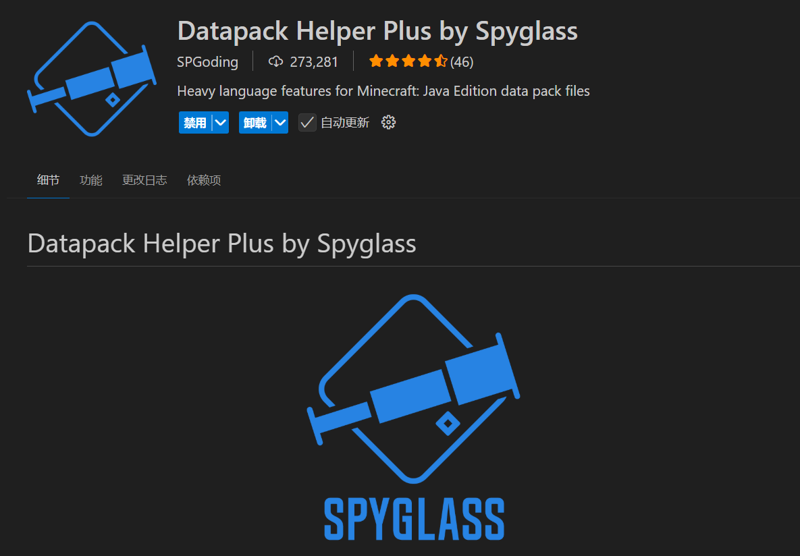

The data pack plug-in is ready, the audio files are ready, and the cover map is ready

Let's start creating a new folder for resource pack and configure resource pack parameters

Let us return to **Explorer**, right-click in the workspace, select New Folder, and give it a **full of love** name

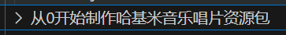

Next, create and **rename** the following files/folders in this *Hakimi music resource pack folder*

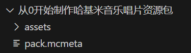

Among them, **pack.mcmeta** is the introduction file of the resource pack, which contains the version information and description of the resource pack.

Write the following content into it

```
{
    "pack": {
        "description": "A hajimi music disc resource pack",
        "pack_format": 61
    }
}
```
Let’s take a look at the key names

+ description - the description of the resource pack, introduce to the little Hakimi what the resource pack is used for
+ pack_format - the version of the resource pack, the specific value can be obtained from the wiki

If you have a resource pack cover, please place it in your favorite resource pack folder and rename it to **pack.png**
~~Pretend I have a picture of Hakimi~~

Next, target our *assets* folder and create our resource pack *namespace* folder inside it

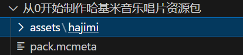

Remember this folder named hajimi. Most of our subsequent operations will revolve around hajimi - this &lt;namespace&gt; that everyone likes.

Back to our favorite action: creating new files and folders
Continue to create the following files and folders

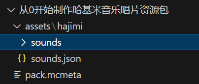

Next, put the Hakimi music into the *sounds* folder. In order to distinguish the various Hakimi, I named the music file **hajimisic.ogg**

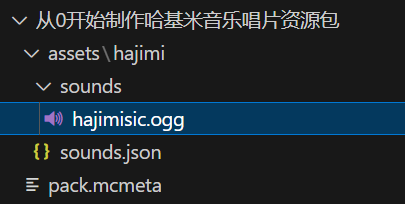

The new operation is over for the time being. The results are much better. You have learned how to make a resource pack (adding more sound effects to the game). Now you will officially enter the data pack tutorial.

***
### 1.2 - Define sound events

Check out the **resource pack** page on the wiki
Get the following information

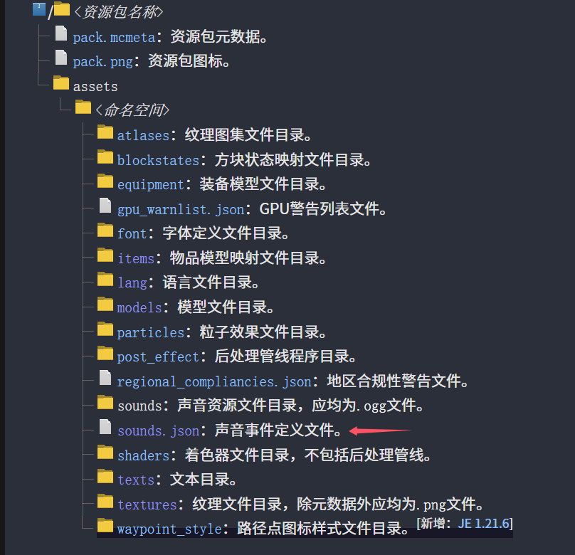

Among them, the *sounds* folder is the folder where our Hakimi music files are stored, and the **sounds.json** file tells MC that we have such music, what is its name **key name**, and which music file should be played (or which music event should be called)

Check the wiki and get the following information about **sounds.json**

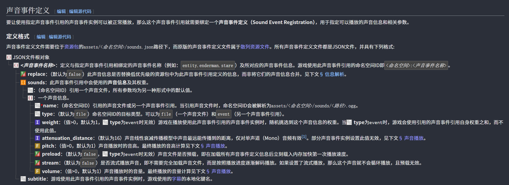

I believe you, the smart one, must have understood it~~The smart Hakimi has already begun to sigh~~, what? Don’t understand? It doesn't matter, all we need to use is the name, stream and subtitle *(optional)* under the json array sounds

Open our **sounds.json**. Oh my God, there isn’t even a hakimi here. Let’s add some breathtaking content!

Remember the format you just learned in the wiki? Don’t remember? You Hakimi...
Sure enough, it still needs to be taught step by step?

Then type the following

```json
{
  "disc.hajimisic": {
    "sounds": [
      {
        "name": "hajimi:hajimisic",
        "stream": true
      }
    ],
    "subtitle": "哈基米：哈气"
  }
}
```
Do you understand?
In this way we define a file called`hajimi:disc.hajimisic`music event, where **hajimi** is the namespace of the resource pack, **disc.hajimisic** is the name of the sound event. This music event calls the music file named hajimisic located under the resource pack of hajimi. When calling, there will be subtitles (the one in the lower left corner of the player screen) *Hakimi: Hajimisic* appears.

The various key names present here have the following functions

+ disc.hajimisic - the "name" of the sound event, we will use it when using it
+ sounds - the sound being called, that is, what "sound content/sound units" our sound event contains
+ name - the "name" of the uttered content
+ stream - streaming media playback, because the playback time of our audio files is too long (audio of 60s+ is generally considered to be long audio), our *gasp* audio has a full 99 seconds! So fill in true for this item (if your audio is a short audio, you don’t need to fill in this item)
+ subtitle - When playing audio, the subtitle prompt content in the lower right corner of the game (for example, Sheep: Eating grass)

At this point, congratulations on taking the first step. Next, how to use data pack to call this resource pack in the game.

Are you ready? Let's keep breathing!

## 2 - Create album data pack

The great Mojang let us define sound events, God said: Define it a second time

So believers~~data pack authors~~ have to define the same sound event twice

***
### 2.1 - Create a new folder? Create new folder

Without going into details, check the wiki to get the following file structure:

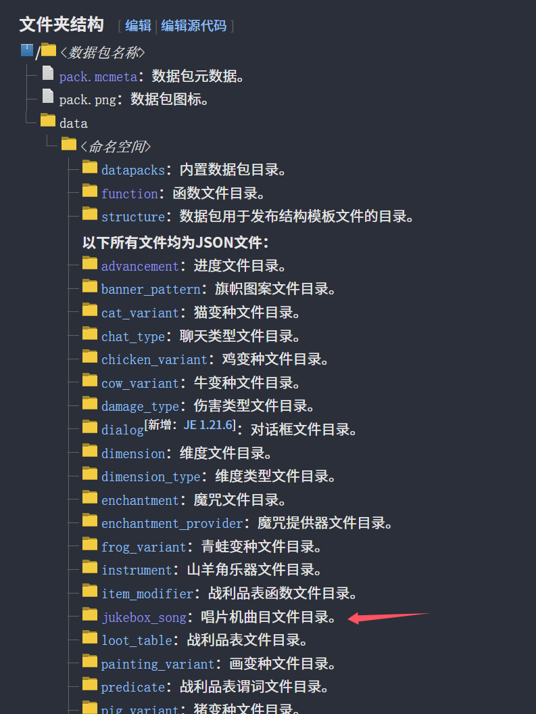

Except data pack elements (**pack.mcmeta**data pack information, **pack.png**data pack icon)

For the data pack information (**pack.mcmeta**), check the wiki and get it with a sigh of relief~~Let's pretend that I already have the data pack cover image~~

```
{
    "pack": {
        "description": "A hajimi music disc datapack",
        "pack_format": 61
    }
}
```
Looks familiar, right? The structure is exactly the same as the resource pack!
If you forgot, let's take a look at the key names again

+ description - the description of the data pack, introduce to the little Hakimi what the data pack is used for
+ pack_format - version of data pack, the specific value can be obtained from the wiki

In addition, the easy-to-get **jukebox_song** is an object that needs to be focused **haha**
Decisively build a new one! *(remember to breathe)*

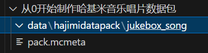

***
### 2.2 - Define turntable tracks

Then go to the wiki to check the jukebox_song entry ~~ Why can’t Vscode have a built-in wiki? ~~

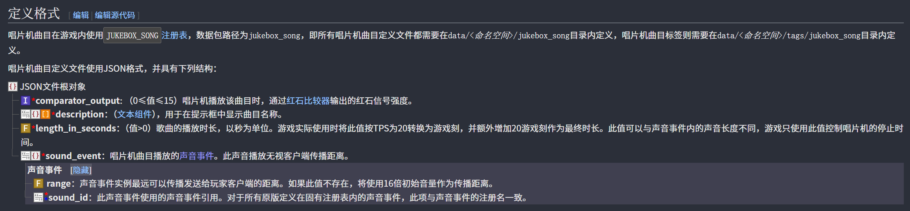

Why are there so many required entries? Write! (Named here **hajimi_song.json**)

```json
{
  "comparator_output": 0,
  "description": "哈基米想要哈气",
  "length_in_seconds": 99.0,
  "sound_event": {
    "sound_id": "hajimi:disc.hajimisic"
  }
}
```
good! Finished! Let’s take a look at the parameters.

+ comparator_output Redstone output strength? It has nothing to do with breathing, don’t worry about it
+ description Play track name? Just write the song title
+ length_in_seconds audio length? It is the audio length (unit: seconds)
+ sound_event sound event? Sound event!


Remember the **Sound Event** in [1.2 - Define Sound Events](#1.2 - Define Sound Events)? The sound id we want to quote is that one!`hajimi:disc.hajimisic`Fill in!

The sound event id is`hajimi:disc.hajimisic`, you can use /playsound to play to the player, and the album track ID is`hajimidatapack:hajimi_song`In order to facilitate the management and writing of more hajimi **Please change the names of all the same tracks to the unified hajimi**. Different naming methods are used here just to demonstrate different hajimi.

Finally, let’s take a look at the structure of data pack

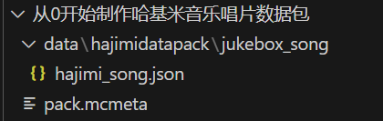

Isn't it very simple?

The data pack ends here.
But is all the fuss over? not yet!

***
### 2.3 - Load custom albums within the game

The great Mojang, after the believers have gone through a lot of hardships, said again: Sound events are defined three times
So all the believers went crazy...

Now that everything is ready, all we have to do is reference this album track in the game. How to do it?
Or check the wiki! (Salute to the great wiki god)

In the **data component** entry, there is such a component **jukebox_playable** (updated in 24w21a)

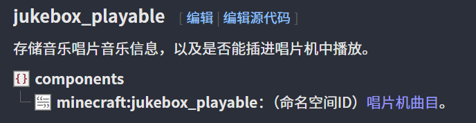

When I read it, I thought it was very easy to write!

```mcfunction
#1.21.4
give @s diamond[jukebox_playable={song:"hajimidatapack:hajimi_song"}] 1
```

```mcfunction
#1.21.5
give @s diamond[jukebox_playable="hajimidatapack:hajimi_song"] 1
```
Give yourself one to play`hajimidatapack:hajimi_song`of diamonds!

This is for you, thank you for being able to follow along to get here!