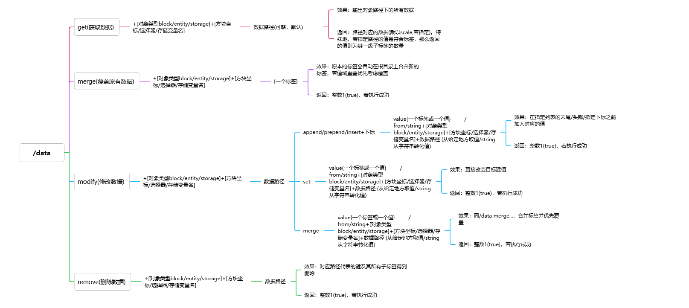
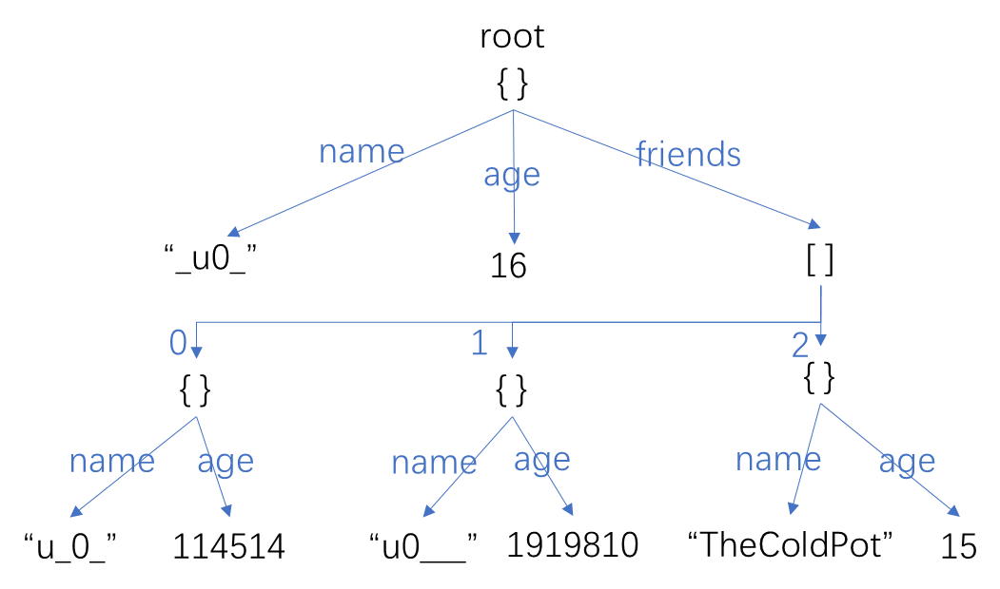
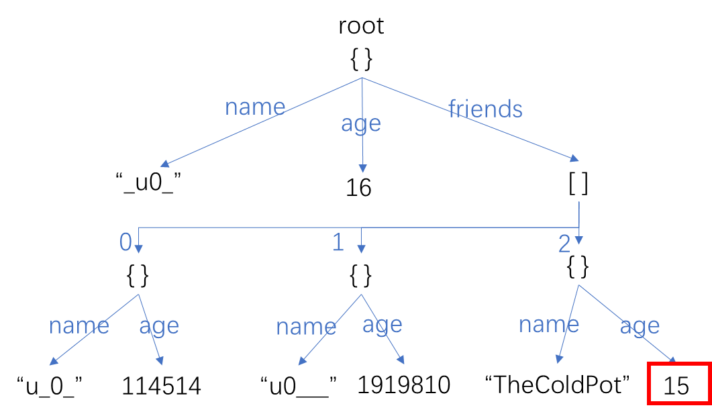
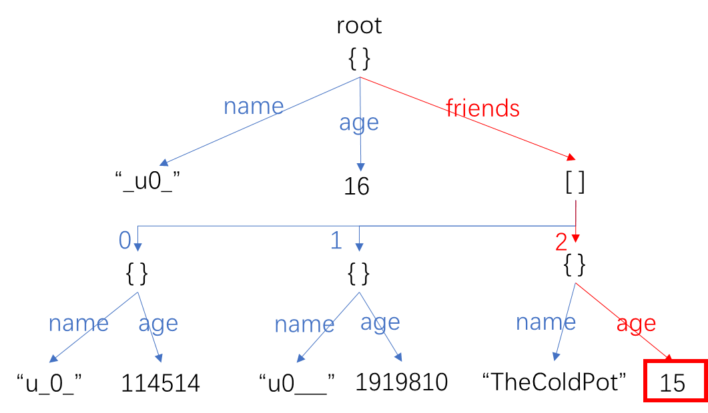

<FeatureHead
    title = "data pack's ultimate value-saving principle - what is SNBT"
    authorName = "xiaou0"
/>


*This tutorial is a simple and easy-to-understand nanny-level tutorial on how to store composite variables in data pack (by xiaou0)*


Since we are going to introduce the concept of numerical tags, we still have to speed through what BPlayer envies most first.`/data`instruction.`/data`The grammatical structure is first composed of two enumeration subcommands:

```
`
/data +	get		+	block	+	...
		merge		entity
		modify		storage
		remove
```
`

The first level of enumeration`{get,merge,modify,remove}`Indicates the operation you want to perform, the second level of enumeration`{block,entity,storage}`Indicates the object you want to operate on.

Putting aside the first level of enumeration, let’s first explain the meaning of the second level of enumeration, that is

## Where can I save tags?

### block——blockentity

Blockentity is a concept in the game. It refers to a block with an entitytag. Let’s not go into the details of the difference between entitytag and non-entity status here (you probably know that one uses`{}`to install, the other is to use`[]`Just pretend)

For example, boxes, funnels, and command blocks are common blocks with the property of "blockentity" - yes, I prefer to describe blockentity as a property of a type of block itself, rather than a popular type of block. There are subtle differences between the two descriptions.

### entity——entity

Entity, in layman's terms, means that it can be`/kill`Object. As far as I know, all entities have entitytags (please point out any counterexamples).

For example. player, cow, zombie, bow and arrow, display entity.

### storage——storage

Storage, is more intuitive than the first two, in fact,`storage`The tags in can be regarded as global variables of the archive, and are also the storage locations that are considered the most priority when storing values.

at the same time,`storage`It has the broadest storage conditions: you can insert any value in the root tag. Unlike entity, if you want to insert custom data, you can only insert it in`data`Proceed under the sub tag.

The storage location is defined on first access, so there is no need to worry about object definitions.


After introducing where to store data, it is much easier to introduce the data storage method. General syntax [WIKI](https://zh.minecraft.wiki/w/%E5%91%BD%E4%BB%A4/data?variant=zh-cn), only a concise and concise description will be given here:




So here it is, about`/data`That’s it for the grammar part. If you still don’t understand some of the terms, don’t worry, you’ll have a clear understanding when you come back after reading the entire article.

## What are Key-Value Pair and SNBT (Stringified Named Binary Tag)

Regarding key-value pairs, [Mengcha’s video](https://www.bilibili.com/video/BV1fXV8zvEj8/?spm_id_from=333.337.search-card.all.click&vd_source=a379beb1b990fd565e14f375abf970ea) has very detailed instructions, and I will make a few additions here:

For key-value pairs in MC, the **key name** part before the colon can be plain text.`a:1d`, or it can be a string enclosed in quotes`"b":2f,'c':"xiaou0"`, the two narrative methods are basically equivalent. The only difference is that when there are individual symbols in the key name (such as`:`), you need to put quotation marks to avoid ambiguity.

### So what is SNBT?

Of course, if you want to learn data pack systematically, JSON is definitely one of the required courses, and the format of JSON is similar to SNBT ([JSON tutorial here](https://www.runoob.com/json/json-tutorial.html))

To put it simply, there are three completely different concepts in SNBT:

#### Single value structure

The most basic structure in SNBT is represented by a single value - this single value can be of the following types:

​ Byte type (`-b`): an integer between -128 and 127 (`= 8 bit = 1 byte`)

​ Unsigned byte type (`-ub`): an integer from 0 to 255 (`= 8 bit = 1 byte`)

​Short(`-s`): an integer from -32768 to 32762 (`= 16 byte`)

​ Unsigned short(`-us`): an integer from 0 to 65535 (`= 16 byte`)

​ Integer(`i`or no special symbols):$[-2^{31},2^{31}-1]$Integers in (`= 32 byte`)

​ Unsigned integer (`ui`)：$[0,2^{32}-1]$Integers in (`= 32 byte`)

​ Long(`l`)：$[-2^{63},2^{63}-1]$Integers in (`= 64 byte`)

​ Unsigned long(`ul`)：$[0,2^{64}-1]$Integers in (`= 64 byte`)

​Single precision floating point type (`f`): no more than`32 byte`of rational numbers

​Double precision floating point type (`d`): no more than`64 byte`of rational numbers

​ string(`"" or ''`): a string consisting of Unicode characters

Objectively speaking, strings are also classified as linear structures. However, strings in MC do not support subscript access and are therefore classified as single values.

> Editor: The string of mc can be accessed by subscript using the string subcommand.

#### Linear structure

​ A structure composed of multiple sibling values and tags.

There are two types of linear structures in SNBT:

**Key value set**, consisting of`{}`Identity, a set composed of multiple sibling elements. Note that because it is a set, it is unordered, while a list is ordered.

Each comma-separated value of a value set is called an element of the value set.

The key name of the value set must be unique, that is, one key can only correspond to one value.

​ Therefore, the values ​​in the value set can be uniquely represented by key names, such as`set:{a:1,b:2}`middle,`set.a`It means`a`The value is 2. Note the dot between the key names.`.`separated.

**List** is essentially the List array in java. It supports$O(1)$subscript access, and$O(n)$The element search corresponds to SNBT, which is those enclosed by square brackets`[]`enclosed things.

Each comma-separated value in the list is called an element of the list.

In the latest version, the type restriction of the list has been lifted, and the elements of the list can be of different types, or subtags of different structures.

(This also leads to`{}`The gap between compound tags and lists is further reduced, and lists are equivalent to tags and have an advantage, that is, orderliness)

​ In a list, all elements are arranged in a column in order and have a label. This label is generally called **subscript**. It is worth noting that the value range of the subscript is$[0,n-1]$rather than$[1,n]$, where n is the number of elements.

For example, in the list`list:["a","b","c"]`middle,`list[0]`The corresponding value is`"a"`，`list[1]`The corresponding value is`"b"`，`list[2]`The corresponding value is`"c"`In particular, there are lists of specified types, which are generally written as`[I;...]`in`I`Represents an integer type. The same applies if it is replaced by other types.

Lists also support key-value access, provided that the key value points to a unique tag, for example`list:[{name:"a",age:1},{name:"b",age:2}]`middle,`list[{name:"a"}]`The tag pointed to is`{name:"a",age:1}`This whole tag.

**Composite Structure**

​ I would like to give an example, SNBTtag (Note: There is no line break and indentation when writing it. If you want to wrap the line, you need to type it in the data pack.`\`to prompt)

```snbt
{
	name:"_u0_",
	age:16,
	friends:[
		{name:"u_0_",age:114514},
		{name:"u0___",age:1919810},
		{name:"TheColdPot",age:15}
	]
}
```
​ can always be clearly written in the form of a tree:



At this point, we have officially revealed the essence of SNBT: it is a rooted tree composed of edges with key names.

​ We define the concept of **siblings**, that is, two sub-tags with the same "**father**" tag are at the same level.

​ It is not difficult to find that elements at the same level all have a linear structure, and this structure in which multiple structures are connected through a tree-like "father-child" relationship is a composite structure.

After understanding the composite structure, we might as well consider how to get the value of the composite tag?

​ It’s very simple, because each key name of each substructure has a unique value. It can be proved by induction that a unique combination of key names can determine the unique value on the tree.

​ Corresponding to SNBT in string form, you only need to find all the key names (or list subscripts) before the corresponding value, and then stack them "buff" -

For example, if I want to know the age of Leng Guojiang, then we first locate his position in the composite structure:



Then find its path to the root node from bottom to top:



So obvious,`friends[2].age`This is the key name we are looking for.


### Some random stuff you might want to know:

1. When maintaining the conforming structure, its complexity is highly affected by its "tree depth", so in the case of fewer key values:

   Such as`list:[{a:1,b:2},{a:2,b:3}]`, written as`lista:[1,2],listb[2,3]`Better.

2. In use`/execute if`When performing data matching, only the values ​​on a given path will be matched. In particular, if the value is a list, it will only match the target list in order.

3. Little u0 is really 16 years old

### Some links

- [u0's homepage](https://space.bilibili.com/1998573191)
- [Big Brother Mengcha’s homepage](https://space.bilibili.com/320500029)
- [Cold pot homepage](https://space.bilibili.com/521345404)
- [wiki/data](https://zh.minecraft.wiki/w/%E5%91%BD%E4%BB%A4/data?variant=zh-cn)
- [wiki/execute](https://zh.minecraft.wiki/w/%E5%91%BD%E4%BB%A4/execute)
- [JSON Tutorial](https://www.runoob.com/json/json-tutorial.html)
- [Tree-OIwiki](https://oi-wiki.org/graph/tree-basic/)
