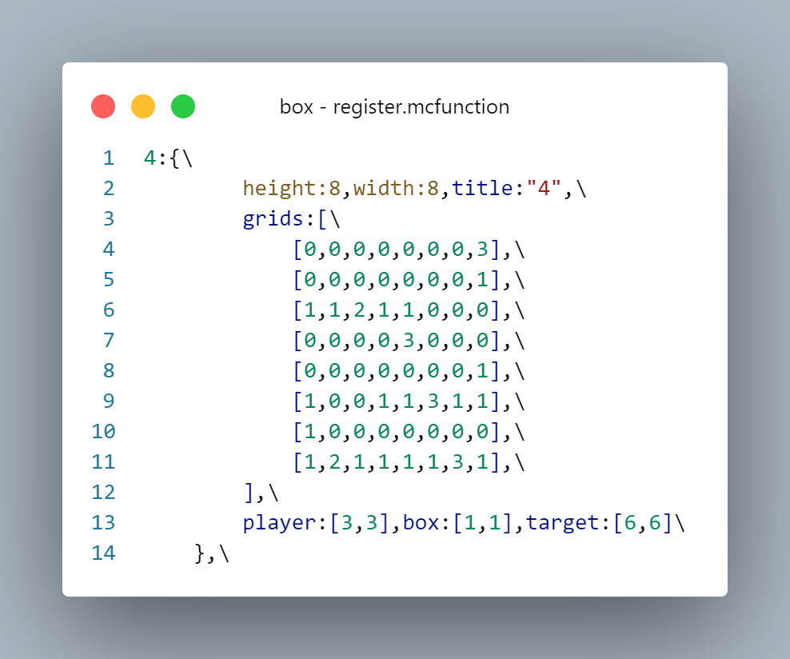
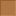
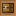

<FeatureHead
    title = "Using Dialog to Create a 2D Game"
    authorName = "CR_019"
    cover='../../../../../feature/archive/202506/_assets/dust_8.png'
/>

## Introduction
In 25w20a, Mojang introduced the definition of dialog, allowing players to customize a dialog similar to the pause interface. Therefore, I thought about whether I could use dialog to make 2D games, such as pushing boxes, and did some practice. Below are the results of my research.

::: tip
In this article, we will not stick to the syntax of the dialog, but focus on explaining the implementation ideas and technical details that need to be paid attention to. Readers who want to start with dialog from scratch can go to the wiki to check it out, or search for other tutorials.
:::

## Backend preparation
Let's take the push box game I made as an example. The game logic processing part is not the focus of this article and will be skipped here;
The work of the backend should be as follows: after feeding back the operation of the front-end dialog, store the current game state in the designated storage as required to facilitate the reading and display of the front-end dialog. In the small game of pushing boxes, we can store the fixed map as a two-dimensional list, with the player's movable area recorded as 0 and the obstacle area recorded as 1; then the variable player, box, and target point are stored in 2-element lists respectively for processing in the dialog part.



## Dynamic dialog
Next we focus on the dialog part. The registration method provided by mj is to define it in the dialog folder using json format. There is nothing dynamic about this method, and it cannot be reloaded with reload, so we only use it for fixed interfaces such as the title interface.
The game interface needs to dynamically display the current positions of the player and the box and dynamically read data, so pre-registered dialogs cannot be used. Fortunately, mj has added support for inline dialog in the dialog command, which means that we directly connect a dialog parameter that meets the requirements after the command, or we can directly generate a dialog. Combined with the function macro, we can read the current status display of the game in real time.

For convenience, we can write the complete dialog format into storage, and then pass it into the command as a whole macro parameter.

```mcfunction
$dialog show @s $(dialog)
```
Next, we pre-insert the unchanged parts of the dialog into the storage:

```mcfunction
data modify storage minecraft:box dialogs.dialog set value {\
    "type":"multi_action",\
    "title": "推箱子",\
    "pause":false,\
    "after_action":"none",\
    "body":[\
        {\
            "type": "plain_message",\
            "width": 300,\
            "contents": []\
        }\
    ],\
    "columns":3,\
    "actions":[\
        ...\
    ]\
}
```
The button part of actions will be explained in detail in the next section and will be omitted here.
Since we need to monitor button processing, we set pause to false to prevent the dialog from pausing the game;
At the same time, the default button behavior will close the dialog, which will cause the mouse cursor to reset to the center of the screen and cause a splash screen, which greatly affects the experience. Therefore, we need to modify the default button behavior to none and do not perform unnecessary operations.
Notice that the body part, which is the part that displays text, is currently empty, because we need to dynamically read the map information mentioned above and display the terrain and player position.

```
mcfunction
function lay:macro/list/init {list:"storage box gameplay.level_dat.grids",func:"x:dialog/level/list1"}
```
This is a list traversal macro prefix I wrote myself. Its purpose is to traverse the specified list and pass one item of the list into the specified function as a macro parameter. Let's continue to look at the function referenced in it:

x/function/dialog/level/list1:

```
mcfunction
$data modify storage box dialogs.temp.grids set value $(value)

data modify storage minecraft:box dialogs.dialog.body[0].contents append value {"text":"\n\n","font":"box:box","shadow_color":[0,0,0,0],"extra": []}

function lay:macro/list/init {list:"storage box dialogs.temp.grids",func:"x:dialog/level/fill_grids"}
```

x/function/dialog/level/fill_grids:

```
mcfunction
$scoreboard players set #grid box_temp $(value)

execute if score #grid box_temp matches 0 run data modify storage box dialogs.dialog.body[0].contents[-1].extra append value {"text":"\u0001\u0020"}
execute if score #grid box_temp matches 1 run data modify storage box dialogs.dialog.body[0].contents[-1].extra append value {"text":"\u0002\u0020"}
```
Because it is a two-dimensional list, two levels of traversal are used. First, add a line to the list and set the font and other formats to be used. Then, in the second level of traversal, obtain the information of each coordinate and display the corresponding font.

 

special,`\u0020`It is a set negative space character, used to eliminate the gaps between the default characters and join the character pictures together.
The vertical line spacing cannot be changed currently, so the height of the grid unit is set to double the line spacing, so that two line breaks can be used to make the grid seamlessly spliced ​​vertically.

Next we read the coordinates of the player, box, etc. and display them on the map:

```
mcfunction
function x:dialog/level/icons with storage box gameplay.pos
```


x/function/dialog/level/icons:

```
mcfunction
$data modify storage box dialogs.dialog.body[0].contents[$(target_y)].extra[$(target_x)] set value "\u0013\u0020"
$data modify storage box dialogs.dialog.body[0].contents[$(player_y)].extra[$(player_x)] set value "\u0011\u0020"
$data modify storage box dialogs.dialog.body[0].contents[$(box_y)].extra[$(box_x)] set value "\u0012\u0020"
```
For simple processing, character images such as players and boxes include the grid below, so we only need to read the positions of these icons, and then find the corresponding coordinates and replace them directly.



In this way, we only need to execute this level function every time we refresh, and we can read the current status of the game in real time and display it on the dialog.

## Buttons and routes
Now that the display problem has been solved, let’s look at the operation problem.
In the game interface, we need to press the arrow keys below to move;
In addition, we also need to jump between the homepage, level selection interface, and game interface.
There is actually not much difference between these operations. They all trigger a command after clicking the button. Therefore we explain them together.

Due to the limitations of mj, executing permissioned instructions requires a second confirmation (a pop-up window will pop up), which is undoubtedly unacceptable in small games that require frequent operations. Therefore, we need to use the trigger command with permission level 0 to trigger indirectly.

> Players who are into command in newer versions may not know what a trigger is. In fact, I didn’t know anything about it before I made this little game. Simply put, trigger is a special type of scoreboard criterion. After being activated, its value can be modified using the /trigger command. The data pack can then poll for changes in its value to trigger some instructions just like it detects other scoreboard interfaces.

Let's take a look at the actions part of the levelfunction we just omitted:

```
snbt
    "actions":[\
        {\
            "label":"",\
            "width":50,\
            "action": {\
                "type": "run_command",\
                "command": "trigger box_trigger"\
            }\
        },\
        {\
            "label":"↑",\
            "width":50,\
            "action": {\
                "type": "run_command",\
                "command": "trigger box_operation set 1"\
            }\
        },\
        {\
            "label":"",\
            "width":50,\
            "action": {\
                "type": "run_command",\
                "command": "trigger box_trigger"\
            }\
        },\
        {\
            "label":"←",\
            "width":50,\
            "action": {\
                "type": "run_command",\
                "command": "trigger box_operation set 2"\
            }\
        },\
        {\
            "label":"↓",\
            "width":50,\
            "action": {\
                "type": "run_command",\
                "command": "trigger box_operation set 3"\
            }\
        },\
        {\
            "label":"→",\
            "width":50,\
            "action": {\
                "type": "run_command",\
                "command": "trigger box_operation set 4"\
            }\
        },\
        {\
            "label":"返回选关",\
            "width":50,\
            "action": {\
                "type": "run_command",\
                "command": "trigger box_clicks set 1"\
            }\
        },\
        {\
            "label":"重置",\
            "width":50,\
            "action": {\
                "type": "run_command",\
                "command": "trigger box_operation set 5"\
            }\
        },\
        {\
            "label":"",\
            "width":50,\
            "action": {\
                "type": "run_command",\
                "command": "trigger box_trigger"\
            }\
        },\
    ]\
```
I used two scoreboards, box_trigger and box_operation, which can actually be merged into one. The former does not perform any operations and displays the game interface, which can be omitted in the current version.
box_operation is a scoreboard related to game operations. Each value corresponds to an operation. Let's take a look at the relevant parts of the tickfunction:

```
mcfunction
execute as @a if score @s box_operation matches 1.. run function x:gameplay/operation
scoreboard players enable @a box_operation
```


x/function/gameplay/operation:

```
mcfunction
execute unless score @s box_success matches 1 if score @s box_operation matches 1 run function x:operation/up
execute unless score @s box_success matches 1 if score @s box_operation matches 2 run function x:operation/left
execute unless score @s box_success matches 1 if score @s box_operation matches 3 run function x:operation/down
execute unless score @s box_success matches 1 if score @s box_operation matches 4 run function x:operation/right

execute if score @s box_operation matches 5 run function x:gameplay/start

function x:gameplay/success

scoreboard players set @s box_operation 0
function x:dialog/level
```
The basic logic is: detect the scoreboard score and perform the corresponding operation function, then reset the scoreboard, and finally refresh the dialog.
Of course, there is another success determination here, so I won’t go into details.

The basic logic of routing on the level selection interface is the same, except that I need to add new levels easily, so I added macros to achieve more dynamic operations. If you are interested, you can unpack and study it.

## Conclusion

It is indeed a very interesting practice to use static dialogs to create dynamic mini-games. Many of the poisonous points that ruined the experience have been basically solved in 1.21.6 pre1, and it is now quite usable.
However, the layout of the dialog is still relatively limited. The line spacing cannot be changed. The number of buttons in each row in the button layout cannot be freely set. There are still some limitations. But now the text component can also have click events. I hope to see dialog content completely typeset using text components in the future.
