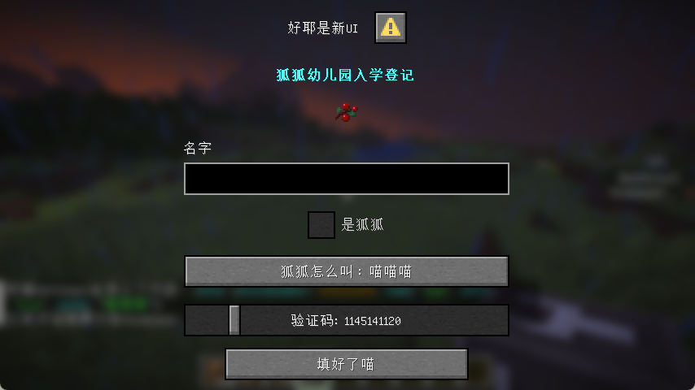

<script setup>
    import SpotlightHead from '/.vitepress/vue/SpotlightHead.vue'
    import ColorLine from '/.vitepress/vue/ColorLine.vue'
</script>
<SpotlightHead
    title = "Vanilla News - Mojang Spotlight - June 2025"
    authorName = "Alumopper"
    cover='../../../../../feature/archive/202506/_assets/spotlight.png'
    type=0
/>

Here is ***Vanilla*** news, the most ***Vanilla*** technical snapshot news in Minecraft. Our reporter *Vanilla Fox* reports the latest snapshot news for you~

This month, Mojang has updated two snapshots: 25w20a, 25w21a, and 4 pre-release versions: 1.21.6-pre1~4. At the time of writing this article, 1.21.6-rc1 has been released, and the update time of 1.12.6 is determined to be 2025.6.15. This month, the data packversion number has reached **80**, an increase of 4 from the previous month. The resource packversion number has reached **63**, an increase of 3 from the previous month. The overall situation is stable and improving.

Let’s talk about the conclusion first. This month’s update is extremely functional, less destructive, and generally optimized. Overall, it falls into the <span style="font-size: 1.5em; font-weight: bold">super large cup</span> level.

In this update, Mojang has added a very promising **dialog** feature.

<ColorLine />

> [!TIP]
>
> For more important destructive changes, they will be marked with 💥

## dialog

Dialog is an extremely important feature added in 25w20a. It allows data pack to define a simple interactive interface using JSON format. Text components can be used to display information, and buttons, text input boxes, etc. can also be used to accept player input. At the same time, through`#pause_screen_additions`tag, you can also add the entrance to the custom dialog to the pause menu. The game provides shortcut keys`G`Open`#quick_actions`dialog in tag.

### A brief introduction

First, to define a dialog, you need to`data/&lt;namespace>/dialog`defined in. To define a dialogtag, you need to`data/&lt;namespace>/tags/dialog`defined in. The definition of dialog and`worldgen`Similarly, **cannot hot reload**. However, you can still inline it into`/dialog`in command.

The dialog is divided into three parts: **Header**, **Content** and **Footer**, and all contents are forced to be centered.

The basic structure of the dialog is as follows:

<div class="nbttree">

<node type="compound" name="Dialog" />Basic definition
- <node type="string" name="type" />dialog type
- <node type="string" /><node type="compound" /><node type="homolist" name="title" />corresponds to the box header, that is, the title, which is a text component
- <node type="compound" /><node type="homolist" name="body" />corresponds to the first part of the content, the main element of the dialog, which can contain various controls
- <node type="homolist" name="inputs" />corresponds to the second part of the content, usually a series of buttons, that is, input controls
- <node type="string" /><node type="compound" /><node type="homolist" name="external_title" />The text used to open this dialog button in the pause screen or other dialogs
- <node type="string" name="after_action" />dialog's post-operation behavior
- <node type="bool" name="pause" />Whether the dialog pauses the game in single-player games

</div>

The main element, i.e.`body`The content in

*`item`: render item
*`plain_message`: text component

And the input control, that is`inputs`The content in

*`boolean`: checkbox
*`number_range`:Number selection slider
*`single_option`: Option button to switch between multiple options
*`text`: Text input box, multi-line or single-line possible

For specific control formats, please refer to [Wiki](https://zh.minecraft.wiki/w/%E5%AF%B9%E8%AF%9D%E6%A1%86%E5%AE%9A%E4%B9%89%E6%A0%BC%E5%BC%8F?variant=zh-cn).

Different dialog types will render different buttons at the bottom, and the behavior that will be performed when these buttons are clicked is called Action. After clicking the button, the actions you can perform include:

* In addition to the text component click event`open_file`All events except
*`dynamic/custom`: Integrate the values entered by all input controls into a composite tag and submit it to the server (command is not used)
*`dynamic/run_command`: Pass the values ​​entered by all input controls into the specified macro command as macro parameters. The executor is the player who sees this dialog.

> [!Warning]
>
> If the execution permission of the command is greater than 0, regardless of whether cheating is enabled, a warning box will pop up, asking the player to confirm the execution of the command.
>
> So, make good use of`trigger`.

Here is a simple example that contains a basic demonstration of most controls:

::: details Example

```json
{
    "type":"notice",
    "title":"好耶是新UI",
    "external_title": "加入狐狐幼儿园",
    "body":[
        {
            "type": "plain_message",
            "contents": {"text": "狐狐幼儿园入学登记", "color": "aqua", "bold": true}
        },
        {
            "type": "item",
            "item": {
                "id": "sweet_berries",
                "count": 1
            },
            "show_tooltip": false
        }
    ],
    "inputs":[
        {
            "type":"text",
            "key":"name",
            "label":"名字"
        },
        {
            "type": "boolean",
            "key": "isFox",
            "label": "是狐狐"
        },
        {
            "type": "single_option",
            "key": "speak",
            "label": "狐狐怎么叫",
            "options": [
                "喵喵喵",
                "咕咕咕",
                "嘤嘤嘤",
                "大楚兴陈胜王"
            ]
        },
        {
            "type": "number_range",
            "key": "phoneNumber",
            "label": "验证码",
            "label_format": "%s: %s",
            "start": 1000000000,
            "end": 2000000000,
            "step": 1,
            "initial": 1145141145
        }
    ],
    "action": {
        "label": "填好了喵",
        "action": {
            "type": "dynamic/run_command",
            "template": "data modify storage test:input data set value {name:'$(name)', isFox:'$(isFox)', speak:'$(speak)', phoneNumber: $(phoneNumber)}" 
        }
    }
}
```
:::

The effect is as shown in the figure



### Example display

Push box game produced by CR_019:

<div class="bilibili-video-container"><iframe 
    src="//player.bilibili.com/player.html?isOutside=true&aid=114519531589209&bvid=BV1ngEhzQEVj&cid=29997664427&p=1&autoplay=0" 
    scrolling="no" 
    border="0" 
    frameborder="no" 
    framespacing="0" 
    allowfullscreen="true"
    class="bilibili-video"></iframe>
</div>

2048 mini-game produced by Ethereal Workshop:

<div class="bilibili-video-container"><iframe 
    src="//player.bilibili.com/player.html?isOutside=true&aid=114559327144464&bvid=BV1SpjWzkEyB&cid=30117530438&p=1&autoplay=0" 
    scrolling="no" 
    border="0" 
    frameborder="no" 
    framespacing="0" 
    allowfullscreen="true"
    class="bilibili-video"
    ></iframe>
</div>

Minesweeper made by Xiaoqizi:

<div class="bilibili-video-container"><iframe 
    src="//player.bilibili.com/player.html?isOutside=true&aid=114606437634679&bvid=BV1Kf7gzvEmM&cid=30263347211&p=1&autoplay=0" 
    scrolling="no" 
    border="0" 
    frameborder="no" 
    framespacing="0" 
    allowfullscreen="true"
    class="bilibili-video"
    ></iframe>
</div>

## Others

New in 25w20a`can_be_sheared`The item component allows the player to remove this item by right-clicking the target entity with scissors, and also adds`shearing_sound`Sound event, controls the sound effect played when this item is cut.

Added in itemmodel mapping file in 1.21.6-pre1`oversized_in_gui`Field that controls whether the item can exceed the slot border when rendered in the item bar. Otherwise, the item will be truncated at the border. Added`minecraft:player_head`Model, used to render the player's head.

::: tip

In the update article of 1.21.6-pre1, the official left these words:

- *This ability of items being rendered outside their slots should not be considered officially supported, it was temporarily restored as an exception since many servers are relying on it*
- Rendering items beyond the grid they occupy is not officially supported behavior, but because many servers rely on this, this feature is treated as an exception and will not be fixed.

- *At some point in the future we hope to replace it with an officially supported way of achieving similar functionality*
- We would like to replace it in the future with a way that achieves the same functionality but is officially supported.


:::

In addition, the sound has been optimized and adjusted for the newly added dialog function, and some sound effects have been renamed. Added saddle recipes and replaced the saddle in the original loot box with leather. For more detailed information, please see [Wiki](https://zh.minecraft.wiki/w/Java%E7%89%881.21.6/%E5%BC%80%E5%8F%91%E7%89%88%E6%9C%AC#25w20a)~
