::: tip Translation notice
This page was translated with machine translation and may contain inaccuracies. If you can help improve it, please open an issue or submit a pull request.
:::


<FeaturedHead
    title = "In case you don't know I can play Qianlianwanhua in MC"
    authorName = "SKSAMA"
    resourceLink = 'https://ymqlgthbsakuradream.github.io/posts/minecraft/Archive.20250705.html'
    cover='../../../../../feature/archive/202507/_assets/0.png'
/>

Don't say anything when you come in, just shout together:

<p style="font-size: 36px;"> Ciallo～ (∠・ω&lt; )⌒★</p>

Welcome to our MC **旮旯给木(Galgame)** project. This project aims to create a dialog similar to Galgame in a simple way.

- How it works: vanilla game, **[data pack](https://zh.minecraft.wiki/w/%E6%95%B0%E6%8D%AE%E5%8C%85)**
- Supported version: **>=1.21.5**
- **Supports concurrent use by multiple people**

## Ⅰ Environment preparation

Place the data pack under the **datapacks** folder of the archive. In order to facilitate subsequent editing and adjustment, we need to decompress the compressed data pack and then use [**Visual Studio Code**](https://code.visualstudio.com/)Open the data pack folder.

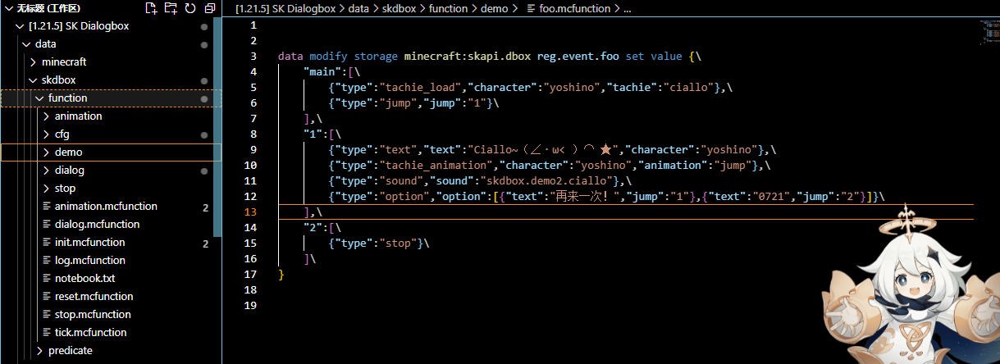

Expand to **foo.mcfunction** in the **demo** folder. It is recommended that subsequent demonstrations and operations be performed in this file.

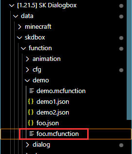

Assume that there is the following command in **foo.mcfunction** now. It doesn’t matter if you can’t understand it now. It’s just a demonstration.

```mcfunction
data modify storage minecraft:skapi.dbox reg.event.foo set value {\
    "main":[\
        {"type":"tachie_load","character":"yoshino","tachie":"ciallo"},\
        {"type":"jump","jump":"1"}\
    ],\
    "1":[\
        {"type":"text","text":"Ciallo~（∠・ω< ）⌒ ★","character":"yoshino"},\
        {"type":"tachie_animation","character":"yoshino","animation":"jump"},\
        {"type":"sound","sound":"skdbox.demo2.ciallo"},\
        {"type":"option","option":[{"text":"再来一次！","jump":"1"},{"text":"0721","jump":"2"}]}\
    ],\
    "2":[\
        {"type":"stop"}\
    ]\
}

```


It is not difficult to notice that each line of this command ends with `\`, which is not conducive to our editing. One solution is to write the content in the Json file first, then search and replace, and add `\` to the end of the line in batches.

Before starting, you can try some sample programs built into the data pack. Please run the following command in the chat bar.

```mcfunction
/function skdbox:dialog {id:"demo1"}
```


```mcfunction
/function skdbox:dialog {id:"demo2"}
```


## Ⅱ Event List

Displaying text, displaying vertical images, playing voice and other operations are collectively called events, and events are stored in the event list.

### basic

#### Define event list

```mcfunction
data modify storage minecraft:skapi.dbox reg.event.<事件列表ID> set value <事件列表>
```


Parameter description
**&lt;Event List ID&gt;** The ID of the event list, this is unique
**&lt;Event List&gt;** A composite tag containing all events, the format is as follows

<div class="nbttree">

<node type="compound" name="(root tag)" />
- <node type="homolist" name="main" />Entry sublist
- <node type="homolist" name="(sublist name)" />a sublist

</div>

#### Play event list

```mcfunction
function skdbox:dialog
```


**Executor** Specifies who to play the event list to. Only a single player can be specified.
**parameter**

<div class="nbttree">

<node type="compound" name="(root tag)" />
- <node type="string" name="id" />The id of the event list

</div>

#### Termination event list

The event list can be automatically terminated when the playback is completed. Of course, you can also terminate it directly using this function.

```mcfunction
function skdbox:stop
```


### text event

Text events, as the name suggests, are to display text on the player screen. After a text is displayed, it will wait for the player to press the space bar, and then display the next text.

<div class="nbttree">

<node type="compound" name="(Text event root tag)" />
- <node type="string" name="type: text" />This item indicates that the event is a text event
- <node type="string" name="text" />The text to be displayed, plain text, does not support text components, you can use escape
- <node type="string" name="character" />The speaking character is used to control the character name and description above the displayed dialog. If it does not exist, the data used when the text event was last called is used. If this is NULL, the role name and description are not displayed. For more information about role definition, see Defining Roles
- <node type="string" name="display_name" />Character name (this will overwrite character)
- <node type="string" name="description" />Character description (this will overwrite character)

</div>

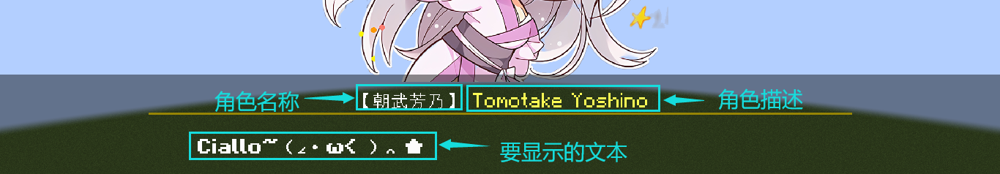

Now let's look at a demonstration, put the following command into `foo.mcfunction`, and then reload the data pack
Regarding `"character":"roka"`, for the convenience of demonstration, data pack has defined some roles. For details, see [Define Roles](#3.1)

```mcfunction
data modify storage minecraft:skapi.dbox reg.event.foo set value {\
    "main":[\
        {"type":"text","character":"NULL","text":"「嘛......要说也的确是好久没来了」"},\
        {"type":"text","character":"roka","text":"「这就直接去志那都庄了？」"},\
        {"type":"text","character":"NULL","text":"「是这个打算」"},\
        {"type":"text","character":"roka","text":"「那我也一起走比较好吧，因为好久不见，再聊会吧」"},\
    ]\
}
```


Just type it in the chat bar and it will run.

```mcfunction
/function skdbox:dialog {id:"foo"}
```


In the following demonstration, in order to facilitate modification and editing, the event list composite tag will be displayed directly in the form of json, like this

```json
{
    "main":[
        {"type":"text","character":"NULL","text":"「嘛......要说也的确是好久没来了」"},
        {"type":"text","character":"roka","text":"「这就直接去志那都庄了？」"},
        {"type":"text","character":"NULL","text":"「是这个打算」"},
        {"type":"text","character":"roka","text":"「那我也一起走比较好吧，因为好久不见，再聊会吧」"},
    ]
}
```


<div id="2.2"></div>

### Delayed event

Thanks to timing control, we can complete many useful operations

If there are only text events in the event list, its timing is like this

Text typing animation takes time depending on the length of the text

```json
{
    "main":[
        {"type":"text","character":"NULL","text":"第一句话"},
        {"type":"text","character":"roka","text":"第二句话"},
    ]
}
```


```mermaid
gantt
    axisFormat %S
    dateFormat ss
    section tick
    加载文本事件           :active, after des1, 1s
    打字动画              :4s
    等待玩家按下空格        :3s
    加载文本事件           :active, 1s
    打字动画              :4s
    等待玩家按下空格        :3s

```


If other events are added after the text event, these events will be executed at the same time as the text event.

```json
{
    "main":[
        {"type":"text","character":"NULL","text":"第一句话"},
        {"type":"tachie_load","character":"roka","tachie":"1"},
        {"type":"text","character":"roka","text":"第二句话"},
        {"type":"tachie_modify","character":"roka","tachie":"2"},
        {"type":"tachie_animation","animation":"jump"}
    ]
}
```


```mermaid
gantt
    axisFormat %S
    dateFormat ss
    section tick
    加载text           :active, a, after 0, 1s
    打字动画              :b, after a ,4s
    加载tachie_load           :active, after 0, 1s
    等待玩家按下空格        :c, after b,3s
    加载文本事件           :active, d, after c,1s
    打字动画              :e, after d,6s
    加载tachie_modify           :active, f, after c,1s
    加载tachie_animation           :active, g, after c,1s
    播放立绘动画              :after g,3s
    等待玩家按下空格        :after e,3s

```


It is not difficult to find that the tachie_modify event and the tachie_animation event are executed at the same time, but we hope to delay the execution of the tachie_animation event for a period of time after executing the tachie_modify event.

In this case, you need to use delayed events, the format is as follows

<div class="nbttree">

<node type="compound" name="(delayed event root tag)" />
- <node type="string" name="type: delay" />This item indicates that the event is a delayed event
- <node type="int" name="time" />Delay time (tick)

</div>

```json
{
    "main":[
        {"type":"text","character":"NULL","text":"第一句话"},
        {"type":"tachie_load","character":"roka","tachie":"1"},
        {"type":"text","character":"roka","text":"第二句话"},
        {"type":"tachie_modify","character":"roka","tachie":"2"},
        {"type":"delay","time":2},
        {"type":"tachie_animation","animation":"jump"}
    ]
}
```


```mermaid
gantt
    axisFormat %S
    dateFormat ss
    section tick
    加载text           :active, a, after 0, 1s
    打字动画              :b, after a ,4s
    加载tachie_load           :active, after 0, 1s
    等待玩家按下空格        :c, after b,3s
    加载文本事件           :active, d, after c,1s
    打字动画              :e, after d,6s
    加载tachie_modify           :active, f, after c,1s
    delay           :active, h, after c,2s
    加载tachie_animation           :active, g, after h,1s
    播放立绘动画              :after g,3s
    等待玩家按下空格        :after e,3s

```


<div id="2.3"></div>

### standing painting incident
Only text is still too monotonous, vertical drawing is essential

The vertical drawing event uses the character ID as the index, so the vertical drawing of the same character cannot be loaded multiple times at the same time.

For details on role definition, see **[Define Role](#3.1)**

#### Load vertical painting tachie_load

<div class="nbttree">

<node type="compound" name="(event root tag)" />
- <node type="string" name="type: tachie_load" />This item indicates that the event type is: loading vertical painting
- <node type="string" name="character" />Character ID
- <node type="string" name="tachie" />Vertical painting ID
- <node type="string" name="position" />The xcoordinate of the vertical painting, the default is CENTER, the optional values ​​are LEFT, M_LEFT, CENTER, M_RIGHT, RIGHT. If you want to use a custom value, please see the global settings of vertical painting for details.
- <node type="string" name="color" />Color overlay, the default is default(#FFFFFF), the optional values ​​are midnight, noon, if you want to use a custom value, please see the global settings for details.
- <node type="string" name="animation" />Animation ID, vertical loading animation, default is fade_in_left, see defining animation for details

</div>

#### Modify vertical painting tachie_modify

<div class="nbttree">

<node type="compound" name="(event root tag)" />
- <node type="string" name="type: tachie_modify" />This item indicates that the event type is: modify vertical painting
- <node type="string" name="character" />Character ID
- <node type="string" name="tachie" />Vertical painting ID

</div>

#### Remove vertical painting tachie_remove

<div class="nbttree">

<node type="compound" name="(event root tag)" />
- <node type="string" name="type: tachie_animation" />This item indicates that the event type is: loading vertical graphics
- <node type="string" name="character" />Character ID
- <node type="string" name="animation" />Animation ID, see Defining Animation for details

</div>

<div id="2.3.1"></div>

Regarding the parameter **position**, you can refer to this picture
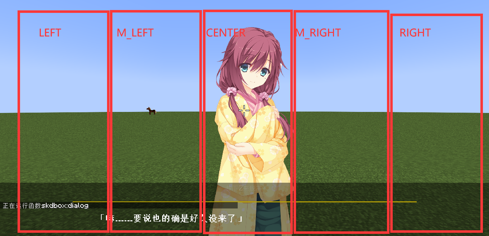

<div id="2.3.2"></div>

Regarding the parameter **color**, it is used to make the color tone of the vertical painting more suitable for the environment, as shown in the figure
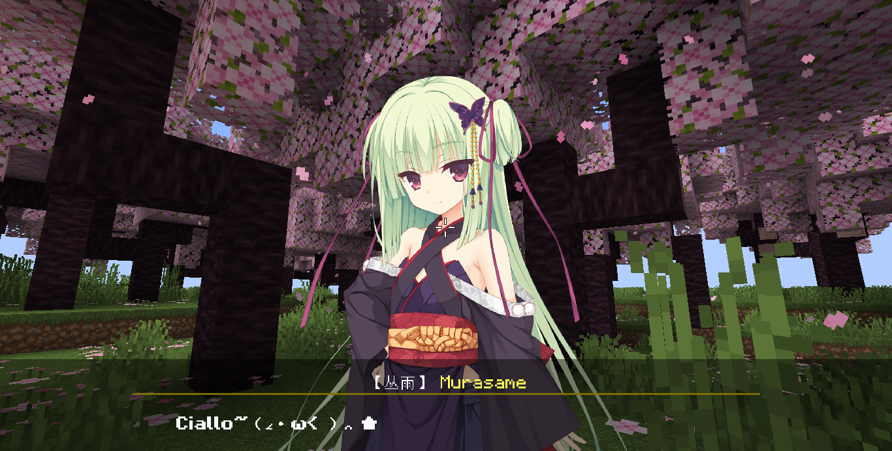
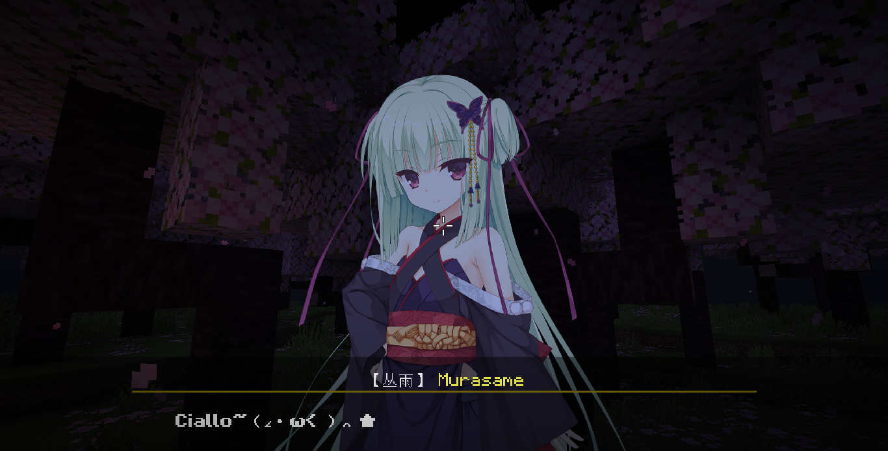

<div id="2.4"></div>

### process control event

#### Termination event

<div class="nbttree">

<node type="compound" name="(event root tag)" />
- <node type="string" name="type: stop" />This item indicates that the event is a termination event

</div>

As the name suggests, the termination event can cause the event list to end early

```json
{
    "main":[
        {"type":"text","character":"NULL","text":"这是一句话"},
        {"type":"stop"},
        {"type":"text","character":"roka","text":"事件列表提前终止了，这句话将不会显示"}
    ]
}
```


#### jump event

<div class="nbttree">

<node type="compound" name="(event root tag)" />
- <node type="string" name="type: jump" />This item indicates that the event is a jump event
- <node type="string" name="jump" />Jump to, sub-event list ID

</div>

```json
{
    "main":[
        {"type":"text","character":"NULL","text":"这是一句话"},
        {"type":"jump","jump":"jmp01"}
    ],
    "jmp01":[
        {"type":"text","character":"roka","text":"使用jump事件可以跳转到这里"}
    ]
}
```


#### Check conditions

Check a condition. If the condition passes, jump to the specified sub-event list. If the condition does not pass, continue executing the current sub-event list.

Use **`@a[tag=skdbox.s]`** to refer to player

<div class="nbttree">

<node type="compound" name="(event root tag)" />
- <node type="string" name="type: check_condition" />This item indicates that the event is a check condition event
- <node type="string" name="condition" />A conditional subcommand of execute command
- <node type="string" name="jump" />Jump to, sub-event list ID

</div>

#### check score

Check the score. If the score is within the specified interval, jump to the specified sub-event list. If the score is not within any specified interval, continue to execute the current sub-event list.

Use **@a[tag=skdbox.s]** to refer to player

<div class="nbttree">

<node type="compound" name="(event root tag)" />
- <node type="string" name="type: check_score" />This item indicates that the event is a check score event
- <node type="string" name="scoreboard" />Scoreboard name
- <node type="string" name="object" />Score holder
- <node type="homolist" name="score" />Check item list
  - <node type="compound" name="(list element)" :colon="false" />
    - <node type="homolist" name="interval" />Interval, two values ​​corresponding to the left endpoint and right endpoint values
    - <node type="string" name="jump" />Jump to, sub-event list ID

</div>

#### Execute command

Execute a command. The default executor of the command is Marker. Use **@a[tag=skdbox.s]** to refer to the current player.

<div class="nbttree">

<node type="compound" name="(event root tag)" />
- <node type="string" name="type: cmd" />This item indicates that the event is an execution command event
- <node type="string" name="cmd" />The command to be executed

</div>

#### option event

<div class="nbttree">

<node type="compound" name="(event root tag)" />
- <node type="string" name="type: option" />This item indicates that the event is an option event
- <node type="homolist" name="cmd" />Option list
  - <node type="compound" name="(list element)" :colon="false" />
    - <node type="string" name="text" />Text on this option
    - <node type="string" name="jump" />Jump to, sub-event list ID

</div>

Options are one of the essential elements of Galgame. Different options often determine different plot directions.

The player presses **W** (forward key) and **S** (backward key) to switch options, and press **spacebar** to confirm the option.

There is no limit to the number of options, but if many options are displayed at the same time, the options will overlap. In this case, the option spacing needs to be adjusted. For details, see **[Global Settings Options](#4.3)**

Of course, regarding options, there are naturally various underworld scenes.

~~It turns out to be two Japanese sentences full of childishness. Those who didn’t know it thought they were choosing between inside and outside~~

Let's look at an example below. When playing Ciallo, the player can choose to play it again or end it.

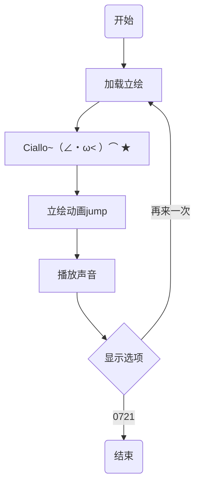


```json
{
    "main":[
        {"type":"tachie_load","character":"yoshino","tachie":"ciallo"},
        {"type":"jump","jump":"1"}
    ],
    "1":[
        {"type":"text","text":"Ciallo~（∠・ω< ）⌒ ★","character":"yoshino"},
        {"type":"tachie_animation","character":"yoshino","animation":"jump"},
        {"type":"sound","sound":"skdbox.demo2.ciallo"},
        {"type":"option","option":[
          {"text":"再来一次！","jump":"1"},
          {"text":"0721","jump":"2"}
        ]}
    ],
    "2":[
        {"type":"stop"}
    ]
}

```


<span style="font-size: 2rem">Ciallo~（∠・ω&lt; ）⌒ ★</span>

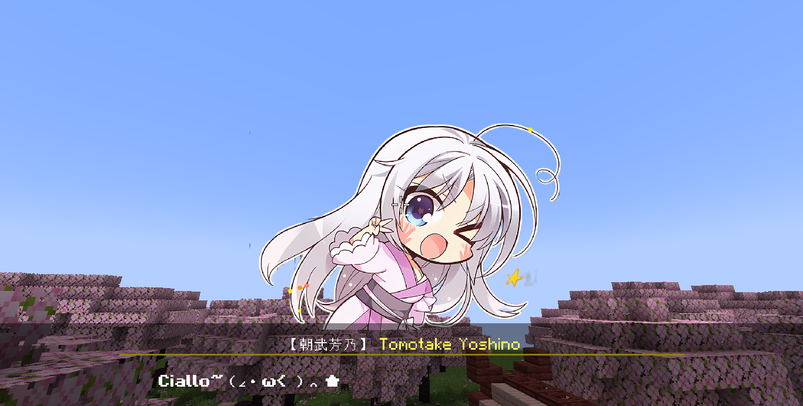
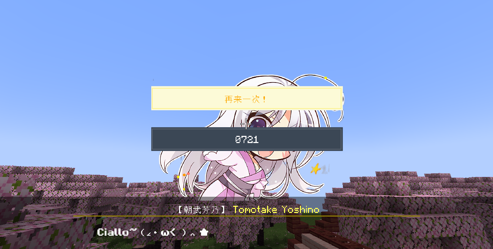

<div id="2.5"></div>

### sound event

#### play sound

Play a sound to the current player

<div class="nbttree">

<node type="compound" name="(event root tag)" />
- <node type="string" name="type: sound" />This item indicates that the event is a playback sound event
- <node type="string" name="sound" />The sound to be played

</div>

#### Voice events

If you want to add voice to every sentence, it is very troublesome to use the play sound event. In this case, you need to use the voice event.

You only need to use a voice event once to automatically play the corresponding voice for each conversation.

<div class="nbttree">

<node type="compound" name="(event root tag)" />
- <node type="string" name="type: voice" />This item indicates that the event is a voice event
- <node type="string" name="path" />Sound file path prefix
- <node type="int" name="index" />Index value, enter -1 to stop voice playback
- <node type="homolist" name="skip" />Indicates which characters do not need to play voices. This item defaults to [NULL]

</div>

Let’s look at an example:

```json
{
    "main":[
        {"type":"voice","path":"minecraft:skdbox.demo1.","index":1},
        {"type":"text","character":"roka","text":"「这就直接去志那都庄了？」"},
        {"type":"text","character":"NULL","text":"「是这个打算」"},
        {"type":"text","character":"roka","text":"「那我也一起走比较好吧，因为好久不见，再聊会吧」"},
        {"type":"text","character":"NULL","text":"「我当然可以，不过芦花姐，时间不紧吗？」"},
        {"type":"text","character":"roka","text":"「没事没事，那走吧」"},
        {"type":"text","character":"roka","text":"「......总觉得阿将啊，从刚才开始就好像在盯着我？」"},
        {"type":"text","character":"roka","text":"「被这么盯着，姐姐可是要害羞了呢。怎么怎么？莫非是迷上我了？」"},
        {"type":"text","character":"roka","text":"「还是说，脸上粘了什么东西吗？」"}
    ],
}
```


Execute the above event list, the voice will be played in this order
It can be seen that the voice automatically skips the character named "NULL"

|Voice|Text|
|-|-|
|minecraft:skdbox.demo1.1|"Go directly to Shinado Village?"|
||"That's the plan"|
|minecraft:skdbox.demo1.2| "Then it would be better if I go together, because we haven't seen each other for a long time, let's chat again" |
||"Of course I can, but Sister Luhua, aren't you pressed for time?"|
|minecraft:skdbox.demo1.3|"It's okay, let's go"|
|minecraft:skdbox.demo1.4| "...I always feel like General, you are staring at me from just now?" |
|minecraft:skdbox.demo1.5| "My sister is getting shy after being stared at like this. What's going on? Could it be that she has a crush on me?" |
|minecraft:skdbox.demo1.6|"Or is there something stuck on your face?"|

<div id="3"></div>

## Ⅲ Add new content

<div id="3.1"></div>

### Define roles

Role information is defined in **function/cfg/character.mcfunction**, as shown in the figure

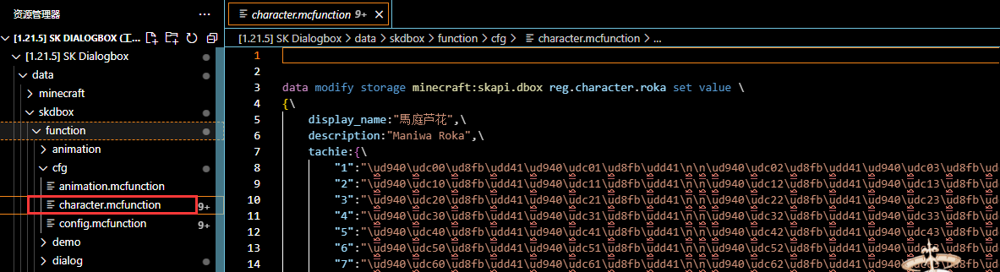

You will find that most of the files in this file are \uXXXX escape characters. I know you are in a hurry, but don’t worry. The use of these characters will be discussed in **[Import vertical painting](#3.2)**This section explains

#### Define roles

```mcfunction
data modify storage minecraft:skapi.dbox reg.character.<角色ID> set value <角色信息>
```


Parameter description

**&lt;Character ID&gt;** Role ID, this is unique

**&lt;Role information&gt;** A composite tag containing all the information of the role, the format is as follows

<div class="nbttree">

<node type="compound" name="(root tag)" />
- <node type="string" name="display_name" />The name of the character will be displayed above the dialog
- <node type="string" name="description" />The description of the role will be displayed above the dialog.
- <node type="compound" name="tachie" />Stand-up drawing of the character
  - <node type="string" name="Vertical Drawing ID" />A vertical drawing string

</div>

Let’s look at an example: Define the role **Cong Yu**

```json
{
    display_name:"丛雨",
    description:"Murasame"
    tachie:{

    }
}
```


<div id="3.2"></div>

#### Import vertical painting

We have just defined the basic information of Cong Yu, and now we need to import the vertical painting.

First, we need to prepare some three-dimensional pictures with transparent backgrounds. Of course, these cannot be used directly. We need to further process them.

The specific processing method is

- Width is an integer multiple of 256 pixels
- Height is 2048 pixels

After adjusting the size, you need to select the entire image and fill it with a white color with an opacity of 1%, as shown in the picture. This can avoid empty pixels in the image, which will cause text misalignment. The game will discard fragments with a transparency less than 24 (transparency 0~255), so this layer of white will not be visible in the game.
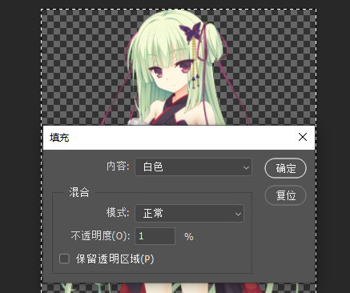

Place the processed vertical painting in the resource pack**assets/minecraft/textures/font/skdbox/murasame** path. Of course, **/skdbox/murasame** can be changed to the location you like. The file name is named with numbers, starting from 1, as shown in the figure.
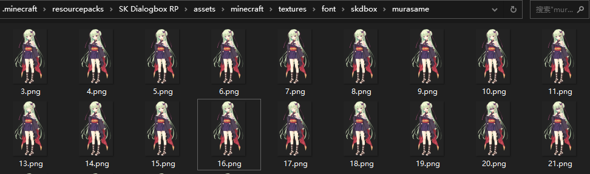

Open the **encode.py** program in the data pack folder. This program can assign a code point to each 256*256 area on the image.
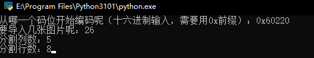

Then you need to fill in some information, just fill it in according to the actual situation.

- Fill in the starting code bit first with **0x60220**. What actually needs to be filled in here will be discussed below.
- The number of imported images is filled in according to the actual situation. A total of 26 vertical paintings need to be imported here.
- The size of the processed vertical image is 1280\*2048, which can be divided into 5\*8 areas of 256*256, so fill in 5 for the number of divided columns and 8 for the number of divided rows.

The program will generate an **output.txt** file. The content of this file is divided into three parts.
The first part is to declare the code bits corresponding to each 256*256 area on the image. These contents need to be added to resource pack**assets/font/default.json**. Just now we put the vertical painting into **assets/minecraft/textures/font/skdbox/murasame**, so here, we need to replace **font/skdbox/** in the file with **font/skdbox/murasame/**
This part of the content looks like this
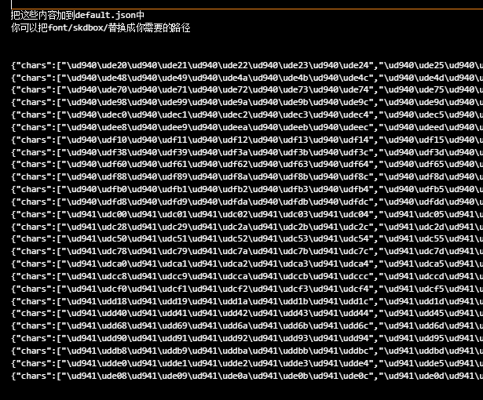

Then there is the second part. Each line represents a vertical painting. You can print these strings directly in the game to display the vertical painting.
This part of the content looks like this
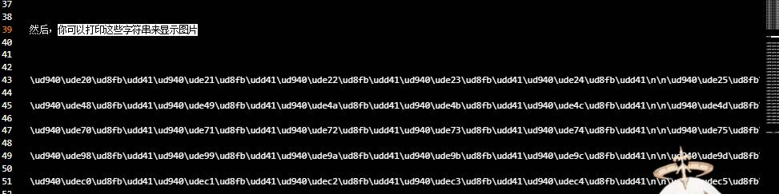

Now you just need to put these strings under the character's tachietag. The demonstration here only adds two lines. In fact, you should add the second part of the strings.
The vertical painting ID can be any string. The numbers used are demonstrated here.

```json
{
    display_name:"丛雨",
    description:"Murasame"
    tachie:{
      "1":"\ud940\ude20\ud8fb\udd41\ud940\ude21\ud8fb\udd41\ud940\ude22\ud8fb\udd41\ud940\ude23\ud8fb\udd41\ud940\ude24\ud8fb\udd41\n\n\ud940\ude25\ud8fb\udd41\ud940\ude26\ud8fb\udd41\ud940\ude27\ud8fb\udd41\ud940\ude28\ud8fb\udd41\ud940\ude29\ud8fb\udd41\n\n\ud940\ude2a\ud8fb\udd41\ud940\ude2b\ud8fb\udd41\ud940\ude2c\ud8fb\udd41\ud940\ude2d\ud8fb\udd41\ud940\ude2e\ud8fb\udd41\n\n\ud940\ude2f\ud8fb\udd41\ud940\ude30\ud8fb\udd41\ud940\ude31\ud8fb\udd41\ud940\ude32\ud8fb\udd41\ud940\ude33\ud8fb\udd41\n\n\ud940\ude34\ud8fb\udd41\ud940\ude35\ud8fb\udd41\ud940\ude36\ud8fb\udd41\ud940\ude37\ud8fb\udd41\ud940\ude38\ud8fb\udd41\n\n\ud940\ude39\ud8fb\udd41\ud940\ude3a\ud8fb\udd41\ud940\ude3b\ud8fb\udd41\ud940\ude3c\ud8fb\udd41\ud940\ude3d\ud8fb\udd41\n\n\ud940\ude3e\ud8fb\udd41\ud940\ude3f\ud8fb\udd41\ud940\ude40\ud8fb\udd41\ud940\ude41\ud8fb\udd41\ud940\ude42\ud8fb\udd41\n\n\ud940\ude43\ud8fb\udd41\ud940\ude44\ud8fb\udd41\ud940\ude45\ud8fb\udd41\ud940\ude46\ud8fb\udd41\ud940\ude47\ud8fb\udd41",
      "2":"\ud940\ude48\ud8fb\udd41\ud940\ude49\ud8fb\udd41\ud940\ude4a\ud8fb\udd41\ud940\ude4b\ud8fb\udd41\ud940\ude4c\ud8fb\udd41\n\n\ud940\ude4d\ud8fb\udd41\ud940\ude4e\ud8fb\udd41\ud940\ude4f\ud8fb\udd41\ud940\ude50\ud8fb\udd41\ud940\ude51\ud8fb\udd41\n\n\ud940\ude52\ud8fb\udd41\ud940\ude53\ud8fb\udd41\ud940\ude54\ud8fb\udd41\ud940\ude55\ud8fb\udd41\ud940\ude56\ud8fb\udd41\n\n\ud940\ude57\ud8fb\udd41\ud940\ude58\ud8fb\udd41\ud940\ude59\ud8fb\udd41\ud940\ude5a\ud8fb\udd41\ud940\ude5b\ud8fb\udd41\n\n\ud940\ude5c\ud8fb\udd41\ud940\ude5d\ud8fb\udd41\ud940\ude5e\ud8fb\udd41\ud940\ude5f\ud8fb\udd41\ud940\ude60\ud8fb\udd41\n\n\ud940\ude61\ud8fb\udd41\ud940\ude62\ud8fb\udd41\ud940\ude63\ud8fb\udd41\ud940\ude64\ud8fb\udd41\ud940\ude65\ud8fb\udd41\n\n\ud940\ude66\ud8fb\udd41\ud940\ude67\ud8fb\udd41\ud940\ude68\ud8fb\udd41\ud940\ude69\ud8fb\udd41\ud940\ude6a\ud8fb\udd41\n\n\ud940\ude6b\ud8fb\udd41\ud940\ude6c\ud8fb\udd41\ud940\ude6d\ud8fb\udd41\ud940\ude6e\ud8fb\udd41\ud940\ude6f\ud8fb\udd41",
    }
}
```


At this point, the role definition has been completed

The third part of **output.txt** has only one line, like this:

But what if I forget or have no idea where my last encoding ended?
It's very simple. As shown in the picture, find the last code in the file **assets/font/default.json**. You only need to add one to this code to use it as the starting code point for the next time.
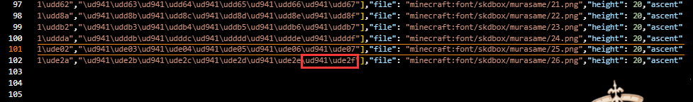
It is worth noting that default.json uses unicode surrogate pairs. Here we need to convert byte characters into wide characters. It doesn’t matter if you don’t understand. See the operation.
Let's say we want to convert this character

```text
\ud941\ude2f
```


[Click to open this website](https://www.toolhelper.cn/EncodeDecode/UnicodeChinese)
Decode it once as shown in the figure below, and then encode it again to get **6062f**. Add 1 to get **60630**. You can use **0x60630** as the starting code bit next time you encode.
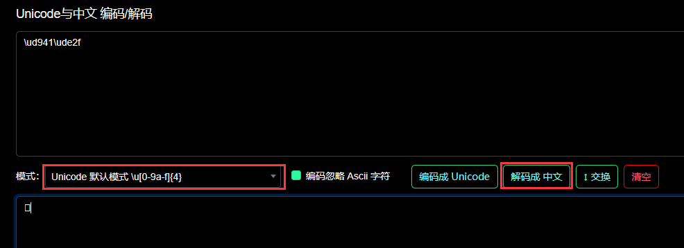
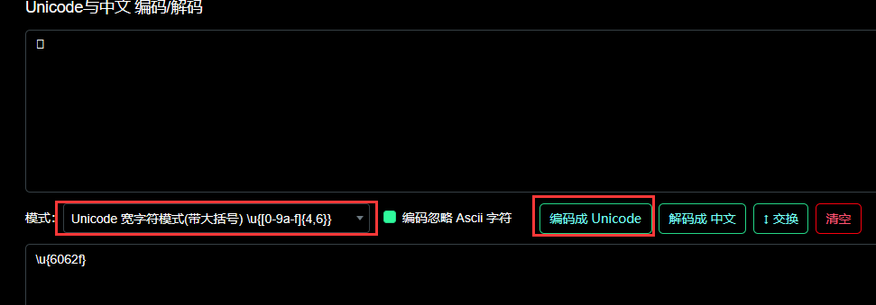

<div id="3.3"></div>

### Define animation

Animation information is defined in **function/cfg/animation.mcfunction**

#### Define animation

```mcfunction
data modify storage minecraft:skapi.dbox reg.animation.<动画ID> set value <动画信息>
```


Parameter description

**&lt;animation ID&gt;** Animation ID, this is unique

**&lt;Animation Information&gt;** A list containing all the information of the animation, in the following format

<div class="nbttree">

<node type="compound" name="(root tag)" />
- <node type="compound" name="First project" />
  - <node type="compound" name="merge" />To overwrite the data of the display entity
- <node type="compound" name="Second project" />
  - <node type="compound" name="merge" />To overwrite the data of the display entity
  - <node type="int" name="delay" />The time (tick) between this project and the previous project
- <node type="compound" name="..." />

</div>

It is worth noting that the coordinate in the **translation** list is relative to the current coordinate, not relative to the origin coordinate.

The following is the definition of animation "jump"

```json
[
    {
      merge:{
        transformation:{
          translation:[0f,0.0055f,0f]
        },
        interpolation_duration:5
      }
    },
    {
      delay:5,
      merge:{
        transformation:{
          translation:[0f,-0.0055f,0f]
        },
      interpolation_duration:5
    }
  }
]
```


<div id="4"></div>

## Ⅳ Global settings

Global settings are defined in **function/cfg/config.mcfunction**
If you need to make changes, please modify them directly in the file.
However, not all settings are recommended to be changed. Several commonly used settings will be discussed later.

<div class="nbttree">

<node type="compound" name="(configuration root tag)" />
- <node type="compound" name="text_box" />Text box related configuration
  - <node type="homolist" name="format" />The splicing format of text box text, mainly used to display character names and descriptions
  - <node type="string" name="bg" />Text box background, string type item model mapping string of acacia_chest_boat
  - <node type="int" name="line_width" />Line width
  - <node type="string" name="alignment" />Text alignment, optional values ​​are center, left, right
  - <node type="homolist" name="scale" />Scaling (not recommended to change)
  - <node type="homolist" name="translation" />Translation (not recommended to change)
- <node type="compound" name="text_display" />Text related configuration in the text box
  - <node type="string" name="prefix" />Text prefix
  - <node type="int" name="line_width" />Line width
  - <node type="homolist" name="scale" />Scaling (not recommended to change)
  - <node type="homolist" name="translation" />Translation (not recommended to change)
- <node type="compound" name="option" />Option related configuration
  - <node type="string" name="bg" />Background string
  - <node type="string" name="bg_selected" />Selected option background string
  - <node type="string" name="prefix" />Text prefix
  - <node type="string" name="prefix_selected" />The text prefix of the selected option
  - <node type="int" name="line_width" />Line width
  - <node type="homolist" name="scale" />Scaling (not recommended to change)
  - <node type="homolist" name="translation" />Translation (not recommended to change)
  - <node type="float" name="height" />Total line spacing
- <node type="compound" name="tachie" />Vertical painting related configurations
  - <node type="compound" name="position" />Position enumeration
    - <node type="double" name="(name)" />An xcoordinate offset
  - <node type="compound" name="color" />Overlay color
    - <node type="string" name="(name)" />A color, such as #FFFFFF
  - <node type="compound" name="default_animation" />Default animation
    - <node type="string" name="load" />Animation ID, automatically played when the vertical painting is loaded
    - <node type="string" name="remove" />Animation ID, automatically played when the vertical painting is removed
  - <node type="homolist" name="scale" />Scaling (not recommended to change)
  - <node type="homolist" name="translation" />Translation (not recommended to change)
- <node type="compound" name="sound" />Sound effect related configuration
  - <node type="string" name="option" />The sound effect played when selecting an option
  - <node type="string" name="text" />The sound effect played when pressing the space bar to display the next sentence of text

</div>

<div id="4.1"></div>

### dialog

The more useful thing is to modify the splicing format of the text.

<div class="nbttree">

<node type="compound" name="text_box" />
- <node type="homolist" name="format" />The splicing format of text box text, mainly used to display character names and descriptions

</div>

The default is like this, which means first display a "[", then put the character name, then display a "]", and finally change the text color to yellow to display the character description.

```json
format:[
  {text:"【"},
  {place:{type:"display_name"}},
  {text:"】 \u00A7e"},
  {place:{type:"description"}},
  {text:"\u00A7r\n"}
]
```


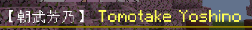

<div id="4.2"></div>

#### vertical painting

<div class="nbttree">

<node type="compound" name="tachie" />
- <node type="compound" name="position" />Position enumeration
  - <node type="double" name="(name)" />An xcoordinate offset
- <node type="compound" name="color" />Overlay color
  - <node type="string" name="(name)" />A color, such as "#FFFFFF"
- <node type="compound" name="default_animation" />Default animation
  - <node type="string" name="load" />Animation ID, automatically played when the vertical painting is loaded
  - <node type="string" name="remove" />Animation ID, automatically played when the vertical painting is removed

</div>

Modify or add position/color enumeration, or change the default animation, the following are the default settings

```json
tachie: {
  position: {
    "LEFT":0.01,
    "M_LEFT":0.005,
    "CENTER":0,
    "M_RIGHT":-0.005,
    "RIGHT":-0.01
  },
  color: {
    default:"#FFFFFF",
    midnight:"#8C9ACC",
    noon:"#F0DEAD"
  },
  default_animation: {
    load:"fade_in_left",
    remove:"fade_out_left"
  }
}
```


<div id="4.3"></div>

#### Options

If you need to display many options at once, please modify the total line spacing to avoid overlapping options.

<div class="nbttree">

<node type="compound" name="option" />
- <node type="float" name="height" />Total line spacing

</div>

<div id="4.4"></div>

#### sound

<div class="nbttree">

<node type="compound" name="sound" />
- <node type="string" name="option" />The sound effect played when selecting an option
- <node type="string" name="text" />The sound effect played when pressing the space bar to display the next sentence of text

</div>

You can change it to your favorite sound effects. The following are the default settings.

```json
sound: {
  option:"minecraft:ui.button.click",
  text:"minecraft:ui.button.click"
},
```

