<FeatureHead
    title = "minecraft instructions cooking guide: cold entityselector"
    authorName = "chuangxiaoye"
    resourceLink = 'https://www.bilibili.com/read/cv36591936'/>


::: tip
**Look at me first qwq**

Hello qwq, welcome to read Xiaoye's article. Recently, I was discussing the performance issues of the target selector with a group of friends. I read a little bit of the source code related to entity selection, and used this article to summarize the reading and processing process of entity selection in the minecraft command system, and how it affects subsequent selections.

Before writing this article, I didn’t pay much attention to the internal optimization of entity selection, because when I wrote code, I would focus more on my own logic and not worry too much about the design and optimization of the game code level. Since mojang is given, it is necessary to ensure the rationality of game code processing and optimization under the premise that developers provide normal selection logic. What I want to say here is that optimization is something that can be done as much as possible, rather than something that must be done to the end. How to optimize requires the accumulation of development experience. Optimizing the code should not affect development efficiency too much. Optimization can be achieved within the scope of one's ability.

Let's take a look at the game code that handles entity selection, summarize some rules, optimize the writing method of entity selection, and complain about mojang. The reason why it is called "entity selection" is because in addition to the target selector, when selecting an entity, you can also provide uuid and player name for direct selection. I refer to these collectively as "entity selection".

There are a lot of analysis processes in the middle. If you want to see the conclusion directly, please jump directly to the "**It's time to make it delicious**" [^1] chapter

There are many pictures and the fonts are sometimes small. You can directly click on the picture to enlarge it in the app. On the web side, you need to enlarge the web page. Try Ctrl+mouse wheel~

The source code version is JE 1.20.6, based on fabric yarn anti-obfuscation. It may be different from the official one, but it is enough to look at the simple source code~
:::

## Command reading and processing

data pack will be executed in the game`/reload`Read again. The data pack file provides the game with a bunch of strings. The game verifies whether the command represented by the string conforms to the format. If so, the corresponding command object will be created inside the game. The things that command can do are hard-coded, but they can be assembled and sorted to implement various logics and change the behavior in the game. This is the embodiment of the data-driven nature of the data pack. This step I call reading and processing.

The command we write will be read by the game first, and then it already exists in the memory, waiting for subsequent "use". The reason why I mention this is because when reading the source code involved in this article, it also involves the string processing logic when reading. I don't know how to express this better, but I will remind you later on which ones are "reading and processing" and which ones are "using".

## Prepare raw materials

Let’s read the source code in this chapter~

You need to find an entry point, such as execute as &lt;entity&gt;. Here is the logic of selecting entity. Come to`ExecuteCommand`Class:

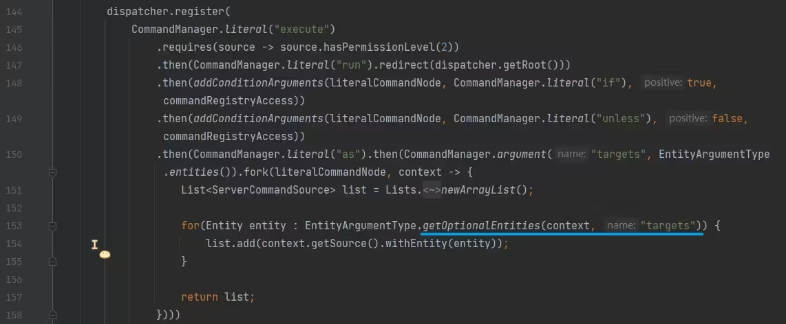

underlined in the figure`getOptionalEntities`The method is to select the entity method, keep clicking in, and come to`EntitySelector#getUnfilteredEntities`Method:

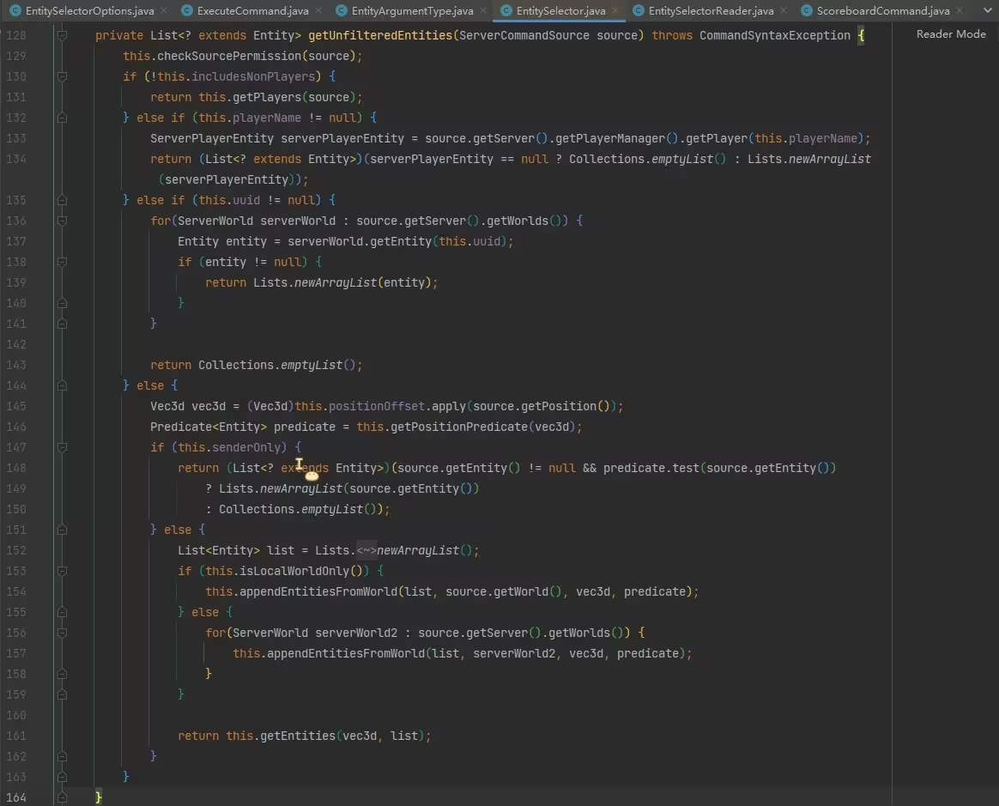

Saw some judgment in this method`includesNonPlayers`、`senderOnly`value and determines the logic of the branch. Obviously, this is the logic of "using" the target selector, that is, the command is already being executed. In order to understand the meaning of these values, we should go to the "Reading and Processing" section, by`includesNonPlayers` 、 `senderOnly`these`usages`easy to find`EntitySelectorReader`The class is the class that handles the reading and processing of the target selector. After observation, the`read`Method is the method that starts reading and processing:

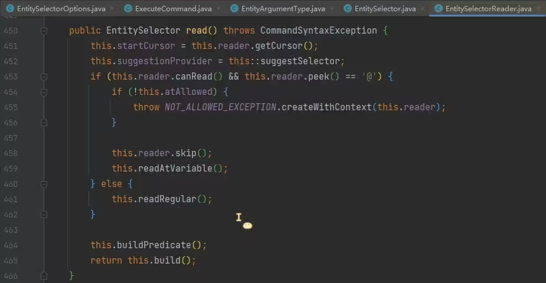

Line 453, determine whether the next character is`@`, if so, follow the reading and processing logic of the target selector, otherwise jump to line 461. In the logic of processing the target selector, line 454 determines`atAllowed`, obviously this variable indicates that the target selector should not be used here. After a little reading, it is related to permissions, we don’t care about it here; line 459, call`readAtVariable`Method to read and process the target selector;

Line 461, tune`readRegular`Method, this method is the processing logic of directly inputting the player name and uuid, because they are not the target selector;

Line 464, tune`buildPredicate`Method, this method constructs the entity rotation angle predicate and the player level predicate respectively, which is the emphasis;

Line 465, adjust the build method, which is based on the read`dx`、`dy`、`dz`and`x`、`y`、`z`The selectors are constructed separately`Box`and`Function&lt;Vec3d, Vec3d&gt;`Used for subsequent target selector to filter entities based on area and finally instantiated`EntitySelector`The object, target selector is read and processed.

Please note that this is the "reading and processing" stage. Without considering the function macro, the logic here will only be executed when the data pack is loaded, and does not involve runtime performance issues.

So according to the above analysis, line 459 calls`readAtVariable`The method is what we need to care about now. It reads and processes the target selector. Click to see:

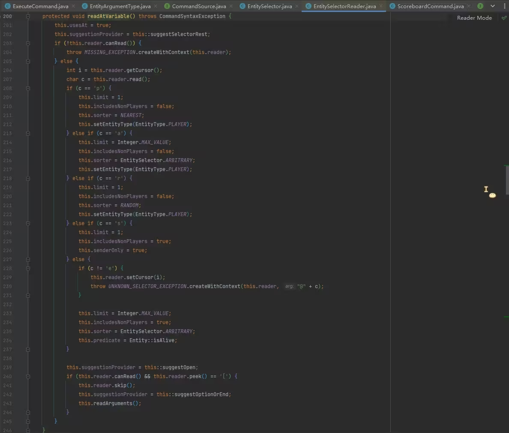

In this method, read`@`characters after, if`p`、`a`、`r`、`s`、``e`` Then assign values ​​to some members respectively. The meaning of these values ​​​​is already clear.

-`limit`The limited number of entities

-`includeNonPlayers`Whether to select non-playerentity

-`sorter`sort by

-`senderOnly`Whether it is @s selector

-`predicate`conditional chain

selector`@`The following characters will affect the values ​​assigned to members when constructing the target selector object here. For example`@p`The selector selects the nearest player. Looking at lines 209~212, you can see that it is passed to`limit`、`includeNonPlayers`It is implemented by waiting for member assignment, so, in fact,`@a[limit=1,sort=nearest]`and`@p`There is no difference. The difference between them is only the parsing cost when loading the data pack, but the selector object formed after parsing is the same, and there is no difference in their efficiency when the command is run.

We pay special attention to`predicate`, which is in`EntitySelectorReader`and`EntitySelector`Members that exist in , each condition of the target selector will be constructed as`predicate`, chain together, and finally test the entity, which helps subsequent reading and understanding of the processing order of each target selector parameter.

Line 236, due to`@e`selector`predicate`First adjust`Entity#isAlive`Check whether the entity is alive, presumably this is`@e[type=minecraft:player]`The reason why the player who did not click to revive on the death interface cannot be selected.

Here we only know the type of the target selector, and reading and parsing the parameters is on line 243`readArguments`Let’s take a look at the methods:

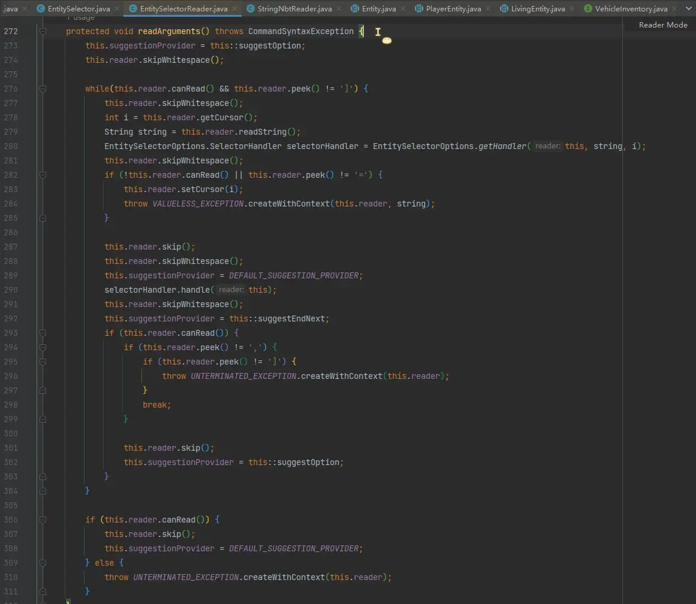

The main logic of this method is a large while loop on line 276 to read all parameters of the target selector. In the loop body, lines 279~280 read the name of the parameter, and then call`EntitySelectorOptions#getHandler`Get the handler, and then use this handler to process the following content on line 290. For example, the target selector exists`type=minecraft:sheep`parameter, it will read "type", then get the handler of the "type" parameter, and then use this handler to process "minecraft:sheep".

So as long as you find the handler of each parameter, you can know how the parameters are processed.`EntitySelectorOptions#getHandler`Method:

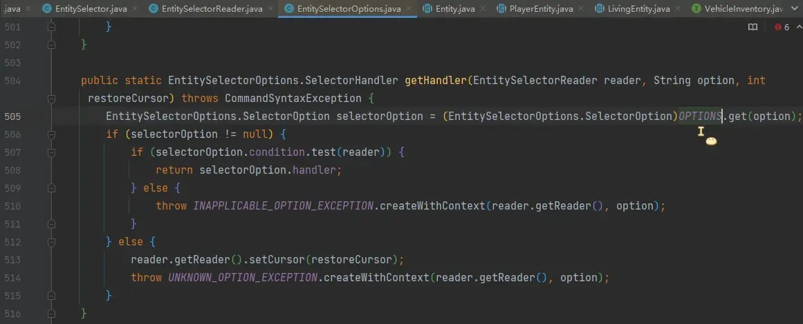

Line 505 has`OPTIONS`, the handler is taken out from here, so you need to see where it goes.`OPTIONS`Stuff it, check usages Skip to`putOption`Method:

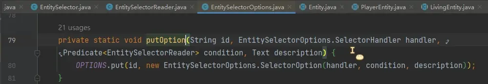

It has 21 usages, click on it to see:

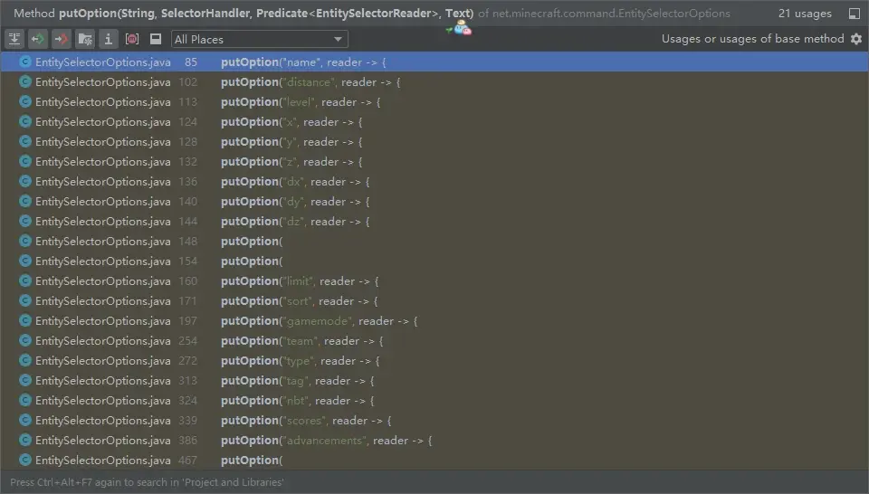

Found it, locate it:

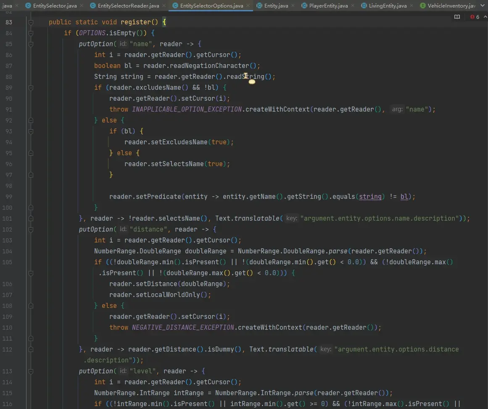

You can see the handler written during registration. Here is the reading and processing logic of all target selector parameters. Since the code has more than 400 lines, I read it completely and organized it into a table. See the next section.

## Processing raw materials★

In this section we will analyze the sequencing and optimization issues

### Parameters related to writing order


We mentioned in the previous section that when reading and processing each parameter of the target selector, all parameters of the target selector will be read in a loop and the corresponding handler will be found for processing. Observing the table, most of the parameters are directly constructed after parsing and then appended to the existing predicate. This means that the order of the predicate chain is related to the order of the parameters, such as`nbt`parameters and`scores`Parameters, since their processing logic directly constructs predicate and then splices them, so in the target selector, we put the parameters`nbt`written in`scores`Previously, when selecting the entity, we will first check`nbt`, then check`scores`, and if the parameters`nbt`written in`scores`Later, the order will be reversed, which leads to a method that can optimize the target selector: because when selecting an entity, all entities will be taken and tested with predicates in sequence. Each test will filter out entities that do not meet the requirements, and the filtered entities will no longer be tested with subsequent predicates. The remaining entities will be successfully selected, so whichever parameter can exclude more entities should be written in a higher position.

### Parameters independent of writing order

However, not all parameters will directly construct the predicate, and some parameters are only temporarily stored in`EntitySelectorReader`object, and then construct the predicate or perform other selection operations after reading, which means that these parameters are not affected by their order in the selector. These parameters are:

-`x`、`y`、`z`
- `dx`、`dy`、`dz`
- `distance`
- `x_rotation`、`y_rotation`
- `level`
- `limit`
- `sort`

`x_rotation`、`y_rotation`and`level`will be spelled after the predicate chain in turn. They are always tested at the back position, regardless of the writing position in the selector.

## Special parameters (involving optimization)`x`、`y`、`z`、`dx`、`dy`、`dz`and`distance`It will also affect the initial optimization:

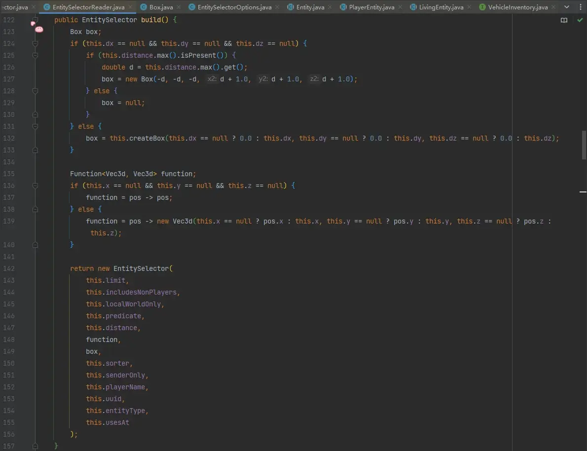

in construction`EntitySelector`when, will be passed in`Box`parameter, this parameter will be in`EntitySelector`When it is subsequently used to select entities, some possible entities are screened out based on the area. This step is the initial screening. Specifically, observing line 132, we can see that as long as`dx`、`dy`、`dz`part of it, then even if the missing part is not provided, it will be regarded as providing a value of 0.0, in which case`Box`by`dx`、`dy`、`dz`parameters shall prevail; if not provided`dx`、`dy`、`dz`any of the but provided`distance`,but`Box`by`distance.max`The coarse screen is based on the side length of` 2 * max + 1`of rectangular cube`Box`, this place is very interesting, imagine if`distance.max`Very big, so circled`Box`The more useless areas there are, in other words, the "coarser" this preliminary screening (coarse screening) is.

There is another question here,`distance`Parameters if only provided`min`without providing`max`, is there no such optimization, or even degradation? Because mojang likes to be in some`null`Stuff it somewhere`MAX`Go in, for example when the selector provides`distance=1..`, will mojang process it as`distance=1..Double::MAX`Well, this way we get a huge`Box`There is no point in doing a preliminary screening. But in parsing`DoubleRange`I didn't find any evidence support in the class, so it should be possible here`null`Yes, I don’t have this concern, but`distance`Parameters are only provided`min`without providing`max`There is indeed no optimization effect.`Function&lt;Vec3d, Vec3d&gt;`The parameters are`x`、`y`、`z`Where provided, only part of these three parameters can be provided. The missing parameters will inherit the command execution context.`pos`corresponding component.

Now there are still`sort`and`limit`There is no exploration, because they take effect during the selection process and when the final result is returned, but we have not looked at what was said at the beginning: if the player name or uuid is directly provided instead of the target selector, let’s take a look at the logic`EntitySelectorReader#readRegular`:

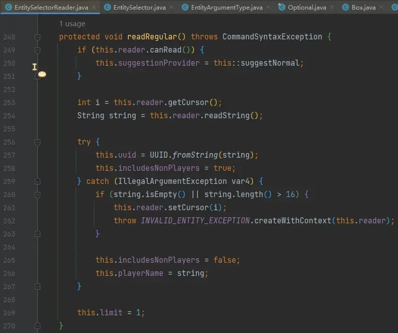

Line 257, attempts to convert to uuid. If it can be converted, because uuid can also be a non-playerentity uuid, so set`includesNonPlayers`for`true`;

If it cannot be converted, it is considered that the player name has been entered, up to 16 characters, and is set when it is legal.`includesNonPlayers`for`false`, and save the player name to`playerName`member.`playerName`Members can only be assigned here and used in selectors`name= parameter is used to construct the predicate that tests the entity name`, different from here.

### The "selection" process of selector

Above we have read the reading and processing logic of entityselector in detail, and now we can look at the selection process.

Back to the EntitySelector#getUnfilteredEntities method:

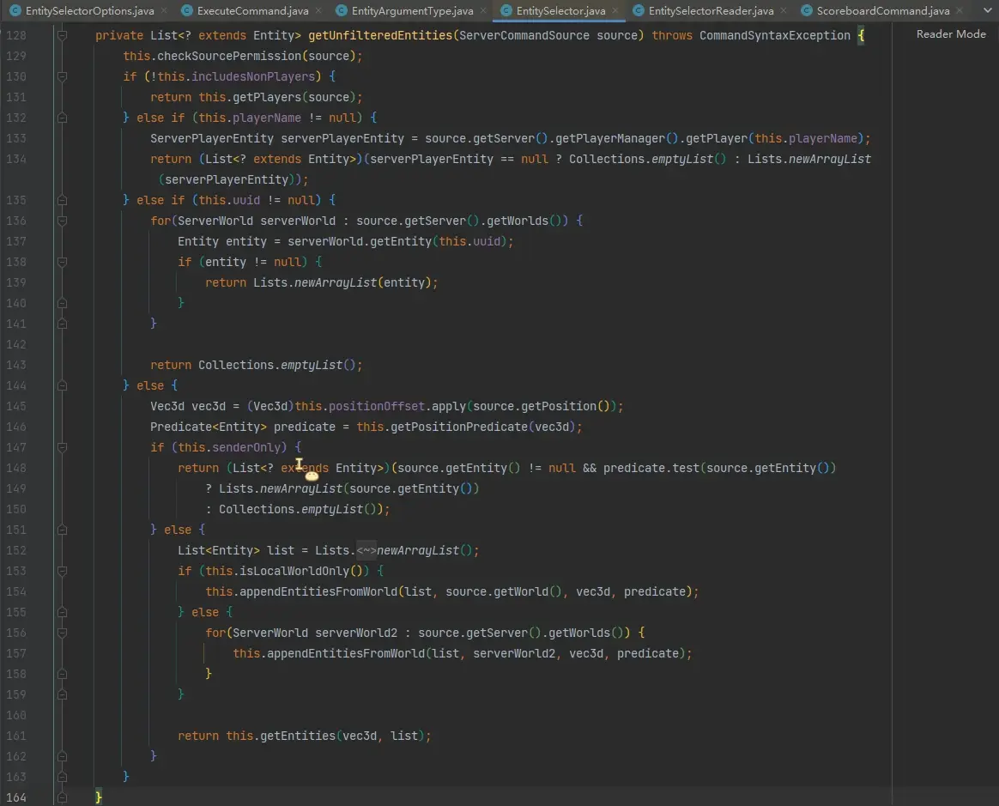

Line 130: If`includesNonPlayers`for`false`, which means that the selector only selects the player, adjust`getPlayers`method.`getPlayers`The subsequent logic of the method is basically the same as this method, and the differences will be pointed out later;

Line 132: If any`playerName`, indicating that the selector directly specifies the player name (for example`execute as Mini_Ye`), it does not have any conditions, it directly searches the player list to see if there is a player with the corresponding name, and then returns;

Line 135: If any`uuid`, indicating that the selector directly specifies uuid (for example`execute as 0-0-0-0-1`), it does not have any conditions, it directly searches the entity list to see if there is an entity corresponding to uuid, and then returns;

Line 146, based on the previously passed in`Box`and`x`、`y`、`z`constructed`Function`Construct predicate and splice it to the end. This step is`x`、`y`、`z`、`dx`、`dy`、`dz`and`distance`Accurate filtering of parameters:

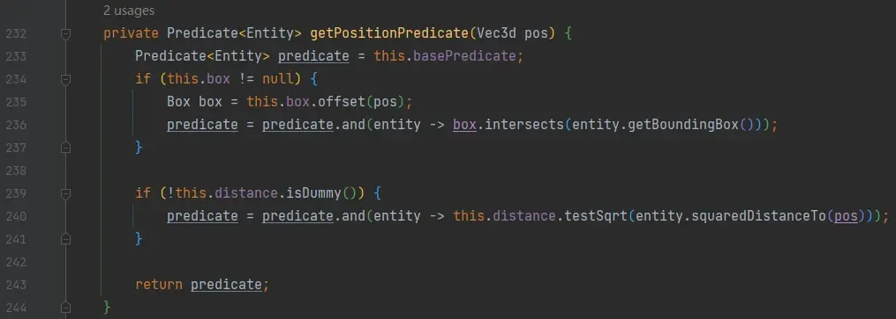

Line 147, determine whether the selector is`@s`, if so, test the entity with the predicate chain and return;

Line 153, tune`isLocalWorldOnly`judge`localWorldOnly`value, if`true`, then only select the entity in the dimension where this selector is located, otherwise select the entity in all dimensions. Influence`localWorldOnly`The parameters are`x`、`y`、`z`、`dx`、`dy`、`dz`and`distance`, as long as any of these parameters are specified, the selector will only select the entity in the dimension where it is located;

Regardless of line 154 or 157, call`appendEntitiesFromWorld`Method:

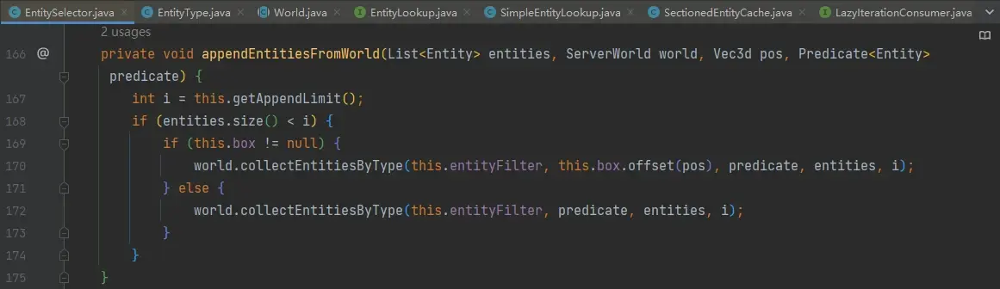

The parameter i here is`limit`, but it’s not necessarily what we set`limit`, which consists of line 167`getAppendLimit`The method is given, and its internal logical judgment`sorter`Is it`arbitrary`, if so, use the one we specified`limit`,otherwise`limit`for`Integer.MAX_VALUE`, that is, unlimited. Therefore, the target selector's`limit`Parameters are only in`sort`It has an optimization effect when it is the default, because there is no order requirement at this time, and the selection will stop as long as the number of entities is selected.

This still needs to be explained. Entities are stored in a certain data structure in the game memory, such as an entity list. The traversal of the list generally starts from the beginning, assuming that the target selector is not specified`sort`, then the selection order of the target selector is "arbitrary". Assume that the entity list is [A, B, C, D, E]. There are five entities in total. They all meet the requirements. When not specified`sort`and`limit=2`When , A and B are always selected, and the following three entities will not be selected. This is in line with the developer's requirements - "Just give me two entities that match. I don't care which two they are, even if you always give me A and B." However,`sort=random`When, it means that the developer requires the game to be "randomly selected", and all entities should have the same probability of being selected, even if`limit=2`, you cannot choose A and B here, because the three entities C, D, and E at the end of the list must also participate in this randomization. In the same way, there are`sort=nearest, limit=2`When selecting the two closest entities, what if entity E at the end of the list is the closest? You cannot select A and B without selecting the latter ones, which will lead to wrong results.

Therefore, in`EntitySelector#appendEntitiesFromWorld`In the method, pass it to`collectEntitiesByType`methodological`limit`Parameters are only in`sort`If not specified, it will be provided by the developer.`limit`,otherwise`limit`Always unlimited. In other words, only without specifying`sort`when, specify`limit` `can be optimized. In addition, collectEntitiesByType`The method will be based on the provided`Box`In the initial screening, the chunk and`Box`Disjoint entities will be excluded first, this is`x`、`y`、`z`、`dx`、`dy`、`dz`and`distance`basis for optimization. and`Box`and`distance`It will be accurately judged again at the end of the predicate chain.

Return to the picture above, line 161, call EntitySelector#getEntities:

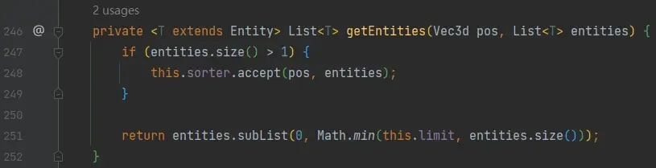

In the logic of this method, when there are multiple entities in the selected result, it will be based on`sorter`sort,`limit`The parameter constrains the number of returns at the end. When I saw the number of judgment results on line 247, my first reaction was why not write`entities.size() > this.limit`, after all, as long as the number of selected entities does not exceed`limit`, no matter what the sorting method is, it will not cause entities to be filtered again. After thinking about it carefully, it is because even if the number of results does not exceed`limit`, should also be used`sort`Sorting, which affects subsequent execution order. For example`execute as @e[sort=nearest] run xxx`Although there is no limit`limit`, but the developer hopes that all entities will be executed in sequence after being sorted by distance.`xxx`, so even if the number of results does not reach`limit`，`sorter`It also needs to be applied.

It’s time to make it delicious~

### selector selection flow chart

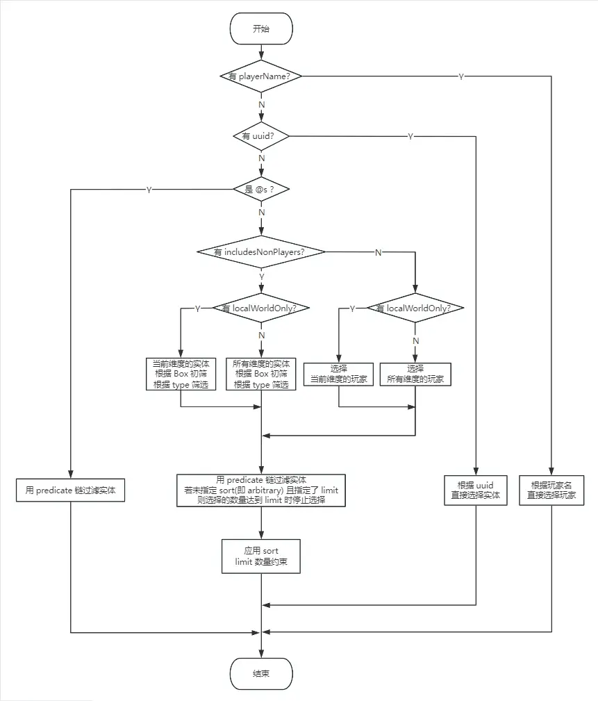

- Select directly using uuid or player name, which is the fastest;

- for`@e`、`@a`selector, if not specified`sort`(not specified is equivalent to`sort=arbitrary`),but`limit`There is optimization effect. For example, there are now 10,000 entities (9999 cows and 1 sheep). To select this sheep, consider using`@e[type=minecraft:sheep,limit=1]`, if this sheep is lucky enough to be ranked high in the entity list, it will be selected quickly, and then the selector will stop selecting;

- Right`@e`、`@a`、`@p`、`@r`selector specified`x`、`y`、`z`、`dx`、`dy`、`dz`and`distance`One of them will cause the selector to select entities only in the current dimension. When the chunk being loaded comes from multiple dimensions, if you can be sure that the entity to be selected is only in the current dimension, you can consider adding at least one of them;

- Right`@e`selector specified`dx`、`dy`、`dz`one of them, or specify`distance`And there is`distance.max`, which will make the selector have`Box`(even if not specified`x`、`y`、`z`, because they will be assigned the position of the selector's current record). The selector will perform a preliminary screening of chunks before testing all conditions, and`Box`Entities in chunks that have no intersection will be filtered out in this step. Note that only specifying`distance=min..`no time`Box`, without this optimization; note that only`@e`Selector has this optimization, for example`@a[distance=..11]`There is no such optimization;

- Right`@e`selector specified`type= parameter`, will be in the previous step`Box`Test immediately after initial screening`type`. Please note that`type=#&lt;type tag>`Invalid; please note that`@p`、`@a`、`@r`Selectors come with this optimization because their`entityType`Will be automatically assigned to player type`EntityType.PLAYER`;Please note that this only has optimization effect, the selector`type`Parameters will still be tested in the predicate chain;

- The last items of the selector are always tested in order:`x_rotation` -> `y_rotation` -> `level` -> `Box(x、y、z、dx、dy、dz)` -> `distance` -> `sort` -> `limit`, except for these parameters, the remaining parameters are tested in order according to the writing order in the selector. Therefore, parameters that can filter more entities should be considered in a higher position;

## It’s ready

Full of rewards~ Let’s see what a good selector looks like~

There are many chunks being loaded in the archived main world, hell, and end.

Among the three dimensions, each dimension has thousands of entities evenly distributed in different places.

There are also 1000 sheep evenly distributed among all loaded chunks in the main world. Among them, the temp scoreboard of 2 sheep is 88 points. It is known that these two sheep are located a few blocks near the main world birth point (0,0), and one of them has been sheared.

Use this entityselector in the data pack to select the shorn sheep and let her say QwQ:

```mcfunction
execute as @e[type=minecraft:sheep,distance=..10,scores={temp=88},nbt={Sheared:1b},limit=1] run say QwQ
```
This selector is delicious because:

used`distance=..10`Parameter, this is because it is known that the sheep to be selected is a few blocks near the main world birth point (0,0), here`distance`The maximum value of 10 is more reasonable and filters out a large number of sheep that are further away.

used`type`Parameters, entities that are not sheep will be filtered in this step

used`limit`Parameters, once the sheep to be selected is lucky enough to be at the top of the entity list in the main world, it will save a lot of subsequent choices.`scores`The parameters are located in`nbt`Before the parameters, it is a very good way to write, because`nbt`Parameter matching`nbt`The consumption is large, but only 2 sheep can pass`scores`inspection, greatly reducing subsequent testing`nbt`Parameter cost.

## It will be bad if you add too much seasoning.

The end of optimization is degradation

### Misunderstanding 1: Parameters that can filter more entities must be placed higher in the front

Generally speaking, parameters that can filter more entities are considered to be placed closer to the front, except for some parameters, such as`nbt={...}`Parameter, the consumption of this parameter is extremely huge, it will consume all the entities of the entity to be detected.`nbt`Make a copy, along with the rider list`Passengers`of`nbt`will also be copied recursively, so`nbt`Parameters are more considered at the back;

### Misunderstanding 2: The limit=xxx parameter must be good

for`@e`、`@a`selector, in`sort`When it is arbitrary (i.e. not specified)`sort`), you can use it if you know the number of entities or have requirements for the number of entities.`limit`Parameters are optimized, but due to the limited number of entities, it may not be easy to detect when the number of entities is large.

For example, when making a mini-game map, it is common to use`marker`Place the marked location on the map. if there is only one`marker`, can be used`limit=1`Optimized, but if you accidentally generate the same`marker`, the selector will always choose one of them, and developers may need to take time to notice this error.

### Misunderstanding 3: It must be good if you have Box

(To avoid viewers who are jumping to watch and don’t understand what it means:`Box`refers to the use`dx`、`dy`、`dz`and`distance=..max`When , the selector will first select an entity in a possible area (an optimization behavior)`distance=..10000000`It's not good, because this coordinate is too large. Normally, the loaded chunk will not be at such a far location (even if there is, if it is relatively small, it is not recommended to write it like this), so it can hardly exclude many entities, but it increases the cost of initial screening.

In addition, there are`Box`It increases the difficulty of reading the code to a certain extent. For example, even if I know that the entity to be selected is within the coordinate 500 range, but I write`distance=..500`It will make people confused, so please indicate it next to the command if necessary.`distance=..500`is to have`Box`.

## Repertoire: Tucao mojang

When reading this code, I found several very unpleasant places. See the table summarized above for details.

Some parameters will be verified to exist, and there cannot be duplicate parameters, for example:


cannot have more than one`name`It is normal because entity can only have one name, but`scores`That won’t work:


Okay...can't have more than one`scores`I admit it~ but`tag`Parameters say: "I can!"


Select the entity that "has at least one tag" and "cannot have any tag" at the same time. The contradiction arises qwq

And in`scores`Within the parameters, scoreboard can be repeated:

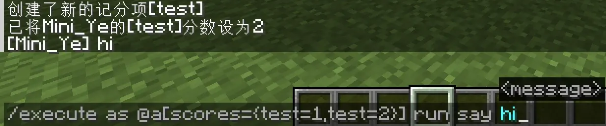

because`scores`The handler is used when processing`HashMap`Stores the parsing results and does not check for duplicates.`HashMap`exist`key`If they are the same, the new value will be overwritten with the old value, so`scores`When internal duplication occurs, only the later score range is valid, see the table summarized above for details.

Then`@p`selector can also cover`sort`and`limit`cause it to degenerate into`@a`, in short, there are many of these magical operations that mojang doesn’t want to guard against at all qwq:

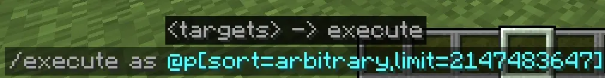

I don’t want to complain, I’ve been writing this article for a day, I’m so tired qwq

Thanks for reading~


[^1]: Original text