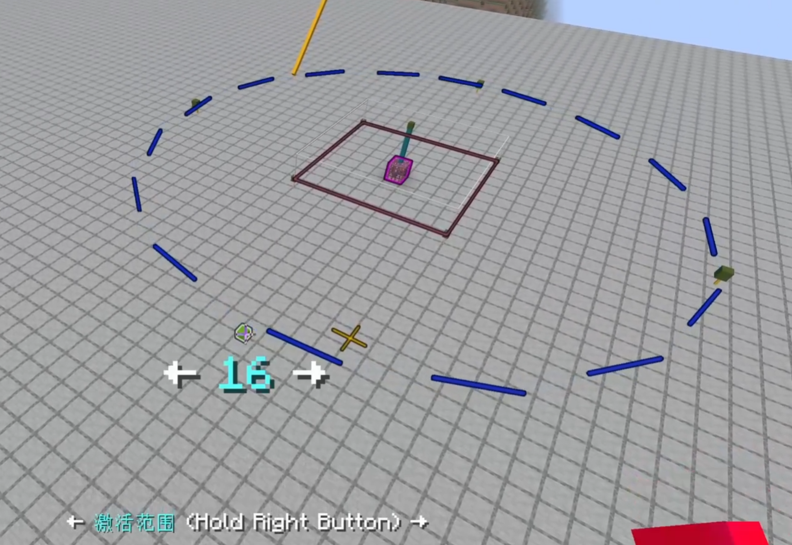

<FeatureHead
    title = "&quot;Big Villa&quot; and dialog chat"
    authorName = "Dahesor"
    resourceLink = 'https://www.bilibili.com/video/BV1aT7czEEuf'/>


## Summary

This article records and discusses the difficulties, interesting stories, and their final solutions that several authors encountered when researching the new versiondialog and making the "Big Villa" data pack.

## Content

1. Send information to distant entities
2. Deal with the problem of forced loading
3. We need self-destructive markers
4. Read the SNBT input by the player
5. Handle multi-line text input from users

## What is dialog and what is "Big Villa"

**dialog is a new data pack component of **Java 1.21.6, which can present a simple dialog window to the user to display notifications or receive user input. \
See Wiki for details: [dialog](https://zh.minecraft.wiki/w/?curid=151497)

**"Big Villa"** (**DaBsu**, **D**i**a**log **B**atch **S**pawner **U**tils) was produced by me last month. It is a data pack that allows map authors to easily and visually edit and manage a large number of monster spawners, using a large number of dialogs. \
This article is not entirely about dialog, but also includes discussions on some other issues. \
To learn about "The Big Villa" or use it, please watch the demonstration video:[The Big Villa](https://www.bilibili.com/video/BV1aT7czEEuf)

## Send information to remote entities

In the large villa, users can select any number of monster spawners to edit together, including unloaded chunks or monster spawners in other dimensions. \
Each registered monster spawner will store its own information—such as location, type, dimension, etc.—in storage.`Dimension`Down. When a monster spawner is selected, this information will be copied to`Selected`middle. In other words, the selection of a monster spawner is completely recorded by storage, so how do we notify the marked entity in the unloaded chunk that it has been selected?

You may find that we don't need to notify them that they are selected at all. However, "Grand Villa" will make the selected monster spawner flash - that is, generate a glowing display entity that lasts for one second every two seconds - so each monster spawner's marker entity must know whether it is selected.

Obviously, it is impossible for us to`forceload`All monster spawners and modify their data. Then we more or less have only two options:

First, we can use storage. Each marked entity in the loading chunk can find out whether it exists in`Selected`In the multi-level list, if it is, it proves that you have been selected. This eliminates the need to do extra work when selecting - after all, only monster spawners in loaded chunks may be highlighted. \
However, it is obviously unwise to waste this energy and computing power on the function of flashing the selected monster spawner - we need to make a judgment at least every two seconds, and a larger CTM map has at least thousands of monster spawners, and there may be hundreds of monster spawners loaded at the same time. It is somewhat inelegant to determine whether you exist in a multi-layered list that may contain thousands of items.

In this case, there is only the second method, which is to modify the score of the marked entity on the scoreboard. In this way, the entity only needs to do one`if score @s selected matches ...`You can check to see if you are selected. \
Some people may be confused, since entities are in unloaded chunks, how do we modify their scores? \
In fact, the scoreboard and entity are not bound at all. we often mention`fake player`, that is, there is no scoring target corresponding to an entity on the scoreboard. However, this is somewhat inaccurate, because in fact all scoring goals on the scoreboard are`fake player`.

When we use the target selector in the scoreboard command, if the target is a player, the playerID will be used as the name of the scoring target, and if the target is other entities, their UUID will be used. As long as you know the playerID or entity's hexadecimal hyphenated UUID, you can update their scores even if the entity cannot be found (offline, or not loaded). Therefore, it is only necessary to record and calculate the hyphenated UUIDs of entities when they are created, and then even if they are unloaded, their scores can be updated directly using the UUID + macro.

*The current stable way to obtain the hexadecimal UUID string of any entity is to take the array UUID and then calculate the hexadecimal format. There are ready-made libraries, such as [gu](https://github.com/gibbsly/gu) to help you do this. *

## Deal with forced loading issues

After forgetting which version,`/forceload`The command can no longer be completed within the context. This means that operations on that chunk immediately after /forceload will almost never succeed. \
In fact, now version`/forceload`The time required for complete completion is uncertain. even in`forceload`After a delay of 3 ticks, there is a high probability that the chunk is not fully loaded and the entity cannot be selected.

So how to stably edit blocks and entities in unloaded chunks? Fortunately,`execute if loaded`Command can determine whether the chunk to which any coordinate belongs is fully loaded. So in the current version, what you need to do is execute`/forceload`Judge once every moment`execute if loaded`until passed.

## We need self-destructing markers

One of the features of "Big Villa" is visual quick editing in the world. After selecting a monster spawner, the user can see various data drawn using the display entity, such as the generation range. \
Users can choose to drag the display entity directly to modify its corresponding data.

When modifying the generation range, the user can change this value to a large value, such as 96. This means that the far end of the display entity is 96 blocks away from the monster spawner, and almost 200 blocks away from the other end - which is entirely possible beyond the loading distance of the game. \
Therefore, if the user swipes and drags the range to 96, and the simulation distance is very small, it is all over, and the entity is lost. \
In the future, the player may see the display entity suspended in the air.

Take a closer look at what we need to implement:



Display entities are divided into two categories. One type is blue, a dotted line used to show the range. These entities do not actually need to change position when the scope changes, they just need to be adjusted`translation`That’s it. Therefore, they are actually always located in the monster spawner, so they are not afraid of being lost.

What I am really afraid of losing is the second category, which is the four small green cubes in the picture. The user can drag them to change the size of the entire range. They must be selected where they are displayed because the player's line of sight needs to be detected. Once the range is too large they may be dropped.

Of course, we can also use these small green cubes`translation`Adjust the position, and then use marker entities to detect player sight instead of where they appear visually...but these marker entities may still be lost.

So is there any entity that is not afraid of losing? Is there anything that will self-destruct if there is no data pack update? Yes, please **Regional Effect Cloud**.

There are regional effects`Duration`and`Age`tag controls its survival time. So we only need to use the area effect cloud for line of sight detection. \
All normally loaded regional effect clouds will be updated by the data pack at all times.`Age`The tag ensures that it does not expire, and the timestamp is always updated to prove that it has been loaded. However, once it is in an unloaded area, its timestamp will no longer be equal to the current one when it is loaded again.`gametime`, data pack can determine and delete it. If the data pack is unloaded before it is loaded again, it will expire within a few seconds and disappear naturally.

## Read the SNBT input by the player

[1.21.6-pre2](https://zh.minecraft.wiki/w/?curid=152627), all string inputs to the dialog will be escaped for special characters. This means we can no longer directly use`dynamic/run_command`Compound tags are accepted directly. for example:

```mcfunction
#dynamic/run_command
data merge storage foo:bar $(input)
```
Before pre-2, as long as the user entered a legal compound tag in the text box, no matter what it was,`data`The commands can be assembled and run correctly. \
However, after this, all single and double quotes and backslashes will be escaped with a backslash (`'` `"` `\` → `\'` `\"` `\\`), and newlines will be converted to`\n`. \
This prevents us from directly accepting compound tags, because it is assumed that the user input is`{string:"yes"}`, then the command will become:

```mcfunction
data merge storage foo:bar {string:\"yes\"}
```
And this is illegal.

We can only store the entire compound tag into a string first:

```mcfunction
#dynamic/run_command
data modify storage foo:bar input set value {input:"$(input)"}
```
This will become:

```mcfunction
data modify storage foo:bar input set value {input:"{string:\"yes\"}"}

```
Then run the macro again:

```mcfunction
function string_to_object with storage foo:bar input

#> function string_to_object
$data modify storage foo:bar input set value $(input)
```
In order to convert the input into a composite tag.

At this time you may have questions, what if the player enters single and double quotation marks at the same time? For example, the input is`{string:"haha'hehehe"}`At this time, the combined command will become:

```mcfunction
data modify storage foo:bar input set value {input:"{string:\"haha\'hehehe\"}"}
```
What to do? There are no single quotes outside but the single quotes inside are escaped. \
——Nothing to do. This is legal in Minecraft. As long as there are quotation marks on the outside, the internal quotation marks can be escaped regardless of whether they are single or double. It's just that the same one must be escaped, and the different one is free. \
The following four commands are equivalent:

```mcfunction
data merge storage foo:bar {string:"单' \"双"}
data merge storage foo:bar {string:"单\' \"双"}
data merge storage foo:bar {string:'单\' "双'}
data merge storage foo:bar {string:'单\' \"双'}
```
## Handle user's multi-line text input

Pre-2 caused more trouble than the above at the same time. A bug has appeared since this version, [MC-298893](https://bugs.mojang.com/browse/MC/issues/MC-298893). Simply put, the text input of dialog allows multiple lines, and`max_lines`This parameter specifies the maximum number of lines.

Theoretically, it stipulates how many line breaks the user can enter, that is, how many times they can press Enter - this was indeed the case before pre-2 - but after this version, it suddenly changed to limit the number of lines visually. \
That is, if we stipulate`max_lines`If it is 1, then the user can no longer enter any string that cannot fit in the width of the text box. If there was no such vulnerability, the text should automatically move to the next line on the display.

What does this mean? "Big Villa" allows users to edit the NBT data of the monster spawner directly in the dialog. If there is this BUG, ​​then either we want to accept SNBTtag input of any length, we must`max_lines`The adjustment is very large, which means that the string entered by the user may be filled in randomly.`\n`, and this is disastrous.

So can Mojang fix this vulnerability? Of course not. The vulnerability I reported successfully won't be fixed (acknowledged that it exists but will not be fixed.)


So I have to find a way myself. We need to put all the characters in the string entered by the user`\n`Remove. This requires us to split the string into characters one by one, judge it again and then put it back together. \
Splitting a string is very simple, there are`data string`, so how to combine strings?

Using macros to directly splice sounds very simple, and String Lib does it directly. However, we are dealing with an SNBT string. This means that there is a high probability that there will be various characters that need to be escaped, such as single and double quotes and backslashes. Using macros to splice directly in this way will almost certainly lead to errors.

After much deliberation, we can do this:

First, scan the string character by character from beginning to end, discarding all`\n`, and separate all characters that need to be escaped,`'`and`\`. Split the string into a list like this:

-`{st\nring:"yes'ha\nha''grat"}`
- [`"{string:"yes"`,`"'"`,`"haha"`,`"'"`,`""`,`"'"`,`"grat"}"`]

In this way, we can calculate how many macros each string needs to go through if we want to put such a list together several by one. We can also calculate how many backslashes need to be added before each character that needs to be escaped:

```mcfunction
#> function dnt:private/concat/get_slash/loop

$data modify storage dnt:ram concat.escape set value "$(escape)$(escape)$(escape)$(escape)\\"
scoreboard players remove $slash_count calc.dnt 1
execute if score $slash_count calc.dnt matches 1.. run function dnt:private/concat/get_slash/loop with storage dnt:ram concat
```
above`$slash_count`Represents the number of times that needs to be escaped.

In this way we can`$(escape)`is added before each character that needs to be escaped, and finally the input is obtained through macro splicing and all the characters are removed.`\n`version:

-`{string:"yes'haha''grat"}`The same system can also be used to concatenate arbitrary strings. I organized this system into the DNT (Dahesor NBT Transformer) library, which was separated from "Big Villa" for use by other people with similar needs:

- [Github](https://github.com/Dahesor/DNT-Dahesor-NBT-Transformer)
- [Redstone Relay](https://www.mczwlt.net/resource/ryzp7bof)
"Big Villa" also has a function that can convert the NBT configuration data of the trial monster spawner into an equivalent JSON structured string, which is also implemented by the DNT library.

## Summary

These are some of the most interesting problems I encountered while making The Great House. There may be other troubles, but they have been forgotten. Solving them is also really the most fun part of the production.