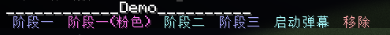
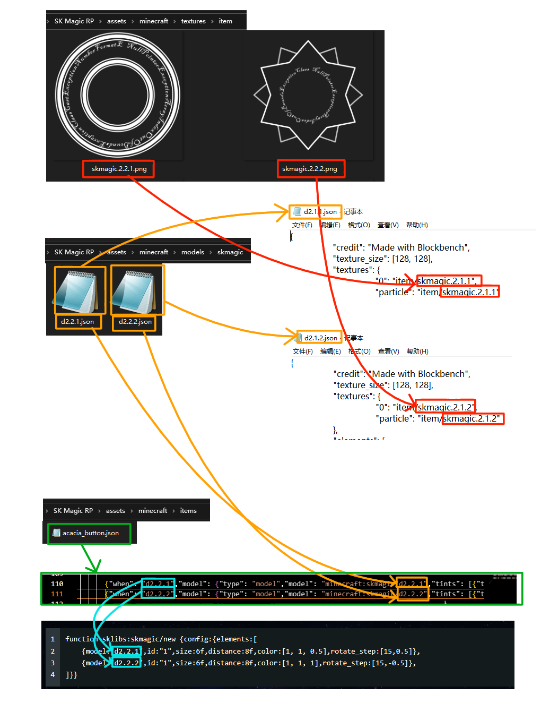
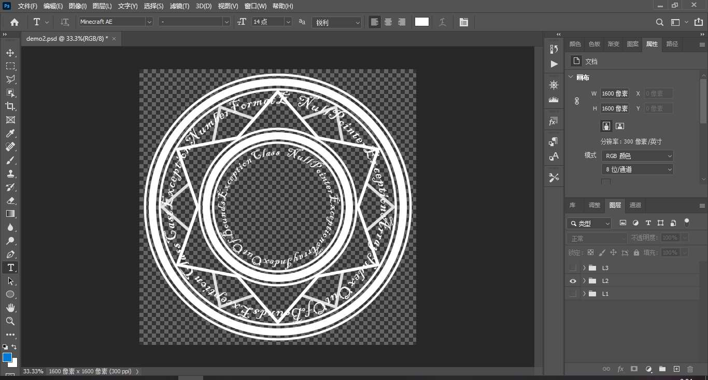
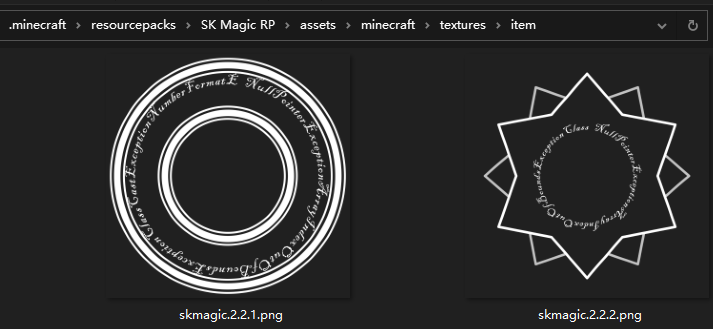
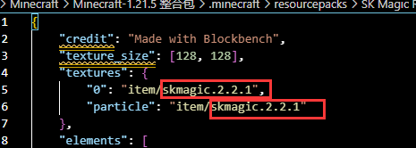
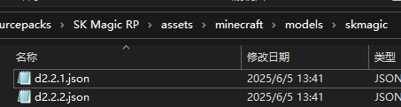
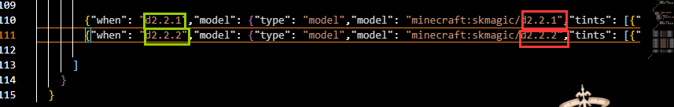
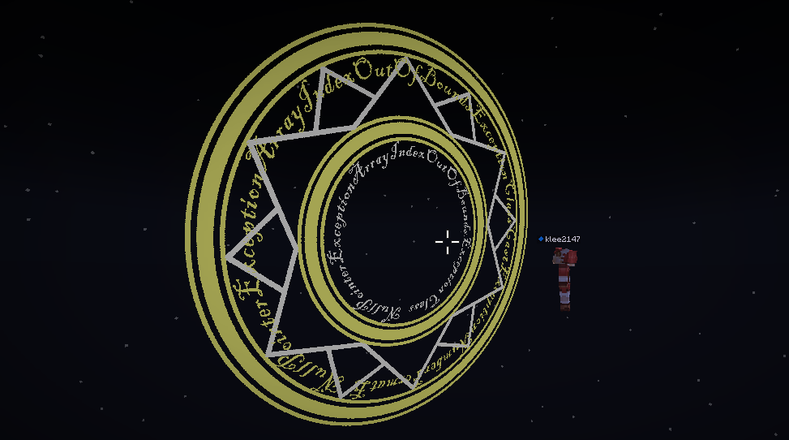

<FeatureHead
    title = "A magic circle based on displaying entities"
    authorName = "SKSAMA"
    resourceLink = 'https://ymqlgthbsakuradream.github.io/posts/minecraft/Archive.20250611/'
    cover='../../../../../feature/archive/202507/_assets/5.jpg'
/>

This project aims to create various array effects through simple function calls

## APIfunction

---

**sklibs:skmagic/new**

Create a magic circle\
The executor will be the holder of the new magic circle. If the executor already holds the magic circle, the new magic circle will replace the original magic circle\

<div class="nbttree">

<node type="compound" name="config" />root tag
- <node type="homolist" name="elements" />The layers contained in this array
  - <node type="compound" name="(list element)" :colon="false" />
    - <node type="string" name="id" />(optional, this item defaults to the value of model) layer ID
    - <node type="string" name="model" />The model of this layer
    - <node type="homolist" name="color" />The rendering color of the model. The three values ​​in the list represent the RGB channels respectively. Use the color converter to calculate the color.
    - <node type="float" name="distance" />The distance between this layer and the player's eyes
    - <node type="float" name="size" />The scaling factor of this layer
    - <node type="homolist" name="rotate_step" />(optional) Rotation step, for example [10,3.14] means rotation of 3.14 radians every 10 ticks. If this item is not specified, there will be no rotation.
    - <node type="float" name="rotate_phase" />(optional, default is 0) initial phase

</div>

**sklibs:skmagic/modify**

Modify the properties of the array\
The properties of the magic circle held by the executor will be modified. If the executor does not hold the magic circle, this function will not work\

<div class="nbttree">

<node type="compound" name="config" />root tag
- <node type="string" name="id" />Target layer ID, apply the following transformation to all layers with this ID
- <node type="float" name="size" />Scaling factor
- <node type="float" name="distance" />The distance from the player's eyes
- <node type="int" name="duration" />Interpolation time

</div>

**sklibs:skmagic/modify2**

Modify the properties of the array in batches\
The attributes of the magic circle held by the executor will be modified in batches. If the executor does not hold the magic circle, this function will not work\

<div class="nbttree">

<node type="compound" name="config" />root tag
- <node type="homolist" name="modify" />Modify list
  - <node type="compound" name="(list element)" :colon="false" />
    - <node type="string" name="id" />Target layer ID, apply the following transformation to all layers with this ID
    - <node type="float" name="size" />Scaling factor
    - <node type="float" name="distance" />The distance from the player's eyes
    - <node type="int" name="duration" />Interpolation time

</div>

**sklibs:skmagic/insert**

Add a new layer to the array\
Adds a new layer to the magic circle held by the executor. If the executor does not hold the magic circle, this function will not work\
The parameter format is the same as sklibs:skmagic/new\

<div class="nbttree">

<node type="compound" name="config" />root tag
- <node type="homolist" name="elements" />The layers contained in this array
  - <node type="compound" name="(list element)" :colon="false" />
    - <node type="string" name="id" />(optional, this item defaults to the value of model) layer ID
    - <node type="string" name="model" />The model of this layer
    - <node type="homolist" name="color" />The rendering color of the model. The three values ​​in the list represent the RGB channels respectively. Use [Color Converter](#color) calculate color
    - <node type="float" name="distance" />The distance between this layer and the player's eyes
    - <node type="float" name="size" />The scaling factor of this layer
    - <node type="homolist" name="rotate_step" />(optional) Rotation step, for example [10,3.14] means rotation of 3.14 radians every 10 ticks. If this item is not specified, there will be no rotation.
    - <node type="float" name="rotate_phase" />(optional, default is 0) initial phase

</div>

**sklibs:skmagic/remove**

Remove the magic circle held by the function executor\
no parameters

**sklibs:skmagic/danmaku**

Launch barrage\
Launch a specified number of barrages in the direction the executor is facing\

<div class="nbttree">

<node type="compound" name="config" />root tag
- <node type="int" name="n" />The number of barrages

</div>

::: details Color Converter
<div id="color"></div>
<iframe src="https://tools.minecraft.wiki/static/tools/decimalColor/" style="border: none; display: block; width: 100%; height: 355px; background-color: #f0f0f0;"></iframe>
:::

## Quick experience

Quick experience**[demo video](link-to-be-added-later)** the magic circle
Execute this function in the chat box to open the menu

```mcfunction
/function sklibs:skmagic/demo/menu
```




## Make your own magic circle

A picture to understand the entire process below



Download**[resource pack](#download)** and extract it to`.minecraft/resourcepacks`Under the folder, this resource pack stores some textures and models that have been made. Now we will make new textures and models based on it.

To draw textures, you can use PhotoShop to draw them. You need to pay attention to the following points:

- Image should be square
- The drawn pattern should be white, this is to facilitate subsequent coloring
- Keep areas other than the pattern transparent



Export the drawn texture in layers, because the array needs to be rotated, and we want each layer to have a different rotation speed. There is no limit to how many layers are needed. The demonstration here only shows two layers.

- Export images to`(resource pack)/assets/minecraft/textures/item`under folder
- Any file name



Then you need to make a model
come`(resource pack)/assets/minecraft/models/skmagic`folder, find`demo.json`Make a copy with any file name. Open the newly copied json file and fill in the file name of the texture file you just made. Note that the file name here does not have a .png suffix, as shown in the figure.



If your texture file is divided into many layers, each layer needs to create a separate model file. The texture just now has two layers, and you need two model files, as shown in the figure.



Next you need to add **[itemmodel mapping](https://zh.minecraft.wiki/w/%E7%89%A9%E5%93%81%E6%A8%A1%E5%9E%8B%E6%98%A0%E5%B0%84)**
Open`(resource pack)/assets/minecraft/items/acacia_button.json`Add the following content, as shown in the figure. The red box specifies the file name of the model file. No .json suffix is required. The green box is the "call name" of the model. You can call the corresponding model file through this name.



```json
        {"when": "d2.2.1","model": {"type": "model","model": "minecraft:skmagic/d2.2.1","tints": [{"type": "dye","default": [0,0,0]}]}},
        {"when": "d2.2.2","model": {"type": "model","model": "minecraft:skmagic/d2.2.2","tints": [{"type": "dye","default": [0,0,0]}]}}
```
Finally just call`sklibs:skmagic/new`function and you can see the effect

```mcfunction
function sklibs:skmagic/new {config:{elements:[
    {model:"d2.2.1",id:"1",size:6f,distance:8f,color:[1, 1, 0.5],rotate_step:[15,0.5]},
    {model:"d2.2.2",id:"1",size:6f,distance:8f,color:[1, 1, 1],rotate_step:[15,-0.5]},
]}}
```




## data pack download

[data pack 1.21.5_skmagic_1.0.7z](https://ymqlgthbsakuradream.github.io/posts/minecraft/Archive.20250611/1.21.5_skmagic_1.0.7z)

[resource pack SK Magic RP.7z](https://ymqlgthbsakuradream.github.io/posts/minecraft/Archive.20250611/SK%20Magic%20RP.7z)
