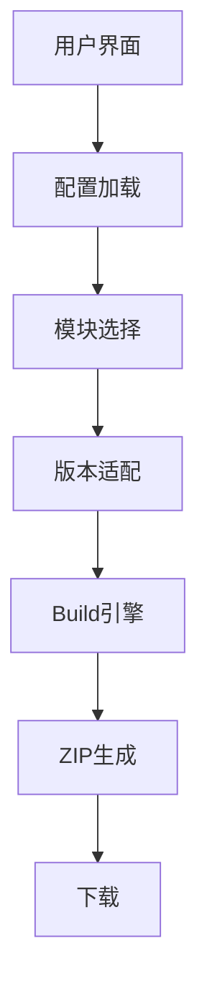

<FeatureHead
    title = "Minecraftresource pack/data pack build tool"
    authorName = "Gugle"
    resourceLink = 'https://build.xekr.dev/'/>


## 1. Introduction

As a popular sandbox game around the world, Minecraft's scalability has been greatly enhanced through resource pack (Resource Pack) and data pack (Data Pack). Resource pack is used to modify game resources such as textures, sounds, and models, while data pack is used to modify game logic, add advancement and recipes, etc. However, as the functions of resource packs and data packs become increasingly complex, their construction and management processes have become cumbersome. Especially when developers want to provide multiple optional modules for user customization, manually merging modules and ensuring compatibility becomes a challenge.

The Minecraft resource pack/data pack build tool is a web-based front-end application designed to solve the pain points of resource pack and data pack development and distribution in the Minecraft community. Traditional resource pack development faces the following challenges:

- Insufficient modularity: resource packs are usually distributed as a whole, and users cannot select functional modules as needed
- Version compatibility: Different Minecraft versions require different resource formats
- Low distribution efficiency: developers need to manually package resource packs with different configurations

Through innovative modular architecture and automated construction processes, this project has achieved:

- User-defined selection: allows users to freely combine the required modules
- Intelligent version adaptation: automatically convert resource formats to adapt to the target version
- Cloud construction system: One-click packaging and distribution based on GitHub API
- Open source collaboration model: standardized project structure promotes community contributions

## 2. Detailed interpretation

### 1. System architecture


### 2. Project structure

The project uses Vue.js as the front-end framework, and the main code is located in`src`directory. Core functionality consists of`src/scripts`Multiple modules in:

-`builder`: Responsible for building the ZIP file of resource pack/data pack, including obtaining warehouse content, processing path, merging modules and generating ZIP.
-`formatter`: Provides formatting functions for specific files (such as recipes and paths) to adapt to different Minecraft versions.
-`github`: Encapsulates interaction with GitHub API, used to obtain warehouse content. - Other auxiliary modules (`message`、`request`、`type`、`util`、`version`) provides support functions.
- Project configuration files include:
    -`config.json`: Define the basic information of resource pack/data pack, such as name, author, version, main module, version module, etc.
    -`module.config.json`: Define information for each module, such as module name, description, supported versions, weights, and conflicting modules.
    -`*.set.config.json`: Define a module collection, including a combination of multiple modules.

### 3. Core function implementation

#### (1) Configuration analysis

The tool first loads and parses the repository root directory`config.json`, obtain the basic configuration of resource pack/data pack, including main module path, version module mapping, etc.

#### (2) Module selection and weight sorting

The modules selected by the user (including directly selected modules and modules selected through collection) will be recorded, and each module has a weight value. When building, modules are sorted by weight from small to large to ensure that the content of high-weight modules is covered.
Low-weight modules (that is, high-weight modules have higher modification priority).

#### (3) Construction process

The build process consists of`Builder.build`Method implementation, the steps are as follows:

1. **Determine the target Minecraft version**: According to the version selected by the user, obtain the corresponding data pack format version and resource pack format version.
2. **Get main module content**: Read the main module (`config.json`specified in`main_module`) file tree.
3. **Add version module**: Find the corresponding version module (if any) according to the target version, and merge its content into the main module.
4. **Add icon**: If the icon is configured, add it as a resource pack`pack.png`.
5. **Merge user-selected modules**: Merge each selected module in order of weight. During the merge process, if the file paths are the same, the contents of the high-weight module will overwrite the contents of the low-weight module.
6. **Generate ZIP file**: Convert the merged file tree into a ZIP file. During the build process, filter files based on build type (resource pack, data pack, or all).
7. **Mod format supported**: If the build type is module (`mod=true`), an additional`fabric.mod.json`and`quilt.mod.json`and other module configuration files.

```typescript
class Builder {
    //File tree merge algorithm
    static mergeFileOrTree(file1: FileOrTree, file2: FileOrTree): FileOrTree {
        //Intelligently merge module content and handle conflicts
    }

    //Version adaptation processor
    static preprocessContent(content: string, path: string, version) {
        if (path.includes("recipe")) {
            return RecipeFormatter.format(content, version); //recipe format conversion
        }
        return PathFormatter.format(content, version); //Path format conversion
    }

    //ZIP packaging process
    static build(): Promise<Blob> {
        //1. Load the main module
        //2. Add version module
        //3. Merge user selection module
        //4. Generate ZIP file
    }
}
```
#### (4) version adaptation system

-`minecraft_version.json`:Storage resource format specifications for each version
- use`PathFormatter`Adjust the file path to suit the target Minecraft version.
- use`RecipeFormatter`Adjust the recipe file contents to suit the target Minecraft version.

#### (5) Depends on GitHub API

The tool obtains the contents of the repository through the GitHub API. Since unauthenticated users can only initiate 60 requests per hour, users need to provide a Personal Access Token to increase the request limit.

### 4. Key technical points

- **Modular design**: The resource pack/data pack is split into multiple modules, and each module can be developed and maintained independently.
- **version adaptation**: Through the version module and file formatter, ensure that the generated content is compatible with the Minecraft version selected by the user.
- **Conflict Resolution**: Definable in module configuration`breaks`Fields that declare incompatible modules that the tool checks for and avoids conflicts when the user selects them.
- **Weight Merger**: Control the coverage order of modules through weights to achieve flexible customization.

### 5. Workflow

1. Configuration loading: parse config.json in the warehouse
2. Module selection: The user selects the required module or preset collection
3. Version confirmation: select the target Minecraft version
4. Content acquisition: Obtain module content through GitHub API
5. Format conversion: adjust the resource format according to the target version
6. Merge and package: merge content according to module weight to generate ZIP
7. Download delivery: automatically trigger downloads

## 3. Use cases

### Use case 1: Create a resource pack named "BetterTools"

**Scenario**: A developer creates a resource pack and wants to replace the tool texture from a vanilla texture to a gold or diamond texture.

- Assume that developer "XeKr" creates a resource pack called "BetterTools" that contains the following modules:
    -`main`: Main module, containing basic textures.
    -`gold`: Replace tool texture with gold.
    -`diamond`: Replace tool texture with diamond texture.
- User wants to use both gold and diamond textures, but diamond modules should override gold modules (i.e. diamond tools take precedence). The developer configuration is as follows:

    1. **config.json**:

```json
       {
           "pack_name": "BetterTools",
           "author": "XeKr",
           "description":"Better tools texture",
           "version": "1.0.0",
           "base_path": "./src",
           "main_module": "main",
           "icon": "./icon.png"
       }
       ```
2. **module.config.json** (located in the gold module):

```json
       {
           "module_name": "gold",
           "support_version": "*",
           "weight": 0
       }
       ```
3. **module.config.json** (located in the diamond module):

```json
       {
           "module_name": "diamond",
           "support_version": "*",
           "weight": 1
       }
       ```
User operation steps:

1. Enter the warehouse address in the tool interface:`https://github.com/XeKr/BetterTools`2. After loading the configuration, select`gold`and`diamond`module (note: since the diamond module has a higher weight, it will override the texture of the gold module).
3. Select the target Minecraft version (such as 1.20.1).
4. Click the "Build" button and the tool will generate a resource packZIP file. In the generated file, the texture of the diamond tool will overwrite the texture of the gold tool, and the final effect will be a diamond tool.

### Use case 2: User-defined resource pack

**Scenario**: The player wants to create a game containing`high-resolution textures`and`dynamic lighting`but does not include`realistic physics`resource pack

1. Visit the builder page
2. Enter the resource pack warehouse URL
3. After loading the configuration, check`high-resolution textures`、`dynamic lighting`Module, unchecked`realistic physics`module
4. Select Minecraft`1.20.1`version
5. Click`Build`button
6. Get customized resource packZIP

### Use case 3: Developers maintain multi-version support

**Scenario**: Developers need to`1.19`and`1.20`Provide compatible resource packs

1. Create version_1.19 and version_1.20 modules
2. Configure version mapping in config.json

```json
   {
     "version_modules": {
       "1.19": {"module": "version_1.19", "strict": false},
       "1.20": {"module": "version_1.20", "strict": true}
     }
   }
   ```
3. Automatically load the corresponding module when the user selects version

### Use Case 4: Community Module Sharing`scenario`: Community developers contribute new model modules

1. Create the new_creatures directory in the warehouse
2. Add module.config.json:

```json
   {
     "module_name": "fantasy_creatures",
     "description": "添加奇幻模型",
     "support_version": "*",
     "weight": 5,
     "breaks": ["realistic_physics"]
   }
   ```
3. Users can see and select the module in the builder

## 4. Innovation points

1. Modular coverage system: resolve resource conflicts through weight mechanism
2. Dynamic format conversion: adapting to resource specifications of different Minecraft versions
3. Serverless architecture: complete front-end implementation to protect user PAT security
4. Standardized project structure: lowering the threshold for community contribution

## Conclusion

This project provides an efficient and flexible Minecraft resource pack/data pack building tool, which greatly simplifies the building process of multi-module resource pack/data pack through modular design and automated building process. Developers can
Focus on module development, and users can easily customize their own resource pack/data pack through the graphical interface. Solve key issues in the development of Minecraft resource pack through innovative technical solutions, providing solutions from development to distribution
All-in-one solution. Its modular architecture, smart version conversion, and GitHub integration make it an ideal tool for Minecraft community resource development. In the future, we may consider adding local file support and more version adaptations.
and automatic conflict detection and other functions.