::: tip Translation notice
This page was translated with machine translation and may contain inaccuracies. If you can help improve it, please open an issue or submit a pull request.
:::


<FeaturedHead
    title = "Minecraft custom structure generation guide"
    authorName = "Tartaric acid bacteria"
    cover='../../../../../feature/archive/202508/_assets/0.png'
/>

## Introduction

Minecraft is a sandbox game, and its high degree of freedom in gameplay has always been the core and soul of players' love. The adventure content is even more popular, and many players are willing to explore new communities and dimensions, and challenge dangerous or wonderful structures together. With the development of games, players' demand for personalized content is also getting higher and higher.

Since Minecraft version 1.18, the game has introduced a powerful worldgen (world generation) customization function, so that custom structures can be completely implemented through data pack without writing complex code. This innovation opens up a whole new world for creators, allowing them to easily add unique building communities and exploration content to the game.

This tutorial is suitable for all data pack, module, and plug-in authors. Whether you are using vanilla Minecraft, Forge, NeoForge, Fabric, Spigot, or PaperMC platforms, the way custom structures are implemented is almost the same.

**This article uses the NeoForge 1.21.1 environment as an example to explain in detail**. The technical content covered at the same time is theoretically applicable to all versions 1.20 and above. Considering that this tutorial is mainly for entry-level users, we will focus on practicality and operability, and will not delve into the details of some overly complex parameters. If necessary later, we will launch a special advanced analysis chapter.

## Understanding Structure Set

When Minecraft performs world generation, the game engine will automatically read`worldgen/structure_set`All structure set definition files in the folder, and the corresponding structures are generated in the appropriate mob cluster according to the configuration.

A structure set is essentially a configuration file that tells the game "which buildings to generate where and how often."

By customizing the data pack, we can easily add a completely new set of structures. First you need to create a standard data pack directory structure:

```txt
自定义数据包
└── data
    └── custom (命名空间，可以自定义)
        └── worldgen
            └── structure_set
                └── custom.json (结构集名称，可以自定义)
```


When writing structure set files, it is recommended to use &lt;https://misode.github.io/worldgen/structure-set&gt; This excellent online tool generates the corresponding JSON configuration. The website provides a visualization function that can visually observe the structure generation density and distribution effects, which is very friendly for novices.

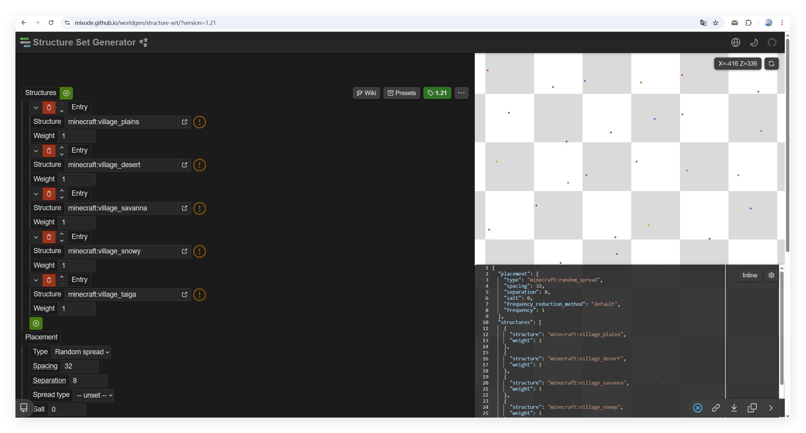

To better understand the role of structure sets, we demonstrate with an interesting example: ** Transforming a vanilla village into a very urban village. **

```json
{
  "placement": {
    // 一般来说都是 random_spread，除非是要塞那种特殊机制的结构
    "type": "minecraft:random_spread",
    // 村庄既然要城市化，那么必须生成概率要大大增加，我们让它每 2 区块尝试生成一次
    "spacing": 2,
    // 村庄之间的最小距离（区块）。两次结构之间的最大距离则为 2 × spacing - separation
    "separation": 1,
    // 盐，对的，就叫这个。需要懂一些密码学知识才能理解，你可以把它理解为一个随机数种子
    "salt": 0,
    // 频率算法，默认就行了
    "frequency_reduction_method": "default",
    // 频率，0-1，既然我们要城市化，那么就让它 100% 生成吧
    "frequency": 1
  },
  // 所有尝试加入的结构
  "structures": [
    {
      "structure": "minecraft:village_plains",
      "weight": 1
    },
    {
      "structure": "minecraft:village_desert",
      "weight": 1
    },
    {
      "structure": "minecraft:village_savanna",
      "weight": 1
    },
    {
      "structure": "minecraft:village_snowy",
      "weight": 1
    },
    {
      "structure": "minecraft:village_taiga",
      "weight": 1
    }
  ]
}
```


After re-entering the game, you will be surprised to find that the villages have become extremely dense and urban:


Through this simple example, we can see the powerful power of structure set configuration. Modifying just a few parameters can completely change the game's exploration experience.

## In-depth structure definition (Structure)

In the previous example, we used`structures`A vanilla structure definition file is used in the field. But in fact, these structure definitions themselves are completely customizable, which provides us with greater creative space.

There is an important difference to note here: there are two in vanilla called`structure`folders with completely different purposes. One is located in the root directory of the data pack and stores structure template files in NBT format (these are exported through the structure block); the other is located in`worldgen/structure`Under the path, stored are structure definition files in JSON format (these are configurations that tell the game how to generate structures).

Structure definition files are extremely powerful, allowing us to precisely control every aspect of a structure: spawn type, applicable mob biomes, spawn location (such as on the ground, underground, or water), spawn height range, mob types within the structure, how the structure fits into the surrounding terrain, and more. The combination of these parameters can create a kaleidoscope of generated effects.

Minecraft Wiki's [Structure Definition Format](https://zh.minecraft.wiki/w/%E7%BB%93%E6%9E%84%E5%AE%9A%E4%B9%89%E6%A0%BC%E5%BC%8F) page details all available structure types, from which we can see the degree of customization of different types:

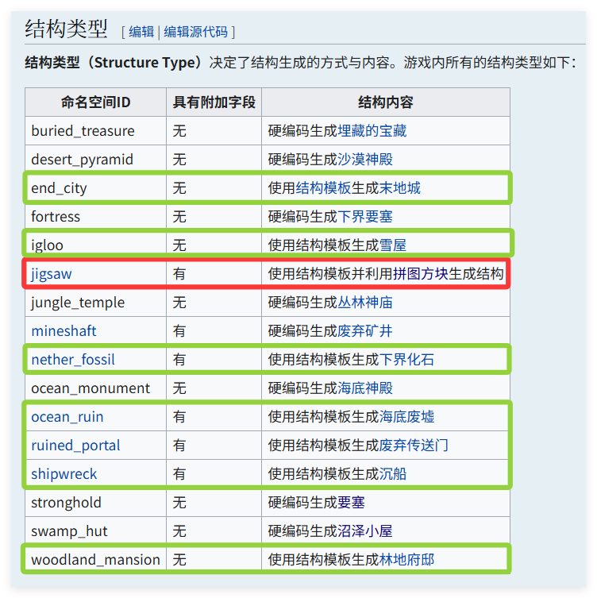

- Uncircled part: The degree of customization is the lowest, only some parameters can be modified, and the architectural style cannot be changed;
- Green part: High degree of customization, parameters and structure templates can be modified;
- Red part: The highest degree of customization, a large number of generation parameters can be modified, and complex structure generation can be achieved through the puzzle mechanism.

> [!TIP]
> Carefully observe the birth time of the structure: most structures before 1.13 were hard-coded; structure templates were used before 1.18; after that, the puzzle mechanism was fully adopted.


To demonstrate the power of structure definition, let's try an imaginative project: generate a village under the sea, creating a real Atlantean village!

First, we need to`worldgen/structure`Create under directory`custom_village.json`document. This file will define how our underwater village will be generated:

```json
// 我们来生成一个亚特兰蒂斯
// 参数可参考：https://zh.minecraft.wiki/w/%E7%BB%93%E6%9E%84%E5%AE%9A%E4%B9%89%E6%A0%BC%E5%BC%8F
{
  // 类型，只有 minecraft:jigsaw 自由度是最高的
  "type": "minecraft:jigsaw",
  // 我盟让它生成在所有带有 #minecraft:is_ocean 的生物群系中
  "biomes": "#minecraft:is_ocean",
  // 拼图方块距离起始点的最大距离
  "max_distance_from_center": 80,
  // 可选参数，村庄的生成高度
  // 这里我填写 OCEAN_FLOOR_WG，理论上它会生成在海床上
  "project_start_to_heightmap": "OCEAN_FLOOR_WG",
  "start_height": {
    "absolute": 0
  },
  // 村庄大小，我们设定小一些，3，也就是最多递归生成 3 次
  "size": 3,
  // 这个结构范围内可以生成的生物，留空，表示默认
  "spawn_overrides": {},
  // 起始的拼图池
  "start_pool": "minecraft:village/plains/town_centers",
  // 生成的阶段，参考 WiKi
  "step": "surface_structures",
  // 与周围地形的适配，这里就用这个，能自动契合周围环境
  "terrain_adaptation": "beard_thin",
  // 当超出范围时还生成其他拼图结构么
  // 用来防止结构垂直方向生成
  "use_expansion_hack": true
}
```


Next, we need to modify the structure set file we created earlier to replace the vanilla village with our custom underwater village:

```json
{
  "placement": {
    "type": "minecraft:random_spread",
    // 为了避免村庄叠村庄，这次我们把生成间隔稍微扩大一些，方便观察
    "spacing": 8,
    "separation": 2,
    "salt": 0,
    "frequency_reduction_method": "default",
    "frequency": 1
  },
  "structures": [
    // 这里只写我们的结构
    {
      "structure": "custom:custom_village",
      "weight": 1
    }
  ]
}
```


After completing the configuration, re-enter the game and you will find some wonderful phenomena in the ocean. Although the starting building of the village was indeed generated on the seabed according to our settings, the subsequent puzzle parts had unexpected effects:

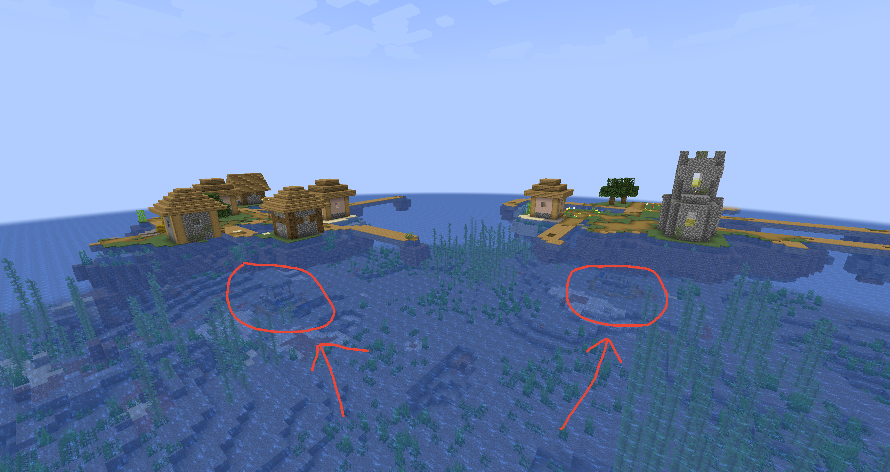

This phenomenon reveals an important question: Why can the starting point of the village be correctly generated on the seabed, but the subsequent puzzle structure does not meet our expectations? To understand this problem, we need to take a closer look at how Minecraft puzzle structures are generated.

## Deciphering the puzzle structure generation mechanism

In the blocky world of Minecraft, how to naturally generate large building complexes has always been a technical challenge. Simple grid placement can make buildings look stiff and unnatural, but the puzzle mechanic developed by Mojang cleverly solves this problem. This system not only ensures the natural connection of the structure, but also achieves a high degree of randomness and scalability.

There is an excellent visual tutorial on YouTube on how the puzzle mechanism works, which I highly recommend watching: &lt;https://www.youtube.com/watch?v=VNaGXvpE0Nw&gt;. This video shows the entire generation process with intuitive animations that are easier to understand than text descriptions.

### Recursively generated puzzle logic

When the game determines that it needs to generate a large complex, the entire process begins with a central starting structure. This starting structure is not an independent building, but contains multiple key puzzle blocks. These blocks are like the "interfaces" of the building:

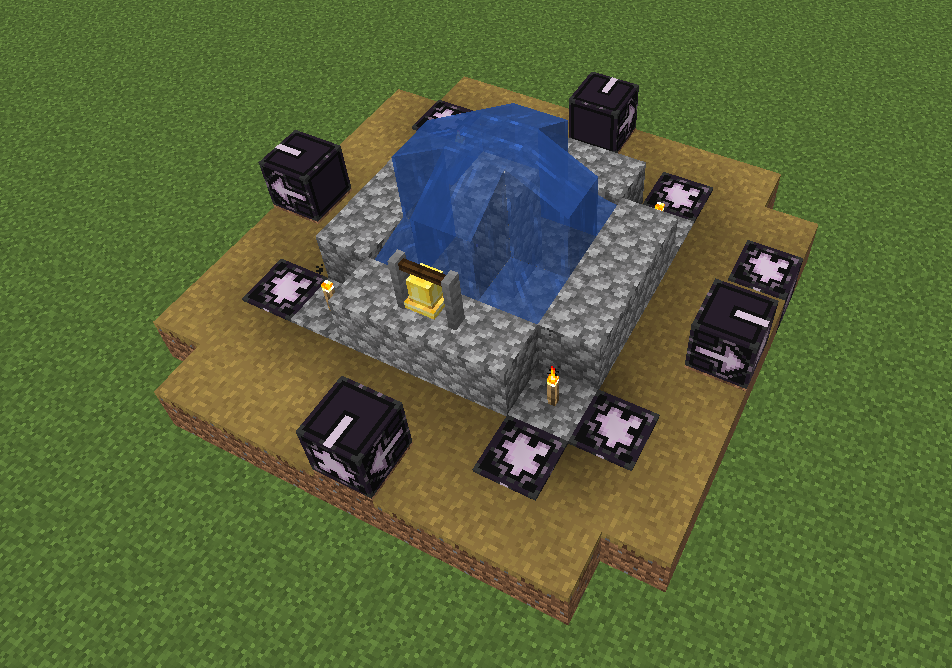

When we open these puzzle blocks with debugging tools, we can see that rich configuration information is stored inside them:

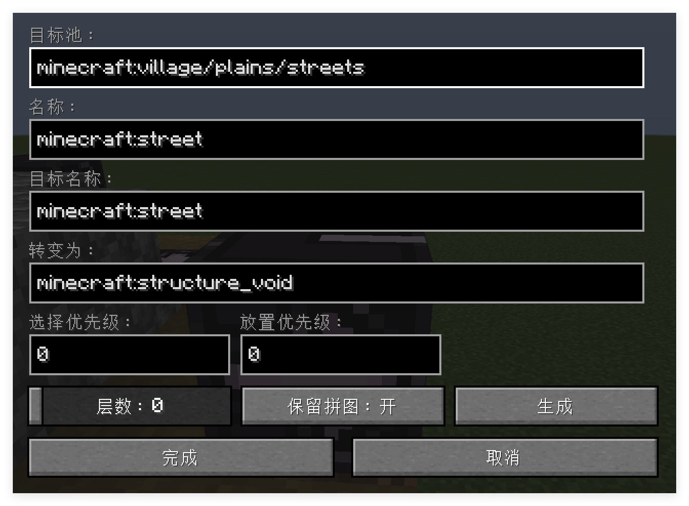

The data of each puzzle block specifies the next structure pool that should be generated. The system will randomly select a suitable structure from the pool and continue to generate it along the direction specified by the puzzle block. This design ensures that each generated building complex is different, avoiding a sense of repetition.

The generation process works like this: when the system recognizes the puzzle block in the starting structure (as indicated by the arrow in the figure below), it will trigger the generation process of the next layer of structure:

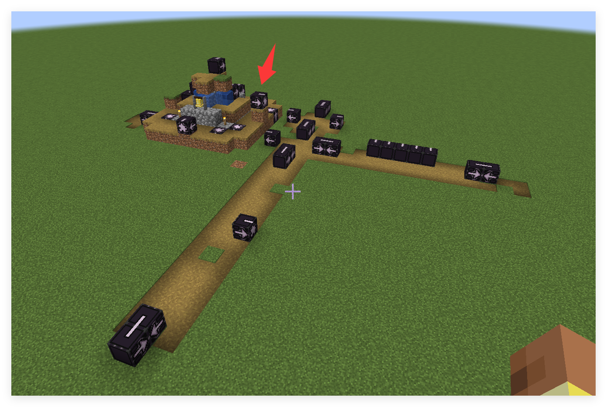

The newly generated structure will naturally connect with the original structure to form a coherent street network. This process is repeated continuously, gradually building a complete building complex:

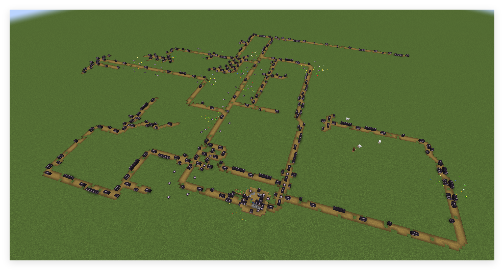

After the street structure is generated, the system will continue to process the puzzle blocks in the street structure and randomly select appropriate buildings from the village hut structure pool for generation. Subsequently, the hut structure pool will select generated objects from the villager or animal structure pool, and finally complete the construction of the entire village. This hierarchical recursive generation mechanism ensures that the village has both a unified style and rich diversity.

Of course, if this recursive process is not restricted, it can theoretically proceed indefinitely, which is obviously unrealistic. Therefore, the system is designed with multiple restriction mechanisms to control the generation range.

We are in front`custom_village.json`set in the file`size`Parameters are the key configuration used to control the depth of this recursion. The maximum recursion depth set by the system is 22 layers. When this limit is reached, the system will automatically stop trying to generate new structures to avoid infinite expansion.

### Intelligent matching mechanism for puzzle stitching

The puzzle splicing mechanism is the technical core of the entire system, which determines how different structures are naturally connected together. A deep understanding of this mechanism is critical to creating complex and coordinated custom structures.

The placement strategy of puzzle blocks directly affects its splicing behavior, which is mainly reflected in two different application scenarios.

**1. Boundary extension splicing**

Puzzle blocks can be placed on the edges of the structure to connect to other structures outwards. As long as the external structure does not collide with existing structures, it can be placed successfully:

This approach is commonly used in the construction of streets, building groups and road networks:

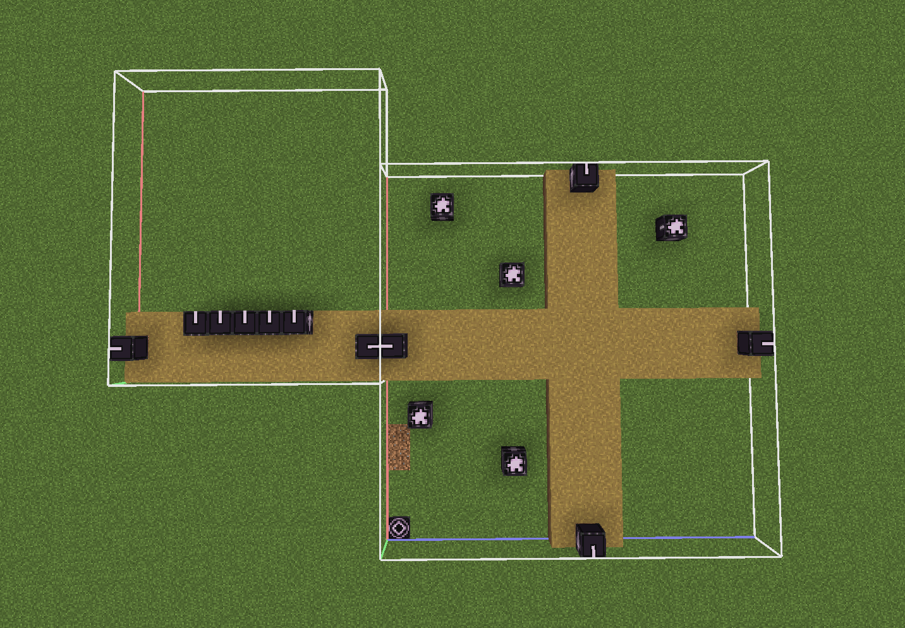

**2. Internal embedded splicing**

Puzzle blocks can also be placed inside structures to embed substructures. At this time, the system will strictly determine the amount of available space:

As shown below:

- There are 13 spaces in the area where puzzle A is located, and houses C or D can be assembled.
- B The area where the puzzle is located has only 7 spaces, and it can only assemble houses C

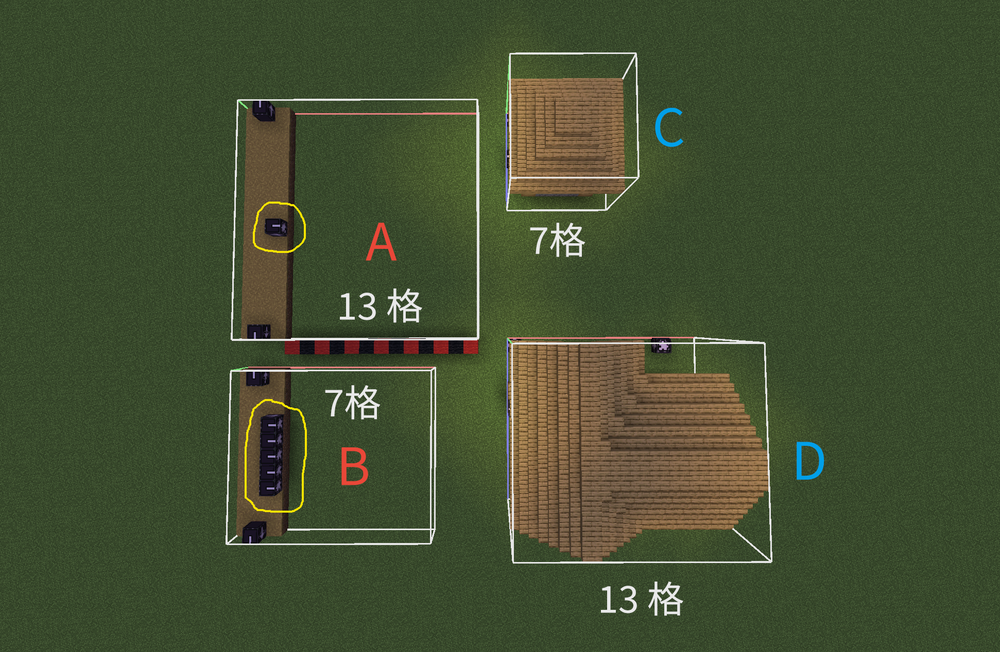

The system's collision detection mechanism is an important guarantee for the stable operation of the puzzle system. It ensures that the newly generated structure does not overlap or conflict with existing buildings. TelepathicGrunt in its [Structure Tutorial Project](https://github.com/TelepathicGrunt/StructureTutorialMod) provides a good visual demonstration, in which the red box indicates the situation where conflicts will occur, helping us to intuitively understand this detection process:

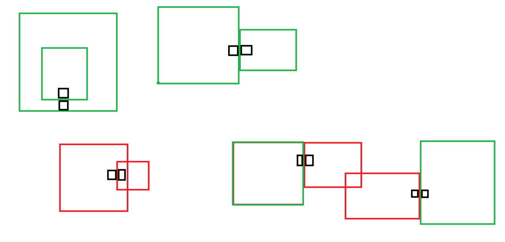

When the puzzle block detects that the target structure cannot be successfully placed at the current position, the system does not simply skip the position, but activates an intelligent degradation processing mechanism. The system reads the fallback field in the structure pool configuration, which points to another fallback structure pool. The program recursively checks all placeable structures in the spare pool.

This design effectively avoids sudden interruptions in structural generation, ensures that a suitable finishing structure can be generated, and maintains the integrity of the overall building complex:

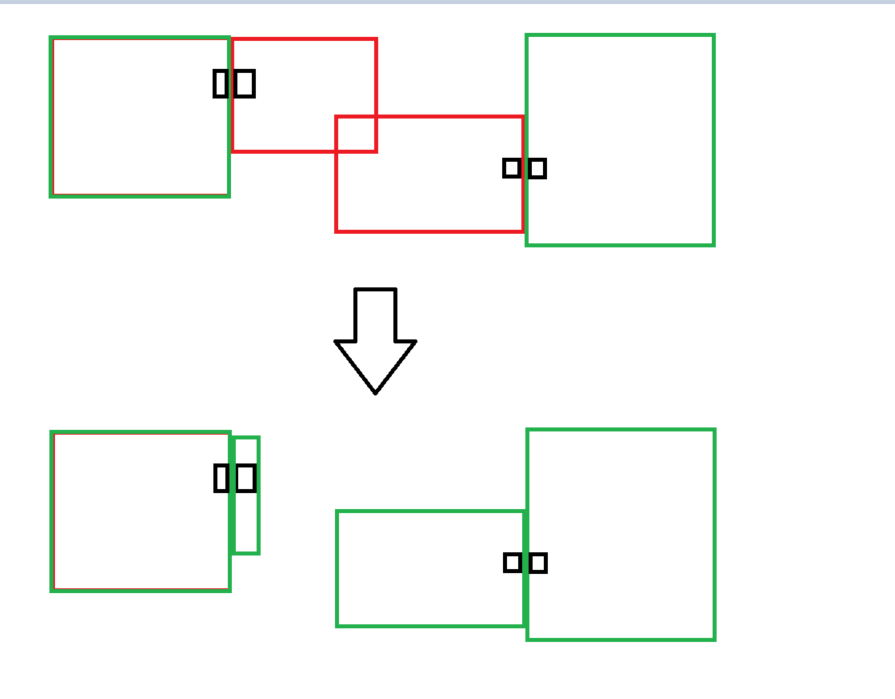

In the configuration of the structure pool, each structure is assigned a weight value, and these values ​​directly affect the probability of the structure being selected. Structures with larger weight values ​​have a higher probability of being selected during the random selection process. This weighted randomization mechanism allows creators to precisely control how often different types of buildings appear in generated results:

```json
{
  "elements": [
    {
      "element": {
        "element_type": "minecraft:legacy_single_pool_element",
        "location": "minecraft:village/plains/streets/corner_01",
        "processors": "minecraft:street_plains",
        "projection": "terrain_matching"
      },
      "weight": 2
    },
    {
      "element": {
        "element_type": "minecraft:legacy_single_pool_element",
        "location": "minecraft:village/plains/streets/straight_02",
        "processors": "minecraft:street_plains",
        "projection": "terrain_matching"
      },
      "weight": 4
    },
    {
      "element": {
        "element_type": "minecraft:legacy_single_pool_element",
        "location": "minecraft:village/plains/streets/straight_03",
        "processors": "minecraft:street_plains",
        "projection": "terrain_matching"
      },
      "weight": 7
    }
  ],
  "fallback": "minecraft:village/plains/terminators"
}
```


### Intelligent algorithm for terrain adaptation

For structures such as underground ruins, the system can directly generate them in a grid manner because they do not require complex interactions with the surface environment. However, for structures such as villages that need to coexist harmoniously with the surface environment, if a rigid grid generation method is still used, extremely unnatural visual effects will occur when the building group spans hillsides, rivers or other terrain changes.

The development team at Mojang took this issue into consideration and introduced a terrain matching parameter in the structure pool configuration. used in villages`terrain_matching`For example, when generating the next puzzle structure, the algorithm will intelligently analyze the surrounding terrain features: when encountering water areas, the system will automatically lay wooden planks or bridge structures; when encountering hillside terrain, the system will automatically adjust the height and angle of the building to make it naturally fit the current terrain undulations.

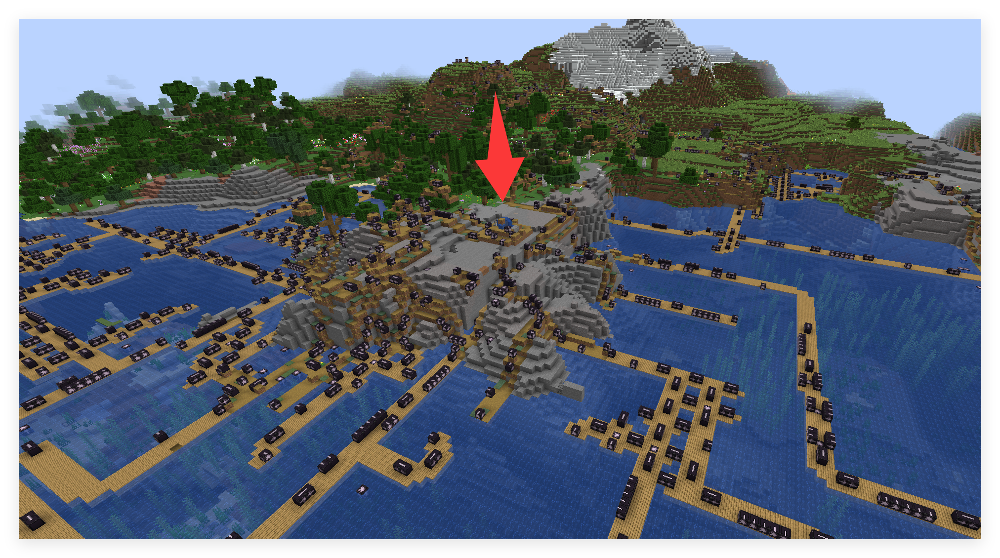

This terrain adaptation mechanism has an important feature: in addition to the initial structure being forcibly placed according to the configuration, all subsequent structures selected from the template pool will undergo automatic terrain adaptation processing. This ensures that the resulting building complex is not only functionally coherent but also visually integrated with the surrounding environment, creating a natural and harmonious landscape effect.

### Root cause of the problem: Atlantis village generation abnormality

Now we can clearly diagnose the problems encountered in previous underwater village projects. Although we clearly specified in the structure definition that the village should be generated on the seabed, and the starting structure was indeed forced to be placed in the correct location according to our settings, the subsequent structure generation was unexpected.

The core of the problem is: we completely use the vanilla configuration content when specifying the structure pool. While the first central building was forced to be placed on the seabed according to our custom settings, all subsequent puzzle structures were processed by vanilla's "terrain automatic matching algorithm". The algorithm doesn't know that we want to create an underwater civilization, and it still tries to match the architecture with the "normal" surface environment, which results in a generation effect that seems weird but actually follows the logic of the algorithm.

To completely solve this problem and create a true Atlantis village, we needed to customize the entire generation process more deeply, including creating specialized structure templates and accompanying structure pool configurations.

## Create a custom structure template

### Structural blocks: digital tools for architects

Structure block is the core tool for creating custom structures in Minecraft. It is like a powerful architectural recorder that can convert your creative buildings into reusable digital templates.

The structure block is a special tool for creative mode. Ordinary players cannot find it directly in the creative item column. You need to obtain it through the following instructions:

```mcfunction
/give @s minecraft:structure_block
```


The structure block has three different working modes, each with its specific purpose.

1. **Save mode (Save)**: used to export structures
2. **Load mode (Load)**: used to import structures
3. **Corner**: used to mark structure boundaries

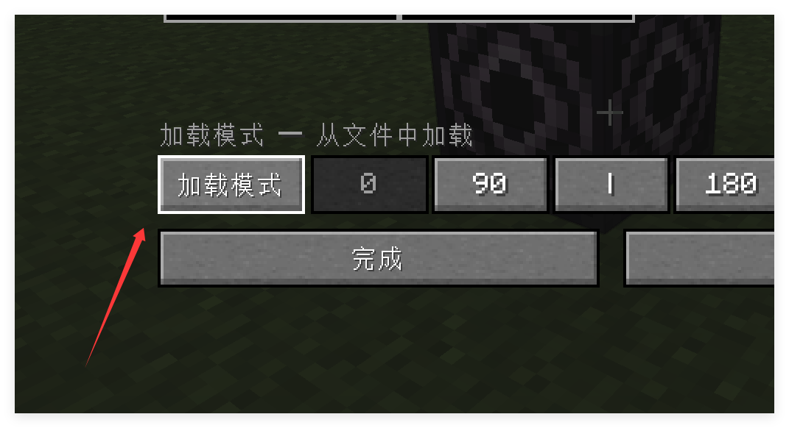

### From idea to template: complete structure export project

#### Step 1: Build the structure

To build the structure you want in creative mode, pay attention to the following points:

- Keep structures reasonably sized (up to 48×48×48)
- If you are making a puzzle structure, you need to carefully consider the placement, orientation and name of the puzzle blocks.
- Reserve necessary space for structural adaptation

#### Step 2: Place the structure block

1. Place a structure block in one corner of the structure
2. Set mode to Save
3. Enter a structure name (e.g.`custom:my_house`）

#### Step 3: Set boundaries

- **Manual Setup**: Enter X, Y, Z dimensions in the "Size" field
- **AUTO-DETECTION**: Use the "Detect" button to automatically calculate structure size
- **Corner Marker**: Use the corner mode structure block to mark the opposite corner

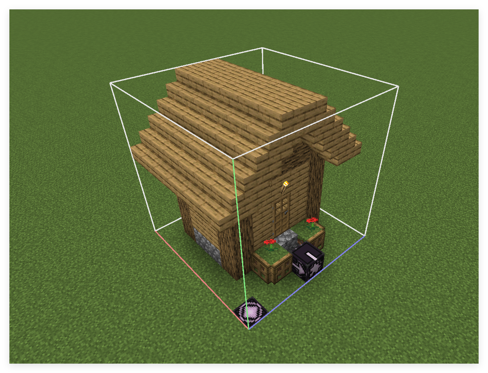

The last step is to perform the save operation. After clicking the "Save" button, the structure will be saved to the specific path under your current archive folder:`generated/minecraft/structures/custom/my_house.nbt`. This NBT file is your structural template and can be reused in different worlds and data packs.

### Structure Void

The structure gap is a special block, which will be processed as "do not replace the original block" when the structure is generated.

**How ​​to obtain:**

```mcfunction
/give @s minecraft:structure_void
```


**Main purpose:**

1. **Maintain original terrain**
   - When a building is generated on a hillside, the structure's vacant positions remain on the original terrain.
   - Avoid unnecessary terrain damage

2. **Partial replacement strategy**
   - Only replace blocks in specific areas
   - Maintain natural terrain transitions

3. **Air Zone Marker**
   - Clearly mark which locations should be air
   - Distinguish between "replace with air" and "do not replace"

When you place structural vacancies, it is recommended to turn on the "Show invisible block" function of the structure block configuration to facilitate observation of air, structural vacancies, etc.:

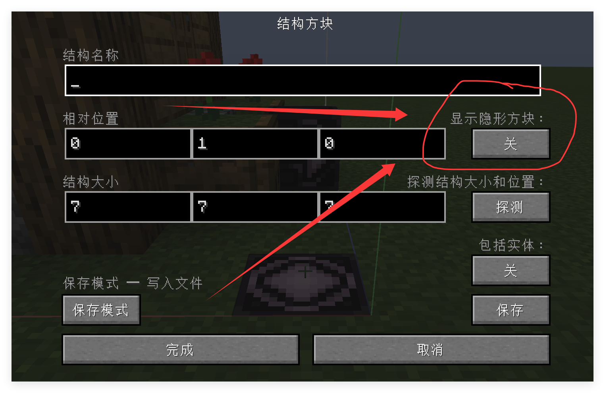

At this time, the air block will be displayed as a small purple frame, and the structural vacancies will be displayed as a small pink frame.

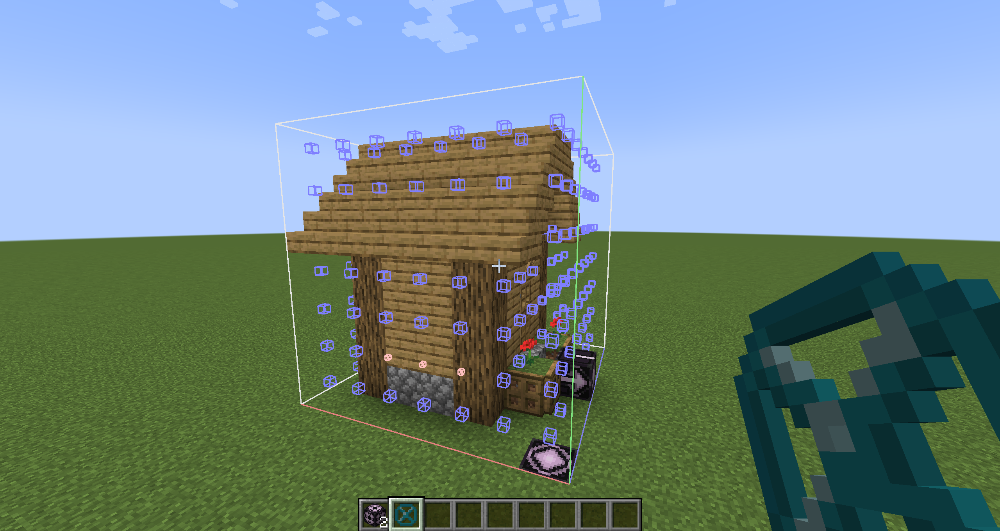

### Detailed explanation of puzzle block parameters

The puzzle block is the core of the puzzle system, and its parameter configuration directly affects the generation effect of the structure.

When placing puzzles, you need to pay attention to their orientation. Upward-facing puzzle pieces will only be linked to downward-facing puzzle pieces, and the same applies to downward-facing puzzle pieces. But any horizontally oriented puzzle will automatically rotate the entire structure to fit the appropriate orientation.

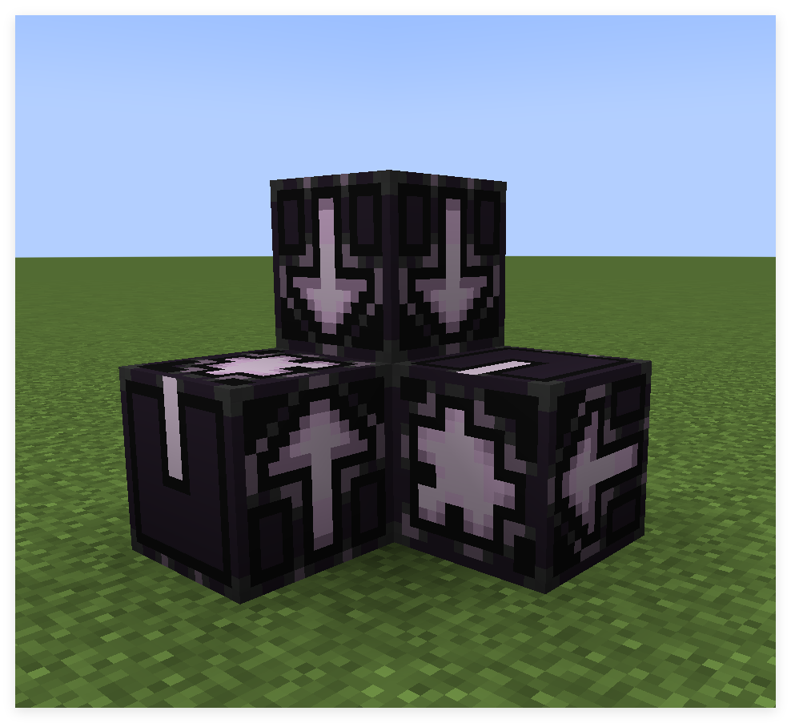

Next, each parameter is introduced:

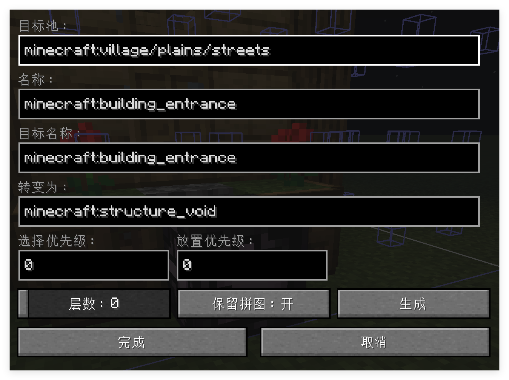

#### 1. Target pool

Specify from which structure pool the next structure should be selected:
The one in the picture above is`minecraft:village/plains/streets`It means randomly selecting a suitable structure from the structure pool of this vanilla ID to splice with the current puzzle.

#### 2. Name

The identifier of the current puzzle block, used to match other puzzle blocks.

#### 3. Target name

Specify the name of the puzzle block to be connected, which must match for successful connection.

```text
连接示例:
拼图 A 名称: "minecraft:building_entrance"
方块 B 目标名称: "minecraft:building_entrance"
→ 成功连接
```


#### 4. transform into

When the game naturally generates a structure, it will automatically remove all puzzle blocks. Here, fill in the block type that will be converted into after the puzzle block is removed.
Fill in as`minecraft:structure_void`The effect is the same as the previous structural vacancy.

#### 5. Number of layers

Controls the number of recursively generated layers when clicking the "Generate" button. It is only used for in-game debugging and will not be written to the template file.

#### 6. Keep the puzzle pieces

Determines whether the puzzle block will be retained after the structure is generated. It is only used for in-game debugging and will not be written to the template file.

## Efficient structural file management and optimization

**Structural Verification Checklist:**

- [ ] The puzzle block is configured correctly
- [ ] Structural vacancies are placed reasonably
- [ ] Dimensions comply with restrictions
- [ ] Compatible with target pool
- [ ] File naming convention

After you complete the above check items, you can put the exported nbt file into the structure folder of your data pack. To keep your project tidy, it is recommended to create a sensible subfolder structure to organize different types of buildings:

```text
数据包
└── data
    └── custom    # 命名空间文件夹
        └── structure
            ├── building    # 套的子文件夹，仅仅是为了规整，非必须
            │   ├── house_small.nbt
            │   └── house_large.nbt
            └── decoration
                └── fountain.nbt
```


Since structure files are in binary NBT data format and use gzip compression, it is quite difficult to edit these files directly. Fortunately, the community has developed excellent tools to solve this problem. Use VSCode editor and install [NBT Viewer](https://marketplace.visualstudio.com/items?itemName=Misodee.vscode-nbt) plug-in, you can easily open and edit these structure template files.

The plug-in’s 3D visualization capabilities are particularly useful. When you select a specific block in the 3D view, you can directly modify the data stored inside it. As shown in the figure below, we can directly modify the structure pool name in the puzzle block through the plug-in, which greatly simplifies the production and debugging process of data pack:

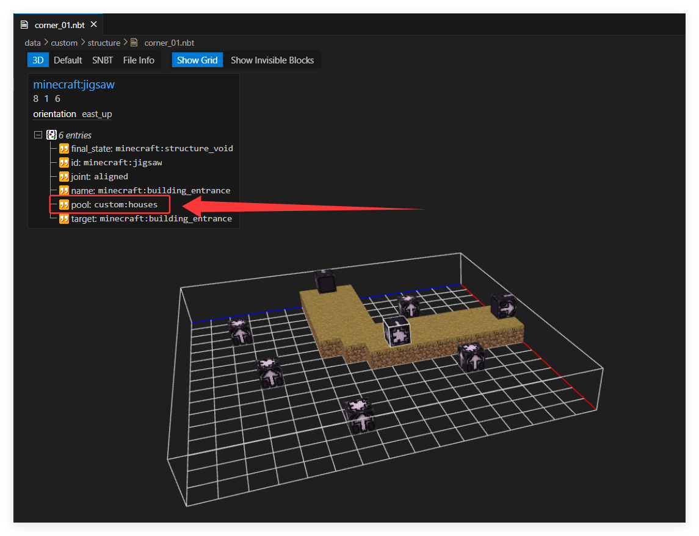

## Building a structure pool system

The structure pool is the core configuration file of the puzzle generation system, which defines the connection relationships and generation logic between structures. For detailed parameter description, please refer to &lt;https://zh.minecraft.wiki/w/%E7%BB%93%E6%9E%84%E6%B1%A0&gt;。

The "target pool" field configured in the puzzle block is actually the ID identifier of the structure pool. When the game generates the starting structure, the puzzle block in the starting structure will search for the corresponding structure pool configuration in the data pack based on this identifier, and then randomly select the appropriate structure from the pool for recursive generation. Throughout the process, the system can also perform additional modifications and processing of the structure before and after generation.

The generation of vanilla villages follows a carefully designed hierarchical structure: starting from the starting structure (town_centers), expanding to the street system (streets), then connecting to various village buildings (houses), and finally generating villagers and animals (villagers). In this main process, some decorative elements (decor), vegetation (trees), and terminators without any puzzle connections are also interspersed. These elements together constitute a rich and diverse village ecology.

In order to efficiently realize our Atlantis village project, we will adopt a progressive approach: based on modifying the vanilla template file, focus on creating the structure pool configuration of the three core parts of the starting structure, street system and village building.

### Starting structure pool configuration (`worldgen/template_pool/town_centers.json`）

The starting structure pool defines the core building of the village, usually a square, fountain, or other landmark. The configuration of this structure pool is relatively simple, as it only needs to contain one or a few central building options:

```json
{
  "elements": [
    {
      "element": {
        // 固定写这个
        "element_type": "minecraft:single_pool_element",
        // 这需要我们放一个模板文件 plains_fountain_01.nbt 在 structure 文件夹下（注意不是 worldgen 下的那个）
        // 这里为了方便，我们直接修改原版的结构文件
        "location": "custom:plains_fountain_01",
        // 我们先暂时留空
        "processors": "minecraft:empty",
        // 必须设置为 rigid，否则不能在水下生成
        "projection": "rigid"
      },
      "weight": 1
    }
  ],
  // 这个池子没有其他元素了，所以我们设置一个空的回退
  "fallback": "minecraft:empty"
}
```


### Street System Pool Configuration (`worldgen/template_pool/streets.json`）

The street system is the skeleton structure that connects various buildings and needs to contain a variety of different road types to accommodate various connection needs:

```json
{
  "elements": [
    {
      "element": {
        "element_type": "minecraft:legacy_single_pool_element",
        // 直道，没有小屋拼图
        "location": "custom:straight_01",
        "processors": "minecraft:empty",
        "projection": "rigid"
      },
      "weight": 4
    },
    {
      "element": {
        "element_type": "minecraft:legacy_single_pool_element",
        // 直道，带一个 13 格空位的小屋拼图
        "location": "custom:straight_02",
        "processors": "minecraft:empty",
        "projection": "rigid"
      },
      "weight": 4
    },
    {
      "element": {
        "element_type": "minecraft:legacy_single_pool_element",
        // 转角，带一个 7 格空位的小屋拼图
        "location": "custom:corner_01",
        "processors": "minecraft:empty",
        "projection": "rigid"
      },
      "weight": 4
    },
    {
      "element": {
        "element_type": "minecraft:legacy_single_pool_element",
        // 十字路口，带七个 7 格空位的小屋拼图
        "location": "custom:crossroad_01",
        "processors": "minecraft:empty",
        "projection": "rigid"
      },
      "weight": 4
    }
  ],
  "fallback": "minecraft:empty"
}
```


### Building structure pool configuration (`worldgen/template_pool/houses.json`）

The building structure pool contains various houses and functional buildings in the village, which will be called by the puzzle blocks in the street system:

```json
{
  "elements": [
    {
      "element": {
        "element_type": "minecraft:legacy_single_pool_element",
        // 小型村民房屋，占地 7 格
        "location": "custom:plains_small_house_1",
        "processors": "minecraft:empty",
        "projection": "rigid"
      },
      "weight": 1
    },
    {
      "element": {
        "element_type": "minecraft:legacy_single_pool_element",
        // 中型村民房屋，占地 13 格
        "location": "custom:plains_medium_house_1",
        "processors": "minecraft:empty",
        "projection": "rigid"
      },
      "weight": 1
    }
  ],
  "fallback": "minecraft:empty"
}
```


The structure pool configuration file alone is not enough to complete our Atlantis project. We also need to provide the supporting structure template file, which is the above configuration.`location`The specific construction document that the field refers to.

At this stage, we can adopt an efficient method: directly copy the vanilla structure template file, and then use VSCode's NBT Viewer plug-in to make the necessary modifications.

After using the plug-in to open the structure file, focus on the puzzle block configuration.

When selecting a puzzle block in the 3D view, you need to carefully check the setting of the pool field. This field determines which structure pool the puzzle block will select when recursively generating it. We need to replace all references to the vanilla structure pool with our custom structure pool.

Specifically, if the original configuration points to the structures pool related to streets, it needs to be modified to our`custom:streets`;If it points to the structure pool related to houses, it needs to be modified to ours`custom:houses`。

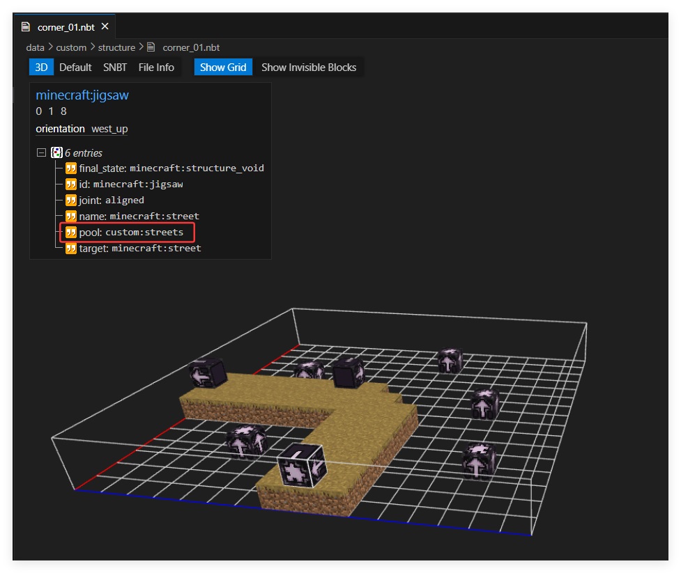

After completing the modifications to all configuration files and template files, your data pack directory structure should look like this:

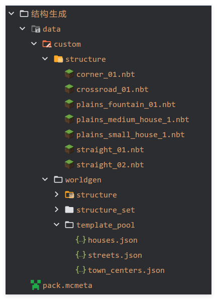

When all the files are ready and checked, re-enter the game world and go to the deep sea biome. You will be able to see the real wonders of the underwater village:

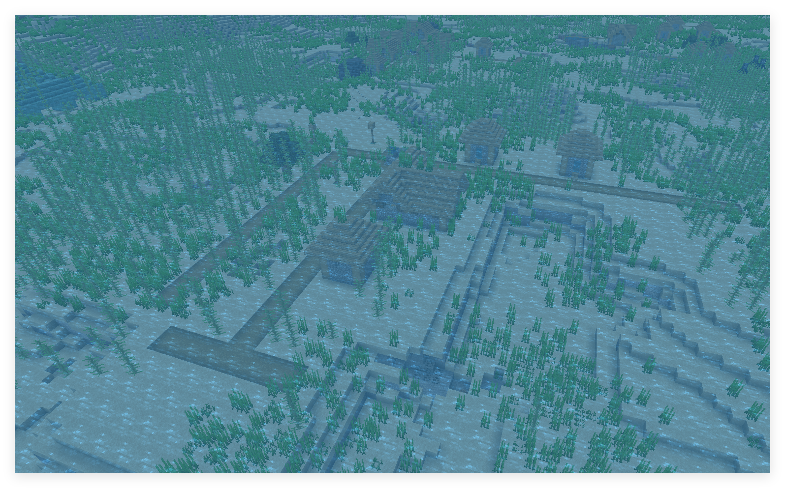

This result demonstrates the power of the puzzle system: by carefully configuring the structure pool and template files, we successfully transplanted the village system originally designed for the surface to the underwater environment, creating a unique Atlantis civilization landscape.

## Practical development tools and debugging instructions

In the process of developing and testing custom structures, mastering some practical instructions can greatly improve work efficiency, allowing you to quickly verify whether the configuration is correct and discover and solve problems in a timely manner.

Use the locate command to quickly locate a specific structure or mob:

```mcfunction
/locate structure minecraft:village_taiga
/locate biome minecraft:wooded_badlands
```


When you need to directly test the generation effect of the structure, the place command provides an instant placement function, which can directly place the specified structure or structure template at the current location:

```mcfunction
/place structure custom:custom_village
/place template custom:corner_01
```


