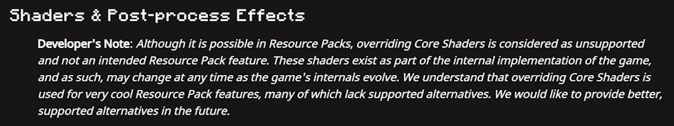
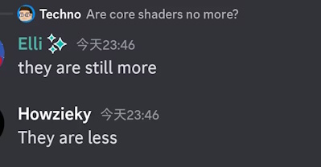
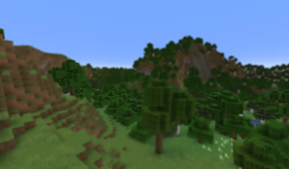
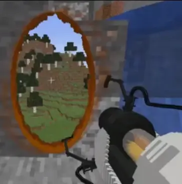
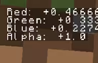
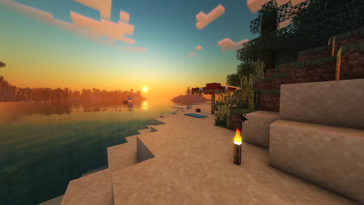
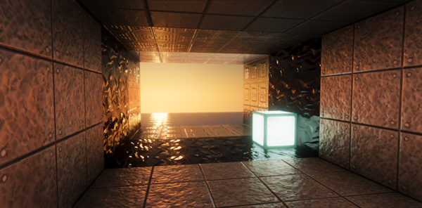
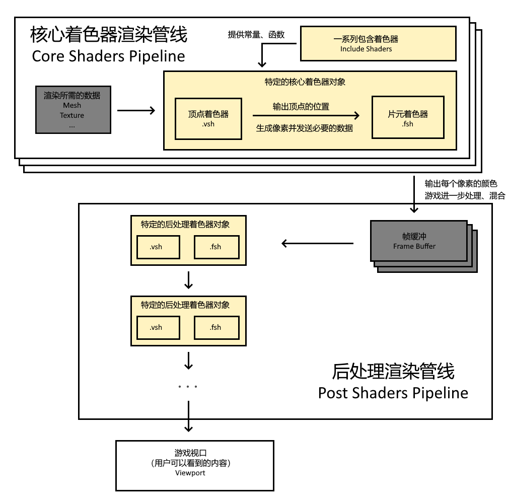
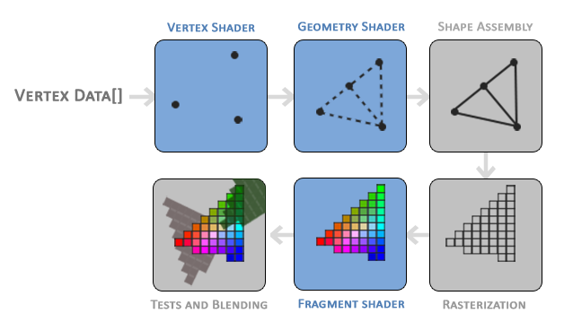

<FeaturedHead
    title = "Shader Basics Tutorial 01: Shader in Minecraft"
    authorName = "Xuanyu1725"
/>

## written in front

The previous shader tutorial was written in the column of station b and can be found in Vanilla Library (marked as`obsolete`). However, due to mysterious changes in site b that are not backward compatible, these tutorials are no longer available.

On the other hand, as of the writing date of this article (August 3, 2025), Minecraft's shader is not a stable API. It changes every few versions, making the shader tutorial difficult to maintain.

Because of this, it is recommended that readers of this article study according to the following ideas:

- First keep it consistent with the version of the tutorial

- After becoming proficient in writing shader content, compare and adapt to the writing of the new version in the wiki and vanilla asset files.

Unlike learning in other Minecraft technical areas, the shader's Wiki page is not very effective in early learning, and it is not valuable to consult until the fifth issue of this tutorial. This is mainly because the current content of the Wiki is for general shader workers to quickly understand the rendering characteristics of Minecraft, and shader itself requires a certain amount of systematic learning, and the technical threshold is much higher than other fields. Moreover, the current Chinese page has not been maintained for a long time, and many readers are not in the habit of consulting English pages, which makes shader learning very unfriendly to beginners. The original intention of this tutorial is to supplement the content that is lacking in the Wiki as carefully as possible, so that people without shader basics can quickly learn and develop Minecraft shaders. Of course, due to the frequent changes in the API, I hope that the tutorial can convey to readers the method of studying shader features instead of unchanged feature descriptions and test data.

*(We also call on you to supplement the pipeline content of each version that can be used for reference and testing when writing shaders or reading source code. You can join the data maintenance group 1004722950)*

## What does shader do?

### Shaders in Minecraft

Shader is an asset within the resource pack and is used to control the rendering process in **client**.

To put it simply, the familiar resource pack content such as model textures is just a bunch of invisible data, and the shader is a program that uses these data to draw on the plane, controlling the position of each vertex and the color of each pixel that is ultimately output to the screen.

However, although the shader can easily change the color of each pixel, **what color it changes to under what conditions** is the core issue when we modify the shader.

At present, the shader cannot communicate directly with the data pack, and the input is relatively limited. This determines that the Minecraft vanilla shader is almost all evil. The same approach may not be a good way to write outside of Minecraftvanilla, but it is the best way we can use it.

In the following tutorials, I will introduce the workflow of the shader, and then I will have a deeper understanding of it.

### Minecraftshader History

#### Low version

The history of Minecraftshader is actually very long. It was first added in 1.7 and was used for the screen effects in the "Super Secret Options". At that time, there was only the **post-processing shader** (treating the entire screen as a plane with textures, and then modifying it, so it can only achieve filter-like effects). Then the Super Secret option button is`1.9`was removed, the remaining shader is`1.20.5`was deleted.

but`1.8`Screen effects for watching creepers, endermen, spiders and glowing entity outlines have been added.`1.16`Added "Excellent!" quality

Although these post-processing shaders cannot change the shape of elements in the world, because they can access depth information and color information, they can already achieve some good effects, such as water blur, depth of field, portals, screen debugging text and other works.

#### New version`1.17`The core shader has been added. The opening of the core shader means that we can control the vertices of every element in the world. Of course, more importantly, we can now access more specific data and global data needed for rendering. We will introduce these aspects in detail later.

With now access to a lot of content that may not ultimately be rendered to the screen, as well as fog and lighting calculations, the content of the shader has begun to become complex and diverse. Some complex effects can now be achieved

The pictures below are vanilla lights and shadows from bradleyq and JNNGL.

### Shaders outside Minecraft

Generally speaking, developers usually have control over the entire rendering process, especially control over which data can be entered into the shader. This is not possible in Minecraft's resource pack, which is why the shader in Minecraft is so wheelchair-bound.

But it is still useful to learn more about shaders and graphics broadly, and here are some recommended resources that you may need. Note that you don’t need to learn this right now, I will cover most of it in the tutorial and these resources are for further learning only.

#### GAMES101

[Course Video](https://www.bilibili.com/video/BV1X7411F744/) [Course Home Page](https://sites.cs.ucsb.edu/~lingqi/teaching/games101.html)

It is an open system course on modern computer graphics. It is not necessary to study it completely, but many basic knowledge that needs to be mastered can be learned in the course. I will also give basic explanations in the tutorial.

#### shadertoy

[official website](https://www.shadertoy.com/)

A website for shader writers to communicate. This website provides many open source works based on shaders. You can also write shaders and publish them on it.

#### LearnOpenGL

[Original text](https://learnopengl.com/) [Chinese translation](https://learnopengl-cn.github.io/)

A systematic tutorial on OpenGL (the graphics API used by Minecraft). Learning it is not necessary, but it is helpful for understanding the rendering process.

Therefore, learning Minecraftresource packshader, on the one hand, is to learn the syntax of GLSL (OpenGL Shading Language) itself (basically consistent with other platforms), and on the other hand, more importantly, it is to understand the structure and conventions of Mojang's customized rendering pipeline.

## Rendering pipeline

*Note: From here on, many important concepts will appear in the tutorial, and I will provide their English names for easy reference*

*The introduction to the rendering pipeline is a necessary foundation. This does not include any code or solutions, but you must master this foundation*

### Basic concepts

Readers who have done models should be familiar with the representation of models.`.json`In the file, the baking model is composed of a voxel`from`coordinate to`to`coordinate defined. However, in the shader, the objects we operate on are more precise. Taking the baked model as an example, each voxel is regarded as 24 **vertexes (Vertex)** (rectangular 4 vertices * 6 faces) in the shader. The entire model composed of vertices connected to each other is called **Mesh**.

Some readers may find it strange that each voxel only needs 8 vertices to represent its shape. Why do we have so many 24 vertices here?

In fact, during the rendering process, vertices are not only used to calibrate positions. Each vertex has many attributes (Vertex Attributes). In addition to position, there are often **normal (normal direction perpendicular to the surface)**, **color (Color)**, **texture (Texture)**, **UVcoordinate** and so on. It is not difficult to understand why the six faces cannot simply share 8 vertices - the vertices on the corners need to represent the information of the three faces, and naturally require 3 different vertices.

Of course, we can't get a complete surface with only vertices. So after determining the position of the vertex on the screen, we will generate pixels in the area between every three points. These pixels are called fragments. Only after the shader calculates and outputs the color of each fragment can we see a complete surface on the screen. (It can also be seen from this process that although Minecraft’s baking model uses voxels as the basic unit, for the shader, each surface is actually a triangle instead of a rectangle)

In one sentence, the content we see on the screen is composed of **fragments**, and the position and data of **fragments** come from each **vertex**. A series of operations from data to display are performed by **shader (Shader)**.

### shader type

We now know the main work of the shader, which is the operations related to vertices and fragments. Based on specific purposes, we can divide shaders into three major categories.

- Core Shader: Processes mesh, texture and other data and outputs it as a visible picture.

- Post-processing shader (Post Shader): Processes the core shader output after further processing by the game, that is, the frame buffer (Frame Buffer), and synthesizes it into the final output picture.

- Include shader (Include Shader): introduced by the core shader`.glsl`File (new version post-processing can also be used, but the presence is not very strong), used to provide various constants and tool functions.

Core shaders and post-processing shaders are the collective name for many shader objects with different names. For the core shader, different shader objects are used to process different types of game content (for example, blocks and entities are processed using different shader objects). For post-processing shaders, different shader objects are used to call different programs in the post-processing pipeline (Pipeline). Each shader object consists of a`.vsh`Vertex shader (Vertex Shader) and a`.fsh`Composed of fragment shader (Fragment Shader).

*Note: in`1.21.5`Previously, each shader object could use a corresponding`.json`file to configure the vertex shader and fragment shader it uses. You can modify this configuration file to let different shader objects use the same`.vsh`and`.fsh`, but in`1.21.5`Afterwards, these were removed`.json`files, different shader objects can now only use fixed`.vsh`and`.fsh`*

There may be many new concepts above, but they are all important. I will use the following schematic diagram to represent the relationship between them. The content with a yellow background is the shader content that we can modify:

### Rendering process (rendering pipeline)

OpenGL uses a pipeline-like approach to handle the rendering process, so it is called **Rendering Pipeline**.

If you feel that the above content is enough, then you can take a break and continue reading, because next we will explain how the various concepts mentioned above control the rendering process. Although these processes require the use of mathematical tools from linear algebra, I will try to avoid using mathematical concepts here and only mention them when necessary.

Although we only need to modify the contents of the vertex shader and fragment shader, it is still necessary to understand the entire rendering process, but there is no need to understand how to implement the primitive assembly, rasterization and other processes mentioned below. We only focus on the shader.

#### The first stage - vertex shader stage

Various things loaded into the game will send their vertex attributes to specific shader objects, represented by`.vsh`Vertex shader to process these vertices.

The main task of the vertex shader at this stage is position conversion. Taking the entity in the world as an example, the vertex coordinates sent to the shader are all based on the relative coordinates of the camera. However, according to OpenGL convention, the output coordinates of vertices are derived from`(-1.0, -1.0, -1.0)`arrive`(1.0, 1.0, 1.0)`Within the range, the origin is at the center of the screen, and the z-axis is vertical to the outside of the screen. The task of the vertex shader is to use a series of data sent by the game, including camera data, and match the properties of the vertex itself to perform a series of mathematical calculations to move the vertex to the correct position.

There is actually a lot of content output by the vertex shader. First of all, it includes the position of the vertex, and secondly, the various attributes of the vertex that need to be passed to other stages.

#### The second stage - Primitive Assembly

This step is not programmable. The primitive assembly stage will connect the vertices output by the vertex shader in the previous stage into basic primitives (points, lines, **triangles**). In the previous stage, not all vertices sent to the shader will be kept on the screen, beyond`(-1.0, -1.0, -1.0)`arrive`(1.0, 1.0, 1.0)`Vertices within the range are ultimately invisible and will be culled during the primitive assembly phase.

#### The third stage - Geometry shader (Geometry Shader)

The geometry shader can generate more vertices and primitives based on basic primitives, but Minecraft does not allow modifying the geometry shader, so we skip it.

#### The fourth stage - Rasterization

This step is also not programmable. Discretize the geometric primitives obtained in the previous step into fragments corresponding to the pixels on the screen. Each fragment will inherit the attributes output by the vertex shader and interpolate smoothly. This process is called **Fragment Interpolation**. Interpolation is the process of converting discrete content into continuous content. The fragment will calculate its own attribute value from the attribute value of the vertex based on its relative position to the vertex.

For example, the three vertices of a triangular surface define three UVcoordinates respectively.`(0.0, 0.0), (1.0, 0.0), (0.0, 1.0)`Then each fragment will be interpolated to obtain its corresponding UVcoordinate. For example, the UVcoordinate of the fragment at the center of the first vertex and the second vertex is`(0.5, 0.0)`.

#### The fifth stage - fragment shader

This stage is similar to the first stage, using the data of each fragment to calculate and output the final color, transparency and depth value of the fragment. The game also determines which framebuffer the data will be output to, but we won't consider those details.

#### Phase Six - Testing and Mixing

This stage mainly includes **Depth Test** and **Transparency Blending (Alpha Blending)** and other contents. The depth test will determine which fragment will remain on the screen based on the depth of the fragment. Transparency mixing will mix colors with other fragments based on the transparency of the fragment and obtain a new color.

### File hierarchy in resource pack

in`1.21.2`Previously, all shaders were stored in resource packs`assets/minecraft/shaders`Under, the core shader is stored in`shaders/core`Next, the shader is stored in`shaders/include`Next, the post-processing shader pipeline is defined in`shaders/post`Next, the shader program of the post-processing shader is in`shaders/program`Down.

    assets/minecraft/shaders/
    ├── core/ [core shader]
    │ ├── rendertype_entity.vsh
    │ └── rendertype_entity.fsh
    ├── include/ [include shader]
    │ ├── fog.glsl
    │ └── light.glsl
    ├── post/ [Post-processing pipeline definition]
    │ └── creeper.json
    └── program/ [post-processing shader program]
        ├── blur.fsh
        └── blur.vsh

in`1.21.2`Finally, the post-processing shader pipeline was moved to`assets/minecraft/post_effect`Down.

    assets/minecraft/
    ├── shaders/
    │ ├── core/ [core shader]
    │ ├── include/ [include shader]
    │ └── post/ [Post-processing shader program]
    │ ├── blur.fsh
    │ └── blur.vsh
    └── post_effect/ [Post-processing pipeline definition]
        └── creeper.json

## Summary

This tutorial introduces the shader and its workflow. It has not yet begun to introduce the writing of the shader. Compared with other parts of the resource pack, the shader does require theoretical study before you can start writing. This is also a major feature of the shader. Starting from the next section, we will introduce the writing of the core shader and use it to implement some simple content. Starting in the next section, you will see the above concepts reflected repeatedly in shaders.

Although I said it at the beginning, I still have to remind you that shader is not a stable API. Mojang clearly stated that it will change frequently, so it is best to learn shader in a fixed version, and then refer to wiki and vanilla resources for further learning.