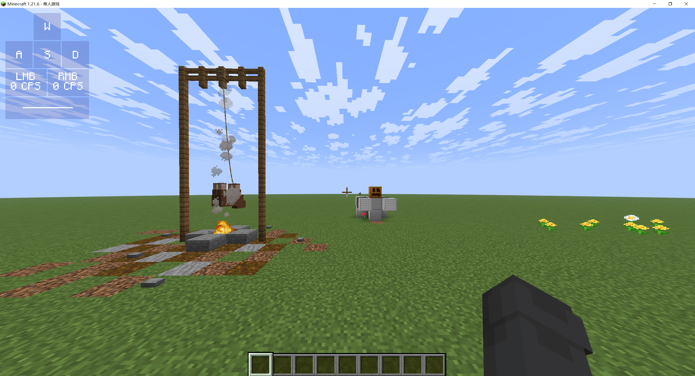
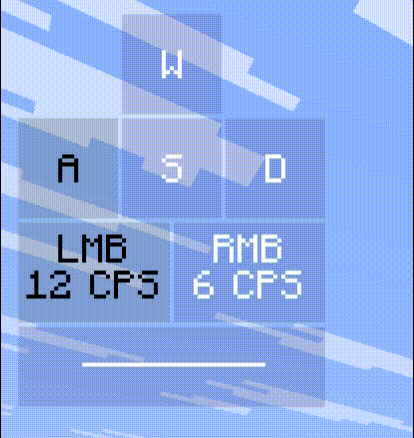

::: tip Translation notice
This page was translated with machine translation and may contain inaccuracies. If you can help improve it, please open an issue or submit a pull request.
:::


<FeaturedHead
title = 'Vanilla key display based on keybind_down and shader'
authorName = HuoyuFlame
    resourceLink = 'https://github.com/Huoyuyuyu/KeyDisplay'
/>

## Introduction

In vanillaMC, key detection is more difficult, but what if it is just displayed?

CPS is the number of mouse clicks per second

When I saw the **CPS display** of a certain module, I had an idea: **Can I make a CPS display in vanilla?**

This article will introduce in detail the use of [shader](https://zh.minecraft.wiki/w/%E7%9D%80%E8%89%B2%E5%99%A8) detection`keybind_down`**CPS display** of model change implementations

For reference for shader beginners

(Note: You need a certain foundation to understand)

## Effect display

- The default ui is in the upper left corner


- click effect


## Description of ideas

It’s a bit long. If you’re too lazy to read it, you can go to [save flow](#省流-总结)

### keybind_down

In 1.21.4, mojang added [item model mapping](https://zh.minecraft.wiki/w/%E7%89%A9%E5%93%81%E6%A8%A1%E5%9E%8B%E6%98%A0%E5%B0%84)

item model mapping`condition`The type will display different models depending on whether the conditions are met or not.

of which`keybind_down`Conditions are the core of key detection

It indicates whether the player **presses** a **key** bound to the game

```json
{
    "model": {
        "type": "composite",
        "models": [
            {
                "type": "condition",
                "property":"keybind_down",
                "keybind":"key.attack",
                "on_true": {
                    "type": "model",
                    "model": "cps:lmb1"
                },
                "on_false": {
                    "type": "model",
                    "model": "cps:lmb0"
                }
            },
            ...
        ]
    }
}
```


The code above defines a function that displays when **the left button** (attack button) is pressed.`lmb1`Model, displayed as when **release the left button**`lmb0`model mapping of model

The **textures** corresponding to these two models are completely different.

When the player presses the left button, the item model changes, the texture changes, and the color of the texture also changes.

### shader brief description

Shader is an important process in **image rendering**

Mojang has opened up some shader modifications in the vanilla resource pack

Therefore we can override these shaders through resource pack

The shaders that vanilla can change are divided into two categories, namely **vertex shader** and **fragment shader**

I will only give a brief explanation here without going into details.

#### Vertex shader & fragment shader

Brief description:

In MC, a face consists of four vertices

For **each face**, it goes through:

The vertex shader (hereinafter referred to as vsh) calculates and outputs the **position** of each **vertex**

The fragment shader (hereinafter referred to as fsh) calculates and outputs the **color** of each **pixel** between vertices.

#### Core shader & post-processing shader

Brief description:

Core and post-processing are actually two stages

In the core shader stage, vsh and fsh will be applied to each **unprocessed** face in the game (such as 6 faces of the grass block and 1 face of the particles)

Finally, these surfaces will be transformed from <u>invisible 3D data</u> into a <u>2D image that can be seen on the screen</u>

The post-processing stage is to apply vsh and fsh again to the **processed** surface.

This application target of post-processing can be called **Frame Buffer**

#### the difference

For the core, we can only overwrite the shader written in vanilla (that is, change the code inside)

For post-processing, we can create a new shader and modify the rendering pipeline (you can customize the order in which the shader is applied and which frame buffer it is applied to)

At the same time, post-processing has a feature that can use the frame buffer to transfer data across frames (reset when the resolution changes or the resource pack is reloaded)

### Pass data from core to post-processing

Now back to the topic, if you want to do cps display, you definitely can’t have only one moment of data.

Therefore, we need to use a post-processing custom buffer to <u>store past data</u> across frames.

At the same time, we also need to read the **color change** (click information) described in the previous keybind_down section

However, the target of **post-processing** is the modified picture. If the item with keybind_down is directly placed near the player, its position on the screen will continue to change, and its color information cannot be read.

However, the core target is a separate face, which can directly read the color information.

Therefore, we need to first use the core shader to read the data, and then move the position of the surface to a fixed position on the screen.

In this way, post-processing only needs to read the pixel color at this fixed position.

#### fixed position

Now the first step is to use the core shader to place the face of the item model at a fixed position on the screen.

According to the previous introduction, we know that vsh can change the vertex coordinate

Through the global quantity ScreenSize (how many pixels the screen is long and wide), we can know the position of "one pixel"

By gl_VertexID representing the serial number of this vertex, we can know which corner this vertex should be placed on.

By combining the two, we can place the four vertices of the surface on the four corners of a certain pixel.

```glsl

float pixel_l = 2/ScreenSize.x;
float pixel_h = 2/ScreenSize.y;
// ScreenSize 表示屏幕长宽多少像素
// vsh的输出坐标范围是-1.0到1.0，所以屏幕长宽为2
// 2/ScreenSize 获取一个像素的长宽

float[] cornerX = float[]( 0, 0, 1, 1 );
float[] cornerY = float[]( 1, 0, 0, 1 );
// 不同的顶点的位置
// 使得4个顶点分别在区域的4个角上 

void Unit(int start, int end){
    int len = end-start;
    vec2 pos = vec2( (start+len*cornerX[gl_VertexID%4])*pixel_l, cornerY[gl_VertexID%4]*pixel_h);
    gl_Position = vec4(pos-vec2(1),0,1);
}
```


(The above code applies to 1.21.6, the vertex numbers and codes of other versions may be different)

Illustrated`Unit`The function can place the surface on the strip area between <u>from the start pixel to the end pixel</u>


#### Write core vsh

I replaced the entire texture changed by keybind_down with "special color"

Because the entire texture is a "special color", you can definitely read "special color" at the 4 vertices.

```glsl

vec4 col = round(texture(Sampler0, UV0)*255);
// 获取顶点处的颜色

if(col.a == 212) {   // 检测纹理是否是特殊透明度
    int p = int(col.r)/2;
    Unit(p, p+1);
}

/*
用 Red通道 确定要放在哪个像素点上

我用0 1表示未按下与按下（p模除2）

用0 2 4表示按下哪个按键（p整除2）

因此把面放在 red整除2（col.r/2）的位置上
*/

// 文件 assets/minecraft/shaders/core/rendertype_item_entity_translucent_cull.vsh
```


#### Writing core fsh

Actually it’s not necessary, but here we need to change the transparency back to opaque

By the way, let the Red channel indicate whether the button is pressed

```glsl

vec4 col = round(texture(Sampler0, texCoord0)*255);
if(col.a == 212){
    int c = int(col.r)%2;
    fragColor = vec4(float(c),0,0,1);
}
// 文件 assets/minecraft/shaders/core/rendertype_item_entity_translucent_cull.fsh
```


### Post-processing part

I only briefly introduced post-processing before, and I will add more here.

The game does not use post-processing by default, and only certain post-processing pipelines will be turned on in certain situations (https://zh.minecraft.wiki/w/%E7%9D%80%E8%89%B2%E5%99%A8#%E5%8F%AF%E7%94%A8%E5%90%8E%E5%A4%84%E7%90%86%E7%AE%A1%E7%BA%BF)

The excellent pipeline is enabled when the player turns on "excellent" graphics quality. I use it because it is more convenient.

#### Post-processing rendering pipeline

The rendering pipeline defines multiple **targets** (framebuffers) and multiple **processes**

Each rendering process is as follows:

1. Input framebuffer, global quantity
2. shader used
3. Output framebuffer

```json
{
    "vertex_shader": "minecraft:post/blit",
    "fragment_shader": "minecraft:post/blit",
    "inputs": [
        {
            "sampler_name": "In",
            "target": "final"
        }
    ],
    "uniforms": {
        "BlitConfig": [
            {
                "name": "ColorModulate",
                "type": "vec4",
                "value": [ 1.0, 1.0, 1.0, 1.0 ]
            }
        ]
    },
    "output": "minecraft:main"
}
// 示例
```


This is a **rendering process** of a vanilla excellent pipeline

The top two are the shaders it uses`blit`, this shader is the shader that comes with vanilla

It can transfer the input buffer data to the output buffer intact

`final`It is the buffer that has gone through all the previous processing.

`minecraft:main`is the buffer that is finally displayed on the screen

The whole paragraph means to directly`final`buffer output to screen

#### Write a rendering pipeline

We need to use the post-processing pipeline to store data across frames, and the input and output of a rendering process cannot be the same buffer.

So we need to first define two custom buffers

```json
{
    "targets" : {
        "final": {},
        "hidden_final": {},
        "cps_last_data":{"persistent": true},
        "cps_next_data":{}
    },
      ...
}
// 文件 assets/minecraft/post_effect/transparency.json
```


Here's`cps_last_data`Used to store the data sent from the previous frame. Data needs to be stored across frames, so the setting`persistent`is true

`cps_next_data`It is used to store the data to be sent to the next frame, just fill in the empty object

In one frame, the following things need to be done:

1. Read what is stored in **last frame**`cps_last_data`And the click information of **this frame** (the click information comes from the fixed pixels sent before, and the pixels are in the original **final** buffer)

2. Calculate **cps**

3. Using all the data, **draw the picture**

4. Will`cps_last_data`Set as new data for this frame

because`cps_last_data`At the end it is set as the data of this frame

Therefore, in the next frame, the obtained`cps_last_data`It will be the data of the previous frame

According to this idea, we must first read the **last frame data** and **this frame click information**

Then calculate **new data** and store it in the temporary buffer (actually`cps_next_data`）

```json
{
    "targets" : {
        "final": {},
        "hidden_final": {},
        "cps_last_data":{"persistent": true},
        "cps_next_data":{}
    },
    "passes": [
        { ... }, // 原版的极佳处理
        { ... }, // 隐藏前面设置的像素点
        {
            // 计算当前帧的数据
            "vertex_shader": "minecraft:post/cps_main",
            "fragment_shader": "minecraft:post/cps_main",
            "inputs": [
                {
                    "sampler_name": "In",
                    "target": "final"  // 提供点击信息 (特殊像素点)
                },
                {
                    "sampler_name": "CpsData",
                    "target": "cps_last_data"  // 提供上帧数据
                }
            ],
            "uniforms": { ... }, // 没用
            "output": "cps_next_data"  // 输出
        },
        { ... },
        { ... }
    ]
}
// 文件 assets/minecraft/post_effect/transparency.json
```


So input two buffers into`cps_main`

let`cps_main`The shader uses this data to calculate new data

Then output to`cps_next_data`

Then use the new data to **draw the picture**

```json
{
    "targets" : {
        "final": {},
        "hidden_final": {},
        "cps_last_data":{"persistent": true},
        "cps_next_data":{}
    },
    "passes": [
        { ... }, // 原版的极佳处理
        { ... }, // 隐藏前面设置的像素点
        { ... }, // 计算当前帧的数据
        {
            // 绘制画面
            "vertex_shader": "minecraft:post/cps_output",
            "fragment_shader": "minecraft:post/cps_output",
            "inputs": [
                {
                    "sampler_name": "In", 
                    "target": "hidden_final"
                    /*      
                    在屏幕右下角放着几个像素点不是很好，我顺便把它们隐藏掉了
                    （其实就是用上方一个正常像素的颜色覆盖了特殊像素的颜色）
                    隐藏后的游戏画面存放在了 `hidden_final` 缓冲中
                    */
                },
                {
                    "sampler_name": "CpsKey",
                    "target": "final"
                    // 提供点击信息
                },
                {
                    "sampler_name": "CpsData",
                    "target": "cps_next_data"
                    // 提供前面计算得到的CPS
                },
                {
                    "sampler_name": "PsdAscii",
                    "location": "minecraft:psd_ascii",
                    "bilinear": false,
                    "width": 128,
                    "height": 128
                    // psd_ascii 不是我们定义的缓冲，而是一张纹理，我直接把原版ascii字体的纹理复制了过来
                }
            ],
            "uniforms": { ... }, // 没用
            "output": "minecraft:main"
            // 输出的缓冲是 minecraft:main
            // 也就是最后玩家看到的画面
        },
        { ... }
    ]
}
// 文件 assets/minecraft/post_effect/transparency.json
```


This rendering process will pass`cps_output`The shader draws ui on the player screen

Finally, the new data needs to be moved to`cps_last_data`buffer provided for the next frame`cps_main`shader use

```json
{
    "targets" : {
        "final": {},
        "hidden_final": {},
        "cps_last_data":{"persistent": true},
        "cps_next_data":{}
    },
    "passes": [
        { ... }, // 原版的极佳处理
        { ... }, // 隐藏前面设置的像素点
        { ... }, // 计算当前帧的数据
        { ... }, // 绘制画面
        {
            // 储存在下一帧中的“上帧数据”
            "vertex_shader": "minecraft:post/blit",
            "fragment_shader": "minecraft:post/blit", // 原版的 blit 着色器
            "inputs": [
                {
                    "sampler_name": "In",
                    "target": "cps_next_data"
                }
            ],
            "uniforms": {
                "BlitConfig": [
                    {
                        "name": "ColorModulate",
                        "type": "vec4",
                        "value": [ 1.0, 1.0, 1.0, 1.0 ]
                    }
                ]
            },
            "output": "cps_last_data"
            // 输出缓冲 cps_last_data 具有跨帧特性
            // 储存本帧的新数据
            // 将会在下一帧中的 cps_main 渲染过程中作为“上帧数据”被使用
        }
    ]
}
// 文件 assets/minecraft/post_effect/transparency.json
```


#### cps_main

using glsl`texelFetch`function can read the color of the specified pixel

```glsl

lmb = texelFetch(InSampler, ivec2(0, 0), 0).r;
rmb = texelFetch(InSampler, ivec2(1, 0), 0).r;
// 文件 assets/minecraft/shaders/post/cps_main.vsh
```

According to the definition of the rendering pipeline above, we know that InSampler corresponds to the final buffer

The final buffer is the processed game screen, which contains fixed pixels sent by us using the core shader. [Click to review](#固定位置)

Click information can be obtained by reading it directly

In my package, I first use vsh to obtain it and then transfer it to fsh.

This may be a bit redundant, but you can actually read it directly in fsh

`cps_main`There are three things to do: read click information, read previous frame data, and output new data

**Read click information** has been completed here

Next, prepare the functions of **reading the previous frame data** and **outputting new data**

```glsl

ivec2 this_pos = ivec2(texCoord * CpsDataSize); // 当前像素的像素坐标
int px = this_pos.x;
int py = this_pos.y;

void out_int(int x, int y, int i){
    if(this_pos == ivec2(x,y)) {
        /*
        fsh 会对输出缓冲的每一个像素执行一次
        因此可以通过判断当前像素是否在特定位置
        （即 this_pos == ivec2(x,y) ）
        来将数据输出到特定像素
        */
        vec3 c;
        c.r = i / 65536;
        c.g = (i % 65536) / 256;
        c.b = i % 256;
        // 把输入的 int 数据转成颜色
        fragColor = vec4(c/255, 1);
    }
}
int in_int(int x, int y){
    ivec3 c = ivec3(texelFetch(CpsDataSampler, ivec2(x,y), 0).rgb*255);
    int i = c.r*65536 + c.g*256 + c.b;
    return i;
    // 类似读取点击信息，但在读取颜色后，将其转成了 int 数据
}
// 文件 assets/minecraft/shaders/post/cps_main.fsh
```


---

The next step is to **calculate CPS**

It’s about 4 steps

(Note: Click time queue: put the time of each click in a queue)

1. Get the previous frame`CPS` `点击时间队列` `本帧时间`

2. If in this frame,`点击时间队列`If the click at the head of the queue exists for more than 1s, the click will be deleted, and at the same time`CPS`minus 1

(My method for this step is more abstract. I set the time to loop within the range of 0s to 1s. If`当前时间`and`点击时间`It overlaps, indicating that it has been cycled once, that is, 1s has passed)

(The reason for this abstraction is that in the old version, the global value of Time was originally from 0s to 1s, and I have not changed it in the new version)

3. If the left button is pressed in this frame and the left button is released in the previous frame, it means that a click was made.`点击时间队列`The end of the queue records the time of this click, and at the same time`CPS`plus 1

4. put new`CPS` `点击时间队列` `本帧时间`Output, provided for drawing pictures and calculating the next frame.

```glsl
int time = int(32768*mod(GameTime*1200,1)); // 本帧时间，在0-32768范围内（循环一次表示一秒）

if(py == 0 || py == 1){ // 左键区域

    // py==0 区域用于储存每次左键的点击时间（一个队列）
    // py==1 区域用于储存左键点击的特殊数据

    int lmb_cps = in_int(1,1); // 上帧的左键cps
    int lf_lmb = in_int(0,1); // 上帧是否点击
    int mark = in_int(2,1);// 获取“上帧是否点击”标记值，防止按下左键立即删除点击的情况
    int lf_time = in_int(3,1); // 获取“上帧时间”
    int fc_time = in_int(0,0); // 最远点击的时间
    if(fc_time != lf_time){
        mark = 1; // 若时间改变, 开始删除点击
        out_int(2,1, 1);
    }
    if(mark == 1) { // 如果当前时间已经超过了最近一次点击时间, 则尝试删除点击
        int del_c = 0; // 初始化 “ 删除点击的数量 ”

        for(int i=0; i<lmb_cps; i++){ // 从队列首开始遍历点击时间
            int c_time = in_int(i,0); // 该点击的时间

            if(time >= lf_time){
                if(lf_time <= c_time && c_time <= time){    // 如果该点击时间在 [上帧时间, 本帧时间] 区间内，
                    del_c++;                                // 说明该点击存在超过1s，“删除点击的数量” += 1
                }else break;
            }else{
                if(c_time >= 0 && c_time <= 16384){     // 这一部分用于防止 “点击时间靠近 1s 边界” 特殊情况
                    if(0 <= c_time && c_time <= time){
                        del_c++;
                    }else break;
                }else{
                    if(lf_time <= c_time && c_time <= 32768){
                        del_c++;
                    }else break;
                }
            }
        }
        if(px >= 0 && px < lmb_cps && py == 0) out_int(px,0, in_int(px+del_c,0)); 
        lmb_cps -= del_c;   // 这部分根据 “ 删除点击的数量 ” 减少 cps，并把超时的点击从队列中弹出
    }
    if(lf_lmb==0 && lmb==1){  // 如果上帧未点击，本帧点击，说明 “ 按下左键 ”
        out_int(2,1, 0); // 在下帧中的 mark = 0
        out_int(lmb_cps,0, time); // 在队列末添加新的“点击时间”
        lmb_cps++; // cps增加
    }
    out_int(0,1, int(lmb)); // 在下帧中的 lf_lmb
    out_int(3,1, time); // 在下帧中的 lf_time
    out_int(1,1, lmb_cps); // 在下帧中的 lmb_cps
}
// 文件 assets/minecraft/shaders/post/cps_main.fsh
```


In addition, this is only a left click, and you also need to do a right click.

#### cps_output

The last step is to draw the ui

First read the required data

```glsl

uniform sampler2D CpsDataSampler;
uniform sampler2D CpsKeySampler;

int in_int(int x, int y){
    ivec3 c = ivec3(texelFetch(CpsDataSampler, ivec2(x,y), 0).rgb*255);
    int i = c.r*65536 + c.g*256 + c.b;
    return i;
}
// 从 cps_next_data(即CpsDataSampler) 中读取CPS

int in_key(int x){
    return int(texelFetch(CpsKeySampler, ivec2(x,0), 0).r);
}
// 从 final(即CpsKeySampler) 中读取点击信息

out float lmb_cps;
out float rmb_cps;
out float lmb;
out float rmb;

out float w;
out float a;
out float s;
out float d;
out float space;

void main(){
    vec4 outPos = ProjMat * vec4(Position.xy * OutSize, 0.0, 1.0);
    gl_Position = vec4(outPos.xy, 0.2, 1.0);

    texCoord = Position.xy;

    lmb_cps = float(in_int(1, 1));
    rmb_cps = float(in_int(1, 3));

    lmb = in_key(0);
    rmb = in_key(1);
    w = in_key(2);
    a = in_key(3);
    s = in_key(4);
    d = in_key(5);
    space = in_key(6);
}
// 文件 assets/minecraft/shaders/post/cps_output.vsh
```


After reading the information, just draw the ui based on the information

For example, the following code displays two different colors depending on whether **Space** is pressed:

```glsl

...

bool range2d(ivec2 v, ivec2 vmin, ivec2 vmax){
    return v.x >= vmin.x && v.y > vmin.y && v.x < vmax.x && v.y <= vmax.y;
}
// 判断某二维向量是否在指定范围

void mixout(vec4 color){
    fragColor = vec4(mix(fragColor.rgb, color.rgb, color.a),1);
}
// 输出颜色，但是加上了透明度混合

ivec2 gui(int x, int y){
    return ivec2(x,y)*psd_GuiScale;
}
// 将向量乘上特定倍率

...

void main(){
    ...

    if(range2d(this_pos, Pos, Pos+gui(77,20))) mixout((space == 1) ? Press_Background : Release_Background);
    if(range2d(this_pos, Pos+gui(16,10), Pos+gui(62,11))) mixout((space == 1) ? Press_Text : Release_Text);
    /*
    this_pos 表示此像素的像素坐标
    Pos 表示 ui 起始位置
    Press_Backgroud 与 Release_Backgroud 分别代表 按下/松开 时显示的颜色

    含义：
        先用 if(range2d(...)) 选择特定区域输出特定颜色
        再根据前面获取的 space 值输出不同颜色
    */

    ...
}

// 文件 assets/minecraft/shaders/post/cps_output.fsh
```


The same is true for other keys, the difference is that **text** is drawn

I copied the vanilla ascii font texture and used it to display the characters by reading the texture.

### Finish

Finally, the resource pack part is completed. The data pack only needs to keep displaying the entitytp to the player.

If you need more detailed information, you can try to unpack it, or ask me directly.

## Save money (summary)

Use **item model mapping** in`keybind_down`**Change the model** when the player presses a button

Use **core shader** to move the model to a **fixed pixel** on the screen

And when the model changes, the **color** of the pixel also changes

Use **post-processing shader** to read the **color** of **fixed pixels**

Utilize the post-processing buffer **store data across frames** feature to store all clicks within 1 second and count them as cps

Finally, use the **post-processing shader** to draw the ui on the screen.

Among them, the text part is drawn by reading **ascii font texture**

Finally, write the data pack so that this item always appears near the player.


