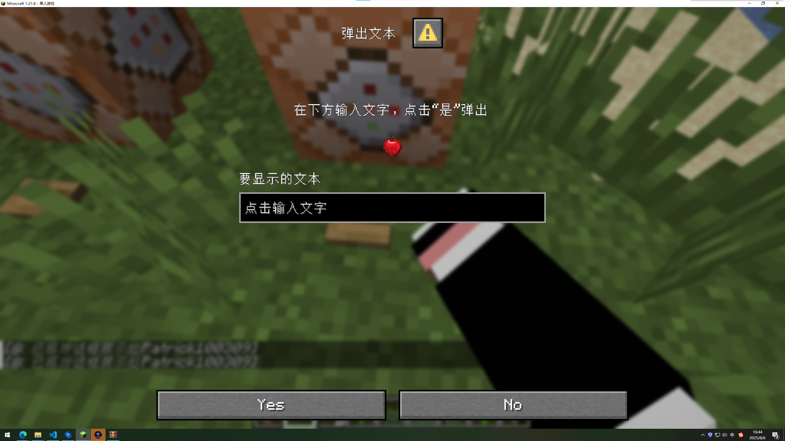
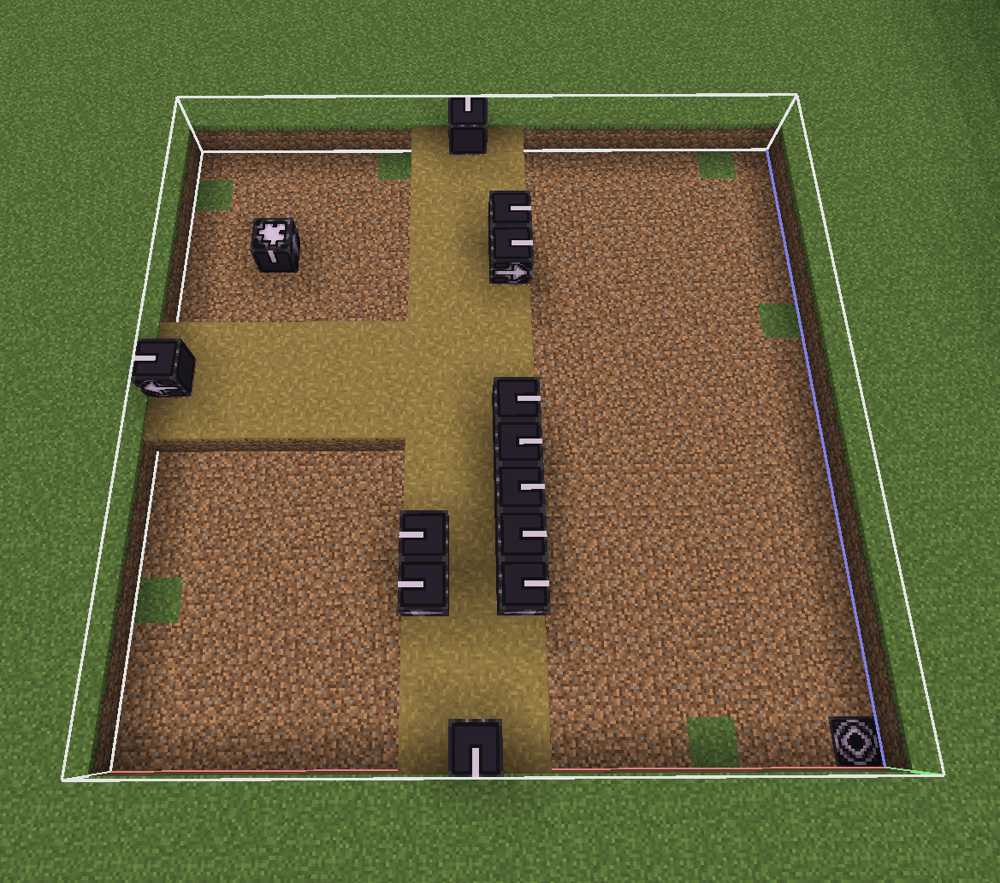

::: tip Translation notice
This page was translated with machine translation and may contain inaccuracies. If you can help improve it, please open an issue or submit a pull request.
:::


<FeatureHead
    title = "Patrick's data pack development novice guide"
    authorName = "Patrick"
    resourceLink = 'https://github.com/NessunoNessun0/TRPG_Plus'
    cover='../../../../../feature/archive/202508/_assets/3.png'
/>

## Start your data pack creation journey now!

*I was very excited to see the boss on site B making a vanilla mod, and I wanted to try it myself! So I opened VS Code...*

*...Wait, what should I do now? *

To solve this problem, this guide was born. It was written based on my creative experience. Whether you have just started creating data packs, are at a loss when it comes to creating a new data pack, or want to create but can't find inspiration, come and take a look! I will give you a brief introduction to how to get started with data pack in two chapters, tell you how to get inspiration and some mistakes I have made. I hope it can help you!

*This article is prepared for readers who have set up a development environment and have a basic understanding of how to create an empty data pack. [If you still don’t know how to do this...](https://zh.minecraft.wiki/w/Tutorial:%E5%88%B6%E4%BD%9C%E6%95%B0%E6%8D%AE%E5%8C%85"Go to wiki")*

### 1. Understand what data pack can do

In this chapter, I will recommend the order in which to start each section of a data pack based on complexity, and give you a basic introduction to them. Note that this section does not explain in detail how to make them. You need to use other materials to complete most of the content. This chapter is only for navigation purposes.

**This chapter only introduces the content in the data pack. If you want to know my advice on finding inspiration, you can go directly to the next chapter**

#### 1. Start with tags

Tag, as the name suggests, is a tool used to classify game elements. It can't do much on its own. However, its data structure is so simple that it is a great way for newcomers to become familiar with the JSON format. Now follow my lead and try to create your first tag.

Since this part is the reader's opening work, this section will explain it in detail.

Before we start, we need to think about a question: **If a world joins many different data packs, how can we ensure that the content created by different authors will not have name conflicts? **

A solution is easy to think of: we can add a unique identifier to each data pack, and then add the identifier of the data pack to which it belongs in front of the name of each content. In this way, as long as the identifiers of different data packs are different, there will be no conflict!

Congratulations on inventing a very practical tool - **namespace**

Now look at your empty data pack. If you created it correctly, there should be a data folder in it.

Create a new folder inside the data folder, its name is namespace.
::: tip Tip 1
There can be multiple namespaces below the data folder, but I don't recommend this. If you don't plan well, this will only make your data pack look messy.
:::
::: warning Important Tip 1
The folder names and file names inside the data pack are only allowed:

* `0123456789`number
* `abcdefghijklmnopqrstuvwxyz`lowercase letters
* `_`Underline
* `
- `Hyphen (minus sign)
* `/`forward slash (cannot be used in namespace)
* `.`Period (cannot be used in namespace)

:::
::: tip Tip 2
If two data packs have the same namespace and there happen to be file name collisions, the contents of the data pack with a higher priority will overwrite the contents of the data pack with a lower priority. You can adjust the priority in the data pack window when the world is created, or you can use [command/datapack]( after the world is createdhttps://zh.minecraft.wiki/w/%E5%91%BD%E4%BB%A4/datapack"What is this?") adjustment.

Using this, we can create extensions for the original data pack or cover the content of the vanilla data pack.
:::
After thinking about your namespace, create the following directory: *data/&lt;namespace&gt;/tags/item*

This directory is used to manage itemtags. Please create a new &lt;custom name&gt;.json in this directory and write the following content:

```json
{
  "values":[
    "minecraft:iron_ingot",
    "minecraft:gold_ingot"
  ]
}

```


::: warning Important Tip 2
The programming language you just wrote is called [JSON](https://zh.minecraft.wiki/w/JSON"What's this?").

If you are not familiar with JSON format, please click on the hyperlink above. Observe the code and look for grammatical features of JSON.
:::

In the example above, the content in the values ​​field is the content of the tag. They all belong to this tag. If you want, you can see the format above to add more items to this tag.

But having this tag alone is useless! Now let's make it useful!

Now create the file in your data pack: *data/minecraft/tags/item/arrows.json*

The function of this tag is to control which items can be fired by bows or crossbows. Let's try it now.

Enter the following into this file:

```json
{
  "values":[
    "minecraft:potato", //现在土豆可以被发射了
    "#<你的命名空间>:<你刚才写的标签的名字>"  //标签文件可以引用其他的标签，遵循#<命名空间>:<名称>格式。前方的“#”表示这是一个标签
  ]
}

```


Now load the data pack into your world. Open your world folder, drag the data pack into the datapacks directory, and reload world. If all goes well, the potato cannon should be ready to use. Try loading a potato or something else you define into the crossbow.

::: tip Tip 3
You can browse [this page](https://zh.minecraft.wiki/w/%E6%A0%87%E7%AD%BE#%E7%89%A9%E5%93%81) to learn how to define tags for other game elements and what vanilla tags are used for.
:::

::: tip Tip 4
[Chinese Minecraft Wiki](https://zh.minecraft.wiki/) is a very useful tool for creating data packs! All the basics about data pack can be found above. A good data pack developer should learn to use Wiki proficiently. The following chapters will not explain the development process to you in such detail, you must find the answer from the Wiki.

As you gain more experience, you can try to contribute to the Wiki. If you find something on the wiki that is wrong, don't hesitate to edit it!
:::

Interesting, right? Let's move on to the next section.

#### 2. Entry-level functions

Function is the first content in the data pack. In other words, the predecessor of data pack is function pack. A function is an encapsulated series of commands. Once the commands are written in the function, you can use your data pack to install your commands in any world. Also, functions can be easily modified. This is better than command block

Create the *data/&lt;namespace&gt;/function/&lt;give a name&gt;.mcfunction* file and open it using your VS Code. Then you can write the command internally. You can write a command on each line, and you can use double slashes "//" to make single-line comments.

::: warning Important Tip 3

The command in function cannot start with "/", just write it directly

:::

Just write a few commands in it, and put the written function into the world. You can use command/function or command/schedule to execute your function. Adding the function to #minecraft:loadtag will make it execute once when the data pack is loaded (reloading the world or using command/reload), and adding the function to #minecraft:ticktag will make it execute once every game tick.

Function has another dynamic way of writing, called macro function. This allows you to specify that certain parts of the function are mutable at runtime to make the execution more flexible. Adding "$" before a function line can turn a command line into a macro, example:

Contents in functionmypack:myfunction:

```mcfunction
$say $(msg)
```


Execute command:

```mcfunction
/function mypack:myfunction {msg:"Hello world!"}
```


Equivalent to:

```mcfunction
say Hello world!
```


Macro functions can also be executed using command storage as parameters. For related information, see [command/data](https://zh.minecraft.wiki/w/%E5%91%BD%E4%BB%A4/data) and [command storage data format](https://zh.minecraft.wiki/w/%E5%91%BD%E4%BB%A4%E5%AD%98%E5%82%A8%E5%AD%98%E5%82%A8%E6%A0%BC%E5%BC%8F)

Since the command itself is very complex, we cannot introduce too much here. Please use the Wiki or search for tutorials on Station B to learn more...

After you learn about some commands through the Wiki, you can check out other pages in the Vanilla Library to inspire you on how to use these commands together.

Before going to the next section, you must at least understand what a data component is, especially the item stack component. The item stacking component is the most commonly used way to control item behavior today. See also:

[Data Components - Chinese Minecraft Wiki](https://zh.minecraft.wiki/w/%E6%95%B0%E6%8D%AE%E7%BB%84%E4%BB%B6)\
[item stacking data format - Chinese Minecraft Wiki](https://zh.minecraft.wiki/w/%E7%89%A9%E5%93%81%E5%A0%86%E5%8F%A0%E6%95%B0%E6%8D%AE%E6%A0%BC%E5%BC%8F)

You may have noticed that some of the pages linked to above seem to be formatted very much like JSON. Yes, they are also used in some JSON files in the data pack, which also use JSON format. But you should note that command parsers rarely support JSON format. When you use them in commands, you often need to use another language: [SNBT format](https://zh.minecraft.wiki/w/SNBT%E6%A0%BC%E5%BC%8F)

Although it may not be necessary to study the next section, I highly recommend that you understand the following:

[Text Component - Chinese Minecraft Wiki](https://zh.minecraft.wiki/w/%E6%96%87%E6%9C%AC%E7%BB%84%E4%BB%B6)\
[entity data format - Chinese Minecraft Wiki](https://zh.minecraft.wiki/w/%E5%AE%9E%E4%BD%93%E6%95%B0%E6%8D%AE%E6%A0%BC%E5%BC%8F)\
[Target selector - Chinese Minecraft Wiki](https://zh.minecraft.wiki/w/%E7%9B%AE%E6%A0%87%E9%80%89%E6%8B%A9%E5%99%A8)

You can apply what you just learned through some commands:\

[command/give - Chinese Minecraft Wiki](https://zh.minecraft.wiki/w/%E5%91%BD%E4%BB%A4/give)\
[command/tellraw - Chinese Minecraft Wiki](https://zh.minecraft.wiki/w/%E5%91%BD%E4%BB%A4/tellraw)\
[command/summon - Chinese Minecraft Wiki](https://zh.minecraft.wiki/w/%E5%91%BD%E4%BB%A4/summon)

::: danger give it a try 1

It is very important to create another thing according to your own ideas after reading the teaching examples! Only by applying it yourself can you master what you have learned. Now try this:
Create a macro function so that it accepts one parameter "name". The effect of execution is to give the executor the head of a player named "name"
Tip: The default executor and other command contexts of each command in the function are the executor and command context of the function. See [command context - Chinese Minecraft Wiki](https://zh.minecraft.wiki/w/%E5%91%BD%E4%BB%A4%E4%B8%8A%E4%B8%8B%E6%96%87), when you execute command with /function, the executor of function is you!

:::
::: warning Important Tip 4

You must pay attention to which game version certain features are applicable to. There may be big differences between different game versions. Many contents in Vanilla Library are not applicable to the latest game version

:::

#### 3、recipe

Recipe is the most common way to obtain items in Minecraft besides the loot table. It is defined in a JSON file like tag. Defining a recipe is relatively simple. As a newbie, I highly recommend that you try to define a recipe first.

In this section, I'll use three examples to get you started.

First, let's make a workbench orderly recipe.

Mojang removed the recipe for enchanted golden apples a long time ago. Although we can still regenerate the enchanted golden apple through the treasure house, it is still very convenient if it can be obtained through the recipe. So let’s add this recipe back into Minecraft now!

Now create the following file: *data/&lt;namespace&gt;/recipe/enchanted_golden_apple.json*

After writing this, look at the comments to understand what the different fields do:

```json
{
  "type": "crafting_shaped",	//这个字段指明此配方的类型。crafting_shaped指明这是一个工作台中的有序配方
  "pattern": [	//现在使用不同的字符来表示不同的物品，然后像在工作台中放置物品一样放置这些字符。如果你想表达一个位置什么都不放，就使用空格。这里是一个3*3配方的示例，你也可以改成两行两列的格式。
    "ggg",
    "gag",
    "ggg"
  ],
  "key": {  //在这里解释刚才的字符“g”和“a”都是什么
    "g":"minecraft:gold_block", //这里表示“g”这个字符是金块
    "a":[ //你可以使用一个数组来指定多个物品。如果你这样做，这表示字符“a”这个格子可以放置下列物品中的一个。例如在这里，我允许玩家使用普通苹果或者金苹果来合成
    //你也可以引用一个标签，只需遵循这个格式：#<命名空间>:<ID> 但你要注意，数组和标签只能选择一个！
      "apple",
      "golden_apple"
    ]
  },
  "result": { //在这里指定物品的输出。如果你想让输出的物品带上物品组件，参见上文引用的“物品堆叠数据格式”页面
    "id": "minecraft:enchanted_golden_apple"
  },
  "category":"equipment"  //这个字段是可选的，表示配方的分类。在这里我将其归类为“装备”。大多数时候你可以不写
}

```


::: tip Tip 5

You can use command/recipe to give yourself the recipe and check whether the recipe can be read normally.

:::

After fully understanding the above example, try creating another recipe yourself.

::: danger give it a try 2

Try this recipe:
anvil anvil anvil
empty bamboo empty
empty bamboo empty
↓
Trident

:::

As a second example, let's try a type conversion recipe.

When upgrading diamond equipment to nether metal equipment, it will be very annoying if you never find the upgrade forging template. So let's design a workbench recipe so that a diamond sword can be upgraded to a netherite sword without a forging template, and then clear all anvil accumulated penalties! The price is - a netherite nugget is required.

```json
{
  "type":"crafting_transmute",  //表示这是一个类型转化配方
  "input":"diamond_sword",  //要转化的物品
  "material":"netherite_block", //转化消耗的物品
  "result":{
    "id":"netherite_sword", //要转化成什么物品
    "components":{
      "!minecraft:repair_cost":{} //这里自定义物品堆叠组件。前面的“!”表示我们要清除这一物品组件
    }
  }
}
```


Let’s try it now:

::: danger Try it 3

Try this recipe:
Original item: Iron Sword
Consumption: diamonds
Finished product: Diamond Sword
item stacking component: not modified

:::
::: danger Give it a try 4

Try this recipe:
Original item: iron block
Consumption: blue dye or lapis lazuli
Finished product: diamond block
item stacking component: not modified
Tip: Input or material fields can also use arrays to define multiple available items.

:::
::: tip do you know

The item conversion recipe was once called a transmutation recipe, and the name of the recipe has also experienced many "transmutation".

:::

Next, let’s get familiar with the smelting recipe.

As we all know, diamonds are formed from coal after a long period of high temperature and high pressure.

Although it is impossible in reality, in MC we can add a recipe that uses a blast furnace to burn coal blocks into diamonds!

```json

{
  "type": "blasting", //告诉游戏这是一个高炉配方
  "ingredient": "coal_block", //原材料是煤炭块
  "experience": 180,  //我们给超多的经验值！
  "cookingtime": 24000, //长时间高温，所以需要24000游戏刻才能烧好
  "result": {
  "id":"minecraft:diamond"  //给你钻石！
  }
}
```


::: danger Try it 5

Try this recipe:
Original item: sweet berries
block: melting pot (type: smelting)
Finished product: glowing berries
Refining time: 100 ticks
Experience value: 3

:::
For other recipe types, see: [recipe - Chinese Minecraft Wiki](https://zh.minecraft.wiki/w/%E9%85%8D%E6%96%B9#%E5%90%88%E6%88%90%E9%85%8D%E6%96%B9)

#### 4、loot table

The loot table is the main way for players to obtain items in Minecraft. Therefore, learning it is a very important part of the data pack learning process. Since readers already have a clear understanding of the JSON format when reading this, the following article will mainly focus on navigation and connecting various concepts together, and will not explain the file format in detail. Please refer to the Wiki for this. (It is recommended to compare reading with other contents in this section)

[loot table - Chinese Minecraft Wiki](https://zh.minecraft.wiki/w/%E6%88%98%E5%88%A9%E5%93%81%E8%A1%A8)

How do we describe a loot table...well...if you've ever played a draw game, you can think of it as a card pool. When the game uses a loot table, some items will be randomly selected from these card pools. Then maybe put these items in a chest, maybe use them as drops from mobs, maybe make them items that drop after you break the block... That's it!

The actual processing will take a few more steps than the above, such as determining whether an item can be drawn, and adding some modifications to the item, but generally these things are inseparable.

If you want to divide the loot table into one level, it might look like this:

loot table
↓
target pool
↓
Extract items

We want to explain a few concepts. First of all, not all draws or pools can be drawn. For example, when fishing, if the hook is not in [open water](https://zh.minecraft.wiki/w/%E9%92%93%E9%B1%BC#%E5%9E%83%E5%9C%BE%E4%B8%8E%E5%AE%9D%E8%97%8F), then you can't catch the treasure. In Minecraft we use [predicate](https://zh.minecraft.wiki/w/%E8%B0%93%E8%AF%8D%EF%BC%88%E6%B6%88%E6%AD%A7%E4%B9%89%EF%BC%89) to detect whether something can meet the conditions we set. Not only the loot table, but also predicate is used in many places in the data pack. You can also define some commonly used predicates into a file just like defining tags, and just quote them directly when using them. (Of course, it is also possible to write the file without defining it! This is the case most of the time) [command](https://zh.minecraft.wiki/w/%E5%91%BD%E4%BB%A4/execute) can also use predicate. In the loot table, you can add a predicate to a target pool to determine whether it can be extracted, or you can add

The second concept is [loot context](https://zh.minecraft.wiki/w/%E6%88%98%E5%88%A9%E5%93%81%E4%B8%8A%E4%B8%8B%E6%96%87), predicate needs to have a basis for judgment when making judgments. For example, when detecting the tools used by the player to mine blocks, the predicate must first know what tools the player uses. This tool is loot context. The context includes a lot, such as the player's location, the tools used, the details of the killed mob, etc. The loot context may be different on different occasions. For example, when the loot table is used to generate archaeological loot, the loot context of "killed entity" will not be given.

::: tip Tip 6

It is important to note that most predicates have special requirements for loot context. Please check whether the usage situation can provide the required loot context before using it.

:::

Next we want to talk about [item modifier](https://zh.minecraft.wiki/w/%E7%89%A9%E5%93%81%E4%BF%AE%E9%A5%B0%E5%99%A8). The item decorator is used to adjust the item to be generated. For example, modify the number of items, add enchantments to equipment, set custom names, etc. The item decorator itself can also set a predicate. If you want to use command to apply item decorators, see [command/item](https://zh.minecraft.wiki/w/%E5%91%BD%E4%BB%A4/item). The item decorator can be applied to a single extraction item, or it can be applied to a target pool (when you do this, everything in the target pool will have this item decorator applied), or you can even apply it to the entire loot table!

When the loot table is applied, the game will first eliminate items that will not be extracted (that is, they do not pass the predicate test). Empty pools with no content are then removed. The game draws from each target pool in turn. When extracting, first determine the number of draws in the target pool, and then weight the draw based on the weight of each draw item. Then apply all applicable item modifiers.

::: tip Tip 7

Extraction items are also divided into two types: single extraction items and compound extraction items. A compound extract contains several single extracts. A composite draw must first be expanded into several separate single draws before loot can be drawn. When expanded, the compound extraction will expand as part of the single extractions in its type picklist.

:::

Think about the connection between the above keywords, now check the Wiki and try to write your first loot table!

::: danger Give it a try 6

Try to modify the ancient city's loot table so that it will generate enchanted books with enchantments equivalent to level 70 of the enchantment table.
If you don’t know where to find the vanillaloot table and copy and paste it to modify it, please see the next section.

:::
::: danger give it a try 7

Make a loot table that is applied to chests so that they can produce a variety of foods.
You can use [command/loot](https://zh.minecraft.wiki/w/%E5%91%BD%E4%BB%A4/loot) to place the loot table into the world, or use [command/setblock](https://zh.minecraft.wiki/w/%E5%91%BD%E4%BB%A4/setblock) when setting [box data](https://zh.minecraft.wiki/w/%E7%AE%B1%E5%AD%90#%E6%96%B9%E5%9D%97%E5%AE%9E%E4%BD%93), or give yourself a block item and use [minecraft:block_entity_dataitem stacking component component](https://zh.minecraft.wiki/w/%E6%95%B0%E6%8D%AE%E7%BB%84%E4%BB%B6#block_entity_data) specifies the loot table used by the box

:::

#### 5. Refer to vanilladata pack

The vanilla data pack provides a large number of examples for you to refer to, so it is important to know where the vanilla data pack is.
The default vanilla game folder is *C:\users\user\AppData\Roaming\.minecraft*. **If your launcher does not use this path, please check your launcher settings**
Then open the versions directory and you will see the folders for each version. Click on a version of the data pack you want to view, and you will see a .jar file with the same name as the version. Right-click on it and open it using WinRAR or another archive viewer.

After opening it, you will see the data folder. This is the vanilla data pack.

#### 6、advancement

Advancement, as a rare mechanism in Minecraft that directly guides the player, is also an important part of the data pack. This section will briefly describe the use of advancement and give examples.

Advancement has the following four main uses:

* Used to guide player games
* give playerrecipe
* Set conditions to trigger functions
* Set conditions for playeritem

Refer to the Wiki for details: [advancement definition format - Chinese Minecraft Wiki](https://zh.minecraft.wiki/w/%E8%BF%9B%E5%BA%A6%E5%AE%9A%E4%B9%89%E6%A0%BC%E5%BC%8F?variant=zh)

Now let's look at an advancement of vanilla ("Diamond!", try to see if you can find it in the vanilla data pack):

```json
{
  "parent": "minecraft:story/iron_tools",       //定义上游进度
  "criteria": {                                 //这一字段用于定义准则。准则是玩家达成进度所需的条件
    "diamond": {                                //“diamond”是准则的名字
      "conditions": {                           //检查的内容，这一字段中的内容随着触发器的种类的改变不同
        "items": [                              //这一字段包含几个物品谓词，用于判断获得什么物品才能达成进度
          {
            "items": "minecraft:diamond"
          }
        ]
      },
      "trigger": "minecraft:inventory_changed"  //准则所适用的触发器。此触发器用于检查玩家背包的变化。当玩家背包有变化的时候触发一次。触发器在被触发的时候会进行条件检查，检查成功时准则才能成功取得
    }
  },
  "display": {                                  //进度的显示信息
    "description": {                            //进度的介绍，是一个文本组件
      "translate": "advancements.story.mine_diamond.description"
    },
    "icon": {                                   //一个物品，用于进度的图标
      "count": 1,
      "id": "minecraft:diamond"
    },
    "title": {                                  //进度的标题，是一个文本组件
      "translate": "advancements.story.mine_diamond.title"
    }
  },
  "requirements": [                             //一个准则数组的数组，一个准则数组中的准则达成任意一个则视为该准则数组已被达成。此字段内部的准则数组必须全部被达成
    [
      "diamond"
    ]
  ],
  "sends_telemetry_event": true                 //达成此进度以后是否发送遥测数据。用于Mojang统计玩家们完成进度的情况
}

```


Since it is not defined, you will not receive any rewards after completing this advancement. But you can actually define rewards for advancement completion. Just write the following fields under the root object of the JSON file:

<div class="nbttree">

<node type="compound" name="Reward" />root object, the rest of the advancement is omitted
- <node type="compound" name="reward" />Reward for achieving advancement
  - <node type="int" name="experience" /> (default is 0) The experience value the player will receive after completing the advancement
  - <node type="string" name="function" />Function executed after completing advancement, function tag is not supported. Equivalent to using /function directly
  - <node type="homolist" name="loot" />The loot table obtained by the player after completing the advancement
  - <node type="homolist" name="recipes" />Recipes unlocked by the player after completing the advancement

</div>

::: tip Tip 8

Each of these rewards has its own uses. Experience points are given to players in vanilla for completing goals and challenges. The reward for unlocking recipes is used by vanilla to implement the mechanism of "unlocking related recipes when you obtain an item". The remaining two are commonly used in data packs: obtaining functions allows data pack authors to use triggers in advancement to trigger functions. The loot table implements the function of adding special NBT to the output items of the recipe in a slightly older version.

:::

#### 7. Miscellaneous

Here is a list of some of the more fragmented content in the resource pack
If you know how to make a resource pack, you can try the following:

* [Flag Pattern](https://zh.minecraft.wiki/w/%E6%97%97%E5%B8%9C%E5%9B%BE%E6%A1%88%E5%AE%9A%E4%B9%89%E6%A0%BC%E5%BC%8F)
* mob variant
* [record player track](https://zh.minecraft.wiki/w/%E5%94%B1%E7%89%87%E6%9C%BA%E6%9B%B2%E7%9B%AE%E5%AE%9A%E4%B9%89%E6%A0%BC%E5%BC%8F?variant=zh)
* [Drawing variant](https://zh.minecraft.wiki/w/%E7%94%BB%E5%8F%98%E7%A7%8D%E5%AE%9A%E4%B9%89%E6%A0%BC%E5%BC%8F)
* [Armor Decoration](https://zh.minecraft.wiki/w/%E7%9B%94%E7%94%B2%E7%BA%B9%E9%A5%B0%E5%AE%9A%E4%B9%89%E6%A0%BC%E5%BC%8F)
* [Wolf sound effect variant](https://zh.minecraft.wiki/w/%E7%8B%BC%E9%9F%B3%E6%95%88%E5%8F%98%E7%A7%8D%E5%AE%9A%E4%B9%89%E6%A0%BC%E5%BC%8F)
The teaching content for making resource packs is mentioned in the library, or directly [Go to Wiki](https://zh.minecraft.wiki/w/%E8%B5%84%E6%BA%90%E5%8C%85)

Trial spawner data can be defined separately by data pack, which avoids modifying the structure when modifying its content: [Trial spawner configuration definition format - Chinese Minecraft Wiki](https://zh.minecraft.wiki/w/%E8%AF%95%E7%82%BC%E5%88%B7%E6%80%AA%E7%AC%BC%E9%85%8D%E7%BD%AE%E5%AE%9A%E4%B9%89%E6%A0%BC%E5%BC%8F)

#### 8、dialog

**It is recommended to read this section after having a deeper understanding of command**
At least, you need to know what [text component](https://zh.minecraft.wiki/w/%E6%96%87%E6%9C%AC%E7%BB%84%E4%BB%B6)

In 25w20a, Mojang added [dialog](https://zh.minecraft.wiki/w/%E5%AF%B9%E8%AF%9D%E6%A1%86%E5%AE%9A%E4%B9%89%E6%A0%BC%E5%BC%8F?variant=zh) this exciting update. It provides a new way for the data pack to interact with the player.

dialog can be replaced by [command/dialog](https://zh.minecraft.wiki/w/%E5%91%BD%E4%BB%A4/dialog) call. Or join`#pause_screen_additions`tag to display in the menu interface, or add it`#quick_actions`tag enables it to be invoked with the shortcut key G. When invoked, the dialog can display information to the player, and the player can enter information through input controls and use them to execute commands. This is the first time Mojang allows data pack authors to directly read string input, and provides a very simple way to interact with the player, which can be described as an epoch-making update.

This section will briefly introduce the various parts of the dialog.



Pop up the command of this dialog:
`/dialog show @p {body:[{type:"plain_message",contents:{"text":"在下方输入文字，点击“是”弹出"}},{type:"item",item:{id:"apple"}}],inputs:[{key:"text",type:"text",initial:"点击输入文字",label:{"text":"要显示的文本"}}],"title":{"text":"弹出文本"},no:{label:"No"},yes:{label:"Yes",action:{type:"dynamic/run_command",template:"dialog show @p {body:{type:\"plain_message\",contents:{\"text\":\"$(text)\"}},type:\"notice\",title:{\"text\":\"显示文本\"}}"}},type:"confirmation"}`

First take a look at the picture above.

The "pop-up text" at the top of the screen is called the "box header", which is the title of the dialog.
The title of the dialog can be customized.

Below the box header is the content. The content is divided into two parts: the main element and the input panel. And the input panel is below the main element
The body element is used to display messages to the player. The second line of text in the picture and the piece of apple are both main elements.

::: tip Tip 9

Resource pack can define item mapping. That is, the same item can have different textures. After adding item mapping through resource pack, add [item_model](https://zh.minecraft.wiki/w/%E6%95%B0%E6%8D%AE%E7%BB%84%E4%BB%B6#item_model) components specify mappings, and then use dialog to call them to achieve the effect of displaying pictures.

:::

The text box in the picture belongs to the input panel. The player can fill in information in the input panel. The input panel is composed of input controls, and different types of input controls can provide different information.

The bottom part is called the frame tail. The style of the box tail will change depending on the type of dialog. The action will be performed when the player clicks the button at the end of the box. (Sometimes some buttons on the input panel can also perform operations.) After the player performs the operation, the game will execute the command according to the content set by the data pack author. Most of the content input by the player from the input control will also affect the execution of the command.

::: tip Tip 10

When used as a data pack, input controls are often not very convenient to use in the server. This is because when a command is executed through dynamic operations, the command executed must be a command that can be executed by the player's permission level. And the executed command cannot require a signature. This means that the data pack author can basically only ask the player to execute [command/trigger](https://zh.minecraft.wiki/w/%E5%91%BD%E4%BB%A4/trigger). The only role the input controls play here is to modify them to fire different triggers and set them to different values. Text input controls are difficult to function.

From this point of view, the dialog in the data pack is more suitable for use in maps. In the server, we recommend using plug-ins. Mojang provides a custom click event, which allows plug-in authors to package the value of the input control and send it to the server, and then the server-side plug-in can use the event listener to receive it.

:::

In general, the method of using dialog is: the data pack author first displays information to the player through the main element. The player then inputs information through the input controls, and finally submits the operation through the operation button.

Now check the definition format given by Wiki and write a more practical data pack:

::: danger give it a try 8

Make a data pack. Pressing the G key will pop up an administrator panel. Several buttons are set up to jump to other panels that are convenient for administrators to manage the world.
Tip: It is recommended to use [command/dialog](https://zh.minecraft.wiki/w/%E5%91%BD%E4%BB%A4/dialog) implements the jump function to avoid non-administrator players from jumping.

Please have at least the following two panels:
1. Design a panel so that administrators can easily adjust the world's weather, time and some common game rules.
2. Design a panel so that the administrator can enter the namespace ID of the entity to obtain a corresponding [Trial Monster Spawner] (https://zh.minecraft.wiki/w/%E8%AF%95%E7%82%BC%E5%88%B7%E6%80%AA%E7%AC%BC). It is required that the difficulty of the normal trial and the ominous trial are different, and the administrator can specify the loot table that will be activated after the normal trial and the ominous trial are cleared.

:::

#### 9. Curse

This section will briefly describe to you what information can be used to define magic spells in the data pack, briefly explain the role of each field, and add content that is not available on the wiki.
First open the webpage and watch this tutorial: [Spell Definition Format - Chinese Minecraft Wiki](https://zh.minecraft.wiki/w/%E9%AD%94%E5%92%92%E5%AE%9A%E4%B9%89%E6%A0%BC%E5%BC%8F)

Let’s look at them one by one:

description field. is the name of the curse.

anvil_cost field. Determines the cost of merging enchantments into an anvil. The actual cost of merging an enchantment is the enchantment level multiplied by this field. It is worth noting that **merging spells in the book will get a half price discount**.

The max_level field determines the maximum level of the enchantment.

The weight field determines whether the enchantment is on the enchantment table or in use.

The chance of selecting this enchantment when using the enchant_with_levelsitem modifier.

min_cost and max_cost determine the range of modified enchantment levels required for a certain level of this enchantment when selected by the enchantment table or enchant_with_levelsitem modifier.

::: tip Tip 11

You can view [Enchanting (item modification)
- Chinese Minecraft Wiki](https://zh.minecraft.wiki/w/%E9%99%84%E9%AD%94%EF%BC%88%E7%89%A9%E5%93%81%E4%BF%AE%E9%A5%B0%EF%BC%89#%E4%BF%AE%E6%AD%A3%E9%99%84%E9%AD%94%E7%AD%89%E7%BA%A7) page to know what the modified enchantment level is, and the range corresponding to different items and different enchantment table levels.

:::

The supported_items field defines the items supported by this enchantment. Only supported items and books can be enchanted with an anvil.

The primary_items field defines the items that can be added to this enchantment through the enchantment mechanism. It defaults to the same as the supported_items field and must be a subset of it.

::: tip Tip 12

There are examples in vanilla where the primary_items field does not contain all the contents of supported_items. For example, sharpness can be enchanted on an ax through an anvil but cannot be attached to an ax through an enchantment table.

:::

slots determines the slot in which the spell takes effect. Most enchantment effects will check whether the item with this enchantment is in the effective slot

exclusive_set determines which spells the spell is exclusive of

The effects field is the most important. It defines the behavior of a spell.

##### Enchantment Effect Components and Enchantment Effects

There are many types of enchantment effect components and enchantment effects. Here is a brief introduction to them, see Wiki for specific formats.

The enchantment effect component determines when the enchantment effect is applied, and the enchantment effect will handle specific situations.

When certain events in the world trigger the enchantment effect component, it will apply the contained enchantment effects in sequence. Some enchantment effect components allow enchantment effects to be individually set with conditions to limit their application. Some enchantment effect components will be "targeted", meaning that the data pack author can choose whether the enchantment effect should be applied to the attacker or the attacked, or whether the owner of the enchantment should be the attacker or the attacked. (For example, the thorns enchantment should be held by the attacked person, and the damage-causing effect should be applied to the attacker)

::: tip Tip 13

Pay attention to the distinction between "enchantment effect" and "enchantment effect component". Let me emphasize it again:
The enchantment effect is something that affects specific behaviors, and the latter determines the scenario in which the enchantment effect is triggered.

:::

Value effect type: This type of **magic effect component** will only affect the **specific behavior value** of the item. For example, the time it takes to cock a crossbow. This type of enchantment component supports value-based enchantments. **Value effects and magic effects** are magic effects used to modify numerical values. They accept a numerical value and output it after calculation. A value-based enchantment component contains one or more value-based enchantments. When applied, the enchantment component inputs an initial value and applies the enchantments in order.

Entity effect type: This type of magic effect component contains several entity magic effects. When the conditions are met, the magic effect component will call the **entity effect**. Entity effects are diverse and often have a special impact on the game

::: tip Tip 14

You can use the run_functionality effect component to call functions to make the behavior of the spell more customizable.

It is recommended to check the Wiki. Maybe you can find inspiration from these spell effect components and spell effects provided by Mojang.

:::

There are also a few simpler but also interesting components:

Attribute-type effect components and attribute-type magic effects will simply add [attribute modifier](https://zh.minecraft.wiki/w/%E5%B1%9E%E6%80%A7#%E4%BF%AE%E9%A5%B0%E7%AC%A6)。

Position-dependent effect components are triggered when the player's position changes, and support attribute effects and entity effects.

Unit components are used in the curse of vanilla.

The sound component sets the sound of trident and crossbow loading. If you can make resource packs, you can use them to design some ~~ghostly~~ interesting things.

Try designing a spell:
::: danger give it a try 9

Design a decapitation enchantment that supports swords and can be obtained from the enchantment table. When the enemy's health is less than 10% of its maximum health x the spell level, the enemy will be killed directly and his head will drop.

:::
::: warning Important Tip 5

Please devise ways to obtain your spells! Setting the supported_items and primary_items fields does not mean that this enchantment can be obtained in the enchantment table! It is necessary for you to check [magic tag](https://zh.minecraft.wiki/w/%E6%A0%87%E7%AD%BE#%E9%AD%94%E5%92%92)page!

Whether an enchantment can appear in trade, whether it can be obtained on an enchantment table, whether it can be generated in most default structures, and whether it can appear on natural equipment worn by mobs are all controlled by the enchantment tag.

* If you put the enchantment in a non_treasuretag, it is a non-treasure enchantment. Enchantment tags that control general acquisition methods (such as trading, loot, etc.) all contain it, so there is no need to set it repeatedly.

* Enchantments not placed in on_random_loot will not appear in loot chests, but this is not hard-coded (i.e. it does not mean that you must not put enchantments that are not in this tag into loot chests). It's just because the item modifiers of most enchanted equipment in the loot table of the box in the official structure refer to this tag. However, your own loot table still does not need to reference this tag, and you can still set unique enchantments on special extraction items. (For example, vanilla's swift stealth is not in on_random_loot, but there is a special enchanted book with this spell in the chest of the ancient city)

* A spell that appears in double_trade_pricetag does not necessarily appear in a trade. It's just that if it shows up, the price will double

* Don't be limited to the vanilla ways of obtaining spells, you can design some special ways of your own.
:::

Regarding magic spells, I have a work for your reference, please see [Attachment 1](/feature/archive/202508/_assets/附件一.zip) (data pack) and [Appendix 2](/feature/archive/202508/_assets/附件二.zip)（resource pack）

#### 10. Customize world generation

Since 1.16, the data pack can customize many contents in the world generation, and there are more and more customizable parts. In this section, we will introduce you to the general steps of world generation and the connections between various elements. Please click on the hyperlink to learn how to define each element.

*Since world generation itself is too complex, this section only explains its principles*

##### [world generation](https://zh.minecraft.wiki/w/%E4%B8%96%E7%95%8C%E7%94%9F%E6%88%90) general steps

First, world will first be based on [world default](https://zh.minecraft.wiki/w/%E4%B8%96%E7%95%8C%E9%A2%84%E8%AE%BE%E5%AE%9A%E4%B9%89%E6%A0%BC%E5%BC%8F) to determine the [dimension](https://zh.minecraft.wiki/w/%E7%BB%B4%E5%BA%A6%E5%AE%9A%E4%B9%89%E6%A0%BC%E5%BC%8F). The dimension definition format needs to define [dimension type](https://zh.minecraft.wiki/w/%E7%BB%B4%E5%BA%A6%E7%B1%BB%E5%9E%8B) to determine the effects in the dimension other than world generation (dimension type has nothing to do with world generation and only affects the game running after world generation. It is placed here only for convenience).

When generating a chunk, the first step is to call [structure set](https://zh.minecraft.wiki/w/%E7%BB%93%E6%9E%84%E9%9B%86)(The structure set just defines [structure](https://zh.minecraft.wiki/w/%E7%BB%93%E6%9E%84%E5%AE%9A%E4%B9%89%E6%A0%BC%E5%BC%8F) should be placed. The structure itself should be defined separately) to calculate whether there is a structure that can be placed in this chunk. The game will then detect whether the structures in nearby chunks have parts that can be generated in this chunk.

In the second step, the game will pass [Noise Settings](https://zh.minecraft.wiki/w/%E5%99%AA%E5%A3%B0%E8%AE%BE%E7%BD%AE) that relates to the mob biome calculates the temperature, humidity, continentality, erosion, depth, and singularity of each location in the chunk. And determine [mob group](https://zh.minecraft.wiki/w/%E7%94%9F%E7%89%A9%E7%BE%A4%E7%B3%BB%E5%AE%9A%E4%B9%89%E6%A0%BC%E5%BC%8F) distribution.

::: tip Tip 15

In order to save computing power, the game will not calculate the exact mob cluster for each block, but will calculate the mob cluster unit in groups of several blocks. Usually 4×4×4 size.

:::

In the third step, the game uses noise settings to calculate where should be filled with solids and where should be aquifers. Surface rules will start to apply (surface rules are defined by the noise settings)

In the fourth step, the game will apply the terrain [Sculptor](https://zh.minecraft.wiki/w/%E9%9B%95%E5%88%BB%E5%99%A8%E5%AE%9A%E4%B9%89%E6%A0%BC%E5%BC%8F) began carving canyons and caves. As new air comes in, some of the aquifer and surface rules are applied again. The carver itself is referenced by the mob biome file.

In the fifth step, the game will officially start placing structures and objects. The features will be based on the mob biome and [placed features](https://zh.minecraft.wiki/w/%E5%B7%B2%E6%94%BE%E7%BD%AE%E7%9A%84%E5%9C%B0%E7%89%A9) file determines where the figure should be placed. Placed feature files are only responsible for referencing [surface feature configuration](https://zh.minecraft.wiki/w/%E5%B7%B2%E9%85%8D%E7%BD%AE%E7%9A%84%E5%9C%B0%E7%89%A9). The surface object itself requires additional configuration of the configured surface object file. After this, [heightmap](https://zh.minecraft.wiki/w/%E9%AB%98%E5%BA%A6%E5%9B%BE) is also released

In the sixth step, the game will calculate the lighting information and then generate the initial mob based on the lighting.

In the last step, the game will place the chunk into the world and update the block. Chunk generation is completed.

Next, I will take a puzzle structure as an example to show you the process of making the structure.

##### Make a puzzle structure

In Minecraft, there is a block that you may have heard of but most likely never used. It is [puzzle block](https://zh.minecraft.wiki/w/%E6%8B%BC%E5%9B%BE%E6%96%B9%E5%9D%97)! This section will introduce using it to create puzzle structures.

First we need to understand what the puzzle structure is. We saw many structures, such as abandoned nether portals and jungle temples. Their generation is very fixed. Either the structure looks the same throughout the world, or one is chosen from several templates. But the puzzle structure is not. A puzzle structure is divided into many small structures, and each small structure is put together piece by piece like a puzzle. Since these small structures are randomly selected when splicing, and the splicing is also relatively random, this results in each puzzle structure having a very different and excellent effect! For example, a vanilla village. A vanilla village starts from the village's meeting point (the meeting point is also randomly selected) and extends to several roads. There are random houses, street lights and decorations beside the roads. At the end of the road, a new road extends... put it together like this!

The puzzle block is equivalent to the "teeth and interface" on the puzzle. When the game wants to select another puzzle piece from one puzzle (that is, the small structure), it first selects a puzzle block in the original puzzle (usually on the edge of the structure). Then according to the settings of the puzzle block, the required [target pool] is retrieved from the data pack (https://zh.minecraft.wiki/w/%E7%BB%93%E6%9E%84%E6%B1%A0). Draw a small structure from the specified target pool, and check whether there is a puzzle block that meets the requirements in the specified small structure (the name of the target puzzle block must be the same as the target name of the original puzzle block). If the detection is successful, the splicing will be smooth~

Now, as a simple production experience, please build at least 1 small structure at will, and place a number of puzzle blocks on the edge of the side of the structure (pointing to the outside of the structure, it is recommended to place 2~3), and set the same name, target name and [target pool] for each puzzle block (https://zh.minecraft.wiki/w/%E7%BB%93%E6%9E%84%E6%B1%A0). Then use [structure block](https://zh.minecraft.wiki/w/%E7%BB%93%E6%9E%84%E6%96%B9%E5%9D%97) save and put them into the [structure pool] you defined (https://zh.minecraft.wiki/w/%E7%BB%93%E6%9E%84%E6%B1%A0) (defined with data pack). Finally put it into world and use [command/place](https://zh.minecraft.wiki/w/%E5%91%BD%E4%BB%A4/place) to see the effect.

If the production is successful, you must have been shocked by its powerful functions. But it was just a simple attempt. If you want to make it a little more layered, try the following:

* Put different types of structures into different structure pools: You can use different structure pools to classify structures. For example, if you want to build a village, you can put houses and roads into different structure pools. Then select the target pool when placing the puzzle block. This way you can place houses where you want houses and extend roads where you want them.

* When you just placed the puzzle blocks, the puzzle blocks should all point outside of each puzzle piece. Now you can try building a larger structure and point the puzzle blocks towards the inside of the structure. This way the following structure will be generated inside its parent structure. This method is often used to generate decorations within structures. It should be noted that if you use this method, the subsequent structures generated by the puzzle block must be inside this large structure.

::: tip Tip 16

Sometimes you may want to save a structure that is irregular in shape. For example, when you are building roads in a village. The road may have turns and forks. However, when the structure block saves the structure, it can only save the cuboid structure. If you save it with unnecessary air, the structure will also generate air when it is generated. Those extra air will replace the original block of the world, which is very unsightly, as shown below:

If you want to avoid this situation it's easy. Structural voids can be placed within structures. When saving a structure, structure gaps are not saved. When generating a structure, the original blocks in the gaps in the structure will not be replaced. This makes the generated effects reasonable.
If your need to place structure vacancies is relatively simple, you can use it when defining the structure pool.`legacy_single_pool_element`Structure pool element type. It will prevent all air in the structure from being generated, so you don't have to manually place the structure openings one by one.

Now that we're talking about roads, let's talk about the special settings dedicated to roads. It has been observed that the roads in the vanilla villages rise and fall with the terrain. in use`single_pool_element`and`legacy_single_pool_element`structure pool element type, you can put`projection`The field is set to`terrain_matching`. In this way, the structural template will change with the changes in the terrain when it is generated.

I would like to add an additional reminder that if you apply both techniques mentioned above in this tip, then you need to avoid placing puzzle blocks in the air. Put something underneath. Otherwise, when the structure changes with the terrain, since there is a structural gap under the puzzle block, the game will directly move the puzzle block down to the bottom of the structure, so that the generated structure will be lower than you think.

:::
::: tip Tip 17

If you place some unusual blockentities in your structure, be sure to pay attention to their characteristics!

Take the treasure house as an example. Its blockentity data contains a timestamp recording the time when the status was updated. This means that if you save it in a world that you have played for a long time, the timestamp recorded will be very far back. When you load structures in a new world, you have to wait a long time for the vault to be updated, and you cannot use the vault until then.

The solution is to use command/tick to freeze the game before placing the treasure chest in the structure, then place the treasure chest and save the structure so that the timestamp is not recorded in the treasure chest.

:::

Regarding the puzzle structure, I also have a work for your reference. Please see [Annex 3](/feature/archive/202508/_assets/附件三.zip). You can use command`/locate structure patricks_structure:pillager_camp`to find this structure.

##### Constant debugging

Let’s talk about other parts of world generation. Since the content of this paragraph is too complicated and the description on the Wiki is relatively clear, it will not be explained in detail here.

If you want to create this content, please read the "Steps of world generation" section above carefully to clarify which JSON files you need to define and the connections between them. (Especially links that reference each other!)

The other content is relatively easy to understand. Here are some tips for noise settings.

* If you really don’t understand the specific behavior of a field that uses the density function, you can try the following:
  * imitate vanilladata pack
  * Directly use the value of a noise function without any other processing (the best effect, this is the case for many fields in vanilla)
  * Mix and match the density function at will and see what happens (many times the content is very interesting, you can use it to your advantage)
* It is recommended to spend some time debugging the final density, because it determines the final terrain of this dimension.
* Pre-treatment surface heights tend to be lower than final density, so think about this when setting up
* Continuous debugging, no one can write the best density function right away, not even Mojang!

#### 11. I know you don’t want to do it...but...

Now let’s go back to the starting point of the article…

When you first met data pack, you probably learned about it through other people's works.

By now, you must have seen the works of many big guys.

But there are many amazing features that cannot be achieved simply by relying on the data-driven JSON files provided by Mojang. These JSON files are very inflexible. Because they are specifically designed by Mojang to implement certain game behaviors.

However, if you want your data pack to be a bit new (and well-intentioned), you have to create something very special, just like the big guys...

**How ​​did they do it? **

Well, obviously you who have read this far know the answer.

Only **function** can "flexibly" customize the behavior of the game...

I put that in quotes because it's just a little more flexible than the rest of the data pack. Compared with other high-level computer languages, function not only lacks many practical functions in code logic, but also...is very poor in terms of readability.

This makes writing some large projects using functions a very annoying job. Because its syntax really lacks prompts and readability, when a novice is writing some unfamiliar commands, checking the Wiki may consume most of his time.

Not only that, writing functions to implement some functions, especially those related to **visual effects** can really show how boring they are. If you want to make good-looking visual effects, you may have to reuse many entities with complex data, or spend a lot of time (**really a lot**) debugging particle effects and the like...

Let's give two examples. If you want to make a custom block, then you have to:

1. Change the texture of the item display box to the texture of the block you need
2. Use advancement to detect player placement of item display box
3. Place an **entity** at the target location to represent the block (you have to work hard on modifying textures and collisions)
4. The annoying thing is that for some blocks you have to check the orientation...

If you are not good at making resource packs, you may have to use item display entities to spell out what you want piece by piece...

You may have seen some big guys on the Internet making some cool utility panels using item display entities and interactive entities, but do you know how to do this?

**You must set unique data for these entities one by one**, such as setting reasonable orientations and interaction behaviors for them. Some data packs set up reminders that will zoom in when the player's pointer points to certain elements in the panel. So you still have to detect where the player is pointing... Although in many cases you can copy and paste the code, it often takes a lot of effort when you set the first element.

Wow, this stuff sounds like a lot of trouble...

**I know you don't want to do it, but...**

**If you want your data pack to be different, you often can't avoid doing these things**

Each unique data pack requires the author to spend a lot of effort to create. If you also want to create a rich data pack, you can't avoid these tedious tasks.

However, I still have suggestions for you...

::: tip Tip 18

Before you start production, if you want to improve the readability of the code and reduce the complexity, you can think about and find out what code can be reused, or whether you can make a reasonable architecture to optimize the code structure. You can write some auxiliary functions to help you develop before you officially start production.

For example, vanilla command/schedule cannot specify the executor of the command, which is very difficult to use, especially when you want to create skills with many stages for BOSS or players. For this purpose, you can first write a function that allows you to register the executor, execution command and delay time into the command storage in advance, and use a function that is executed every moment to traverse the registered content in order to execute the registered command.

For another example, when there are many similar elements in your data pack, you only need to record the different parts of each element, and then use macro functions or other methods to execute code with the same logic.

For another example, if you want other data pack authors to easily create extensions for your data pack (or you want to be able to easily add things to your data pack later), you must allow your code to be written "dynamically". That is to say, you cannot write the code too "deadly". PVZ guidance version is very popular recently, we will use "MC guidance version" as an example. When making such a data pack, you can add "guidance events" to the code in the form of "registration". For example, you can write a macro function for registration, so that you or the person who writes extensions for your data pack only need to call your registration function and enter some necessary data. For example, the introduction of this event, the function called when the event is triggered, the function called when judging whether the event can be triggered, etc... If you really want to "use the function as a predicate", you can add command/return to your function to return whether the function execution is successful, and then use the if function command in /execute to detect whether the function runs successfully.

:::
::: danger Try it 10

Create the "upgraded command/schedule" mentioned in tip 18.

:::

### 2. Ideas and brainstorming

Maybe you sometimes run out of imagination, or want to do something innovative but don’t know where to get it? Or do you sometimes miss something worth discovering? This chapter will tell you some of my favorite ways to find inspiration!

#### 1. Find inspiration from other works

You can find inspiration in other people's work. This is not plagiarism. Sometimes it can be more effective to look for inspiration from other works. For example, look for parts from other video games or MC mini-games that can be transplanted into MC as data packs. Or take a piece of a data pack created by someone else and build on it with considerable **innovation**. If you want to transplant someone else's idea, it's best to optimize it on the original basis. If you want to take someone else's code, you must get their permission, otherwise it won't help the community and will encourage plagiarism. If you are porting from other mods or other games, pay attention to whether the ported content is as interesting as the original work.

#### 2. Find inspiration from reality

Finding inspiration from reality is relatively difficult. But the results are usually very gratifying. This is because players are usually very familiar with real life, and things that are good in real life will seem reasonable when put into MC. See what content is worth moving to MC in reality!

#### 3. Take advantage of children’s instincts

Play is a child's nature, and imagination is also a child's nature. You can observe the behavior of children around you or the games they play. Children's world is far more imaginative than ours!

For example: I watched a group of children play a game of "ghost catches people", but the "ghosts" were blindfolded and could only identify their location by hearing sounds; the "people" couldn't run too far. Based on this, I adapted it into the mini-game "Xunshengjian"

#### 4. “Don’t worry about messing up the picture, you are the author and you can do whatever you want!”

**The title comes from the TV show "The Art of Making"*
In fact, sometimes you don't have to worry about the actual effect being produced not as expected. Some "unexpected" performance effects are even eye-catching! When the program you wrote can run but does not achieve the effect you want, you can first think about whether the current version can also be added as a feature to your data pack!

For example, when I was working on the data pack for Get Up War, the fireball I created could not fly forward automatically after I right-clicked on it. I had to hit it with my fist first... I realized that this could be used as a new item! So a special item - **Manual Turret** was born!

Don't worry about messing up the program! You are the author and you have the final say on what it is!

#### 5. Try telling stories

Think of MC as your narrative tool. When you really can’t think of what to make into a data pack and put it into MC, you can try telling stories with data packs. You can create your own adventure stories and then use your data pack skills to implement them (as a stand-alone dimension or a map). Although it's usually a lot of work to do so, it's still very popular. And most of the time people who play will not care too much about your plot.

#### 6. Search the Internet for inspiration

Unfortunately, that's what you're doing. I'm sorry that the above method didn't help you. But I believe that as long as you maintain your passion for creation, you will eventually be able to create great works!

