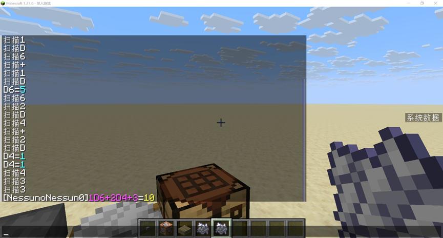

<FeatureHead
    title = "Custom instruction to rename item based on anvil"
    authorName = "no one_no one_"
    resourceLink = 'https://github.com/NessunoNessun0/TRPG_Plus'/>


When using Minecraft to simulate the gameplay of board games, whether it is a module or a data pack, it is inevitable that the game operations related to dice rolling will be very troublesome. Whether it is taking the corresponding number of corresponding dice, adding calculations and comparisons. Performing this sequence of operations in the game is often more time-consuming than rolling the dice in real life. This will greatly consume the player's enthusiasm for the game. Therefore, the need for convenient dice rolling was created.

This article is inspired by the team-running dice-throwing robot. Through vanilla functions such as function macros, command storage, and splicing strings, we have created a data pack that uses an anvil to rename an item and run instructions based on the custom name of the item (spell check is not included).

For the dice rolling scenario, the input is a polynomial with an uncertain number of terms. There may be two operations: nDm (how many dice are rolled) or c (constant), and each term is connected with a plus sign. So the design idea is to scan each character and check the delimiter`+`, you can intercept an item

Example:$$
    _01_1D_26_3+_42_5D_64_7+_83_9
$$When scanning to (3,4) it is "+", then (0,3) is a monomial "1D6". In the same way, the function continues to run, (7, 8) is "+", then (4, 7) is a monomial

When the scan is completed, the "+" no longer appears. It can be considered that (7,8) is the last "+", then (8,-1) is a monomial

For each monomial, there are two possibilities: nDm or c. There is a delimiter D in nDm, and c is a purely numeric string. Then scan each character in the monomial in turn. If there is "D", it is a dice operation, if not, it is considered to be a pure number. When scanning to "D", as shown in the example:$$
_01_1D_26_3
$$(1,2) is "D", then (0,1) can be considered to be n and (2,-1) to be m. Convert n, m into scoreboard scores for calculation.

<figure>

<figcaption style="font-size:12px;color:#666;text-align:center;">Uncomment the debugging line and you can see the scanning and calculation process</figcaption> </figure>

For skill test scenarios under brp rules. You need to roll D100 first, and then compare it with the skill value, 1/2 skill value, and 1/5 skill value. Two variables need to be entered, skill and value. The solution here is to scan the delimiter`|`. The process is as shown above. No more details.

The purpose of this article is to start a discussion. Provide a solution that can be used in life (especially without administrator rights) when complex information input is required. Compared with the solution of entering trigger commands in the chat bar, it is simpler (especially when the variables are complex) and immersive. I hope that all the experts can come up with a more versatile, simpler and more complete solution in the future.

This data pack has been open sourced on GitHub for everyone to learn and communicate. The functions mentioned in the text are under rollnamespace.

::: warning Editor's note
If you want to experience this feature of this data pack, you can use the following command:

```mcfunction
give @s minecraft:bone_meal[minecraft:consumable={consume_seconds:1},minecraft:custom_data={roll:{type:"free"}}]
```
where type can be`free`,`brp`or`fate`. Rename the bone meal according to the rules, then right-click to consume it to see the effect.
:::