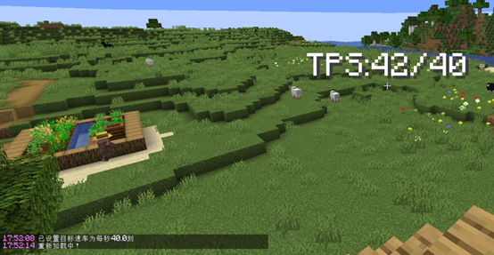
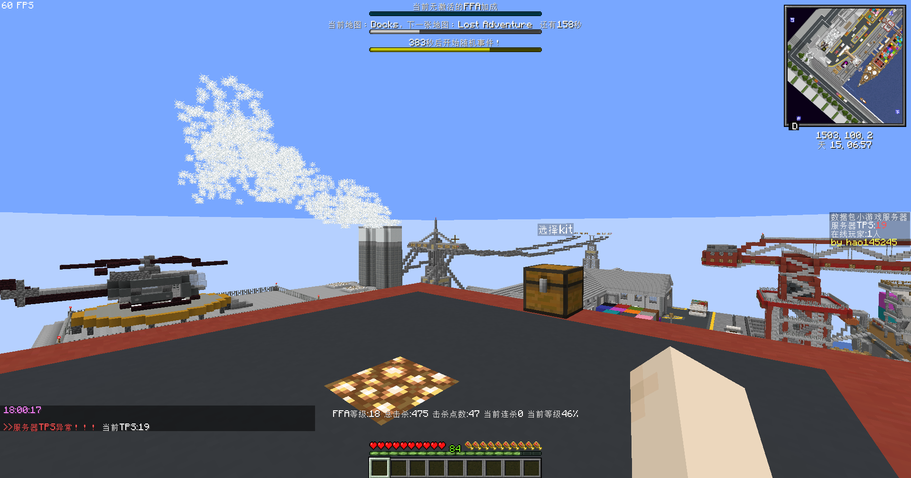
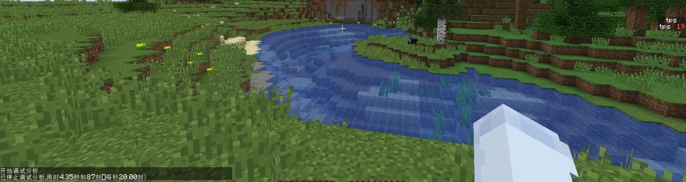

<FeatureHead
    title = "[1. 14. 4+] TPS detection"
    authorName = "hao145245"
    cover = '../../../../../feature/archive/202508/_assets/6.png'
/>

> I found it on wiki on August 6th. I searched it on site B, planetminecraft and modrinth and found that no one had done it, so I recorded it.

## Principle[^1]

Added in Java version 1.3.1 (12w27a)`/debug stop`command passed`/execute store result ...`The output obtained is the average TPS over the entire analysis.`/debug start`A new session of the analyzer will be started, and the session can be accessed via`/debug stop`command ends

Therefore we can use`/schedule`[^2] is`/execute store result ... run debug stop`Create a per`20tick`Execute once plan to detect TPS

After testing, the above interval is lower than`15tick`It will not be detected (the error is very large),`20tick`Can balance speed and accuracy

## version limit

### Permission level

why is`1.14.4+`Woolen cloth? because`1.14.4-pre4`Just now`server.properties`joined in`function-permission-level`, used to control the permission level possessed by the function. [^3]

And`/debug`The permission level required by command is`3`, the default permission level of function is`2`[^4], resulting in less than`1.14.4-pre4`The version cannot be run through the function`/debug`。

### schedule

`1.15(19w38a)`for`/schedule`Joined`replace`Parameter [^5], if the function of the previous version plan is not overwritten, I don’t know if there will be any problems.

> I just found out when I wrote this`replace`It is the default. I don’t know if the version before this is also the default.

### tick`1.20.3(23w43a)`added`/tick`[^6], can be used when data pack is running`/execute store result ...`get`/tick query`The output gets the target TPS[^7], which can be detected if the server changes the target TPS.

### Singular and plural`1.21(24w21a)`Bundle`functions`Rename to`function`. [^8]

## Sample data pack

[here](https://github.com/hao145245/TPS-Detection) is an example TPS detection data pack, which will be`title`Display current TPS and target TPS in the form, support`1.14.4+`.

### Code

This is`1.21+`code

```mcfunction
# load.mcfunction

scoreboard objectives add tps_detection dummy

#1.20.3+
execute store result score target_tps tps_detection run tick query
#1.20.3-
#scoreboard players set target_tps tps_detection 20

#1.15+
schedule function tps-detection:update_tps 20 replace
#1.15- 1.14.4+
#schedule function tps-detection:update_tps 20

debug start
```


```mcfunction
# update_tps.mcfunction

#1.15+
schedule function tps-detection:update_tps 20 replace
#1.15- 1.14.4+
#schedule function tps-detection:update_tps 20

execute store result score tps tps_detection run debug stop

#display
title @a title ["TPS:",{"score":{"name":"tps","objective":"tps_detection"}},"/",{"score":{"name":"target_tps","objective":"tps_detection"}}]


debug start
```
### Demo

#### 1.14.4


#### 1.21.8



## Actual combat



## written at the back

The idea of data pack detecting TPS is`1.20.3`Add to`/tick`Sometimes there are. At that time, I thought I could pass directly`/tick query`The output gets TPS, and even wants to get mspt, but its output is the target TPS...

At that time, I was still thinking of getting it from the output of the command block, but`/tick`The required permission level is`3`, totally not possible.

Then I thought of a way,`/schedule`There is waiting time`s`This unit is thought to be real time, but the game will convert it to`tick`Discover`/debug`I thought I could detect TPS with the data pack version, but it didn't work because of the permission level mentioned above.

However, the player can still manually obtain TPS (as shown below)



[^1]: See [command/debug - Chinese Minecraft Wiki](https://zh.minecraft.wiki/w/%E5%91%BD%E4%BB%A4/debug)

[^2]: See [command/schedule - Chinese Minecraft Wiki](https://zh.minecraft.wiki/w/%E5%91%BD%E4%BB%A4/schedule)

[^3]: See [Java Edition 1.14.4-pre4 - Chinese Minecraft Wiki](https://zh.minecraft.wiki/w/Java%E7%89%881.14.4-pre4)

[^4]: See [Permission Level - Chinese Minecraft Wiki](https://zh.minecraft.wiki/w/%E6%9D%83%E9%99%90%E7%AD%89%E7%BA%A7#Java%E7%89%88_2)

[^5]: See [19w38a - Chinese Minecraft Wiki](https://zh.minecraft.wiki/w/19w38a)

[^6]: See [23w43a - Chinese Minecraft Wiki](https://zh.minecraft.wiki/w/23w43a)

[^7]: See [command/tick - Chinese Minecraft Wiki](https://zh.minecraft.wiki/w/%E5%91%BD%E4%BB%A4/tick)

[^8]: See [24w21a - Chinese Minecraft Wiki](https://zh.minecraft.wiki/w/24w21a)
