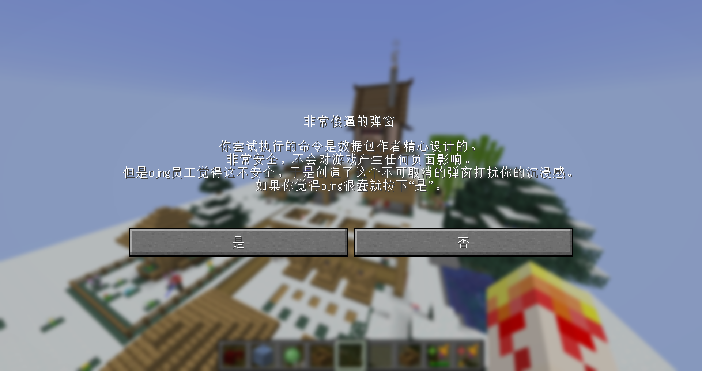
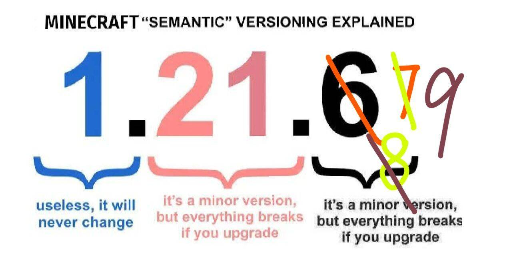

::: tip Translation notice
This page was translated with machine translation and may contain inaccuracies. If you can help improve it, please open an issue or submit a pull request.
:::

<script setup>
import { useData } from 'vitepress'
import ColorLine from '/.vitepress/vue/ColorLine.vue'
const { isDark } = useData()
</script>

# Second cover
<ColorLine :height="4"/>

::: warning You have entered a secret page!
Just kidding.
During the update process of Vanilla Library, we found that there is no suitable place for storing some time-sensitive and detailed information in the library.
Therefore, we plan to add a page in "feature" to put some miscellaneous information. Updated with the "feature" update.
The content of this page is not fixed, it may be various information, such as command questions and answers, trivia, ~~data pack jokes~~, etc.
We have also added a discussion area for this journal at the bottom of this page. You can express your views on this issue of "Feature" below, and you can also ask us questions.
:::

## Command Flashlight Command Flashlight
<ColorLine :height="2"/>

::: tip
This section shares some command tips, mainly from the highlights of the underline group.
:::

### No deceleration right-click detection solution
(Reprinted from wilozyxx) (Maybe a new method?)
First of all, I'm probably not the first person to think of this method because it's really simple. But since no one has discussed this plan yet, I think it is necessary to post a special explanation.
Principle description: This method gives the player a written book without the "written_book_content" component. As you know, such a book does not open any interface when right-clicked, and the player can move freely - without slowing down, without modifying item properties or using other entities.
How to detect: Just set a scoreboard target called "minecraft.used:minecraft.written_book", when the player score increases it will trigger the right click (yes, this does rely on the scoreboard mechanism, I know...)

::: tip Brief comment
This method should work the same as a carrot rod, but of course, it needs to be tested.
As the simplest right-click detection method, the carrot fishing rod still has its value today. However, its ability to attract pigs can sometimes cause trouble. The same applies to the weird fungus fishing rod. The book has no such side effects.
As an alternative to the carrot fishing rod, this solution does have its value.
:::

### In-context redstone signal detection
This function section provides a solution for detecting whether there is a redstone signal at a specified location within the context. Might be useful when making maps.
The block and block status of the coordinate (if any) need to be stored in advance.
```mcfunction
setblock ~ ~ ~ minecraft:hopper
execute if block ~ ~ ~ minecraft:hopper[\ enabled = false ] run <YOUR_COMMAND>
$setblock ~ ~ ~ $(block)$(properties)
```


### Bow and arrow flight direction fix function
Directly changing the direction of the arrow does not make the arrow visually point in the specified direction. This function synchronizes the arrow's visual orientation with its actual orientation.

```mcfunction
execute positioned 0. 0. 0. positioned ^ ^ ^2 positioned ~ ~ 0. positioned ^ ^ ^-1 facing 0. 0. 0. run rotate @s ~ ~  
```

Usage: execute as arrow rotated as bow and arrow flight direction run function bow and arrow flight direction repair function

## Q&A
<ColorLine :height="2"/>

::: tip
This section is a Q&A section. Works like a traditional magazine readership. You can write your questions in the discussion area and we will select valuable answers.
:::

> Of course, there will be no content in the first issue. We hope to flesh out this section in the next few issues.

## data pack jokes Datapack Jokes
<ColorLine :height="2"/>

1. Stories from Ojng employees when they were young:
   - Ojng employees brought their own snacks when they were young. To ensure safety, parents must sign a signature for every bite they take.
   - When an ojng employee was in third grade when he was a child, he found that the summer homework he wrote in second grade was broken or incompatible.
   - ojng employee couldn't go to school when he was a child because his mother changed his name every month
   - Ojng employees used new textbooks with different descriptions at the beginning of school when they were young, resulting in all the mistakes in the exams at the beginning of school.
2. 
3. 


<ClientOnly>
  <GiscusComment
    repo="CR-019/datapack-index"
    repoId="R_kgDONRhuqw"
category="Chats"
    categoryId="DIC_kwDONRhuq84CkchW"
    mapping="number"
    term="22"
    :strict="false"
    :reactionsEnabled="true"
    emitMetadata="0"
    inputPosition="top"
    :theme="isDark ? 'dark' : 'light'"
    lang="zh-CN"
    loading="lazy"
    class="giscus-wrapper"
  />
</ClientOnly>

<style>
.giscus-wrapper {
  margin: 3rem auto;
  max-width: 800px;
  padding-top: 2rem;
  border-top: 1px solid var(--vp-c-divider);
}
</style>
