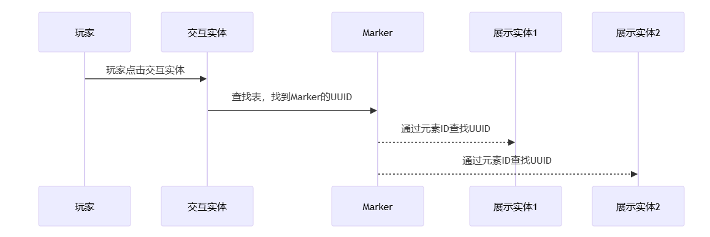
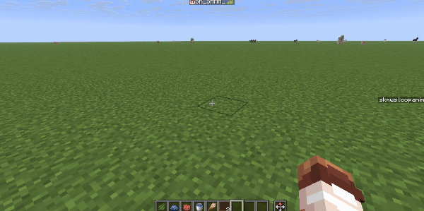
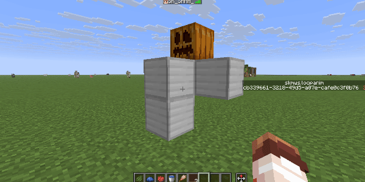
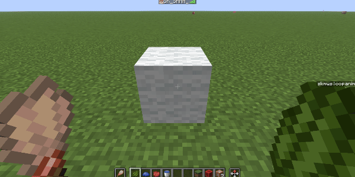

<FeaturedHead
    title = "Make interactive models like writing poetry"
    authorName = "SKSAMA"
    resourceLink = https://ymqlgthbsakuradream.github.io/posts/minecraft/Archive.20250808.html
    cover='../../../../../feature/archive/202509/_assets/1.jpg'
/>

This project is called **SK Model Workspace** and aims to create interactive and reusable models in a simple way. It also has rich interfaces and strong scalability
~~Because the author has been mumbling, there are many holes in this project that have not been filled~~, if you are using **[Vanilla Library](https://cr-019.github.io/datapack-index/)** To browse this page, you can **[Click here](https://ymqlgthbsakuradream.github.io/posts/minecraft/Archive.20250808.html)** Visit the original page of the article. The article will continue to be updated on the original page and more useful features will be added later.
Later I will also make some vanilla furniture based on this data pack, ~~ (However, I don’t know how to model, so I’m not very good at it) ~~

 - How it works: vanilla game,**[data pack](https://zh.minecraft.wiki/w/%E6%95%B0%E6%8D%AE%E5%8C%85)**
 - Support version: **1.21.8**

This article will introduce the functions of this data pack in detail and provide some case tutorials to facilitate readers' understanding.
If you have any questions or suggestions, you can contact me directly on station b or QQ.


# data pack download

<div class="nbttree">

**Dependencies**

 + **(data pack)** SK Model Workspace
   + **(front data pack)** SK API

</div>

[Go to download page](https://ymqlgthbsakuradream.github.io/posts/minecraft/Archive.20250729.html)

<br/><br/>

## Overview

### What is an "interactive model"?

The player performs certain operations on the model, and the model responds to the operation. A model with this characteristic can be called an "interactive model." For example, if there is a chair, the player can destroy it by left-clicking, and sit on it by right-clicking. Among them, "left click" and "right click" are operations, and "destroy" and "sit" are feedback. At this time, the chair is an "interactive model"


Display entities and interactive entities were added in version 1.19.4, which provides many conveniences to vanilla developers and also brings the possibility of finding simple implementation methods of "interactive models". There are currently many excellent works in this field:

 - [Deco Creater kit - Simple interactive decoration model support library](https://www.mcmod.cn/class/14646.html)
 - [NatureCraft - high version custom model framework](https://github.com/Bybycyann/NatureCraft)
 - [NyaaWorks - Furniture System](https://github.com/Acappellia/NyaaWorks/blob/main/Readme.md)
 - [Generate a button that can customize interactive feedback with one click](https://www.bilibili.com/video/BV1nx4y1279F)

### How to implement it?

In **SK Model Workspace**, each interactive model consists of a Marker, one or more display entities and interactive entities. The interactive entities are used to receive the player's operations, and then the Marker will act as the executor to execute pre-set events, and finally the display entity will give certain feedback.

After the interactive entity receives the player's operation, it needs to tell the Marker to serve as the executor, but how to let the interactive entity find the Marker? One way is to let the interactive entity serve as the passenger of the Marker. The interactive entity can use **execute on vehicle** to find the Marker, but there is obviously a problem with this: if there is more than one display entity and let them all serve as passengers of the Marker, then these display entities cannot set their own coordinates respectively. Obviously this is inappropriate

Another method is to store the UUID of the display entity and Marker in the storage when the model is created. The display entity only needs to look up the table to find the Marker.

Now that Marker has become the executor, it can operate all interactive entities. How to implement this? In fact, it is not difficult. We call all display entities and interactive entities in a model elements of the model, set a unique element ID for each element, and then store the element IDs and UUIDs of all elements in the Marker. The Marker can find the UUID of the element by giving the element ID, and then perform operations on the element.



In addition, **SK Model Workspace** also supports configuring blocks for the model. The model itself has no collision volume. Barrier blocks can be configured to add collision volumes to the model. You can also configure a light source block to make the model shine.
At the same time, in order not to affect the existing blocks in the world, when the model is created, it will check whether the block at the target position is air. If so, the configured block will be placed.

## Model class

### Model class format

In **SK Model Workspace**, models are defined in the form of **classes**

<br/><br/>

```
data modify storage skmws reg.class.<类名> set value <模型数据>
```
Parameter description
**\&lt;Model ID\&gt;** The ID of the model, this is unique
**\&lt;Model data\&gt;** A composite tag containing all the data of the model, the format is as follows

<div class="nbttree">

<node type="compound"/>(root tag)
   + <node type="bool" name="abstract"/> (optional) indicates whether the model class is an abstract class
   + <node type="string" name="extends"/> (optional) a class name, the parent class of the model class
   + <node type="list" name="elements"/> element list
     + <node type="compound"/>(an element), **For details, see: [Element Format](#3.2)**
   + <node type="compound" name="marker_merge"/> (optional) merges data into the model's marker entity, **For details, see: [Wiki:Marker](https://zh.minecraft.wiki/w/%E6%A0%87%E8%AE%B0?variant=zh-cn#%E6%95%B0%E6%8D%AE%E5%80%BC)**
   + <node type="list" name="blocks"/> (optional) block list
     + <node type="compound"/>(a block)
       + <node type="list" name="position"/> relative position of block
       + <node type="string" name="block"/> blockID
   + <node type="compound" name="events"/> (optional) A list of private events for this model
     + <node type="list" name="on_load"/> (optional) Event executed when the model completes loading, **For details, see: [Event List Format]()**
     + <node type="list" name="on_remove"/> (optional) Event executed when the model is removed, **For details, see: [Event List Format]()**
     + <node type="list"/>(Event List ID) (optional) A custom event list, **For details, see: [Event List Format]()**
   + <node type="compound" name="anim"/> (optional) Private animation for this model
     + <node type="list"/>(animation ID) (optional) a custom animation, **see: [animation format]()** for details
   + <node type="compound" name="properties"/> (optional) dynamic configuration of the model
     + <node type="int" name="permission"/> (optional) The operation permission of the model, **For details, see: [Permission Control]()**
     + <node type="string" name="playsound_on_place"/> (optional) The sound played when this model is instantiated
     + <node type="any"/>(a custom project)
   + <node type="list" name="align_position"/> (Optional) Align coordinate. If there is no such item, coordinate alignment will not be performed. There are three numbers in the list, corresponding to the XYZ three axes. The actual coordinate is the largest number that is not greater than the current coordinate and can be evenly divided by this value. Fill in -1 to indicate that the axis coordinate is not aligned. Example: [1,-1,1] indicates that the XZ axis is aligned with the block grid, and the Y axis is not aligned.
   + <node type="float" name="align_rotation"/> (optional) Constrains the yaw angle. If there is no such item, the yaw angle will not be constrained. Example: input 90 means that the actual yaw angle is constrained to one of the four directions of southeast, northwest, and northwest, and input 45 means that the actual yaw angle is constrained to the eight basic directions.
   + <node type="float" name="lock_rotation"/> (optional) locks the rotation angle so that the rotation angle is always the specified value. If this item and **align_rotation** exist at the same time, this item will be used first.
</div>


### Element format

We collectively refer to the display entities and interactive entities in a model as elements of this model. Each element has a unique element ID in this model class.

<div class="nbttree">

<node type="compound" name=""/>(one element)
   + <node type="string" name="id"/> Element ID, the ID of all elements in the element list cannot be repeated+ <node type="string" name="type"/> entity type, optional values ​​are **item_display**, **text_display**, **block_display**, **interaction** <br> When **type:"interaction"**
   + <node type="compound" name="criteria"/>
     + <node type="list" name="leftclick"/> (optional) Event executed when left clicked, **For details, see: [Conditional List Format](#4.2)**
     + <node type="list" name="rightclick"/> (optional) Event executed when right-clicking, **For details, see: [Conditional List Format](#4.2)**
   + <node type="compound" name="merge"/> (optional) merges data into this element. **For details, see: [Wiki:Interactive entity](https://zh.minecraft.wiki/w/%E4%BA%A4%E4%BA%92%E5%AE%9E%E4%BD%93#%E6%95%B0%E6%8D%AE%E5%80%BC)**
   + <node type="list" name="position"/> (optional) the local coordinate of the element<br> when **type:"item_display"** or **type:"text_display"** or **type:"block_display"**
   + <node type="compound" name="merge"/> (optional) Merge data, **For details, see: [Wiki: Display entity](https://zh.minecraft.wiki/w/%E5%B1%95%E7%A4%BA%E5%AE%9E%E4%BD%93#%E6%95%B0%E6%8D%AE%E5%80%BC)**
   + <node type="list" name="position"/> (optional) the local coordinate of the element
   + <node type="list" name="rotation"/> (optional) relative rotation angle of the element
</div>

### Dynamic configuration of model classes

The dynamic configuration data of the model is stored in

In **properties**, what is dynamic configuration? There may be a need to access some variables during use of the model. These variables are dynamic configurations. Dynamic configurations can be changed and take effect immediately after the model is instantiated, such as operation permissions.

**permission** can also be changed after the model is instantiated. Some built-in functions of this data pack also rely on dynamic configuration.

### Inheritance of model classes

**Model Class** is similar to **Class** in Java. It also supports multi-layer inheritance. Inheritance can improve the reusability and scalability of code.

Here is an example: We want to make a "door". There are many types of doors: "oak door", "birch door", "acacia door"... You may think of creating separate model classes for each type of door, but doing so will produce a lot of redundant code, because any door supports operations such as "opening" and "closing," and this operation is written once in the model class of each type of door. Although there is no problem in doing so, it just requires writing a little more code. I can just copy and paste it (laughing). However, if one day you want to upgrade the relevant code for operations such as "opening" and "closing," you need to modify the relevant code in each class, which is really troublesome.

So you are smart and think that you can first create a "door" class, write the "opening" and "closing" related codes in the "door" class, and then let the "oak door" class, "birch door" class, "acacia wood door" class... all inherit from the "door" class, so that every class inherited from the "door" class has "opening" and "closing" operations. The next thing to do is to define the unique content of the subclass such as texture, model, sound effects, etc. in each subclass.


**SK Model Workspace** handles class inheritance in the following way, and temporarily stores the processed data for easy retrieval next time.

 - Check the current model class

**extends** field, if it exists, the following processing will be performed on the model class inheritance. If the parent class also inherits from a certain class, the parent class will be processed recursively.
 - Merge subclasses and parent classes

All data except **elements**
 - in

**elements**, in subclasses and in parent classes

**Elements with the same ID** are merged, and the data of the remaining elements whose IDs only exist in the parent class or child class are all retained.

In addition, the data in the parent class may be incomplete and must be supplemented by the subclass before it can be instantiated. In order to avoid unknown errors caused by incorrect instantiation of the parent class, you can add

**abstract: 1b** field declares the class as an abstract class, and abstract classes cannot be instantiated.

### Instantiate model class

What is "instantiation"? Instantiation is indeed a very abstract concept, but here you can simply understand it as laying out the created model class. You can imagine that you hold a block and right-click on the ground, and the block is placed on the ground. This can be considered a kind of instantiation.

**SK Model Workspace** provides multiple ways to instantiate model classes

1. Through class name

```
function skmws:construct {class:"<类名>"}
```
**(execute) as** will act as the owner of the model
**(execute) positioned** The creation position of the model
**(execute) rotated** Rotation angle when the model is created

2. By passing in complete model class data

```
function skmws:construct_with
```
**(execute) as** will act as the owner of the model
**(execute) positioned** The creation position of the model
**(execute) rotated** Rotation angle when the model is created
**storage** skmws

temp.input enters a complete model class data

3. Through Marker (for internal use, not recommended to call directly)
Generate a Marker with the following data. The Marker's position and rotation angle will be applied to model creation.

<div class="nbttree">

+ <node type="list" name='Tags:["skmws.construct"]'/>
+ <node type="compound" name="data"/>
  + <node type="compound" name=""/> <node type="string" name="input"/> A class name, or a complete model class data

</div>

Then execute this command
This command will process the Marker with **skmws.construct**tag closest to the executor.

```
function skmws:_private/_player_detect
```
**(execute) as** will act as the owner of the model


## Condition list

### Overview

The list of conditions is located in the interaction element in the model class.

In **criteria**tag, in this tag

**leftclick** and

**rightclick** is a list of conditions. For example, when the player left-clicks on this interactive entity, it will be executed.

List of conditions in **leftclick** tag

To explain clearly what the condition list is used for, here is an example: Suppose there is a sheep. You can hold wheat to feed the sheep, or hold dye to dye the sheep, and hold scissors to shear the sheep. Behavior like this that performs different operations in different situations can be achieved through conditional lists

In **SK Model Workspace**, the condition list will be processed as follows

 - Check each item in the condition list in turn
 - Until a project is found and all condition checks in the project pass, the event list in the project will be executed and subsequent projects will not be checked.


### Conditional list format

<div class="nbttree">

<node type="list" name=""/>(Conditional list root tag)
+ <node type="compound" name=""/>(a check item)
    + <node type="string" name="mainhand_item"/> (optional) Check the interactive player's main hand item, **For details, see: [Wiki:itempredicate](https://zh.minecraft.wiki/w/%E5%8F%82%E6%95%B0%E7%B1%BB%E5%9E%8B#item_predicate)**
    + <node type="string" name="offhand_item"/> (optional) Check the interactive player offhand item, **For details, see: [Wiki:itempredicate](https://zh.minecraft.wiki/w/%E5%8F%82%E6%95%B0%E7%B1%BB%E5%9E%8B#item_predicate)**
    + <node type="compound" name=""/><node type="string" name="predicate"/> (Optional) Check the entitypredicate of the interactive player, **For details, see: [Wiki:entitypredicate](https://zh.minecraft.wiki/w/%E5%AE%9E%E4%BD%93%E8%B0%93%E8%AF%8D)**
    + <node type="list" name="event"/> A list of events to be executed when all the above checks pass. **For details, please see: [Event List Format](#5.2)**

</div>

## Event list

### Overview

The operations performed after the model is interacted are implemented by event lists. When an event list is executed, all events in the list will be executed in sequence. The event list can be defined in the following places

 - list of conditions

**event** tag
 - In the **events.&lt;event list ID&gt;** tag of the model class, the event list defined at this time is a private event list and can only be accessed by this class and its subclasses
 - Stored in the **storage skmws reg.events.&lt;event list ID&gt;** tag, the event list defined at this time is a global event list and can be accessed by all model classes. Some built-in functions of this package are implemented using the global event list. **For details, see: [Module](#8)**


### Event list format


The executor of the event list is the Marker of the model
You can use **@a[tag=skmws.s]** to specify the player that is performing interactive operations

<div class="nbttree">

<node type="list" name=""/>(an event list)
   + <node type="compound" name=""/>(an event)
     + <node type="string" name="type"/> event type
     + <node type="any" name=""/>Extra parameters for this event (see below)

</div>

#### # Destruction

 When **type:"remove"** , remove the model and trigger the on_remove private event list

 When **type:"destroy"** is used, the model is destroyed and the on_remove private event list is triggered.
The effect of destroying the model is defined in the dynamic configuration of the model class, with the following format:
<div class="nbttree">

<node type="compound" name=""/>(Model class root tag) **For details, see: [Model class format](#3.1)**
  + <node type="compound" name="properties"/>
    + <node type="compound" name="destroy"/> stores the effect when the model is destroyed
      + <node type="string" name="sound"/> Play a sound when the model is destroyed
      + <node type="string" name="particle"/> Destroy particles, **For details, see: [Wiki:block particle options](https://zh.minecraft.wiki/w/%E7%B2%92%E5%AD%90%E6%95%B0%E6%8D%AE%E6%A0%BC%E5%BC%8F#%E6%96%B9%E5%9D%97%E7%B2%92%E5%AD%90%E9%80%89%E9%A1%B9)**
      + <node type="compound" name="item"/> (optional) The dropped items when destroyed. If the item does not exist, no dropped items will be generated. If the item exists, the dropped items will be generated, and the content of the item will be merged into item. **For details, see: [Wiki:item format](https://zh.minecraft.wiki/w/%E7%89%A9%E5%93%81%E6%A0%BC%E5%BC%8F)**

</div>

#### # Cool down

 When **type:"cooldown"**, set the interactive cooling time, during which the model does not accept any operations
<div class="nbttree">

 + <node type="int" name="time"/> Cooling time
</div>

#### # sit

 When **type:"sit"**, let the player performing the interactive operation sit on the model
<div class="nbttree">

 + <node type="string" name="id"/> Element ID, specifies which element the player should sit on
</div>

#### # Call event list

 When **type:"call"**, call another event list
<div class="nbttree">

  + <node type="compound" name="with"/>
    + <node type="string" name="event"/> event list ID
    + <node type="bool" name="global"/> (optional) indicates whether the called event list is a public event list
</div>

#### # Animation

 When **type:"anim"**, play animation
<div class="nbttree">

  + <node type="compound" name="with"/>
    + <node type="string" name="anim"/> Animation ID
    + <node type="bool" name="global"/> (optional) specifies whether the calling animation is a public animation
    + <node type="bool" name="loop"/> (optional) specifies whether the animation will be played in a loop
    + <node type="int" name="time"/> (optional) When looping the animation, the time it takes for the animation to play once
</div>


 When **type:"stopanim"**, stop the playing loop animation


#### # Execute command

 When **type:"cmd"**, execute the specified command
<div class="nbttree">

  + <node type="compound" name="with"/>
    + <node type="string" name="cmd"/> command to be executed
    + <node type="string" name="key"/> (optional) An NBT path, taking the value from the dynamic configuration of the model as a parameter of the command to be executed
</div>

 When **type:"execute"**, let the specified element execute the specified command
<div class="nbttree">

  + <node type="string" name="id"/> element ID, as the executor
  + <node type="compound" name="with"/>
    + <node type="string" name="cmd"/> command to be executed
    + <node type="string" name="key"/> (optional) An NBT path, taking the value from the dynamic configuration of the model as a parameter of the command to be executed
</div>

#### # Modify element data

 When **type:"merge"**, merge data to the specified element
<div class="nbttree">+ <node type="string" name="id"/> element ID
  + <node type="string" name="data"/> merge data
</div>

 When **type:"modify"**, modify the specified data of the specified element
<div class="nbttree">

  + <node type="string" name="id"/> element ID
  + <node type="string" name="key"/> An NBT path
  + <node type="any" name="value"/> value
</div>

#### # Add and delete elements

 Add element when **type:"element_append"**
<div class="nbttree">

  + <node type="string" name="id"/> element ID
  + <node type="compound" name="data"/> (one element)
</div>

 When **type:"element_remove"**, remove the element
<div class="nbttree">

  + <node type="string" name="id"/> element ID
</div>

#### # block addition and deletion

 When **type:"block_append"**, add block
<div class="nbttree">

  + <node type="list" name="position"/> placement position
  + <node type="string" name="block"/> blockID
</div>

 When **type:"block_remove"**, remove block
<div class="nbttree">

  + <node type="list" name="position"/> The position of the block to be removed
</div>

#### #Mobile model

 When **type:"move"**, move the entire model, including all blocks and elements
Need to specify

**position**, or specify both

**facing** and

**px**
<div class="nbttree">

  + <node type="compound" name="with"/>
    + <node type="list" name="position"/> (optional) a three-element list representing relative displacement
    + <node type="string" name="facing"/> (optional) Orientation, optional values are "N", "E", "S", "W"
    + <node type="int" name="px"/> (optional) The number of pixels to move in this direction
</div>

#### # Modify model dynamic configuration

 When **type:"properties"**, edit the dynamic configuration of the model
<div class="nbttree">

  + <node type="string" name="key"/> An NBT path
  + <node type="any" name="value"/> value
</div>

#### # Play sound

 When **type:"playsound"**, play sound
<div class="nbttree">

  + <node type="string" name="key"/> An NBT path, taking the value from the dynamic configuration of the model as the sound to be played
</div>


### Function form of event

In addition, these events have their corresponding functions. The effect of calling these functions is the same as executing events in the event list.
These functions can be used in the command executed by the **type:"cmd"** event, but cannot be used in other contexts.
The format is as follows:

```
function skmws:event/<事件类型> {<除type以外的参数>}
```
## animation

### Overview

The **transformation** field of the display entity can be interpolated. We can use this feature to create simple animations.

Animation can be defined in the following places

 - In the **anim.&lt;animation ID&gt;** tag of the model class, the animation defined at this time is a private animation and can only be accessed by this class and its subclasses.
 - Stored in **storage skmws reg.anim.&lt;animation ID&gt;** tag, the animation defined at this time is a global animation and can be accessed by all model classes


### Animation format

<div class="nbttree">

<node type="list" name=""/>(root tag)
  + <node type="compound" name=""/>(a project)
    + <node type="compound" name="merge"/> The data to merge into the element
      + <node type="compound" name=""/>**(element ID)** The data to be merged into this element
    + <node type="int" name="delay"/> The time since the previous project. If this project is the first project, this item can be omitted.

</div>

For detailed tutorials on this section, see **[Tutorial: Animation](#9.3)**

## Permission control

### Overview

Each instantiated model has its own operation permissions. The permission information is defined in the dynamic configuration of the model class.

**permission**medium

Optional values and explanations are as follows:

|

value of **permission**|permission description|
|-|-----|
|0|Accessible to everyone|
|1|Only the model owner and his friends can access|
|2|Only the model owner can access|
|3|Not accessible to everyone|

 - The owner is the creator of the model. Whoever instantiates the model is the owner of the model.
 - Players with **skmws.debug**tag can directly operate the model regardless of permissions.

### Friends system

 This is a branch of the permission control system. The friend data of each player is stored in **storage skmws friends**. Currently, it can only be operated through command.

<div class="nbttree">

<node type="list" name="friends"/>
  + <node type="compound" name=""/>(a project)
    + <node type="string" name="UUID"/> UUID string of player
    + <node type="list" name="friends"/> All friends of this player
      + <node type="compound" name=""/>(a project)
        + <node type="string" name="UUID"/> UUID string of player
      + <node type="compound" name=""/>...
  + <node type="compound" name=""/>...

</div>


## Module

### Overview

This package encapsulates some commonly used functions into global event lists. We call these global event lists modules. Modules can be called in any model class, simplifying repeated operations. When using these modules, you need to add some fields to the dynamic configuration of the model class. See below for details.

### Global event: model state switching

Sometimes the created model will have many states. For example, the door can be divided into two states: "open" and "closed", and the cake can be divided into 8 different states according to the degree of consumption. In order to simplify the processing of the model state, you can call the **toggle_state** global event list to switch the model to the next state, and then automatically call the model's private event list **on_state_&lt;current state&gt;** to complete more detailed processing of the model.

Global event list ID: **toggle_state**

<div class="nbttree">

<node type="compound" name=""/>(Model class root tag) **For details, see: [Model class format]()**
  + <node type="compound" name="properties"/>
    + <node type="compound" name="toggle_state"/> stores model state switching related configurations
      + <node type="int" name="current_state"/> (optional) current state, default is 0
      + <node type="int" name="number_of_state"/> (optional) The number of states, default is 2

</div>

For detailed tutorials on this section, please see **[Practical Combat: Silker Doors](#9.6)**

### Global events: push model

When this module is called, the model can move one frame in the direction the player is facing. If there is a block blocking the target position of the model, it will not move.

Global event list ID: **push**

<div class="nbttree">

<node type="compound" name=""/>(Model class root tag) **For details, see: [Model class format]()**
  + <node type="compound" name="properties"/>
    + <node type="compound" name="pushable"/> Storage push related configuration
      + <node type="int" name="playsound"/> (optional) The sound played when the model is pushed

</div>

For a detailed tutorial on this section, see **[Tutorial: Pushing the Model](#9.4)**

### Global events: dyeing and cleaning

It is well known that Mojang has added 16 optional colors to many items and blocks. This data pack also provides similar functions.

Dye: Global Event List ID: **dye**

Wash: Global event list ID: **wash**

<div class="nbttree">

<node type="compound" name=""/>(Model class root tag) **For details, see: [Model class format]()**
  + <node type="compound" name="properties"/>
    + <node type="compound" name="dyeable"/> stores dyeing related configurations
      + <node type="string" name="id"/> The ID of the element to be dyed
      + <node type="string" name="key"/> An NBT path. When the model is dyed, the value will be modified to the specified value.
      + <node type="list" name="values"/> value list
        + <node type="any" name="default"/> When using the default color, the value pointed to in the **key** above will be modified to this value.
        + <node type="any" name=""/>(a custom color) When the model is dyed into the specified color, the value pointed to in the **key** above will be modified to this value
      + <node type="string" name="playsound_on_dyeing"/>(optional) The sound played when the model is dyed. If not specified, the default sound will be played.
      + <node type="string" name="playsound_on_washing"/>(optional) The sound played when the model is cleaned. If not specified, the default sound will be played.

</div>

The configuration data of this module is stored in **storage skmws config.dyeable**, and the color configuration can be modified to adapt to new colors.

<div class="nbttree">

<node type="compound" name="dyeable"/>
  + <node type="list" name="colors"/> color configuration
    + <node type="compound" name=""/>(a project)
      + <node type="string" name="item"/> Check the handheld item, **For details, see: [Wiki:itempredicate](https://zh.minecraft.wiki/w/%E5%8F%82%E6%95%B0%E7%B1%BB%E5%9E%8B#item_predicate)**
      + <node type="string" name="key"/> The key name of the color
      + <node type="list" name="color"/> A three-element list, the RGB color value of the color, used to display particle effects
  + <node type="string" name="playsound_on_dyeing"/> The default sound played when the model is dyed
  + <node type="string" name="playsound_on_washing"/> The default sound played when the model is being cleaned


</div>

The default values for this configuration are as follows:
The default value is written in **function/cfg/config.mcfunction**

```json
{
    colors:[
        {item:"red_dye",key:"red",color:[0.7, 0.19, 0.17]},
        {item:"blue_dye",key:"blue",color:[0.15, 0.19, 0.57]},
        {item:"cyan_dye",key:"cyan",color:[0.16, 0.46, 0.59]},
        {item:"gray_dye",key:"gray",color:[0.26, 0.26, 0.26]},
        {item:"lime_dye",key:"lime",color:[0.25, 0.8, 0.2]},
        {item:"pink_dye",key:"pink",color:[0.85, 0.51, 0.6]},
        {item:"black_dye",key:"black",color:[0.12, 0.11, 0.11]},
        {item:"brown_dye",key:"brown",color:[0.32, 0.19, 0.1]},
        {item:"green_dye",key:"green",color:[0.23, 0.32, 0.1]},
        {item:"white_dye",key:"white",color:[0.94, 0.94, 0.94]},
        {item:"orange_dye",key:"orange",color:[0.92, 0.53, 0.27]},
        {item:"purple_dye",key:"purple",color:[0.48, 0.18, 0.75]},
        {item:"yellow_dye",key:"yello",color:[0.87, 0.81, 0.16]},
        {item:"magenta_dye",key:"magenta",color:[0.76, 0.33, 0.8]},
        {item:"light_blue_dye",key:"light_blue",color:[0.4, 0.54, 0.83]},
        {item:"light_gray_dye",key:"light_gray",color:[0.67, 0.67, 0.67]}
    ],
    playsound_on_dyeing:"minecraft:item.brush.brushing.gravel",
    playsound_on_washing:"minecraft:item.bucket.empty"
}

```
When the global event list **dye** is executed, the player handheld item will first be checked. If this item is defined in **storage skmws config.dyeable.colors**, the corresponding color key name will be obtained.

**key** and particle color

**color**, then use this key name to query a value in the model's dynamic configuration **properties.dyeable.values**, use this value to overwrite the original value of the data pointed to by **properties.dyeable.key**, and finally generate particles of the specified color. If any of the above steps fails, the model color will not change

When the global event list **wash** is executed, the original value of the data pointed to by **properties.dyeable.key** is overwritten by the value of **properties.dyeable.values.default** in the model's dynamic configuration.

For detailed tutorials on this section, see **[Tutorial: Dyeing](#9.5)**


## Case tutorial


### Routine: Simple decoration model

Let’s start with the simplest one. The main function of the simple decoration model is decoration, so there is no need for too complicated effects. What we need to implement are these.

- Can be placed and destroyed like a block, and can drop items when destroyed
 - Correct direction and yaw angle when placing
 - One-frame collision box

The model class is defined as follows

```json
{
    //elements of this model class
    elements:[

        //item displays entity, used to display model
        {
            type:"item_display",
            id:"display",
            merge:{

                //Use the custom_model_data component to display custom models
                item:{
                    id:"acacia_boat",
                    components:{
                        custom_model_data:{strings:["15230006"]}
                    }
                }

            },

            //The relative rotation angle of the element. The 180-degree rotation of the y-axis here is because the angle was wrong when making the model, which resulted in an extra 180-degree rotation, and then I was too lazy to change it. Here, I can turn it back to the original position by turning another 180 degrees.
            rotation:[180,0]
        },

        //Interactive entity, used to handle right-click events
        {
            type:"interaction",
            id:"interact",

            //The width and height of the interactive entity are slightly larger than 1. This is to prevent the player from hitting the barrier.
            merge:{
                width:1.01,
                height:1.01
            },

            criteria:{
                leftclick:[ //A list of conditions to be executed when the model is left clicked
                    { //A check item, but no conditions are defined, so the item passes whenever
                      event:[{type:"destroy"}] //A list of events whose function is to destroy the model
                    }
                ]
            }
        }
    ],

    //Correct the position of the model so that the model is aligned with the block grid
    align_position:[1,1,1],

    //Correct the model orientation and align the model to the 8 basic directions
    align_rotation:45,

    //Dynamic configuration of models
    properties:{
      //Destroy model related configurations
      destroy:{

        //Sounds and particles when destroyed
        playsound:"block.oak_wood.break",
        particle:"oak_planks",

        //Dropped items when destroyed
        item:{
          //Item stack component of dropped items
          components:{

            //Custom item model
            "minecraft:item_model":"acacia_boat",
            "custom_model_data":{strings:["15230006"]},

            //Custom item name
            "minecraft:item_name":"公告牌"
          }
        }

      }
    }

    // block
    blocks:[
        //Place a barrier at the model's location to act as a one-block hitbox
        {block:"barrier",position:[0,0,0]}
    ]
}
```
### Tutorial: Animation

Using the animation system of **SK Model Workspace**, you can complete some simple model animations

Now we need to make an iron golem digging machine and loop the digging animation

Observing the excavator, we found that the entire structure has a total of 5 blocks, so in the model class

In **elements**, elements need to be added to these five blocks respectively. The element IDs are **head**, **body_1**, **body_2**, **body_3**, **body_4**. An interactive entity is also needed to handle the right-click destruction operation.

```json
elements:[
        {
            type:"item_display",
            id:"head",
            merge:{item:{id:"carved_pumpkin"}},
            position:[0,2,0]
        },
        {
            type:"item_display",
            id:"body_1",
            merge:{item:{id:"iron_block"}},
            position:[1,1,0]
        },
        {
            type:"item_display",
            id:"body_2",
            merge:{item:{id:"iron_block"}},
            position:[0,1,0]
        },
        {
            type:"item_display",
            id:"body_3",
            merge:{item:{id:"iron_block"}},
            position:[-1,1,0]
        },
        {
            type:"item_display",
            id:"body_4",
            merge:{item:{id:"iron_block"}},
            position:[0,0,0]
        },
        {
            type:"interaction",
            id:"interact",
            merge:{
                width:1.5,
                height:3
            },
            criteria:{
                leftclick:[
                    {
                        event:[{type:"destroy"}]
                    }
                ]
            }
        },
    ]
```
exist

Configure the sound effect particles and dropped objects during destruction in **properties**. There are no components added to the dropped objects here, so they will be displayed as the default texture (chicken spawn egg)

```json
properties:{
        destroy:{
            particle:"iron_block",
            playsound:"minecraft:block.iron.break",
            item:{}
        }
    }
```
Then we need to make an iron golem digging animation and play it in a loop. How to do this? First, you need to define the animation as a private animation. The private animation is stored in the model class.

in **anim**

```json
anim:{

        //Animation ID, an animation named "main" is defined here
        main:[
            {
                merge:{
                    body_1:{transformation:{translation:[0,0,1]},interpolation_duration:3},
                    body_2:{transformation:{translation:[0,0,0]},interpolation_duration:3},
                    body_3:{transformation:{translation:[0,0,1]},interpolation_duration:3},
                    body_4:{transformation:{translation:[0,0,0]},interpolation_duration:3}
                }
            },
            {
                merge:{
                    body_1:{transformation:{translation:[0,0,0]},interpolation_duration:3},
                    body_2:{transformation:{translation:[0,0,1]},interpolation_duration:3},
                    body_3:{transformation:{translation:[0,0,0]},interpolation_duration:3},
                    body_4:{transformation:{translation:[0,0,1]},interpolation_duration:3}
                },
                delay:14
            }
        ]
    }
```
Finally, we only need to let the animation automatically loop and play. We can automatically perform the animation playback operation through the **on_load** private event list.

```json
events:{
        on_load:[{type:"anim",with:{anim:"main",loop:1b,time:28}}]
    }
```
<details>
<summary>Complete code [expand..]</summary>

```
json
{
    elements:[
        {
            type:"item_display",
            id:"head",
            merge:{item:{id:"carved_pumpkin"}},
            position:[0,2,0]
        },
        {
            type:"item_display",
            id:"body_1",
            merge:{item:{id:"iron_block"}},
            position:[1,1,0]
        },
        {
            type:"item_display",
            id:"body_2",
            merge:{item:{id:"iron_block"}},
            position:[0,1,0]
        },
        {
            type:"item_display",
            id:"body_3",
            merge:{item:{id:"iron_block"}},
            position:[-1,1,0]
        },
        {
            type:"item_display",
            id:"body_4",
            merge:{item:{id:"iron_block"}},
            position:[0,0,0]
        },
        {
            type:"interaction",
            id:"interact",
            merge:{
                width:1.5,
                height:3
            },
            criteria:{
                leftclick:[
                    {
                        event:[{type:"destroy"}]
                    }
                ]
            }
        },
    ],
    properties:{
        destroy:{
            particle:"iron_block",
            playsound:"minecraft:block.iron.break",
            item:{}
        }
    },
    anim:{
        main:[
            {
                merge:{
                    body_1:{transformation:{translation:[0,0,1]},interpolation_duration:3},
                    body_2:{transformation:{translation:[0,0,0]},interpolation_duration:3},
                    body_3:{transformation:{translation:[0,0,1]},interpolation_duration:3},
                    body_4:{transformation:{translation:[0,0,0]},interpolation_duration:3}
                }
            },
            {
                merge:{
                    body_1:{transformation:{translation:[0,0,0]},interpolation_duration:3},
                    body_2:{transformation:{translation:[0,0,1]},interpolation_duration:3},
                    body_3:{transformation:{translation:[0,0,0]},interpolation_duration:3},
                    body_4:{transformation:{translation:[0,0,1]},interpolation_duration:3}
                },
                delay:14
            }
        ]
    },
    events:{
        on_load:[{type:"anim",with:{anim:"main",loop:1b,time:28}}]
    },
    align_position:[1,1,1],
    align_rotation:90
}
```
</details>


### Tutorial: Pushing the Model

Let’s look at an example. Now we need to make a TNT that can be pushed by the player.

- Hold the iron ax and left click to destroy it
 - Right click with empty hand to push
 - Hold a flint and right click to ignite it
 - One-frame collision box

Through observation, it is not difficult to find that this model requires a display entity and an interactive entity. The element list is as follows

```
json
elements:[
        {
            type:"item_display",
            id:"tnt",
            merge:{
                item:{id:"tnt"}
            }
        },
        {
            type:"interaction",
            id:"interact",
            merge:{
                width:1.01,
                height:1.01
            }
        }
    ]
```
Use barrier block to simulate collision box, written as follows

```json
blocks:[
        {position:[0,0,0],block:"barrier"}
    ],
```
Now we need to process the player's operation, which can be processed through the **Condition List→Event List** architecture

```json
criteria:{
                //List of conditions executed when left clicking
                leftclick:[

                    //Destroy the model while holding an iron ax
                    {
                        mainhand_item:"minecraft:iron_axe",
                        event:[{type:"destroy"}]
                    }
                ],

                //List of conditions to be executed when right-clicking
                rightclick:[

                    //While holding the flint and steel, remove the model and spawn a lit TNT in the same location
                    {
                        mainhand_item:"minecraft:flint_and_steel",
                        event:[
                            {type:"remove"},
                            {type:"cmd",with:{cmd:"summon minecraft:tnt ~ ~ ~ {fuse:20}"}}
                        ]
                    },

                    //When there is no hand-held flint and steel, right-click to push the model
                    {
                        event:[{type:"call",with:{event:"push",global:1b}}]
                    }
                ]
            }
```
Finally, you only need to modify the dynamic configuration of the model

```json
    properties:{
        pushable:{
            //sound when pushing
            playsound:"minecraft:block.grass.hit"
        },
        destroy:{

            //Destruction particles and sound effects
            particle:"tnt",
            playsound:"minecraft:block.grass.break",

            //Drops
            item:{
                components:{
                    "minecraft:item_model":"minecraft:tnt",
                    "minecraft:item_name":"TNT"
                }
            }
        },

        //The sound played when the model is created
        playsound_on_place:"minecraft:block.grass.place"
    }
```
<details>
<summary>Complete code [expand..]</summary>

```json
{
    elements:[
        {
            type:"item_display",
            id:"tnt",
            merge:{
                item:{id:"tnt"},
                teleport_duration:5
            }
        },
        {
            type:"interaction",
            id:"interact",
            merge:{
                width:1.01,
                height:1.01
            },
            criteria:{
                leftclick:[
                    {
                        mainhand_item:"minecraft:iron_axe",
                        event:[{type:"destroy"}]
                    }
                ],
                rightclick:[
                    {
                        mainhand_item:"minecraft:flint_and_steel",
                        event:[
                            {type:"remove"},
                            {type:"cmd",with:{cmd:"summon minecraft:tnt ~ ~ ~ {fuse:20}"}}
                        ]
                    },
                    {
                        event:[{type:"call",with:{event:"push",global:1b}}]
                    }
                ]
            }
        }
    ],
    align_position:[1,1,1],
    align_rotation:90,
    blocks:[
        {position:[0,0,0],block:"barrier"}
    ],
    properties:{
        pushable:{
            playsound:"minecraft:block.grass.hit"
        },
        destroy:{
            particle:"tnt",
            playsound:"minecraft:block.grass.break",
            item:{
                components:{
                    "minecraft:item_model":"minecraft:tnt",
                    "minecraft:item_name":"TNT"
                }
            }
        },
        playsound_on_place:"minecraft:block.grass.place"
    }
}

```
</details>


### Tutorial: Dyeing

Dyeing is a very commonly used function. Next, we will take you through a simple example to understand this function.

Now we need to make a wool block that can be dyed

- When you hold a brush in your second hand and a dye in your main hand, right-click the wool block to dye the wool into the corresponding color.
 - When you hold a brush in your secondary hand and a bucket in your main hand, right-click the wool block to rinse the wool block back to white.
 - Left click to destroy the block

It is not difficult to find that this model contains two elements, a display entity and an interactive entity.

```json
elements:[
    //interactive entity
        {
            type:"interaction",
            id:"interact",
            merge:{
                width:1.01,
                height:1.01
            },
            criteria:{
                //...
            }
        },

        //Show entity
        {
            type:"item_display",
            //Remember this ID, we will take a test later
            id:"block",
            merge:{
                item:{
                    id:"white_wool"
                },
                teleport_duration:5
            }
        }
    ]
```
Then configure the condition list and event list

```json
criteria:{
        //Left click to destroy block
        leftclick:[
            {
                event:[{type:"destroy"}]
            }
        ],
        //When right-clicking
        rightclick:[
            //When you hold a brush in your second hand and a dye in your main hand, you can right-click the wool block to dye the wool into the corresponding color.
            {
                offhand_item:"minecraft:brush",
                //#skmws:dye tag contains all dyes
                mainhand_item:"#skmws:dyes",
                event:[{type:"call",with:{event:"dye",global:1b}}]
            },
            //When holding a brush in the second hand and a bucket in the main hand, right-click the wool block to rinse the wool block.
            {
                offhand_item:"minecraft:brush",
                mainhand_item:"minecraft:water_bucket",
                event:[{type:"call",with:{event:"wash",global:1b}}]
            }
        ]
    }
```
Finally, the dynamic configuration of the model class

```json
properties:{
        destroy:{
            particle:"white_wool",
            playsound:"minecraft:block.wool.break"
        },
        playsound_on_place:"minecraft:block.wool.place",

        //Configuration related to dyeing and cleaning
        dyeable:{
            //The element id here fills in the element id of the display entity, indicating that the element needs to be operated.
            id:"block",
            //This NBT path indicates which value of the specified element is to be modified.
            key:"item.id",
            //Value table, determine what value to replace the value of the path in the key based on the color
            values:{
                default:"white_wool",
                red:"red_wool",
                blue:"blue_wool",
                green:"green_wool"
                //...
            }
        }
    }
```
<details>
<summary>Complete code [expand..]</summary>

```json
{
    elements:[
        {
            type:"interaction",
            id:"interact",
            merge:{
                width:1.01,
                height:1.01
            },
            criteria:{
                leftclick:[
                    {
                        event:[{type:"destroy"}]
                    }
                ],
                rightclick:[
                    {
                        offhand_item:"minecraft:brush",
                        mainhand_item:"#skmws:dyes",
                        event:[{type:"call",with:{event:"dye",global:1b}}]
                    },
                    {
                        offhand_item:"minecraft:brush",
                        mainhand_item:"minecraft:water_bucket",
                        event:[{type:"call",with:{event:"wash",global:1b}}]
                    }
                ]
            }
        },
        {
            type:"item_display",
            id:"block",
            merge:{
                item:{
                    id:"white_wool"
                },
                teleport_duration:5
            }
        }
    ],
    blocks:[
        {position:[0,0,0],block:"barrier"}
    ],
    properties:{
        destroy:{
            particle:"white_wool",
            playsound:"minecraft:block.wool.break"
        },
        playsound_on_place:"minecraft:block.wool.place",
        dyeable:{
            id:"block",
            key:"item.id",
            values:{
                default:"white_wool",
                red:"red_wool",
                blue:"blue_wool",
                green:"green_wool"
            }
        }
    },
    align_position:[1,1,1],
    align_rotation:90
}
```
</details>


### Practical combat: Silker doors

The door of vanillaMC does not have door opening and closing animation. Now let’s make a door with door opening and closing animation.

Let’s first think about how to implement this
First of all, the display part of the door can be implemented with two block display entities. The interaction uses the interactive entity, and the collision box uses two barrier blocks.

```json
{
    elements:[
        //interactive entity
        {
            type:"interaction",
            id:"interact",
            merge:{
                width:1.01,
                height:2
            }
        },
        //block displays entity, lower part
        {
            type:"block_display",
            id:"lower",
            merge:{
                block_state:{
                    Name:"cherry_door",
                    Properties:{facing:"south",half:"lower"}
                }
            },
            position:[-0.5,0,-0.5]
        },
        //block displays entity, upper part
        {
            type:"block_display",
            id:"upper",
            merge:{
                block_state:{
                    Name:"cherry_door",
                    Properties:{facing:"south",half:"upper"}
                }
            },
            position:[-0.5,1,-0.5]
        }
    ],
    //block, two barriers
    blocks:[
        {position:[0,0,0],block:"barrier"},
        {position:[0,1,0],block:"barrier"}
    ]
}
```
However, this door cannot be interacted with at this time. In order to facilitate subsequent testing, we first implement left-click destruction and add destruction-related configurations to the dynamic configuration of the model.

```json

criteria:{
                leftclick:[
                    {
                        event:[{type:"destroy"}]
                    }
                ]
        }
```


```
json
properties:{
        destroy:{

            //Sounds and particles during destruction
            playsound:"block.cherry_wood.break",
            particle:"cherry_planks",

            //Drops
            item:{
                components:{
                    "minecraft:item_model":"minecraft:cherry_door",
                    "minecraft:item_name":"补帧 · 樱花木门"
                }
            }
        }
    }
```
Now we need to implement the operation of opening and closing the door with the right button. We might as well abstract this operation. Opening the door and closing the door can be regarded as two states. When you right-click, you can switch from one state to another. Using **global event: toggle_state** can easily solve the problem of state switching.

The condition list is written like this:

```
json
criteria:{
                rightclick:[
                    {
                        event:[{type:"call",with:{event:"toggle_state",global:1b}}]
                    }
                ]
            }

```
Then you need to add some dynamic configuration

```json
 properties:{
        toggle_state:{
            //In the current state, we can specify 1 to close the door and 0 to open the door. When creating the model, the door is closed by default, so write 1 here.
            current_state:1,

            //The total number of states. The door only has two states: open and closed, so write 2 here.
            number_of_state:2
        }
```
Edit the events that need to be executed when switching to this state

 - When closing the door: place a barrier, play the closing sound effect, and close the closing animation
 - When opening the door: remove the barrier, play the opening sound effect, and open the door animation

```json
events:{
        //Events executed when opening the door
        on_state_0:[

            //Play door opening sound effect
            {type:"playsound",key:"_door.playsound_open"},

            //remove barrier
            {type:"block_remove",position:[0,0,0]},
            {type:"block_remove",position:[0,1,0]},

            //Animation (simple animation can be implemented directly using merge)
            {
                type:"merge",
                id:"upper",
                data:{
                transformation:{
                    left_rotation:{axis:[0,1,0],angle:-1.5708},
                    translation:[0.1875,0,0]},
                    start_interpolation:0,
                    interpolation_duration:5
                }
            },
            {
                type:"merge",
                id:"lower",
                data:{
                    transformation:{
                        left_rotation:{axis:[0,1,0],angle:-1.5708},
                        translation:[0.1875,0,0]
                    },
                    start_interpolation:0,
                    interpolation_duration:5
                }
            }
        ],

        //Events executed when closing the door
        on_state_1:[

            //Play door closing sound effect
            {type:"playsound",key:"_door.playsound_close"},

            //Place barrier
            {type:"block_append",position:[0,0,0],block:"barrier"},
            {type:"block_append",position:[0,1,0],block:"barrier"},

            //animation
            {
                type:"merge",
                id:"upper",
                data:{
                    transformation:{
                        left_rotation:{axis:[0,1,0],angle:0},
                        translation:[0,0,0]
                    },
                    start_interpolation:0,
                    interpolation_duration:5
                }
            },
            {
                type:"merge",
                id:"lower",
                data:{
                    transformation:{
                        left_rotation:{axis:[0,1,0],angle:0},
                        translation:[0,0,0]
                    },
                    start_interpolation:0,
                    interpolation_duration:5
                }
            }
        ]
    }

```
The sound effects used in the event need to be defined in the dynamic configuration

```json
properties:{
        _door:{
            playsound_open:"block.cherry_wood_door.open",
            playsound_close:"block.cherry_wood_door.close"
        }
    }
```
At this point you have completed the definition of this model class

<details>
<summary>Complete code [expand..]</summary>

```
json
{
    abstract: 1b,
    elements:[
        {
            type:"interaction",
            id:"interact",
            merge:{
                width:1.01,
                height:2
            },
            criteria:{
                leftclick:[
                    {
                        event:[{type:"destroy"}]
                    }
                ],
                rightclick:[
                    {
                        event:[{type:"call",with:{event:"toggle_state",global:1b}}]
                    }
                ]
            }
        },
        {
            type:"block_display",
            id:"lower",
            merge:{
                block_state:{
                    Name:"cherry_door",
                    Properties:{
                        facing:"south",
                        half:"lower"
                    }
                }
            },
            position:[-0.5,0,-0.5]
        },
        {
            type:"block_display",
            id:"upper",
            merge:{
                block_state:{
                    Name:"cherry_door",
                    Properties:{
                        facing:"south",
                        half:"upper"
                    }
                }
            },
            position:[-0.5,1,-0.5]
        }
    ],
    blocks:[
        {position:[0,0,0],block:"barrier"},
        {position:[0,1,0],block:"barrier"}
    ],
    events:{
        on_state_0:[
            {type:"playsound",key:"_door.playsound_open"},
            {type:"block_remove",position:[0,0,0]},
            {type:"block_remove",position:[0,1,0]},
            {
                type:"merge",
                id:"upper",
                data:{
                transformation:{
                    left_rotation:{axis:[0,1,0],angle:-1.5708},
                    translation:[0.1875,0,0]},
                    start_interpolation:0,
                    interpolation_duration:5
                }
            },
            {
                type:"merge",
                id:"lower",
                data:{
                    transformation:{
                        left_rotation:{axis:[0,1,0],angle:-1.5708},
                        translation:[0.1875,0,0]
                    },
                    start_interpolation:0,
                    interpolation_duration:5
                }
            }
        ],
        on_state_1:[
            {type:"playsound",key:"_door.playsound_close"},
            {type:"block_append",position:[0,0,0],block:"barrier"},
            {type:"block_append",position:[0,1,0],block:"barrier"},
            {
                type:"merge",
                id:"upper",
                data:{
                    transformation:{
                        left_rotation:{axis:[0,1,0],angle:0},
                        translation:[0,0,0]
                    },
                    start_interpolation:0,
                    interpolation_duration:5
                }
            },
            {
                type:"merge",
                id:"lower",
                data:{
                    transformation:{
                        left_rotation:{axis:[0,1,0],angle:0},
                        translation:[0,0,0]
                    },
                    start_interpolation:0,
                    interpolation_duration:5
                }
            }
        ]
    },
    properties:{
        destroy:{
            playsound:"block.cherry_wood.break",
            particle:"cherry_planks",
            item:{
                components:{
                    "minecraft:item_model":"minecraft:cherry_door",
                    "minecraft:item_name":"补帧 · 樱花木门"
                }
            }
        },
        _door:{
            playsound_open:"block.cherry_wood_door.open",
            playsound_close:"block.cherry_wood_door.close"
        },
        playsound_on_place:"block.cherry_wood.place",
        toggle_state:{
            current_state:1,
            number_of_state:2
        }
    },
    align_position:[1,1,1],
    align_rotation:90
}
```
</details>

But don’t worry, I just made a model class of cherry blossom wooden door, now I need to expand it.
First, extract the data common to all doors and put it in the parent class (the non-shared data below has been annotated), and define the parent class as an abstract class

```
json
//Class name: _door
{
    //defined as abstract class
    abstract: 1b,
    elements:[
        {
            type:"interaction",
            id:"interact",
            merge:{
                width:1.01,
                height:2
            },
            criteria:{
                leftclick:[
                    {
                        event:[{type:"destroy"}]
                    }
                ],
                rightclick:[
                    {
                        event:[{type:"call",with:{event:"toggle_state",global:1b}}]
                    }
                ]
            }
        },
        {
            type:"block_display",
            id:"lower",
            merge:{
                block_state:{
                    // Name:"cherry_door",
                    Properties:{
                        facing:"south",
                        half:"lower"
                    }
                }
            },
            position:[-0.5,0,-0.5]
        },
        {
            type:"block_display",
            id:"upper",
            merge:{
                block_state:{
                    // Name:"cherry_door",
                    Properties:{
                        facing:"south",
                        half:"upper"
                    }
                }
            },
            position:[-0.5,1,-0.5]
        }
    ],
    blocks:[
        {position:[0,0,0],block:"barrier"},
        {position:[0,1,0],block:"barrier"}
    ],
    events:{
        on_state_0:[
            {type:"playsound",key:"_door.playsound_open"},
            {type:"block_remove",position:[0,0,0]},
            {type:"block_remove",position:[0,1,0]},
            {
                type:"merge",
                id:"upper",
                data:{
                transformation:{
                    left_rotation:{axis:[0,1,0],angle:-1.5708},
                    translation:[0.1875,0,0]},
                    start_interpolation:0,
                    interpolation_duration:5
                }
            },
            {
                type:"merge",
                id:"lower",
                data:{
                    transformation:{
                        left_rotation:{axis:[0,1,0],angle:-1.5708},
                        translation:[0.1875,0,0]
                    },
                    start_interpolation:0,
                    interpolation_duration:5
                }
            }
        ],
        on_state_1:[
            {type:"playsound",key:"_door.playsound_close"},
            {type:"block_append",position:[0,0,0],block:"barrier"},
            {type:"block_append",position:[0,1,0],block:"barrier"},
            {
                type:"merge",
                id:"upper",
                data:{
                    transformation:{
                        left_rotation:{axis:[0,1,0],angle:0},
                        translation:[0,0,0]
                    },
                    start_interpolation:0,
                    interpolation_duration:5
                }
            },
            {
                type:"merge",
                id:"lower",
                data:{
                    transformation:{
                        left_rotation:{axis:[0,1,0],angle:0},
                        translation:[0,0,0]
                    },
                    start_interpolation:0,
                    interpolation_duration:5
                }
            }
        ]
    },
    properties:{
        destroy:{
            // playsound:"block.cherry_wood.break",
            // particle:"cherry_planks",
            // item:{
            //    components:{
            //        "minecraft:item_model":"minecraft:cherry_door",
            //"minecraft:item_name":"Fixing frame·Sakura wooden door"
            //    }
            // }
        },
        _door:{
            // playsound_open:"block.cherry_wood_door.open",
            // playsound_close:"block.cherry_wood_door.close"
        },
        // playsound_on_place:"block.cherry_wood.place",
        toggle_state:{
            current_state:1,
            number_of_state:2
        }
    },
    align_position:[1,1,1],
    align_rotation:90
}
```
Then let the subclass inherit from the parent class and add the private data of the subclass. The following demonstrates the definition of cherry wood door class and bamboo wood door class.

```json
//Class name: cherry_door
{
    extends:"_door",
    elements:[
        {id:"upper",merge:{block_state:{Name:"cherry_door"}}},
        {id:"lower",merge:{block_state:{Name:"cherry_door"}}}
    ],
    properties:{
        destroy:{
            playsound:"block.cherry_wood.break",
            particle:"cherry_planks",
            item:{
                components:{
                    "minecraft:item_model":"minecraft:cherry_door",
                    "minecraft:item_name":"补帧 · 樱花木门"
                }
            }
        },
        _door:{
            playsound_open:"block.cherry_wood_door.open",
            playsound_close:"block.cherry_wood_door.close"
        },
        playsound_on_place:"block.cherry_wood.place"
    }
}
```


```json
//Class name: bamboo_door
{
    extends:"_door",
    elements:[
        {id:"upper",merge:{block_state:{Name:"bamboo_door"}}},
        {id:"lower",merge:{block_state:{Name:"bamboo_door"}}}
    ],
    properties:{
        destroy:{
            playsound:"block.bamboo_wood.break",
            particle:"bamboo_planks",
            item:{
                components:{
                    "minecraft:item_model":"minecraft:bamboo_door",
                    "minecraft:item_name":"补帧 · 竹木门"
                }
            }
        },
        _door:{
            playsound_open:"block.bamboo_wood_door.open",
            playsound_close:"block.bamboo_wood_door.close"
        },
        playsound_on_place:"block.bamboo_wood.place"
    }
}
```
It can be seen that inheritance reduces redundant code and greatly improves code reusability.

<details>
<summary>Door (_door) complete code [expand..]</summary>

```json
{
    abstract: 1b,
    elements:[
        {
            type:"interaction",
            id:"interact",
            merge:{
                width:1.01,
                height:2
            },
            criteria:{
                leftclick:[
                    {
                        event:[{type:"destroy"}]
                    }
                ],
                rightclick:[
                    {
                        event:[{type:"call",with:{event:"toggle_state",global:1b}}]
                    }
                ]
            }
        },
        {
            type:"block_display",
            id:"lower",
            merge:{
                block_state:{
                    Properties:{
                        facing:"south",
                        half:"lower"
                    }
                }
            },
            position:[-0.5,0,-0.5]
        },
        {
            type:"block_display",
            id:"upper",
            merge:{
                block_state:{
                    Properties:{
                        facing:"south",
                        half:"upper"
                    }
                }
            },
            position:[-0.5,1,-0.5]
        }
    ],
    blocks:[
        {position:[0,0,0],block:"barrier"},
        {position:[0,1,0],block:"barrier"}
    ],
    events:{
        on_state_0:[
            {type:"playsound",key:"_door.playsound_open"},
            {type:"block_remove",position:[0,0,0]},
            {type:"block_remove",position:[0,1,0]},
            {
                type:"merge",
                id:"upper",
                data:{
                transformation:{
                    left_rotation:{axis:[0,1,0],angle:-1.5708},
                    translation:[0.1875,0,0]},
                    start_interpolation:0,
                    interpolation_duration:5
                }
            },
            {
                type:"merge",
                id:"lower",
                data:{
                    transformation:{
                        left_rotation:{axis:[0,1,0],angle:-1.5708},
                        translation:[0.1875,0,0]
                    },
                    start_interpolation:0,
                    interpolation_duration:5
                }
            }
        ],
        on_state_1:[
            {type:"playsound",key:"_door.playsound_close"},
            {type:"block_append",position:[0,0,0],block:"barrier"},
            {type:"block_append",position:[0,1,0],block:"barrier"},
            {
                type:"merge",
                id:"upper",
                data:{
                    transformation:{
                        left_rotation:{axis:[0,1,0],angle:0},
                        translation:[0,0,0]
                    },
                    start_interpolation:0,
                    interpolation_duration:5
                }
            },
            {
                type:"merge",
                id:"lower",
                data:{
                    transformation:{
                        left_rotation:{axis:[0,1,0],angle:0},
                        translation:[0,0,0]
                    },
                    start_interpolation:0,
                    interpolation_duration:5
                }
            }
        ]
    },
    properties:{
        toggle_state:{
            current_state:1,
            number_of_state:2
        }
    },
    align_position:[1,1,1],
    align_rotation:90
}

```
</details>


<details>
<summary>Sakura wood door type (cherry_door) complete code [expand..]</summary>

```json

{
    extends:"_door",
    elements:[
        {id:"upper",merge:{block_state:{Name:"cherry_door"}}},
        {id:"lower",merge:{block_state:{Name:"cherry_door"}}}
    ],
    properties:{
        destroy:{
            playsound:"block.cherry_wood.break",
            particle:"cherry_planks",
            item:{
                components:{
                    "minecraft:item_model":"minecraft:cherry_door",
                    "minecraft:item_name":"补帧 · 樱花木门"
                }
            }
        },
        _door:{
            playsound_open:"block.cherry_wood_door.open",
            playsound_close:"block.cherry_wood_door.close"
        },
        playsound_on_place:"block.cherry_wood.place"
    }
}

```
</details>

<details>
<summary>Bamboo_door complete code [expand..]</summary>

```json

{
    extends:"_door",
    elements:[
        {id:"upper",merge:{block_state:{Name:"bamboo_door"}}},
        {id:"lower",merge:{block_state:{Name:"bamboo_door"}}}
    ],
    properties:{
        destroy:{
            playsound:"block.bamboo_wood.break",
            particle:"bamboo_planks",
            item:{
                components:{
                    "minecraft:item_model":"minecraft:bamboo_door",
                    "minecraft:item_name":"补帧 · 竹木门"
                }
            }
        },
        _door:{
            playsound_open:"block.bamboo_wood_door.open",
            playsound_close:"block.bamboo_wood_door.close"
        },
        playsound_on_place:"block.bamboo_wood.place"
    }
}

```


</details>


