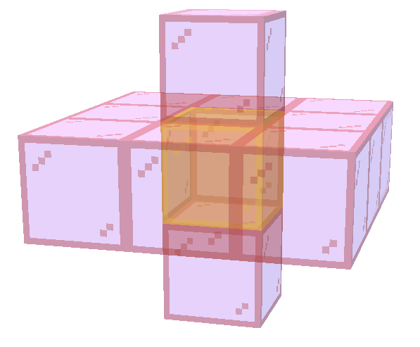
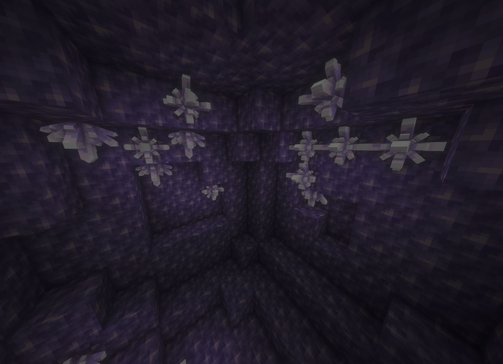
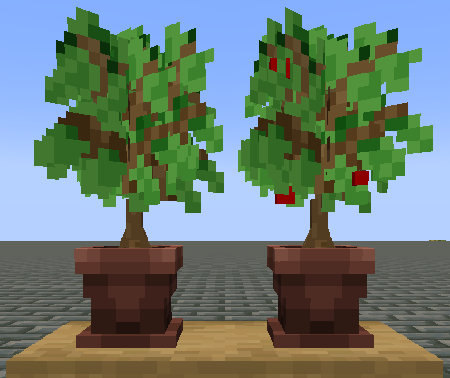
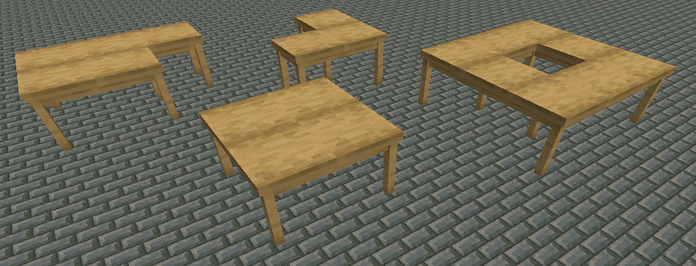

::: tip Translation notice
This page was translated with machine translation and may contain inaccuracies. If you can help improve it, please open an issue or submit a pull request.
:::


<FeaturedHead
    title = "Natural Crafts - High version custom model framework"
    authorName = "Qipai"
    :extraAuthors="['Nox_Obscura']"
    resourceLink = https://github.com/Bybycyann/NatureCraft
    cover='../../../../../feature/archive/202509/_assets/2.png'
/>

> by - Qibai, Nox_Obscura
>
> Warehouse address: [[NatureCraft: Minecraft-Javavanilla custom model support library](https://github.com/Bybycyann/NatureCraft)]
>
> NatureCraft communication group: [602217514](https://qm.qq.com/q/qD7TOv3LAO)
>
> Multiple updates since version 1.16 have greatly expanded the operating space of high version data packs. Based on this, a high-version custom interaction model support framework was written so that players can add various models to enrich the game experience.

## Introduction

NatureCraft is a custom interaction model framework for high versions (1.21.5+). This data pack is a secondary development, fully absorbing the experience summarized by the previous generation, and referring to [NyaaWorks](https://www.bilibili.com/video/BV12ohXeYE2h/?spm_id_from=333.1387.upload.video_card.click), [Decoration Creator Kit](https://www.bilibili.com/video/BV1HKY9z9Ek2) and other well-known framework packages, combined with some richer content, it took about two weeks to complete the writing~~ (it is not completely completed yet).

## What are the characteristics of NatureCraft compared to other frameworks?

As a custom model support library, of course we need to provide a model registration, interaction and storage method for the player. You can use this framework to create many interesting interactive models, including but not limited to: furniture, objects, altars, functional stele, treasure chests, crops, etc.

### A. Production of independent model packages

In order to achieve as much independence as possible between model packages and between model packages and framework packages, we provide a method based on [command Storage (Storage)](https://zh.minecraft.wiki/w/命令存储存储格式?variant=zh-cn) model data storage method. Player can achieve independent storage and distribution of model packages by registering models in the command storage of different namespaces.

When a player wants to create his own model package based on NatureCraft, he needs to pay attention to three parts:

- Resource pack to store the model;

- Manage command storage files for model data;

- Data pack for management events.

Needless to say the function of resource pack. Under the NatureCraft framework, data pack is only responsible for providing some custom events. Command storage files are relatively unfamiliar to everyone, [command storage](https://zh.minecraft.wiki/w/命令存储存储格式?variant=zh-cn) is a data storage file added in version 1.15. In NatureCraft, data pack will read the file content as a model "registry" to provide support for model calls and model events.

In the case of **differentiating namespace**, resource pack and data pack themselves support independent distribution and cross-archive calling. Model data is also supported. The player only needs to download the archive.`data/command_storage_&lt;命名空间>.dat`Copy the files and use them directly across archives.

> Of course, this method also has shortcomings. It will be extremely troublesome when modifying specific model data. It is recommended that the player leaves a file in the data pack to register the function to facilitate maintenance and management of the model.

<div style="text-align:center">

<p style="color: gray;">This is a model data file</p>
</div>

### B. Provides support for adaptive update of conditional model states

Considering that models need to call different variants in different situations, NatureCraft provides three model types that support three independent state mapping modes.

<div class="nbttree">

<node type="compound" name="ModelData"/>
- <node type="string" name="type"/>Model type, default is`none`, other optional values:`hang`(suspension),`link`(connect),`predicate`(predicate)。
- <node type="list" name="states"/>Similar to block states, it is used to define model mapping rules used in different situations. <br>   **type** is`hang`hour:
  - <node type="compound" name=""/>A state map.
    - <node type="compound" name="model"/>Recursive tag. Contains model, lighting, collision box and interaction box properties and events.
      - <node type="any" name="<model attribute tag>"/>A model attribute.
    - <node type="string" name="facing"/> (0≤value≤5) Matches a model attachment surface.
**type** is`link`hour:
  - <node type="compound" name=""/>A state map.
    - <node type="compound" name="model"/>Recursive tag. Contains model, lighting, collision box and interaction box properties and events.
      - <node type="any" name="<model attribute tag>"/>A model attribute.
    - <node type="compound" name="condition"/> A condition.
      - <node type="list" name="code"/> A 10-bit status array, used to describe the conditional status satisfied by the adjacent 10 positions.
      - <node type="string" name="tag"/> The model tag at the position to check.
**type** is`predicate`hour:
  - <node type="compound" name=""/>A state map.
    - <node type="compound" name="model"/>Recursive tag. Contains model, lighting, collision box and interaction box properties and events.
      - <node type="any" name="<model attribute tag>"/>A model attribute.
    - <node type="string" name="predicate"/> a [predicate](https://zh.minecraft.wiki/w/谓词) (supports inline definition).
</div>


- It should be noted that,`hang`The generation origin of the class model is not close to the wall, but some distance away from the wall.`0.03125`distance.

- about`link`The code key of the class model state mapping, the order satisfies`[上,西北,北,东北,西,东,西南,南,东南,下]`, Right now :

  ```mcfunction
  "code":\
  [   ↑,\
  NW, N,NE,\
   W,    E,\
  SW, S,SE,\
      ↓],\
  ```


When the number is 1, it means that the target position needs to have a model entity with a tag. When it is 0, it cannot have it. If it is -1, the position is arbitrary.

  <div style="text-align:center">
  


<p style="color: gray;">Update range of link model</p>
  </div>

### C. More event source support

NatureCraft supports a total of 5 event sources, namely:

`place`(Place event),`left_click`(left-click interaction event),`right_click`(right-click interaction event),`random`(random event) vs.`clock`(Cyclic events).

By properly setting the event attributes of the model, a variety of effects can be achieved, such as altars, workbenches, custom crops, beacons and other effects.

- about`random`Event source, the event trigger logic and [random tick](https://zh.minecraft.wiki/w/刻?variant=zh-cn#随机刻) completely consistent, subject to`randomTickSpeed`Rule control;
- about`clock`Event source, we plan to add the **animation event** branch in future planning.

### D. Composite model support

Are you still troubled by the fact that the model block elements can only rotate on one axis, resulting in insufficient expressiveness? NatureCraft provides a composite model method to circumvent this problem. The player can disassemble the target model into independent components and display the rotation transformation of the entity to achieve more complex model effects in the game.

<div class="nbttree">

<node type="compound" name="ModelData"/>
- <node type="string" name="item_model"/>Appearance data.
  - an[item model mapping](https://zh.minecraft.wiki/w/物品模型映射), determines the model used in the item state. If it does not exist then with

 $\color{red}^*$**model** remains consistent.
  - <node type="string" name="model" required=true />a [item model mapping](https://zh.minecraft.wiki/w/物品模型映射)。
  - <node type="compound" name="common"/> Displays the entity rendering transformation properties.
     - <node type="any" name="<item display entitytag>"/>(For details, see [Display entity - Chinese Minecraft Wiki](https://zh.minecraft.wiki/w/展示实体))
  - <node type="list" name="submodels"/> Submodel data.
    - <node type="compound" name=""/>A submodel definition.
      - <node type="string" name="model" />a [item model mapping](https://zh.minecraft.wiki/w/物品模型映射)。
      - <node type="compound" name="common"/> Displays the entity rendering transformation properties.
         - <node type="any" name="<item display entitytag>" colon=false />

</div>


### E. Model attribute settings with higher degrees of freedom

NatureCraft provides support for model interaction boxes, collision boxes, and lighting.

The collision box is divided into two categories: fixed collision box (barrier) and dynamic collision box (NoAI shulker)

The interactive box and dynamic collision box support three translational degrees of freedom adjustment.

Lighting and fixed collision boxes do not support displacement adjustment

## How to register a custom model with NatureCraft?

### definition

NatureCraft uses command storage as the model data storage medium, which is defined in the following format

<div class="nbttree">
<node type="compound" name="ModelData"/>

+ <node type="compound" name="<model ID>"/>
  + <node type="compound" name="template" required=true /> Template attributes for model calls. parsed as`&lt;命令存储> template.路径`。
    + <node type="string" name="name" required=true /> The namespaceID stored in the command.
    + <node type="string" name="nbt" required=true /> a [NBT path](https://zh.minecraft.wiki/w/NBT路径?variant=zh-cn)。
  + <node type="compound" name="model"/> Model properties.
    + <node type="compound" name="model"/> Model properties. **Inherits** from the preload marker after generation. If the variant is stored independently, you can choose to fill in this field when registering.
      + <node type="string" name="name"/> The namespaceID stored in the command.
      + <node type="string" name="name"/> a [NBT path](https://zh.minecraft.wiki/w/NBT路径?variant=zh-cn)。
    + <node type="list" name="Tags"/> Additional tags added to the Marker entity. (Only read when the model is generated)
    + <node type="string" name="states"/> Similar to block state, it is used to define model mapping rules used in different situations.
<br> when`type`for`hang`hour:
      + <node type="compound" name=""/> A state map.
        + <node type="compound" name="model"/> Recursive tag. Contains model, lighting, collision box and interaction box properties.
          + <node type="any" name="model attribute tag"/> A model attribute.
        + <node type="string" name="facing"/> (0≤value≤5) Matches a model attachment surface.
when`type`for`link`When: (Marker will be added a`NatureCraft.link`tag, used to accept status updates)
      + <node type="compound" name=""/> A state map.
        + <node type="compound" name="model"/> Recursive tag. Contains model, lighting, collision box and interaction box properties.
          + <node type="any" name="model attribute tag"/> A model attribute.
        + <node type="compound" name="condition"/> A condition.
          + <node type="list" name="code"/> A 10-bit status array, used to describe the conditional status that needs to be met in the adjacent 10 locations.
          + <node type="string" name="tag"/> The tag that the model needs to satisfy at the location to be checked.
when`type`for`predicate`hour,
      + <node type="compound" name=""/> A state map.
        + <node type="compound" name="model"/> Recursive tag. Contains model, lighting, collision box and interaction box properties.
          + <node type="any" name="model attribute tag"/> A model attribute.
        + <node type="string" name="predicate"/> A predicate (supports inline definition).
    + <node type="string" name=""/><node type="compound" name=""/><node type="list" name="item_name"/> ([Text component](https://zh.minecraft.wiki/w/文本组件)) model name.
    + <node type="bool" name="towards"/> Default is`true`. Whether the model has orientation, that is, the horizontal orientation (NSWE) is determined based on the player's placement perspective. Enabling this option under non-default types may cause errors.
    + <node type="compound" name="display"/> Appearance data.
      + <node type="string" name="item_model"/> an [item model mapping](https://zh.minecraft.wiki/w/物品模型映射), determines the model used in the item state. If it does not exist, it will be consistent with **model**.
      + <node type="string" name="model"/> an [item model mapping](https://zh.minecraft.wiki/w/物品模型映射)。
      + <node type="compound" name="common"/> Displays the entity rendering transformation properties.
        + <node type="any" name="<item display entitytag>"/> (For details, see [Display entity - Chinese Minecraft Wiki](https://zh.minecraft.wiki/w/展示实体))
      + <node type="list" name="submodels"/> Submodel data.
        + <node type="compound" name=""/> A submodel definition.
          + <node type="string" name="model"/> an [item model mapping](https://zh.minecraft.wiki/w/物品模型映射)。
          + <node type="compound" name="common"/> Displays the entity rendering transformation properties.
    + <node type="compound" name="ride"/> Ride attributes.
      + <node type="double" name="height"/> Riding height.
    + <node type="int" name="light_level"/> Light level.
    + <node type="compound" name="collision_box"/> Collision box properties.
      + <node type="bool" name="barrier"/> Default is`false`, whether to use a barrier collision box. (It should be noted that when this option is`true`, the lighting attributes will not take effect. )
      + <node type="double" name="offset_x" required=true /> (default is 0) The offset of the bottom center of the collision box on the X-axis relative to the bottom center of the block.
      + <node type="double" name="offset_y" required=true /> (default is 0) The offset of the bottom center of the collision box on the Y axis relative to the bottom center of the block.
      + <node type="double" name="offset_z" required=true /> (default is 0) The offset of the bottom center of the collision box relative to the bottom center of the block on the Z axis.
    + <node type="compound" name="interaction_box"/> Collision box properties.
      + <node type="float" name="height" required=true /> (default is 0) interactive box height.
      + <node type="float" name="width" required=true /> (default is 0) interactive box width.
      + <node type="double" name="offset_x" required=true /> (default is 0) The offset of the bottom center of the interaction box relative to the bottom center of the block on the X axis.
      + <node type="double" name="offset_y" required=true /> (default is 0) The offset of the bottom center of the interaction box relative to the bottom center of the block on the Y axis.
      + <node type="double" name="offset_z" required=true /> (default is 0) The offset of the bottom center of the interaction box relative to the bottom center of the block on the Z axis.
      + <node type="bool" name="response"/> (default is`false`)Whether the player waves his arms when interacting.
    + <node type="compound" name="event"/> Interactive events.
      + <node type="compound" name="place"/> Place event.
        + <node type="string" name="name"/> namespace。
        + <node type="string" name="path"/> An event **function path**.
      + <node type="compound" name="random"/> Random tick event.
        + <node type="any" name="<Event common parameters>"/> A set of event common parameters (`name`&`path`). parsed as`&lt;name&gt;:data/event/&lt;path&gt;`。
      + <node type="compound" name="clock"/> Clock event.
        + <node type="any" name="<Event common parameters>"/> A set of event common parameters (`name`&`path`). parsed as`&lt;name&gt;:data/event/&lt;path&gt;`。
        + <node type="int" name="time"/> Clock period, in`tick `as unit.
      + <node type="compound" name="left_click"/> Left click event.
        + <node type="any" name="<Event common parameters>"/> A set of event common parameters (`name`&`path`). parsed as`&lt;name&gt;:data/event/&lt;path&gt;`。
      + <node type="compound" name="right_click"/> Right click event.
        + <node type="any" name="<Event common parameters>"/> A set of event common parameters (`name`&`path`). parsed as`&lt;name&gt;:data/event/&lt;path&gt;`。
    + <node type="compound" name="const"/> The constant parameters passed when the event is called.
      + <node type="compound" name="place"/> Places the parameter group passed by the event.
      + <node type="compound" name="random"/> The parameter group passed by the random event.
      + <node type="compound" name="clock"/> The parameter group passed by the clock event.
      + <node type="compound" name="left_click"/> The parameter group passed by the left click event.
      + <node type="compound" name="right_click"/> The parameter group passed by the right-click event.
        

</div>

Enter in function file

```mcfunction
data modify storage <命名空间ID> model.<nbt路径> set value {\
	...\
}\
```


Register the model. Currently, only a basic template is provided.`naturecraft:base`, its format is as follows:

```mcfunction
data modify storage naturecraft:main template.base set value {\
  "type": "none",\
  "display": {\
    "common": {\
      "transformation": {\
        "translation": [0.0f,0.5f,0.0f]\
      }\
    }\
  },\
  "interaction_box": {\
    "height": 1.0,\
    "width": 1.0,\
    "offset_x": 0.0,\
    "offset_y": 0.0,\
    "offset_z": 0.0,\
    "response": true\
  },\
  "event": {\
    "place": {\
      "name": "naturecraft",\
      "path": "base/sound"\
    },\
    "left_click": {\
      "name": "naturecraft",\
      "path": "base/group/break1"\
    }\
  }\
}
```

It defines a 1\*1\*1 interaction box and basic events, which are the left-clicked original object falling and destruction event (naturecraft:0 break), and the sound event when placed (naturecraft:0 sound).

With the help of this template, you can easily define the simplest display model:

```mcfunction
data modify storage <命名空间ID> model.<nbt路径> set value {\
	"template": {\
		"name": "naturecraft:main",
		"nbt": "base"
	},\
	"model": {\
		"item_name": "<模型物品的名称>",\
		"display": {\
			"model": "<物品模型映射的命名空间ID>"\
		}\
	},\
	"event": {\
		"const":{\
			"place": {\
				"sound": "<音效的命名空间ID>"\
			},\
			"left_click": {\
				"sound": "<音效的命名空间ID>"\
			}\
		}\
	}\
}\
```


### Get

A rough givefunction is defined in the package, input:

```mcfunction
/function naturecraft:give {name:"<存储模型数据的命名空间ID>","nbt":"<模型存储的nbt路径>",model:"<一个物品模型映射>",count:<数量>,type:<none(0)|hang(1)>}
```


Get model item.

in`type`The parameter determines whether the model obtains the direction of the attachment surface. When the model type is hang, write 1, and usually write 0.

### event

> NatureCraft is not officially finished yet and currently only offers a few foundational events.

**naturecraft base/group/break1**: Breaking events dropped by the original model. accept a`(string)sound`parameter

**naturecraft base/loot_spawn**: Generate loot according to the specified loot table. accept a`(string)loot_tbale`Parameters (supports inline form)

**naturecraft base/sound** : Sound event. accept a`(string)sound`parameter

**naturecraft base/variant**: Model transformation, calling another model to replace the existing model (only appearance) and updating the clock and random tick tag. accept`(string)name`,`(string)nbt`parameter

**naturecraft base/ride**: (internal call) ride event, in the model by`ride`definition.

**naturecraft base/model_updata**: (internal call) model status update, in`link`used in the model.

## Some examples of models made using NatureCraft

### amethyst cluster

<div style="text-align:center">

<p style="color: gray;">Redbud cluster using hanging transformation and composite model</p>
</div>

::: details Register function
```mcfunction
data modify storage naturecraft:0 model.amethyst set value {\
  "template": {\
    "name": "naturecraft:main",\
    "nbt": "base"\
  },\
  "model":{\
    "type": "hang",\
    "towards": false,\
    "states": [\
      {\
        "model": {\
          "display": {\
            "common": {\
              "transformation": {\
                "left_rotation": [0.707f,0.0f,0.0f,0.707f]\
              }\
            },\
            "submodels": [{\
              "model": "naturecraft:0/amethyst/1",\
              "common": {\
                "transformation": {\
                  "left_rotation": [0.271f,0.653f,0.653f,0.271f],\
                  "translation": [0.0f,0.5f,0.0f]\
                }\
              }\
            }]\
          },\
          "collision_box": {\
            "offset_x": 0.0,\
            "offset_y": -0.2187,\
            "offset_z": 0.18745\
          },\
          "interaction_box": {\
            "offset_x": 0.0,\
            "offset_y": -0.25,\
            "offset_z": 0.21875\
          }\
        },\
        "facing": 3\
      },\
      {\
        "model": {\
          "display": {\
            "common": {\
              "transformation": {\
                "left_rotation": [1.0f,0.0f,0.0f,0.0f]\
              }\
            },\
            "submodels": [{\
              "model": "naturecraft:0/amethyst/1",\
              "common": {\
                "transformation": {\
                  "left_rotation": [0.383f,0.0f,0.924f,0.0f],\
                  "translation": [0.0f,0.5f,0.0f]\
                }\
              }\
            }]\
          },\
          "collision_box": {\
            "offset_x": 0.0,\
            "offset_y": -0.40615,\
            "offset_z": 0.0\
          },\
          "interaction_box": {\
            "offset_x": 0.0,\
            "offset_y": -0.46875,\
            "offset_z": 0.0\
          }\
        },\
        "facing": 0\
      },\
      {\
        "model": {\
          "display": {\
            "common": {\
              "transformation": {\
                "left_rotation": [0.707f,0.0f,0.0f,-0.707f]\
              }\
            },\
            "submodels": [{\
              "model": "naturecraft:0/amethyst/1",\
              "common": {\
                "transformation": {\
                  "left_rotation": [0.271f,-0.653f,0.653f,-0.271f],\
                  "translation": [0.0f,0.5f,0.0f]\
                }\
              }\
            }]\
          },\
          "collision_box": {\
            "offset_x": 0.0,\
            "offset_y": -0.2187,\
            "offset_z": -0.18745\
          },\
          "interaction_box": {\
            "offset_x": 0.0,\
            "offset_y": -0.25,\
            "offset_z": -0.21875\
          }\
        },\
        "facing": 2\
      },\
      {\
        "model": {\
          "display": {\
            "common": {\
              "transformation": {\
                "left_rotation": [0.0f,0.0f,-0.707f,0.707f]\
              }\
            },\
            "submodels": [{\
              "model": "naturecraft:0/amethyst/1",\
              "common": {\
                "transformation": {\
                  "left_rotation": [0.653f,0.653f,-0.271f,0.271f],\
                  "translation": [0.0f,0.5f,0.0f]\
                }\
              }\
            }]\
          },\
          "collision_box": {\
            "offset_x": 0.18745,\
            "offset_y": -0.2187,\
            "offset_z": 0.0\
          },\
          "interaction_box": {\
            "offset_x": 0.21875,\
            "offset_y": -0.25,\
            "offset_z": 0.0\
          }\
        },\
        "facing": 5\
      },\
      {\
        "model": {\
          "display": {\
            "common": {\
              "transformation": {\
                "left_rotation": [0.0f,0.0f,0.707f,0.707f]\
              }\
            },\
            "submodels": [{\
              "model": "naturecraft:0/amethyst/1",\
              "common": {\
                "transformation": {\
                  "left_rotation": [-0.653f,0.653f,0.271f,0.271f],\
                  "translation": [0.0f,0.5f,0.0f]\
                }\
              }\
            }]\
          },\
          "collision_box": {\
            "offset_x": -0.18745,\
            "offset_y": -0.2187,\
            "offset_z": 0.0\
          },\
          "interaction_box": {\
            "offset_x": -0.21875,\
            "offset_y": -0.25,\
            "offset_z": 0.0\
          }\
        },\
        "facing": 4\
      },\
    ],\
    "item_name": {"translate":"","fallback":"水晶簇"},\
    "display": {\
      "model": "naturecraft:0/amethyst/0",\
      "submodels":[{\
        "model": "naturecraft:0/amethyst/1",\
        "common": {\
          "transformation": {\
            "left_rotation":[0.0f,0.924f,0.0f,0.383f],\
            "translation": [0.0f,0.5f,0.0f]\
          }\
        }\
      }]\
    },\
    "light_level": 5,\
    "collision_box": {\
      "scale": 0.4374,\
      "offset_x": 0.0,\
      "offset_y": 0.0,\
      "offset_z": 0.0\
    },\
    "interaction_box": {\
      "height": 0.5,\
      "width": 0.5,\
    },\
    "event": {\
      "const": {\
        "place": {\
        "sound": "block.amethyst_cluster.place"\
        },\
        "left_click": {\
          "sound": "block.amethyst_cluster.break"\
        }\
      }\
    }\
  }\
}

function naturecraft:give {name:"naturecraft:0","nbt":"amethyst",model:"naturecraft:0/amethyst/0",count:1,type:1}
```

:::

### Oak potted plant

<div style="text-align:center">

<p style="color: gray;">A oak tree that calls random events (left) and a mature oak tree (right)</p>
</div>


::: details Register function
```mcfunction
# 默认
data modify storage naturecraft:0 model.oak_pot.0 set value {\
  "template": {\
    "name": "naturecraft:main",\
    "nbt": "base"\
  },\
  "model":{\
    "model": {\
      "name": "naturecraft:0",\
      "nbt": "oak_pot.0"\
    },\
    "towards": false,\
    "item_name": {"translate":"","fallback":"橡树盆栽"},\
    "display": {\
      "model": "naturecraft:0/pots/oak_pot/0"\
    },\
    "collision_box": {\
      "scale": 0.5,\
      "offset_x": 0.0,\
      "offset_y": 0.0,\
      "offset_z": 0.0\
    },\
    "interaction_box": {\
      "height": 0.501,\
      "width": 0.501,\
    },\
    "event": {\
      "random": {\
        "name": "naturecraft",\
        "path": "0/oak_pot/randomtick"\
      },\
      "right_click": {},\
      "const": {\
        "place": {\
          "sound": "block.stone.place"\
        },\
        "left_click": {\
          "sound": "block.stone.break"\
        },\
        "random": {\
          "name": "naturecraft:0",\
          "nbt": "oak_pot.apple"\
        }\
      }\
    }\
  }\
}

function naturecraft:give {name:"naturecraft:0","nbt":"oak_pot.0",model:"naturecraft:0/pots/oak_pot/0",count:1,type:0}

# 成熟变体
data modify storage naturecraft:0 model.oak_pot.apple set value {\
  "template": {\
    "name": "naturecraft:main",\
    "nbt": "base"\
  },\
  "model":{\
    "model": {\
      "name": "naturecraft:0",\
      "nbt": "oak_pot.apple"\
    },\
    "towards": false,\
    "item_name": {"translate":"","fallback":"橡树盆栽(成熟)"},\
    "display": {\
      "model": "naturecraft:0/pots/oak_pot/apple"\
    },\
    "collision_box": {\
      "scale": 0.5,\
      "offset_x": 0.0,\
      "offset_y": 0.0,\
      "offset_z": 0.0\
    },\
    "interaction_box": {\
      "height": 0.501,\
      "width": 0.501,\
    },\
    "event": {\
      "right_click": {\
        "name": "naturecraft",\
        "path": "0/oak_pot/apple"\
      },\
      "const": {\
        "right_click": {\
          "name": "naturecraft:0",\
          "nbt": "oak_pot.0",\
          "loot_table": "naturecraft:0/oak_pot_apple"\
        }\
      }\
    }\
  }\
}
```

:::

### table

<div style="text-align:center">

<p style="color: gray;">Splicing model implemented by link class</p>
</div>

::: details Register function
```mcfunction
data modify storage naturecraft:0 model.stripped_oak_table set value {\
  "template": {\
    "name": "naturecraft:main",\
    "nbt": "base"\
  },\
  "model":{\
    "Tags": ["NatureCraft.0.table.oak"],\
    "type": "link",\
    "states": [\
      {\
        "model": {\
          "display": {\
            "model": "naturecraft:0/tables/stripped_oak_table/1",\
            "common": {\
              "transformation": {\
                "left_rotation":[0.0f,1.0f,0.0f,0.0f]\
              }\
            }\
          }\
        },\
        "condition": {\
          "code":\
            [  -1,\
             1, 1, 1,\
             1,    1,\
             1, 1, 1,\
               -1],\
          "tag": "NatureCraft.0.table.oak"\
        }\
      },\
      {\
        "model": {\
          "display": {\
            "model": "naturecraft:0/tables/stripped_oak_table/2-1",\
            "common": {\
              "transformation": {\
                "left_rotation":[0.0f,1.0f,0.0f,0.0f]\
              }\
            }\
          }\
        },\
        "condition": {\
          "code":\
            [  -1,\
             1, 1, 0,\
             1,    1,\
             1, 1, 1,\
               -1],\
          "tag": "NatureCraft.0.table.oak"\
        }\
      },\
      {\
        "model": {\
          "display": {\
            "model": "naturecraft:0/tables/stripped_oak_table/2-2",\
            "common": {\
              "transformation": {\
                "left_rotation":[0.0f,1.0f,0.0f,0.0f]\
              }\
            }\
          }\
        },\
        "condition": {\
          "code":\
            [  -1,\
             0, 1, 1,\
             1,    1,\
             1, 1, 1,\
               -1],\
          "tag": "NatureCraft.0.table.oak"\
        }\
      },\
      {\
        "model": {\
          "display": {\
            "model": "naturecraft:0/tables/stripped_oak_table/2-1",\
            "common": {\
              "transformation": {\
                "left_rotation":[0.0f,0.0f,0.0f,1.0f]\
              }\
            }\
          }\
        },\
        "condition": {\
          "code":\
            [  -1,\
             1, 1, 1,\
             1,    1,\
             0, 1, 1,\
               -1],\
          "tag": "NatureCraft.0.table.oak"\
        }\
      },\
      {\
        "model": {\
          "display": {\
            "model": "naturecraft:0/tables/stripped_oak_table/2-2",\
            "common": {\
              "transformation": {\
                "left_rotation":[0.0f,0.0f,0.0f,1.0f]\
              }\
            }\
          }\
        },\
        "condition": {\
          "code":\
            [  -1,\
             1, 1, 1,\
             1,    1,\
             1, 1, 0,\
               -1],\
          "tag": "NatureCraft.0.table.oak"\
        }\
      },\
      {\
        "model": {\
          "display": {\
            "model": "naturecraft:0/tables/stripped_oak_table/3-1",\
            "common": {\
              "transformation": {\
                "left_rotation":[0.0f,1.0f,0.0f,0.0f]\
              }\
            }\
          }\
        },\
        "condition": {\
          "code":\
            [  -1,\
             0, 1, 0,\
             1,    1,\
             1, 1, 1,\
               -1],\
          "tag": "NatureCraft.0.table.oak"\
        }\
      },\
      {\
        "model": {\
          "display": {\
            "model": "naturecraft:0/tables/stripped_oak_table/3-2",\
            "common": {\
              "transformation": {\
                "left_rotation":[0.0f,1.0f,0.0f,0.0f]\
              }\
            }\
          }\
        },\
        "condition": {\
          "code":\
            [  -1,\
             0, 1, 1,\
             1,    1,\
             0, 1, 1,\
               -1],\
          "tag": "NatureCraft.0.table.oak"\
        }\
      },\
      {\
        "model": {\
          "display": {\
            "model": "naturecraft:0/tables/stripped_oak_table/3-1",\
            "common": {\
              "transformation": {\
                "left_rotation":[0.0f,0.0f,0.0f,1.0f]\
              }\
            }\
          }\
        },\
        "condition": {\
          "code":\
            [  -1,\
             1, 1, 1,\
             1,    1,\
             0, 1, 0,\
               -1],\
          "tag": "NatureCraft.0.table.oak"\
        }\
      },\
      {\
        "model": {\
          "display": {\
            "model": "naturecraft:0/tables/stripped_oak_table/3-2",\
            "common": {\
              "transformation": {\
                "left_rotation":[0.0f,0.0f,0.0f,1.0f]\
              }\
            }\
          }\
        },\
        "condition": {\
          "code":\
            [  -1,\
             1, 1, 0,\
             1,    1,\
             1, 1, 0,\
               -1],\
          "tag": "NatureCraft.0.table.oak"\
        }\
      },\
      {\
        "model": {\
          "display": {\
            "model": "naturecraft:0/tables/stripped_oak_table/3-3",\
            "common": {\
              "transformation": {\
                "left_rotation":[0.0f,1.0f,0.0f,0.0f]\
              }\
            }\
          }\
        },\
        "condition": {\
          "code":\
            [  -1,\
             1, 1, 0,\
             1,    1,\
             0, 1, 1,\
               -1],\
          "tag": "NatureCraft.0.table.oak"\
        }\
      },\
      {\
        "model": {\
          "display": {\
            "model": "naturecraft:0/tables/stripped_oak_table/3-4",\
            "common": {\
              "transformation": {\
                "left_rotation":[0.0f,1.0f,0.0f,0.0f]\
              }\
            }\
          }\
        },\
        "condition": {\
          "code":\
            [  -1,\
             0, 1, 1,\
             1,    1,\
             1, 1, 0,\
               -1],\
          "tag": "NatureCraft.0.table.oak"\
        }\
      },\
      {\
        "model": {\
          "display": {\
            "model": "naturecraft:0/tables/stripped_oak_table/4-1",\
            "common": {\
              "transformation": {\
                "left_rotation":[0.0f,1.0f,0.0f,0.0f]\
              }\
            }\
          }\
        },\
        "condition": {\
          "code":\
            [  -1,\
             0, 1, 0,\
             1,    1,\
             0, 1, 1,\
               -1],\
          "tag": "NatureCraft.0.table.oak"\
        }\
      },\
      {\
        "model": {\
          "display": {\
            "model": "naturecraft:0/tables/stripped_oak_table/4-2",\
            "common": {\
              "transformation": {\
                "left_rotation":[0.0f,1.0f,0.0f,0.0f]\
              }\
            }\
          }\
        },\
        "condition": {\
          "code":\
            [  -1,\
             0, 1, 1,\
             1,    1,\
             0, 1, 0,\
               -1],\
          "tag": "NatureCraft.0.table.oak"\
        }\
      },\
      {\
        "model": {\
          "display": {\
            "model": "naturecraft:0/tables/stripped_oak_table/4-1",\
            "common": {\
              "transformation": {\
                "left_rotation":[0.0f,0.0f,0.0f,1.0f]\
              }\
            }\
          }\
        },\
        "condition": {\
          "code":\
            [  -1,\
             1, 1, 0,\
             1,    1,\
             0, 1, 0,\
               -1],\
          "tag": "NatureCraft.0.table.oak"\
        }\
      },\
      {\
        "model": {\
          "display": {\
            "model": "naturecraft:0/tables/stripped_oak_table/4-2",\
            "common": {\
              "transformation": {\
                "left_rotation":[0.0f,0.0f,0.0f,1.0f]\
              }\
            }\
          }\
        },\
        "condition": {\
          "code":\
            [  -1,\
             0, 1, 0,\
             1,    1,\
             1, 1, 0,\
               -1],\
          "tag": "NatureCraft.0.table.oak"\
        }\
      },\
      {\
        "model": {\
          "display": {\
            "model": "naturecraft:0/tables/stripped_oak_table/4-3",\
            "common": {\
              "transformation": {\
                "left_rotation":[0.0f,1.0f,0.0f,0.0f]\
              }\
            }\
          }\
        },\
        "condition": {\
          "code":\
            [  -1,\
            -1, 0,-1,\
             1,    1,\
             1, 1, 1,\
               -1],\
          "tag": "NatureCraft.0.table.oak"\
        }\
      },\
      {\
        "model": {\
          "display": {\
            "model": "naturecraft:0/tables/stripped_oak_table/4-4",\
            "common": {\
              "transformation": {\
                "left_rotation":[0.0f,1.0f,0.0f,0.0f]\
              }\
            }\
          }\
        },\
        "condition": {\
          "code":\
            [  -1,\
            -1, 1, 1,\
             0,    1,\
            -1, 1, 1,\
               -1],\
          "tag": "NatureCraft.0.table.oak"\
        }\
      },\
      {\
        "model": {\
          "display": {\
            "model": "naturecraft:0/tables/stripped_oak_table/4-3",\
            "common": {\
              "transformation": {\
                "left_rotation":[0.0f,0.0f,0.0f,1.0f]\
              }\
            }\
          }\
        },\
        "condition": {\
          "code":\
            [  -1,\
             1, 1, 1,\
             1,    1,\
            -1, 0,-1,\
               -1],\
          "tag": "NatureCraft.0.table.oak"\
        }\
      },\
      {\
        "model": {\
          "display": {\
            "model": "naturecraft:0/tables/stripped_oak_table/4-4",\
            "common": {\
              "transformation": {\
                "left_rotation":[0.0f,0.0f,0.0f,1.0f]\
              }\
            }\
          }\
        },\
        "condition": {\
          "code":\
            [  -1,\
             1, 1,-1,\
             1,    0,\
             1, 1,-1,\
               -1],\
          "tag": "NatureCraft.0.table.oak"\
        }\
      },\
      {\
        "model": {\
          "display": {\
            "model": "naturecraft:0/tables/stripped_oak_table/5-1",\
            "common": {\
              "transformation": {\
                "left_rotation":[0.0f,1.0f,0.0f,0.0f]\
              }\
            }\
          }\
        },\
        "condition": {\
          "code":\
            [  -1,\
             0, 1, 0,\
             1,    1,\
             0, 1, 0,\
               -1],\
          "tag": "NatureCraft.0.table.oak"\
        }\
      },\
      {\
        "model": {\
          "display": {\
            "model": "naturecraft:0/tables/stripped_oak_table/5-2",\
            "common": {\
              "transformation": {\
                "left_rotation":[0.0f,1.0f,0.0f,0.0f]\
              }\
            }\
          }\
        },\
        "condition": {\
          "code":\
            [  -1,\
            -1, 0,-1,\
             1,    1,\
             1, 1, 0,\
               -1],\
          "tag": "NatureCraft.0.table.oak"\
        }\
      },\
      {\
        "model": {\
          "display": {\
            "model": "naturecraft:0/tables/stripped_oak_table/5-3",\
            "common": {\
              "transformation": {\
                "left_rotation":[0.0f,1.0f,0.0f,0.0f]\
              }\
            }\
          }\
        },\
        "condition": {\
          "code":\
            [  -1,\
            -1, 1, 0,\
             0,    1,\
            -1, 1, 1,\
               -1],\
          "tag": "NatureCraft.0.table.oak"\
        }\
      },\
      {\
        "model": {\
          "display": {\
            "model": "naturecraft:0/tables/stripped_oak_table/5-2",\
            "common": {\
              "transformation": {\
                "left_rotation":[0.0f,0.0f,0.0f,1.0f]\
              }\
            }\
          }\
        },\
        "condition": {\
          "code":\
            [  -1,\
             0, 1, 1,\
             1,    1,\
            -1, 0,-1,\
               -1],\
          "tag": "NatureCraft.0.table.oak"\
        }\
      },\
      {\
        "model": {\
          "display": {\
            "model": "naturecraft:0/tables/stripped_oak_table/5-3",\
            "common": {\
              "transformation": {\
                "left_rotation":[0.0f,0.0f,0.0f,1.0f]\
              }\
            }\
          }\
        },\
        "condition": {\
          "code":\
            [  -1,\
             1, 1,-1,\
             1,    0,\
             0, 1,-1,\
               -1],\
          "tag": "NatureCraft.0.table.oak"\
        }\
      },\
      {\
        "model": {\
          "display": {\
            "model": "naturecraft:0/tables/stripped_oak_table/5-4",\
            "common": {\
              "transformation": {\
                "left_rotation":[0.0f,1.0f,0.0f,0.0f]\
              }\
            }\
          }\
        },\
        "condition": {\
          "code":\
            [  -1,\
            -1, 0,-1,\
             1,    1,\
             0, 1, 1,\
               -1],\
          "tag": "NatureCraft.0.table.oak"\
        }\
      },\
      {\
        "model": {\
          "display": {\
            "model": "naturecraft:0/tables/stripped_oak_table/5-5",\
            "common": {\
              "transformation": {\
                "left_rotation":[0.0f,1.0f,0.0f,0.0f]\
              }\
            }\
          }\
        },\
        "condition": {\
          "code":\
            [  -1,\
            -1, 1, 1,\
             0,    1,\
            -1, 1, 0,\
               -1],\
          "tag": "NatureCraft.0.table.oak"\
        }\
      },\
      {\
        "model": {\
          "display": {\
            "model": "naturecraft:0/tables/stripped_oak_table/5-4",\
            "common": {\
              "transformation": {\
                "left_rotation":[0.0f,0.0f,0.0f,1.0f]\
              }\
            }\
          }\
        },\
        "condition": {\
          "code":\
            [  -1,\
             1, 1, 0,\
             1,    1,\
            -1, 0,-1,\
               -1],\
          "tag": "NatureCraft.0.table.oak"\
        }\
      },\
      {\
        "model": {\
          "display": {\
            "model": "naturecraft:0/tables/stripped_oak_table/5-5",\
            "common": {\
              "transformation": {\
                "left_rotation":[0.0f,0.0f,0.0f,1.0f]\
              }\
            }\
          }\
        },\
        "condition": {\
          "code":\
            [  -1,\
             0, 1,-1,\
             1,    0,\
             1, 1,-1,\
               -1],\
          "tag": "NatureCraft.0.table.oak"\
        }\
      },\
      {\
        "model": {\
          "display": {\
            "model": "naturecraft:0/tables/stripped_oak_table/6-1",\
            "common": {\
              "transformation": {\
                "left_rotation":[0.0f,1.0f,0.0f,0.0f]\
              }\
            }\
          }\
        },\
        "condition": {\
          "code":\
            [  -1,\
            -1, 0,-1,\
             1,    1,\
             0, 1, 0,\
               -1],\
          "tag": "NatureCraft.0.table.oak"\
        }\
      },\
      {\
        "model": {\
          "display": {\
            "model": "naturecraft:0/tables/stripped_oak_table/6-2",\
            "common": {\
              "transformation": {\
                "left_rotation":[0.0f,1.0f,0.0f,0.0f]\
              }\
            }\
          }\
        },\
        "condition": {\
          "code":\
            [  -1,\
            -1, 1, 0,\
             0,    1,\
            -1, 1, 0,\
               -1],\
          "tag": "NatureCraft.0.table.oak"\
        }\
      },\
      {\
        "model": {\
          "display": {\
            "model": "naturecraft:0/tables/stripped_oak_table/6-1",\
            "common": {\
              "transformation": {\
                "left_rotation":[0.0f,0.0f,0.0f,1.0f]\
              }\
            }\
          }\
        },\
        "condition": {\
          "code": \
            [  -1,\
             0, 1, 0,\
             1,    1,\
            -1, 0,-1,\
               -1],\
          "tag": "NatureCraft.0.table.oak"\
        }\
      },\
      {\
        "model": {\
          "display": {\
            "model": "naturecraft:0/tables/stripped_oak_table/6-2",\
            "common": {\
              "transformation": {\
                "left_rotation":[0.0f,0.0f,0.0f,1.0f]\
              }\
            }\
          }\
        },\
        "condition": {\
          "code": \
            [  -1,\
             0, 1,-1,\
             1,    0,\
             0, 1,-1,\
               -1],\
          "tag": "NatureCraft.0.table.oak"\
        }\
      },\
      {\
        "model": {\
          "display": {\
            "model": "naturecraft:0/tables/stripped_oak_table/6-3",\
            "common": {\
              "transformation": {\
                "left_rotation":[0.0f,1.0f,0.0f,0.0f]\
              }\
            }\
          }\
        },\
        "condition": {\
          "code": \
            [  -1,\
            -1, 0,-1,\
             0,    1,\
            -1, 1, 1,\
               -1],\
          "tag": "NatureCraft.0.table.oak"\
        }\
      },\
      {\
        "model": {\
          "display": {\
            "model": "naturecraft:0/tables/stripped_oak_table/6-4",\
            "common": {\
              "transformation": {\
                "left_rotation":[0.0f,1.0f,0.0f,0.0f]\
              }\
            }\
          }\
        },\
        "condition": {\
          "code": \
            [  -1,\
            -1, 1, 1,\
             0,    1,\
            -1, 0,-1,\
               -1],\
          "tag": "NatureCraft.0.table.oak"\
        }\
      },\
      {\
        "model": {\
          "display": {\
            "model": "naturecraft:0/tables/stripped_oak_table/6-3",\
            "common": {\
              "transformation": {\
                "left_rotation":[0.0f,0.0f,0.0f,1.0f]\
              }\
            }\
          }\
        },\
        "condition": {\
          "code": \
            [  -1,\
             1, 1,-1,\
             1,    0,\
            -1, 0,-1,\
               -1],\
          "tag": "NatureCraft.0.table.oak"\
        }\
      },\
      {\
        "model": {\
          "display": {\
            "model": "naturecraft:0/tables/stripped_oak_table/6-4",\
            "common": {\
              "transformation": {\
                "left_rotation":[0.0f,0.0f,0.0f,1.0f]\
              }\
            }\
          }\
        },\
        "condition": {\
          "code": \
            [  -1,\
            -1, 0,-1,\
             1,    0,\
             1, 1,-1,\
               -1],\
          "tag": "NatureCraft.0.table.oak"\
        }\
      },\
      {\
        "model": {\
          "display": {\
            "model": "naturecraft:0/tables/stripped_oak_table/7-1",\
            "common": {\
              "transformation": {\
                "left_rotation":[0.0f,1.0f,0.0f,0.0f]\
              }\
            }\
          }\
        },\
        "condition": {\
          "code": \
            [  -1,\
            -1, 0,-1,\
             1,    1,\
            -1, 0,-1,\
               -1],\
          "tag": "NatureCraft.0.table.oak"\
        }\
      },\
      {\
        "model": {\
          "display": {\
            "model": "naturecraft:0/tables/stripped_oak_table/7-2",\
            "common": {\
              "transformation": {\
                "left_rotation":[0.0f,1.0f,0.0f,0.0f]\
              }\
            }\
          }\
        },\
        "condition": {\
          "code": \
            [  -1,\
            -1, 1,-1,\
             0,    0,\
            -1, 1,-1,\
               -1],\
          "tag": "NatureCraft.0.table.oak"\
        }\
      },\
      {\
        "model": {\
          "display": {\
            "model": "naturecraft:0/tables/stripped_oak_table/7-3",\
            "common": {\
              "transformation": {\
                "left_rotation":[0.0f,1.0f,0.0f,0.0f]\
              }\
            }\
          }\
        },\
        "condition": {\
          "code": \
            [  -1,\
            -1, 0,-1,\
             1,    0,\
             0, 1,-1,\
               -1],\
          "tag": "NatureCraft.0.table.oak"\
        }\
      },\
      {\
        "model": {\
          "display": {\
            "model": "naturecraft:0/tables/stripped_oak_table/7-4",\
            "common": {\
              "transformation": {\
                "left_rotation":[0.0f,1.0f,0.0f,0.0f]\
              }\
            }\
          }\
        },\
        "condition": {\
          "code": \
            [  -1,\
             0, 1,-1,\
             1,    0,\
            -1, 0,-1,\
               -1],\
          "tag": "NatureCraft.0.table.oak"\
        }\
      },\
      {\
        "model": {\
          "display": {\
            "model": "naturecraft:0/tables/stripped_oak_table/7-3",\
            "common": {\
              "transformation": {\
                "left_rotation":[0.0f,0.0f,0.0f,1.0f]\
              }\
            }\
          }\
        },\
        "condition": {\
          "code": \
            [  -1,\
            -1, 1, 0,\
             0,    1,\
            -1, 0,-1,\
               -1],\
          "tag": "NatureCraft.0.table.oak"\
        }\
      },\
      {\
        "model": {\
          "display": {\
            "model": "naturecraft:0/tables/stripped_oak_table/7-4",\
            "common": {\
              "transformation": {\
                "left_rotation":[0.0f,0.0f,0.0f,1.0f]\
              }\
            }\
          }\
        },\
        "condition": {\
          "code": \
            [  -1,\
            -1, 0,-1,\
             0,    1,\
            -1, 1, 0,\
               -1],\
          "tag": "NatureCraft.0.table.oak"\
        }\
      },\
      {\
        "model": {\
          "display": {\
            "model": "naturecraft:0/tables/stripped_oak_table/8-1",\
            "common": {\
              "transformation": {\
                "left_rotation":[0.0f,0.0f,0.0f,1.0f]\
              }\
            }\
          }\
        },\
        "condition": {\
          "code": \
            [  -1,\
            -1, 0,-1,\
             0,    1,\
            -1, 0,-1,\
               -1],\
          "tag": "NatureCraft.0.table.oak"\
        }\
      },\
      {\
        "model": {\
          "display": {\
            "model": "naturecraft:0/tables/stripped_oak_table/8-2",\
            "common": {\
              "transformation": {\
                "left_rotation":[0.0f,0.0f,0.0f,1.0f]\
              }\
            }\
          }\
        },\
        "condition": {\
          "code": \
            [  -1,\
            -1, 1,-1,\
             0,    0,\
            -1, 0,-1,\
               -1],\
          "tag": "NatureCraft.0.table.oak"\
        }\
      },\
      {\
        "model": {\
          "display": {\
            "model": "naturecraft:0/tables/stripped_oak_table/8-1",\
            "common": {\
              "transformation": {\
                "left_rotation":[0.0f,1.0f,0.0f,0.0f]\
              }\
            }\
          }\
        },\
        "condition": {\
          "code": \
            [  -1,\
            -1, 0,-1,\
             1,    0,\
            -1, 0,-1,\
               -1],\
          "tag": "NatureCraft.0.table.oak"\
        }\
      },\
      {\
        "model": {\
          "display": {\
            "model": "naturecraft:0/tables/stripped_oak_table/8-2",\
            "common": {\
              "transformation": {\
                "left_rotation":[0.0f,1.0f,0.0f,0.0f]\
              }\
            }\
          }\
        },\
        "condition": {\
          "code": \
            [  -1,\
            -1, 0,-1,\
             0,    0,\
            -1, 1,-1,\
               -1],\
          "tag": "NatureCraft.0.table.oak"\
        }\
      },\
      {\
        "model": {\
          "display": {\
            "model": "naturecraft:0/tables/stripped_oak_table/0",\
            "common": {\
              "transformation": {\
                "left_rotation":[0.0f,1.0f,0.0f,0.0f]\
              }\
            }\
          }\
        },\
        "condition": {\
          "code": \
            [  -1,\
            -1, 0,-1,\
             0,    0,\
            -1, 0,-1,\
               -1],\
          "tag": "NatureCraft.0.table.oak"\
        }\
      },\
    ],\
    "item_name": {"translate":"","fallback":"去皮橡木木桌"},\
    "towards": false,\
    "display": {\
      "item_model": "naturecraft:0/tables/stripped_oak_table/0",\
      "model": "naturecraft:0/tables/stripped_oak_table/0"\
    },\
    "collision_box": {\
      "barrier": true,\
      "offset_x": 0.0,\
      "offset_y": 0.0,\
      "offset_z": 0.0\
    },\
    "interaction_box": {\
      "height": 1.001,\
      "width": 1.001,\
    },\
    "event": {\
      "const": {\
        "place": {\
          "sound": "block.wood.place"\
        },\
        "left_click": {\
          "sound": "block.wood.break"\
        }\
      }\
    }\
  }\
}

function naturecraft:give {name:"naturecraft:0","nbt":"stripped_oak_table",model:"naturecraft:0/tables/stripped_oak_table/0",count:1,type:0}
```

:::

## About NatureCraft

If you are interested in NatureCraft, you can contact us through (QQ)[602217514](https://qm.qq.com/q/qD7TOv3LAO) communicate with us.
