<FeatureHead
    title = "shader02 core shader workflow (Part 1)"
    authorName = "Xuanyu 1725"
    cover='../../../../../feature/archive/202509/_assets/3.png'
/>

## Review: The work of vertex shaders

*Rendering pipeline subsection from previous section*$\Huge\text{“}$Various things loaded into the game will send their vertex attributes to specific shader objects, represented by`.vsh`Vertex shader to process these vertices.$\Huge\text{“}$The main task of the vertex shader at this stage is position conversion. Taking the entity in the world as an example, the vertex coordinates sent to the shader are all based on the relative coordinates of the camera. However, according to OpenGL convention, the output coordinates of vertices are derived from`(-1.0, -1.0, -1.0)`arrive`(1.0, 1.0, 1.0)`Within the range, the origin is at the center of the screen, and the z-axis is vertical to the outside of the screen. The task of the vertex shader is to use a series of data sent by the game, including camera data, and match the properties of the vertex itself to perform a series of mathematical calculations to move the vertex to the correct position.

## GLSL

GLSL, OpenGL Shading Language, is the language used by OpenGLshader, and its syntax is similar to C. Programming language is not the focus of this tutorial. Here we only briefly introduce some of the more important concepts of GLSL.

If necessary, you can consult [GLSL’s official documentation](https://registry.khronos.org/OpenGL/specs/gl/GLSLangSpec.4.60.pdf) and other unofficial information

* [docs.GL](http://cesium.xin/docsgl/sl4/dot)
* [LearnOpenGL - GLSL Chapter](https://learnopengl.com/Getting-started/Shaders)
* [GLSL Built-in Functions](https://registry.khronos.org/OpenGL-Refpages/gl4/)
* [GLSL Reference Card (PDF)](https://www.khronos.org/files/opengl43-quick-reference-card.pdf)

GLSL is a language that runs on the GPU. Since it cannot access memory, GLSL does not support recursion, but it has stronger parallel computing capabilities. There is no order in which the shaders run at the same stage. They are processed in parallel at the same time.

### GLSLversion

Every GLSL program needs to start with`#version &lt;version number>`Keywords are used to declare the version used. Different GLSL versions have different features. If there is no special explanation, we will use 440 version for explanation.

### GLSL data types

Except for the usual`int`, `float`, `double`, `uint`and`bool`Type, GLSL also has its own features **Vector** and **Matrix**.

GLSL provides a variety of different vectors and matrices, and you can construct the desired vector or matrix through different prefixes and suffixes. The default components of vectors and matrices are`float`Type, you can construct variables of different component types through different prefixes, prefix`i`The representative components are all`int`，`u`represent`uint`，`b`represent`bool`，`d`then represents`double`.

For vectors you can add after`2` `3` `4`to specify the number of components, such as`vec4`Represented by 4`float`A vector of components. For matrices, fill in only one number to represent the number of columns and rows of the square matrix, such as`mat4`Represents 4 rows and 4 columns`float`matrix.`mat3x2`It represents 3 columns and 2 rows`float`matrix.

A major feature of GLSL is that you can combine vectors and matrices at will to construct new vectors and matrices. Refer to the following code:

```glsl 
vec3 v1 = vec3(1.0, 0.0, 1.0);
vec4 v2 = vec4(v1, 1.0);
mat4 m1 = mat4(
    v1, 2.0,
    v2,
    1.0, 2.0, 0.0, 1.0,
    vec4(1.0)     //This is a shorthand for a vec4 with all components 1.0, which is not allowed in environments lower than GLSL 330
);
```
_The matrix in GLSL adopts a column-major perspective. Although the code is written in rows, the column data will be filled in internally when constructing the matrix. This feature determines the way the matrix is stored in memory, which affects the performance of the matrix involved in the calculation. When performing matrix transformation, you must pay attention to the transposition problem_

### Pass variables

**Passing variables (Ins and Outs)** is the main bridge for shader communication. It is added before the declaration of variables.`in`, the data representing it is passed in from the outside,`out`It means that its data should be transmitted to the outside.

For the vertex shader, its incoming variables are the vertex attributes mentioned in the previous section, which we will introduce in detail later. The outgoing variable is the data that is calculated at the vertex and sent to the fragment shader for interpolation.

_Prior to **GLSL 130**, passing in variables was done using`attribute`Keywords to use while outgoing`varying`_

### Global variables

**Global variables (Uniforms)** are some game preset variables. They remain the same when rendering different vertices and different fragments of the same object, but may be different between different objects.

Global variables are used when declaring`uniform`Keywords, as long as they are declared, the game will automatically assign values ​​to them.

Before **1.21.5**, the global quantity needs to be used in a one-to-one correspondence with the shader example.`.json`File configuration, and must be explicitly declared in the shader file. The specified initial values ​​have no effect, and the game will reassign them. After **1.21.6**, the game uses **Uniform block** declaration (the declaration is introduced by including the shader, and is also automatically assigned by the game)

Vertex attributes and global variables constitute the entire input of the shader, which also reflects the limited access to shader data in Minecraft. Vertex attributes and global variables are hard-coded, and we cannot obtain more data at will.

### Vector and matrix operations

I won’t go into details about linear algebra here, readers who need it can learn it by themselves. [[3Blue1Brown]Essential Series of Linear Algebra](https://www.bilibili.com/video/BV1ys411472E)

Different from mathematics, there are many operations between GLSL vectors, including scalar multiplication, cross multiplication, dot multiplication, four arithmetic operations, etc.

Except for the operations defined in the previous mathematics, other operations are component-wise operations. Please refer to the following code:

```glsl

5.0 * vec4(1.0, 2.0, 3.0 ,1.0);
            //Scalar multiplication == vec(5.0, 10.0, 15.0, 5.0)

cross(vec3(1.0, 2.0, 1.0), vec3(2.0, 3.0, 1.0));
            //Cross product == vec3(-1.0, 1.0, -1.0)

dot(vec3(1.0, 2.0, 1.0), vec3(2.0, 3.0, 1.0));
            //Click Multiply == 9.0

vec3(1.0, 2.0, 1.0) + vec3(2.0, 3.0, 1.0);
            //Component-wise addition == vec3(3.0, 5.0, 2.0)
            
abs(vec4(-1.0 ,2.0, -4.0));
            //Take the absolute value component-by-component == vec4(1.0, 2.0, 4.0)

```
## Vertex shader

### Vertex attributes

**Vertex Attributes** are the main input to the vertex shader. In Minecraft, vertex attributes include:

 * Position - the input vertex position. When rendering different objects, the input position may be in different coordinate systems. The coordinate system section will be introduced later.
 * Color - the color of the vertex, generally including automatic coloring, lighting and other color information that can be processed at the vertex. Complex color effects such as texture and fog are only processed in the **fragment shader**.
 * UV/UV0 - Texture coordinate, but it is not the UVcoordinate defined in the baked model file, but the game according to`assets/minecraft/atlases`After the textures are combined into a large texture atlas according to the following rules, the UVcoordinate of the corresponding texture is in the texture atlas.
 * UV2 - the texture coordinate of the brightness texture. The horizontal coordinate represents the block brightness, and the vertical coordinate represents the sky brightness. Unlike UV/UV0, it is not **normalized** (that is, the range is not 0.0 to 1.0), and the range is 0 to 256 (actually only 240 will be taken)
 * Normal - The unit normal vector of the vertex.
 * Padding - can be regarded as a placeholder, only used to align vertex data, has no actual effect, and does not appear in most shaders.

In the previous section, we briefly introduced the concept of vertex attributes, which define all the data of the vertices. In each shader, not all available vertex attributes are necessarily entered. Currently, vertex attributes are hard-coded, and other available vertex attributes cannot be obtained in the resource pack. In the following tutorials we will introduce how these vertex attributes work in detail one by one.

### Shader configuration file before 1.21.4

```json
{
    "vertex": "minecraft:core/terrain",
    "fragment": "minecraft:core/terrain",
    "samplers": [
        { "name": "Sampler0" },
        { "name": "Sampler2" }
    ],
    "uniforms": [
        { "name": "ModelViewMat", "type": "matrix4x4", "count": 16, "values": [ 1.0, 0.0, 0.0, 0.0, 0.0, 1.0, 0.0, 0.0, 0.0, 0.0, 1.0, 0.0, 0.0, 0.0, 0.0, 1.0 ] },
        { "name": "ProjMat", "type": "matrix4x4", "count": 16, "values": [ 1.0, 0.0, 0.0, 0.0, 0.0, 1.0, 0.0, 0.0, 0.0, 0.0, 1.0, 0.0, 0.0, 0.0, 0.0, 1.0 ] },
        { "name": "ModelOffset", "type": "float", "count": 3, "values": [ 0.0, 0.0, 0.0 ] },
        { "name": "ColorModulator", "type": "float", "count": 4, "values": [ 1.0, 1.0, 1.0, 1.0 ] },
        { "name": "FogStart", "type": "float", "count": 1, "values": [ 0.0 ] },
        { "name": "FogEnd", "type": "float", "count": 1, "values": [ 1.0 ] },
        { "name": "FogColor", "type": "float", "count": 4, "values": [ 0.0, 0.0, 0.0, 0.0 ] },
        { "name": "FogShape", "type": "int", "count": 1, "values": [ 0 ] }
    ]
}
```
This is the core shader in **1.21.4**`rendertype_solid`json configuration file. It contains 3 main sections.

**1.21.5** The json file has been removed, the program called by the shader instance is now hardcoded and opaque. It is recommended that readers first search for the configuration of the shader instance in 1.21.4, and then go to a higher version to find out whether there is a corresponding shader program (Mojang, are you doing this just to disgust me?)

 * **shader program**:`vertex`and`fragment`The fields specify the vertex shader and fragment shader used by this shader instance.

 * **Sampler**:`samplers`The field specifies the sampler that this shader instance can call. We will talk about it in the tutorial related to fragment shaders.
 
 * **Global quantity**:`uniform`The field specifies the global quantities that this shader can use. If the name and type do not match the "special Uniform" specified by the game, then it will not be automatically assigned, but will use the initial value specified by values.

## coordinate system

During the rendering process, vertices will undergo transformations in multiple coordinate systems, including:

 * **Local Space Coordinates**: The coordinates of the vertices relative to the origin of the model, that is, the coordinates defined by the baked model file.

 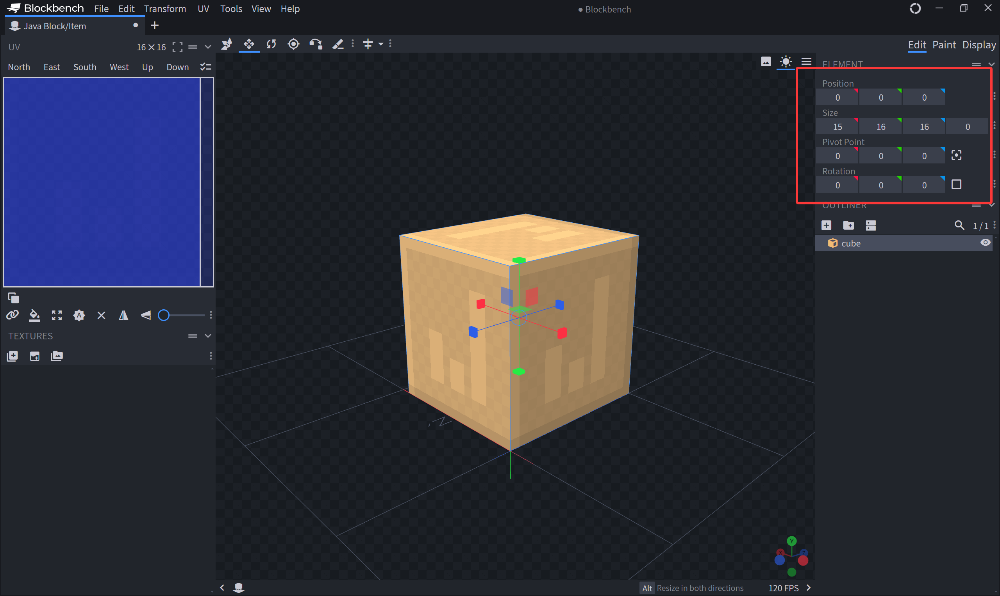

 * **World Space Coordinates**: After the model is placed on the world, the coordinates of the vertices in the world are$16^3$The size of the chunk is a repeating unit, and the value of coordinate is also between 0.0 and 16.0. The Position vertex attribute of most block classes is this coordinate. These coordinates have been pre-processed by the game **Model Transformation** from local space to world space, and there is no need to perform this transformation in vsh.

 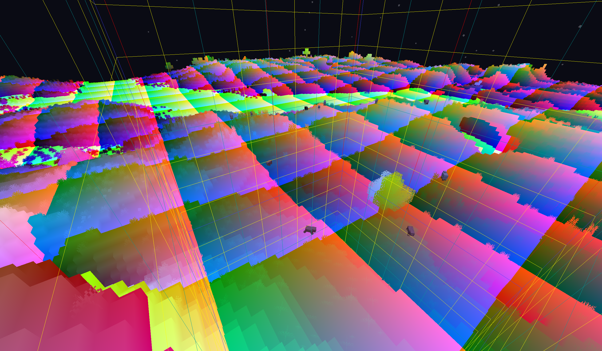

 * **View Space Coordinates**: The coordinates of the vertices in the space with the camera as the origin, the z-axis behind the camera, and the y-axis above. The Position vertex attribute of most entity classes has this coordinate. The Position of the block class obtains this coordinate after **View Transformation**. In order to use view transformation, the coordinate we use here is composed of 4 components **Homogeneous Coordinate (Homogeneous Coordinate)**, in the form$\displaystyle \left(x,y,z,w\right)$The coordinate corresponds to the three-dimensional$\displaystyle \left(\frac{x}{w},\frac{y}{w},\frac{z}{w}\right)$, we will mention why we need to define such a coordinate later.

 _The figure maps xyz to rgb, so the three vertices with negative coordinates appear black, the vertices in the x direction are red, and the vertices in the z direction are blue, and are scaled to 1/64 so that the colors within the four chunks can be distinguished. _

 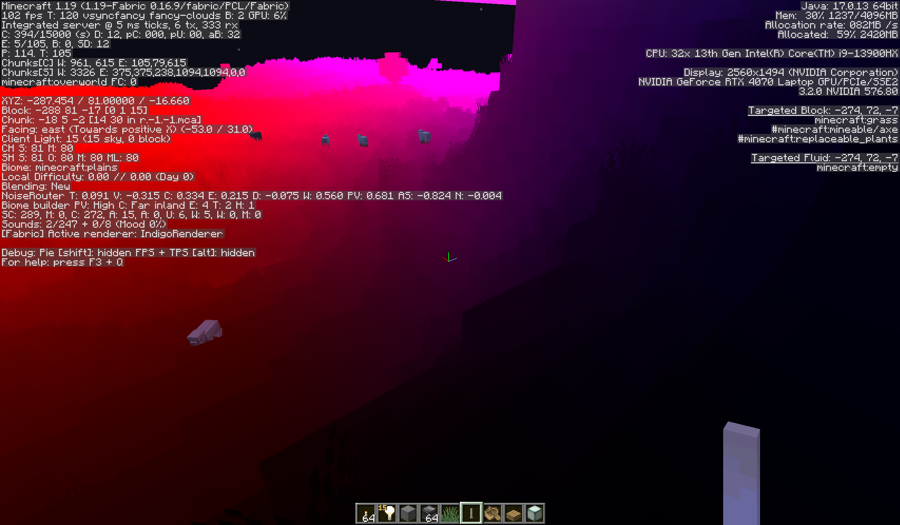
 
 * **Clip Space Coordinates**: The coordinates obtained by the view space coordinates after **Projection Transformation**. That is, the coordinate output by vsh. This space only retains the range of three-dimensional space from`(-1.0, -1.0, -1.0)`arrive`(1.0, 1.0, 1.0)`Vertices within this range, vertices outside this range will be eliminated.

_This picture needs to be understood in conjunction with the projection transformation described later. Please be patient. The tutorial will specifically cover the introduction of this transformation. The "w" in the illustration here is actually the w component of the homogeneous coordinate. We will introduce it later. The text description here shall prevail. "w" can be regarded as "1"_

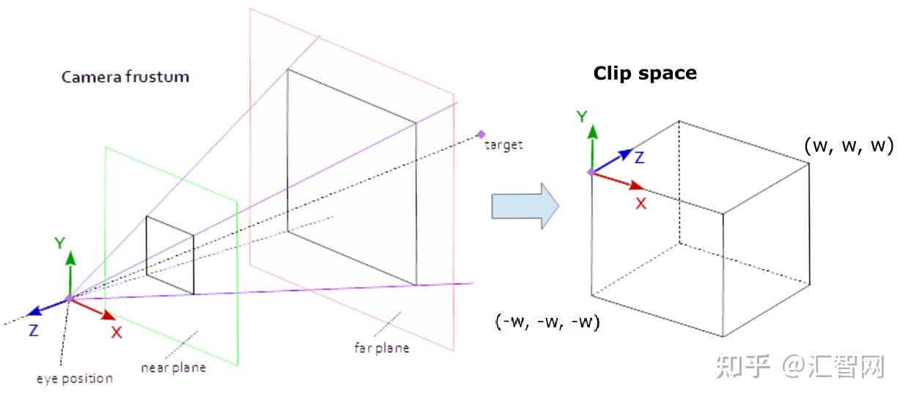

 * **Normalized Device Coordinates (NDC)**: The three-dimensional space coordinate obtained after the clipping space coordinate is processed by **Perspective Division**, that is, the xyz component of the homogeneous coordinate is divided by the w component.

 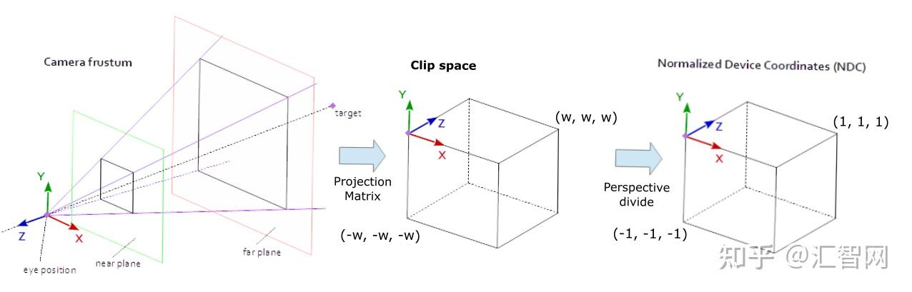

 * **Screen Space Coordinates**: The vertices in NDC are finally mapped to the range from`(0.0, 0.0)`arrive`(1.0, 1.0)`On the two-dimensional screen coordinate,`(0.0, 0.0)`Corresponds to the lower left corner of the screen, and`(1.0, 1.0)`Corresponds to the upper right corner of the screen (if you are not using the screen upside down)

### Shader tasks

Through the overview of the transformation process above, we can summarize the main work of the vertex shader: transform the vertices from world space or view space into clipping space through **model view transformation and projection transformation (collectively called MVP transformation)**.

So, how does the shader do this?

The following is the core part of a typical shader for a rendering block.

_Note: **1.21.6** Above, the uniform variable is provided by the shaderdynamictransforms.glsl (that is, the global volume block mentioned above). Before this, the uniform was directly declared in the shader program. For the convenience of reading, I gave it directly above. _

```glsl
uniform vec3 ModelOffset;
uniform mat4 ProjMat;
uniform mat4 ModelViewMat;

void main() {
    vec3 pos = Position + ModelOffset;
    gl_Position = ProjMat * ModelViewMat * vec4(pos, 1.0);
}
```
Since the terrain is rendered by chunks, the ModelOffset global provides a constant **offset of the camera to the chunk origin** when rendering each chunk.

The model transformation has been done by the game, and the pos in the first line is obtained by adding the Position and chunk offset. From the previous description, we know that Position is the world coordinate within the chunk (can also be regarded as a relative coordinate), and the offset is the vector from the camera to the origin of the chunk. The addition of the two is the coordinate of the vertex centered on the camera. This is the first half of the view transformation.

The naming of ModelViewMat below is confusing. In fact, it only completes the second half of the view transformation, rotating the coordinate system so that the back of the camera becomes the positive z-axis direction, and the top of the camera becomes the positive y-axis direction (right-hand system, of course). ProjMat completes the projection transformation. More specifically, it does **Perspective ​Projection Transformation** .

_Note: MVP in Minecraftshader can also be understood from another perspective, that is, chunk is the "model" in the rendering process, and Position is the local coordinate. The first line is the model transformation that moves the local coordinate to the world coordinate, and the second line is to complete the remaining view transformation and model transformation, but omits the step of moving the coordinate to the camera (because the camera itself is at the origin from this perspective)_

### Matrix transformation

In order to understand the above transformation process, some operating rules related to linear algebra must be introduced here.

First, **What is a vector? ** Everyone has learned vectors in middle school. Column vectors are generally used in linear algebra, such as$\begin{bmatrix} x \\ y \\ z\end{bmatrix}$, this expression is the same as$\left(x,y,z\right)$is equivalent, but note that with row vectors$\begin{bmatrix} x & y & z\end{bmatrix}$Distinguish (the representation of vectors and matrices using parentheses and square brackets is the same). Generally used in GLSL are 2-, 3-, and 4-dimensional vectors. **What is a matrix**? An array of numbers consisting of different columns and rows is a matrix, and a vector can also be thought of as a matrix with only one column. Among them, a matrix with the same number of rows and columns is called a square matrix. Defining these mathematical tools can greatly facilitate operations in shaders.

**The process of matrix·vector is called matrix transformation**. First of all, it must be noted that matrix multiplication is **from right to left**, for example$C \cdot B \cdot A$It represents first A, then B and then C. Obviously, the commutative law is not satisfied in general (but the associative law is satisfied).

In terms of numerical operations, the operation process of matrix and vector is to linearly combine the columns of the matrix with each component of the vector as the weight (that is, add multiple vectors according to a certain weight). \
Or dot multiply the nth row of the matrix with the vector to obtain the nth component of the result vector. These two operations are equivalent.

The operation of matrix A·matrix B is to use A to perform matrix transformation on each column of B, and then combine them together to form a new matrix. \
Or the nth row of A and the mth column of B are dot multiplied to obtain the nth row and m column components of the result matrix.

This operation process is mechanical and easy to remember. I believe students who have studied linear algebra are familiar with it (if you haven’t studied it before, just remember the above operation rules =.=)

Here are examples to help understand the two operations:$$ \begin{aligned} Ax = \begin{bmatrix} 1 & 1 & 4 \\ 5 & 1 & 4 \\ 1 & 9 & 1 \end{bmatrix} \begin{bmatrix} 1 \\ 3 \\ 2 \end{bmatrix} &= 1 \cdot \begin{bmatrix} 1 \\ 5 \\ 1 \end{bmatrix} + 3 \cdot \begin{bmatrix} 1 \\ 1 \\ 9 \end{bmatrix} + 2 \cdot \begin{bmatrix} 4 \\ 4 \\ 1 \end{bmatrix} &&= \begin{bmatrix} 12 \\ 16 \\ 30 \end{bmatrix} \\ &= \begin{bmatrix} (1,1,4)\cdot(1,3,2) \\ (5,1,4)\cdot(1,3,2) \\ (1,9,1)\cdot(1,3,2) \end{bmatrix} &&= \begin{bmatrix} 12 \\ 16 \\ 30 \end{bmatrix} \end{aligned} $$Of course, matrix transformation also has an intuitive geometric understanding, that is, the transformation of space basis vectors. This perspective is especially useful in graphics.

### Basis transformation perspective of matrix transformation

Observe such a matrix transformation process$$ A \cdot \vec v $$We know that any vector can be expressed as a linear combination of a set of basis in this space, that is$$ \vec v = a \hat i + b \hat j + c \hat k $$Since the matrix transformation is linear, the original transformation is equivalent to$$ A \cdot \left(a \hat i + b \hat j + c \hat k \right) = a\left(A \cdot \hat i \right) + b\left(A \cdot \hat j \right) + c\left(A \cdot \hat k \right) $$That is, the new vector is equivalent to the linear combination of the matrix transformation of each basis vector. In particular, for ease of understanding, we set the basis vectors to be standard orthogonal basis$$ \hat \imath = \begin{bmatrix} 1 \\ 0 \\ 0 \end{bmatrix}, \hat \jmath = \begin{bmatrix} 0 \\ 1 \\ 0 \end{bmatrix}, \hat k = \begin{bmatrix} 0 \\ 0 \\ 1 \end{bmatrix} $$So what do these vectors become after being transformed?

Might as well set$$ A = \begin{bmatrix} a & d & g \\ b & e & h \\ c & f & l \end{bmatrix} $$So$$ A \hat i = \begin{bmatrix} a \\ b \\ c \end{bmatrix}, A \hat j = \begin{bmatrix} d \\ e \\ f \end{bmatrix}, A \hat k = \begin{bmatrix} g \\ h \\ l \end{bmatrix}$$Amazing! **The new basis vectors are actually the columns of the matrix! **

Readers with better imagination should have already figured out that the process of matrix transformation is actually to "drag" the standard orthonormal basis to the basis vectors described by each column of the matrix.

Since we are not focusing on mathematics, if there is a term that you don’t understand in the above description, it is recommended to look it up before continuing. In the shader, what we need to master is the **actual operation process of the matrix** and **matrix transformation from the perspective of base transformation**. We do not need to delve too deeply into concepts such as calculation techniques or eigenvalues. For a simple introduction to linear algebra, you can take a look at the "Essence of Linear Algebra" series of videos from 3Blue1Brown that I posted above. From here on, I will assume that the reader has some basic knowledge of linear algebra. If the reader really cannot grasp the mathematical concepts, he can go directly to the conclusion.

### Homogeneous coordinate

The operation process of matrix transformation has been described above. If you pay a little attention, you will find that matrix transformation cannot handle **translation transformation** (any matrix can only move the origin$(0, 0, 0)$Transformed to the same origin position, obviously the translation operation cannot be performed). In order to translate in three-dimensional space, we define a homogeneous coordinate of four components$(x, y, z, w)$, the actual position it represents is$\displaystyle (\frac{x}{w}, \frac{y}{w}, \frac{z}{w})$. In this way, the following translation process can be achieved:$$ \begin{bmatrix} 1 & 0 & 0 & t_x \\ 0 & 1 & 0 & t_y \\ 0 & 0 & 1 & t_z \\ 0 & 0 & 0 & 1 \end{bmatrix} \begin{bmatrix} x \\ y \\ z \\ 1 \end{bmatrix} = \begin{bmatrix} x + t_x \\ y + t_y \\ z + t_z \\ 1 \end{bmatrix} $$At the same time, we also agree that the vector w that only represents the direction is 0, and the vector w that represents the point is 1. This makes the point affected by the translation transformation, but the vector representing the direction is not affected.

## MVP Transformation

Let’s re-examine the MVP transformation from the above matrix transformation perspective.

### ModelViewMat derivation<!-- 
Although we do not yet know what the projection transform is, it is obvious that `ModelViewMat` actually performs only a simple rotation. Deriving its data can, in turn, tell us what information can be read from this matrix.

To make the back of the camera the positive z-axis direction and the top of the camera the positive y-axis direction, we need to record the player's horizontal rotation angle$\theta$ (**yaw angle**) and vertical rotation angle$\phi$ (**pitch angle**). More specifically, we will process the player's yaw first, followed by the pitch.

For rotation, consider a unit circle (a circle with radius 1). Suppose the ray from the origin to a point on the unit circle is obtained by rotating the positive x-axis counterclockwise by an angle $\alpha$ ; then the vector from the origin to a point on the unit circle can be expressed using trigonometric functions as $\left(\cos \alpha, \sin \alpha \right)$

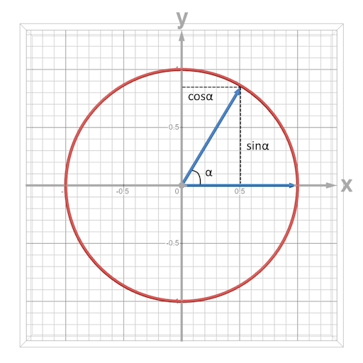

For convenience, we use the player's rotation angles directly as the yaw and pitch (they are offset from the mathematical convention, but this makes it easier to obtain player data).

On this basis, when the player turns their head to the right by $\theta$ , we need to rotate counterclockwise around +y to cancel this effect. y should remain unchanged, while the standard orthonormal bases in the x and z directions are rotated to

$$ A_1 \cdot \hat \imath = A_1 \cdot \begin{bmatrix} 1 \\ 0 \\ 0 \end{bmatrix} = \begin{bmatrix} -\cos \theta \\ 0 \\ -\sin \theta \end{bmatrix} $$
    
$$ A_1 \cdot \hat \jmath = A_1 \cdot \begin{bmatrix} 0 \\ 1 \\ 0
 \end{bmatrix} = \begin{bmatrix} 0 \\ 1 \\ 0 \end{bmatrix} $$

$$ A_1 \cdot \hat k = A_1 \cdot \begin{bmatrix} 0 \\ 0 \\ 1
 \end{bmatrix} = \begin{bmatrix} \sin \theta \\ 0 \\ -\cos \theta \end{bmatrix} $$

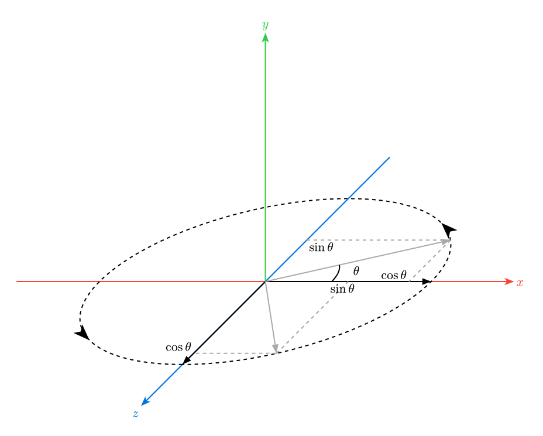

Whether we solve an equation for each entry of A or view it as a basis transformation, we obtain the yaw matrix A. Here we fill the new basis vectors into the columns of the matrix in order

$$ A_1 = \begin{bmatrix} -\cos \theta & 0 & \sin \theta \\ 0 & 1 & 0 \\ -\sin \theta & 0 & -\cos \theta \end{bmatrix}$$

We are dealing with a rotation transformation in three-dimensional space. To represent it in homogeneous coordinates, we need to expand it into a 4x4 matrix, yielding the matrix below -->::: warning derivation removed
Since Mojang adopted somewhat different assumptions from graphics standards, the mathematical derivation here was removed on 26/03/04 to avoid confusion. Readers are no longer required to understand the derivation process and just look directly at the conclusion.
:::

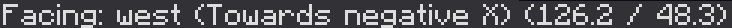

When you open F3, you will see the player rotation information as shown above, which corresponds to playernbt's`Rotation[]`part. In order to facilitate communication with the data pack, we set the yaw angle to the player's`Rotation[0]`, the pitch angle is set to the player's`Rotation[1]`, and name them respectively`yaw`and`pitch`. The player looks towards the +z axis of the world by default, when looking to the right`yaw`increases, then the corresponding inverse yaw matrix is ​​(offsetting the rotation of the camera through inverse rotation):$$ A = \begin{bmatrix} -\cos \theta & 0 & \sin \theta & 0 \\ 0 & 1 & 0 & 0 \\ -\sin \theta & 0 & -\cos \theta & 0 \\ 0 & 0 & 0 & 1 \end{bmatrix} $$When the player looks down`pitch`increases, the corresponding inverse pitch matrix is:<!-- 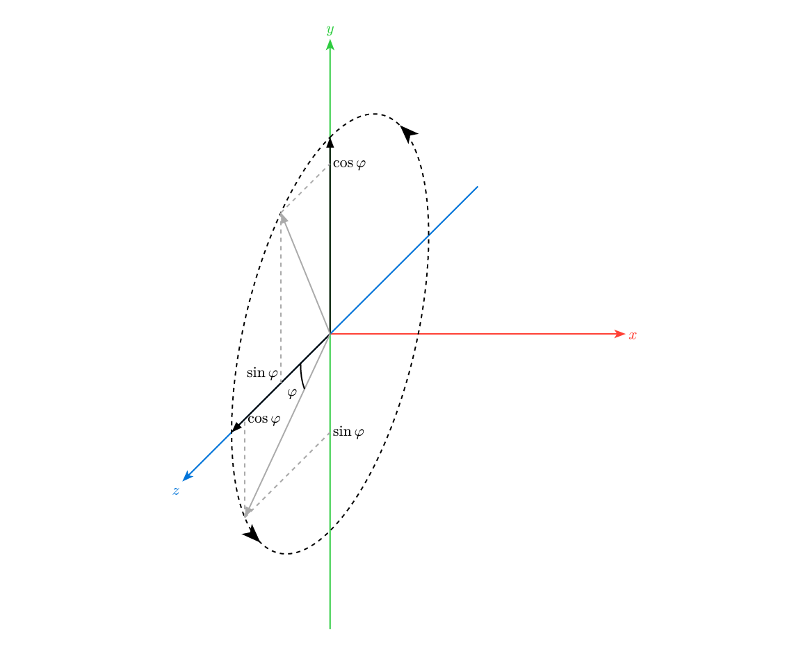 -->

$$ B = \begin{bmatrix} 1 & 0 & 0 & 0 \\ 0 & \cos \phi & -\sin \phi & 0 \\ 0 & \sin \phi & \cos \phi & 0 \\ 0 & 0 & 0 & 1\end{bmatrix} $$Finally we get$$ \text{ModelViewMat} = B \cdot A = \begin{bmatrix} -\cos\theta & 0 & \sin\theta & 0 \\ \sin\theta\sin\phi & \cos\phi & \cos\theta\sin\phi & 0 \\ -\sin\theta\cos\phi & \sin\phi & -\cos\theta\cos\phi & 0 \\ 0 & 0 & 0 & 1\end{bmatrix} $$However, please note that since GLSL internally stores matrices in columns, the code will`ModelViewMat`The acting matrix should be declared as

```glsl
mat4 ModelViewMat = mat4(
    -cos(yaw),  sin(yaw)*sin(pitch), -sin(yaw)*cos(pitch),  0,
        0    ,       cos(pitch)    ,       sin(pitch)    ,  0,
     sin(yaw), -cos(yaw)*sin(pitch), -cos(yaw)*cos(pitch),  0,
        0    ,          0          ,         0           ,  1
);
```
From this, we can:

* from`ModelViewMat`The player's rotation angle Yaw and Pitch are read from each item to provide information for the shader.

* Directly specify a specific view transformation to allow the player to look in a specific direction at the client level without causing jitter.

### ProjMat derivation

A three-dimensional object in Minecraftworld is represented on a two-dimensional screen by projecting it onto a viewing plane.`ProjMat`What we undertake is such a projection process.

#### Orthographic projection

Before understanding perspective projection, we can first learn orthogonal projection, which is a relatively simple projection method. Its characteristic is that there is no near-large or far-small effect**, and the image size of the same object after projection is the same regardless of the distance.

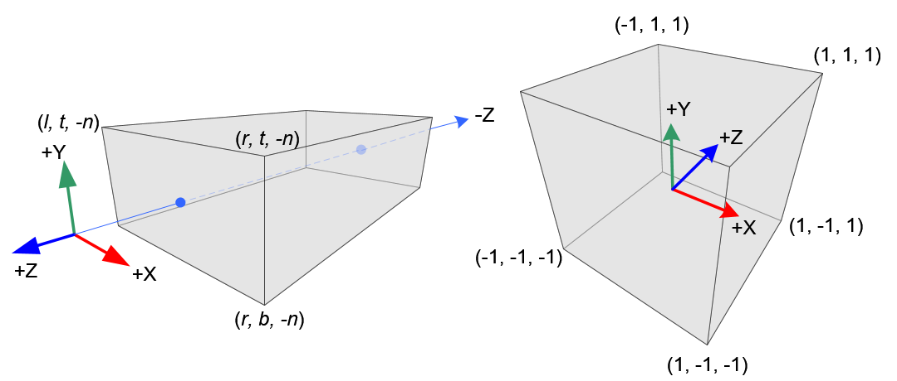

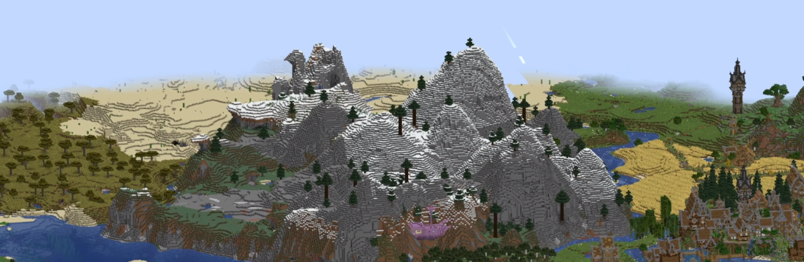

The principle of orthogonal projection is to directly project objects parallel (usually parallel to the Z-axis) onto a plane. The projected area is limited by the six faces of the rectangle. We can use the coordinate of each face projected on the coordinate axis perpendicular to the face`l`,`r`,`t`,`b`,`n`,`f`to define this area.

The function of the orthogonal projection matrix is ​​to map this plane into$(-1,-1,-1)$arrive$(1,1,1)$Within the clipping space, the final clipping space is subjected to perspective division to obtain NDC. There are three steps in total:

 * 1. Move the rectangular center of the orthogonal projection area to the origin. This transformation is recorded as$T$We first calculate the center coordinate of the area$(x,y,z)$, since the coordinates of the six boundaries are known, it is obvious that the coordinate of the midpoint is the mean value of the coordinates of each boundary.$\displaystyle(x,y,z) = (\frac{r+l}{2},\frac{t+b}{2},\frac{f+n}{2})$Combined with the knowledge of translation transformation mentioned earlier, if you want to move the midpoint to the origin, then you need to subtract the coordinate of the midpoint from the coordinate of each point in the three-dimensional coordinate system.$$ T = \begin{bmatrix} 1 & 0 & 0 & -\frac{r+l}{2} \\ 0 & 1 & 0 & -\frac{t+b}{2} \\ 0 & 0 & 1 & -\frac{f+n}{2} \\ 0 & 0 & 0 & 1 \end{bmatrix} $$* 2. Scale the size of the area to [-1,1]^3. This transformation is recorded as$S$We first calculate the size of the current area. In this step, we need to pay special attention to the coordinate axis direction of the view space, and subtract the small coordinate value from the large coordinate value. So we can get the x width of the current area as$(r-l)$, the y height is$(t-b)$, the z-depth is$(f-n)$. The length of each edge of the target area is 2 (from -1 to 1). We can easily get the scaling transformation matrix.

> Note: The location of the near plane is$z = -n$, the location of the far plane is$z = -f$,and$(-n) - (-f) = f - n$, so here we still use the large coordinate minus the small one.$$ S = \begin{bmatrix} \frac{2}{r-l} & 0 & 0 & 0 \\ 0 & \frac{2}{t-b} & 0 & 0 \\ 0 & 0 & \frac{2}{f-n} & 0 \\ 0 & 0 & 0 & 1 \end{bmatrix} $$* 3. Calculate the composite transformation of two transformations$$ M_{Ortho} = S \cdot T = \begin{bmatrix} \frac{2}{r-l} & 0 & 0 & -\frac{r+l}{r-l} \\ 0 & \frac{2}{t-b} & 0 & -\frac{t+b}{t-b} \\ 0 & 0 & \frac{2}{n-f} & -\frac{f+n}{f-n} \\ 0 & 0 & 0 & 1 \end{bmatrix} $$
#### Perspective projection

Different from orthogonal projection, **Perspective Projection** is a projection method that is closer to the photographic results in the real world. It is also the projection method used in most games including Minecraft.

The principle of perspective projection is to connect the vertex and the camera. This connecting line will have an intersection on a virtual plane. This intersection is the image of the vertex under perspective projection.

We call this plane **Near Plane**, and slightly further away there is a farthest plane that can be rendered, called **Far Plane**. The camera and the two planes form a **View Cone (Camera Frustum)**`ProjMat`Its function is to map part of the view frustum consisting of the near plane to the far plane to the clipping space.

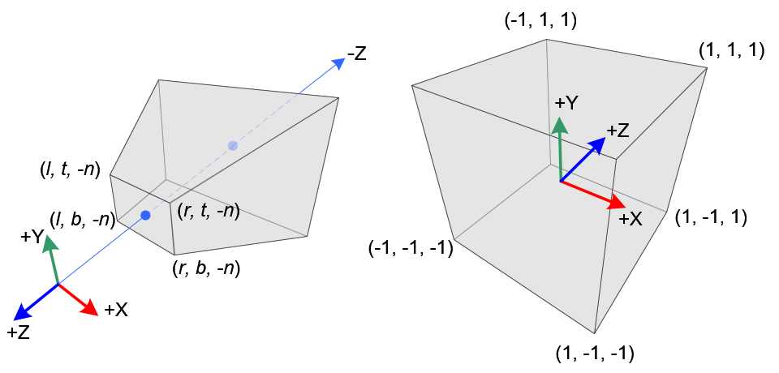

To construct a perspective projection matrix, we can first construct a matrix that converts the view frustum into a rectangular area of ​​orthogonal projection.$ M_{Pers \to Ortho} $. Then, with the above deduced$M_{Ortho}$compound

As shown in the figure below, what this matrix has to do is to transform the prism into a rectangle. In order to obtain the only transformation, we agree on the following two properties:

 * All points on the near plane remain unchanged
 * The zcoordinate of all points on the far plane remains unchanged

Recall the properties of homogeneous coordinate,$(x,y,z,w)$Represents a point in three-dimensional space$(\frac{x}{w},\frac{y}{w},\frac{z}{w})$, it can be found that after scaling the coordinate, it still represents the same point, that is:$$ k(x,y,z,w) = (kx,ky,kz,kw) \to (\frac{kx}{kw},\frac{ky}{kw},\frac{kz}{kw}) = (x,y,z) $$We will use this in the following derivation.

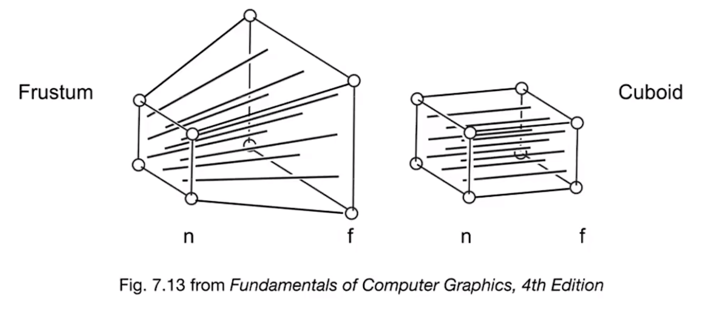

First, we observe the upper part of the view cone from the side. For any point inside the view cone$(x,y,z)$, its projection on the near plane is$(x',y',z')$, from the similarity relationship of triangles we can get that it exists at every point$x'=\frac{n}{z}x，y'=\frac{n}{z}y$The relationship (n is the zcoordinate of the near plane).

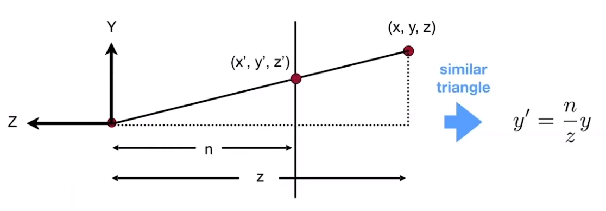

We know that after changing the view frustum into a rectangle, the x and y coordinates of each point will be the same as its projection, but we don’t know how the zcoordinate will change.$$ M_{Persp \to Ortho}\begin{bmatrix} x \\ y \\ z \\ 1 \end{bmatrix} = \begin{bmatrix} \frac{n}{z}x \\ \frac{n}{z}y \\ \text{unknown} \\ 1 \end{bmatrix} \to \text{multiply by }z\text{ to eliminate the denominator} \to \begin{bmatrix} nx \\ ny \\ \text{unknown} \\ z \end{bmatrix} $$If$M_{Persp \to Ortho}$It is a 4x4 matrix, and we can actually fill in part of it.$$ M_{Persp \to Ortho} = \begin{bmatrix} n & 0 & 0 & 0 \\ 0 & n & 0 & 0  \\ ? & ? & ? & ? \\ 0 & 0 & 1 & 0 \end{bmatrix} $$At this time, we need to use the two properties we just agreed on.

* 1. All points on the near plane remain unchanged

We substitute any point on the near plane$(x,y,n,1)$, they will always be mapped to the same location, namely:$$ \begin{bmatrix} n & 0 & 0 & 0 \\ 0 & n & 0 & 0  \\ ? & ? & ? & ? \\ 0 & 0 & 1 & 0 \end{bmatrix} \begin{bmatrix} x \\ y \\ n \\ 1 \end{bmatrix} = \begin{bmatrix} x \\ y \\ n \\ 1 \end{bmatrix} \to multiply by n to keep the format consistent \to \begin{bmatrix} nx \\ ny \\ n^2 \\ n \end{bmatrix} $$The third component of the observation, which is obtained by dot multiplying the third row of the matrix with the vector$$ \begin{bmatrix} ? & ? & ? & ? \end{bmatrix} \begin{bmatrix} x \\ y \\ n \\ 1 \end{bmatrix} = n^2 $$Obviously, the result has nothing to do with x and y, so we know that the first two unknowns must be$0$, you might as well set the last two numbers as$A、B$,Right now$$ M_{Persp \to Ortho} = \begin{bmatrix} n & 0 & 0 & 0 \\ 0 & n & 0 & 0  \\ 0 & 0 & A & B \\ 0 & 0 & 1 & 0 \end{bmatrix} $$and we have$$ \begin{bmatrix} 0 & 0 & A & B \end{bmatrix} \begin{bmatrix} x \\ y \\ n \\ 1 \end{bmatrix} = n^2 \implies nA + B = n^2 $$* 2. The zcoordinate of all points on the far plane remains unchanged.
 
We substitute the midpoint on the far plane, and its z-axis will be mapped to f, which is the original value.$$ \begin{bmatrix} n & 0 & 0 & 0 \\ 0 & n & 0 & 0  \\ 0 & 0 & A & B \\ 0 & 0 & 1 & 0 \end{bmatrix} \begin{bmatrix} x \\ y \\ f \\ 1 \end{bmatrix} = \begin{bmatrix} \frac{n}{f}x \\ \frac{n}{f}y \\ f \\ 1 \end{bmatrix} \to multiply by f to keep the format consistent \to \begin{bmatrix} nx \\ ny \\ f^2 \\ f \end{bmatrix} $$The third component of the observation, which is obtained by dot multiplying the third row of the matrix with the vector$$ \begin{bmatrix} 0 & 0 & A & B \end{bmatrix} \begin{bmatrix} x \\ y \\ f \\ 1 \end{bmatrix} = f^2 \implies fA + B = f^2 $$now we have$$ \begin{cases}
nA + B = n^2 \\
fA + B = f^2 
\end{cases} $$can be solved$$ \begin{cases}
A = n + f \\
B = -nf
\end{cases} $$So we get$$ M_{Persp \to Ortho} = \begin{bmatrix} n & 0 & 0 & 0 \\ 0 & n & 0 & 0  \\ 0 & 0 & n + f & -nf \\ 0 & 0 & 1 & 0 \end{bmatrix} $$Finally, we get$$ \begin{aligned} \text{ProjMat} &= M_{Ortho} \cdot M_{Persp \to Ortho} \\ &= \Large \begin{bmatrix} \frac{2}{r-l} & 0 & 0 & -\frac{r+l}{r-l} \\ 0 & \frac{2}{t-b} & 0 & -\frac{t+b}{t-b} \\ 0 & 0 & \frac{2}{n-f} & -\frac{f+n}{f-n} \\ 0 & 0 & 0 & 1 \end{bmatrix}\begin{bmatrix} n & 0 & 0 & 0 \\ 0 & n & 0 & 0  \\ 0 & 0 & n + f & -nf \\ 0 & 0 & 1 & 0 \end{bmatrix} \\ &= \Large \begin{bmatrix} \frac{2n}{r-l} & 0 & \frac{l+r}{l-r} & 0 \\ 0 & \frac{2n}{t-b} & \frac{b+t}{b-t} & 0 \\ 0 & 0 & \frac{n+f}{n-f} & \frac{2nf}{n-f} \\ 0 & 0 & -1 & 0 \end{bmatrix} \end{aligned} $$In addition to l, r, t, b, n, f describing parameters, more often we use **FOV (field of view)** and **Aspect (aspect ratio)**, n, f to describe. The conversion relationship is as follows:$$ \begin{cases}
t = \tan(\frac{\text{FOV}}{2})\times n\\
b=-t\\
r = t \times \text{Aspect}\\
l = -r
\end{cases} $$If described by FOV, Aspect, n, f, then$$ \text{ProjMat} = \Large\begin{bmatrix} \frac{1}{\tan{\frac{\text{FOV}}{2}\times \text{Aspect}}} & 0 & 0 & 0 \\ 0 & \frac{1}{\tan{\frac{\text{FOV}}{2}}} & 0 & 0 \\ 0 & 0 & \frac{n+f}{n-f} & \frac{2nf}{n-f} \\ 0 & 0 & -1 & 0 \end{bmatrix} $$Back to the shader, from the above derivation, we can know from`ProjMat`Obtain the field of view, aspect ratio, near plane and far plane information to control the shader process.

and`ModelViewMat`Same if you want to construct a play`ProjMat`The matrix of action we need to fill in column by column:

```glsl
mat4 ProjMat = mat4(
    1/(tan(FOV/2)*Aspect)  ,        0      ,       0      , 0,
                0          , 1/(tan(FOV/2)),       0      , 0,
                0          ,        0      ,  (n+f)/(n-f) , -1,
                0          ,        0      , (2*n*f)/(n-f), 0
);
```
From this, we can not only`ProjMat`The player's field of view, aspect ratio and other information can be read from each item. We can also control and modify the projection process, such as using a fixed FOV or switching to orthographic projection.

## Perspective division

The coordinates of the vertices enter the clipping space after MVP transformation and are output to the special variables of OpenGL.`gl_Position`middle. These vertex coordinates will undergo perspective division, that is, dividing the x, y, and z components by the w component to obtain the corresponding three-dimensional coordinates. At this time, the vertices beyond the clipping range will be discarded, and the remaining vertices will enter the NDC coordinate system, undergo viewport transformation, and output to the screen.

At this time, the z value in NDC will be mapped to$\left[0,1\right]$Within the range, write to **Depth Buffer**, which we will cover in detail in future tutorials.

The matrix of the viewport transformation is not given here. Firstly, we do not care about the transformation that is not operated by the shader at this step. Secondly, if the derivation of perspective projection is understood, the derivation of this matrix is ​​not difficult for readers.

## Summary

This tutorial starts from the Position attribute in vsh, and explains the whole process of ModelViewMat and ProjMat participating in the transformation to the final output through mathematical derivation. If you overcome the mathematical difficulties, you will have a deeper understanding of the coordinate system conversion and matrix transformation in the shader after reading this tutorial.

After reading this tutorial, readers should be able to know some of the important data that can be obtained in the shader:

 * Vertex coordinate: read directly`Position`* Yaw angle:`atan(ModelViewMat[2][0] / ModelViewMat[0][0])`* Pitch angle:`atan(ModelViewMat[1][2] / ModelViewMat[1][1])`* Field of view (FOV): angle value output`114.591559 * atan(1 / ProjMat[1][1])`(Quadrants 1 and 4) or`atan(1.0, ProjMat[1][1]) * 114.591559`(Full quadrant)_Note: 114.591559 is the radian angle value coefficient * 2, because ProjMat uses the half-angle of FOV_
 * View frustum aspect ratio:`ProjMat[1][1] / ProjMat[0][0]`* Near plane distance:`ProjMat[3][2]/(1-ProjMat[2][2])`* Far plane distance:`-ProjMat[3][2]/(1+ProjMat[2][2])`* Whether it is a GUI: GUI performs orthogonal projection transformation, and ProjMat is derived from the previous article.$M_\text{Ortho}$. Of course, in GLSL we have to swap rows and columns. We can directly detect`ProjMat[2][3] == 0.0`In future practice, we will often calculate and operate **under a specific coordinate system**, so this section serves as the foundation of the vertex shader and requires mastering more mathematical content. I strongly recommend readers who have no foundation in linear algebra to watch "The Essence of Linear Algebra" by 3b1b, "Painless Line Generation" by Manshi, especially Lecture03 and 04 of GAMES101. These tutorials are not limited in length and are more in-depth and detailed than what I have taught you. GAMES101 is an introductory course in modern computer graphics, which covers the principles and derivation of various transformation matrices in detail.

Of course, the derivation process does not require shader writers to master it. The focus here is still to distinguish the data in the coordinate system and matrix involved in each stage of the code. As we said in the previous section, Minecraftshader's data acquisition is very limited, so we must obtain all the data we need from various global quantities. This includes data such as the perspective in ModelViewMat and the FOV in ProjMat.

The content of this section has reached the most difficult level in the entire tutorial. Future tutorials may be simpler than this one. For example, in the next section we will cover the basic workflow of the fragment shader and explain the remaining Color, UV/UV0, UV2 and Normal vertex attributes with it. These simple contents involve less mathematics and can be completed in one section.

## Appendix - Confusion between column major and row major order

**The linear algebra content we talk about is generally described in row-major order, but in GLSL it is described in column-major order**, that is, the matrix is filled into the GPU memory in columns. If readers try to construct MVP transformations in GLSL code in practice, they will encounter such problems:

If you construct the yaw matrix directly in row-major order$M_\text{Yaw}$and pitch matrix$M_\text{Pitch}$, and used for MVP transformation. (Calculated from right to left)$$ M_\text{Pitch} \cdot M_\text{Yaw} \cdot P $$This is fine from a row-major perspective, but from a column-major perspective in GLSL, this operation is actually in linear algebra:$$ M_\text{Pitch}^T \cdot M_\text{Yaw}^T \cdot P $$symbol here$M^T$Represents **Transpose** , that is, exchanging rows and columns. In particular, our rotation matrix happens to be an **Orthogonal Matrix**, that is, a matrix in which the columns are orthogonal to each other. It has a property that the transpose of an orthogonal matrix is ​​equal to its inverse.

Meaning that the operation we just performed is actually:$$ M_\text{Pitch}^{-1} \cdot M_\text{Yaw}^{-1} \cdot P $$It still yaws first and then pitches, but the direction of each rotation is opposite. This does not cause much visual error, and if you do not check the direction of rotation, you may mistakenly think that the results are as expected.

But if at this time, we want to use a matrix to represent$ M_\text{Pitch} \cdot M_\text{Yaw} $Problems will arise.

We calculate in column major order$M_\text{view} = M_\text{Pitch} \cdot M_\text{Yaw}$, and replace the transformation in the code. What is actually running?$$ M_\text{view}^T \cdot P = (M_\text{Pitch} \cdot M_\text{Yaw})^T \cdot P $$According to the definition of transposition,$(A \cdot B)^T = B^T \cdot A^T$, then our calculation becomes$$ M_\text{Yaw}^T \cdot M_\text{Pitch}^T \cdot P = M_\text{Yaw}^{-1} \cdot M_\text{Pitch}^{-1} \cdot P $$This becomes pitch first, then yaw, and the two rotation directions are also opposite.

Since these operations rotate the object's own coordinate system, the order is important. If you don't understand that the order of two transformations is so important, you can turn your head. If you yaw first and then pitch, you shake your head left and right first, then up and down. At this time, the world will not "slant" in your eyes. But if you change the order, first pitch, then yaw, that is, first nod up and down, and then shake your head left and right along the axis from your chin to the top of your head, then the world will "tilt over." Obviously not as expected.

In particular, when the pitch executed first reaches 90°, the yaw executed later will be directly equivalent to a **Roll** operation. The problem involved behind this is called "universal joint deadlock" or "Eulerian angle deadlock". Interested readers can check it out by themselves.

So when you derive matrices from a row-major perspective, be sure to remember to swap rows and columns when filling in GLSL.

```glsl
mat3 m = mat3(
    1.0, 2.0, 3.0,   //first column
    4.0, 5.0, 6.0,   //second column
    7.0, 8.0, 9.0    //third column
);
```

