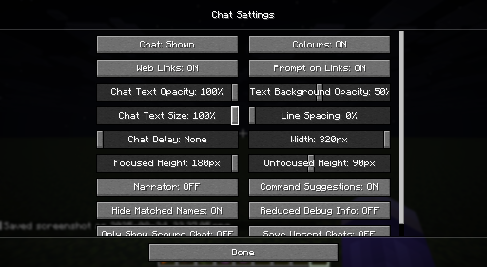
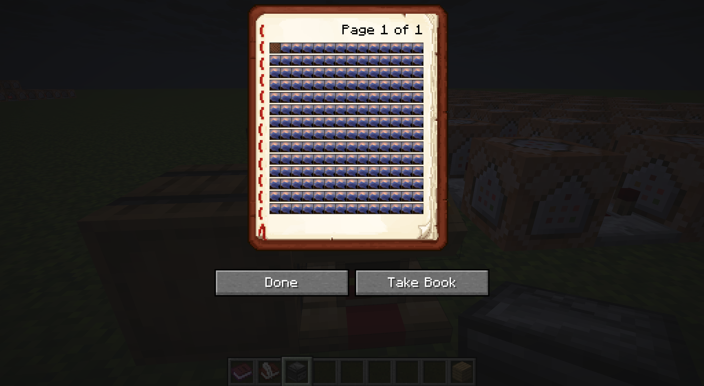
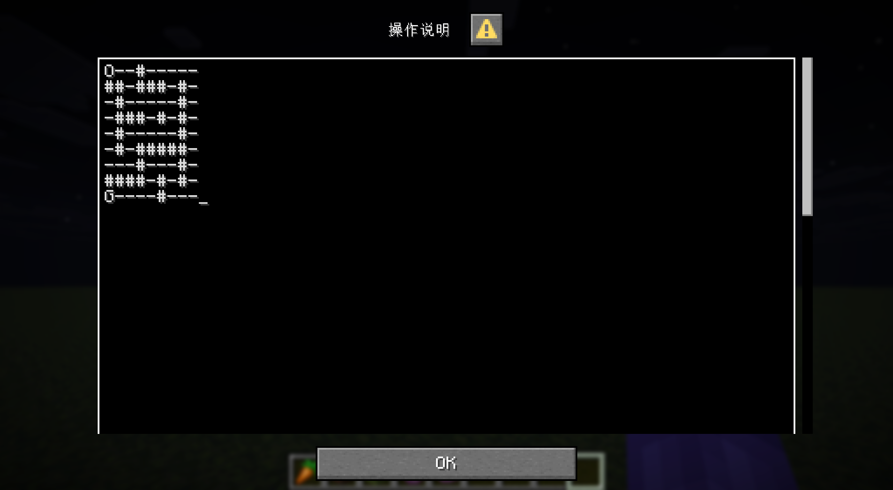
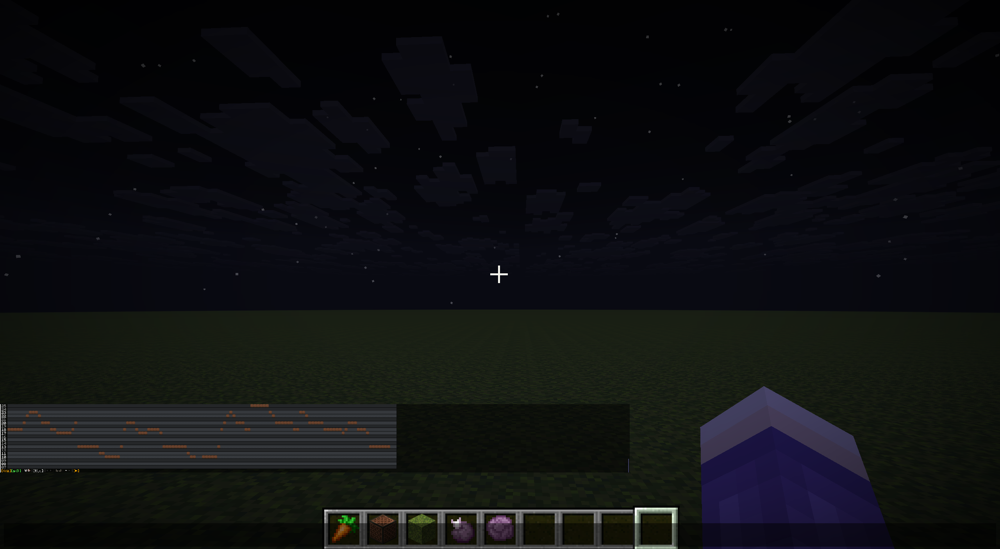
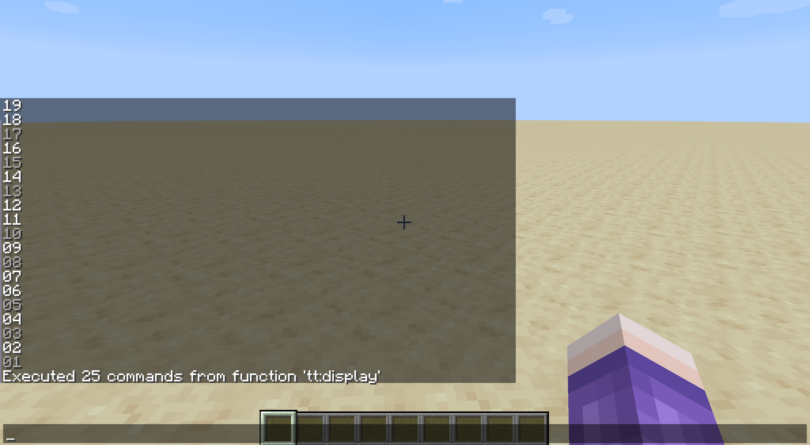
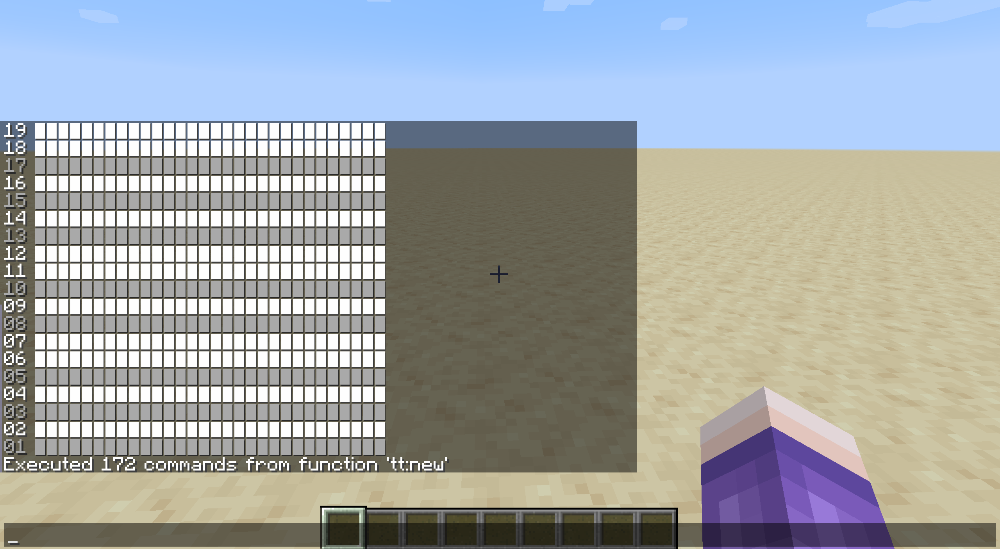
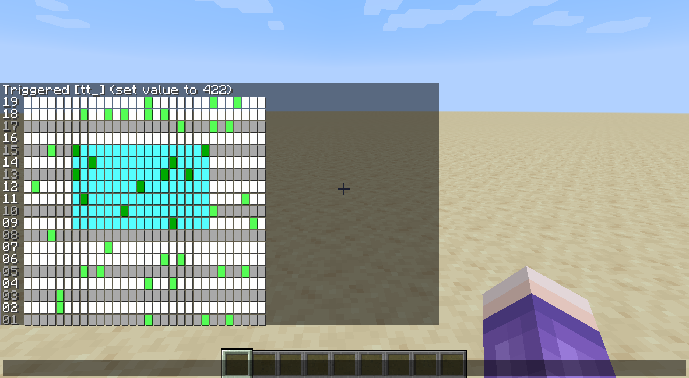

::: tip Translation notice
This page was translated with machine translation and may contain inaccuracies. If you can help improve it, please open an issue or submit a pull request.
:::


<FeatureHead
    title = "Chat Bar Scroll User Interface: Historical Background and Code Implementation"
    authorName = "leather sword"
    cover='../../../../../feature/archive/202509/_assets/5.png'
/>

## summary

From the perspective of command history, the article introduces a user interaction interface that can be implemented as early as version 1.15 - chat bar scrolling user interface, and demonstrates its principle through an example.

## 1. Basic features of the chat bar
### 1.1 Overview of chat bar
The chat bar is an important part of the player interface in the game **Minecraft: Java Edition** (hereinafter referred to as the game). It can usually occupy about half of the player interface in the typing state, and all text displayed in it can be attached with click events, so it can become an important custom input module of the data pack.

The 25w32a snapshot adds a sprite component to the text component, allowing the chat bar to display block, item, GUI button and other textures even without resource pack participation, further expanding the types of content that the chat bar can display. (With the participation of resource pack, this can be achieved by changing the font as early as version 1.5.)
### 1.2 Related settings of the chat bar


The width of the chat bar under the default settings (which is also the maximum width of the chat bar in the settings) is 320px, which means you can continuously input ** up to 160 characters i (character width 1px + character interval 1px) or 40 sprites (width fixed at 8px with no gaps) without triggering automatic line wrapping**. The default line height of a line in the chat bar is 9px (8px + 1px shadow, regardless of the font chosen). The overall height of the chat bar is divided into two types: "focused height" and "fade height", which correspond to the chat bar display in the input state and the non-input state respectively. The default values ​​are 180px (20 lines) and 90px (10 lines) respectively, and the maximum settable value is 180px. Since the cursor is locked at the center of the screen in non-input mode, input by clicking on the screen is usually not possible. Unless otherwise noted, the "height" mentioned below is the focus height.

The chat bar can also set the character size and line spacing. The character size defaults to 100% and can be reduced; the line spacing defaults to 0% (0px) and the maximum is 100% (9px, that is, 1 line occupies the height of 2 lines). In actual display, the line spacing can only be an integer px value, but instead of rounding the generated line spacing, the percentage of the border that may produce the corresponding line spacing is rounded. Therefore, when the line spacing percentage values ​​are 0~10, 11~21, 22~32, 33~43, 44~54, 55~66, 67~77, 78~89, 90~99, and 100, the displayed line spacing is 0~9px respectively, and the corresponding line height is 9~18px respectively. That is, setting the line spacing below 10% has the same effect as setting it to 0%, but setting it to 11% will make the line spacing +1px, even though 9*11%=99%&lt;1.

::: Notice
Although both display in px, the game handles the width and height of the chat bar differently:

The display width of the chat bar always corresponds to the pixel width at **100% character size**, and the display height always corresponds to the pixel height at **current character size**, divided by the current line height and rounded down.

Therefore, if you adjust the character size to 50%, the chat bar can display 2 times the content in the same line, that is, 320 characters i or 80 sprites, but still only display 20 lines of content at 0% line spacing, and only 18 lines of content at 11% line spacing, that is, the row count performance is always the same as at 100% height.
:::
Unless otherwise noted, all the following content is based on the default settings of the chat bar.
### 1.3 Comparison between the chat bar and other UI interfaces that can be modified by data pack
#### 1.3.1 Written as a book


Chengshu is one of the few UI interfaces in the game that can fully execute all the functions of the text component except for the chat bar. According to actual tests, it can support up to 14 lines per page, 57 letters i or 14 sprites placed on each line, and the text also supports click events.

It has some advantages over the chat bar: the interface is centered and has a fixed color shading, making it less susceptible to external background interference; the interaction process does not produce a large amount of invalid content in the game log; the interface comes with forward and backward page turning buttons, and the interface after page turning can still remain stable, and if it is placed on a podium, the page turning behavior can be detected from the podium's blockentity.

In addition to the small interface and unadjustable fonts, the shortcomings are: if the book is not placed on the podium, the interface will be closed immediately after clicking to execute the command, and since playerNBT cannot be modified, content cannot be added directly to the interface. (You can use /give, /item replace to directly replace the book or use /item modify to replace the page content of the book, but you cannot directly use /data to supplement or refresh.) The book placed on the podium does not have this problem, but this behavior will inevitably have an impact on the world, so its scope of use will be subject to some restrictions.
#### 1.3.2 dialog


The dialog introduced in the 25w20a snapshot greatly simplifies the user interaction logic of the data pack, allowing most small-scale input operations to be completed directly using the dialog. By converting the two-dimensional list into a newline string composed of specific characters, you can also use the largest input method in the dialog - multi-line text input to achieve the purpose of editing the two-dimensional list (although compared to the instant refresh interface, it is more like editing a configuration file and is not very interactive).

Of course, since dialog also supports click events, it can also be used to implement UI interfaces that interact with two-dimensional lists. As far as two-dimensional list interaction is concerned, the main disadvantage of dialog is that it does not support text parsing, which means that the number of instructions (load outside the instruction) must be occupied instead of the ability of the instruction itself (load within the instruction) to complete the refresh (or copy) of the page. Under the same MaxCommandChainLength, the available instruction quota of the data pack is reduced in a moment.

## 2. Introduction to the chat bar scroll-style user interface
Under default settings, the chat bar can display 20 rows and 40 sprites per row on the same page. This number even exceeds the size of the clickable area required to make an advanced minesweeper game. Nonetheless, there are still some projects that may require manipulation of 2D lists **larger than this size** on the chat bar, such as implementing drawing, arranging functions, or implementing a 2D game like Terraria.

Simply reducing the character size of the chat bar is not a perfect solution. For a screen with a width of 2560px, when the character size is less than 25%, the displayed Chinese characters will be defective, and when the character size is less than 19%, the numbers and letters will be difficult to identify. Screens with smaller resolutions may have this problem at an earlier position; and, although the click event is still valid when the character size is above 1%, the difficulty of operation and the probability of serialization will increase significantly as the characters shrink. Sometimes it is even necessary to turn on the magnifying glass function to determine the operation position, which will greatly reduce the user experience and even damage the user's visual health. Even so, the benefits of this adjustment for projects are sometimes limited, because many such projects may require a fairly wide two-dimensional list, or even a two-dimensional list with variable length and width.


Using a row height of more than 20 rows (i.e. chat bar history) is not a good solution, because such projects usually require refreshing the page immediately after the operation, and refreshing the page will reset the position of the chat bar. Clicking on a position above 21 rows requires repeated pulling up, causing inconvenience. Therefore, manipulating large two-dimensional lists within limited screen space is of great significance for some large-scale projects.

Based on this requirement, we drew on the ideas of other window interfaces that also display content in limited screen space to create a scroll-style user interface. Its basic logic is consistent with the behavior of readers when reading this magazine on a browser - sliding the interface up and down. By moving the content displayed on the screen as a whole instead of expanding the screen, theoretically unlimited content can be displayed naturally and continuously in a limited window. In fact, as mentioned before, this principle is not only available in the chat bar, but also in other UI interfaces such as books and dialogs mentioned in Section 1.3.


This kind of sliding can be vertical sliding (seen on most mobile phones and computers; the sliding interfaces in games are basically vertical), horizontal sliding (as shown in the picture above, found in composers, video editing software, and most horizontal games; I don’t know if anyone remembers that the Windows 8 series start interface and the sliding interface of many applications are horizontal sliding), or both (such as Microsoft Excel or Paint and other software). The above three types can be divided into variable length and fixed width interfaces (the first two types) and variable length and variable width interfaces (the third type) based on whether there is a constant width.

## 3. Relevant command historical background and historical significance
The /data command was officially added to the 1.13 version snapshot 17w45b, but the /data command at that time was just a direct merger of the original /blockdata and /entitydata commands, and the modify subcommand for fixed-point modification had not yet been introduced.

1.14version snapshot 18w43a introduced the /data modify subcommand, making data pack can start to perform more detailed operations on the list in the NBT data, but the operations provided by this subcommand that can be applied to the list are only set (replacement), append (append to the last item), prepend (append to the first item), insert (fixed-point insertion), and fixed-point modification and deletion functions (the subscripts of all the above fixed-point operations can only be hard-coded, and variables cannot be used). It does not directly provide random reading and writing functions for lists. Nonetheless, this new addition already lays the foundation for a very important user interface for scrolling.

Another important modification in this version is the addition of the text component parsing function, which allows the data pack to directly display text and other content stored in the form of JSON strings through the /tellraw and /title commands. In other words, **18w43aversion has provided all the command base and inspiration required to build a scroll-style user interface**.

The command storage added in 1.15 version snapshot 19w38a (snapshot 19w39a adds text parsing of command storage) greatly reduces the refresh speed of the user interface. Before this, the list to be edited usually had to be stored in the entity and then loaded, and the refresh speed was obviously limited; after using command storage, the refresh can be completed within 1 game moment.

1.20.2 version snapshot 23w31a added the macro function. From now on, you can directly use variables to randomly read and write the NBT list, which means that scroll-style list operations are no longer strictly necessary.

Version 1.21.6 added the dialog function. You can use /dialogcommand to create an operation interface that occupies the entire user interface, and interact with users in a variety of ways. Text with click events can also be created in the dialog, making the operation space wider and no longer restricted by the 20-line height limit of the chat bar.

Nonetheless, as almost the only way to interact with two-dimensional lists directly on the UI interface from 2020 to 2023, the scroll-style user interface is still worth exploring its historical significance, and its ideas are actually also applicable to the editing of variable-scale two-dimensional lists in versions after 2023. At the same time, since the dialog will not support parsing, the chat bar scroll graphical user interface still has its special advantages in terms of its target requirements.

## 4. Implementation basis of scroll-style user interface
### 4.1 List operations
Since the user interface interacts directly with two-dimensional lists, let's first make some comparisons with the way lists are manipulated in data pack.

The time complexity of the three methods listed below are:`O(n)`、`O(logn)`and`O(1)`, the instruction cache complexity is`O(1)`、`O(n)`as well as`O(1)`, but the third method can only be used in versions after 23w31a.

#### 4.1.1 Scroll list operation and random reading and writing
Scrolls are a special set of list operations capable of adapting to variable-length lists, and`O(n)`The time complexity of completing random reading and writing or forward/reverse order traversal. in command storage`test:test1`List as an example:
```mcfunction
data modify storage test: test1 append from storage test: test1[0]
data remove storage test: test1[0]
```

The above operation will move the first element of the list to the end of the list, that is, the entire list is "moved forward" one position. By executing the loop n times, the element with index n in the list can be moved to the position with index 0, so that the element with index n can be read.
```mcfunction
data modify storage test: test1 prepend from storage test: test1[-1]
data remove storage test: test1[-1]
```

The above operation is the opposite. It will move the last element of the list to the first position, that is, the entire list is "moved back" one position. After performing the previous operation, modify the element with subscript 0, and then loop this operation n times to modify the element with subscript n in the list.

The most direct application of this operation is bubble sorting, which is almost the most natural way to sort variable-length lists before the advent of macros:

function1
```mcfunction
scoreboard players set i test 1
execute store result score tot test run data get storage test: test1
execute if score i test <= tot test run function 函数2
```

function2
```mcfunction
scoreboard players set j test 1
execute if score j test < tot test run function 函数3
data modify storage test: test1 append from storage test: test1[0]
data remove storage test: test1[0]
scoreboard players add i test 1
execute if score i test <= tot test run function 函数2
```

function3
```mcfunction
execute store result score t1 test run data get storage test: test1[0]
execute store result score t2 test run data get storage test: test1[1]
execute if score t1 test > t2 test run scoreboard players operation t1 test >< t2 test
execute store result storage test: test1[0] int 1 run scoreboard players get t1 test
execute store result storage test: test1[1] int 1 run scoreboard players get t2 test
data modify storage test: test1 append from storage test: test1[0]
data remove storage test: test1[0]
scoreboard players add j test 1
execute if score j test < tot test run function 函数3
```

The result of running function1 is`test:test1`All elements in the list are sorted from small to large, and the time complexity is fixed to`O(n^2)`。

#### 4.1.2 Binary random reading and writing
When the length of the list is determined, a set of functions can be made for the list of corresponding length to`O(logn)`The time complexity is to complete random read and write operations, but the disadvantage is that n-1 function files are required, half of which will hard-code the read and write operations at each position in the list. Since the game caches function files, this method may occupy a large cache.

This method can be used in conjunction with scrolling operations. If a list of length m*n (m is variable, n is immutable) is turned into a two-dimensional list, it can be`O(mlogn)`The time complexity of`O(n)`Read and write are completed under the complexity of the instruction cache. Some trade-offs can be made between the sizes of m and n to make reading and writing more efficient.

For reasons of space, examples of dichotomous reading and writing are not presented here.

#### 4.1.3 Macro function random reading and writing
This is a result of macro functions introduced in 23w31aversion, variable length lists can now be used`O(1)`The time complexity and instruction cache complexity are used to complete reading and writing, and the traversal complexity is still`O(n)`。

Reading and writing examples are as follows:

function1
```mcfunction
execute store result storage test: _.i int 1 run scoreboard players get i test
function 函数2 with storage test: _
```

function2
```mcfunction
$execute store result storage test: test1[$(i)] int 1 run scoreboard players get t1 test
```

Run function1 to save the scoreboard t1 item to the i-th position in the list.
### 4.2 Display interface
The essence of the scroll-style user interface is that regardless of the size of the two-dimensional array, the number of elements displayed on the screen is limited and clear. Therefore, although the amount of display operations is not small, it can be completed completely in a hard-coded manner.

The following two methods implement a clickable user interface in hard-coded and non-hard-coded ways respectively. The non-hard-coded method can only be used after 23w31aversion due to the use of macro functions.
#### 4.2.1 Hard coding method
Write the following Python code to generate a function file. The function will display the contents of the first 20 rows and first 40 columns of the two-dimensional list test:test1, and update the test_trigger to trigger the click event of the scoreboard. If the organizational order of the two-dimensional list is different, just exchange the i and j at the 269th position.
```python
(lambda width,height:open("文件名.mcfunction","w",encoding="utf-8").writelines('tellraw @s {"text":"","extra":[%s]}\n'%(",".join('{"storage":"test","nbt":"test1[%d][%d]","interpret":true,"click_event":{"action":"run_command","command":"trigger test_trigger set %d"}}'%(i,j,i*width+j) for j in range(width))) for i in range(height)))(40,20)
```

It was too fast and you didn’t see clearly? The above code is basically equivalent to the following.
```python
width=40
height=20
with open("文件名.mcfunction","w",encoding="utf-8") as f:
    for i in range(height):
        f.write('tellraw @s [{{"text":""}}')
        for j in range(width):
            f.write(f',{{"storage":"test","nbt":"test1[{i}][{j}]","interpret":true,"click_event":{{"action":"run_command","command":"trigger test_trigger set {i*width+j}"}}}}')
        f.write(']\n')
```

#### 4.2.2 Non-hard-coding method
This method can only be used after 23w31aversion. It is similar to the previous method, but the difference is that this time you can change the number of rows and columns displayed without modifying the data pack. Function1 only needs to be run once (after the number of rows and columns is changed), and then function4 can be called every time it needs to be displayed.

function1
```mcfunction
data modify storage test: screen set value []
scoreboard players set i test 0
scoreboard players set k test 0
execute store result storage test: _.i int 1 run scoreboard players get i test
execute if score i test < height test run function 函数2
```

function2
```mcfunction
data modify storage test: screen append value {text:"\n"}
scoreboard players set j test 0
execute store result storage test: _.j int 1 run scoreboard players get j test
execute store result storage test: _.k int 1 run scoreboard players get k test
execute if score j test < width test run function 函数3 with storage test: _
scoreboard players add i test 1
execute store result storage test: _.i int 1 run scoreboard players get i test
execute if score i test < height test run function 函数2
```

function3
```mcfunction
$data modify storage test: screen[-1].extra append value {storage:"test:",nbt:"test1[$(i)][$(j)]",click_event:{action:run_command,command:"trigger test_trigger set $(k)"}}
scoreboard players add j test 1
scoreboard players add k test 1
execute store result storage test: _.j int 1 run scoreboard players get j test
execute store result storage test: _.k int 1 run scoreboard players get k test
execute if score j test < width test run function 函数3 with storage test: _
```

function4
```mcfunction
tellraw @s {storage:"test:",nbt:"screen",interpret:true}
```

## 5. Complete implementation of variable-length and fixed-width scrolling user interface: taking the arranger tool as an example
This chapter will be divided into 6 sections, taking a practical requirement: the complete implementation of a "simple arrangement tool" as an example to show how the variable-length and fixed-width scroll-based user interface can be used to create practical projects.

Before that, we clarify the specific requirements for this requirement as follows:

**The game version is developed after 19w39a and before 23w31a (that is, command storage can be used, but macro functions cannot be used). 19w39a is actually used, that is, the data pack developed in this way will be available in versions 1.15 and above. **
::: tip hint
This version choice was deliberate. Using macro functions after 23w31a will reduce the amount of operations to a certain extent, but the version before the emergence of macro functions can highlight the historical significance of this user interface implementation.
:::
The project namespace is tt.
::: warning Notice
It is only for convenience of writing and does not need to be related to any actual work. Actual projects should not use such a simple namespace.
:::
In the author's coding style, loop levels are distinguished by the number of underscores. Readers who use other coding styles should pay special attention to this point.

Since the adjustable pitch of the note block in the game is 2 octaves (25 different pitches), we will implement a scroll-style user interface with 25 rows and a variable number of columns in this data pack, and hard-code each row to correspond to each pitch of the note block instrument harp.

Since the number of rows 25 is less than the maximum number of binary digits of the int type, we can directly save the two-dimensional list processed by this interface into a one-dimensional int type array to save a certain amount of space when not editing a certain music clip.

The user interface will implement the following functions: loading from one-dimensional int array, saving to one-dimensional int array, moving fragments back and forth, moving fragments up and down, single-point editing (mono preview), rectangular area selection, rectangular area overlay/reverse/delete, rectangular area copy-paste/move, add column, delete column, overall preview.
### 5.1 Preparation
#### 5.1.1 Material preparation
The following four interface materials will be prepared in the project, but materials for other operation buttons will not be provided. Readers who want to implement it are asked to organize it themselves. In actual applications, the sprite form after 25w32a can be used for display.

The interface material used this time is the character \u258b (▋), which occupies 6px width (5px self-width + 1px interval) when displayed in the game. If prefixed with a 2-digit serial number, 50 characters can be displayed in one line. Almost the entire space of the user interface will be made up of this material.

The interface material and a numerical item value are placed in the same composite tag to facilitate other functions to read the status of the corresponding position.
::: warning Notice
Before 25w02aversion, SNBT was not compatible with JSON. The JSON content that needs to be parsed can only be passed in string form, so the materials here are all in string form. Readers trying to implement it after 25w02a can directly store the material in SNBT format.
:::
function tt:init/resource (added to minecraft:loadtag)
```mcfunction
data modify storage tt:res inactive set value {display:'{"text":"\\u258b"}',value:0b}
data modify storage tt:res inactive_selected set value {display:'{"text":"\\u258b","color":"aqua"}',value:0b}
data modify storage tt:res active set value {display:'{"text":"\\u258b","color":"green"}',value:1b}
data modify storage tt:res active_selected set value {display:'{"text":"\\u258b","color":"dark_green"}',value:1b}
```

#### 5.1.2 Scoreboard preparation
This project will use 1 variable scoreboard and 1 trigger scoreboard.
function tt:init/_ (added to minecraft:loadtag)
```mcfunction
scoreboard objectives add tt dummy
scoreboard objectives add tt_ trigger
```

#### 5.1.3 Operation interface preparation
The click operation interface of this project is generated using the 4.2.1 hard-coding method, so a Python code is needed to help complete it.

Since the determined number of rows, 25, is slightly larger than the number of available rows in the chat bar (20, but because the original project needs to occupy one row as the operation bar, it is only 19), compared to using the scroll method to move vertically, it is obviously less expensive to directly hardcode 25 rows of screen space and then hide the corresponding columns according to the position. Therefore, we will use a scoreboard variable pos_y (ranging from 0 to 6) to specify the display position. A value of 0 will display lines 1 to 19, and a value of 6 will display lines 7 to 25.

At the same time, we will also display the row number at the beginning of each row and select the display color according to the row number to achieve the purpose of displaying black keys and white keys differently. The interface will display 50 columns of content after the row number.

In order to match the customary arrangement of arrangement tools as closely as possible, we display the rows in order from highest to lowest number.

In addition, since the operation interface only scrolls horizontally, we will store the interface data in columns first and then rows, that is,`screen[j][i]`Represents the i-th row and j-th column to facilitate scrolling operations.

The Python code is as follows (placed in the data pack root directory):
::: warning Notice
Due to the change in the way of writing click events, this part cannot be directly applied to versions 25w02a and above without modification.
:::
```python
open("data/tt/functions/display.mcfunction","w",encoding="utf-8").writelines('\nexecute if score pos_y tt matches %d..%d run tellraw @s {"text":"%02d ","color":"%s","extra":[%s]}'%(max(i-18,0),min(i,6),i+1,["white","gray"][[1,0,1,0,1,0,0,1,0,1,0,0,1,0,1,0,1,0,0,1,0,1,0,0,1][i]],",".join('{"storage":"tt:","nbt":"screen[%d][%d].display","interpret":true,"clickEvent":{"action":"run_command","value":"/trigger tt_ set %d"}}'%(j,i,i*50+j) for j in range(50))) for i in range(24,-1,-1))
```

After completing this step of preparation, you can confirm: set pos_y to 0 in the scoreboard tt, run functiontt:display, if the following interface appears, the operation interface is ready:

#### 5.1.4 Other preparations
Store some important calculation constants and interface length and width information in advance in the variable scoreboard (note: the values ​​of these variables cannot affect the hard-coded content); also make an empty column for later use.

function tt:init/other (added to minecraft:loadtag)
```mcfunction
scoreboard players set height tt 25
scoreboard players set screen_height tt 19
scoreboard players set screen_width tt 50
scoreboard players set preview_notelen tt 6
scoreboard players set 2 tt 2
scoreboard players set -1 tt -1
scoreboard players set 1 tt 1
scoreboard players set 0 tt 0
data modify storage tt: empty_column set value []
data modify storage tt: empty_column append from storage tt:res inactive 
# 请将上一条重复25遍。
```

### 5.2 Load, read and save
#### 5.2.1 Moving columns
This function can be called the core function of the entire scroll interface. The implementation is the same as described above.

We will use the scoreboard item pos_x to track the "position" of the scroll (i.e. how far into the list the element now at position 0 is) and the scoreboard item clip_length to track the clip length.

In order to determine the number of columns to move, we use the scoreboard item target_x to determine the target position (modified by other functions, equivalent to the given parameters), and perform a circular move operation after comparison.
::: tip
Since scroll movement will cause some stored coordinates to move (refer to Carving the Boat and Finding the Sword), we will recalculate the following coordinates accordingly (will be used in later functions):
The minimum/maximum modifiable xcoordinate (min_edit_x and max_edit_x, which can have negative numbers), and the xcoordinate of positions 1 and 2 (selected_pos_x1 and selected_pos_x2) have been selected.

Since other functions may require temporary movement of the scroll but do not want the coordinates to change, we will also provide a temporary version, as long as pos_x remains unchanged before and after the corresponding function is executed.
:::
function tt:move/_
```mcfunction
scoreboard players operation tmp tt = target_x tt
scoreboard players operation tmp tt -= pos_x tt
scoreboard players operation min_edit_x tt -= tmp tt
scoreboard players operation max_edit_x tt -= tmp tt
scoreboard players operation selected_pos_x1 tt -= tmp tt
scoreboard players operation selected_pos_x2 tt -= tmp tt
execute if score pos_x tt < target_x tt run function tt:move/forward
execute if score pos_x tt > target_x tt run function tt:move/backward
```

function tt:move/temp
```mcfunction
execute if score pos_x tt < target_x tt run function tt:move/forward
execute if score pos_x tt > target_x tt run function tt:move/backward
```

function tt:move/forward
```mcfunction
data modify storage tt: screen append from storage tt: screen[0]
data remove storage tt: screen[0]
scoreboard players add pos_x tt 1
execute if score pos_x tt < target_x tt run function tt:move/forward
```

function tt:move/backward
```mcfunction
data modify storage tt: screen prepend from storage tt: screen[-1]
data remove storage tt: screen[-1]
scoreboard players remove pos_x tt 1
execute if score pos_x tt > target_x tt run function tt:move/backward
```

#### 5.2.2 Add Column/Delete Column
This function will also assume the function of loading new fragments.

In order to determine the number of columns to add, we use the scoreboard item target_length to determine the target fragment length, and then perform a cyclic add/delete column operation after comparison.
The addition and deletion operation will not change the existing coordinate, but due to the change in segment length, the maximum modifiable xcoordinate and the maximum xcoordinate will change.

Since the element at the end of the list is not the actual end, the fragment will be moved here so that pos_x is 0 and then moved back after the addition and deletion are completed. Changes will be made after the move.
::: tip hint
Readers who are trying to implement versions after 23w31a can directly edit at the aforementioned maximum modifiable xcoordinate without moving the fragment.
:::
function tt:modify/_
```mcfunction
scoreboard players operation tmp_prev_pos_x tt = pos_x tt
scoreboard players set target_x tt 0
function tt:move/_
scoreboard players operation max_edit_x tt = target_length tt
execute if score clip_length tt < target_length tt run function tt:modify/add
execute if score clip_length tt > target_length tt run function tt:modify/remove
scoreboard players operation target_x tt = tmp_prev_pos_x tt
function tt:move/_
```

function tt:modify/add
```mcfunction
data modify storage tt: screen append from storage tt: empty_column
scoreboard players add clip_length tt 1
execute if score clip_length tt < target_length tt run function tt:modify/add
```

function tt:modify/remove
```mcfunction
data remove storage tt: screen[-1]
scoreboard players remove clip_length tt 1
execute if score clip_length tt > target_length tt run function tt:modify/remove
```

#### 5.2.3 New fragment
This function will add target_length initial columns using the 5.2.2 "Add Column" function after initializing the entire fragment with length 0. We do not create a UI interface for the process of creating new fragments here. Readers who need it can build it by themselves using dialog and other methods.

function tt:new
```mcfunction
scoreboard players set min_edit_x tt 0
scoreboard players set min_pos_x tt 0
scoreboard players set max_pos_x tt 0
scoreboard players set pos_y tt 0
scoreboard players set clip_length tt 0
scoreboard players set mode tt 1
data modify storage tt: screen set value []
function tt:modify/_
function tt:display
```

After completing this step, you can confirm: set target_length to 30 in the scoreboard tt, run functiontt:new, and the following interface will appear, indicating that the first two steps were performed correctly:

#### 5.2.4 Loading fragments from int array
This function will load the entire page from an int array at a fixed position (tt:clip) and complete initialization. The int array stores the note position of the fragment in binary form, occupying a total of 25 binary bits.

Readers in need can additionally implement multi-segment management and switching functions.

function tt:load/_
```mcfunction
scoreboard players set min_edit_x tt 0
scoreboard players set min_pos_x tt 0
scoreboard players set pos_y tt 0
scoreboard players set clip_length tt 0
execute store result score target_length tt run data get storage tt: clip
scoreboard players operation max_edit_x tt = target_length tt
scoreboard players operation max_pos_x tt = target_length tt
scoreboard players operation max_pos_x tt -= screen_width tt
scoreboard players operation max_pos_x tt > 0 tt
data modify storage tt: screen set value []
scoreboard players set clip_length tt 0
execute if score clip_length tt < target_length tt run function tt:load/__
```

function tt:load/__
```mcfunction
data modify storage tt: screen append value []
execute store result score note_tmp0 tt run data get storage tt: clip[0]
scoreboard players set i tt 1
execute if score i tt <= height tt run function tt:load/___
data modify storage tt: clip append from storage tt: clip[0]
data remove storage tt: clip[0]
scoreboard players add clip_length tt 1
execute if score clip_length tt < target_length tt run function tt:load/__
```

function tt:load/___
```mcfunction
scoreboard players operation note_tmp1 tt = note_tmp0 tt
scoreboard players operation note_tmp0 tt /= 2 tt
scoreboard players operation note_tmp1 tt %= 2 tt
execute if score note_tmp1 tt matches 1 run data modify storage tt: screen[-1] append from storage tt:res active
execute if score note_tmp1 tt matches 0 run data modify storage tt: screen[-1] append from storage tt:res inactive
scoreboard players add i tt 1
execute if score i tt <= height tt run function tt:load/___
```

#### 5.2.5 Store fragments into int array
This function is the opposite of 5.2.4 and stores the fragments into an int array. Does not destroy the fragment itself or change any coordinates. In the implementation, the scroll method is used to complete array traversal in the two-level loop process.

Since the length of the second-level loop is constant and not large, readers can also use repeated hard coding to complete the reading and storage.

function tt:save/_
```mcfunction
data modify storage tt: clip set value []
scoreboard players operation tmp_prev_pos_x tt = pos_x tt
scoreboard players set target_x tt 0
function tt:move/_
scoreboard players set i tt 0
execute if score i tt < clip_length tt run function tt:save/__
scoreboard players operation target_x tt = tmp_prev_pos_x tt
function tt:move/_
```

function tt:save/__
```mcfunction
scoreboard players set note_tmp0 tt 0
scoreboard players set j tt 1
execute if score j tt <= height tt run function tt:save/___
data modify storage tt: clip append value 0
execute store result storage tt: clip[-1] int 1 run scoreboard players get note_tmp0 tt
data modify storage tt: screen append from storage tt: screen[0]
data remove storage tt: screen[0]
scoreboard players add i tt 1
execute if score i tt < clip_length tt run function tt:save/__
```

function tt:save/___
```mcfunction
execute store result score note_tmp1 tt run data get storage tt: screen[0][0].value
scoreboard players operation note_tmp0 tt *= 2 tt
scoreboard players operation note_tmp0 tt += note_tmp1 tt
data modify storage tt: screen[0] append from storage tt: screen[0][0]
data remove storage tt: screen[0][0]
scoreboard players add j tt 1
execute if score j tt <= height tt run function tt:save/___
```

### 5.3 Handling user input
The processing part will be executed in a loop every moment, processing the values ​​from the triggered scoreboard and handing them over to a specific function to implement the corresponding function. Triggering the scoreboard to reset to a specific value when processing is complete. (Note that the trigger scoreboard will be automatically set to 0 after being enabled, and reset will automatically disable the trigger scoreboard.) This function also undertakes the task of triggering the 5.4 part of the function every tick. The code is as follows:

function tt:tick/action (added to minecraft:ticktag)
```mcfunction
execute as @a[scores={tt_=0..}] run function tt:tick/_
execute as @a[tag=tt_on_preview] run function tt:preview/_
scoreboard players enable @a tt_
scoreboard players set @a tt_ -3000
```

As mentioned in the overview of this chapter, there are two basic operation methods, single-point editing and rectangular area selection, in the project. Rectangular area selection will also have multiple click events with different meanings. If these editing methods are not distinguished, conflicts will occur.

Therefore, we introduce a variable "mode" to call different types of functions in different situations. The list of modes is as follows:

Insert mode: single-point editing, mode=1.

Selection mode: rectangular selection, mode=2 when no points are selected, mode=3 when 1 point is selected, mode=4 when 2 points are selected.

The corresponding switching relationship is shown in the following ~~determined finite automaton~~ diagram:


Interface clicks in all modes correspond to trigger values ​​greater than or equal to 0, while clicks on the operation bar correspond to trigger values ​​less than 0. Due to the degree of customization, this chapter will not implement the action bar buttons. Interested readers can add relevant logic here.
::: warning Notice
Since automatic mode switching may lead to erroneous early triggering (for example, switching to mode 3 after selecting a point in mode 2 causes the point's coordinate to be incorrectly processed by the execution function of mode 3), we use whether the trigger scoreboard is reset as the basis for judging that the user input has been executed, so each entry will make a trigger scoreboard judgment. Readers who are trying to implement it after 23w31aversion can use return run instead of this operation.
:::
function tt:tick/_
```mcfunction
execute if score @s tt_ matches 0.. run function tt:tick/resolve
execute if score @s tt_ matches 0.. if score mode tt matches 1 run function tt:insert/_
execute if score @s tt_ matches 0.. if score mode tt matches 2 run function tt:select_0/_
execute if score @s tt_ matches 0.. if score mode tt matches 3 run function tt:select_1/_
execute if score @s tt_ matches 0.. if score mode tt matches 4 run function tt:select_2/_
```

After this step is completed, you can conduct a preliminary test: click the screen multiple times. If the pop-up prompts are that the scoreboard has been changed (instead of the red "not allowed" prompt), the loop part is basically correct.
#### 5.3.1 Get click coordinate
The acquisition of click coordinates is closely related to the click_event writing method in the display part.

Before 25w20aversion, click_events that require higher permissions would not pop up reminders. Therefore, you could directly write a function call with parameters in click_event to directly pass the xcoordinate and ycoordinate of the click position, although doing so would directly allow only administrators to operate. (For versions before 23w31a, you need to hardcode a function for each clickable position, which can be generated in batches using a program)

But whether it is facing a wider user population or newer version requirements, using triggers is a more convenient choice, although this means that only one number can be passed in one click, and there must be a function that keeps looping to check the content of the triggered scoreboard.

Since coordinate information requires 2 numbers, we need a way to put 2 numbers into 1 number, and the order of placement will determine the order of reading. But this is actually not a problem, because the number of displayed items is always limited, and the number of rows and columns is actually within control.

Referring to the click_event writing method in 5.1.3, the number i*width+j corresponds to the i-th row and j-th column, which is the content of screen[j][i]. Then we will use the following function to read it as "y-th row and x-th column":

function tt:tick/resolve
```mcfunction
scoreboard players operation click_y tt = @s tt_
scoreboard players operation click_y tt /= screen_width tt
scoreboard players operation click_x tt = @s tt_
scoreboard players operation click_x tt %= screen_width tt
```

#### 5.3.2 Single point editing (preview)
The requirements for this function are: switch the display state of the corresponding click position (inactive to activated, and vice versa), refresh the interface, and play the instrument sound of the corresponding row. So we need to do fixed point editing.

Since the scope of single-point editing is limited to the screen space, all three fixed-point editing methods of 3.1 can be used. We will use the 4.1.1 scroll method here. Interested readers can try other methods.

function tt:insert/_
```mcfunction
scoreboard players operation target_x tt += click_x tt
function tt:move/_
scoreboard players set i tt 0
execute if score i tt < height tt run function tt:insert/__
scoreboard players operation target_x tt -= click_x tt
function tt:move/_
function tt:insert/preview
function tt:display
scoreboard players set @s tt_ -3000
```

function tt:insert/__
```mcfunction
execute if score i tt = click_y tt run function tt:insert/modify
data modify storage tt: screen[0] append from storage tt: screen[0][0]
data remove storage tt: screen[0][0]
scoreboard players add i tt 1
execute if score i tt < height tt run function tt:insert/__
```

function tt:insert/modify
```mcfunction
execute store result score note_tmp1 tt run data get storage tt: screen[0][0].value
execute if score note_tmp1 tt matches 1 run data modify storage tt: screen[0][0] set from storage tt:res inactive
execute if score note_tmp1 tt matches 0 run data modify storage tt: screen[0][0] set from storage tt:res active
```

Preview functionality will also be hardcoded. The Python code is as follows (placed in the data pack root directory):
```python
open("data/tt/functions/insert/preview.mcfunction",'w',encoding="utf-8").write('\n'.join(f'execute if score click_y tt matches {i} run playsound block.note_block.harp record @s ~ ~ ~ 1 {pow(2,-1.0+i/12):.6f}' for i in range(25)))
```

After completing this step of writing, you can click on the screen to test: if the position of the grid that changes color is consistent with the click position, and a sound event of the correct pitch is played, it means the writing is correct. If it is inconsistent, please observe whether the changed color position is symmetrical with the click position about y=x. If so, the processing part has reversed the row and column marks at a certain position.
#### 5.3.3 Rectangular area selection
The requirements for this function are: click two locations on the screen and select a rectangular range determined by the two locations. After the selection is completed, highlight the rectangular range and refresh the interface.
::: tip Notice
Since there may be scroll movement operations between clicking on two positions and before entering the third operation, the first two coordinates may change, and this change has been handled by Section 5.2.1.
:::
function tt:select_0/_
```mcfunction
scoreboard players operation selected_pos_y1 tt = click_y tt
scoreboard players operation selected_pos_x1 tt = click_x tt
function tt:display
scoreboard players set mode tt 3
scoreboard players set @s tt_ -3000
```

When processing the second coordinate, in order to facilitate subsequent processing, the order is adjusted to x1&lt;=x2, y1&lt;=y2, and possible reverse order situations are marked with tags.

The highlighting process is still done using the scroll method.
:::warning Notice
Since the horizontal scroll movement function (tt:move/_) of the "normal version" in Section 5.2.1 will change the stored coordinate position, be sure to use the "temporary change" version function (tt:move/temp) here. Readers who use the macro function method to implement can ignore this item.
:::

function tt:select_1/_
```mcfunction
scoreboard players operation selected_pos_y2 tt = click_y tt
scoreboard players operation selected_pos_x2 tt = click_x tt
tag @s remove tt_select_x_left
execute if score selected_pos_x1 tt > selected_pos_x2 tt run tag @s add tt_select_x_left
execute if score selected_pos_x1 tt > selected_pos_x2 tt run scoreboard players operation selected_pos_x1 tt >< selected_pos_x2 tt
tag @s remove tt_select_y_down
execute if score selected_pos_y1 tt > selected_pos_y2 tt run tag @s add tt_select_y_down
execute if score selected_pos_y1 tt > selected_pos_y2 tt run scoreboard players operation selected_pos_y1 tt >< selected_pos_y2 tt
scoreboard players operation target_x tt += selected_pos_x1 tt
function tt:move/temp
scoreboard players operation i tt = selected_pos_x1 tt
execute if score i tt <= selected_pos_x2 tt run function tt:select_1/__
scoreboard players operation target_x tt -= selected_pos_x2 tt
scoreboard players remove target_x tt 1
function tt:move/temp
function tt:display
scoreboard players set mode tt 4
scoreboard players set @s tt_ -3000
```

function tt:select_1/__
```mcfunction
scoreboard players set j tt 0
execute if score j tt < height tt run function tt:select_1/___
scoreboard players add target_x tt 1
function tt:move/temp
scoreboard players add i tt 1
execute if score i tt <= selected_pos_x2 tt run function tt:select_1/__
```

function tt:select_1/___
```mcfunction
execute if score j tt >= selected_pos_y1 tt if score j tt <= selected_pos_y2 tt run function tt:select_1/modify
data modify storage tt: screen[0] append from storage tt: screen[0][0]
data remove storage tt: screen[0][0]
scoreboard players add j tt 1
execute if score j tt < height tt run function tt:select_1/___
```

function tt:select_1/modify
```mcfunction
execute store result score note_tmp1 tt run data get storage tt: screen[0][0].value
execute if score note_tmp1 tt matches 1 run data modify storage tt: screen[0][0] set from storage tt:res active_selected
execute if score note_tmp1 tt matches 0 run data modify storage tt: screen[0][0] set from storage tt:res inactive_selected
```

After completing this step, you can set mode=2 and try to select a rectangular area. If the corresponding area is highlighted correctly, it means the writing is correct.

#### 5.3.4 Next steps after selection
The operations after selecting the rectangular frame are: deselect, overwrite (all set to active), invert, delete (all set to inactive), paste, and move.
Note what these operations have in common: all require a change to the original position (even deselection), while Paste and Move also require a change to the target position determined by the third click.

So we will divide these operations into two loop parts: source and target. The source part will traverse all selected areas in a specific manner, perform replacements and (if necessary) write to the clipboard; the target part will read from the clipboard and write.

For the paste and move logic, we specially set it to paste to the rectangle formed from the third click of coordinate and from the first click of coordinate to the second click of coordinate to make the operation more natural.

The source code is as follows:

function tt:select_2/source/_
```mcfunction
execute as @s[tag=tt_to_copy] run data modify storage tt: clipboard set value []
scoreboard players operation target_x tt += selected_pos_x1 tt
function tt:move/temp
scoreboard players operation i tt = selected_pos_x1 tt
execute if score i tt <= selected_pos_x2 tt run function tt:select_2/source/__
scoreboard players operation target_x tt -= selected_pos_x2 tt
scoreboard players remove target_x tt 1
function tt:move/temp
```

function tt:select_2/source/__
```mcfunction
execute as @s[tag=tt_to_copy] run data modify storage tt: clipboard append value [B;]
scoreboard players set j tt 0
execute if score j tt < height tt run function tt:select_2/source/___
scoreboard players add target_x tt 1
function tt:move/temp
scoreboard players add i tt 1
execute if score i tt <= selected_pos_x2 tt run function tt:select_2/source/__
```

function tt:select_2/source/___
```mcfunction
execute if score j tt >= selected_pos_y1 tt if score j tt <= selected_pos_y2 tt run function tt:select_2/source/modify
data modify storage tt: screen[0] append from storage tt: screen[0][0]
data remove storage tt: screen[0][0]
scoreboard players add j tt 1
execute if score j tt < height tt run function tt:select_2/source/___
```

function tt:select_2/source/modify
```mcfunction
execute store result score note_tmp1 tt run data get storage tt: screen[0][0].value
execute if score note_tmp1 tt matches 1 run data modify storage tt: screen[0][0] set from storage tt: select_source_active
execute if score note_tmp1 tt matches 0 run data modify storage tt: screen[0][0] set from storage tt: select_source_inactive
execute as @s[tag=tt_to_copy] run data modify storage tt: clipboard[-1] append from storage tt: screen[0][0].value
```

The target part of the code is as follows:

function tt:select_2/target/_
```mcfunction
scoreboard players operation selected_pos_y3 tt = click_y tt
scoreboard players operation selected_pos_x3 tt = click_x tt
scoreboard players operation selected_pos_y4 tt = click_y tt
scoreboard players operation selected_pos_x4 tt = click_x tt
execute as @s[tag=tt_select_x_left] run scoreboard players operation selected_pos_x3 tt -= selected_pos_x2 tt
execute as @s[tag=tt_select_x_left] run scoreboard players operation selected_pos_x3 tt += selected_pos_x1 tt
execute as @s[tag=!tt_select_x_left] run scoreboard players operation selected_pos_x4 tt += selected_pos_x2 tt
execute as @s[tag=!tt_select_x_left] run scoreboard players operation selected_pos_x4 tt -= selected_pos_x1 tt
execute as @s[tag=tt_select_y_down] run scoreboard players operation selected_pos_y3 tt -= selected_pos_y2 tt
execute as @s[tag=tt_select_y_down] run scoreboard players operation selected_pos_y3 tt += selected_pos_y1 tt
execute as @s[tag=!tt_select_y_down] run scoreboard players operation selected_pos_y4 tt += selected_pos_y2 tt
execute as @s[tag=!tt_select_y_down] run scoreboard players operation selected_pos_y4 tt -= selected_pos_y1 tt
scoreboard players operation target_x tt += selected_pos_x3 tt
function tt:move/temp
scoreboard players operation i tt = selected_pos_x3 tt
execute if score i tt <= selected_pos_x4 tt run function tt:select_2/target/__
scoreboard players operation target_x tt -= selected_pos_x4 tt
scoreboard players remove target_x tt 1
function tt:move/temp
```

function tt:select_2/target/__
```mcfunction
scoreboard players set j tt 0
execute if score j tt < height tt run function tt:select_2/target/___
data remove storage tt: clipboard[0]
scoreboard players add target_x tt 1
function tt:move/temp
scoreboard players add i tt 1
execute if score i tt <= selected_pos_x4 tt run function tt:select_2/target/__
```

function tt:select_2/target/___
```mcfunction
execute if score j tt >= selected_pos_y3 tt if score j tt <= selected_pos_y4 tt run function tt:select_2/target/modify
data modify storage tt: screen[0] append from storage tt: screen[0][0]
data remove storage tt: screen[0][0]
scoreboard players add j tt 1
execute if score j tt < height tt run function tt:select_2/target/___
```

function tt:select_2/target/modify
```mcfunction
execute store result score note_tmp1 tt run data get storage tt: clipboard[0][0]
data remove storage tt: clipboard[0][0]
execute if score note_tmp1 tt matches 1 run data modify storage tt: screen[0][0] set from storage tt:res active
execute if score note_tmp1 tt matches 0 run data modify storage tt: screen[0][0] set from storage tt:res inactive
```

See 5.5.3 for each operation entry code. If the content here is difficult to understand, you can combine it with the function content of the operation entrance to understand it. After the writing is completed, you can first write the operation entry function, and then try the operation for functional testing.

### 5.4 Preview playback
The preview playback part will be saved first, and then the saved content will be played. For the preview operation entrance, see Section 5.5.5.

What is implemented here is the playback function, which will maintain a timer at each moment and play a note after the timer expires. This feature is activated every moment by the function in section 5.3.

function tt:preview/_
```mcfunction
execute store result score note_tmp0 tt run data get storage tt: preview_clip[0]
function tt:preview/play
scoreboard players add preview_tick tt 1
execute if score preview_tick tt >= preview_notelen tt run function tt:preview/next
```

function tt:preview/next
```mcfunction
scoreboard players operation preview_tick tt -= preview_notelen tt
execute unless data storage tt: preview_clip[0] run tag @s remove tt_on_preview
data remove storage tt: preview_clip[0]
```

The Python code to generate function tt:preview/play is as follows:
```python
open("data/tt/functions/preview/play.mcfunction",'w',encoding="utf-8").write('\n'.join(f'scoreboard players operation note_tmp1 tt = note_tmp0 tt\nscoreboard players operation note_tmp0 tt /= 2 tt\nscoreboard players operation note_tmp1 tt %= 2 tt\nexecute if score note_tmp1 tt matches 1 run playsound block.note_block.harp record @s ~ ~ ~ 1 {pow(2,-1.0+i/12):.6f}' for i in range(25)))
```

### 5.5 Action bar
This is the final part of this implementation. The operation bar collects various operation entrances. The author will not implement the specific operation bar here, but will list all operation bar entry codes. Readers are asked to configure various buttons by themselves. The reference entry functions are as follows. Executing these functions directly will also realize the corresponding functions:
::: tip hint
When configuring buttons, pay attention to using gray buttons (the same shape as regular buttons but without click_event) to limit the available range of some functions (for example, left and right movement beyond the length of the fragment should not be allowed, so when the position reaches the left and right boundaries, replace the corresponding operation button with a gray button to limit the range of movement), and hide some buttons that are only used in specific modes.
:::
#### 5.5.1 Fragment movement
function tt:bar/x_left
```mcfunction
scoreboard players remove target_x tt 1
function tt:move/_
function tt:display
scoreboard players set @s tt_ -3000
```

function tt:bar/x_right
```mcfunction
scoreboard players add target_x tt 1
function tt:move/_
function tt:display
scoreboard players set @s tt_ -3000
```

function tt:bar/y_up
```mcfunction
scoreboard players add pos_y tt 1
function tt:display
scoreboard players set @s tt_ -3000
```

function tt:bar/y_down
```mcfunction
scoreboard players remove pos_y tt 1
function tt:display
scoreboard players set @s tt_ -3000
```

#### 5.5.2 Mode switching
function tt:bar/toggle_insert
```mcfunction
execute if score mode tt matches 4 run function tt:bar/cancel
scoreboard players set mode tt 1
function tt:display
scoreboard players set @s tt_ -3000
```

function tt:bar/toggle_select
```mcfunction
scoreboard players set mode tt 2
function tt:display
scoreboard players set @s tt_ -3000
```

#### 5.5.3 Operations after rectangular selection
function tt:bar/toggle_copy
```mcfunction
tag @s remove tt_to_move
function tt:display
scoreboard players set @s tt_ -3000
```

function tt:bar/toggle_move
```mcfunction
tag @s add tt_to_move
function tt:display
scoreboard players set @s tt_ -3000
```

function tt:bar/fill
```mcfunction
data modify storage tt: select_source_active set from storage tt:res active
data modify storage tt: select_source_inactive set from storage tt:res active
function tt:select_2/source/_
function tt:bar/toggle_select
```

function tt:bar/invert
```mcfunction
data modify storage tt: select_source_active set from storage tt:res inactive
data modify storage tt: select_source_inactive set from storage tt:res active
function tt:select_2/source/_
function tt:bar/toggle_select
```

function tt:bar/delete
```mcfunction
data modify storage tt: select_source_active set from storage tt:res inactive
data modify storage tt: select_source_inactive set from storage tt:res inactive
function tt:select_2/source/_
function tt:bar/toggle_select
```

function tt:bar/cancel
```mcfunction
data modify storage tt: select_source_active set from storage tt:res active
data modify storage tt: select_source_inactive set from storage tt:res inactive
function tt:select_2/source/_
function tt:bar/toggle_select
```

#### 5.5.4 Save operation
function tt:bar/save
```mcfunction
function tt:save/_
function tt:display
scoreboard players set @s tt_ -3000
```

#### 5.5.5 Preview operation
function tt:bar/preview_start
```mcfunction
function tt:save/_
data modify storage tt: preview_clip set from storage tt: clip
scoreboard players set preview_tick tt 0
tag @s add tt_on_preview
function tt:display
scoreboard players set @s tt_ -3000
```

function tt:bar/preview_pause
```mcfunction
tag @s remove tt_on_preview
function tt:display
scoreboard players set @s tt_ -3000
```

function tt:bar/preview_resume
```mcfunction
tag @s remove tt_on_preview
function tt:display
scoreboard players set @s tt_ -3000
```

## 6. A brief introduction to the variable-length and variable-width scroll-style user interface
This chapter will briefly mention the variable length and variable width scroll user interface, and will not give the complete implementation of the variable length and variable width scroll user interface, but the implementation steps are not much different from Chapter 4.

The difference between variable length and width scroll-based user interfaces is mainly reflected in the fact that they are not only variable in length (number of horizontal directions), but also variable in width (number of vertical directions). In addition to horizontal movement, it also has the need for vertical movement.

The important problem is that no matter whether a row or a column is selected as the first level of the list, there will always be one side of the list that requires many scroll operations to perform one move. When the length and width of the interface are large, the time-consuming of a single operation may become unacceptable (if you know that the scale is not large, you can ignore all the content after this chapter).

At this point we need to return to the core idea of ​​the scroll-style user interface: no matter the length or width of the two-dimensional list, the content that can be displayed on the screen is always limited.

From this we can have an idea, which is to reduce invisible mobile operations while limiting the speed of mobile operations.

Let the list size be`M*N`, the screen size is`m*n`，`M,N>>m,n`. Assuming that the selected row is the first level, one operation performs one vertical movement, and M operations perform one horizontal movement. Among these M operations, there are`M-m`The times are invisible to the user interface.

At this time, we consider storing a scroll position for each row. Each horizontal movement only performs visible m operations and updates ycoordinate. The value of m is acceptable.

Assuming that t horizontal movements are performed, the value of t will usually not be very large. At this time, one vertical movement will correspond to t horizontal movements. This efficiency is basically acceptable.

If possible, other functions will be optimized based on this idea. Of course, we need to admit that this type of user interface is still subject to various limitations such as overall memory space and instruction execution, and cannot expand infinitely, but related thinking may still be used in actual project development.
## 7. Some other details about the chat bar user interface
### 7.1 Splash screen
When the chat bar UI uses trigger input, a splash screen issue occurs under default settings.

This problem occurs mainly due to`click_event`The command execution will send feedback immediately, while the detection function can only refresh the interface every moment. Since the feedback content is usually only one line, it will move all the information in the chat bar up by one line in a short time, causing a splash screen to appear.

Usually the game rules can be directly`SendCommandFeedback`(Added in version 1.8) Set to False to prevent the trigger from automatically sending messages, but this will also block feedback from other instructions, which is very detrimental to debugging.

There is also a more clever way to avoid flickering screens while still allowing command feedback. This method is updated using 1.13-pre7version`/scoreboard objectives modify displayname`command, after each display, set the first 19 lines of the displayed content as the name of the trigger (parsing is supported). In this way, after the click event is triggered, a 21-line trigger feedback will be sent. Among the 20 lines displayed on the screen, 19 lines are consistent with the content originally displayed on the interface, thus avoiding the splash screen problem.

### 7.2 Log accumulation
Since the content of the chat bar will be synchronized with the game log, log accumulation problems will inevitably occur when the chat bar user interface is refreshed. However, these logs are generated by the client, so generally speaking they will not have a big impact on game operation. You only need to turn off the log output.

As for the history of the chat bar itself, usually only 100 records are kept, so there is usually no need to clear the screen deliberately.
## 8. Summary and Outlook
Some people may have questions: Since there are already direct interaction solutions like dialog and features that facilitate development such as macro functions, why do we need to go back to the 1.15 version 6 years ago to discuss the implementation of the interactive interface of the old version?

It is undeniable that the dialog and macro function features are indeed very convenient for development. Using these features, I can easily create the [full version] of the Chapter 5 project (https://www.planetminecraft.com/data-pack/popped-chorus-music-composition-tool-with-gui/), and also uses the latest sprite map features. However, for people like me who have witnessed the development of the game from single-digit versions (or even test versions) to the present, the era 6 or even 7 years ago is actually very memorable.

At that time, data pack was a new thing in its infancy, developed from the function system originally created for advancement in 1.12 version (yes, I also tried to write the "pre-data pack" of 1.12 version). Perhaps it was due to the module window period brought about by the major overhaul of version 1.13. In version 1.14, the data pack developed rapidly, and a large number of new gameplay methods appeared.

After each version was updated, Pack_Format went from 4, 5, 6 (do you remember that one version had two data pack version numbers in 1.16), 7, 8, 10, to 15, 26, 48 and now 84.0. Although many newer and more convenient command features have been added, with the inflation of version numbers comes greater (perhaps bloated) technical content decentralization and lower cross-version compatibility. As a temporary replacement for the module at that time, the data pack is gradually experiencing the version fault that the module once experienced. The data pack that has not been updated may be gradually forgotten by people as the version changes.

Maybe my view here is slightly biased, but no matter what, what we all have in common is the nostalgia for that era itself. Although that era was not necessarily perfect, and although game versions continued to iterate and new features continued to emerge, as long as the previous version still exists, the obsession from that era will always drive generations of data pack developers to continue to explore new features and create new gameplay.
