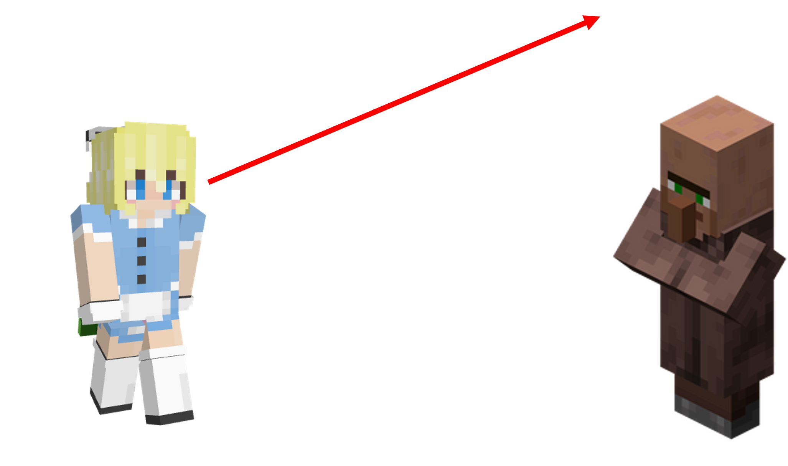
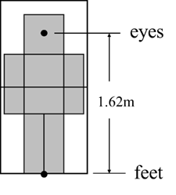

::: tip Translation notice
This page was translated with machine translation and may contain inaccuracies. If you can help improve it, please open an issue or submit a pull request.
:::


<FeatureHead
    title = "Entity anchor point and execution anchor point in command"
    authorName = "Xu Muxian"
    cover='../../../../../feature/archive/202509/_assets/6.png'
/>


## summary
The research content of this article comes from a data pack joke:
Mojang employees were taught when they were young that when looking directly into other people's eyes, they should look into the air above their heads. After observation, they discovered that they defaulted to using their own feet as eyes and used their own feet to look into other people's eyes.

## introduction
`/rotate` is a command used to change the orientation of an entity. When it is used to rotate an entity to face another entity, the syntax is:
````
rotate <target> facing entity <facingEntity> [<facingAnchor>]
````

The parameter `[&lt;facingAnchor&gt;]`is of type entity anchor point, and the available parameters`feet`and`eyes` are used respectively for the feet and eyes of the target entity. If a beginner command needs to face the eyes of the nearest villager, due to human reading and writing habits, he is likely to write the command as:
````
rotate @s facing entity @n[type=villager] eyes
````

However, after the command is actually executed, the player's view is as shown below:

If the parameter `eyes` is removed:
````
rotate @s facing entity @n[type=villager]
````

From the perspective, the player seems to be really facing the villagers' eyes. However, if you replace the villagers with endermen and copy them according to the above command format:
````
rotate @s facing entity @n[type=enderman]
````

It doesn't actually make the player face the eyes of the enderman, so this solution is not universal. The principles and solutions will be introduced below.

## principle
### entity anchor point
**entity anchor point (Entity Anchor)** is the **point** used for positioning on the entity. There are two available entity anchor points: feet and eyes. As the name suggests, the feet are located at the bottom center point of the entity's collision box. This position is actually the position of the entity itself, and is also the **entity anchor point used by default**. The eye is located at the center point of the collision box at the height of the entity's eye.
The position of the eyes and feet in the horizontal direction is the same.$y$On the axis, the height of the entity's eyes is the difference between the height of the eyes and feet.

For the player, the height difference between his eyes and feet is about 1.62 blocks, as shown in the picture above. However, the eye heights of different entities are actually inconsistent. It cannot be generally assumed that the eye heights of all entities are 1.62 grids.

### execution anchor
Correspondingly, the anchor point is also part of the command context parameters and is the **execution anchor point (Execution Anchor)**. It affects the command execution result together with the execution position and execution direction.
If the execution position is where an entity is located, the foot and the execution position actually coincide. In fact, in all commands, the execution anchor point is the foot by default. Regardless of whether the anchor point is modified to an eye, the execution position must be at the bottom center point of the entity's collision box and will not change as the anchor point changes.
The execution anchor point has fewer application scenarios than the execution position. It only affects the local coordinate, entity orientation and execution orientation, thereby affecting the execution results of the `facing`sub-commands of the three commands`/tp`, `/rotate`and`/execute`. When the anchor point is the foot, the origin of the relative coordinate and local coordinate, the entity orientation, and the starting point of the execution orientation are all at the execution position (foot). When the anchor point is the eye, the origin of the relative coordinate is at the execution position, which is the foot; the origin of the local coordinate, the entity orientation and the starting point of the execution orientation are at the eye**.
Here is an example to further illustrate:
````
execute as @a at @s anchored eyes run setblock ~ ~ ~ stone
````

This command sets the execution anchor point to the player's eye, and the execution position is still the center point of the bottom of the player's collision box. This position is used by relative coordinate`~~~`, so the stone will be placed in the block where the player's lower body is.
````
execute as @a at @s anchored eyes run setblock ^ ^ ^ stone
````

The execution anchor point is also set to the player's eyes, but `^ ^ ^` uses the execution anchor point, so the stone will be placed in the block where the player's upper body is.

## explain
The examples presented in the "Introduction" section are explained below.
````
rotate @s facing entity @n[type=villager] eyes
````

This command has no modified execution anchor point, so the default anchor point is the foot of the player (`@s`). The starting point of the orientation is the feet, and the end point is the `eyes` of the villager specified by command. This is the player's orientation:

Since the height of the villager's eyes is the same as that of the player, for the following command:
````
rotate @s facing entity @n[type=villager]
````

The starting point of the orientation is the player's feet, and the end point is the villager's feet by default. The line of sight is horizontal, allowing the player to look directly into the villager's eyes. However, for entities whose eye height is not 1.62 blocks, this command cannot achieve the expected effect. So this way of writing is not rigorous.
The most rigorous way to write it is to set the execution anchor point directly to the player's eyes, and make the player face the villagers' eyes:
````
execute anchored eyes run rotate facing entity @n[type=villager] eyes
````


## References
- [1] https://zh.minecraft.wiki/w/%E5%91%BD%E4%BB%A4%E4%B8%8A%E4%B8%8B%E6%96%87
- [2] https://zh.minecraft.wiki/w/%E5%91%BD%E4%BB%A4/rotate
- [3] https://zh.minecraft.wiki/w/%E5%91%BD%E4%BB%A4/execute
