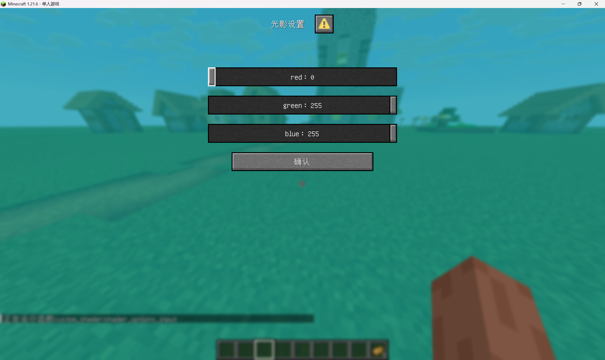

<FeatureHead
    title = "data pack passes parameters to resource packshader"
    authorName = "MC is seeking death for the Wolf King"
/>


## Part 1 - The Power of My Thoughts

First create a mcresource pack

[Basic tutorial on creating resource pack](https://zh.minecraft.wiki/w/Tutorial:%E5%88%B6%E4%BD%9C%E8%B5%84%E6%BA%90%E5%8C%85?variant=zh-cn)

The part that our resource pack needs to do is the shader

[mcwikishader part](https://zh.minecraft.wiki/w/%E7%9D%80%E8%89%B2%E5%99%A8)

The shader is divided into a core shader and a post-processing shader. The post-processing shader controls the rendering pipeline in the assets/minecraft/post_effect directory. There are a total of
| json file | function |
| :----- | :------- |
| blur.json | gui background blur |
| creeper.json | Spectator mode creeper perspective |
| entity_outline.json | Luminous entity stroke rendering |
| invert.json | Spectator mode Enderman perspective |
| spider.json | Spectator mode spider perspective |
| transparency.json | Excellent image quality rendering |

It is not difficult for smart friends to find that transparency is a permanent rendering mode that can be maintained during normal play (turning on excellent image quality)
| framebuffer |
| :----- |
|main - the framebuffer of the main part of the game |
|translucent - Bind translucent framebuffer |
|item_entity - bind itemity framebuffer |
|particles - bound particle framebuffer |
|weather - bind weather framebuffer |
|clouds - Bind cloud framebuffer |

After careful consideration, particles are a more convenient and controllable part, and the core shader contains particles.fsh and particles.vsh.

To customize and judge a special particle, we need some properties of the particle, such as transparency, check the wiki

[Particle Data Format](https://zh.minecraft.wiki/w/%E7%B2%92%E5%AD%90%E6%95%B0%E6%8D%AE%E6%A0%BC%E5%BC%8F)

Color particle options can customize RGBA,`entity_effect`and`tinted_leaves`Color particle options are available for particles, but unfortunately there is a bug.`tinted_leaves`The A value of is actually always 1.0, so you can only use`entity_effect`## 1. Basics of particle vertex shader modification

Unzip the mc jar file and find it in the directory`assets/minecraft/shaders/core/`turn up`particle.vsh`and`particle.fsh`, copy it into your own resource pack.

This is`particle.vsh`, the vertex shader of the particle

```glsl
#version 150

#moj_import <minecraft:fog.glsl>
#moj_import <minecraft:dynamictransforms.glsl>
#moj_import <minecraft:projection.glsl>

in vec3 Position;
in vec2 UV0;
in vec4 Color;
in ivec2 UV2;

uniform sampler2D Sampler2;

out float sphericalVertexDistance;
out float cylindricalVertexDistance;
out vec2 texCoord0;
out vec4 vertexColor;

void main() {
    gl_Position = ProjMat * ModelViewMat * vec4(Position, 1.0);

    sphericalVertexDistance = fog_spherical_distance(Position);
    cylindricalVertexDistance = fog_cylindrical_distance(Position);
    texCoord0 = UV0;
    vertexColor = Color * texelFetch(Sampler2, UV2 / 16, 0);
}
```
If you don’t understand mcshader, you can check out mcwiki.

[mcwikishader part](https://zh.minecraft.wiki/w/%E7%9D%80%E8%89%B2%E5%99%A8)

`Position`It is the coordinate with the player as the origin of the coordinate system.`ModelViewMat * vec4(Position, 1.0)`What is obtained is the coordinate of the particle in the eye coordinate system`ProjMat * ModelViewMat * vec4(Position, 1.0)`What is finally obtained is the particle coordinate under the NDC coordinate system, which is to be clipped.

gl_VertexID is built into glsl, which can obtain the current vertex index, and particles are all quadrilaterals, so the vertex index can determine which point of the particle the current vertex is on.

We might as well give it a try and change particle.vsh to the following code

```glsl
#version 150

#moj_import <minecraft:fog.glsl>
#moj_import <minecraft:dynamictransforms.glsl>
#moj_import <minecraft:projection.glsl>

in vec3 Position;
in vec2 UV0;
in vec4 Color;
in ivec2 UV2;

uniform sampler2D Sampler2;

out float sphericalVertexDistance;
out float cylindricalVertexDistance;
out vec2 texCoord0;
out vec4 vertexColor;

const vec2 quadCorners[4] = vec2[4](
    vec2(1.0, -1.0),
    vec2(1.0, 1.0),
    vec2(-1.0, 1.0),
    vec2(-1.0, -1.0)
);

void main() {
    vec4 clipSpacePos = vec4(0, 0, -1, 1);
    clipSpacePos.xy += quadCorners[gl_VertexID%4];
    gl_Position = ProjMat * clipSpacePos;
    sphericalVertexDistance = fog_spherical_distance(Position);
    cylindricalVertexDistance = fog_cylindrical_distance(Position);
    texCoord0 = UV0;
    vertexColor = Color * texelFetch(Sampler2, UV2 / 16, 0);
}
```
This string of code maps particles to a fixed position in front of you, ensuring that subsequent particles will not be clipped.

Then pin the particles to the upper right corner of the screen.

```glsl
#version 150

#moj_import <minecraft:fog.glsl>
#moj_import <minecraft:dynamictransforms.glsl>
#moj_import <minecraft:projection.glsl>
#moj_import <minecraft:globals.glsl>

#define RESOLUTION_FACTOR 500

in vec3 Position;
in vec2 UV0;
in vec4 Color;
in ivec2 UV2;

uniform sampler2D Sampler2;

out float sphericalVertexDistance;
out float cylindricalVertexDistance;
out vec2 texCoord0;
out vec4 vertexColor;

const vec2 quadCorners[4] = vec2[4](
    vec2( 1.0, -1.0),
    vec2( 1.0,  1.0),
    vec2(-1.0,  1.0),
    vec2(-1.0, -1.0)
);

void main() {
    //Initialize the clipping space position, located in the center of the view
    vec4 clipSpacePos = vec4(0.0, 0.0, -1.0, 1.0);
    
    //Get the corresponding angular offset based on the current vertex index
    vec2 cornerOffset = quadCorners[gl_VertexID % 4];
    
    //Apply angular offset to xycoordinate
    clipSpacePos.xy += cornerOffset;
    
    //Calculate the offset (0 to 1) used to adjust the projection, mapping (-1,1) to (1,0)
    vec2 ndcCornerOffset = (vec2(1.0) - cornerOffset) * 0.5; 
    
    //Calculate screen space offset (in pixels)
    vec2 screenOffset = ndcCornerOffset / ScreenSize;
    
    gl_Position = ProjMat * clipSpacePos;
    gl_Position.xy = gl_Position.w * (vec2(1.0) - screenOffset * vec2(RESOLUTION_FACTOR));
    
    sphericalVertexDistance = fog_spherical_distance(Position);
    cylindricalVertexDistance = fog_cylindrical_distance(Position);

    texCoord0 = UV0;
    vertexColor = Color * texelFetch(Sampler2, UV2 / 16, 0);
}
```
Here we join`#moj_import &lt;minecraft:globals.glsl&gt;`,can be used`ScreenSize`Get screen resolution,`RESOLUTION_FACTOR`is the resolution factor at which particles are rendered in the upper right corner. This piece of code allows you to render particles in a fixed area of ​​​​500x500 resolution in the upper right corner of the screen. If it is only used for transmission, 2x2 resolution is sufficient. 1 pixel may not be drawn due to loss of accuracy.

But we hope that only the marked particles will be moved to the upper right corner of the screen. We can generate special particles through data pack.`entity_effect`Particles, for example, pass in a value of 0.114 and pass it through the shader`Color.a`judge.

## 2. In conjunction with the data pack part, the particle parameter data enters the shader.

[Basic tutorial on making data pack](https://zh.minecraft.wiki/w/Tutorial:%E5%88%B6%E4%BD%9C%E6%95%B0%E6%8D%AE%E5%8C%85?variant=zh-cn)

This chapter assumes that you already have basic knowledge of data pack production.

Write this in the mcfunction file that will be executed every tick in the data pack`execute as @a at @s run particle entity_effect{color:[1.0,1.0,1.0,0.114]} ~ ~ ~`Then change the particle vertex shader to the following code

```glsl
#version 150

#moj_import <minecraft:fog.glsl>
#moj_import <minecraft:dynamictransforms.glsl>
#moj_import <minecraft:projection.glsl>
#moj_import <minecraft:globals.glsl>

#define RESOLUTION_FACTOR 500

in vec3 Position;
in vec2 UV0;
in vec4 Color;
in ivec2 UV2;

uniform sampler2D Sampler2;

out float sphericalVertexDistance;
out float cylindricalVertexDistance;
out vec2 texCoord0;
out vec4 vertexColor;

const vec2 quadCorners[4] = vec2[4](
    vec2( 1.0, -1.0),
    vec2( 1.0,  1.0),
    vec2(-1.0,  1.0),
    vec2(-1.0, -1.0)
);

void main() {
    if (Color.a > 0.113 && Color.a < 0.115) {
        //Initialize the clipping space position, located in the center of the view
        vec4 clipSpacePos = vec4(0.0, 0.0, -1.0, 1.0);
    
        //Get the corresponding angular offset based on the current vertex index
        vec2 cornerOffset = quadCorners[gl_VertexID % 4];
    
        //Apply angular offset to xycoordinate
        clipSpacePos.xy += cornerOffset;
    
        //Calculate the offset (0 to 1) used to adjust the projection, mapping (-1,1) to (1,0)
        vec2 ndcCornerOffset = (vec2(1.0) - cornerOffset) * 0.5; 
    
        //Calculate screen space offset (in pixels)
        vec2 screenOffset = ndcCornerOffset / ScreenSize;
    
        gl_Position = ProjMat * clipSpacePos;
        gl_Position.xy = gl_Position.w * (vec2(1.0) - screenOffset * vec2(RESOLUTION_FACTOR));
    }
    else {
        gl_Position = ProjMat * ModelViewMat * vec4(Position, 1.0);
    }
    sphericalVertexDistance = fog_spherical_distance(Position);
    cylindricalVertexDistance = fog_cylindrical_distance(Position);

    texCoord0 = UV0;
    vertexColor = Color * texelFetch(Sampler2, UV2 / 16, 0);
}
```
Due to floating point precision issues, in the vertex shader, we have to use Color.a > 0.113 && Color.a &lt; 0.115 as an interval to judge special particles.

But there are still two questions before us at this time:

1. The particle color display in the upper right corner will change according to the lighting.

2. Particles are not pure colors

3. Fog will affect particle color

It is not conducive for us to use particles to pass parameters.

The first question is`vertexColor = Color * texelFetch(Sampler2, UV2 / 16, 0);`in`texelFetch(Sampler2, UV2 / 16, 0)`, which is the color under light.

The second question is`particle.fsh`middle`vec4 color = texture(Sampler0, texCoord0) * vertexColor * ColorModulator`of`texture(Sampler0, texCoord0)`The third question is`particle.fsh`middle`fragColor = apply_fog(color, sphericalVertexDistance, cylindricalVertexDistance, FogEnvironmentalStart, FogEnvironmentalEnd, FogRenderDistanceStart, FogRenderDistanceEnd, FogColor);`used`apply_fog`method

In this regard, all special judgments and special treatments will be made.`particle.vsh`as follows

```glsl
#version 150

#moj_import <minecraft:fog.glsl>
#moj_import <minecraft:dynamictransforms.glsl>
#moj_import <minecraft:projection.glsl>
#moj_import <minecraft:globals.glsl>

#define RESOLUTION_FACTOR 500

in vec3 Position;
in vec2 UV0;
in vec4 Color;
in ivec2 UV2;

uniform sampler2D Sampler2;

out float sphericalVertexDistance;
out float cylindricalVertexDistance;
out vec2 texCoord0;
out vec4 vertexColor;
out vec4 baseColor;

const vec2 quadCorners[4] = vec2[4](
    vec2( 1.0, -1.0),
    vec2( 1.0,  1.0),
    vec2(-1.0,  1.0),
    vec2(-1.0, -1.0)
);

void main() {
    if (Color.a > 0.113 && Color.a < 0.115) {
        //Initialize the clipping space position, located in the center of the view
        vec4 clipSpacePos = vec4(0.0, 0.0, -1.0, 1.0);
    
        //Get the corresponding angular offset based on the current vertex index
        vec2 cornerOffset = quadCorners[gl_VertexID % 4];
    
        //Apply angular offset to xycoordinate
        clipSpacePos.xy += cornerOffset;
    
        //Calculate the offset (0 to 1) used to adjust the projection, mapping (-1,1) to (1,0)
        vec2 ndcCornerOffset = (vec2(1.0) - cornerOffset) * 0.5; 
    
        //Calculate screen space offset (in pixels)
        vec2 screenOffset = ndcCornerOffset / ScreenSize;
    
        gl_Position = ProjMat * clipSpacePos;
        gl_Position.xy = gl_Position.w * (vec2(1.0) - screenOffset * vec2(RESOLUTION_FACTOR));
    }
    else {
        gl_Position = ProjMat * ModelViewMat * vec4(Position, 1.0);
    }
    sphericalVertexDistance = fog_spherical_distance(Position);
    cylindricalVertexDistance = fog_cylindrical_distance(Position);
    texCoord0 = UV0;
    vertexColor = Color * texelFetch(Sampler2, UV2 / 16, 0);
    baseColor = Color;
}
```


`particle.fsh`as follows

```glsl
#version 150

#moj_import <minecraft:fog.glsl>
#moj_import <minecraft:dynamictransforms.glsl>

uniform sampler2D Sampler0;

in float sphericalVertexDistance;
in float cylindricalVertexDistance;
in vec2 texCoord0;
in vec4 vertexColor;
in vec4 baseColor;

out vec4 fragColor;

void main() {
    if (baseColor.a > 0.113 && baseColor.a < 0.115) {
        fragColor = vec4(baseColor.rgb, 1.0);
    }
    else {
        vec4 color = texture(Sampler0, texCoord0) * vertexColor * ColorModulator;
        if (color.a < 0.1) {
            discard;
        }
        fragColor = apply_fog(color, sphericalVertexDistance, cylindricalVertexDistance, FogEnvironmentalStart, FogEnvironmentalEnd, FogRenderDistanceStart, FogRenderDistanceEnd, FogColor);
    }
}
```
At this point, we have successfully passed the solid color with rgb 1.0 to the shader and rendered it in the upper right corner of the screen.

## 3. Post-processing shader reading and passing to participate in actual combat

In picture quality`Fabulous!`hour,`transparency.fsh`Enabled, this chapter does not introduce or operate the rendering pipeline part, only`transparency.fsh`to operate.

exist`transparency.fsh`in, containing`ParticlesSampler`, the pixel information in the upper right corner can be obtained through sampling, in`int main() {}`write inside`vec4 particleInput = texture(ParticlesSampler, vec2(1.0, 1.0));`You can get the RGB data passed in by the particles and add the last line`fragColor = particleInput;`, if nothing else happens, the entire screen will become a solid color. The color is the color of the potion particles in your run command every tick.

# Practical combat: screen filter + filter color setting

1.21.6 introduced dialog, which can be used with function macros to implement built-in light and shadow settings.

in`namespace/dialog`Write something inside`example.json`

```json
{
  "type": "minecraft:multi_action",
  "title": {
    "text": "光影设置"
  },
  "inputs": [
    {
      "type": "minecraft:number_range",
      "key": "shader_options_red",
      "label": "red",
      "start": 0,
      "end": 255,
      "step": 1,
      "initial": 255
    },
    {
      "type": "minecraft:number_range",
      "key": "shader_options_green",
      "label": "green",
      "start": 0,
      "end": 255,
      "step": 1,
      "initial": 255
    },
    {
      "type": "minecraft:number_range",
      "key": "shader_options_blue",
      "label": "blue",
      "start": 0,
      "end": 255,
      "step": 1,
      "initial": 255
    }
  ],
  "after_action": "close",
  "actions": [
    {
      "label": "确认",
      "action": {
        "type": "dynamic/run_command",
        "template": "function custom_shader:shader_options_input {red:$(shader_options_red), green:$(shader_options_green), blue:$(shader_options_blue)}"
      }
    }
  ]
}
```
then in`minecraft/tags/dialog/pause_screen_additions.json`Write inside

```json
{
    "values": [
        "namespace:example"
    ]
}
```
exist`custom_shader:shader_options_input`written inside

```
$scoreboard players set @s custom_shader.filter.red $(red)
$scoreboard players set @s custom_shader.filter.green $(green)
$scoreboard players set @s custom_shader.filter.blue $(blue)
```
In the load phase, register all scoreboards and assign a value of 255 to all player scoreboards.

Then the tick stage is to divide the scoreboard by 255 and store it in storage, and then the function macro runs the patchle command. I believe you can figure out how to write it.

then`transparency.fsh`The code is as follows:

```glsl
#version 150

uniform sampler2D MainSampler;
uniform sampler2D MainDepthSampler;
uniform sampler2D TranslucentSampler;
uniform sampler2D TranslucentDepthSampler;
uniform sampler2D ItemEntitySampler;
uniform sampler2D ItemEntityDepthSampler;
uniform sampler2D ParticlesSampler;
uniform sampler2D ParticlesDepthSampler;
uniform sampler2D WeatherSampler;
uniform sampler2D WeatherDepthSampler;
uniform sampler2D CloudsSampler;
uniform sampler2D CloudsDepthSampler;

in vec2 texCoord;

#define NUM_LAYERS 6

vec4 color_layers[NUM_LAYERS];
float depth_layers[NUM_LAYERS];
int active_layers = 0;

out vec4 fragColor;

void try_insert( vec4 color, float depth ) {
    if ( color.a == 0.0 ) {
        return;
    }

    color_layers[active_layers] = color;
    depth_layers[active_layers] = depth;

    int jj = active_layers++;
    int ii = jj - 1;
    while ( jj > 0 && depth_layers[jj] > depth_layers[ii] ) {
        float depthTemp = depth_layers[ii];
        depth_layers[ii] = depth_layers[jj];
        depth_layers[jj] = depthTemp;

        vec4 colorTemp = color_layers[ii];
        color_layers[ii] = color_layers[jj];
        color_layers[jj] = colorTemp;

        jj = ii--;
    }
}

vec3 blend( vec3 dst, vec4 src ) {
    return ( dst * ( 1.0 - src.a ) ) + src.rgb;
}

void main() {
    color_layers[0] = vec4( texture( MainSampler, texCoord ).rgb, 1.0 );
    depth_layers[0] = texture( MainDepthSampler, texCoord ).r;
    active_layers = 1;

    vec4 particleInput = texture(ParticlesSampler, vec2(1.0, 1.0));

    try_insert( texture( TranslucentSampler, texCoord ), texture( TranslucentDepthSampler, texCoord ).r );
    try_insert( texture( ItemEntitySampler, texCoord ), texture( ItemEntityDepthSampler, texCoord ).r );
    try_insert( texture( ParticlesSampler, texCoord ), texture( ParticlesDepthSampler, texCoord ).r );
    try_insert( texture( WeatherSampler, texCoord ), texture( WeatherDepthSampler, texCoord ).r );
    try_insert( texture( CloudsSampler, texCoord ), texture( CloudsDepthSampler, texCoord ).r );

    vec3 texelAccum = color_layers[0].rgb;
    for ( int ii = 1; ii < active_layers; ++ii ) {
        texelAccum = blend( texelAccum, color_layers[ii] );
    }

    fragColor = mix(vec4( texelAccum.rgb, 1.0 ), particleInput, 0.5);
}
```
Finally, if you are careful, you will find that when the perspective shake is turned on, the particles are actually rendered lower when walking and the color cannot be read normally. This is because of the magical rendering mechanism of MC, and the perspective shake is not included.`ModelViewMat`Inside, it’s a lie~

In short, the bug can be fixed by changing the projection offset (I am thinking about it)`particle.vsh`as follows

```glsl
#version 150

#moj_import <minecraft:fog.glsl>
#moj_import <minecraft:dynamictransforms.glsl>
#moj_import <minecraft:projection.glsl>
#moj_import <minecraft:globals.glsl>

#define RESOLUTION_FACTOR 2

in vec3 Position;
in vec2 UV0;
in vec4 Color;
in ivec2 UV2;

uniform sampler2D Sampler2;

out float sphericalVertexDistance;
out float cylindricalVertexDistance;
out vec2 texCoord0;
out vec4 vertexColor;
out vec4 baseColor;

const vec2 quadCorners[4] = vec2[4](
    vec2( 1.0, -1.0),
    vec2( 1.0,  1.0),
    vec2(-1.0,  1.0),
    vec2(-1.0, -1.0)
);

void main() {
    if (Color.a > 0.113 && Color.a < 0.115) {
        //Initialize the clipping space position, located in the center of the view
        vec4 clipSpacePos = vec4(0.0, 0.0, -0.05, 1.0);
    
        //Get the corresponding angular offset based on the current vertex index
        vec2 cornerOffset = quadCorners[gl_VertexID % 4];
    
        //Apply angular offset to xycoordinate
        clipSpacePos.xy += cornerOffset;
    
        //Calculate the offset to adjust the projection (-1.5 to 0.5), mapping (-1,1) to (0.5,-1.5)
        vec2 ndcCornerOffset = -cornerOffset-0.5; 
    
        //Calculate screen space offset (in pixels)
        vec2 screenOffset = ndcCornerOffset / ScreenSize;
    
        gl_Position = ProjMat * clipSpacePos;
        gl_Position.xy = gl_Position.w * (vec2(1.0) - screenOffset * vec2(RESOLUTION_FACTOR));
    }
    else {
        gl_Position = ProjMat * ModelViewMat * vec4(Position, 1.0);
    }
    sphericalVertexDistance = fog_spherical_distance(Position);
    cylindricalVertexDistance = fog_cylindrical_distance(Position);
    texCoord0 = UV0;
    vertexColor = Color * texelFetch(Sampler2, UV2 / 16, 0);
    baseColor = Color;
}
```
So far we have completed the available filters + filter settings written based on vanilla

