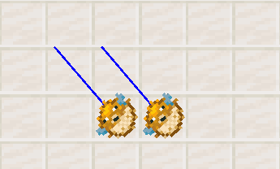
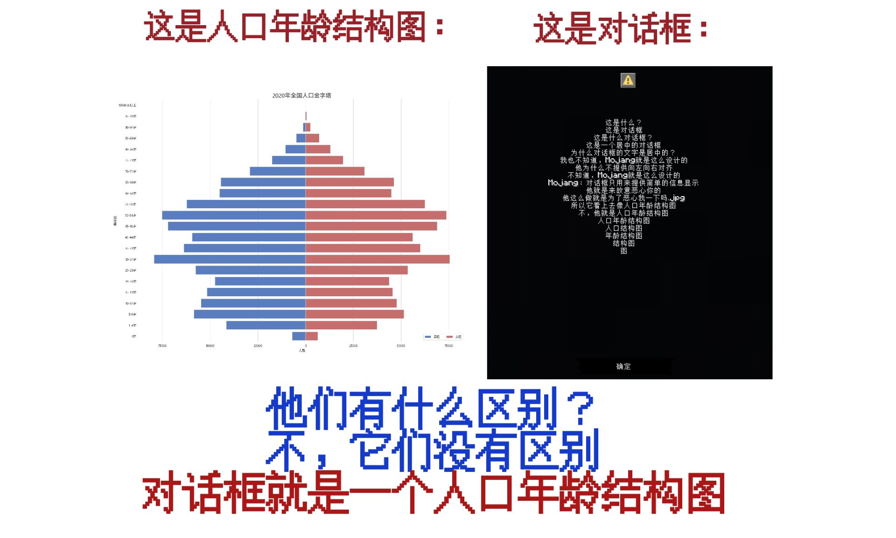

::: tip Translation notice
This page was translated with machine translation and may contain inaccuracies. If you can help improve it, please open an issue or submit a pull request.
:::

<script setup>
import { useData } from 'vitepress'
import ColorLine from '/.vitepress/vue/ColorLine.vue'
const { isDark } = useData()
</script>

# Second cover
<ColorLine :height="4"/>

::: warning You have entered a secret page!
Just kidding.
During the update process of Vanilla Library, we found that there is no suitable place for storing some time-sensitive and detailed information in the library.
Therefore, we plan to add a page in "feature" to put some miscellaneous information. Updated with the "feature" update.
The content of this page is not fixed, it may be various information, such as command questions and answers, trivia, ~~data pack jokes~~, etc.
We have also added a discussion area for this journal at the bottom of this page. You can express your views on this issue of "Feature" below, and you can also ask us questions.
:::

## Command Flashlight Command Flashlight
<ColorLine :height="2"/>

::: tip
This section shares some command tips, mainly from the highlights of the underline group.
:::

### Maintain accuracy of entity rotation

Normally, entity rotation data is sent to the client in steps of 1.40625 degrees (360/256) rather than using full precision. However, while investigating issue MC-278440, I discovered that switching the OnGround value to the opposite state from the previous moment caused the game to send a rotation data pack with full accuracy.

```mcfunction
execute as @n[type=item_display,limit=2] at @s run rotate @s ~0.1 ~
execute as @n[type=item_display] store success entity @s OnGround byte 1 store success score @s test unless score @s test matches 1
```


Note 1: This method exploits the vulnerability [MC-278440](https://mojira.dev/MC-278440)。
Note 2: This is different from Air toggling technology.
Some direct application scenarios:

[MC-272913](https://mojira.dev/MC-272913) (inaccurate rotation of item_display rendered model): allows for precise rotation, especially useful for display entities with long models.

[MC-184359](https://mojira.dev/MC-184359) (spectator perspective can only be rotated in steps): very effective for lens technology based on /spectate command. But unfortunately, it only works for non-mobentity (non-living entities).

Yes [MC-278440](https://mojira.dev/MC-278440) (some entities rotate themselves slightly after a while): Triggering this bug early ensures that this unexpected rotation animation does not randomly happen later.

[MC-300341](https://mojira.dev/MC-300341) (a mob's visual rotation can randomly get out of sync with its actual rotation when attacked or collided during rotation): This technique seems to help bypass this bug, but it may be an incomplete fix, or may have unexpected side effects, such as the body's rotation being exponentially interpolated.

The following GIF compares rotation accuracy before and after applying the workaround (for MC-272913):
Left: Rotation only (`rotate`）
Right: rotation + ground state switching (`rotate & OnGround toggling`）



### Instantly triggers enchantment effects on the player
(1.21.6+)  
If you want the custom enchantment effect to be triggered instantly within the command context, you can edit the required custom enchantment enchantment trigger conditions as`location_changed`, using the slot set to Saddle (`saddle`)or`body`;  
Then use the corresponding equipment with the specified enchantment`/item`Instruct the equipment to the corresponding slot;
Next, the game mode for the player is instantly switched to`旁观模式`Then switch back and you can trigger.

:::warning Notice
This may require the use of a scoreboard to cache the player's original game mode, and then specially deal with the default flight of the spectator and creative modes (this can be solved by switching to survival or adventure mode first).
If you are in version 1.21.5 or earlier, you can also set the slot in another position, replace it instantly when triggered and then switch it back again. In order not to affect the original equipment, you need to write a caching mechanism yourself.
:::

### Meow
  ／l、  
（ﾟ､ 。 ７  
　l、 ~ヽ  
　じしf_, )ノ​  

## Q&A
<ColorLine :height="2"/>

### Q: How to get the real time?
A: You can intercept the output storage of command block (`LastOutput`),use`/forceload`Forcibly load a chunk, place a command block there, and trigger an illegal command in a loop (such as`random roll 1`）,  
Then get the block every tick`LastOutput.text`The value can be intercepted by bits using the string interception function (1 9 is selected, of which 1 3 can be used to intercept hours, 4 6 to intercept minutes, and 7 9 to intercept seconds).
(1.21.5+)

## data pack jokes Datapack Jokes
<ColorLine :height="2"/>




<ClientOnly>
  <GiscusComment
    repo="CR-019/datapack-index"
    repoId="R_kgDONRhuqw"
category="Chats"
    categoryId="DIC_kwDONRhuq84CkchW"
    mapping="number"
    term="24"
    :strict="false"
    :reactionsEnabled="true"
    emitMetadata="0"
    inputPosition="top"
    :theme="isDark ? 'dark' : 'light'"
    lang="zh-CN"
    loading="lazy"
    class="giscus-wrapper"
  />
</ClientOnly>

<style>
.giscus-wrapper {
  margin: 3rem auto;
  max-width: 800px;
  padding-top: 2rem;
  border-top: 1px solid var(--vp-c-divider);
}
</style>
