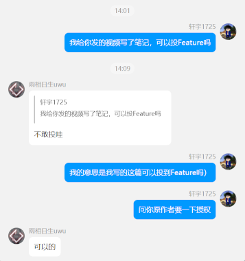
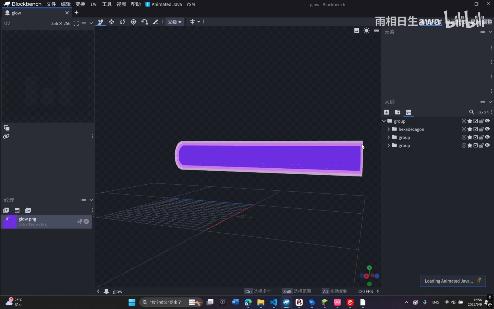
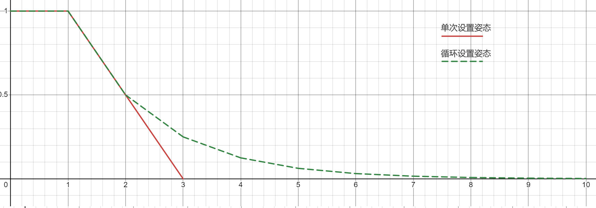
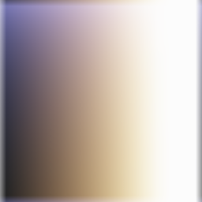

::: tip Translation notice
This page was translated with machine translation and may contain inaccuracies. If you can help improve it, please open an issue or submit a pull request.
:::

<FeatureHead
    title = "Some ingenious ideas based on displaying entities"
    authorName = "Xuanyu 1725"
    :extraAuthors="['雨相日生awa']"
    resourceLink = https://www.bilibili.com/video/BV1C7HyzNEeh
    cover='../../../../../feature/archive/202510/_assets/1.png'
/>

## Overview

In the past, animations in vanilla mods were almost always implemented using armor stand posture transformation or TP, which was limited by the maximum TPS. Generally, the animation could only reach a maximum of 20FPS. Furthermore, it is difficult to achieve animations containing voxel deformations other than introducing more repetitive voxels.

The display entity added in 1.19.4 is a very flexible and useful tool in the vanilla mod. Due to its ability to customize linear transformation and interpolation, it is widely used in various high frame rate animations. Therefore, it is very necessary to master the simple use of the display entity. **Some readers and authors pointed out that the content of Feature is relatively hard-core, which makes newcomers afraid to submit articles, so I chose to compile a simpler note showing entity animation. **

> Notes have been authorized by the original author
>
> Original address [https://www.bilibili.com/video/BV1C7HyzNEeh](https://www.bilibili.com/video/BV1C7HyzNEeh) by: 雨相日生awa

This video introduces several examples of using custom baking models + showing entity interpolation animation + life cycle to create simple dynamic effects.

::: warning ↑Editor’s note
In fact, the quality of submissions we have received in recent months has been much higher than the admission standards of "Feature", so don't worry that your findings are not important enough and dare not submit. We welcome everyone to submit to "Feature"~
Don’t be afraid of meows, click to get meows!
:::

## Laser Example - Fade Out Model Animation

### Basic idea

In the first example, the author used negative volume voxels to create a "stroked" cylindrical model that served as the body of the laser.

The author here uses Blockbench's plug-in Outline Creator (by Wither) to automatically build the outer outline. If you need to manually create the outer outline, you need to first change the outer outline in Blockbench.`文件 -> 设置 -> 吸附 -> 负值模型`or`File -> Settings -> Snapping -> Nagetive Size`Check.

In terms of commands. The author generated a scale transformation as`[5f, 5f ,25f]`The item displays the entity, and the displayed item is mounted`minecraft:item_model`Component, pointing to the model just created. At the same time, a timer is created to remove the display entity 10 ticks after it is generated. and set the new pose at 2t after generation`scale:[0f, 0f, 25f]`, interpolation 2t. This shows that the size of the entity remains unchanged in the z direction, and the x and y directions change from`5`zoom to`0`, showing the linear thinning effect of the cylinder.

### The little hole left by Mojang

It is worth noting that the interpolation characteristics of item display entity and block display entity are different. When the current interpolation is not completed and a new posture is set, then:

- The item display entity will use the current posture as the "previous posture" and the newly set posture as the "next posture" for interpolation.

- The block display entity will use the last posture set as the "previous posture" and the newly set posture as the "next posture" for interpolation.

> This feature may be fixed in the future

Since the item display entity is used here, in addition to setting a new posture directly, we can also set the posture in a loop. Replace "Set a new posture at the 2t after generation" with "Set a new posture at the 2t after generation and thereafter". You can use simple instructions to make the overall size of the display entity change non-linearly, which looks more natural and eliminates the need for calculations in the data pack (but the entity data still needs to be accessed frequently). Due to the reasons introduced above, something strange will happen if you use a block to display the entity.

The figure below shows the diameter change pattern of single setting posture and cyclic setting posture. The horizontal axis is time (in ticks), and the vertical axis is the ratio of the diameter at a certain moment to the initial diameter.

## Sword and Light Example - Pseudo-Particles for Players

Generally speaking, this type of special effect only requires placing a voxel in the model and at least one face to have a texture. by setting`billboard`, showing that the entity can rotate the model based on the camera direction. It is worth noting that the z direction of the model coordinate system is in the same direction as the camera z axis.

By riding, another sword light can move completely synchronously with the sword light on the client. In this way, multiple different display entity animations can be anchored together.

### The little hole left by Mojang

There is a 180° horizontal rotation difference between the camera coordinate system and the player coordinate system. The z-axis of the camera coordinate system is perpendicular to the screen and outward, while the z-axis of the player coordinate system is perpendicular to the screen and inward (both are right-handed systems). If you can't get around it, for insurance, you can paste textures on both surfaces perpendicular to the z-axis of the model coordinate system.

## Other thoughts

The above example essentially implements a simple "model - event queue - (continuous/non-continuous) linear interpolation" animation system, and its implementation design is greater than the technical aspect. We can indeed use Blockbench's Animated Java (by Titus Evans) plugin to create these animations, but for such a simple effect, there is actually no need to use the Animated Java wrapper. Manual production and simple packaging will be more streamlined than the data pack generated with Animated Java. And for developers who are not familiar with the data pack generated by Animated Java, it is more convenient to introduce parameterized control and maintenance.

For animations similar to lasers, the brightness of the display entity should be changed to`{block:15,sky:15}`, you can also refer to the picture below to select a suitable lighting color (the horizontal axis is block, the vertical axis is sky, multiplied by the original color. This picture is not the original data, there is a certain degree of distortion)

If you need to mount the shader on the display entity, you may need to use the leather class or other items that can specify the color through the data pack. Then detect specific **vertex color** within the shader

## Summarize

By analyzing the video of the original author Yu Xiangrisheng, this note has compiled some simple implementation methods for displaying entity animation effects:

- Through the zoom transformation maintained by the timer, the effect of displaying the entity's fade in/out can be extended to animations such as rotation or bouncing.
- Adjust the color effect of special effects by setting the light level
- Achieve special effects similar to particle effects by setting automatic rotation
- Bind multiple display entity animations by riding
- And a few pitfalls that need attention
