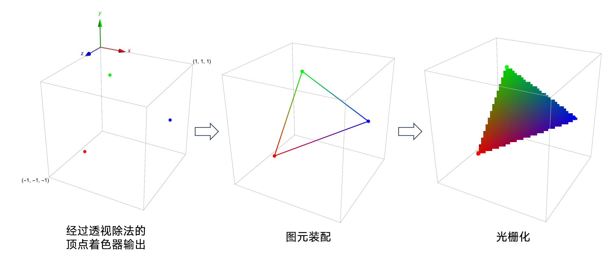
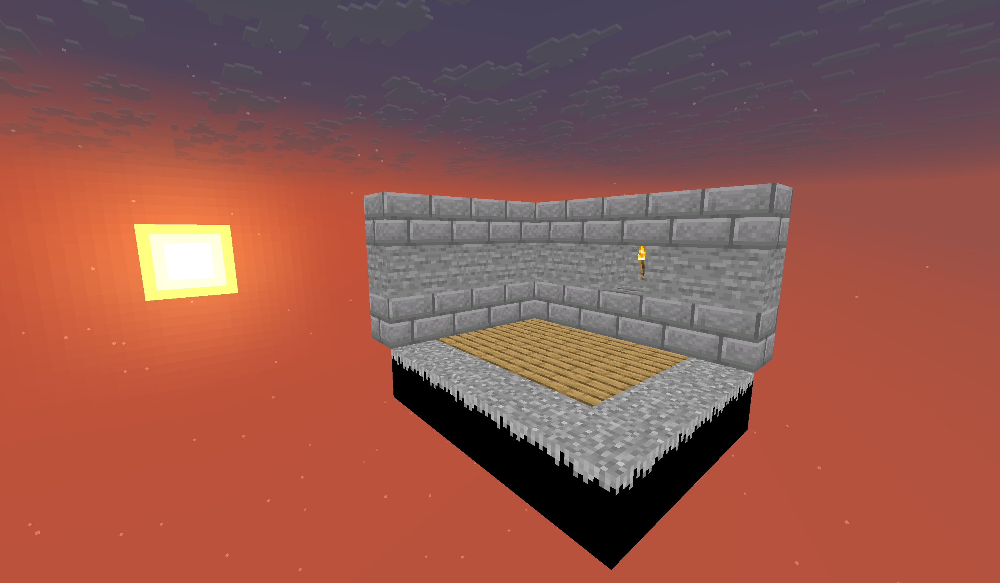
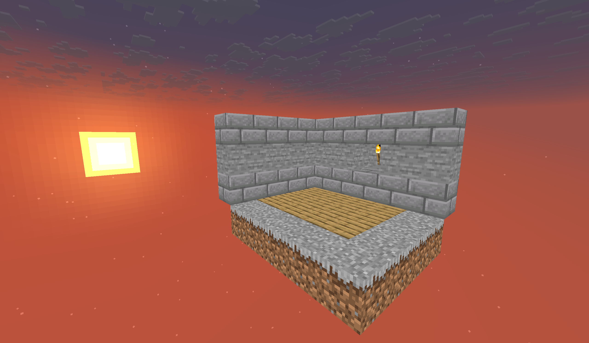
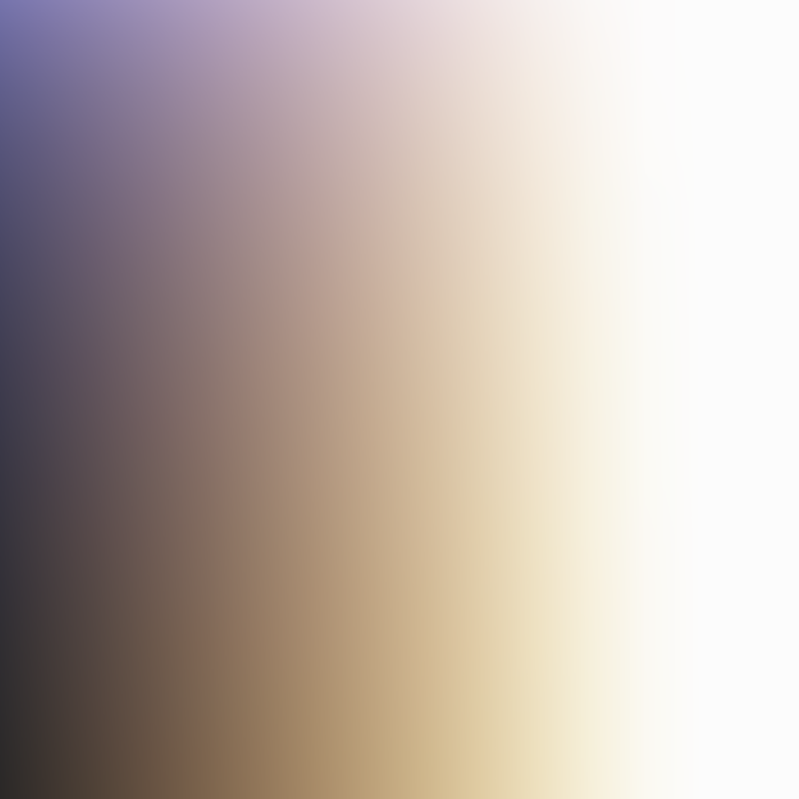
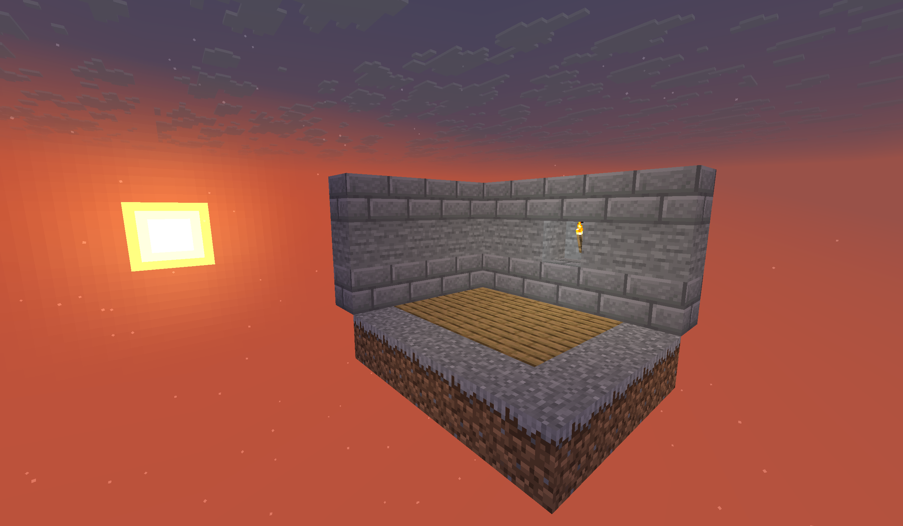
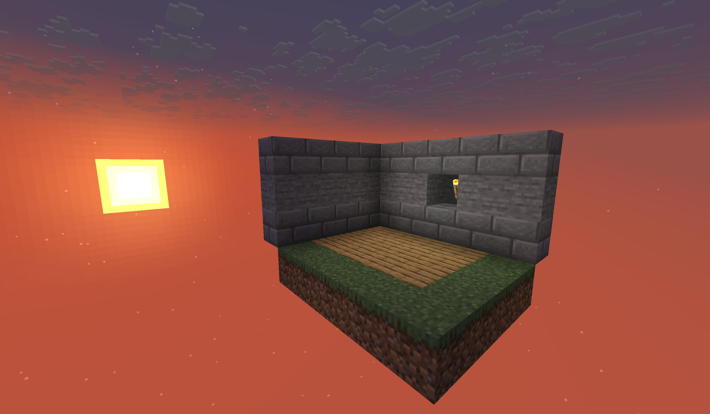
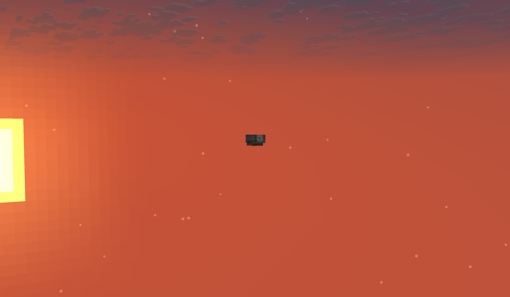
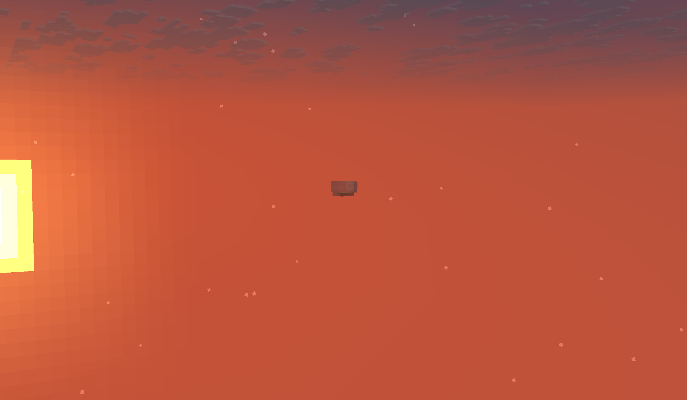
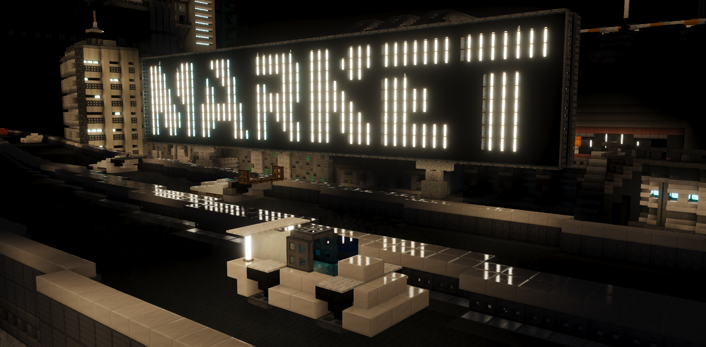
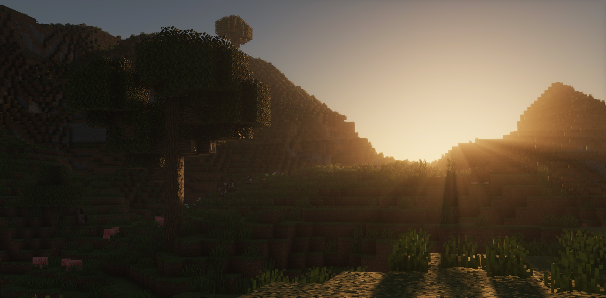

::: tip Translation notice
This page was translated with machine translation and may contain inaccuracies. If you can help improve it, please open an issue or submit a pull request.
:::


<FeatureHead
    title = "Core shader workflow (middle): from vertices to fragments"
    authorName = "Xuanyu 1725"
    cover='../../../../../feature/archive/202510/_assets/3.png'
/>

## Summary:

This tutorial closely follows the previous tutorial, consolidating the language features of GLSL through the fragment shader, and explaining the workflow and main tasks of the fragment shader by building "texture sampling + light mapping + ambient occlusion + dyeing + fog" from scratch, laying the foundation for future practice.

## review

In the previous tutorial, we took a deeper look at the vertices in`.vsh`The transformation process in the shader understands how vertices are mapped from model space to screen space step by step. I guarantee that understanding the process of vertex transformation is almost the most mathematically demanding part of this series. Starting from this section, the mathematics-related content will be reduced, but we still require readers to be basically familiar with the relevant principles of matrix transformation.

## piece

### fragment interpolation

The vertex shader introduced in the previous section processes vertices. At the end of the vertex shader workflow, we transform the vertices into the NDC space through MVP transformation and perspective division.$\left( \left[-1,1\right]^3 \right)$. After this, **Primitive Assembly** will be performed to connect the vertices into basic primitives (points, lines, **Triangles**), and then **Rasterization** will be performed to discrete the primitives in the primitive assembly stage into **Fragments** corresponding to screen pixels.



During the process of generating fragments, each fragment will interpolate the data output by the vertex shader based on its relative position to the vertices (usually three) (which is expressed as a gradient effect in color). This process is called **Fragment Interpolation**.

Fragment interpolation is an intuitive and very important feature. In Minecraft, fragment interpolation mainly provides smooth lighting (the light level is calculated at the vertices, which can reduce the number of calculations) and linear UV of each fragment (UV is stored in the vertex attribute and sent to`fsh`）

### Mathematical basis of fragment interpolation

If we express the three vertices that constitute the triangular surface as$\mathbf{P_1}、\mathbf{P_2}、\mathbf{P_3} \in \mathbb R^n$. Then, any point inside the triangle$P$can always be written as:

$$ \mathbf{P} = u \cdot \mathbf{P_1} + v \cdot \mathbf{P_2} + w \cdot P_3 $$

Not going into details here$u、v、w$The value process of

Then any one of the passed variables at this point (i.e.`vsh`output data)$\xi(\mathbf{P})$satisfy:

$$ \xi(\mathbf{P}) = u \cdot \xi(\mathbf{P_1}) + v \cdot \xi(\mathbf{P_2}) + w \cdot \xi(\mathbf{P_3}) $$

> Note: The illustrations here differ from`tutorial01->rendering process`The differences in the illustrations taken from "LearnOpenGL" that appear in "LearnOpenGL" are mainly reflected in: What is highlighted in "LearnOpenGL" is`fsh`The function of controlling the output color, what is highlighted here is the`vsh`Interpolation properties of the output data. In order to highlight different fragments, the resolution of the rasterized output device is exaggerated.

### The tasks of the fragment shader

After fragment interpolation, the fragment shader stage will be entered. At this stage, each fragment will run the fragment shader once. Therefore, some data that obviously will not mutate within the triangle surface can be placed in the vertex shader for calculation, thereby reducing the running burden. Each fragment shader runs in parallel, so there is no fixed order.

The task of a fragment shader is very simple, but it can also be very complex. To put it simply, the fragment shader basically calculates the final color of the fragment through the data and global quantities sent by the vertex shader. It is said to be complicated because in many rendering fields (such as realistic rendering and stylized rendering), the operation of color and lighting may be more difficult to understand than the MVP transformation mentioned in the previous section.

## Pass variables

The "data output by the vertex shader" we just described has a formal name in the GLSL program: **Varying Variable / Ins and Outs** . In the previous section, we gave a brief introduction to this:

Add before the variable declaration`in`, the data representing it is passed in from the outside,`out`It means that its data should be transmitted to the outside.

For vertex shader`in`The prefix represents the vertex attribute (that is, the data input by the game),`out`The prefix represents the data passed to the fragment shader. For fragment shader`in`The prefix corresponds to the vertex shader`out`, and generally used`out`to represent the output color (usually`out vec4 fragColor`, which is equivalent to directly using`gl_FragColor`）

Passing variables must also comply with the basic rules of variables, which restricts the variable name passed out by the vertex shader not to be the same as the variable name of the vertex attribute when input. So the vertex attributes inherited in the fragment shader usually have different names, for example:


### List of passed variables
| Vertex attribute or source data | Name used in fsh | Remarks |
| --- | --- | --- |
| Position | N/A | Completed within vsh |
| Normal | N/A | Completed in vsh |
| Padding | N/A | Not used |
| fog_spherical_distance(Position) | sphericalVertexDistance | Used in entity, end door block, particle lightning and other special effects |
| fog_cylindrical_distance(Position) | cylindricalVertexDistance | Used in screen effects such as entities, cracks, end portal blocks, particles and lightning |
| texelFetch(Sampler2, UV2 / 16, 0) | lightMapColor | Used when rendering entity |
| texelFetch(Sampler1, UV1, 0) | overlayColor | used when rendering entity |
| projection_from_position(gl_Position) | texProj0 | Used when rendering the end portal block |
| Color | VertexColor | |
| UV/UV0 | texCoord/texCoord0 | When there are multiple UV attributes, the variable name will be UV0, otherwise it will be UV |
| UV1 | texCoord1 | Passed but not used in fsh |
| UV2 | texCoord2 | |

## Fragment color

The color of the fragment is mainly contributed by four parts: texture, lighting, vertex color, and fog. (The rendering process of different objects may be slightly different, but here I only give a more general rendering process).

### texture

**Texture** is often mistakenly called "material" or called a map. Although texture is almost a material in the vanilla rendering process, we use a more accurate name here. We will also further explain the concept of "material" in subsequent tutorials.

Textures often correspond to **sampler** one-to-one. A sampler is a special object consisting of`uniform sampler2D`Prefix declaration. But generally different from the regular "Uniform variable of value type", the value of the sampler is its "binding ID" inside the rendering pipeline. To use it, you must cooperate with a type of **sampling function**.

exist`fsh`The color data of the medium sampling texture is generally used`vec4 texture(sampler2D Sampler, vec2 UV))`function, this function requires a`sampler2D Sampler`, as a sampler; a`vec2 UV`as sample coordinate; returns a`vec4(r,g,b,a)`The format's normalized color values.

Because in the shader, the texture corresponds to`Sampler0`(Most of them are image files under the resource pack folder textures), the texture coordinate corresponds`texCoord/texCoord0`,so`texture(Sampler0, texCoord)`or`texture(Sampler0, texCoord0)`

Write the following shader code

```glsl
#version 150

uniform sampler2D Sampler0;

in vec2 texCoord0;

out vec4 fragColor;

void main(){
    fragColor = texture(Sampler0, texCoord0);
}
```


This program will be able to sample the texture of each fragment and output the color value of the texture. The following figure is the output effect.



There are many black pixels in the picture. This is because the rendering type of these blocks does not output the alpha (opacity) channel, and these pixels in the texture are`vec4(0, 0, 0, 0)`, so it is rendered completely black, so we need to modify the program appropriately so that these fully transparent pixels are not rendered. The following is the vanilla implementation of 1.21.8 (other code has been deleted)

```glsl
#version 150

uniform sampler2D Sampler0;

in vec2 texCoord0;

out vec4 fragColor;

void main(){
    vec4 color = texture(Sampler0, texCoord0);
    #ifdef ALPHA_CUTOUT
        if (color.a < ALPHA_CUTOUT) {
            discard; // 片元着色器的 discard 关键字代表丢弃这个片元不进行渲染
        }
    #endif
    fragColor = color;
}
```




### illumination

**Lighting** is an essential component to make the picture more natural. In photorealistic rendering, lighting can be said to be the most important core. However, Minecraftvanilla's lighting system is relatively simple.

Lighting must also be sampled through samplers and sampling coordinates. However, we have to manually implement a new sampling function here, and its core is still`textures`function. (This feature has been implemented by Mojang and put into vanillaresource pack)

```glsl
vec4 minecraft_sample_lightmap(sampler2D lightMap, ivec2 uv) {
    return texture(lightMap, clamp(uv / 256.0, vec2(0.5 / 16.0), vec2(15.5 / 16.0)));
}
```


This function performs **Clamping** on the sampled coordinates based on sampling, so that the minimum texture coordinate is no less than$\displaystyle \frac{0.5}{16.0}$, the maximum is not higher than$\displaystyle \frac{15.5}{16.0}$. In fact, the uvcoordinate here already has intuitive meaning, and its horizontal axis (u direction) corresponds to$block light level \times 16.0$, the vertical axis (v direction) corresponds to$sky light level \times 16.0$. The default maximum light level in the Minecraft lighting system is 16.0, so the maximum value is 256.0. In order to normalize the coordinate, the uv is divided by 250.0 and clamped at the corresponding light level.$\left[0.5, 15.5\right]$Within the range (that is, the darkest is not less than 0.5, the brightest is not greater than 15.5)

The following image is a reference for a typical light map. The image is not raw data, there is a certain degree of distortion, and the light map is actually generated programmatically through various conditions:



It can be observed that the sky light is cyan blue and the block light is white. The color weight of the block light is always greater than the sky light. This is the lighting characteristic of Minecraft.

The sampler corresponding to the light map is`Sampler2`, the corresponding sampling coordinate is`UV2`(in the vertex shader). But for the convenience of demonstration, we perform sampling in the fragment shader.`UV2`Called when the fragment shader is passed in`texCoord2`, so we write:

```glsl
#version 150

uniform sampler2D Sampler0;
uniform sampler2D Sampler2;

in vec2 texCoord0;
in vec2 texCoord2;

out vec4 fragColor;

vec4 minecraft_sample_lightmap(sampler2D lightMap, ivec2 uv) {
    return texture(lightMap, clamp(uv / 256.0, vec2(0.5 / 16.0), vec2(15.5 / 16.0)));
}

void main(){
    vec4 color = texture(Sampler0, texCoord0) * minecraft_sample_lightmap(Sampler2, ivec2(texCoord2));
    #ifdef ALPHA_CUTOUT
        if (color.a < ALPHA_CUTOUT) {
            discard;
        }
    #endif
    fragColor = color;
}
```




>Note: There is a small pitfall in rendering lighting in fsh, because UV2 is declared as ivec2 (integer vector) and is not a smooth interpolable variable, so it cannot be passed directly according to ivec2, but needs to be type converted and passed using vec2

Another part of the lighting calculation is passed within the vertex attributes, described below in Vertex Color.

### vertex color

**Vertex Color (Color)** mainly includes two parts: **Ambient Occlusion (AO)** and **Tinting)**

The **Ambient Occlusion** implemented in Minecraft is relatively simple. It is manifested in that the block will be slightly darker at the connections with other blocks. Under the same light level, the actual brightness of different faces of the block is different.

**Dyeing** is a detail that the non-resource pack production team may not notice. For example, the turf part of the grass block, leaves, water and other blocks will have smooth discoloration in different mob biomes. For example, the water in the swamp will appear more turbid, and the water in the temperate ocean will be clearer.

In fact, the textures of these blocks are all black and white masks. The game obtains a color for multiplication by sampling the colormap, and multiplies it with the color obtained by texture sampling.

> Note:
> - This process also better reflects why "texture" rather than "material" or "map" is a more accurate term. In many scenarios, the image file under texture only provides surface texture changes, but does not contain color.
> - Objects containing special vertex colors include particle effects, dyed leather items, potions, spawn eggs, etc. In the field of resource pack development, they are generally called automatic coloring. But be careful, particles`dust`The vertex color of is not within floating point error equal to`/particle`The parameters given by the instruction, but with a certain offset, which results in each`dust`The colors are slightly different; interested readers can check out the research on "Negative Color Reduces Dust Error".

These contents are all done in advance by the game. We don’t need to process them in the shader. We only need to set the vertex attributes`Color`Pass it to the fragment shader and rename it to`vertexColor`


```glsl
#version 150

uniform sampler2D Sampler0;
uniform sampler2D Sampler2;

in vec2 texCoord0;
in vec2 texCoord2;
in vec4 vertexColor;

out vec4 fragColor;

vec4 minecraft_sample_lightmap(sampler2D lightMap, ivec2 uv) {
    return texture(lightMap, clamp(uv / 256.0, vec2(0.5 / 16.0), vec2(15.5 / 16.0)));
}

void main(){
    vec4 color = texture(Sampler0, texCoord0) * vertexColor * minecraft_sample_lightmap(Sampler2, ivec2(texCoord2));
    #ifdef ALPHA_CUTOUT
        if (color.a < ALPHA_CUTOUT) {
            discard;
        }
    #endif
    fragColor = color;
}
```




The picture now is very natural.

### fog

> The specific implementation and mathematical principles of fog will be mentioned in subsequent tutorials. Here we only briefly introduce the concept of fog.

**Fog** is a major part of the Minecraft screen content. The use of fog may be more widespread than most people think. It is used for: rendering of the lower half of the skybox, surface rendering of distant blocks and entities, screen discoloration under water and magma, night vision blindness and darkness effects, etc. Minecraft implements a variety of effects by defining different concentrations, distances, and different colors of fog. As of 1.21.8, a classic fog effect can be achieved via the function provided by minecraft:fog.glsl
```glsl
apply_fog(color, sphericalVertexDistance, cylindricalVertexDistance, FogEnvironmentalStart, FogEnvironmentalEnd, FogRenderDistanceStart, FogRenderDistanceEnd, FogColor);
```


Added, the parameters are all global variables and variables that appear in the list of previously passed variables, and we do not need to perform calculations.

```glsl
#version 150

#moj_import <minecraft:fog.glsl>

uniform sampler2D Sampler0;
uniform sampler2D Sampler2;

in float sphericalVertexDistance;
in float cylindricalVertexDistance;
in vec4 vertexColor;
in vec2 texCoord0;
in vec2 texCoord2;

out vec4 fragColor;


vec4 minecraft_sample_lightmap(sampler2D lightMap, ivec2 uv) {
    return texture(lightMap, clamp(uv / 256.0, vec2(0.5 / 16.0), vec2(15.5 / 16.0)));
}

void main() {
    vec4 color = texture(Sampler0, texCoord0) * vertexColor * minecraft_sample_lightmap(Sampler2, ivec2(texCoord2));
    #ifdef ALPHA_CUTOUT
        if (color.a < ALPHA_CUTOUT) {
            discard;
        }
    #endif
    fragColor = apply_fog(color, sphericalVertexDistance, cylindricalVertexDistance, FogEnvironmentalStart, FogEnvironmentalEnd, FogRenderDistanceStart, FogRenderDistanceEnd, FogColor);
}
```






Comparison before and after adding fog to a distant scene

## framebuffer

Now that we have initially completed the rendering of the object, after the fragment shader is finished running, the output variable will be`fragColor`or`gl_FragColor`It is output to the video memory, but will not be sent to the screen immediately. The place where this data is stored is called **Frame Buffer (Fragment Buffer)**. In particular, the color information is called **Color Buffer (Color Buffer)**. In addition to the color buffer, the depth information of the fragment will also be output to the **Depth Buffer** and normalized. It is worth noting that the written depth value does not change linearly, because we do not need to record extremely far pixels close to the far plane and pixels close to the near plane with the same accuracy. Specifically, we want to use higher precision to record closer depth values, and use lower precision for distant depths. This process is naturally introduced through perspective projection and perspective division, and we don't need to do too many calculations.

The formula for depth mapping is given here. The coordinate range in NDC is$\left[-1, 1\right]$, the range of values ​​in the depth buffer is$\left[0, 1\right]$, then the formula of depth mapping is

$$\displaystyle \text{depth} = \frac{z_\text{NDC} + 1}{2}$$

i.e. near plane$(z_\text{NDC} = -1.0)$will be mapped to$\text{depth} = 0.0$, near plane$(z_\text{NDC} = +1.0)$will be mapped to$\text{depth} = 1.0$

## Test and mix

The buffer will eventually be sent to the game, tested (depth testing and alpha testing, determine which pixels will eventually be retained) and blended (modify the color of the fragment based on other fragments), and finally output to`minecraft:main`buffer. If the player turns on the "Excellent!" image quality, then these buffers will be sent to the post-processing shader for further mixing.

After the post-processing stage,`minecraft:main`will be sent to the viewport, and we can see that each game content is rendered correctly.

## Summarize

This tutorial gives a classic fragment shader rendering process. Compared with the vertex shader in the previous section, it can be said to be much simpler. However, this chapter only briefly introduces and practices the work of the fragment shader. In fact, the main difficulty of the fragment shader lies in the operation of color and lighting. Various advanced lighting models and programmatically generated images are all responsible for the fragment shader. This section deliberately avoids the detailed discussion of fog. The purpose is to control the difficulty of understanding and put the more complex color operations in the later tutorials. Here are a few pictures of vanilla light and shadow to show the complex application scenarios of the fragment shader, and also to give readers a certain understanding of the future organizational direction and current advancement of the tutorial:






Project address: [https://github.com/JNNGL/vanilla-shaderpack](https://github.com/JNNGL/vanilla-shaderpack) by JNNGL [Discord](https://discord.gg/5aU2JzXy23)
