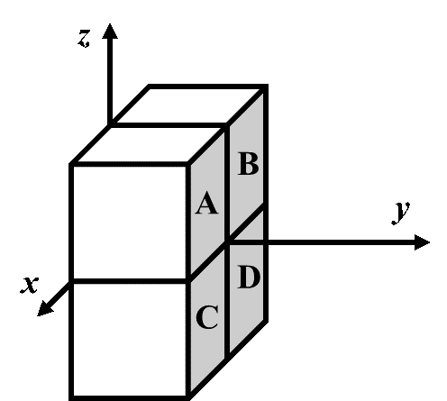

<FeatureHead
    title = "Basic theory related to coordinate system and coordinate parameters"
    authorName = "Xu Muxian"
    cover='../../../../../feature/archive/202510/_assets/4.png'
/>

## Summary
The game world of Minecraft is three-dimensional. When writing a command, sometimes you need to determine the positional parameters required by the command's action object. Such parameters are called coordinates. This article lists the coordinate parameter formats used by the command system and provides a theoretical explanation of their properties and uses.

## Introduction
The spatial rectangular coordinate system used by Minecraft is a right-handed coordinate system. In this space rectangular coordinate system,$x$Axis and$z$The axis reflects the position in the horizontal direction,$y$The axis reflects the vertical position. in,$x$The positive direction of the axis points due east, while$z$The positive direction of the axis points due south.

In most cases, three parameters can be used to represent the position of a certain point, which is an ordered triple of real numbers:

```
`
<x> <y> <z>
```
`
For example, a point represented mathematically$(0,4,4)$In some command parameters, it is directly expressed as`0 4 4`.

> **Example** There are two points in the space rectangular coordinate system$A(124.5,76,−64.29)$、$B(−10.003,80,−33.33)$,but$B$The point is located horizontally$A$Which direction is the point?
**untie**$B$point$x$coordinate is located at$A$point$x$The negative direction of coordinate, so$B$The point is located in the east-west direction$A$point west;$B$point$z$coordinate is located at$A$point$z$The positive direction of coordinate, therefore$B$The point is located in the east-west direction$A$point south. In summary,$B$The point is located at$A$southwest of the point.

Although different coordinate expressions are basically the same, different commands act on different objects, and their coordinate parameter types are not completely consistent. The following will sort out all types of coordinate parameters used by the command system.

## Parameter type
command uses 4 coordinate-related parameter types: blockcoordinate`minecraft:block_pos`, three-dimensional coordinate`minecraft:vec3`, plane block coordinate`minecraft:column_pos`and two-dimensional coordinate`minecraft:vec2`. Their relationships and application scenarios can be clearly listed in the following table:
| | Generally used in blocks | Generally used in non-block game content |
|-------|-------|-------|
| 3D |`minecraft:block_pos` | `minecraft:vec3`|
| 2D |`minecraft:column_pos` | `minecraft:vec2`|

### blockcoordinate
Coordinate represents a point without volume, while block has volume, so a datum point needs to be specified for the block, and the coordinate of this datum point is used to represent the coordinate of the object.
Minecraft regulations: The length, width and height of most blocks are 1 meter, and the volume is 1 cubic meter. When using the coordinate system to represent these positions, it is assumed that the side length of the block and the unit length of the coordinate system are numerically equal, which means that the basic unit of the coordinate system is meters, or "grids".
A block uses its **lower northwest corner** point as its **blockcoordinate (Block position)**. If the coordinate of the northwest lower vertex of a block is$(x,y,z)$, then the blockcoordinate of the block is recorded as$(x,y,z)$, and this block is located at$(x,y,z)$and$(x+1,y+1,z+1)$between the three-dimensional geometric figures enclosed by these two coordinates.

Since the corners of the block are always located at the integer coordinate point, as the command parameter`minecraft:block_pos`The blockcoordinate must be an ordered triplet consisting of three integers. Relative coordinates and local coordinates are allowed in blockcoordinate.
command`/setblock`、`/fill`、`/clone`、`/fillbiome`、`/spawnpoint`and`/setworldspawn`Both use blockcoordinate, except that,`/data`、`/item`and`/execute`The subcommands used to process blockentity data also use blockcoordinate.

> **Example** As shown in the figure, the blockcoordinate is`0 0 0`Which block is it?

**Solution** blockcoordinate is calculated strictly based on the northwest lower corner vertex, while due west and due north are respectively$x$Axis and$z$The negative direction of the axis, so the block position indicated by blockcoordinate is always located in the southeast direction of the actual coordinate and is located above the vertical direction. The reflection in the space rectangular coordinate system is$x$、$y$、$z$The positive direction of the three coordinate axes. Therefore blockcoordinate is`0 0 0`The block is located in the first hexagram, that is, block$A$.

### Three-dimensional coordinate
**Three-dimensional coordinates** is a coordinate parameter that accurately represents a position. The command parameter type is`minecraft:vec3`, the three elements used to represent the coordinate position are all double-precision floating point numbers. Three-dimensional coordinate is generally applied to entities. The command to use three-dimensional coordinate is`/tp`（`/teleport`）、`/rotate`、`/summon`、`/particle`、`/playsound`，`/damage`,as well as`/execute`of`facing`and`positioned`subcommand.
It can be seen that most of the above commands are commands related to entities. When an entity uses three-dimensional coordinates, the bottom center point of its collision box is the coordinate of this entity. For example, use command

```
`
tp 5.0 56.0 17.0
```
`
Finally, the center point of the player's sole is located$(5.0,56.0,17.0)$, or it can be said that the player's anchor foot is located at$(5.0,56.0,17.0)$.
The coordinate expressed in the above example has a decimal point because the three parameters of the three-dimensional coordinate are all double-precision floating point numbers. However, this does not mean that three-dimensional coordinates can only use floating point numbers. For example, if you use coordinate in integer form$(5,56,17)$To describe the position of the player, in actual operation, it was found that the player is located in the three-dimensional coordinate$(5.5,56.0,17.5)$. As shown in the figure, it can be observed that the player's coordinates are "offset", which is different from the actual coordinates. in$x$coordinate and$z$The coordinates have all been "offset", and$y$coordinate is not affected.

The offsets of these positions are located on the center line of the two opposite sides of the block. This is because the three-dimensional coordinate uses **Center correct**, that is, using the three-dimensional coordinate in the form of an integer, when one of its coordinate parameters is$n$（$n∈Z$), its actual coordinate is$n−0.5$, which can make the entity position adapt to the block position. NOTE**Center calibration is only available for$x$coordinate and$z$coordinate。$y$coordinate strictly uses actual coordinate**.
Note that the statement "the three-dimensional coordinate is located at the center of the block according to the block coordinate" is not used here because the integer and floating-point forms of the three parameters of the three-dimensional coordinate can be mixed, and the parameters in decimal form strictly follow the actual coordinate, and the parameters in integer form use center calibration. For example, located in`5 56 17.0`The player is actually located at$(5.5,56,17.0)$.

### Plane blockcoordinate
As the name suggests, plane blockcoordinate`minecraft:column_pos`It is a two-dimensional block coordinate. The two-dimensional coordinate of the northwest corner is used as the plane coordinate of a block column. Both elements are integers. Currently, the only commands that use this parameter format are`/forceload`.

### Two-dimensional coordinate
That is only by$x$coordinate and$z$coordinate consists of **two-dimensional coordinates**. The command parameter type of two-dimensional coordinate is`minecraft:vec2`, both elements are double-precision floating point numbers. If the two-dimensional coordinate is an integer, center calibration is also used.`/spreadplayers`and`/worldborder`All use this parameter format. ,

## Relative coordinate and local coordinate
In addition to using the numeric form, the coordinate parameter can also use the tilde or caret to represent relative or local coordinates.

### Relative coordinate
World coordinate is a fixed coordinate system based on the space rectangular coordinate system. Each position has its fixed coordinate. When expressing these coordinates, sometimes it is necessary to determine the "relative position", that is, to put aside the inherent coordinate system based on the origin, and use "relative offset" to express the coordinate of one position relative to another position, which is the **relative world coordinates** to be introduced below. The relative fixed space rectangular coordinate system coordinate is called **absolute coordinates (Absolute world coordinates)**. In the relative coordinate system, an origin must be determined, which is usually the command execution position. If the command is executed by the player, the origin is the location of the player; if the command is executed by the command block, the origin is the location of the command block. Relative coordinates use a tilde`~`and relative offset representation. If it is a two-dimensional coordinate, it is

```
`
~[<dx>] ~[<dz>]
```
`
If it is a three-dimensional coordinate, that is

```
`
~[<dx>] ~[<dy>] ~[<dz>]
```
`
If relative offset`[&lt;dx&gt;]`、`[&lt;dy&gt;]`、`[&lt;dz&gt;]`If not filled in, the offset will be 0, and the offset can be negative. This is equivalent to establishing a spatial rectangular coordinate system with the command execution position as the origin. For example, the 3 grid distance due east of the point can be expressed as`~3 ~ ~`.


> **Example** A point located at$(−24,55,10)$command block, its relative coordinate`~12 ~‐3 ~‐5`The blockcoordinate referred to is ____________.
**Solution** Relative coordinates stipulate that the position of the command block is the origin. When converting relative coordinates to absolute coordinates, you only need to make corresponding additions and subtractions based on the absolute coordinates. The blockcoordinate in this question is$(−24−12,55−3,10−5)$, can be calculated$(−12,52,5)$.

**Relative coordinates can be mixed with absolute coordinates. ** In the coordinate parameter without using the tilde, the absolute coordinate is calculated. for example,`~10 10 ~10`Will change according to execution position$x$coordinate and$z$coordinate, but$y$coordinate is fixed to$10$.
If relative coordinate is used in blockcoordinate, the coordinate value will be rounded down (minus infinity) to fit the blockcoordinate. For example, when the command execution location is$(10.5,70.2,-9.1)$When, the relative coordinate origin of blockcoordinate`~ ~ ~`rounded to`10 70 -10`.
The above four coordinate parameter types,`minecraft:block_pos`、`minecraft:vec3`、`minecraft:column_pos`and`minecraft:vec2`Relative coordinates can be used.

### local coordinate
In addition to relative coordinates, the command system also has a more flexible coordinate, namely **local coordinates (Local coordinates)**. Local coordinates are also used to represent relative offsets. Unlike relative coordinates, local coordinates use directions to represent offsets. Similarly, the local coordinate also has the command execution position as the anchor point, represented by the caret and relative offset format:

```
`
^[<dx>] ^[<dy>] ^[<dz>]
```
`

The local coordinate is divorced from the direction specified by the absolute coordinate system, and it uses the command execution orientation as the benchmark. As shown in the figure, using local coordinates is equivalent to establishing a coordinate system with arbitrary coordinate axis directions, but the orthogonal relationship between coordinate axes remains unchanged. If the executor is a player or other entity, as the perspective of these entities rotates, this coordinate system also rotates with their perspective. Regulation: **command execution direction is the local coordinate system$z$The positive direction of the axis**. **If the command executor is a command block, the local coordinate system is the same as the relative coordinate system, with the south as$z$The positive direction of the axis**. therefore$x$The positive direction of the axis is to the left of the execution direction,$y$The positive axis direction is above the execution direction. For example, execute to the right$3$The local coordinate of the meter distance is`^‐3 ^ ^`.
**Because local coordinate does not use the coordinate axis direction specified by the absolute coordinate system, local coordinate cannot be mixed with absolute coordinate and relative coordinate. **
If local coordinate is used in blockcoordinate, like relative coordinate, the coordinate value will also be rounded down (minus infinity) to make it fit the blockcoordinate.
**But local coordinate cannot be used for two-dimensional coordinate parameters`minecraft:column_pos`and`minecraft:vec2`, can only be used for three-dimensional`minecraft:block_pos`and`minecraft:vec3`. **

## Coordinate form in other parameters
### coordinate in target selector
The target selector origin uses a set of double-precision floating point numbers as parameter values, including`x`、`y`、`z`Three parameters:

```
`
<目标选择器变量>[x=<x>,y=<y>,z=<z>]
```
`
The value of the parameter can be a decimal. The coordinate of the position origin does not apply to center calibration. All position origin coordinates use their actual coordinates. Usage examples:

```
`
@a[x=0,y=57,z=0]
```
`
This selector parameter defines the precise origin$(0.0,57.0,0.0)$. The origin parameter is optional, and all three parameters are optional. When a parameter of a coordinate has an undefined value, command is used to execute the position on the unspecified coordinate axis. For example, define the following parameters:

```
`
@a[x=0,z=0]
```
`
Since the parameters`y`If it is not defined, use the command execution location$y$coordinate as parameter`y`value. If none of the three parameters have defined values, the command execution position will be used entirely. Generally speaking, the **origin parameter needs to be used in conjunction with distance, volume, sorting or quantity parameters**. But like`@p`This selector with its own sorting function can use the origin parameter alone, such as`@p[x=0,y=0,z=0]`Will choose to leave$(0,0,0)$Recent player.
**The origin parameter will not modify the command execution position. **

### Round down the execution position`/execute`of`align`The subcommand rounds down the actual coordinate of the command execution location. The syntax is:

```
`
align <axes> ‐> execute
```
`
Among them`&lt;axes&gt;`A special parameter format is used - coordinate axis combination`minecraft:swizzle`. can be`x`、`y`and`z`Any **non-repeating** combination of , so a combination like xx is wrong. All available combinations are:`x`、`y`、`z`、`xy`、`xz`、`yx`、`yz`、`zx`、`zy`、`xyz`、`xzy`、`yxz`、`yzx`、`zxy`and`zyx`, there are 15 different combinations in total. subcommand`align`The coordinates on all corresponding coordinate axes in the combination will be rounded down (that is, rounded to negative infinity). The order of each coordinate axis is not required, so like`xy`and`yx`This combination has exactly the same effect. There are seven situations in total for coordinate rounding. The following corresponds to all situations and 15 combinations:
*Only for$x$coordinate rounding:`x`;
*Only for$y$coordinate rounding:`y`;
*Only for$z$coordinate rounding:`z`;
* right$x$coordinate and$y$coordinate rounding:`xy`and`yx`;
* right$x$coordinate and$z$coordinate rounding:`xz`and`zx`;
* right$y$coordinate and$y$coordinate rounding:`yz`and`zy`;
* right$x$coordinate、$y$coordinate and$z$coordinate rounding:`xyz`、`xzy`、`yxz`、`yzx`、`zxy`and`zyx`.

> **Example** It is known that the command executor is located at$(12.5,76,−41.3)$, after executing the following command:
``
execute align xyz run tp ~ ~ ~
``
What is the actual coordinate of the command executor?
**Solution** It can be seen from the meaning of the question that the initial execution position of the command is (12.5,76,−41.3),`xyz`combination`align`The subcommand will be the execution location$x$coordinate、$y$coordinate and$z$coordinate is rounded down to obtain the modified execution position.$(12.0,76.0,−42.0)$. It can be seen that if coordinate is positive, rounding down will remove the decimal point; if coordinate is an integer, it will remain unchanged; if coordinate is negative, after removing the decimal point, the number at the integer position will be subtracted by 1. final processing`run`command, command`/tp`The command executor will be sent to the modified coordinate.
In the same way, if the executed command is
``
execute align x run tp ~ ~ ~
``
Then the modified execution position is$(12.0,76,−42.0)$,here$y$coordinate and$z$coordinate is not rounded down.
There is one thing that readers need to pay attention to,`align`The sub-command is not equivalent to the center calibration of the coordinate, because all coordinates in the command are actual coordinates, so the representation of the integer coordinate is the edge of the block. In this example,$x$coordinate and$z$The coordinates are all rounded down, so the command executor is sent to the intersection of the four blocks, as shown in the figure:


Although`align`The subcommand is not equivalent to coordinate's center calibration, but can still be used`align`The sub-command performs manual center calibration on the existing entity. Here is another example:

> **Example** Calibrate the position of the command executor of any coordinate to the center of the block where it is located.
**Solution** You can use it first`align`subcommand pair$x$coordinate and$z$coordinate is rounded down: No matter whether the command executor is located at any coordinate in the block where it is located, the execution position after rounding down is the same, and then use`/tp`command performs manual center calibration, that is, the command executor's$x$coordinate and$z$The coordinate moves 0.5 blocks in the positive direction. At this time, the command executor is calibrated to the center point of the block. Valid commands are:
``
execute align xz run tp ~0.5 ~ ~0.5
``

## References
[1]https://zh.minecraft.wiki/w/%E5%9D%90%E6%A0%87
[2] https://zh.minecraft.wiki/w/%E7%9B%AE%E6%A0%87%E9%80%89%E6%8B%A9%E5%99%A8
[3] https://zh.minecraft.wiki/w/%E5%91%BD%E4%BB%A4/execute
[4] https://zh.minecraft.wiki/w/%E5%8F%82%E6%95%B0%E7%B1%BB%E5%9E%8B