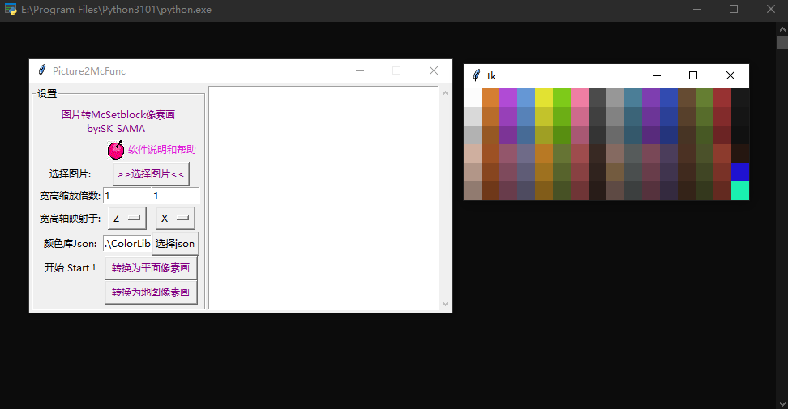
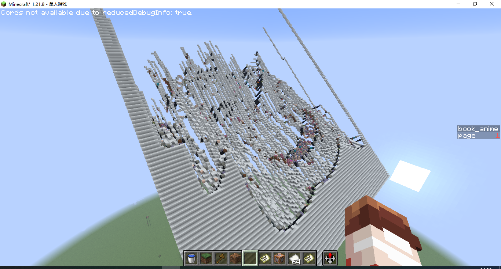
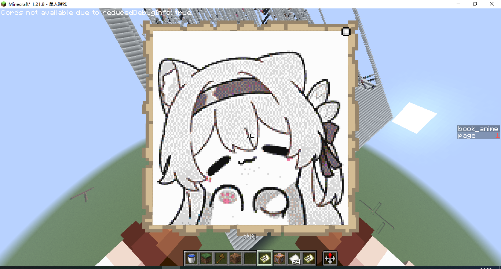
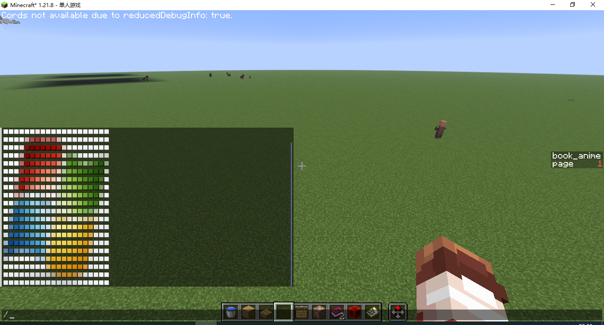
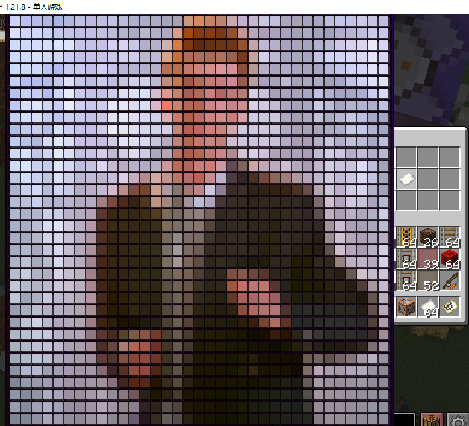
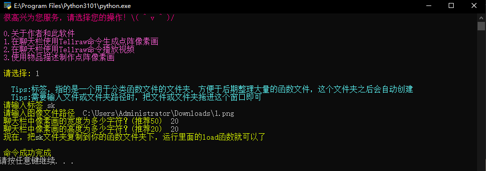
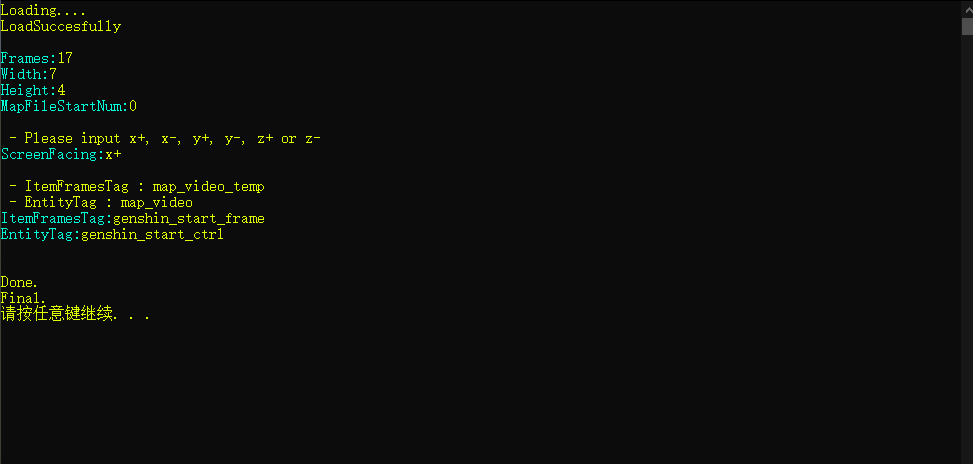
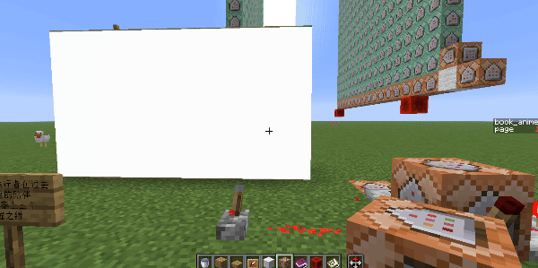
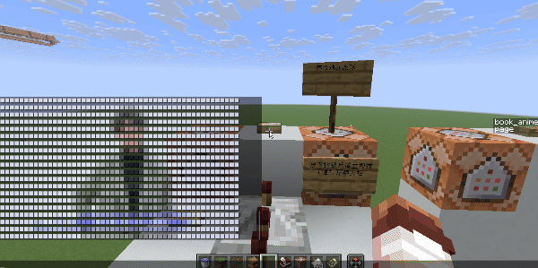
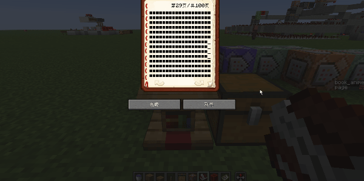

<FeatureHead
    title = "Miscellaneous Talk · Part 1 · Some research on &quot;Pixel Painting&quot;"
    authorName = "SKSAMA"
    resourceLink = 'https://ymqlgthbsakuradream.github.io/posts/minecraft/Archive.20251006.html'
    cover='../../../../../feature/archive/202510/_assets/6.png'
/>

## About "Miscellaneous Talk"

Due to some things, I don’t have the time and energy to make new things recently, so I plan to write some miscellaneous articles to record some commands I have played before and some scattered works I have made.

I wish you all a healthy Mid-Autumn Festival!

## Miscellaneous Talk · Part One

Since Mojang updated the function, the execution of command is no longer limited to the command block, but the function at that time was not perfect and could neither pass parameters nor return a value. The usage I could think of at that time was to use function to execute a large number of commands in batches, and these commands could be generated programmatically.

So at that time, I made various generators to generate batch commands. Although they are indeed outdated now, this does not prevent me from writing articles to record them.

The theme this time is pixel art~~ (I really loved messing around at that time and made so many useless pixel art generation programs)~~

## Pixel Art

### Map drawing

This is probably the most common pixel art. The principle is to use a program to generate a mcfuntcionfunction file, which is full of setblockcommands, and then execute this function. This program can generate three-dimensional maps, which was very advanced at the time, but now there is better software: [SlopeCraft BV1So4y1D7wB](https://www.bilibili.com/video/BV1So4y1D7wB)

### Text pixel art

In the **20w17a** update, the color in the text component can be customized using hexadecimal color codes instead of using several preset colors. Using this feature, we can place pixels wherever text can be displayed, such as the chat bar and item description below.

I also wrote a program to generate such pixel paintings

## Pixel animation

Now that we have achieved the generation of a single pixel painting, we might as well generate a few more, and then use schedulecommand to display them in sequence. Using this principle, we can play the video.
(I remember that there were various similar sex videos on site b at that time)

### Map animation

This solution can be used to play videos at a very high resolution, but the disadvantages are also obvious: it takes up more resources and causes visible lag during playback.

### Chat bar animation

Playing videos using text in the chat bar can be very smooth, but the resolution cannot be too high.

### Podium animation

This is an interesting solution, inspired by [BV1eb411S7Ut](https://www.bilibili.com/video/BV1eb411S7Ut), so I made this BadApple that can be played on a podium

## Summary

The display entity was added in 1.19. The text display entity makes the text no longer limited to the chat box and various UIs. The item display entity can directly display any picture with itemmodel mapping. Now it seems that the solutions mentioned above may not be applicable at present, but the exploration value they leave cannot be ignored.