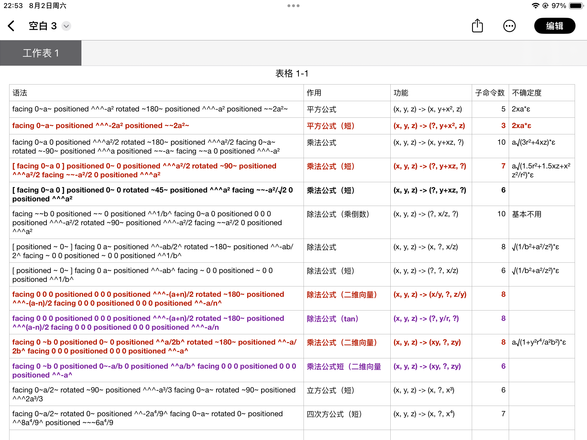
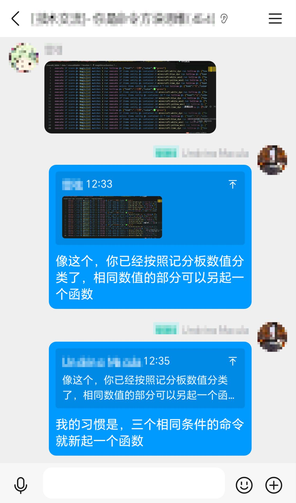

::: tip Translation notice
This page was translated with machine translation and may contain inaccuracies. If you can help improve it, please open an issue or submit a pull request.
:::

<script setup>
import { useData } from 'vitepress'
import ColorLine from '/.vitepress/vue/ColorLine.vue'
const { isDark } = useData()
</script>

# Second cover
<ColorLine :height="4"/>

::: warning You have entered a secret page!
Just kidding.
During the update process of Vanilla Library, we found that there is no suitable place for storing some time-sensitive and detailed information in the library.
Therefore, we plan to add a page in "feature" to put some miscellaneous information. Updated with the "feature" update.
The content of this page is not fixed, it may be various information, such as command questions and answers, trivia, ~~data pack jokes~~, etc.
We have also added a discussion area for this journal at the bottom of this page. You can express your views on this issue of "Feature" below, and you can also ask us questions.
:::

## What's New in the Library?
<ColorLine :height="2"/>

::: tip
This section posts new posts recently included in the library, replacing the original "Recent Updates" page.
:::

- [bookshelf Chinese document](https://docs.mcbookshelf.dev/zh-cn/master/)
- [IconifyCraft - ICON font resource pack generator](https://iconifycraft.vercel.app/)
- [Xiaodou’s math library **v3.1** (main body)](https://github.com/xiaodou8593/math3.1)&nbsp;&nbsp; `~1.20.4-1.21~`
    - The main functions of this math library depend on the unit library and need to be installed together with the main body:
    - ([Graphics library gelib](https://github.com/xiaodou8593/math3.1_gelib))&nbsp;&nbsp;
    - ([data structure library dslib](https://github.com/xiaodou8593/math3.1_dslib))&nbsp;&nbsp;
    - ([Linear algebra library lalib](https://github.com/xiaodou8593/math3.1_lalib))&nbsp;&nbsp;
- [SKSAMA’s personal blog](https://ymqlgthbsakuradream.github.io/archives/)


## Command Flashlight Command Flashlight
<ColorLine :height="2"/>

::: tip
This section shares some command tips, mainly from the highlights of the underline group.
:::

### About entity loading
If the entity is unloaded by forceload and unloaded naturally, the uuid can be reloaded;
If the chunk is not loaded by tp or summon, it will not be generated again.
The command should not have the entityuuid list updated, so when the tpentity is not loading the chunk, the entity's uuid is still in the list, so it will be detected by summon as a duplicate uuid, and the normal process of the game will unload the entityuuid from the list, so the duplicate uuid can be summoned;
Forceload is an exception, probably because the game process is directly reused.

### Four arithmetic operations within execute context



### Control a single entity from being affected by group hatred

> "This is an experimental data pack I've been working on that allows you to control whether mobs will become hostile when their group is attacked by giving them an item with a single custom enchantment. A mob holding a sword with a custom enchantment will only become hostile when directly attacked, without joining other hostile mobs around it. Works with bees, wolves, and zombified piglins."

This is done by utilizing`follow_range`This is achieved by two unique mechanisms of attributes:
1. has a very low`follow_range`A mob will not join its hostile group and will not anger its group when attacked.
2. has non-zero`follow_range`value of mob if its`AngerTime`The NBT value is updated manually every tick, and its target is always tracked (_I don't know why this works, it just works_)
Using this data pack, hold the`cc:independence`enchanted`golden_sword`The mob has a constant`follow_range`The value is 0, so it ignores hostility from all groups. When it is attacked, its`follow_range`The value is updated to a very small number and its`AngerTime`Values ​​are updated every tick so that they chase attackers without angering their group. The data pack itself is more complex than this, but this captures the large-scale mechanism.
Limitations: Behavior is not always perfect. Sometimes when you attack independent mobs directly, 1 or 2 mobs will still be enraged. This usually happens when group mobs are very close to individual mobs when attacked, so works best in areas with lower mob density. Also, this package is not optimized for performance, but I think it's good enough to share.

https://github.com/oligomc/mccrowdcontrol

:::warning Editor's Note
After snapshot 25w41a,`AngerTime`The tag has been removed. Whether the new version is applicable to this method needs to be verified.
:::

## Q&A

In this issue, you ask me to share an experience.
In the process of writing data pack, we usually use conditions to determine whether to execute instructions. For multiple commands that are executed continuously under the same conditions, we can consider establishing a new function independently and executing the corresponding command in it. This can save the performance loss of the target selector and make the data pack more readable.

For example:
```mcfunction
execute if score @s foo matches 1 run say 1
execute if score @s foo matches 1 run say 2
execute if score @s foo matches 1 run say 3
```


It can be optimized as:
```mcfunction
execute if score @s foo matches 1 run function foo:bar
```


```mcfunction
say 1
say 2
say 3
```


My personal experience is that if there are three or more instructions with the same conditions, create another function.



<ClientOnly>
  <GiscusComment
    repo="CR-019/datapack-index"
    repoId="R_kgDONRhuqw"
category="Chats"
    categoryId="DIC_kwDONRhuq84CkchW"
    mapping="number"
    term="27"
    :strict="false"
    :reactionsEnabled="true"
    emitMetadata="0"
    inputPosition="top"
    :theme="isDark ? 'dark' : 'light'"
    lang="zh-CN"
    loading="lazy"
    class="giscus-wrapper"
  />
</ClientOnly>
