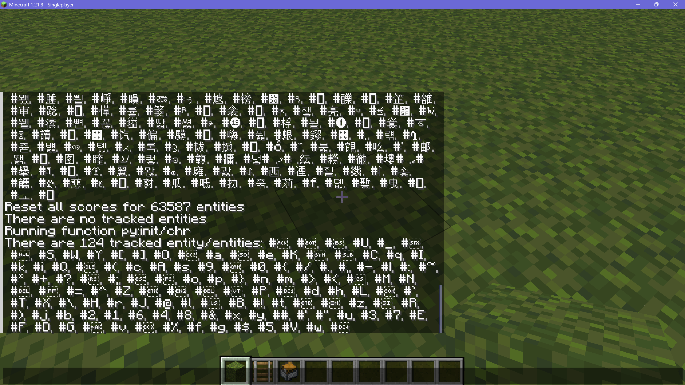
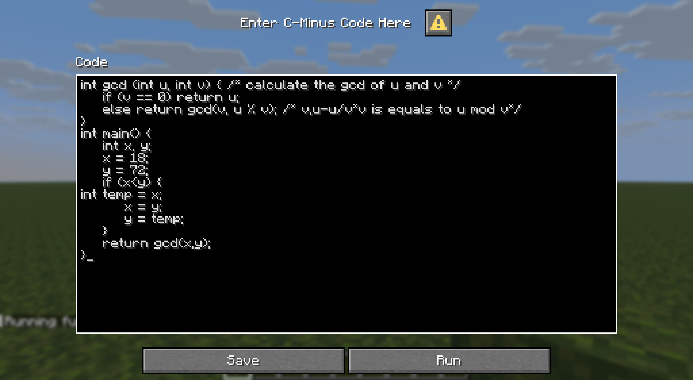
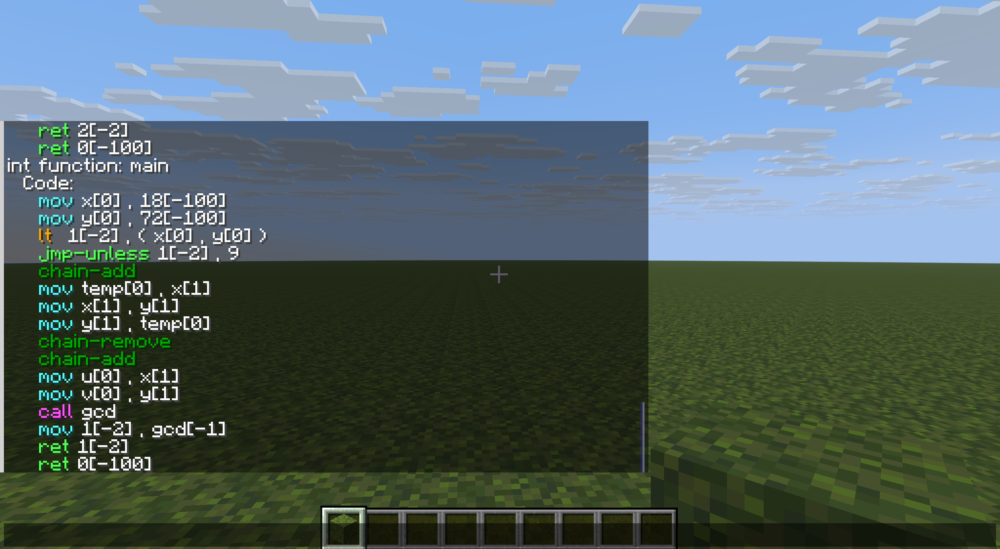

<FeaturedHead
    title = "Using data pack to make a compiler or interpreter: taking the C language subset C-Minus as an example"
    authorName = "leather sword"
    resourceLink = 'https://www.planetminecraft.com/data-pack/in-game-c-minus-compiler-pack-programming-language/'
    cover='../../../../../feature/archive/202511/_assets/1.png'
/>

## Summary

This article introduces the concept of a compiler and the basic characteristics of mcfunction as a computer language, and demonstrates how to use data pack to create a compiler (interpreter) from a high-level language to mcfunction by implementing a complete compiler of C language subset C-Minus.

## Directory

- Preface
- [1. General introduction](#_1-general-introduction)
- [2. About source language and target language](#_2-about-source-language-and-target-language)
- [3. Lexical Analysis](#_3-lexical-analysis)
  - [3.1 data pack character recognition](#_3-1-data-pack-character-recognition)
  - [3.2 More details](/en/feature/archive/202511/1/content3)
- [4. Syntax analysis (Parse), semantic analysis and intermediate code generation](#_4-syntax-analysis-parse-semantic-analysis-and-intermediate-code-generation-content4-md)
  - [4.1 Overview of syntax analysis](#_4-1-overview-of-syntax-analysis)
  - [4.2 function and storage allocation](#_4-2-function-and-storage-allocation)
  - [4.3 Undefined Behavior](#_4-3-undefined-behavior)
  - [4.4 More details](/en/feature/archive/202511/1/content4)
- [5. Code execution](/en/feature/archive/202511/1/content5)
- [6. Operation display](/en/feature/archive/202511/1/content6)
-[7. Postscript](#_7-postscript)

## Preface

The author is not a computer-related major and has not systematically learned compilers. Most of the following text will be explained in vernacular rather than professional terms. Although some texts from "Compilation Principles" will be quoted as reference, the author does not quite understand what these texts are saying.

Since the implementation was primarily designed to be complete rather than perfect, little optimization was done. Readers in need can refer to [data pack optimization guide in the April issue of the same issue] (https://vanillalibrary.mcfpp.top/datapack-index/feature/archive/202504/3/content.html) and the relevant chapters of "Compilation Principles" to implement optimization functions.

This article can be regarded as an introduction to the topic. The author knows that there are many computer science students and even long-term practitioners among the readers. If you have any questions or suggestions about the text, please feel free to raise them in the comment area of ​​this journal. Thank you very much.

The full version of the data pack can be found [here](https://www.planetminecraft.com/data-pack/in-game-c-minus-compiler-pack-programming-language/). See the Github source code repository [here](https://github.com/LeatherSword/McFunction-C-Minus-Compiler). Due to the limitations of the author's energy and ability, this data pack may still have some bugs. You are welcome to point them out after using it.

## 1. General introduction

**Programming language** (also known as programming language, programming language) is a symbolic system used to describe calculations. How can a program written in a high-level language be executed in the game Minecraft: Java Edition (hereinafter referred to as the game)? Theoretically, it is possible to construct a Mod to directly execute a program written in a high-level language. Examples are not given here. Although this kind of practice is very common, we are data pack developers, so we will not discuss Mods here.

In fact, for data pack, what can be directly executed are low-level **McFunction language** programs, which are a sequence of instructions composed of one or more instructions, called a function. Each command corresponds to a specific action in the game. Each version of the Minecraft game has its own specific command system. For example, the command system of Javaversion has long been very different from that of Bedrock Edition, and there are some differences between Bedrock Edition and the derived Education Edition command system.

Then, high-level language programs need to be translated into McFunction programs before they can be executed in the game. Software that can complete semantic-preserving transformation from one language to another is called a **translator**, and the two languages ​​are called the **source language** and **target language** of the translator.

A **compiler** is a translator that features a target language that is lower level than the source language. This article will use data pack (mcfunction language) to construct a compiler from a high-level language (taking a C language subset C-Minus as an example) to mcfunction.

It should be noted that this article is related to the [clang-mc project published in the same August issue](https://vanillalibrary.mcfpp.top/datapack-index/feature/archive/202508/7/content.html) is different from any language or compiler implemented using external programs such as mcfpp. It aims to provide a feasibility discussion and idea demonstration of using data pack to make a compiler rather than the work itself. Readers with relevant foundations can try to understand it on their own and make compilers or interpreters from other languages ​​to mcfunction based on similar ideas. They can even try to use data pack to implement a **cross compiler** from other languages ​​​​to assembly language of a specific real-world architecture.

## 2. About source language and target language

### 2.1 About target language mcfunction

Obviously, the mcfunction language is an interpreted language rather than a compiled language. Although the mcfunction language code in the data pack will be cached, command parsing will be performed during caching (if the parsing fails, the function cannot be executed).

Since the calculations in the mcfunction language can almost only be completed through scoreboard operations, and one line of code can only complete one operation, many developers will regard it as an **assembly language** processing. For example, the aforementioned clang-mc project uses **simulation registers and x86 instruction set** operations to first convert between mcfunction and assembly language, and then use a compiler infrastructure suitable for the x86 instruction set outside the game to complete further development.

The author does not plan to criticize this view (it is undeniable that this method does bring great convenience to related development), but this article does not tend to use such a development method. In order to find a more suitable development foundation, we will sort out some basic features of the mcfunction language.

#### 2.1.1 Variables in mcfunction language

The mcfunction language has a very rich set of variable types, although these types do not necessarily have matching calculation methods. The processing of these variables themselves is similar to a high-level language, and there is no limit on the number like register operations.

The variables of mcfunction can be roughly divided into two types: scoreboard variables and NBT variables. These two variables can be converted to each other under certain conditions. Of course, in a sense, the custom boss column can also be used as a variable that can be converted into and out of the above two variables.

It is difficult to determine which type of variable type the mcfunction language belongs to, but what is certain is that mcfunction must be a typed language. For scoreboard variables, it can be regarded as a statically typed language (in fact, there is only one type: int). However, for NBT variables with type division, since the variable type is determined during runtime (for example, for command storage of type double`test:test1`In terms of processing in /datacommand`test:test1[2]`It will not cause parsing errors, it will only be reported as a command failure at runtime) and can be processed according to dynamically typed languages.

##### 2.1.1.1 Scoreboard variables

Scoreboard variables are almost the most common type of variables in the mcfunction language, and they are also the type of variables with the most calculation instructions.

Scoreboard variables can be regarded as int types, that is, their range is -2147483648 to 2147483647. When the calculation exceeds the range, it will automatically overflow. exist`/scoreboard players operation`In the command, you can perform addition, subtraction, multiplication, integer division (dividing by 0 will report an error; multiplication and division of power operations of 2 can be regarded as bit left/right shift operations), as well as larger coverage (equivalent to max), smaller coverage (equivalent to min) and exchange operations. Additionally, the scoreboard can be accessed via`/execute (if/unless) score`command performs comparison operations (equal to, greater than or equal to, less than or equal to, greater than, less than). It is a pity that mcfunction does not naturally provide bit operation mechanism.

Scoreboard variables can be passed between`/scoreboard players operation`The assignment command is moved and passed`/execute store result ... run scoreboard players get`command is converted to other variable types.

##### 2.1.1.2 NBT variables

NBT variables can store different types of information and interact with the world (block and entity), but the disadvantage is that the operations provided are insufficient.

NBT variables include integers (byte/short/int/long), floating point (float/double), strings, arrays, lists, and composite tags (key-value pairs or dictionaries). These variables have few native computational operations, but can be accessed via`/execute if data`Determine whether a key value exists or is equal to a certain value. In addition, since using a value to overwrite an identical value will cause the command to fail, you can determine whether the two NBT variables are completely equal by trying to overwrite them.

NBT variables can be passed`/data modify ... set from ...`The assignment command is moved and passed`/execute store result ... run data get`The command is converted to other variable types (since the return value is still in the int range, if the variable is a long integer, it will overflow, if it is a floating point, it will be discarded, if it is a string or a list, its length will be returned, if it is a compound tag, its number of tags will be returned). Strings can be sliced ​​and dumped. Elements can be added to the front/last of the list, and random access and random fixed-point insertion/deletion can be performed with macro functions.

##### 2.1.1.3 Customize boss column variables

Each custom boss column can store 2 int values (maximum value and current value). Although there are size restrictions when these values are set directly (the maximum value is greater than 0, the current value is greater than or equal to 0), there are no such restrictions when using /execute to transfer, that is, it can be used to access 2 int values.

Obviously this method of variable storage is not very useful, because int values ​​can be stored in the scoreboard, but the custom boss column cannot perform any operations. This storage method is mentioned here only because it happens to be`/execute store result`One of the storage locations available in command, that is, only the above three types of variables can directly access and convert each other. Even if other types of commands can access data, they almost still need to interact with these three variables (specifically, the first two), and most likely need to use macros or extract command block output to complete.

#### 2.1.2 Code organization form of mcfunction language

The mcfunction language code files in the data pack are suffixed with .mcfunction. Their execution can only be executed in sequence, with no difference in line number and no goto. Therefore, mcfunction language programs that work in non-simulated CPU mode do not rely on inter-line jumps to implement functions such as judgment. Of course, since the compiler implementation of this article does not rely on the function structure of the data pack, the code organization style may be different.

#### 2.1.3 Judgment of mcfunction language

mcfunction language usage`/execute if ... run function`command to perform judgment operations. This command can judge many types of information, and even reference another function to participate in the judgment. Because it can reference scoreboards, it can actually support most of the judgment methods available in other programming languages. And since this judgment does not necessarily require jumping to run other functions (the if subcommand can also terminate the executecommand), some Boolean operations can also be performed (note that it is not a bit operation).

#### 2.1.4 Function of mcfunction language

Each code file in the mcfunction language is called a function. The concept of function here is different from that of most other programming languages: the function of mcfunction language does not have native local variables, and all variables are global. Although parameters can be passed in in the form of NBT variables, these parameters will only be used as macros to participate in the initialization of function execution and cannot be used as local variables. Each function can provide a return value (default is 0) or a failure mark. These contents can be stored and processed by the /executecommand of the upper layer function, or they can be returned continuously. When executing the /returncommand that provides a return value, the function will be interrupted.

#### 2.1.5 Loops and recursion in mcfunction language

Since the mcfunction language does not have local variables and goto functions, the mcfunction language does not actually provide loops natively, and its recursive function actually fully assumes the role of the loop function. The recursion of mcfunction language is different from the recursion of other languages: it does not pass parameters and local variables at each level, which means that this kind of recursion does not need to occupy a lot of stack space. (Of course, if macro function calls are used in each recursive process, it should still occupy a lot of extra space to store the generated function instances.) Therefore, the mcfunction language does not have a single recursion size limit, although the command chain length and performance limitations will actually limit the recursion length.

### 2.2 About the source language C-Minus

**Note: When the author originally released the interpreter, he actually used a subset of Python. However, due to the large number of grammatical details of Python, the author developed a perfectionist tendency during the development process, which caused the development process to stagnate for a long time. At the same time, the huge number of grammatical details has made the previous draft of this article almost completely off topic. The interpreter constructed for Python will continue to be developed and released in full later, but it will not be shown in this article. **

Readers who have taken a course on compilation principles may be familiar with the language C-Minus. C-Minus is a pattern language that is almost exclusively used for compiler architecture demonstrations. It deletes most of the grammatical features based on the C language, retaining only the int type, if judgment, while loop and function functions, and supports only addition, subtraction, multiplication and division (all supported by the scoreboard). Therefore, overall it can be developed almost exclusively using scoreboard variables without the need to simulate or deal with any other grammatical miscellaneous matters.
More specific syntax situations are detailed below.

## 3. [Lexical Analysis](/en/feature/archive/202511/1/content3)

Lexical analysis is the first step of the interpreter. We will break the code stored as a string into smaller "lexical units" and form "morphemes".

Readers without relevant experience may feel dizzy or tired if they read the relevant chapters of "Compilation Principles" and try to understand the meaning of these two concepts. In fact, as a non-professional, it is difficult for the author to understand those abstract mathematical concepts. (~~Being able to write simple things with a sense of advanced mathematics may be a unique skill,~~)

Without further ado, we will use the most straightforward idea to implement the lexical analyzer.

Lexical analysis is actually breaking a long string of text into individual words. Let’s exclude Chinese for now when discussing this. (~~After reading the entire "Compilation Principles", you may not be able to automatically segment Chinese words,~~) First think about it, how do we segment words when we read English? That's right, look at the beginning and the end. A word is a complete word only if the character before the beginning is not a letter, and the character after the last character is not a letter (maybe a space or a punctuation mark). We can complete word segmentation according to different characteristics of the beginning position and the end position.

For C-Minus, this word segmentation process is slightly more complicated because we do not strictly separate different types of components with spaces. But fortunately, there are still large morphological differences between the different types of components that allow us to separate them. For reasons of space, these contents will be explained in detail later in the implementation.

### 3.1 data pack character recognition

Before the formal implementation, we need to ask: mcfunction's string does not provide native character data conversion, how can we achieve character recognition?

[August issue of the same clang-mc project](https://vanillalibrary.mcfpp.top/datapack-index/feature/archive/202508/7/content.html), the author xia__mc asked the same question in the comment area when the author released the interpreter project in May. At that time, the author gave a preliminary answer based on some experience accumulated during production. Five months later, the author has more thoughts on this issue, which are now presented as follows:

#### 3.1.1 Traverse strings

String traversal is completed using the string slicing feature of 1.19.4version23w03a, and one character will be taken from the first character of the string each time. We assume that the code is stored in location`c-:code.0`(destructible) and in position`c-:code._`Have a backup.
We will store the corresponding number of the character taken in our own c-chr scoreboard. The code corresponding to each operation is as follows (will destroy`code.0`）:

function `c-:next-char/`

```mcfunction
data remove storage c-: code.1
data modify storage c-: code.1 set string storage c-: code.0 0 1
data modify storage c-: code.0 set string storage c-: code.0 1
execute store success score #__got c- store result score @s c-chr run function c-:next-char/_ with storage c-: code
execute if score #__got c- matches 0 store result score @s c-chr run function c-:next-char/-
execute unless data storage c-: code.1 run scoreboard players set @s c-chr 0

scoreboard players add #tok1 c- 1
```
#### 3.1.2 Recognize single characters

We could of course enumerate every possible character and try to match each character retrieved. If the scale to be processed is not large, such an enumeration method is barely acceptable. In fact, due to the author's limited knowledge and limited knowledge, part of the version released in May used the "enumeration attempt coverage" solution that is less efficient than this solution.

function ~~`c-:next_char/_`~~(deprecated)

```mcfunction
execute if data storage c-: code{1:" "} run scoreboard players set @s c-chr 32
execute if data storage c-: code{1:"!"} run scoreboard players set @s c-chr 33
#... (omit 13 commands)
execute if data storage c-: code{1:"/"} run scoreboard players set @s c-chr 47
execute if data storage c-: code{1:"0"} run scoreboard players set @s c-chr 48
#... (omit 8 commands)
execute if data storage c-: code{1:"9"} run scoreboard players set @s c-chr 57
execute if data storage c-: code{1:":"} run scoreboard players set @s c-chr 58
#... (omit 5 commands)
execute if data storage c-: code{1:"@"} run scoreboard players set @s c-chr 64
execute if data storage c-: code{1:"A"} run scoreboard players set @s c-chr 65
#... (56 commands omitted)
execute if data storage c-: code{1:"z"} run scoreboard players set @s c-chr 122
#... (omit 3 commands)
execute if data storage c-: code{1:"~"} run scoreboard players set @s c-chr 126
```
However, the question asked by xia__mc at that time required the recognition of more symbols or even the entire Unicode space symbol, and the enumeration method with a complexity of O(n) instructions was obviously unable to do this, and it would almost inevitably exceed the upper limit of the number of instructions. At this time, we must need a way to complete the identification with a complexity of O(logn) or even O(1) instructions.

At this point, we have to turn our perspective to the native text matching mechanism in the game command system.

Yes, when we tried to use enumeration to solve the character problem, we had ignored a recipe built into the game's command system: the scoreboard. The scoreboard completes player name matching every time the command is parsed. The macro function mechanism of 23w31a allows us to modify the content of the player name, and then directly use the scoreboard's native matching function to complete matching with O(1) instruction complexity.

:::danger Attention
Since the scoreboard system tracks score items globally, adding too many score items to a single scoreboard (hereinafter referred to as a "mega scoreboard") will actually have a greater impact on failed queries for all scoreboards (and a small impact on successful queries).
It has been measured that in the presence of a c-chr scoreboard, regardless of whether the c-chr scoreboard is queried or not, any failed scoreboard query/operation takes approximately 10 to 30 times as long as a successful scoreboard operation and 4 times as long as a stored NBT operation.

This implementation does not care about this overhead (because compilation operations are usually completed in a single time period rather than continuously, so there is not too much efficiency consideration), but if other data packs in the same world rely on scoreboard calculations and may reference unknown scoreboard items, performance may be affected.

Therefore, when actually writing, if there are no special needs, please try to limit the content of the c-chr scoreboard to the ASCII range (just change 65536 in the third line of the Python code below to 128).
If readers need to recognize some Unicode ranges (such as implementing an easy language compiler, etc.), please refer to the content in Section 3.1.4 and try to retain only the required characters.
If the package that the reader hopes to implement does require full Unicode BMP range recognition (such as implementing Python's ord() function), please consider writing and testing the package in an independent world to avoid the giant scoreboard from interfering with the efficiency of other data packs.
If readers really need to use it in parallel with other data packs, please consider sacrificing some efficiency here and use storage NBT for matching instead.
:::

Similarly, the same effect can be achieved by borrowing NBT or Tag matching, and there is no need to make special judgments on spaces, etc. However, in fact, the corresponding double quotation marks need to be specially judged, and the efficiency is lower than that of the scoreboard.

As for the question of what type of name the scoreboard accepts, as long as there are no spaces (32), horizontal tabs (9) or newlines (10 and 13 are LF and CR respectively, usually only 10 is used), (~~Yes, the scoreboard can even accept most ASCII control characters as its player name~~) and it is not a single one`*`number (representing all projects under this scoreboard) or`@`(which will be recognized as an incomplete target selector and raise an error) will be recognized, no matter what it actually is (including full-width spaces, although commands entered in the chat box will automatically delete the full-width spaces and cause very strange behavior). As for the problem of these two symbols, it is also easy to solve. Just add a reasonable prefix. Choose to add here`#`number as a prefix (which is also equivalent to marking these names as virtual player names).



Before that, we will add a separate scoreboard specifically for recognition, using a Python script to generate the function file that adds the scoreboard items. The author here only generates characters numbered 0x00~0xFFFF (65535) (that is, the Unicode BMP plane, which contains most of the daily text), skipping the aforementioned characters that cannot be accepted by the scoreboard and some unusable characters (these characters will be reported when Python uses the chrfunction to convert`UnicodeEncodeError`abnormal). In fact, the character range supported by Python's chrfunction is 0~0x10FFFF (1114111, which is all Unicode planes), so readers in need can also adjust it up`MaxCommandChainLength`Game rules or the method of splitting the execution of multiple functions to complete a wider range of Unicode support. The code is as follows (placed in the data pack root directory):

```python
with open('data/c-/function/init/chr.mcfunction',"w",encoding="utf-8") as f:
    f.write('scoreboard objectives add c-chr dummy')
    for i in range(0,65536):
        try:
            if i not in [9,10,13,32]:
                f.write(f'\nscoreboard players set #{chr(i)} c-chr {i}')
        except UnicodeEncodeError:
            pass
```
After executing this code, a 2.5MB function file will be generated.`c-:init/chr`. Execute this function, and then you will notice that the size of the scoreboard.dat file becomes about 466KB. This file size is actually quite acceptable. However, it should be noted that due to the large number of objects tracked by the scoreboard after this step of preparation, any use`*`Commands that select all scoreboard items (even if they are not related to the c-chr scoreboard) run the risk of causing the server to freeze.

The code for the recognition part is as follows (look at the previous function):

function`c-:next-char/_`

```mcfunction
$return run scoreboard players get #$(1) c-chr
```
#### 3.1.3 Special Judgment

There are a small number of characters that cannot be determined through the above methods. These characters include: half-width spaces, tabs, and newlines. When these characters enter the above function, the initialization will fail, and the return success value is 0. At this time, a special judgment is triggered, and the judgment of the character is finally completed. The code is as follows:

function`c-:next-char/-`

```mcfunction
execute if data storage c-: code{1:" "} run return 32
execute if data storage c-: code{1:"\n"} run return 13
execute if data storage c-: code{1:"\r"} run return 10
execute if data storage c-: code{1:"\t"} run return 9
return 65536
```
::: tip In fact, you don’t need to spend so much time on it.

In fact, in terms of parsing the code of most programming languages (even Easy Language), there is usually no need to recognize characters in the entire Unicode space. The reason is that codes beyond the scope of ASCII are generally comments, string contents or variable names, which are stored as a whole. All characters without special grammatical meaning (no matter what they are) can be regarded as "a certain character" and automatically compiled into part of the variable name/comment/string. After the recognition is completed, it is directly sliced ​​from the corresponding position of the source code and passed to the syntax analyzer.

At this time, the aforementioned initialization Python code can only retain the first loop, or even retain only punctuation spaces, numbers, and a small number of special logo letters and remove all other recognitions.

However, considering that the performance overhead of adding Unicode recognition is not large, and some programming languages ​​​​may also need to recognize the numeric encoding of a single character (since the clang-mc project does not implement a compiler in the game at all, I guess xia__mc actually wanted to ask this at the time), it is actually better to complete this function at once, and it can be used directly in two places.

:::

### 3.2 [More details](/en/feature/archive/202511/1/content3)

## 4. [Syntax analysis (Parse), semantic analysis and intermediate code generation] (./content4.md)

### 4.1 Overview of syntax analysis

::: warning note
The entire implementation content of this chapter is based on the theoretical foundations related to syntax analysis and a large number of other foundations (so it is very inconvenient to re-divide the chapters). However, based on the specific needs of the C-Minus language, we split the expression evaluation from the overall program and use bottom-up analysis alone, and all other components are analyzed using top-down analysis. The general reasons are as follows:

The source language Python of the previous draft has a characteristic: it does not require forcing all the main logic to be written in a function, so there is no obvious difference between the outermost layer and the function layer. The outermost layer can also have operation statements such as assignment and call. Therefore, for the analysis of the Python language, all bottom-up analysis is feasible.

However, C-series languages ​​have the "outermost layer" situation. In the outermost layer of the program, statements such as assignment cannot be executed, only definitions (global variables, structures, classes, and functions) can be made, while function definitions cannot be made in the inner layer (C-Minus does not support function declarations). Therefore, we need a separate layer to process the outermost content, which is why we must switch to a top-down approach to achieve upper-layer recognition.

Of course, in theory, top-down analysis of the expression evaluation part is also feasible. We use bottom-up analysis in the expression part mainly for efficiency and simplicity.
:::

#### 4.1.1 Top-down syntax analysis

If any readers have read [August issue of the same issue "Custom instructions for renaming items based on anvils"](https://vanillalibrary.mcfpp.top/datapack-index/feature/archive/202508/5/content.html), what this article describes is actually a relatively simple grammatical analysis process, and its production is as follows: (It doesn’t matter if the reader can’t understand the production. In fact, I can’t understand it either. In fact, I won’t use this thing directly in the subsequent process because the level of abstraction is too high.)$$
n\rightarrow\mathbf{digit}
$$

$$
m\rightarrow\mathbf{digit}
$$

$$
E\rightarrow nDm\mid n
$$

$$
A\rightarrow E+A\mid E
$$We can briefly translate the original author's design ideas into a top-down analysis process. Take the original author’s example as an example:$$
1D6+2D4+3
$$First place a start symbol$A$, and then try using the production$A\rightarrow E+A$Expand this expression. This attempt is what the original author said "Scan every character, check for delimiters$+$".

If delimiter is checked$+$, which represents the part before the + sign ($1D6$)match$E$, matching later$A$; After that, the program will continue to match the following$A$Try the same extension. Otherwise (if the last item has been scanned), it cannot be matched, and instead, use$A\rightarrow E$production.

This process then produces$E$Try using production$E\rightarrow nDm$Expansion, the process is the same as above, and the delimiter is also scanned$D$, if not available, use instead$E\rightarrow n$Production matching.

Of course, the number of productions in most modern programming languages ​​far exceeds the simple requirement of "instruction roll". The top-down analysis process is relatively complicated, because when the number of productions is large, it is difficult to determine which production to use for expansion from the beginning, and time-consuming backtracking operations are inevitable (although people have done their best to reduce the number of required backtrackings, the related operations also make the code very unintuitive).

#### 4.1.2 Bottom-up "shift-reduce" analysis

Therefore, this article will use another analysis process in the expression part, that is, the bottom-up analysis process, that is, the "shift-reduce" analysis method. This method does not try to "decompose" a starting symbol into a set of symbols or morphemes, but instead "merges" the morphemes into symbols step by step as a set of morphemes is read in.
However, because the original description of these methods is too abstract, these definitions may be greatly misinterpreted below, and syntax trees will be used directly instead of other concepts such as parse trees.

We take the following expression as an example to briefly introduce the basic idea of ​​the "shift-reduce" parsing method:$$
1*6+2*4*5+3
$$Scan each character from left to right (actually a lexeme, here all 1-character long morphemes are used for convenience):

```
1                 -- *6+2*4*5+3
*(1,)             -- 6+2*4*5+3
*(1,),6           -- +2*4*5+3
*(1,6)            -- +2*4*5+3
计算: 1*6=6
+(*(1,6),)        -- 2*4*5+3
+(*,),2           -- *4*5+3
+(*,),*(2,)       -- 4*5+3
+(*,),*(2,),4     -- *5+3
+(*,),*(2,4)      -- *5+3
计算: 2*4=8
+(*,),*(*(2,4),)  -- 5+3
+(*,),*(*,),5     -- +3
+(*,),*(*,5)      -- +3
计算: 8*5=40
+(*,*(*,5))       -- +3
计算: 6+40=46
+(+(*,*),)        -- 3
+(+,),3           --
+(+,3)            --
计算: 46+3=49
```
Ultimately, we hope to transform it into a syntax tree in the following form: (and a series of operation codes)

<div class="nbttree">

<node type="compound" name="" /> +

- <node type="compound" name="" /> +
  - <node type="compound" name="" /> *
    - <node type="int" name="" /> 1
    - <node type="int" name="" /> 6
  - <node type="compound" name="" /> *
    - <node type="compound" name="" /> *
      - <node type="int" name="" /> 2
      - <node type="int" name="" /> 4
    - <node type="int" name="" /> 5
- <node type="int" name="" /> 3

</div>

Each scanned character will be pushed onto the stack (moved in), but sometimes you can decide whether to merge (reduce) the previous content before pushing onto the stack. According to the rules of the syntax tree, this merge will merge the quantities into the operators.

The key situation is that sometimes the information currently obtained is not enough to ensure that the previous content can be merged. In the absence of operator hierarchy, a "shift-reduce conflict" will occur, as read$1*6+2$When it is not possible to determine whether to continue the push operation or whether the$2$Merge into operator$+$. However, under the premise of clarifying the operator level, this problem can be solved by reading 1 more character, such as reading 1 more character$*$You can decide$2$Cannot be merged into operator alone$+$, that is, it cannot be reduced.

Because the author really didn’t understand$LR$The specific operation of parsing, so the implementation of this article does not follow$LR(1)$The method of analysis will not be used$LR$The "abstract state" in the analysis (that is, the state in the stack is still determined by the contents of the stack.) can only be said to be ordinary "shift-reduce" analysis.

But no matter what, shift-reduce analysis is essentially a deterministic finite automaton (DFA), so its structure is composed of many nodes like the lexical analyzer, except that the jump of each node is changed from "getting the next character" to "getting the next morpheme".

#### 4.1.3 Intermediate code generation

The C-Minus language we use all uses int type variables (that is, scoreboard variables), and all operation operations can be directly determined as scoreboard operation operations.
In theory, this already allows us to directly generate mcfunction code, but due to the existence of scope and function, the scoreboard where the scoreboard item operation is located cannot be directly determined, so we can still only generate intermediate code and cannot compile it into fixed code more specifically.

Since the reduction operation is always performed from the bottom up, the order of the reduction operations can directly correspond to the order of the generated intermediate code without additional overhead of building a dependency graph.

The intermediate code we will use is listed below:

```mcfunction
# add <s>(<s_>) , <o>(<o_>)
scoreboard players operation <s> <s_> += <o> <o_>

# sub <s>(<s_>) , <o>(<o_>)
scoreboard players operation <s> <s_> -= <o> <o_>

# mul <s>(<s_>) , <o>(<o_>)
scoreboard players operation <s> <s_> *= <o> <o_>

# div <s>(<s_>) , <o>(<o_>)
scoreboard players operation <s> <s_> /= <o> <o_>

# mod <s>(<s_>) , <o>(<o_>)
scoreboard players operation <s> <s_> %= <o> <o_>

# mov <s>(<s_>) , <o>(<o_>)
scoreboard players operation <s> <s_> = <o> <o_>

# add-chain
<向访问链中增加一位>

# remove-chain
<移除访问链末位>

# call <f>
<跳转至函数f的第一行代码>

#ret <s>(<s_>) <f> (Note: f is automatically attached to the intermediate code at compile time. Even functions without return values ​​are treated as returning 0 here.)
<从现有函数中返回>

# eq <s>(<s_>) , <o>(<o_>) == <o2>(<o2_>)
execute store result score <s> <s_> if score <o> <o_> = <o2> <o2_>

# ne <s>(<s_>) , <o>(<o_>) != <o2>(<o2_>)
execute store result score <s> <s_> unless score <o> <o_> = <o2> <o2_>

# gt <s>(<s_>) , <o>(<o_>) > <o2>(<o2_>)
execute store result score <s> <s_> if score <o> <o_> > <o2> <o2_>

# lt <s>(<s_>) , <o>(<o_>) < <o2>(<o2_>)
execute store result score <s> <s_> if score <o> <o_> < <o2> <o2_>

# ge <s>(<s_>) , <o>(<o_>) >= <o2>(<o2_>)
execute store result score <s> <s_> if score <o> <o_> >= <o2> <o2_>

# le <s>(<s_>) , <o>(<o_>) <= <o2>(<o2_>)
execute store result score <s> <s_> if score <o> <o_> <= <o2> <o2_>

# return <f> <o>(<o_>)
scoreboard players operation <f> c-data.global = <o> <o_>

# if <s>(<s_>) , <b>
execute if score <s> <s_> matches 0 run <跳转至b位置>

# jmp <b>
<跳转至b位置>
```
### 4.2 Function and storage allocation

#### 4.2.1 Scope

The code of C series languages ​​has scope distinction, and C-Minus requires us to implement this feature. Each function in the code has its own scope. Different instances of the function will have different scopes, and there is also a global scope.
Variables under each scope can only be read and written within this scope and its sub-scopes, and can be overwritten by variables with the same name in sub-scopes.
Theoretically, other languages ​​such as Python have very similar concepts, but there is a situation in the code of C series languages: each code block (including code blocks generated by if or while) will also generate an independent scope, so scope nesting will occur.

In real architecture, variables have been converted into register allocation information and variable information on the stack at the intermediate code level, and the variable names are discarded with the symbol table. Interested readers can reimplement the scope part in this way.
But we very much hope to make full use of mcfunction's own functions and retain the variable names until the final running process. Therefore, we will use different scoreboards to store variables with the same name in different scopes.

To save overhead, we will only perform scoreboard creation for scopes where variable definitions (including parameters) exist. Scopes will be numbered consecutively, with a specific variable tracking the total number of scopes, and a stack recording the hierarchical nesting relationship.
Theoretically, the scope change caused by the call is not the same as the sub-scope in the function (the "upper level scope" of a called function is the global rather than the caller), but since the continuity and hierarchical relationship of the calls have been determined at compile time, we can only use one layer of stack.

Since there will also be function calls during the execution of the expression, temporary scoreboards will actually interfere with each other. However, since the temporary scoreboards will not form a nested structure, we only need to create a temporary scoreboard for each function.

Since the order of code execution is fixed and C-based languages ​​do not allow nested functions, nested code blocks will form a hierarchical structure called an "access chain", and in C this chain is a "static chain" (that is, the chain determined at compile time is exactly the same as the chain at runtime). We can clarify at compile time the "distance" of the variable scope corresponding to each variable call relative to the existing scope on the access chain (except global), so **each variable in the intermediate code will also store a "scope offset value"**. The offset value represents how many levels of scope need to be searched upward to use this variable. 0 is the current scope. Normally, the value is positive. Detailed implementation will be presented below.

#### 4.2.2 Storage format

During analysis and intermediate code generation, we will use storage`c-:variable`Store variables and functions (including their intermediate codes). Follow the following format:
<div class="nbttree">

<node type="list" name="variable"/> The storage location of variables and functions.

- <node type="compound" name=""/> A variable. The variables placed in the outermost layer are global variables.
  - <node type="string" required=true name="name"/> Variable name.
  - <node type="string" required=true name="type"/> The type of the variable. For the C-Minus language implemented in this article, its value can only be "int".
  - <node type="int" name="initial"/> The initial value of the variable. Will be moved to the global scoreboard at the beginning of the program run.
- <node type="compound" name=""/> A function. Function will only exist in the outermost layer.
  - <node type="string" required=true name="name"/> function name.
  - <node type="string" name="type"/> The return value type of function. For the C-Minus language implemented in this article, its value can only be "int". If function is of void type, this item does not exist.
  - <node type="list" name="arg"/> Parameter list of function. This item must not exist for parameterless functions (the call can be appended with any number of invalid parameters), and this item must exist and be an empty list for functions that do not allow additional parameters to be called (specified using void when defining).
    - <node type="compound" name=""/> A parameter that follows the same format as a variable.
  - <node type="list" required=true name="code"/> stores a list of function intermediate codes. This must exist for function.
    - <node type="compound" name=""/> A line of intermediate code.
      - <node type="string" required=true name="v"/> Directive for intermediate code.
      - <node type="int" name=""/><node type="string" name="s"/> The scoreboard name of the source variable.
      - <node type="int" name="s_"/> The scope offset value of the source variable. Set to -100 to represent a constant scoreboard, to -1 to represent the global scope, to -2 to represent a temporary variable (this layer), and to -2147483648 to represent the variable inoperable (i.e., void type).
      - <node type="int" name=""/><node type="string" name="o"/> The scoreboard name of the target variable.
      - <node type="int" name="o_"/> The scope offset value of the target variable. Set to -100 to represent a constant scoreboard, to -1 to represent the global scope, to -2 to represent a temporary variable (this layer), and to -2147483648 to represent the variable inoperable (i.e., void type).

</div>

Of course, we will not work all in this storage item from the beginning, but will be divided into multiple levels of temporary storage items:
<div class="nbttree">- <node type="compound" name="now-declaration"/> The temporary storage location of ongoing variable declarations, the format is the same as above. The declaration of function parameters and if/while structures also use this storage bit briefly. If recognized as a function definition, the declaration will be moved to now-function.
- <node type="compound" name="now-function"/> Temporary storage location for ongoing function definitions. The format is the same as above. C-series languages ​​do not support nested functions, so this item does not use lists. After the definition is completed, the function will be moved to variable.
- <node type="list" name="now-block"/> is only used for code blocks, storing some process information of the code block to determine the jump location when the recognition is completed.
  - <node type="compound" name=""/> One of them.
    - <node type="int" name="0"/> This item is used in the while code block to store the start position of the loop. At the end of the code block, a jump to the beginning of the loop is appended.
    - <node type="int" name="1"/> This item is used in if and while code blocks to store the judgment position. After the code block ends, the jump line number will be appended to the line number of the item record.
    - <node type="bool" name="chain"/> Whether there are local variables defined inside the code block determines whether a new scope level needs to be created in the code block (the new scope operation is completed at the location where the local variables are defined). A function will always have a new scope created by the layer above it.
- <node type="list" name="now-variable"/> The variable of the code block being defined. Due to the existence of nested code blocks, this is implemented as a list (stack). When determining the scope level of a variable, traverse the list from back to front to find the variable definition. The list is discarded after definition is complete.
  - <node type="list" name=""/> A list of local variables of a code block, the format is the same as above.
- <node type="list" name="now-expression"/> The expression undergoing shift-reduce analysis. Due to the presence of parentheses, it is also implemented as a list (stack). In theory, when an expression reaches its end position, there should be only 1 element in the list.
  - <node type="compound" name="_"/> An element of the expression. Slip one layer inwards to allow for some matching. The operator automatically merges with the previous element.
    - <node type="int" name=""/><node type="string" name="_"/> Scoreboard name for the variable.
    - <node type="string" name=""/><node type="int" name="__"/> The scope offset value of the variable. Set to the string "global" to represent the global scope, and set to "temp" to represent a temporary variable.
    - <node type="byte" name="v"/> operator.
- <node type="list" name="now-codeline"/> The intermediate codeline now being generated is temporarily stored here. This item is added for optimization purposes, and it may not be included, but some codes will be more cumbersome.

</div>

### 4.3 Undefined behavior

There are many operations in C language that are characterized as undefined behavior. Of course, since the C-Minus language we implemented has removed most of the features of C, many undefined behaviors do not exist (such as forced pointer type conversion), but there are still some undefined behaviors that may occur.
For example, multiple assignments and modifications to the same variable may occur in an expression before being referenced (for example`b=(a=3)+(a=4)`), or consecutive comparison symbols appear in the expression (since the C-Minus language does not have Boolean operations, only one comparison symbol is allowed to appear in an expression at most).
The implementation of this article will not support these undefined behaviors, please do not expect the results of these behaviors.

### 4.4 [More details](/en/feature/archive/202511/1/content4)

## 5. [Code Run](/en/feature/archive/202511/1/content5)

In real architecture, the assembly code or intermediate code converted from high-level language will be further converted into machine language for execution.
Here, we will use macros to convert the intermediate code into mcfunction code to complete execution.

There are two main issues that need to be dealt with at this stage:

1. How to determine the scoreboard where a variable is located through scope;
2. How to implement jump.

We will always use a program counter stack to maintain the current function and line of code. Each counter in the counting stack stores two positions: pos and next-pos.
Before each execution, use the last next-pos to overwrite pos as the executed code position, and add 1 bit to overwrite next-pos. The jump instruction in the program may overwrite next-pos, while the call instruction will add an item to the stack.

## 6. [Run Display](/en/feature/archive/202511/1/content6)

In order to show our compilation effect in Minecraft, most basically, we need a code editing box for inputting C-Minus source code.



In addition, the intermediate code is of great significance for troubleshooting possible errors during the compilation process. In fact, it also determines whether our compiler can truly achieve mapping. At the same time, the intermediate code display can be used for some analysis.



## 7. Postscript

If you are not a computer science student, I should give you a round of applause if you have made it this far.
But since I am not a computer science student, I am quite broken down as I write this, and now I have no energy to applaud.

If you ask me what the use of such a thing is, I can only say that it is of no use.
C-Minus is a language that has no native output method, so the running program can only interact with us through the return value of mainfunction.
(Python's writing method and output method are still a bit too easy to use, so if such a thing exists, the following content will easily become dull.)

However, as mentioned before, this article only provides an idea, and more ambitious works can appear based on this idea.

Come to think of it, what I want to say in the postscript seems to have been said in the preface, so I would like to thank CR and the Vanilla Library team again for giving me this platform to share what I want to do. The postscript will stop here.

This article was drafted on August 30, 2025, rewritten on September 22, 2025, and finalized and submitted on October 6, 2025.
Affected by the new features of 2025.10.09, the author wrote another article, so this article was not published in the October issue.
The final revision will be completed on October 24, 2025, and will finally be presented in the November issue.