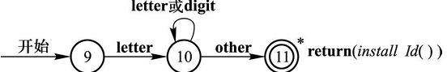
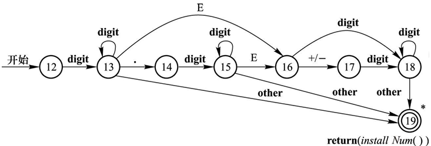
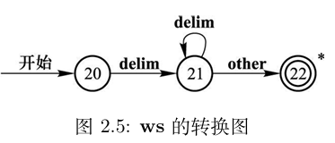

---
next:
    text: 'Return to original text'
    link: '/feature/archive/202511/1/content'
---

# [Use data pack to make a compiler or interpreter: take the C language subset C-Minus as an example](/en/feature/archive/202511/1/content)

## 3. Lexical Analysis

### 3.2 Preparation

function`c-:init/`

```mcfunction
scoreboard objectives add c- dummy
scoreboard players set 10 c- 10
scoreboard players set -1 c- -1
```


functiontag `minecraft:load`

```json
{
    "replace": false,
    "values": [
        "c-:init/",
        "c-:init/chr",
        "c-:init/operator",
        "c-:init/reserved",
        "c-:init/token"
    ]
}
```
#### 3.2.1 Reserved word recognition

We will prepare a scoreboard for reserved word recognition.
In order to complete the related recognition of reserved words, we first need a set of functions to extract existing morphemes.

function`c-:now-token/`

```mcfunction
execute store result storage c-: extract.0 int 1 run scoreboard players get #tok0 c-
execute store result storage c-: extract.1 int 1 run scoreboard players get #tok1 c-
return run function c-:now-token/_ with storage c-: extract
```


function `c-:now-token/_`

```mcfunction
$return run data modify storage c-: extract._ set string storage c-: code._ $(0) $(1)
```
The Python language used in the previous draft of this article has a total of 35 reserved words, but the C-Minus language used in this article is extremely streamlined in this regard, with only 6 reserved words. Therefore we list it directly as follows:

function`c-:init/reserved`

```mcfunction
scoreboard objectives add c-reserved dummy
scoreboard players set #if c-reserved -1
scoreboard players set #else c-reserved -2
scoreboard players set #while c-reserved -3
scoreboard players set #int c-reserved -4
scoreboard players set #void c-reserved -5
scoreboard players set #return c-reserved -6
```
Use the following function for reserved word recognition (fixed input parameters are extraction results):

function`c-:now-token/-`

```mcfunction
$return run scoreboard players get #$(_) c-reserved
```
### 3.2.2 Operator identification preparation

We will take another scoreboard to store the identifiers of each operator.
For convenience, the encoding of all single-character operators is the same as their ASCII code, and no duplicate registration is performed here.

Likewise, under C-Minus language, the number of operators is also very small.

function`c-:init/operator`

```mcfunction
scoreboard objectives add c-operator dummy
scoreboard players set #+= c-operator 70
scoreboard players set #-= c-operator 71
scoreboard players set #*= c-operator 72
scoreboard players set #/= c-operator 73
scoreboard players set #%= c-operator 74
scoreboard players set #!= c-operator 75
scoreboard players set #>= c-operator 76
scoreboard players set #<= c-operator 77
scoreboard players set #== c-operator 78
```
### 3.2.3 Other preparations

We will prepare a number for the morpheme type. This number is used for the return after lexical analysis obtains the morpheme (directly stored in the player's c-token scoreboard), as listed below:
(The morpheme numbers of operators and reserved words are their own numbers above)

function`c-:init/token`

```mcfunction
scoreboard objectives add c-token dummy
scoreboard players set #end c-token 0
scoreboard players set #name c-token 1
scoreboard players set #number c-token 2
scoreboard players set #error c-token 127
```
In addition, we will also use predicate to solve some character types that may significantly reduce the readability of the code when judged in execute.
(For this reason, we chose to use the player's score recording character encoding on the scoreboard instead of creating a separate virtual player for recording.)

predicate`c-:digit` ([0-9])

```json
{"condition":"entity_scores","entity":"this","scores":{"c-chr":{"min":48,"max":57}}}
```


predicate `c-:id_start`([A-Za-z_], and other Unicode characters that form variable names)

```json
{"condition":"any_of","terms":[
    {"condition":"entity_scores","entity":"this","scores":{"c-chr":{"min":65,"max":90}}},
    {"condition":"entity_scores","entity":"this","scores":{"c-chr":{"min":97,"max":122}}},
    {"condition":"entity_scores","entity":"this","scores":{"c-chr":{"min":127}}},
    {"condition":"entity_scores","entity":"this","scores":{"c-chr":94}}]
}
```


predicate `c-:id_continue`([0-9A-Za-z_], and other Unicode characters that form variable names)

```json
{"condition":"any_of","terms":[
    {"condition":"reference","name":"c-:id-start"},
    {"condition":"reference","name":"c-:digit"}]
}
```


predicate `c-:operator`

```json
{"condition":"any_of","terms":[
    {"condition":"entity_scores","entity":"this","scores":{"c-chr":{"min":33,"max":47}}},
    {"condition":"entity_scores","entity":"this","scores":{"c-chr":{"min":58,"max":64}}},
    {"condition":"entity_scores","entity":"this","scores":{"c-chr":{"min":91,"max":94}}},
    {"condition":"entity_scores","entity":"this","scores":{"c-chr":96}},
    {"condition":"entity_scores","entity":"this","scores":{"c-chr":{"min":123,"max":126}}}]
}
```


predicate `c-:operator2`(Characters that can form a 2-character operator. This predicate is only used for the optimization operation of the operator part, and its removal will not affect the operation.)

```json
{"condition":"any_of","terms":[
    {"condition":"entity_scores","entity":"this","scores":{"c-chr":37}},
    {"condition":"entity_scores","entity":"this","scores":{"c-chr":42}},
    {"condition":"entity_scores","entity":"this","scores":{"c-chr":43}},
    {"condition":"entity_scores","entity":"this","scores":{"c-chr":45}},
    {"condition":"entity_scores","entity":"this","scores":{"c-chr":47}},
    {"condition":"entity_scores","entity":"this","scores":{"c-chr":58}},
    {"condition":"entity_scores","entity":"this","scores":{"c-chr":60}},
    {"condition":"entity_scores","entity":"this","scores":{"c-chr":61}},
    {"condition":"entity_scores","entity":"this","scores":{"c-chr":62}}]
}
```


predicate `c-:skip` ([ \t\n])

```json
{"condition":"any_of","terms":[
    {"condition":"entity_scores","entity":"this","scores":{"c-chr":9}},
    {"condition":"entity_scores","entity":"this","scores":{"c-chr":10}},
    {"condition":"entity_scores","entity":"this","scores":{"c-chr":13}},
    {"condition":"entity_scores","entity":"this","scores":{"c-chr":32}}]
}
```
### 3.3 Officially started to implement the lexical analyzer

Lexical analysis and syntax analysis will be completed in the same loop. In the implementation of this article, the syntax analyzer is used to call the lexical analyzer to obtain morphemes.

The lexical analyzer is composed of a series of functions, which form a deterministic finite automaton by calling each other. Each function can be regarded as a node on the state transition diagram of the finite automaton.

After the recognition is completed, the lexeme is submitted to the grammar analyzer.

::: tip note
All functions that exist as complete nodes in subsequent functions will have comments to clearly classify the operations performed by the node.
These comments will divide each node into 4 parts: calculation of the current character (THIS), calculation or jump to read the next character (NEXT), error handling (ERROR), and end (END).
Even if a node does not have one or several of these parts, the relevant annotations still exist.
Readers can ignore these comments when writing specifically.
:::
The beginning position of the recognized lexeme will always be tracked during the recognition process (`#tok0`) and the ending position (`#tok1`).
::: warning note
The storage of the position is consistent with the convention of /data string, that is, starting from 0, including the former and excluding the latter.
The character being recognized is in the string`#tok1`position, but will not be included in the range of recognized morphemes.
Use anytime`/data ... string ... (#tok0) (#tok1)`Recognized morphemes will be extracted.
:::

#### 3.3.1 Recognition starts

Since it is usually possible to determine that the first character of the next morpheme has been read when the previous morpheme ends, another character will not be obtained at the beginning of recognition, but will start from the character that has been read. Each subsequent node also follows a similar structure, that is, it first processes the character at the current position, and then obtains the next character and decides to jump after completion. Therefore, the entire lexical analysis process starts with reading 1 character.

function`c-:lexical-analysis/start`

```mcfunction
data modify storage c-: code.0 set from storage c-: code._
function c-:next-char/
scoreboard players set #tok0 c- 0
scoreboard players set #tok1 c- 0
return run function c-:lexical-analysis/node/
```
The acquisition process of morphemes always starts from the start state node of the finite automaton. If the start state node cannot jump to any node, it returns according to the "end of file" lexeme.

function`c-:lexical-analysis/node/`

```mcfunction
scoreboard players reset @s c-
scoreboard players operation #tok0 c- = #tok1 c-

execute if predicate c-:id-start run return run function c-:lexical-analysis/node/name
execute if predicate c-:digit run return run function c-:lexical-analysis/node/number
execute if predicate c-:operator run return run function c-:lexical-analysis/node/operator/
execute if predicate c-:skip run return run function c-:lexical-analysis/node/skip

scoreboard players operation @s c-token = #end c-token
```
If an error occurs during the acquisition of morphemes, the following function will be called to display the error message and return the "error" lexeme to the grammar analyzer to terminate its work. Some translation keys are reserved in the function to facilitate error messages to call the current lexeme, current character and other information. Note that this function is also used when the parser encounters an error.

function`c-:terminate`

```mcfunction
function c-:now-token/
$tellraw @s {"translate":"$(msg)","color":"red","with":[{"storage":"c-:","nbt":"code.0"},{"storage":"c-:","nbt":"code.1"},{"storage":"c-:","nbt":"extract._"}]}
scoreboard players operation @s c-token = #error c-token
```
#### 3.3.2 Variable name

- **Reference regular expression:**`[A-Za-z_][0-9A-Za-z_]*`- Behavior: No behavior.
- Jump: If characters matching the variable definition continue to appear, jump to itself.
- End: Extract the entire variable text, try to match reserved words and submit it as variable name/reserved word.



function `c-:lexical-analysis/node/name`

```mcfunction
# -- THIS --

# -- NEXT --
function c-:next-char/
execute if predicate c-:id-continue run return run function c-:lexical-analysis/node/name

# -- ERROR --

# -- END --
function c-:now-token/
execute store result score @s c-token run function c-:now-token/- with storage c-: extract
execute if score @s c-token matches 0 run scoreboard players operation @s c-token = #name c-token
```
#### 3.3.3 Numbers



Most programming languages support a variety of numerical inputs, such as other base numbers, decimals, exponents, and even imaginary numbers, and may also use underscores to separate numbers. This results in a large number of nodes required for digital input. For example, when the author implemented the previous draft of Python digital input, it took a full 23 nodes to complete it. The workload can be imagined. But since C-Minus only inputs decimal integers, only 1 node is needed.

It is agreed here that the number is stored in the player's`c-`on the scoreboard.

**Decimal Integer Node**: Processes decimal integers (~~and the integer part of decimals~~).

- **Reference regular expression:**`[0-9]+`- Behavior: Multiply the stored number by 10 and add the new digit.
- Jump to:
  - If it is still a numeric character, jump to itself.
  - ~~If it is an underscore, jump to the separator node. ~~
  - ~~If it is a decimal point, jump to the starting node of the decimal point. ~~
  - ~~If it is an index mark (Ee), jump to the index start node. ~~
  - ~~If it is an imaginary number mark (Jj), jump to the imaginary number node (end). ~~
- Error: Report "invalid decimal literal" if other characters are present.
- end: submitted as an integer.

function`c-:lexical-analysis/node/number`

```mcfunction
# -- THIS --
scoreboard players operation @s c- *= 10 c-
scoreboard players operation @s c- += @s c-chr
scoreboard players operation @s c- -= #0 c-chr

# -- NEXT --
function c-:next-char/
execute if predicate c-:digit run return run function c-:lexical-analysis/node/number

# -- ERROR --
execute if predicate c-:id-start run return run function c-:lexical-analysis/terminate {msg:"SyntaxError: invalid decimal literal"}

# -- END --
scoreboard players operation @s c-token = #number c-token
```
#### 3.3.4 Operators

Operators may consist of 1 to 2 symbols.
Some operators must use the next character to determine that the operator has ended, while other operators' own structures have determined that they can end directly, but still need to obtain the next character to avoid an infinite loop.
In addition, the C-Minus language uses the C language composed of`/*`beginning`*/`Annotation types at the end, so entry needs to be provided in the operator section.

function`c-:lexical-analysis/node/operator/`

```mcfunction
# -- THIS --
scoreboard players operation @s c-token = @s c-chr

# -- NEXT --
function c-:next-char/
execute if score @s c-token = #/ c-operator if score @s c-chr = #* c-chr run return run function c-:lexical-analysis/node/comment/
execute if predicate c-:operator2 if function c-:lexical-analysis/node/operator/_ run function c-:next-char/

# -- ERROR --

# -- END --
```


function `c-:lexical-analysis/node/operator/_`

```mcfunction
#This function is part of the node operator/ and is not a node function itself.
execute if score @s c-token = #+ c-chr if score @s c-chr = #= c-chr run return run scoreboard players operation @s c-token = #+= c-operator
execute if score @s c-token = #- c-chr if score @s c-chr = #= c-chr run return run scoreboard players operation @s c-token = #-= c-operator
execute if score @s c-token = #* c-chr if score @s c-chr = #= c-chr run return run scoreboard players operation @s c-token = #*= c-operator
execute if score @s c-token = #/ c-chr if score @s c-chr = #= c-chr run return run scoreboard players operation @s c-token = #/= c-operator
execute if score @s c-token = #% c-chr if score @s c-chr = #= c-chr run return run scoreboard players operation @s c-token = #%= c-operator
execute if score @s c-token = #> c-chr if score @s c-chr = #= c-chr run return run scoreboard players operation @s c-token = #>= c-operator
execute if score @s c-token = #< c-chr if score @s c-chr = #= c-chr run return run scoreboard players operation @s c-token = #<= c-operator
execute if score @s c-token = #= c-chr if score @s c-chr = #= c-chr run return run scoreboard players operation @s c-token = #== c-operator
execute if score @s c-token = #! c-chr if score @s c-chr = #= c-chr run return run scoreboard players operation @s c-token = #!= c-operator
return 0
```
#### 3.3.5 Comments

**Annotation Node** deals specifically with annotations. Due to comment exit required`*/`Two characters, we will also prepare an additional exit preparation node here.

- **Reference regular expression:**`/\*.*\*/`- Behavior: No behavior. Comments are not submitted to the parser.
- Jump to:
  - Check characters`*`Then enter the exit preparation node.
  - or end of file (`EOF`, 0), exit processing according to analysis error.
  - Jump to itself for all other characters.

function`c-:lexical-analysis/node/comment/`

```mcfunction
# -- THIS --

# -- NEXT --
function c-:next-char/
execute if score @s c-chr = #* c-chr run return run function c-:lexical-analysis/node/comment/end1
execute unless score @s c-chr matches 0 run return run function c-:lexical-analysis/node/comment/

# -- ERROR --
function c-:lexical-analysis/terminate {msg:"SyntaxError: unterminated comment"}

# -- END --
```


function `c-:lexical-analysis/node/comment/end1`

```mcfunction
# -- THIS --

# -- NEXT --
function c-:next-char/
execute if score @s c-chr = #/ c-chr run return run function c-:lexical-analysis/node/comment/end
execute if score @s c-chr = #* c-chr run return run function c-:lexical-analysis/node/comment/end1
execute unless score @s c-chr matches 0 run return run function c-:lexical-analysis/node/comment/

# -- ERROR --
function c-:lexical-analysis/terminate {msg:"SyntaxError: unterminated comment"}

# -- END --
```


function c-:lexical-analysis/node/comment/end

```mcfunction
# -- THIS --

# -- NEXT --
function c-:next-char/
return run function c-:lexical-analysis/node/

# -- ERROR --

# -- END --
```
#### 3.3.6 Skip

**Skip Node** handles characters that need to be skipped. C-Minus uses the C language coding style, ignoring all indentations and newlines, using semicolons to separate all statements, and using curly braces to separate code blocks.



- **Reference regular expression:**`[ \t\r\n]+`- Behavior: No behavior. The type and number of skipped characters does not affect syntax analysis.
- Jump to:
  - Jump to itself if it is still a skippable character.
  - Otherwise, jump to the root node and restart morpheme recognition from here (including the end of the file).

function`c-:lexical-analysis/node/skip`

```mcfunction
# -- THIS --

# -- NEXT --
function c-:next-char/
execute if predicate c-:skip run return run function c-:lexical-analysis/node/skip
return run function c-:lexical-analysis/node/

# -- ERROR --

# -- END --
```


