::: tip Translation notice
This page was translated with machine translation and may contain inaccuracies. If you can help improve it, please open an issue or submit a pull request.
:::


<FeatureHead
    title = "Workflow of core shader (Part 2)"
    authorName = "Xuanyu 1725"
    cover='../../../../../feature/archive/202511/_assets/2.png'
/>

## Overview

The first two articles are based on the shader in Minecraft and basically clarify the relevant knowledge points of the rendering pipeline. This knowledge is basically common in other graphics fields. This article follows the previous two articles and sorts out and explains the remaining content that better reflects the characteristics of Minecraft shaders. This part is equivalent to learning the rendering pipeline design of Minecraft, and it also talks about some common concepts in the field of graphics.

## UVs and textures

### sampling

In the introduction to the rendering process in the previous sections, one issue was avoided, and that is - we have been operating on vertices and interpolation, so how are the rich textures on the surface of the rendering object generated? This involves the sampling concept we are going to introduce.

The sampling process is closely related to the **sampler**. In OpenGL, a sampler corresponds to a **texture unit** one-to-one. The texture unit can be a map, geometric information (such as texture) on the surface of the object, or a simple data buffer.

The sampling process is`vsh`and`fsh`They are all used in GLSL. The most commonly used GLSL sampling functions are as follows:

```glsl
vec4 texture(Sampler2D sampler, vec2 texCoord)
```


This function needs to provide a sampler and a normalized sampling coordinate, that is$(0.0, 0.0)$Corresponding to the lower left corner of the texture unit,$(1.0, 1.0)$Corresponds to the upper right corner of the texture unit.

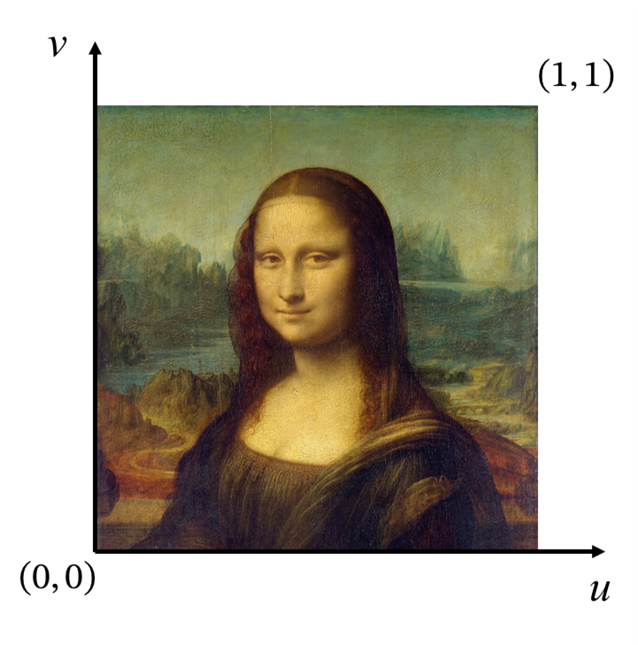

The function returns a normalized color value, that is, four rgba channels. The value range of each component is within$[0.0, 1.0]$between.

```glsl
vec4 textureLod(Sampler2D sampler, vec2 texCoord, int Lod)
```


This function is the same as`texture()`Similar, but allows the user to manually specify the Lod, whereas`texture()`The Lod level is automatically selected.

**Lod (Level of Detail)** is an optimization technology that uses textures of different complexity to sample when rendering objects at different distances. It can improve rendering performance while keeping the visual quality basically unchanged (in some scenarios it may even be better, such as eliminating moiré).

In textures, Lod control is achieved through **Multi-level progressive textures (Mipmaps)**. Mipmaps are a series of textures that are reduced in a specific pattern. In fragments far away from the camera, a single fragment can occupy a large area of ​​pixel information. In this case, sampling directly from a higher-level Mipmap can significantly reduce the amount of calculation and improve the visual effect.

<center style="color:gray;">


Mipmap diagram
</center>

::: tip Note
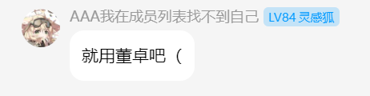
:::

use`textureLod()`Specifying the Lod level can prevent the loss of texture information and can be used for various detections (will be used in later practical chapters).

```glsl
vec4 texelFetch(Sampler2D sampler, ivec2 P, int Lod)
```


Unlike the two sampling functions above,`texelFetch()`Get pixel information directly from the specified Lod level through pixel coordinate. This function is usually not used for textures directly attached to the surface of the model, but to collect some data stored in the texture unit.

```glsl
vec4 textureProj(Sampler2D sampler, vec3 homoCoord)
vec4 textureProj(Sampler2D sampler, vec4 homoCoord)
```


This function is not that commonly used, but it is used in the rendering of the **End Portal/Warp Gate** block, so the analysis is also given here.

The coordinate provided to this function is actually a homogeneous coordinate. Perspective division is automatically performed when sampling, that is, the first two components are divided by the last component, and then the AND`texture()`Similar sampling.

### texture atlas

In order to reduce storage access, textures are loaded into a large **Texture Atlas** in advance, where each unit texture is called a **Sprite**. The texture atlas is the texture unit bound to the sampler one by one, and the UV is the coordinate that describes the sampling position on this texture atlas.

The concept of texture atlas may be unfamiliar to the average texture author until`1.19.3`The post-texture atlas is configured by the resource pack, and some authors have only just started to come into contact with it, but most texture authors still do not need to understand the principles. But for shader authors, it is very important to understand how the texture atlas is loaded for further UV and texture modifications.

<center style="color:gray; background-color: #00000048; border-radius: 10px;">

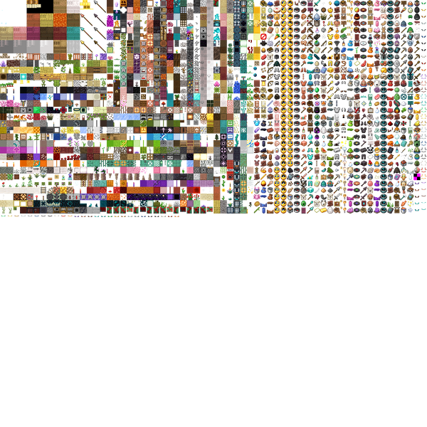

1.21.10 Texture atlas used by the baking model system in vanilla
</center>

::: tip Note
When browsing the article, you may find that there is a large blank space below the illustration. That is because the atlas is so large and it is a square picture.
:::

Some details about the texture atlas description and definition format are in [Minecraft Wiki - Textures](https://zh.minecraft.wiki/w/%E7%BA%B9%E7%90%86?variant=zh-cn#%E7%BA%B9%E7%90%86%E5%9B%BE%E9%9B%86) has been introduced in detail, these contents are not the focus of our discussion.

But it can be seen from the definition of texture atlas that the input in the shader`UV/UV0`and`Sampler0`It is not static, but is determined by the order and size of each sprite map configured in the resource pack to add the texture atlas. Further, it can be seen`UV/UV0`The value range is not fixed (unless used in texture function, but compared with other rendering processes, it is generally not considered fixed). The size of the texture atlas must be an integer power of 2, but will not exceed$16384 \times 16384$。

Therefore, when the texture atlas is fixed, we can determine what we are rendering by checking the UV values. However, since this solution checks different values ​​under different circumstances, the algorithm designed in this way is likely to be incompatible with any other resource pack or even other game versions, and is generally not recommended.

::: warning Notice
There are multiple texture atlases, and different texture atlases are generally not sent to the same rendering process, so the shader can generally only access the texture atlas to which the current rendering element belongs.
:::

### base texture

**Base Texture** is the most familiar type of texture, which is stored directly in the resource pack.`textures`directory, by`atlases`Profiles in are combined into different texture atlases.

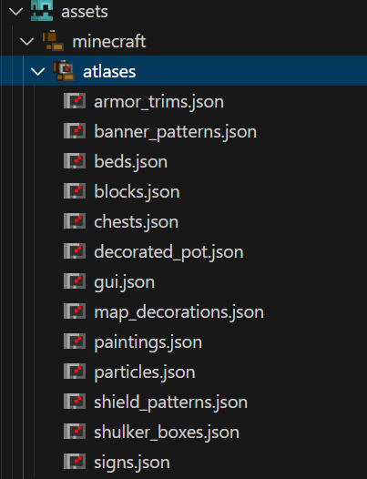

The sampler name corresponding to the basic texture is`Sampler0`The corresponding sampling coordinate name is`UV`or`UV0`. Since this type of texture sampling generally uses`texture()`function performs sampling, so it requires`UV/UV0`Is the normalized texture coordinate. Due to the characteristics of the texture atlas, when rendering the same side of the same element, there is no guarantee`UV`have the same value, and generally the value of the entire surface only occupies the interval$[0,1]$of smaller parts.

### Overlay texture

**Overlay Texture** is used to make the entity turn red when hit, and is not stored in the resource pack. The corresponding sampler name is`Sampler1`The corresponding sampling coordinate name is`UV1`。

The overlay texture is a very small texture, generally a translucent red bitmap at the bottom and a transparent top. entity changes when hit`UV1`The coordinate is transferred from the transparent value at the top to the translucent red value at the bottom. After mixing with the basic texture, the effect of the entity turning red is presented.

::: warning Notice
This sampler also exists on some objects that cannot be hit at all, such as most blocks in the backpack and the arcs of lightning creepers. This sampler does not play any role in these shaders, but sampling is still performed.
:::

## illumination

::: danger Author's note
The lighting has also been changed. The following content is also written based on 1.21.8.
:::

### lightmap

**Lightmap** is provided by shader`lightmap.fsh`A texture is generated and input as most core shaders.`Sampler2`render.

The lightmap generation process is determined by several different global quantities.

- AmbientLightFactor: Ambient lighting factor, used to adjust the contribution of ambient light to the final brightness.
- SkyFactor: Sky illumination factor, multiplied by sky illumination brightness, adjusts the contribution intensity of sky illumination.
- BlockFactor: block lighting factor, multiplied by block lighting brightness, adjusts the contribution intensity of block lighting.
- UseBrightLightmap: Whether to use a highlight light map. If it is a non-zero value, the original lighting color will be biased toward a cyan-white tone. Otherwise, the sky lighting will be blended and darkened.
- NightVisionFactor: Night vision factor, blends light colors in a brighter direction
- DarknessScale: Darkness scaling factor, reducing color values, global darkening
- DarkenWorldFactor: Darken factor, used to mix original color and darkened color
- BrightnessFactor: Brightness factor, controls the final gamma correction intensity
- SkyLightColor: sky light color

These parameters are related to time, status effects, etc. Due to limited space, a quantitative explanation of each parameter will not be given here, but will be covered in future articles, so there is no need to understand the actual role of each variable here.

In short, the light map is a map that changes with the environment. Here is a typical example of an evening light map.

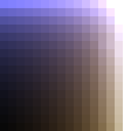

Lightmaps are created by`texture()`For sampling, the horizontal axis (u direction) is the block light intensity, and the vertical axis (v direction) is the sky light intensity. Since there are only$16$light levels$(0, 1, \cdots, 15)$, and when generating textures only$16 \times 16$different colors, the size of the light map can be considered to be$16 \times 16$

It is worth noting that the light map sampling is in`vsh`Completed within, implemented by the following code

```glsl
vec4 minecraft_sample_lightmap(sampler2D lightMap, ivec2 uv) {
    return texture(lightMap, clamp(uv / 256.0, vec2(0.5 / 16.0), vec2(15.5 / 16.0)));
}
```


### Light mixing (minecraft_mix_light)

The lighting blending function is provided by the included shader`light.glsl`A function provided, mainly used for entity lighting

```glsl
vec4 minecraft_mix_light(vec3 lightDir0, vec3 lightDir1, vec3 normal, vec4 color) {
    float light0 = max(0.0, dot(lightDir0, normal));
    float light1 = max(0.0, dot(lightDir1, normal));
    float lightAccum = min(1.0, (light0 + light1) * MINECRAFT_LIGHT_POWER + MINECRAFT_AMBIENT_LIGHT);
    return vec4(color.rgb * lightAccum, color.a);
}
```


```glsl
vertexColor = minecraft_mix_light(Light0_Direction, Light1_Direction, Normal, Color);
```


In order to understand this function, we need to introduce some theories of lighting calculations

#### Lambert's law of cosines

Lambert's cosine law is a basic law that describes the distribution of radiated energy in all directions in space by an ideal diffuse reflective surface or self-illuminating body. The radiation (or luminous) intensity of such a surface in any observation direction is at an angle between that direction and the surface normal.$\theta$Proportional to the cosine value of (essentially the amount of light irradiation of the interface)

This law can be intuitively understood from the figure below

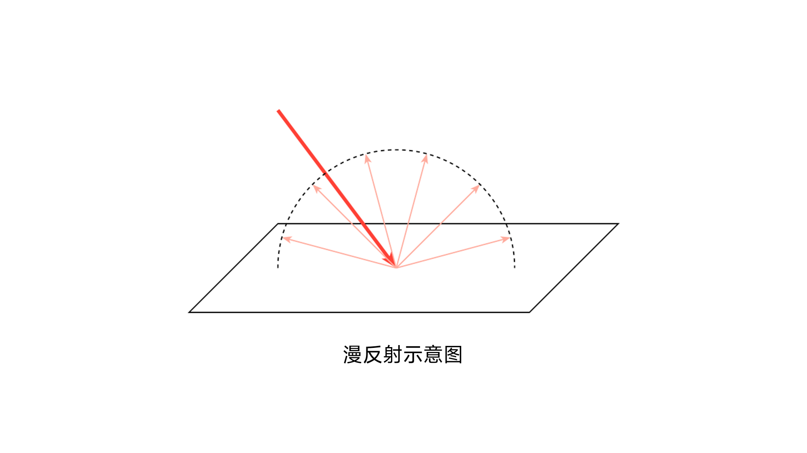

After light strikes such a surface, it will reflect the same intensity of reflected light around. Then the intensity of the reflected light only depends on the intensity of the light received by the surface.

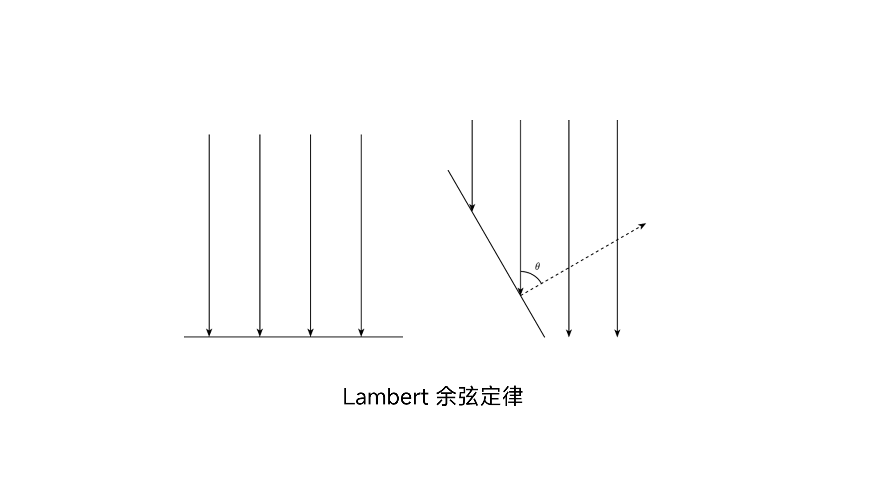

It can be seen from the figure that the angle between the surface normal and the illumination direction is$0$When, a certain area of ​​surface receives all the light irradiation. And when the included angle becomes$\displaystyle \frac{\pi}{3}$When , the amount of radiation received by a certain area is only half of the original amount. Based on geometric derivation, it can be concluded that Lambert, the angle between the amount of light irradiation and the direction and the surface normal$\theta$is proportional to the cosine value of .

```glsl
float light0 = max(0.0, dot(lightDir0, normal));
float light1 = max(0.0, dot(lightDir1, normal));
```


The first two lines of the function obtain the intensity of the reflected light through a dot product operation. Since the lighting direction and normal vector input here are both unit vectors, the definition of the vector dot product is$\boldsymbol{v_1} \cdot \boldsymbol{v_2} = \|\boldsymbol{v_1}\|\|\boldsymbol{v_2}\| \cos &lt;\boldsymbol{v_1},\boldsymbol{v_2}>$, here$\|\boldsymbol{v_1}\|, \|\boldsymbol{v_2}\|$all for$1$, so the result of the dot product is the cosine between the two vectors.

#### Mixture of lighting

The mixing of lighting is very simple, it is the sum of the lighting intensity contributed by each participating party. Here the game considers two types of lighting, with a total of three beams of light.

```glsl
(light0 + light1) * MINECRAFT_LIGHT_POWER # 刚刚我们计算的反射光
MINECRAFT_AMBIENT_LIGHT # 环境光
```


When light interacts with the surface of an object, the reflected color is the component-by-component product of the base color of the surface and the color of the light. The color here is white, and the intensity is the color of the light.

```glsl
float lightAccum = min(1.0, (light0 + light1) * MINECRAFT_LIGHT_POWER + MINECRAFT_AMBIENT_LIGHT);
return vec4(color.rgb * lightAccum, color.a);
```


Since there is no highlight effect in vanilla Minecraft, when the light intensity exceeds 1.0, it will be taken to 1.0, which results in the final rendered color not being brighter than the original color in the texture.

final,`minecraft_mix_light()`The return value will be passed in as the vertex color`fsh`middle.

```glsl
vertexColor = minecraft_mix_light(Light0_Direction, Light1_Direction, Normal, Color);
```


## fog

::: danger Author's note
kids i crashed it is now october 29th mj just changed the fog yesterday the following is as per`1.21.8`written
:::

As a leftover from the previous section, we will next make a detailed analysis of the fog rendering process in vanilla shader.

In 1.21.8, the fog mainly consists of two parts:

- **Spherical Fog**: The isosurface is spherical and dominates at close range. Related to the environment.

- **Cylindrical Fog**: Isosurfaces are cylindrical surfaces that dominate at long distances. Related to rendering distance.

Below is a desmos interactive chart that allows you to view the isosurfaces of two types of fog, the final rendered fog.

[Desmos Minecraft 1.21.8 Fog](https://www.desmos.com/3d/jocpvnusnm)

### fog.glsl

`fog.glsl`It is a **contains shader** in which a series of functions related to fog calculation are written. Since Mojang changes fog calculations very frequently, it must be clearly stated here that the version of the example is`1.21.8`, under other versions`fog.glsl`Probably different, but the logic is similar.

Below we will introduce one by one how each function provided by this file calculates fog. The complete program is given here first. There is no need to understand it now. We will come back to analyze the functions of these functions in the following content.

```glsl
#version 150

layout(std140) uniform Fog {
    vec4 FogColor;
    float FogEnvironmentalStart;
    float FogEnvironmentalEnd;
    float FogRenderDistanceStart;
    float FogRenderDistanceEnd;
    float FogSkyEnd;
    float FogCloudsEnd;
};

float linear_fog_value(float vertexDistance, float fogStart, float fogEnd) {
    if (vertexDistance <= fogStart) {
        return 0.0;
    } else if (vertexDistance >= fogEnd) {
        return 1.0;
    }

    return (vertexDistance - fogStart) / (fogEnd - fogStart);
}

float total_fog_value(float sphericalVertexDistance, float cylindricalVertexDistance, float environmentalStart, float environmantalEnd, float renderDistanceStart, float renderDistanceEnd) {
    return max(linear_fog_value(sphericalVertexDistance, environmentalStart, environmantalEnd), linear_fog_value(cylindricalVertexDistance, renderDistanceStart, renderDistanceEnd));
}

vec4 apply_fog(vec4 inColor, float sphericalVertexDistance, float cylindricalVertexDistance, float environmentalStart, float environmantalEnd, float renderDistanceStart, float renderDistanceEnd, vec4 fogColor) {
    float fogValue = total_fog_value(sphericalVertexDistance, cylindricalVertexDistance, environmentalStart, environmantalEnd, renderDistanceStart, renderDistanceEnd);
    return vec4(mix(inColor.rgb, fogColor.rgb, fogValue * fogColor.a), inColor.a);
}

float fog_spherical_distance(vec3 pos) {
    return length(pos);
}

float fog_cylindrical_distance(vec3 pos) {
    float distXZ = length(pos.xz);
    float distY = abs(pos.y);
    return max(distXZ, distY);
}
```


### Fog Context

Fog relies on a series of global variables for rendering.`1.21.8`, these parameters are:

- FogColor: Fog color
- FogEnvironmentalStart: The distance at which environmental fog (spherical fog) begins to appear
- FogEnvironmentalEnd: The distance at which environmental fog (spherical fog) reaches maximum intensity
- FogRenderDistanceStart: The rendering distance from which fog (cylindrical fog) begins to appear
- FogRenderDistanceEnd: The distance at which the rendering distance fog (cylindrical fog) reaches maximum intensity
- FogSkyEnd: The distance at which sky fog reaches maximum intensity
- FogCloudsEnd: The distance at which cloud fog reaches maximum intensity

**Spherical fog (fog_spherical_distance)**

The distance variable used to calculate spherical fog is given by the function below

```glsl
float fog_spherical_distance(vec3 pos) {
    return length(pos);
}
```


That is, the distance between the vertex and the origin (camera), and its isosurface is spherical

spherical fog`End`Typical values ​​are$1024$(atmospheric fog),`Start`for$0$, the two will differ due to different environments, such as blindness, darkness, immersion in magma or water, etc. Different environmental fogs will be applied in different environments. we will be at`着色器05: 迷雾的生成和应用`Environmental fog is introduced in detail.

**Cylindrical fog (fog_cylindrical_distance)**

The distance variable used to calculate cylindrical fog is given by the function below

```glsl
float fog_cylindrical_distance(vec3 pos) {
    float distXZ = length(pos.xz);
    float distY = abs(pos.y);
    return max(distXZ, distY);
}
```


Its isosurface is cylindrical

cylindrical foggy`Start`and`End`It is related to the rendering distance of the client.`End`is the bounds of the rendering distance (i.e.$16 \times$rendering chunk number), while`Start`for$90%$

This means that the cylindrical fog contributes nothing at all close up, but increases rapidly at the boundary of the rendering distance.

The following is a cross-section of the point cloud after the two types of fog are superimposed. Density and intensity are positively correlated:

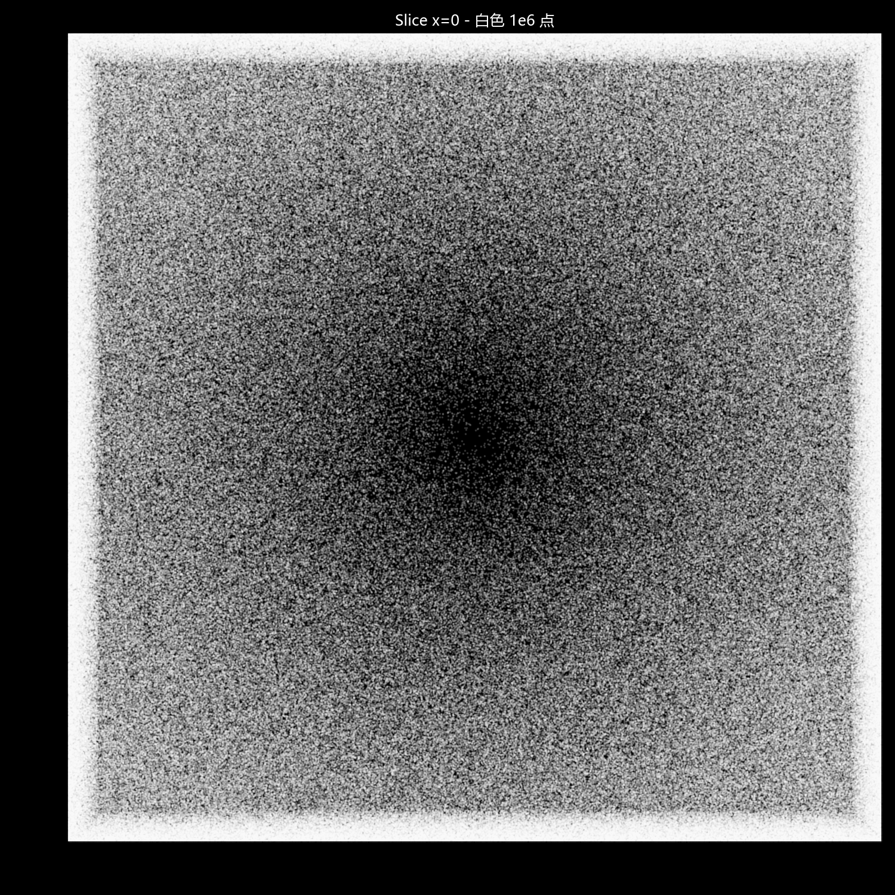

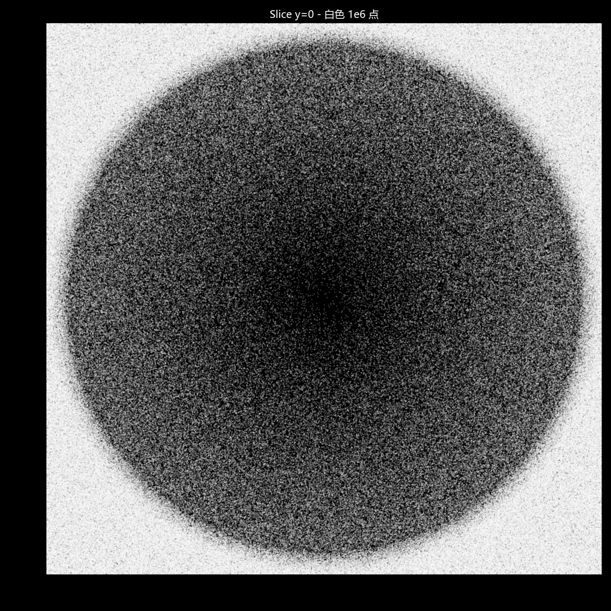

### Linear fog value (linear_fog_value)

The intensity of each type of fog depends on its`Start`and`End`increases linearly between`Start`There was no intensity before, in`End`The intensity is greatest after that. Calculated by the function below

```glsl
float linear_fog_value(float vertexDistance, float fogStart, float fogEnd) {
    if (vertexDistance <= fogStart) {
        return 0.0;
    } else if (vertexDistance >= fogEnd) {
        return 1.0;
    }

    return (vertexDistance - fogStart) / (fogEnd - fogStart);
}
```


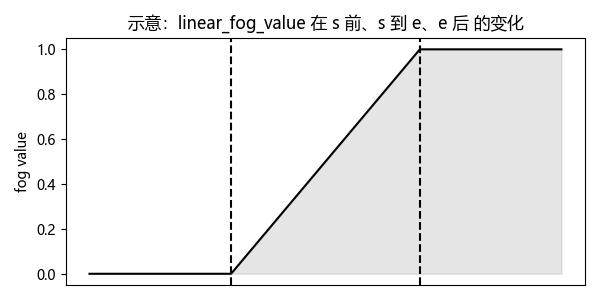

### Apply fog (apply_fog)

The fog value of a point is ultimately the strongest of the two fogs. Finally, the density of the fog (the product of the fog value and the fog color transparency) is used as the weight to mix the color of the fragment and the color of the fog, and finally output it to the color buffer.

```glsl
float total_fog_value(float sphericalVertexDistance, float cylindricalVertexDistance, float environmentalStart, float environmantalEnd, float renderDistanceStart, float renderDistanceEnd) {
    return max(linear_fog_value(sphericalVertexDistance, environmentalStart, environmantalEnd), linear_fog_value(cylindricalVertexDistance, renderDistanceStart, renderDistanceEnd));
}

vec4 apply_fog(vec4 inColor, float sphericalVertexDistance, float cylindricalVertexDistance, float environmentalStart, float environmantalEnd, float renderDistanceStart, float renderDistanceEnd, vec4 fogColor) {
    float fogValue = total_fog_value(sphericalVertexDistance, cylindricalVertexDistance, environmentalStart, environmantalEnd, renderDistanceStart, renderDistanceEnd);
    return vec4(mix(inColor.rgb, fogColor.rgb, fogValue * fogColor.a), inColor.a);
}
```


The picture below is the effect of two kinds of fog superimposed. The color indicates the intensity:

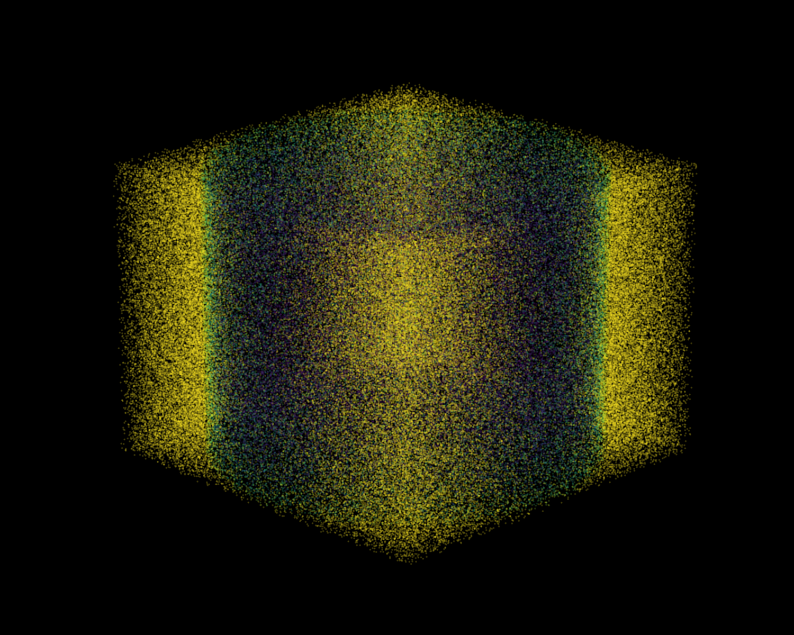

Sky fog and cloud fog use the same set of functions, only modified`Start`and`End`, is relatively simple, so it will not be analyzed here.

## Summarize

This section sorts out most of the remaining rendering work in shaders. Except for some more special shaders, most of the entity and block rendering processes are complete. Now readers should understand how an entity or block is rendered from data step by step.

For sampling, we introduced the corresponding content of different samplers, as well as the usage and characteristics of different sampling functions. For lighting, we introduced some theories of lighting calculation, but did not give the principle of light map generation. For the fog, we have a complete analysis`1.21.8`The calculation process, but the calculation principle of fog color is not given.

One thing that needs to be emphasized is that the introduction to the workflow does not require readers to fully understand the intermediate calculation process, because many parameters are calculated within the game and are not transparent within the shader. At the same time, readers are not currently required to create their own custom rendering process, but readers can also change some key parameters in the rendering process to see what changes will occur after the modification (such as the coordinates of vertices in each space, the color of vertices, etc.). Moreover, this tutorial does not focus on the teaching of GLSL language features, syntax, and linear algebra. These contents are very important. Readers can learn them when they encounter related concepts or problems. However, I recommend a certain degree of systematic learning first, so that the understanding of shaders (or even computer graphics) will be further advanced.

There is actually a lot more to talk about in the shading process of Minecraft. Since this chapter is about the workflow, only a rough introduction is given for each part. Some **specific and quantitative calculation content** will be introduced in detail in a single article in the remaining pages from the principle chapter (shader workflow is a part of it) to the practical chapter, including end portal rendering, light map creation and parameter influencing factors, fog color parameter influencing factors, etc.

