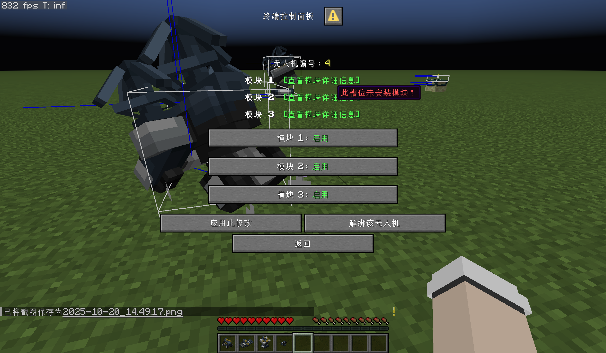
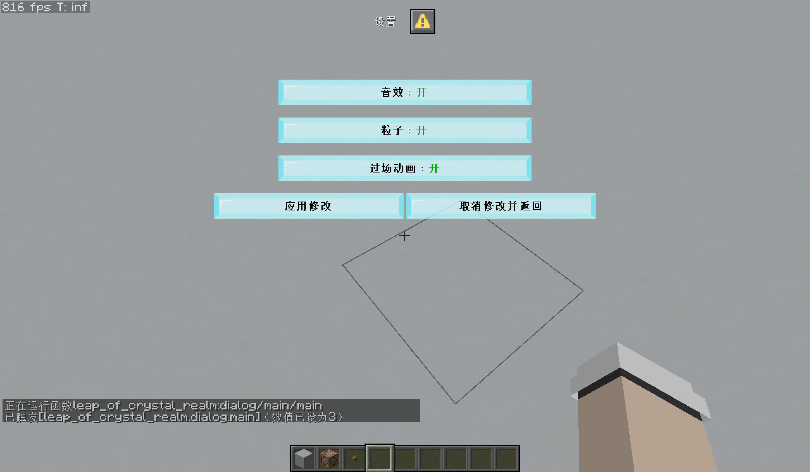

::: tip Translation notice
This page was translated with machine translation and may contain inaccuracies. If you can help improve it, please open an issue or submit a pull request.
:::


<FeatureHead
    title = "Dialog multi-input control design based on bitwise operations and multi-base encoding"
    authorName = "Xu Muxian"
    cover='../../../../../feature/archive/202511/_assets/4.png'
/>

## summary

The operation and submission behavior of the dialog are always restricted by the player's permission level. For this reason, command must be used in the click event.`/trigger`, but a scoreboardcommand can only submit one score at a time, which is a limitation for dialogs with multiple input controls. This article uses bitwise operations and multi-digit encoding on the dialog input control, and applies it to the actual developed data pack.

::: tip Editor's Note

Use a command`/trigger settings set $(input1)$(input2)$(input3)`Resolved submission of multiple input controls.
:::

## introduction

Permission levels are a set of mechanisms in the game that stipulate what commands a player can use. On the one hand, it can effectively prevent players from committing acts beyond their authority in the game; on the other hand, it will hinder the development of data pack to a certain extent. When developers write commands, they sometimes need to consider whether the execution context meets the permission level requirements and then select the corresponding command. In the command system, most commands require permission level 2, and these commands constitute the main content of data pack development. However, in some cases, developers want to turn off commands for the player, that is, set the player's permission level to 0. This can prevent the player from arbitrarily executing commands and causing certain damage to the data pack or map. If the command is executed in a function, the permission level of the function is usually 2, which can meet the needs of most command executions. If it involves the operation of player submission of content, it needs to be carefully considered. with text component`click_event`For example, when the player clicks on the text to execute the command, the text component fragment required is:

```snbt
{
  click_event:{
    action:"run_command",
    command:"<命令>"
  }
}
```


When the player executes a click event in the chat bar, the executor is the player, the execution location is the location of the player, and the execution permission level is the permission level of the player. If the player's permission level is 0, then`&lt;命令>`A lieutenant general cannot use any command with a permission level greater than 0. The solution is to use command instead`/trigger`, which requires developers to establish a criterion for`trigger`The score item, and monitor the score changes in the score item at high frequency, thereby establishing the connection between the scoreboard score and the actual required command.

Java 1.21.6 adds a dialog registry to the data pack. Dialog also provides a way for interaction between player, command, and game data, such as in static operations.`run_command`：

```json
{
  "action": {
    "command": "<命令>",
    "type": "minecraft:run_command"
  }
}
```


There are also dynamic operations`dynamic/run_command`：

```json
{
  "action": {
    "template": "<带参数的命令>",
    "type": "minecraft:dynamic/run_command"
  }
}
```


The permission levels of these contexts are determined by the player that triggers the click event. Therefore, when the player permission level is 0, it also needs to be used in these fragments.`/trigger`. Now review command`/trigger`Syntax:

```mcfunction
trigger <objective>
trigger <objective> add <value>
trigger <objective> set <value>
```


Executing click events in the chat bar is relatively simple, because the player only needs to submit one piece of data each time, so a`/trigger`can fully cope with it. For dialog, there is more than one input control, and each input control will generate corresponding data to be submitted. When the operation button is used, these data will be submitted together at the same time, and`/trigger`Only one score can be submitted for one scoring item at a time`&lt;value&gt;`. Because of this problem, it is unrealistic to reduce the input controls on a page to 1.
<div style="text-align:center">

</div>
<center style="color:gray;">
Figure 1: Dialog with multiple input controls. "Module 1", "Module 2", and "Module 3" in the figure are all input controls. The three buttons at the bottom are submission operations and can accept data from the three input controls above.
</center>

One solution is to put part of the submission data in the score parameter. exist`/trigger`In the syntax of`&lt;value&gt;`Can accommodate one submission data,`&lt;objective&gt;`Can also accommodate submission data such as:

```json
{
  "action": {
    "template": "trigger tri$(input1) set $(input2)",
    "type": "minecraft:dynamic/run_command"
  }
}
```


of which`$(input1)`and`$(input2)`They are all template parameters, or the corresponding keys of the input control. They can accommodate the actual values ​​from the corresponding keys of the input control. here`$(input2)`The scoring item score is passed in, and`$(input1)`The score item name is passed in, which requires traversing`$(input1)`All possible values, establishing all possible scoring items. when`$(input1)`When the possible value is not much, this method is not too inefficient. if`$(input1)`There are many available values, and even if there are more than 2 input control keys and there are many combinations, this method seems a bit cumbersome. Therefore, there is an urgent need for a method that can effectively accommodate multiple input values. To this end, this study proposes a bitwise operation method, which only uses`/trigger`score`&lt;value&gt;`All submission data of one page of dialog can be transferred.

## Project case

This research was initially conducted on the AMR Botdata pack, a project developed by CR_019, Alumopper, and others. Since the method described in this article is effective on AMR Bot, it was applied to the production of the parkour map "Leap of Crystal Realm II". Unless otherwise stated, all examples in this article are based on the data pack used in this map development process. This map is not yet complete at the time of writing, so content may differ from actual content after release.
<div style="text-align:center">

</div>
<center style="color:gray;">
Figure 2: Dialog used in the "Settings" item of "Leading Boundary 2"
</center>

There is a "Settings" dialog in this map, which allows the player to adjust the sound effects, particles, and cutscene options in the map. This dialog type is`multi_action`. Each option is`single_option`Type input controls, each control has two available values: "on" and "off". input control`inputs`The values ​​of the fields are as follows:

```json
"inputs": [
  {
    "label": {
      "bold": true,
      "color": "black",
      "shadow_color": 0,
      "translate": "dialog.leap_of_crystal_realm.settings.sounds"
    },
    "key": "sounds",
    "options": [
      {
        "display": {
          "bold": true,
          "color": "dark_green",
          "shadow_color": 0,
          "translate": "options.on"
        },
        "id": "1"
      },
      {
        "display": {
          "bold": true,
          "color": "red",
          "shadow_color": 0,
          "translate": "options.off"
        },
        "id": "0"
      }
    ],
    "type": "minecraft:single_option"
  },
  {
    "label": {
      "bold": true,
      "color": "black",
      "shadow_color": 0,
      "translate": "dialog.leap_of_crystal_realm.settings.particle"
    },
    "key": "particle",
    "options": [
      {
        "display": {
          "bold": true,
          "color": "dark_green",
          "shadow_color": 0,
          "translate": "options.on"
        },
        "id": "1"
      },
      {
        "display": {
          "bold": true,
          "color": "red",
          "shadow_color": 0,
          "translate": "options.off"
        },
        "id": "0"
      }
    ],
    "type": "minecraft:single_option"
  },
  {
    "label": {
      "bold": true,
      "color": "black",
      "shadow_color": 0,
      "translate": "dialog.leap_of_crystal_realm.settings.animation"
    },
    "key": "animation",
    "options": [
      {
        "display": {
          "bold": true,
          "color": "dark_green",
          "shadow_color": 0,
          "translate": "options.on"
        },
        "id": "1"
      },
      {
        "display": {
          "bold": true,
          "color": "red",
          "shadow_color": 0,
          "translate": "options.off"
        },
        "id": "0"
      }
    ],
    "type": "minecraft:single_option"
  }
]
```


There are two operation buttons below the input control: "Apply changes" and "Cancel changes and return". After clicking "Apply Modifications", the game will store these three data in the command storage so that they can be called by other parts of the map. The command used is stored as`leap_of_crystal_realm:main`, the corresponding fields are as follows:
<div class="nbttree">

<node type="compound" name=""/> root tag

- <node type="compound" name="settings"/>This tag stores options in settings.
  - <node type="bool" name="sounds"/>Whether the sound is turned on.
  - <node type="bool" name="particle"/>Whether particles are turned on.
  - <node type="bool" name="animation"/>Whether cutscenes are enabled.

</div>

This case has a total of 3 data that need to be entered. The following will introduce how to integrate these 3 data into one`/trigger`Methods in command.

## Methods and principles

Take a closer look at the command template, as described in the "Introduction" section to place partial submission data in`&lt;objective&gt;`Parameter method, it is not difficult to find that the command template is actually piecing together multiple data to form a command that can be executed. If all the data is stuffed into fractions`&lt;value&gt;`parameters, then you can use the methods described in this study: bitwise operations and multi-base encoding. Since scoreboard scores are in decimal, the "multiple base encoding" here is actually decimal in this article.

Let's first describe the concept of bitwise operations: For multiple 0 or 1 data, you might as well put them into a data string consisting only of 0 and 1, such as 1011001. In this way, each bit can be used as an independent storage space, and the whole can be regarded as a unique binary value. The core of bitwise operations is each bit in the data, which allows developers to treat a complete value as a set of independent Boolean states.

To do this, developers can map each bit in this string of data to a specific game instance. For the case of this article, 3-bit binary data can be used, and it is specified: the first bit from right to left controls`sounds`(sound effect), 2nd position control`particle`(particle), third control`animation`(cutscene). For example, the binary data of sound effects on, particles off, and cutscenes on can be expressed as`101`, the binary data of sound effects off, particles on, and cutscenes on can be expressed as`110`。

However, in this scenario, each bit accepts a number from 0 to 9, which does not necessarily have to be a binary number, and can be a multi-base encoding.

Therefore, the "Apply Modification" action button in the dialog definition can be written in the following form:

```json
{
  "action": {
    "template":"trigger leap_of_crystal_realm.dialog.settings set $(animation)$(particle)$(sounds)",
    "type": "minecraft:dynamic/run_command"
  },
  "label": {
    "bold": true,
    "color": "black",
    "shadow_color": 0,
    "translate": "dialog.leap_of_crystal_realm.settings.apply"
  }
}
```


Only used here`leap_of_crystal_realm.dialog.settings`The criterion for this scoring item is`trigger`。

After the player makes corresponding adjustments in the settings dialog and clicks "Apply Modifications", it`leap_of_crystal_realm.dialog.settings`The fraction on will be set to a fraction with a length of 3 digits, each digit being 0 or 1. Minecraft's command system does not directly provide bitwise operations. So now we need to design a certain algorithm to process this data.

In this case, the number of input digits is 3, which means that all possible combinations are$2\times2\times2=8$One can consider exhaustively all possible setting combinations. However, in order to add more setting inputs in the future, an exhaustive method will not be used here.

First you need to create a`tick`function, high frequency detection`leap_of_crystal_realm.dialog.settings`Fractionally, this function has all the cuts relative to the source file:

```mcfunction
execute as @a unless score @s leap_of_crystal_realm.dialog.settings matches -1 run function leap_of_crystal_realm:dialog/settings/trigger
```


The conditional command here determines`leap_of_crystal_realm.dialog.settings`The score is not -1, -1 is set as the initial value of the score. When all 3 inputs are 0, 0 is also valid data and therefore cannot be used as an initial value.

Next write`leap_of_crystal_realm:dialog/settings/trigger`function：

```mcfunction
#判断输入内容
scoreboard players operation #settings leap_of_crystal_realm.var = @s leap_of_crystal_realm.dialog.settings
scoreboard players set #bit leap_of_crystal_realm.var 0
function leap_of_crystal_realm:dialog/settings/bitwise/main

#重置分数
scoreboard players set @s leap_of_crystal_realm.dialog.settings -1
scoreboard players enable @s leap_of_crystal_realm.dialog.settings
```


Now the data has been converted to`#settings`exist`leap_of_crystal_realm.var`The score on is unique for each data combination. Need to write below`leap_of_crystal_realm:dialog/settings/bitwise/main`The function extracts each digit in the corresponding data.

Here is a brief introduction to the writing ideas and mathematical principles of this function: for this decimal data$N=(b_{2}b_{1}b_{0})_{10}$,in$b_{i}\in \{0,1,2,3,4,5,6,7,8,9\}$。

but$N$can be$b_{i}$Expressed as
$$
N=b_{0}\cdot 10^{0}+b_{1}\cdot 10^{1}+b_{2}\cdot 10^{2}=\sum^{2}_{i=0}{b_{i}\cdot 10^{i}}
$$
First general$N$Divide by 10, that is
$$
\frac{N}{10}=\frac{b_{0}}{10}+b_{1}\cdot 10^{0}+b_{2}\cdot 10^{1}
$$
right$N$Divide by 10 and take modulo (`%=`) operation, in the above formula$\cfrac{b_{0}}{10}$is the decimal part, the modulo result is$b_{0}$, therefore, the step of dividing by 10 modulo is to obtain the rightmost bit of the binary corresponding to this data.

The integer part is correct$N$The operation of dividing by 10 and rounding (`/=`), the result is
$$
N'=b_{1}\cdot 10^{0}+b_{2}\cdot 10^{1}
$$
This is the original data$N$The result with the rightmost digit removed$(b_{2}b_{1})_{10}$. Next, you only need to repeat the above process to extract the data on each bit from right to left until all bits are extracted. so,`leap_of_crystal_realm:dialog/settings/bitwise/main`Needs to be a recursive function.

```mcfunction
#从低位到高位提取
scoreboard players operation #temp leap_of_crystal_realm.var = #settings leap_of_crystal_realm.var
scoreboard players operation #temp leap_of_crystal_realm.var %= #10 constant
scoreboard players operation #settings leap_of_crystal_realm.var /= #10 constant

#读取这一位的数据
function leap_of_crystal_realm:dialog/settings/bitwise/read

#读取下一位：
scoreboard players add #bit leap_of_crystal_realm.var 1
execute if score #bit leap_of_crystal_realm.var matches ..2 run function leap_of_crystal_realm:dialog/settings/bitwise/main
```


in`#10`exist`constant`The score on is 10, which is a constant.`#bit`exist`leap_of_crystal_realm.var`The score on is the number of digits extracted by the current loop. It is placed in the function to control the recursion termination and prevent the command chain length from exceeding`maxCommandChainLength`to affect the execution of subsequent commands.

function`leap_of_crystal_realm:dialog/settings/bitwise/read`Used to read the data on each fixed bit and store it in command storage:

```mcfunction
#第0位：声音
execute if score #bit leap_of_crystal_realm.var matches 0 store result storage leap_of_crystal_realm:main settings.sounds byte 1.0 run return run scoreboard players get #temp leap_of_crystal_realm.var
#第1位：粒子
execute if score #bit leap_of_crystal_realm.var matches 1 store result storage leap_of_crystal_realm:main settings.particle byte 1.0 run return run scoreboard players get #temp leap_of_crystal_realm.var
#第2位：过场动画
execute if score #bit leap_of_crystal_realm.var matches 2 store result storage leap_of_crystal_realm:main settings.animation byte 1.0 run return run scoreboard players get #temp leap_of_crystal_realm.var
```


At this point, the entire system for bitwise operations has been roughly written.

There are only 3 input data in this case. If you increase the amount of input data, when there are$m$（$1\le m\le 9$，$m\in \mathbb{Z}^{+}$) input, you can use$m$Bits of decimal data$N$。$N=(b_{m-1}b_{m-2}\cdots b_{1}b_{0})_{10}$, among which$b_{i}\in\{0,1,2,3,4,5,6,7,8,9\}$. but
$$
N=b_{0}\cdot 10^{0}+b_{1}\cdot 10^{1}+\cdots+b_{m-1}\cdot 10^{m-1}=\sum^{m-1}_{i=0}{b_{i}\cdot 10^{i}}
$$
Will$N$Divide by 10, that is
$$
\frac{N}{10}=\frac{b_{0}}{10}+b_{1}\cdot 10^{0}+\cdots+b_{m-1}\cdot 10^{m-2}
$$
The result of the modulo operation is$b_{0}$, the rounded result is$b_{1}\cdot 10^{0}+\cdots+b_{m-1}\cdot 10^{m-2}$, the value after rounding
$$
N'=b_{1}\cdot 10^{0}+\cdots+b_{m-1}\cdot 10^{m-2}
$$
This is the original data$N$The result with the rightmost digit removed. Repeat the above process for new data to extract the results for each bit$b_{i}$. According to this principle, function`leap_of_crystal_realm:dialog/settings/bitwise/read`The content can be

```mcfunction
#从低位到高位提取
scoreboard players operation #temp leap_of_crystal_realm.var = #settings leap_of_crystal_realm.var
scoreboard players operation #temp leap_of_crystal_realm.var %= 10 constant
scoreboard players operation #settings leap_of_crystal_realm.var /= 10 constant

#读取这一位的数据
function leap_of_crystal_realm:dialog/settings/bitwise/read

#读取下一位：
scoreboard players add #bit leap_of_crystal_realm.var 1
execute if score #bit leap_of_crystal_realm.var matches ..<m-1> run function leap_of_crystal_realm:dialog/settings/bitwise/main
```


Pay attention to the function`&lt;m-1&gt;`, this parameter is the above$m-1$，$m-1$To prevent overflow`maxCommandChainLength`The number of bits used recursively limits. For any within the specified range$m$Value, you can use the above function to extract the data on each bit.

## Prospects and shortcomings

It is stipulated above$m$Limitations of this parameter:$m$Can only be an integer between 1 and 9 (inclusive), this is because scoreboard scores use 32-bit signed integers, which have an upper limit of 2147483647 ($2^{32}-1$), the criterion for storing pseudo-binary or multi-ary data is`trigger`When using the scoreboard, it will occupy the number of digits of 2147483647. Although 2147483647 has 10 digits, the number of digits that can completely use the numbers between 0 and 9 is only the 9 digits on the right. If the 10th digit is used, this bit can only accommodate two values ​​​​0 and 1 in a strict sense. When it is 2, the maximum available value of each bit will be limited. Reflected on the dialog, a page can contain up to 10 input controls. In order for bitwise operations to work properly, one of the controls must only contain two available values. If it contains three, the number of available values ​​for other controls will be limited, and the position used by this control is the 10th position.

Because the value$N$Each bit can only hold at most integers from 0 to 9 (including endpoints), so a dialog input control can only accept up to 10 available real values.`boolean`There are always only two available real values ​​for type input controls, and there are no restrictions;`number_range`and`single_option`Type input controls must strictly limit their number of available real values ​​to 10 or less;`text`This type of input control is uncontrollable, so this research method cannot be used for this type of input control.

In addition, scoreboard supports signed integers, while the method described in this article does not use negative numbers. Negative numbers require adding a before the number`
- `, which can actually be passed into the command template as the real value used by an input control, thereby adding an available input control. However, this input control can only support 2 available values. When it needs to be a positive number, the real value of the control should be empty.`"id": ""`. But there is a problem with using negative numbers: when the digital part is 0, the 0 and digits of the positive number are`
- `A conflict of 0 will occur and this conflict must be considered.

It can be seen that although this research method omits the process of complete exhaustion or partial exhaustion, it still limits the number of input controls in the dialog and the number of available values ​​for each input control, and it does not support it at all.`text`type of input control. Those beyond this range still need to exhaustively enumerate the names of scoring items. Future research directions could be the combination of exhaustive and bitwise operations.

## Acknowledgments

[Leather Sword](https://space.bilibili.com/2127740148?spm_id_from=333.1387.follow.user_card.click) provided the mathematical calculation basis and original code for this study.

## References

[1] &lt;https://zh.minecraft.wiki/w/%E5%AF%B9%E8%AF%9D%E6%A1%86%E5%AE%9A%E4%B9%89%E6%A0%BC%E5%BC%8F&gt;

[2] &lt;https://zh.minecraft.wiki/w/%E5%91%BD%E4%BB%A4/trigger&gt;

[3] &lt;https://zh.minecraft.wiki/w/%E6%96%87%E6%9C%AC%E7%BB%84%E4%BB%B6&gt;

[4] &lt;https://www.cnblogs.com/LuckyWinty/p/7050510.html&gt;

