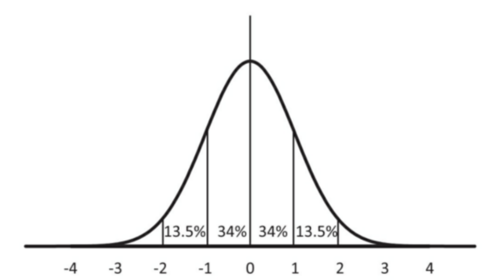
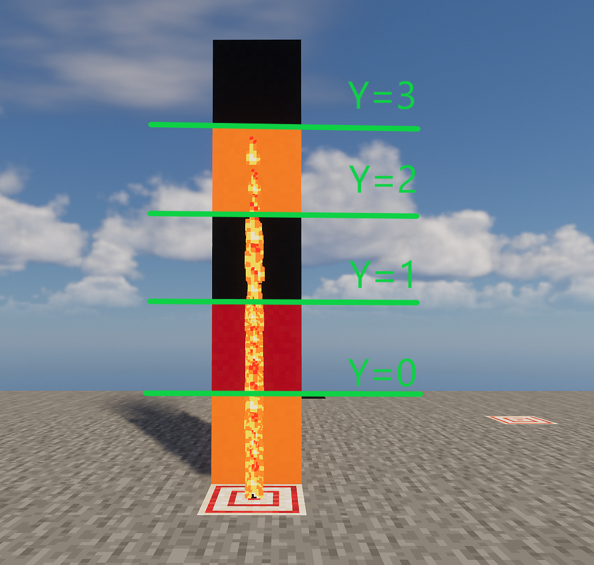
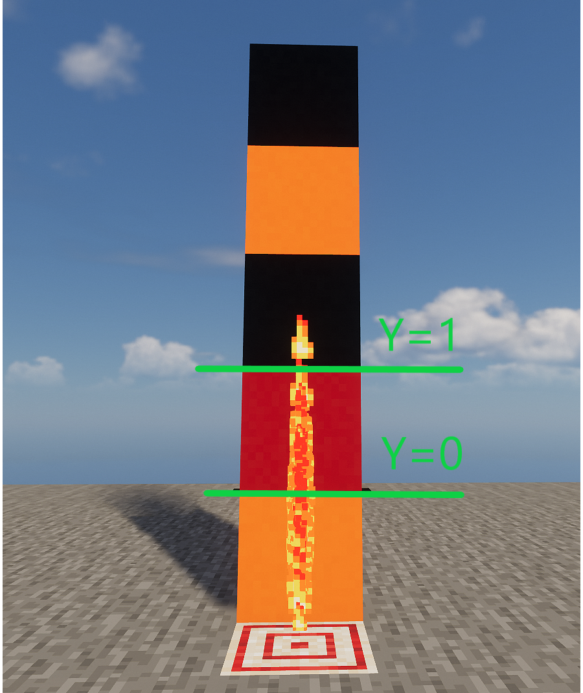
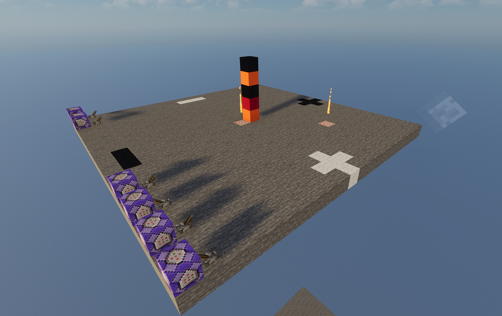
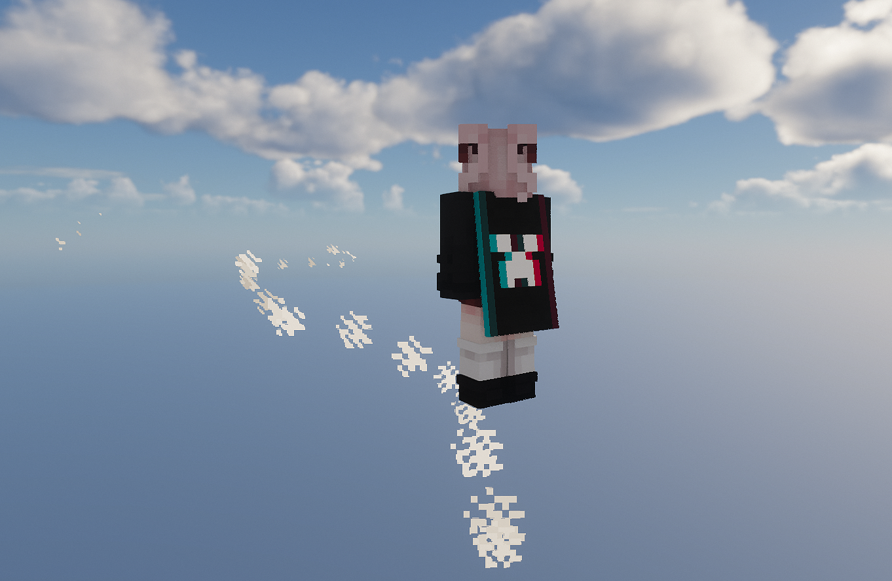

<FeatureHead
    title = "A method and simple example of directional particle emission under the particle command"
    authorName = "Antares"
    cover='../../../../../feature/archive/202511/_assets/5.png'
/>

## Summary

regular`/particle`The instructions can only generate particles that are scattered around, and cannot precisely control their movement direction. However, I found in version 1.12.2 that when the particle number parameter is set to 0, the game will calculate the position coordinate and velocity parameters in the instruction, and convert the result directly into the initial momentum of the particle, and this mechanism still exists in the latest snapshot 25w45a. "command" on wiki`/particle`Although the page explains this, its content does not conform to the actual phenomenon that occurs in the game. This study clearly reveals the core principle of this phenomenon through systematic testing and analysis.

## Introduction`/particle`Instructions have long been considered to only generate disorderly and diffuse visual effects. The direction of particle movement is random and cannot be precisely controlled, which greatly limits its application in building sophisticated animations or interactive experiences. Although existing community materials (such as Wiki) mention that setting the number of particles to zero may change particle behavior, their descriptions are vague and fallacious, and fail to reveal the exact mechanism and stable reproduction method. I will recount it next`/particle`The syntax and parameters of the command and explain how to set a stable and precise flight direction for particles. This technology provides a new solution for command developers to achieve precise particle effects on a vanilla basis.

regular`/particle`The command format is as follows:

```mcfunction
particle <name> <pos> <delta> <speed> <count> [force|normal] [<viewers>]
```
we split it

```mcfunction
particle <粒子类型> <x> <y> <z> <xd> <yd> <zd> <速度> <数量> [<模式>] [<观看者>]
```
in`&lt;x&gt;` `&lt;y&gt;` `&lt;z&gt;`The three items are`&lt;pos&gt;`,and`&lt;xd&gt;` `&lt;yd&gt;` `&lt;zd&gt;`The three items are`&lt;delta&gt;`.
In normal usage (the quantity option is left blank or greater than 0):`&lt;x&gt;` `&lt;y&gt;` `&lt;z&gt;`determines the base point for particle generation, and`&lt;xd&gt;` `&lt;yd&gt;` `&lt;zd&gt;`Determining the standard deviation of the particle's diffusion range, the particle will`&lt;x&gt;` `&lt;y&gt;` `&lt;z&gt;`It is a normal distribution centered on the three axes x, y, and z.`&lt;speed>`You can fill in a floating point number greater than 0, which usually determines the rate of particle dispersion. However, a small number of particles have special circumstances, and the same speed parameter will produce different effects on different particles, so we will not go into details here.`&lt;count>`You can fill in an integer greater than or equal to 0, and you can specify the number of particles to be created, but when its value is 0, one particle will still be generated. This is the key to the method in this article.`[&lt;mode>]`It can be force or normal. Setting it to normal will display particles to players within 32.0 grids. Setting it to force will display particles to players within 512.0 grids.`[&lt;viewer>]`You can limit the players who can see the particle effect.

## Theory and actual situation of particle distribution

Here is an example to explain.

```
mcfunction
particle minecraft:flame 0 0 0 0 1 0 0 100 force
```
The above command will generate 100 flame particles at 0, 0, 0. They will be normally distributed along the y-axis, with 1 standard deviation being 1 grid.
This means that the particles will form a vertical line, and 50% of the particles will be distributed above y=0, about 68% of them will be distributed between y=±1, 95% will be distributed between y=±2, and 99.7% will be distributed between y=±3. Outside this range, that is, outside three times the standard deviation, the probability of distribution is extremely low. Generally, when the number is not high, it can be considered that the situation of particles being distributed in this area will not occur.
Theoretical distribution:



We try to execute this instruction in the client and observe:



We can see that it basically conforms to the theoretical situation

So if we want to generate a particle distributed within ±1 on the y-axis, we only need to make three times the standard deviation 1, that is, the standard deviation is about 0.333.

```
mcfunction
particle minecraft:flame 0 0 0 0 0.333 0 0 100 force
```


We can see that in this instance the less likely scenario occurs, with one particle being distributed three standard deviations out, but overall it is as expected.

## Controllable directional particle emission

### Momentum direction experiment

Next, we look at the description in the wiki about when [Quantity] is 0.

::: warning wiki description
If`&lt;count&gt;`is 0, then in`&lt;pos&gt;`Generate a single particle at`&lt;delta&gt;`The three values ​​in are multiplied by`&lt;speed&gt;`Then pass in the particles as three parameters.
This means that for most particles that receive parameters,`&lt;count&gt;`When set to 0, the particles will be`&lt;pos&gt;`Past`&lt;delta&gt;`direction of movement.
:::

According to the description in the wiki, when`&lt;count&gt;`When set to 0, most particles will move from`&lt;pos&gt;`Past`&lt;delta&gt;`direction of movement. We might as well test it in the game.

```
mcfunction
particle minecraft:flame 0 0 0 0 1 0 0.1 0 force
particle minecraft:flame 5 0 5 0 1 0 0.1 0 force
```
::: warning wiki description
The two instructions will be in`(0,0,0)`and`(5,0,5)`Generate flame particles at`(0,1,0)`move.
:::



However, in fact, in`(5,0,5)`particles at`(0,1,0)`The particle momentum here is completely consistent, pointing directly upward. In other words, the description on the wiki is incorrect.
After many tests in the wiki, "make particles from`&lt;pos&gt;`Past`&lt;delta&gt;`direction of movement" except in`(0,0,0)`It does not apply anywhere else.

actually`&lt;pos&gt;`It has nothing to do with the direction of the particle's momentum in this case. The direction of the particle's momentum here is only related to`&lt;delta&gt;`Relevantly, no matter where the particle is generated, its momentum direction is always from`(0,0,0)`point to`&lt;delta&gt;`, so in the above figure`(5,0,5)`Although the particles at are in`(5,0,5)`but still along`(0,0,0)`arrive`(0,1,0)`direction, that is, moving directly upward.

Then we can change`&lt;delta&gt;`The medium value specifies the direction of our particle emission, but there are still some difficulties. If we only need to generate a fixed set of particles, we can set the parameters in advance, but if we want the particles to be emitted in a certain direction of the entity due to their`(0,0,0)`As a base point, it is difficult for us to`&lt;delta&gt;`introduced in`~ ~ ~`or`^ ^ ^`expression, you can only choose exhaustive or function macro to solve it.

Next, we will complete the last piece of the puzzle of the particle directional emission technology in this article and eliminate the world origin (`(0,0,0)`) on the direction of velocity.
The general principle is that we move the instruction execution point to a very far distance through execute positioned, so that the location of the entity is consistent with the origin of the world (`(0,0,0)`) has almost no difference for the instruction execution point, just like looking at the sun at the end of the universe (instruction execution point) (`(0,0,0)`) is the same as looking at the earth (the location of the entity). At the same time, we fill in the pos of the particle command with the opposite value to positioned. In this way, the particles will be generated at the entity position. We only need to`&lt;delta&gt;`Fill in`~ ~ ~`or`^ ^ ^`You can then emit particles in the opposite direction of the entity.

However, you may find that the particles do not seem to be moving at this time or even disappear instantly. This is because`&lt;delta&gt;`The three values ​​in will be multiplied by`&lt;speed&gt;`As the particle momentum size, at this moment`&lt;delta&gt;`The value is extremely large, we only need to`&lt;speed&gt;`Just fill in a very small value to offset its impact.

### Core principles

Next I will give an example test and analyze it in detail:

```
mcfunction
execute at @p positioned ^ ^ ^100000000 run particle minecraft:cloud ^ ^-1 ^-100000000 ^ ^ ^ 0.0000000099 0 force
```
The core principles of the program:

+ Remote execution: Move the instruction execution point to an extremely distant location through execute positioned ^ ^ ^100000000
+ Offset the influence of the origin: Since the execution point is extremely far away, the world origin (`(0,0,0)`) has negligible influence on the speed direction
+ Establish local direction: ^ ^-1 ^-100000000 and ^ ^ ^1 jointly construct the direction vector from the front of the player's perspective to the distant execution point
+ Fine-tune the speed: a very small speed value of 0.0000000099 ensures that the particle movement is smooth and visible

So this command will generate a cloud particle emitted in front of the player at player^ ^-1 ^. That is the picture below:



In this way, we have achieved controllable directional particle emission. This technology can be used to optimize many entity-dependent particle effects and greatly improve particle control accuracy. At the same time, it also provides a new solution to the discontinuity problem of custom projectiles or other high-speed tpentity particles. This problem can be greatly improved by simply allowing the particles to have a suitable speed in the same direction as their movement.

## References

[1] &lt;https://zh.minecraft.wiki/w/%E5%91%BD%E4%BB%A4/particle&gt;


::: tip Editor’s note
Using custom spells`spawn_particles`The entity effect component can also generate particles with specified momentum, and its speed can inherit the speed of the entity. Interested readers can also study this route.
:::