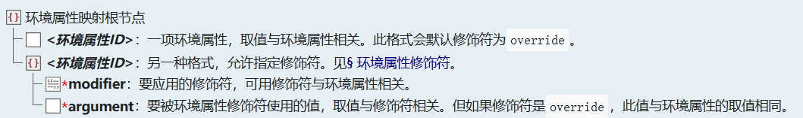

<SpotlightHead
    title = "Vanilla News - Mojang Spotlight - November 2025"
    authorName = "Alumopper"
    cover='../../../../../feature/archive/202511/_assets/spotlight.png'
    type=0
/>

Here is ***Vanilla*** news, the most ***Vanilla*** technical snapshot news in Minecraft. Our reporter *Vanilla Fox* reports the latest snapshot news for you~

Mojang released a total of six snapshots this month: 25w42a-46a, all belonging to 1.21.11. The data packversion number came to **93.1**, and the resource packversion number came to **74.0**.

The technical content of this month's snapshot mainly revolves around a new content - **Environmental Attributes**. At the same time, some minor modifications and additions have been made to the main gameplay content of 1.21.11.

Let’s talk about the conclusion first. This month’s update is more versatile, more destructive, and more countermeasures. Overall, it belongs to the **Super Large Cup** level.

<ColorLine />

> [!TIP]
>
> For more important destructive changes, they will be marked with 💥

## Environment properties

Environmental attributes were added in 25w42a, relying on data-driven control of various visual effects and gameplay content. The game calculates the final environmental attribute values ​​based on multiple current environmental attribute sources (such as dimension, mob cluster, time, etc.), thereby controlling visual effects such as sky color and cloud color, as well as environmental lighting, whether the bed can be slept on, and other game behaviors.

Currently, according to the order of application, there are four environmental attribute sources in the game: dimension, mob group, timeline, and weather. The environment source provides two contents, modifiers and modified values. The game will calculate the modified value calculated by the previous modifier according to the specified modifier and modified value. For example,`add`The modification symbol means adding the *floating point number* calculated by the previous modifier to the modification value,`and`The modifier means performing an AND gate calculation on the *Boolean value* calculated by the previous modifier and the modified value. Each modifier corresponds to the modified value and the type calculated by the previous modifier, and types cannot be used randomly.

Currently all attribute modifiers can be found in [Environment Attribute#Environment Attribute Modifier](https://zh.minecraft.wiki/w/%E7%8E%AF%E5%A2%83%E5%B1%9E%E6%80%A7#%E7%8E%AF%E5%A2%83%E5%B1%9E%E6%80%A7%E4%BF%AE%E9%A5%B0%E7%AC%A6) found in.

The calculation result of the environment attribute value will eventually affect the environment attribute. In the json definition format of dimension type and mob clusters, the following format is defined for applying different environment modifiers to the corresponding dimension and mob clusters to affect environmental attributes:



For example:

```json
{
  "attributes": {
    "minecraft:visual/water_fog_radius": {
      "modifier": "multiply",
      "argument": 0.85
    }
  }
}
```
This example will change the radius of water fog in the corresponding dimension or mob biome to 0.85 times its original value.

There are so many types of environmental attributes, from visual effects to sound effects to visual gameplay, there is already a wealth of content to explore in just a few snapshots. All environment attributes can be found in [Environment Attributes#Environment Attribute List](https://zh.minecraft.wiki/w/%E7%8E%AF%E5%A2%83%E5%B1%9E%E6%80%A7#%E7%8E%AF%E5%A2%83%E5%B1%9E%E6%80%A7%E5%88%97%E8%A1%A8) found in.

## Timeline

Timeline is a new experimental feature added in 25w45a, which uses the game day time as an environmental attribute source to affect environmental attributes.

The timeline can be understood as the timeline in animation software, and each point or attribute defined on the timeline is a key frame, thus defining an "animation" of environmental attributes. At each point, you can also define the interpolation method at this point. The default is linear. The available interpolation types are basically the same as those in most animation software. You can find them in [Interpolation function cheat sheet] (https://www.xuanfengge.com/easeing/easeing/) preview animation effects in this website.

Alternatively, the easing type can be specified as a cubic Bezier curve.

The timeline definition format contains two fields:`period_ticks`and`tracks`. The former is the cycle period of the timeline, and the latter is one or more attribute tracks of the timeline. Each track corresponds to an attribute, and there are several keyframes on it to control the changes of the attributes. For example:

```json
{
    "period_ticks": 24000,
    "tracks": {
        "minecraft:gameplay/cat_waking_up_gift_chance": {
            "ease": "constant",
            "modifier": "maximum",
            "keyframes": [
                { "ticks": 362,   "value": 0.0 },
                { "ticks": 23667, "value": 0.7 }
            ]
        }
    }
}
```
The period of the above timeline is 24000 ticks, which is exactly one game day. Orbit only`minecraft:gameplay/cat_waking_up_gift_chance`, that is, controlling the probability of the cat giving a gift to the player. The easing type is`constant`, represents a constant, so there is a sudden change at the key frame. Therefore, this timeline defines that between the 362nd moment and the 23667th moment, the probability of the cat giving a gift is 0, and between the 23667th moment and the 362nd moment of the next cycle, the probability of the cat giving a gift is 0.7.

## Slot source

Slot source is a new feature added in 25w44a that allows the data pack to specify any slot location. Currently, the slot source can only be used in the loot table, allowing the loot table to extract items from the corresponding slot.

Simply put, the slot source is a combination of multiple slots, and the slots are filtered according to certain rules, and finally one or more slot locations are returned.

For example:

```json
{
    "type": "minecraft:filtered",
    "item_filter": {
        "count": {
            "min": 16
        }
    },
    "slot_source": [
        {
            "type": "minecraft:slot_range",
            "source": "this",
            "slots": "hotbar.*"
        },
        {
            "type": "minecraft:slot_range",
            "source": "this",
            "slots": "armor.*"
        }
    ]
}
```
The source of this slot is`slot_source`used in`minecraft:slot_range`Select the player's shortcut bar and equipment bar slot, in`item_filter`It is defined that the number of items in the slot must be greater than or equal to 16, so in general, this slot source selects slots with a number greater than or equal to 16 in the player shortcut bar and equipment bar.

The specific slot source type can be found in [Slot Source](https://zh.minecraft.wiki/w/%E6%A7%BD%E4%BD%8D%E6%BA%90) found in.

## Miscellaneous

In addition to the major sections mentioned above, there are also many detailed modifications in these snapshots. To avoid being verbose, I will only write down some of the modifications that I think are more important. You can check the update log for specific modifications.

* Some fields in the original dimension type format and mob definition format have been removed because they are duplicated with environment attributes.

*`kinetic_weapon`Add new field`contact_cooldown_ticks`, indicating the cooldown after a hit. You cannot interact with the entity until you are able to hit it again.

* New enchantment effects`apply_exhaustion`, control the additional consumption caused to the target entity.

* The world boundary is now based on game tick changes rather than real time, so pausing the game now also pauses the movement of the world boundary. Correspondingly,`/worldborder`command`time`The parameter is now also changed from accepting seconds to accepting a time value (default is tick, if there is s or d suffix, it is seconds or days)

* All game rules have been renamed from camel case to snake case, and range restrictions have been added to some game rules.

* New advancement trigger`spear_mobs`, triggered when the player uses any item to perform a charge attack

* Some adjustments to shader

* Elements in the block model can now rotate around multiple axes

Please check the update log for more details~


- 25w42a:&lt;https://zh.minecraft.wiki/w/25w42a&gt;  
- 25w43a：&lt;https://zh.minecraft.wiki/w/25w43a&gt;  
- 25w44a：&lt;https://zh.minecraft.wiki/w/25w44a&gt;  
- 25w45a：&lt;https://zh.minecraft.wiki/w/25w45a&gt;  
- 25w46a：&lt;https://zh.minecraft.wiki/w/25w46a&gt;  