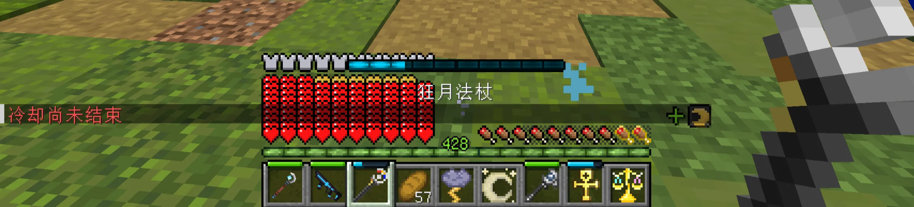
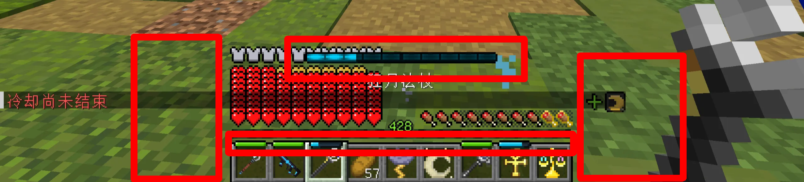
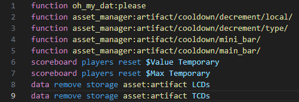

<FeaturedHead
    title = "TheSkyBlessingdata pack analysis"
    authorName = "Ling"
    cover = '../../../../../feature/archive/202512/_assets/0.png'
    resourceLink = 'https://github.com/ProjectTSB/TheSkyBlessing'
/>

## Preface

TheSkyBlessing (commonly translated as Blessing of the Sky, hereinafter referred to as TSB) is a map project led by a Japanese team. It is developed based on vanilla data pack and resource pack. The map is a sky island survival challenge. There are 90 sky islands with different themes in the map that can be explored. The player's goal is to liberate all the sky islands. There is a clear main line and strategy advancement. During this period, hundreds of different monsters need to be challenged, more than ten BOSS battles, and most importantly, thousands of artifacts can be obtained. Players can choose physical or magic schools, or they can choose fire/water/thunder/ice and the passive formation matching strategies provided by God's blessing. For enemies with different resistances, they also need to consider switching strategies. The overall strategy in the later period also increases with the content available to the player.

The author found a lot of inspiration for high-version production in actual games, especially data pack development. TSB provides many good solutions in implementing custom asset libraries, computer-like application architecture and data pack performance optimization. In particular, it uses many programming concepts outside the game. The actual map playing experience is also very smooth. Its analysis is very helpful for the advancement of data pack development and programming understanding. It is intended as a study note. This analysis will also be divided into several parts.

Although the TSB team has put the main body of the data pack as open source on github and the wiki has provided a lot of guidance, due to the difficulty of Japanese translation and the fact that third-party works are still involved, this article will focus on how to reproduce it and use it in your own maps. Due to the large amount of content and the fact that some implementation processes may encapsulate too many layers, the verbal explanation is inevitably unclear. Therefore, some missing analysis or basic parts of the data pack will not be described in detail. Readers who are interested in learning are recommended to download it by themselves. There is also a Chinese version on domestic websites.

## tick function——Common module content

There are some commonly used contents in the load and tick functions at the top of the data pack that are listed separately below. These global related data will also be mentioned later.

### world timing

The /time query gametime command can obtain the time when the world archive is opened, and storing it can provide a unique identifier for each tick operation.

```mcfunction
execute store result storage global Time int 1 run time query gametime
```
### Multiplayer game detection

```mcfunction
execute store result score $PlayerCount Global if entity @a
```
### Interval timer

Suitable for functions that do not need to be executed every tick, such as only executed once per second, here it is executed once every 4t (0.2s)

```
mcfunction
scoreboard players add $4tInterval Global 1
scoreboard players operation $4tInterval Global %= $4 Const
execute if score $4tInterval Global matches 0 run function core:tick/4_interval
```
### player event

The next layer of the global tick function is the player's tick function. Some commonly used player events are listed below:

```
mcfunction
# player/load.mcfunction

scoreboard objectives add UsedMilk used:milk_bucket {"text":"牛奶使用检查"}
scoreboard objectives add UsedTotem used:totem_of_undying {"text":"图腾使用检查"}
scoreboard objectives add RecipeVersion dummy {"text":"用于检查商人交易内容更新的分数"}
scoreboard objectives add FirstJoinEvent custom:play_time {"text":"事件: 首次加入"}
scoreboard objectives add RejoinEvent custom:leave_game {"text":"事件：重新加入"}
scoreboard objectives add DeathEvent deathCount {"text":"事件：死亡"}
scoreboard objectives add RespawnEvent custom:time_since_death {"text":"事件: 重生"}
scoreboard objectives add ClickCarrotEvent used:carrot_on_a_stick {"text":"事件：点击胡萝卜钓竿"}
scoreboard objectives add Sneak custom:sneak_time {"text":"事件：潜行"}
scoreboard objectives add Elytra custom:aviate_one_cm {"text":"事件: 鞘翅"}
scoreboard objectives add DropEvent custom:drop {"text":"事件：物品掉落"}
```


```
mcfunction
execute if entity @s[scores={DeathEvent=1..}] run tag @s add Death
execute if entity @s[scores={FirstJoinEvent=1}] run function core:handler/first_join
execute if entity @s[scores={RejoinEvent=1..}] run function core:handler/rejoin
execute if entity @s[scores={RespawnEvent=1}] run function core:handler/respawn
```
## load function - distinguish between data migration fields and production environment

The load function at the top level of the data pack is divided into two parts - the load main function and the load_once function. Initialization operations such as creating the scoreboard are actually completed in the load_once function. The load main function has the following fragment

```
mcfunction
data modify storage global IsProduction set value true
execute if data storage global {IsProduction:1b} unless data storage global GameVersion run function core:load_once
execute if data storage global {IsProduction:0b} run function core:load_once

function core:migration/
```


```
mcfunction
# function core:migration/
execute if data storage global {GameVersion:"v1.0.0"} run function core:migration/v1.0.1/
execute if data storage global {GameVersion:"v1.0.1"} run function core:migration/v1.0.2/
```
The load_once function has the following snippet at the top

```mcfunction
# function core:load/once
data modify storage global GameVersion set value "v1.0.2"
data modify storage global FirstGameVersion set value "v1.0.2"
data modify storage global ExpectedDatapackCount set value 22

#... (initialization of various scoreboards)
```
To add to the prerequisite knowledge, "development" and "production" are two terms in computer application development, which respectively mean production (the state that is still under development) and release (the state when development is completed and handed over to users for use). The player downloaded from the forum must be the release version. The IsProduction variable in the load function must be true. When the map maker develops the data pack, this value is false. It is changed to true before going online.

### Implement parsing

This part of the content is mainly used for data migration after the map is released, that is, the player can update the map while retaining the data (usually by replacing the data pack or level.dat file). The latest map version is currently 1.0.2. If I download it and play it when the map version is 1.0.0, the first loading process of this data pack is as follows:

1. Detected that there is no GameVersion field in storage
2. It is judged as entering the map for the first time.
3. Execute load_once function and record that the current game version is 1.0.0
4. When entering the map later, the GameVersion field is detected and the load_once function is no longer executed repeatedly.

The map is now updated to version 1.0.1. This line and the corresponding data migration function have been added to the migration function in the data pack. Based on the above process, the new loading process is as follows

```mcfunction
execute if data storage global {GameVersion:"v1.0.0"} run function core:migration/v1.0.1/
```
1. The GameVersion field is detected and the load_once function is no longer executed.
2. Execute the migration function and find that the GameVersion field matches the old version number. Execute the data migration function of the new version and update the GameVersion field to the latest version number.
3. When entering the map later, the GameVersion field is detected, and the load_once function is no longer executed repeatedly.

From this, we can find that after this processing, the load_once function is literally executed only once from the beginning of entering the map, and the data migration function of subsequent version updates will only be executed once when the map is entered for the first time after the version is updated. The above is the state when the player actually plays the map. It is much simpler for the map maker to develop the data pack. After changing the IsProduction field to false, load_once will be executed every time the map is entered. The map version must be the latest, and there is no need to deal with data migration issues.

Generally speaking, adding these contents in the load function serves the player's need to continue playing after subsequent updates. The overall feeling is like making dumplings with vinegar, but if the map does not have destructive updates in the future or needs to frequently fix bugs, this approach is also an option.

## Custom UI - use font to create item bar item cooling bar

### Realize the effect



The UI on the player screen can be divided into the following parts for introduction (please manually ignore the satiety display with the apple core module installed)

- Main cooling bar
- Equipment cooling bar on the left
- Cooling bar in the middle shortcut bar
- Player effect status on the right



- Main cooling bar
  -- Display the cooling time of the items in the main hand, which is the same as the one displayed at the top of the shortcut bar item. Only items in the cooling state will be displayed.
- Equipment cooling bar on the left
  -- Display the cooling time of each of the four parts of the body's equipment and the off-hand items. Only equipment with skills that are on cooling will be displayed.
- Cooling bar in the middle shortcut bar
  -- Display the cooling time of each of the nine items in the shortcut bar. Items that have not been cooled or have been cooled will not be displayed.
- Player effect status on the right
  -- As the name suggests, it displays the effect state of the player, but this does not refer to the various potion states of vanilla. The special states here are customized content in the map material. The positive effects and negative effects are separated into two lines. For example, holding the Crescent Moon Talisman here obtains the "new moon" effect of gaining extra health points for one cycle. The "+" sign represents the positive effect. Different custom special effects have different icons. This part involving the asset library will be introduced later.

### Implement parsing

First of all, it is clear that the key to implementing custom UI must be a title command executed in the tick function. Starting from the player using an item to put it into the cooling state, we analyze what the tick function does. The overall steps are as follows

1. Reduce cooling time
2. Calculate the percentage of current cooldown time and maximum cooldown time
3. Map the percentage value to a unicode character
4. Encapsulate this character and its matching resource pack font into a text component, and insert spaces between different characters to achieve the effect of adjusting UI coordinates
5. Use /title to display this text component to the actionbar position of the player screen.

Only the next few steps are introduced here. The overall command fragment is as follows. What needs to be noted here is that because the space is used to adjust the UI coordinate at the end, putting all UI into the same text component may cause extrusion and misalignment. For this reason, the precise positioning part needs to be mentioned separately. For example, it is divided into three parts: minibar (equipment and shortcut bar cooling bar), mainbar (main cooling bar) and effect (player status). The following takes the minibar part as an example.



Start with the resource pack. There is a minibar/common font in the font directory, and its corresponding bitmap is the picture resource of the cooling advancement bar. There are 18 states of the advancement bar under normal circumstances, corresponding to the 17 characters from \u1000 to \u1016. There is also a null character, in which the character offset is set to -42, which can make the advancement bar appear just above the shortcut bar item.


After the resource pack is defined, use title in the game to specify the font and the characters to be displayed to display the icon on the player screen. Execute the following command, and you can see that the full green advancement bar icon corresponding to the \u1000 character is displayed above the shortcut bar in the center (the actionbar is located in the center, and a downward offset of -42 is set)

```mcfunction
title @s actionbar [{"text":"\u1000","font":"cooldown/mini_bar/common"}]
```


Back to the case, the /title command that is finally displayed on the player screen is run in the player's tick function. Here, the three parts of the storage data of minibar, mainbar and effect are passed into the text component in nbt format (oh_my_dat is used here, which will be introduced later), and is distinguished according to the game mode. At this time, the primary task of parsing becomes to find the location of the incoming storage.

```mcfunction
function oh_my_dat:please
title @s[gamemode= spectator] actionbar [{"text":""},{"storage":"oh_my_dat:","nbt":"_[-4][-4][-4][-4][-4][-4][-4][-4].Message.MainBar[]","interpret":true,"separator":""},{"storage":"oh_my_dat:","nbt":"_[-4][-4][-4][-4][-4][-4][-4][-4].Message.Effect[]","interpret":true,"separator":""}]
title @s[gamemode=!spectator] actionbar [{"text":""},{"storage":"oh_my_dat:","nbt":"_[-4][-4][-4][-4][-4][-4][-4][-4].Message.MiniBars[]","interpret":true,"separator":""},{"storage":"oh_my_dat:","nbt":"_[-4][-4][-4][-4][-4][-4][-4][-4].Message.MainBar[]","interpret":true,"separator":""},{"storage":"oh_my_dat:","nbt":"_[-4][-4][-4][-4][-4][-4][-4][-4].Message.Effect[]","interpret":true,"separator":""}]
data remove storage oh_my_dat: _[-4][-4][-4][-4][-4][-4][-4][-4].Message
```
So there is a section in the function defined by the macro asset_manager:/artifact/cooldown/mini_bar/construct_message.m that is used to encapsulate the text component. You can see that the parameters of this macro will eventually be converted into a part of unicode. According to the definition of the previous resource pack, the parameters need to be 1000 to 1016 or 9999, which correspond to the icons of the four parts of the body, the off-hand item and the nine items of the shortcut bar. Different icons are separated by spaces (the space font here will be attached at the end)

:::tip Editor’s note
The default font can be defined in the empty text at the beginning, and can be inherited if no additional definitions are made thereafter. This optimization can be implemented as follows.
:::

```mcfunction
$data modify storage oh_my_dat: _[-4][-4][-4][-4][-4][-4][-4][-4].Message.MiniBars set value [
    '{"text":"\\uC151","font":"space"}',
    '{"text":"\\u$(Head)","font":"cooldown/mini_bar/head"}',

    '{"text":"\\uC024","font":"space"}',
    '{"text":"\\u$(Chest)","font":"cooldown/mini_bar/chest"}',

    '{"text":"\\uC024","font":"space"}',
    '{"text":"\\u$(Legs)","font":"cooldown/mini_bar/legs"}',

    '{"text":"\\uC024","font":"space"}',
    '{"text":"\\u$(Feet)","font":"cooldown/mini_bar/feet"}',

    '{"text":"\\u0003","font":"space"}',
    '{"text":"\\u$(Offhand)","font":"cooldown/mini_bar/offhand"}',

    '{"text":"\\u0011","font":"space"}',
    '{"text":"\\u$(Hotbar0)","font":"cooldown/mini_bar/common"}',

    '{"text":"\\u0002","font":"space"}',
    '{"text":"\\u$(Hotbar1)","font":"cooldown/mini_bar/common"}',

    '{"text":"\\u0002","font":"space"}',
    '{"text":"\\u$(Hotbar2)","font":"cooldown/mini_bar/common"}',

    '{"text":"\\u0002","font":"space"}',
    '{"text":"\\u$(Hotbar3)","font":"cooldown/mini_bar/common"}',

    '{"text":"\\u0002","font":"space"}',
    '{"text":"\\u$(Hotbar4)","font":"cooldown/mini_bar/common"}',

    '{"text":"\\u0002","font":"space"}',
    '{"text":"\\u$(Hotbar5)","font":"cooldown/mini_bar/common"}',

    '{"text":"\\u0002","font":"space"}',
    '{"text":"\\u$(Hotbar6)","font":"cooldown/mini_bar/common"}',

    '{"text":"\\u0002","font":"space"}',
    '{"text":"\\u$(Hotbar7)","font":"cooldown/mini_bar/common"}',

    '{"text":"\\u0002","font":"space"}',
    '{"text":"\\u$(Hotbar8)","font":"cooldown/mini_bar/common"}',

    '{"text":"\\uC089","font":"space"}'
]
```
### Reproduction effect

Remove the parameters required by the above macro function and run it directly. Introduce the necessary space font in the resource pack. The final positioning effect of the UI display is as follows

```mcfunction
title @s actionbar [ \
    {"text":""}, \
    \
    {"text":"\uC151","font":"space"}, \
    {"text":"\u1000","font":"cooldown/mini_bar/head"}, \
    \
    {"text":"\uC024","font":"space"}, \
    {"text":"\u1000","font":"cooldown/mini_bar/chest"}, \
    \
    {"text":"\uC024","font":"space"}, \
    {"text":"\u1000","font":"cooldown/mini_bar/legs"}, \
    \
    {"text":"\uC024","font":"space"}, \
    {"text":"\u1000","font":"cooldown/mini_bar/feet"}, \
    \
    {"text":"\u0003","font":"space"}, \
    {"text":"\u1000","font":"cooldown/mini_bar/offhand"}, \
    \
    {"text":"\u0011","font":"space"}, \
    {"text":"\u1000","font":"cooldown/mini_bar/common"}, \
    \
    {"text":"\u0002","font":"space"}, \
    {"text":"\u1000","font":"cooldown/mini_bar/common"}, \
    \
    {"text":"\u0002","font":"space"}, \
    {"text":"\u1000","font":"cooldown/mini_bar/common"}, \
    \
    {"text":"\u0002","font":"space"}, \
    {"text":"\u1000","font":"cooldown/mini_bar/common"}, \
    \
    {"text":"\u0002","font":"space"}, \
    {"text":"\u1000","font":"cooldown/mini_bar/common"}, \
    \
    {"text":"\u0002","font":"space"}, \
    {"text":"\u1000","font":"cooldown/mini_bar/common"}, \
    \
    {"text":"\u0002","font":"space"}, \
    {"text":"\u1000","font":"cooldown/mini_bar/common"}, \
    \
    {"text":"\u0002","font":"space"}, \
    {"text":"\u1000","font":"cooldown/mini_bar/common"}, \
    \
    {"text":"\u0002","font":"space"}, \
    {"text":"\u1000","font":"cooldown/mini_bar/common"}, \
    \
    {"text":"\uC089","font":"space"}, \
]
```


Up to this step, using the resource pack font to display the advancement bar icon has been completed. Since this step uses macros, the first two steps only need to solve the problem of obtaining the cooling time percentage of the item corresponding to the advancement bar and converting it into macro parameters. However, calculating the cooling time in TSB is too cumbersome because it involves the introduction of the asset library, so the custom UI part ends here.

## Transform the experience indicator into a mana indicator

### Realize the effect


My maximum mana value here is 428 (MP value, I will still use mana value later). You can see that the current value is displayed at the level position, and the experience bar can change with the percentage of mana value.

### Implement parsing

It is also clear that in order to manually control the experience bar while avoiding the interference of the vanilla experience ball mechanism, it must be done by a function that executes the xp command in the tick function. There are two main functions to implement this function. player_manager:mp/viewer/check_xpbar function is executed with the player tick. Its main contents are as follows


The above functions may seem a bit confusing without separation. In fact, we only need to know that the main implementation only needs to call the line of adjust_xpbar function. The other parts are used for calculation, so the functions of check_xpbar function can be divided like this

1. Get the percentage of the player’s current experience and the current level’s maximum experience (xp_p attribute in player data)
2. Calculate the percentage of current mana and maximum mana
3. If the player's current level and current mana value are not equal (that is, the mana value changes), or the calculation results of the experience bar percentage and the mana value percentage are inconsistent (that is, the maximum mana value changes), perform an update
4. Execute adjust_xpbar function to update, set the length of the experience bar according to the current mana value percentage, and set the level to the current mana value

The percentage calculation and comparison can be easily completed using the scoreboard. Setting the level can also be done directly using the /xp command. The problem is how to control the experience value bar to match the percentage. This is the most ingenious part of this system. The command of adjust_xpbar function is as follows

```mcfunction
xp set @s 40 levels
xp set @s 0 points
scoreboard players operation $NowMP Temporary = @s MP
scoreboard players operation $NowMP Temporary /= $10 Const
scoreboard players operation $NowLvP Temporary *= $2^24 Const
scoreboard players operation $NowLvP Temporary *= $2 Const
execute if score $NowLvP Temporary matches ..-1 run xp add @s 128 points
scoreboard players operation $NowLvP Temporary *= $2 Const
execute if score $NowLvP Temporary matches ..-1 run xp add @s 64 points
scoreboard players operation $NowLvP Temporary *= $2 Const
execute if score $NowLvP Temporary matches ..-1 run xp add @s 32 points
scoreboard players operation $NowLvP Temporary *= $2 Const
execute if score $NowLvP Temporary matches ..-1 run xp add @s 16 points
scoreboard players operation $NowLvP Temporary *= $2 Const
execute if score $NowLvP Temporary matches ..-1 run xp add @s 8 points
scoreboard players operation $NowLvP Temporary *= $2 Const
execute if score $NowLvP Temporary matches ..-1 run xp add @s 4 points
scoreboard players operation $NowLvP Temporary *= $2 Const
execute if score $NowLvP Temporary matches ..-1 run xp add @s 2 points
scoreboard players operation $NowLvP Temporary *= $2 Const
execute if score $NowLvP Temporary matches ..-1 run xp add @s 1 points
xp set @s 0 levels
scoreboard players operation $NowMP Temporary *= $2^20 Const
scoreboard players operation $NowMP Temporary *= $2 Const
execute if score $NowMP Temporary matches ..-1 run xp add @s 1024 levels
scoreboard players operation $NowMP Temporary *= $2 Const
execute if score $NowMP Temporary matches ..-1 run xp add @s 512 levels
scoreboard players operation $NowMP Temporary *= $2 Const
execute if score $NowMP Temporary matches ..-1 run xp add @s 256 levels
scoreboard players operation $NowMP Temporary *= $2 Const
execute if score $NowMP Temporary matches ..-1 run xp add @s 128 levels
scoreboard players operation $NowMP Temporary *= $2 Const
execute if score $NowMP Temporary matches ..-1 run xp add @s 64 levels
scoreboard players operation $NowMP Temporary *= $2 Const
execute if score $NowMP Temporary matches ..-1 run xp add @s 32 levels
scoreboard players operation $NowMP Temporary *= $2 Const
execute if score $NowMP Temporary matches ..-1 run xp add @s 16 levels
scoreboard players operation $NowMP Temporary *= $2 Const
execute if score $NowMP Temporary matches ..-1 run xp add @s 8 levels
scoreboard players operation $NowMP Temporary *= $2 Const
execute if score $NowMP Temporary matches ..-1 run xp add @s 4 levels
scoreboard players operation $NowMP Temporary *= $2 Const
execute if score $NowMP Temporary matches ..-1 run xp add @s 2 levels
scoreboard players operation $NowMP Temporary *= $2 Const
execute if score $NowMP Temporary matches ..-1 run xp add @s 1 levels
scoreboard players reset $NowMP Temporary
```
This function uses the binary decomposition algorithm twice. Let’s first introduce this algorithm (computer basics such as integer overflow will not be supplemented)

> Detect each binary bit and assign a weight to it by continuously shifting the binary number to the left (×2) and checking the sign bit (a negative number means the highest bit is 1). It is suitable for scenarios where floating point numbers need to be converted into integers.

It can be roughly broken down into the following steps (note that the initial input proportion value and the current mana value use floating point numbers):

1. Set the experience of the current mana percentage
   1. Set the player level to 40 (the experience required to upgrade from level 40 to level 41 is 202, that is, the total value of the experience bar is 202, which is relatively close to a multiple of 100)
   2. Multiply the current scale value by the initial accuracy value 2^24 (this will cause the result to be multiplied by 2, which corresponds to the actual total value of the experience bar in the previous step being 200)
   3. The algorithm is executed. Each step adds experience to the player through add. The final total experience point value is twice the integer converted from the initial proportion value.
2. Set level and mana equal
   1. The current scale value is multiplied by the initial precision value 2^20
   2. The algorithm is executed. Each step adds a level to the player through add. The final level is an integer converted from the initial current mana value.

### Reproduction effect

The check_xpbar function is as follows. Compared with the above, the part of obtaining the player experience bar percentage is simplified here.

```mcfunction
execute store result score $LvP Temporary run data get entity @s XpP 100
execute unless score $LvP Temporary matches 0 run scoreboard players add $LvP Temporary 1

scoreboard players operation $NowLvP Temporary = @s MP
scoreboard players operation $NowLvP Temporary *= $100 Const
scoreboard players operation $NowLvP Temporary /= @s MPMax

execute store result score $Lv Temporary run xp query @s levels
execute if score @s MP = $Lv Temporary if score $LvP Temporary = $NowLvP Temporary run tag @s add Success
execute if entity @s[tag=!Success] run function mw:xp/adjust
tag @s remove Success

scoreboard players reset $Lv Temporary
scoreboard players reset $LvP Temporary
scoreboard players reset $NowLvP Temporary
```
adjust_xpbar function, which is slightly different from the above because it has been processed based on actual data.

```mcfunction
xp set @s 40 levels
xp set @s 0 points

scoreboard players operation $NowMP Temporary = @s MP

scoreboard players operation $NowLvP Temporary *= $2^24 Const

scoreboard players operation $NowLvP Temporary *= $2 Const
execute if score $NowLvP Temporary matches ..-1 run xp add @s 128 points
scoreboard players operation $NowLvP Temporary *= $2 Const
execute if score $NowLvP Temporary matches ..-1 run xp add @s 64 points
scoreboard players operation $NowLvP Temporary *= $2 Const
execute if score $NowLvP Temporary matches ..-1 run xp add @s 32 points
scoreboard players operation $NowLvP Temporary *= $2 Const
execute if score $NowLvP Temporary matches ..-1 run xp add @s 16 points
scoreboard players operation $NowLvP Temporary *= $2 Const
execute if score $NowLvP Temporary matches ..-1 run xp add @s 8 points
scoreboard players operation $NowLvP Temporary *= $2 Const
execute if score $NowLvP Temporary matches ..-1 run xp add @s 4 points
scoreboard players operation $NowLvP Temporary *= $2 Const
execute if score $NowLvP Temporary matches ..-1 run xp add @s 2 points
scoreboard players operation $NowLvP Temporary *= $2 Const
execute if score $NowLvP Temporary matches ..-1 run xp add @s 1 points

xp set @s 0 levels

scoreboard players operation $NowMP Temporary *= $2^20 Const

scoreboard players operation $NowMP Temporary *= $2 Const
execute if score $NowMP Temporary matches ..-1 run xp add @s 1024 levels
scoreboard players operation $NowMP Temporary *= $2 Const
execute if score $NowMP Temporary matches ..-1 run xp add @s 512 levels
scoreboard players operation $NowMP Temporary *= $2 Const
execute if score $NowMP Temporary matches ..-1 run xp add @s 256 levels
scoreboard players operation $NowMP Temporary *= $2 Const
execute if score $NowMP Temporary matches ..-1 run xp add @s 128 levels
scoreboard players operation $NowMP Temporary *= $2 Const
execute if score $NowMP Temporary matches ..-1 run xp add @s 64 levels
scoreboard players operation $NowMP Temporary *= $2 Const
execute if score $NowMP Temporary matches ..-1 run xp add @s 32 levels
scoreboard players operation $NowMP Temporary *= $2 Const
execute if score $NowMP Temporary matches ..-1 run xp add @s 16 levels
scoreboard players operation $NowMP Temporary *= $2 Const
execute if score $NowMP Temporary matches ..-1 run xp add @s 8 levels
scoreboard players operation $NowMP Temporary *= $2 Const
execute if score $NowMP Temporary matches ..-1 run xp add @s 4 levels
scoreboard players operation $NowMP Temporary *= $2 Const
execute if score $NowMP Temporary matches ..-1 run xp add @s 2 levels
scoreboard players operation $NowMP Temporary *= $2 Const
execute if score $NowMP Temporary matches ..-1 run xp add @s 1 levels

scoreboard players reset $NowMP Temporary
```
Here the maximum mana value is set to 200, and the current mana value is 100


The case where the initial level of the setting is not 40 is also tested here. Because the total value of experience points is converted from a percentage, the total value of the experience bar must be 100 or a multiple of 100. If it is a multiple of 100, the initial percentage value must also be multiplied by the corresponding multiple. After querying the total value of the experience bar of each level of mc, the closest ones are level 28 (102 points) and level 40 (202 points). To this end, try adjusting the initial level set in the first step to 28 and the initial accuracy number one less (2^23). The same result can be achieved in the end. However, as shown in the figure below, a small section of the experience bar is obviously missing when the mana value is full. This means that the accuracy of the final result of the experience point calculation still does not match. I do not understand how this gap arises.


In addition, since the xp command is executed every tick, the game will continuously play the player upgrade sound effects for the player, which is very annoying. So you can find this overwritten sound event in the assets/minecraft/sounds.json file of the resource pack. Just remove the sound effects of the player upgrade.

```
json
{
  "entity.player.levelup": {
    "replace": true,
    "sounds": []
  }
}
```
## OhMyDat and data interface - ways to use caching for optimization

The previous cases all skipped the data calculation related parts because TSB also designed an interface layer before calculation. All data must be obtained through the interface layer. These contents are in the api directory of the main package. Here we first introduce the player data related interfaces to complete the missing calculation parts in the previous two cases.

The first is [OhMyDat](https://github.com/Ai-Akaishi/OhMyDat) This package, which occupies a very important position in the entire project, has a very simple function - to create a private data storage space for the entity that executes the command. When it is necessary to put all the data of the executor into storage, just introduce OhMyDat to quickly store and read it. A brief introduction using the command line demonstrated on github as an example

```
mcfunction
#Execute pleasefunction before use (the executor of the function must be the entity to store data)
function #oh_my_dat:please

#Get data storage
data get storage oh_my_dat: _[-4][-4][-4][-4][-4][-4][-4][-4].DataName

#Modify data storage
data modify storage oh_my_dat: _[-4][-4][-4][-4][-4][-4][-4][-4].DataName set value DataValue

#Delete data store
data remove storage oh_my_dat: _[-4][-4][-4][-4][-4][-4][-4][-4].DataName
```
The general principle of OhMyDat is to <b>use an algorithm with a time complexity of O(1) to store entity data into a space in a multi-dimensional array</b>, so multiple calls in the same tick will not cause excessive consumption. For the player, the stored data is the player's nbt. For other assets in the project, such as custom monsters, the stored content also includes the id of the corresponding asset. The object created in this way can store its own data, and can also be connected to the corresponding location in the asset library through the id to obtain data. This has actually formed the relationship between objects and classes in object-oriented programming. This kind of application method is very common in the entire project, so it is worthy of a separate introduction about OhMyDat. The following only focuses on the most basic usage in the player interface.

Let’s go back to the previous example of making a mana bar. It is known that resetting the player's experience bar requires the percentage of the player's current experience value. Use`data get entity @s XpP`It can be obtained directly, but data command has always been the focus of performance optimization. This command will be executed in the tick function. As the command increases, the same attribute may be read countless times in the same tick.


For this reason, TSB has introduced a data caching mechanism instead of direct acquisition. Let's take the XpP attribute as an example. The interface path is api/data_get/xp_p (the same is true for other attribute paths such as api/data_get/health). The main contents of this interface include the following lines. Finally, XpP is read out from a storage space called DataCache in OhMyDat. This storage space is the data cache.


In front of the interface to obtain all attributes, the restore_or_fetch function will be executed first to check whether the cache needs to be updated. The main content is as follows:


Therefore, the workflow of data caching is summarized as follows:

1. To obtain the player attributes, execute the corresponding data_get function in the api directory.
2. Execute data_get function first and restore_or_fetch function
3. in restore_or_refetch function
   1. Update the data cache time to the current time
   2. If it is not the latest time before the update, update the data and use set from to store the player data in the cache.
   3. If it is the latest time and the isDirty flag is not true, the data will no longer be updated (you can manually control whether to update the cache)
4. Return to the data_get function and obtain the data corresponding to the player from the data cache.

Suppose I need to obtain the player's XPP twice in the same tick. By calling the data_get interface, the cache will be updated to the latest time when it is obtained for the first time. Reading after that will no longer trigger an update. The data in the cache read twice is the latest. As long as the interface is called to obtain the data, it will only be read from the cache. Therefore, no matter what attribute is obtained, the player data will only be obtained once in the same tick. The use of OhMyDat simplifies the process of differentiating storage space for entities, so this data interface mode is also suitable for multiplayer games and other customized entities, and is a very good inspiration for performance control.

## Appendix

space space font (resource pack minecraft/font directory)

[space.json](/en/feature/archive/202512/0/space)

Common constants (executed in the load function after creating the Const scoreboard)

[define_const.mcfunction](/en/feature/archive/202512/0/define_const)
