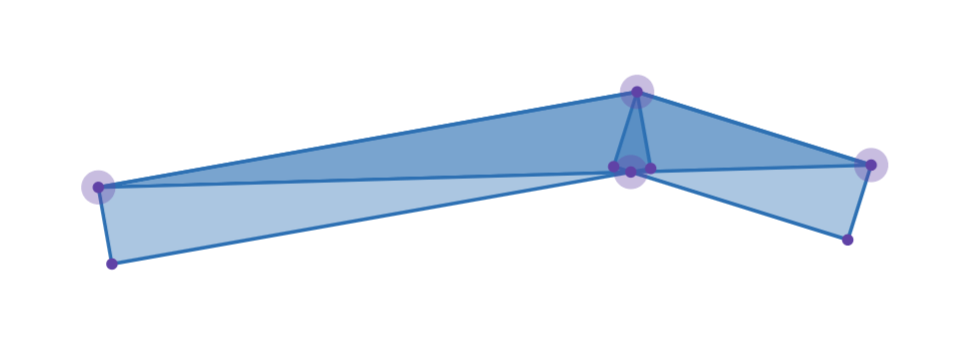
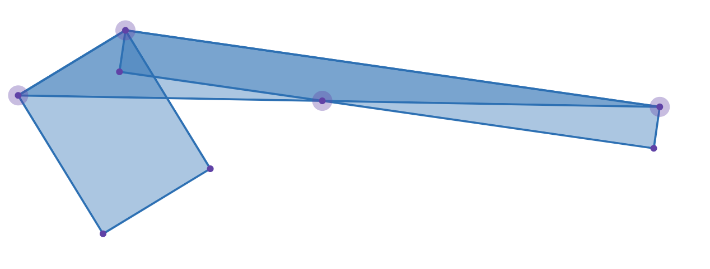
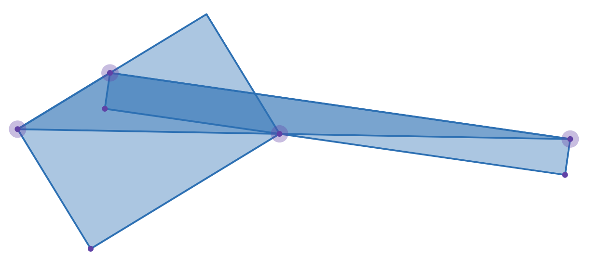
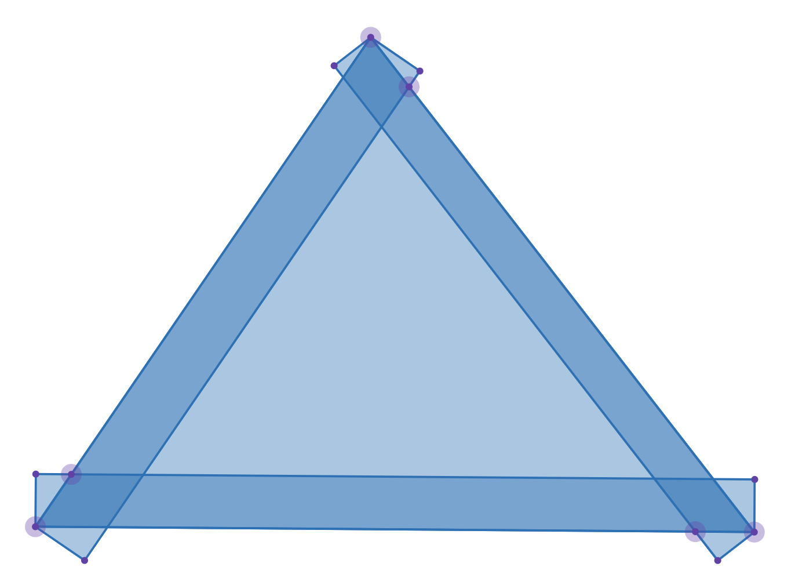
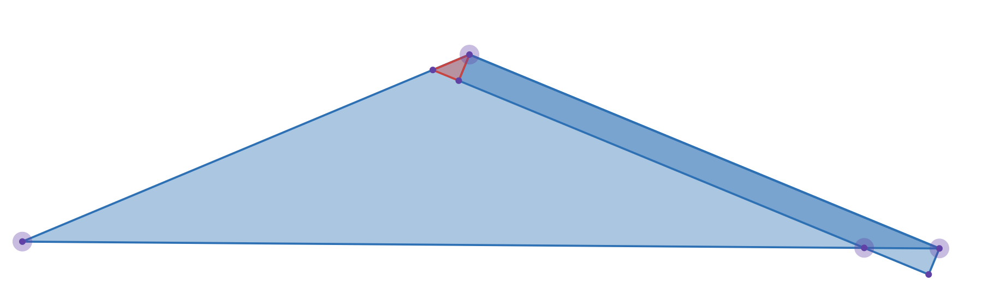

<FeatureHead
    title = "A feasible method to convert OBJ model to json model"
    authorName = "Xuanyu1725"
    :extraAuthors="['flybridOuO']"
/>


> Keywords
> OBJ model, json model, Minecraft, geometry structure conversion, voxelization, lightweight model, tangent space

## Overview and background

This article aims to study a feasible high-precision, nearly lossless and lightweight method of converting OBJ (Wavefront) to JSON model (Minecraft style) to help artists quickly import the project into the Minecraft scene after completing the design in a general modeling software.

There are significant differences between the two models we considered. The OBJ model defines the geometric structure of the object by vertices and surfaces, with triangular surface meshes as the core (some software also supports polygonal surfaces), and can represent complex geometric structures (such as curved surfaces) with high precision and low polygon count. Minecraft's json model is defined by voxels that have been translated, rotated, and scaled, and usually cannot represent complex surfaces well, or even triangles. Without considering textures and maps, we will next discuss a feasible method to convert OBJ models to json models with acceptable visual effects errors.

## Traditional implementation of model voxelization

### Method introduction

The traditional way to convert an OBJ model to a voxelized model similar to a json model is to approximate the geometry of the OBJ model with axis-aligned cubes (voxels). The basic idea of this method is:

1. Place the OBJ model into a 3D mesh

2. Determine the minimum subdivision mesh

3. For each grid cell, check whether it intersects the OBJ model, and if so, fill it with a voxel

4. Optimize the generated voxel model to reduce the number of voxels

5. Get the final voxel model

### Shortcomings of the method

The implementation of this traditional method is simple, but it has shortcomings that cannot be ignored:

1. The visual error produced by this method is too large (we have not defined the error yet), especially for curved surfaces and inclined surfaces, the voxelized model often appears very rough.

2. To achieve high visual accuracy, a very fine mesh needs to be used, resulting in an increase in the number of voxels and the model becoming very large and difficult to use in Minecraft.

3. Even if optimization is performed, such as merging some voxels, or using different levels of detail (LOD) at different locations, the generated voxel model may still contain a large number of redundant voxels, which affects performance and is not conducive to modification by artists.

## Improvement methods

### Define error

In order to better measure the difference between the converted json model and the original OBJ model, and for us to implement the optimization algorithm, we need to define the error values before and after conversion.

#### Volume error

For the error caused by volume fitting (such as traditional methods), we can use the distortion volume to measure it. The distortion volume is defined as the difference between the union volume of the two models and their intersection volume. Since we will eventually observe the model at various angles, we need to calculate the distortion volume projection area under different viewing angles and take the average value as the final error indicator.

Research points out that convex polyhedron in three-dimensional space is$SO(3)$The average projected area under the action and the surface area of ​​the polyhedron are constant values.$\frac{1}{4}$For concave polyhedrons (the more general case) this conclusion no longer holds since the faces will occlude each other, but we can approximate the average projected area by sampling multiple viewing angles, and its upper bound is still$\frac{1}{4}$, in order to simplify the calculation, we use an upper bound to measure the error.

Right now,$$e_V = \frac{S}{4} \geq \frac{1}{4 \pi} \int_{S^2} A(\boldsymbol{u}) \,\mathrm d \omega,$$in$S$is the surface area of ​​the distortion volume,$A(\boldsymbol{u})$for perspective$\boldsymbol{u}$The projected area under , integrated over the entire unit sphere$S^2$proceed on. We use$\tfrac{S}{4}$As an upper bound on the simplified error, this simplifies calculations while ensuring conservative estimates.

#### Surface error

Errors caused by surface fitting$e_S$(As we will introduce next), we can use the distortion surface area to measure, the distortion surface area is defined as the absolute value of the difference between the surface areas of the two models.

Similarly, we do not consider the influence of occlusion and directly use the sum of the distortion surface area of ​​each subdivision surface as the error metric. The specific calculation formula is related to the fitting method, which we will introduce next, but the idea is similar to the volume error.

### Optimization direction

Model complexity can be measured by the number of voxels. We hope that the error and complexity are as small as possible, but the two are often contradictory. Define a cost index that is proportional to the error and complexity (weighted sum measurement is used here), that is$$J = \alpha e + \beta M,$$in$e$is the error index,$M$is the number of voxels,$\alpha, \beta$is the weight coefficient. We hope that through optimization algorithms, we can make$J$minimize.

### Overview of improved voxelization methods

Since Minecraft's json model is defined based on rotatable voxels, we can take advantage of this to better fit the geometry of the OBJ model by allowing the voxels to rotate, thereby reducing errors.

For the original OBJ model, we define connected, parallel triangles as a surface. Triangles in the surface satisfy the following conditions:

1. Adjacent triangles in the surface have at least two shared vertices.

2. The normal directions of all triangles on the surface are the same (that is, parallel). In actual implementation, the included angle error must be small enough.

3. If a triangle that meets the above two conditions is adjacent to a triangle in the same surface, it also belongs to that surface.

For each surface, we calculate its tangent space (tangent space), that is, define a local coordinate system so that the normal direction of the surface is aligned with an axis of the local coordinate system. We then voxelize in this tangent space, using axis-aligned voxels to approximate the geometry of the surface.

### Specific implementation steps

#### Read OBJ model
    
This step is relatively simple. The OBJ file format is a text format. You can use existing libraries (such as TinyOBJLoader) to parse OBJ files. You only need to extract vertex, normal and face index information. In the file, respectively`v` `n` `f`The first lines represent vertex, normal, and face indices.

Sometimes the normal information may not exist or be unreliable, we can calculate the normal from the vertex and face information. For each triangular face, we can calculate the normal using the cross product:$$\boldsymbol{N} = \frac{(\boldsymbol{v}_2 - \boldsymbol{v}_1) \times (\boldsymbol{v}_3 - \boldsymbol{v}_1)}{\|(\boldsymbol{v}_2 - \boldsymbol{v}_1) \times (\boldsymbol{v}_3 - \boldsymbol{v}_1)\|}$$Sometimes polygonal faces appear in the OBJ model (such as the model exported by Blender). We can triangulate the polygonal faces and convert them into multiple triangular faces for processing.

#### Construct surface connected components

We traverse all the triangular faces we read, create connected components according to the above definition, and obtain multiple surfaces, each of which is an undirected graph.

#### Calculate tangent space

In each surface, we take the normal of that surface as the normal of the tangent space$\boldsymbol{N}$, take a vector that is not collinear with the normal as the tangent direction$\boldsymbol{T}$(such as the sides of any triangle, normalize them), and then calculate the direction of the bitangent through the cross product$$\boldsymbol{B} = \boldsymbol{N} \times \boldsymbol{T}$$Three vectors form an orthogonal local coordinate system, and we construct a transformation matrix$\boldsymbol{M}_{TBN}$, convert the global coordinate system into a tangent space coordinate system:$$\boldsymbol{M}_{TBN} = \begin{bmatrix}\boldsymbol{T} & \boldsymbol{B} & \boldsymbol{N}\end{bmatrix}$$Since this matrix is ​​orthogonal, its inverse exists and is equal to its transpose:$$\boldsymbol{M}_{TBN}^{-1} = \boldsymbol{M}_{TBN}^T$$coordinate all vertices of the surface$\boldsymbol{v}_i$Transform to tangent space through this matrix:$$\boldsymbol{v}_i' = \boldsymbol{M}_{TBN} \boldsymbol{v}_i$$
#### Find the optimal rectangle in tangent space

In the tangent space, we need to find an optimal rectangle to initially fill the interior of the surface, so that after deleting the area of ​​this rectangle, the number of remaining triangles is minimal. At the same time, since the error in this step can be avoided, we cannot accept any error, that is, to satisfy the rectangle, the conditions must be met:

1.$e_S = 0$2. A rectangle that satisfies the condition is contained inside the surface.
3. Due to artistic requirements, the side length of the rectangle needs to be the smallest element.$\delta$an integer multiple of

Intuitively, the larger the rectangular area that meets such conditions, the better, but it is smaller than the maximum rectangular area that can be placed in the boundary of the surface. At the same time, there may be certain restrictions on angles and positions to minimize the remaining triangular surfaces.

We can find the optimal rectangle through enumeration. The specific steps are as follows (it can be replaced by a more efficient method to improve performance):

1. Extract the boundary vertices of the surface in tangent space
2. Align each edge with the coordinate axis, and then$\delta$For LOD, mesh the area within the boundary (only meshes completely contained within the boundary are retained)
3. For each grid cell, try to make it the lower left corner of the rectangle, then enumerate the possible widths and heights (both$\delta$an integer multiple of ), check whether the rectangle is completely contained within the bounds
4. For a rectangle that meets the conditions, calculate the number of remaining triangles after deleting the rectangle, and record the rectangle with the smallest number of remaining triangles as the current optimal solution.

Note that after deleting the rectangle, the remaining areas may have non-triangular faces. We need to re-triangulate these areas to ensure that all remaining areas are composed of triangular faces. And for the remaining triangles, we need to recalculate their connected components, and the final measure is the total number of remaining triangle faces.

After determining the rectangle, we multiply it by left$\boldsymbol{M}_{TBN}^{-1}$Convert it back to the global coordinate system to obtain a voxelized block (flattened voxel) of the surface.

#### Process remaining triangles

For triangular surfaces, since there is a minimum element$\delta$, we first discuss its size. If the length and width of the smallest circumscribed rectangle of the triangle are less than$\delta$, then the triangle is called small; if the length and width of the largest inscribed rectangle of the triangle are greater than or equal to$\delta$, the triangle is called large; otherwise it is called medium.

1. For small triangles, we try two fitting methods:

    1. Use two bounding rectangles to fit the triangle. For the vertex corresponding to the largest angle, place two rectangles parallel to the adjacent sides of the vertex inside the triangle so that the inner sides of the two rectangles intersect at a point on the opposite side of the vertex. By taking different intersection points, different fits can be obtained, and the method with the smallest error can be selected. The dimensions of the bounding rectangle need not be$\delta$An integer multiple of , but if the solution can be obtained$\delta$is an integer multiple of , then select$\delta$can minimize the error in integer multiples$e_S$solution.

    2. Calculate the center of gravity of the triangle, then use the center of gravity as the center and directly use a$\delta \times \delta$The rectangle fits the triangle, one side coincides with the side of the triangle, and the error is calculated$e_S$.

    error here$e_S$defined as a set$\{S: S \in S_{voxel}, S \notin S_{triangle}\}$of measure$\frac{1}{4}$, that is, the area of ​​the rectangle beyond the triangle:$$e_S = \frac{1}{4} \sum_{S \in S_{voxel}, S \notin S_{triangle}} Area(S)$$Choose the one with the smaller error among the two methods as the fitting method for the small triangle.

2. For medium triangles, we only consider the method of using two surrounding rectangles. The process is similar to that of small triangles.

3. For large triangles, we first fit the triangle with three surrounding rectangles. Place a rectangle from three vertices along the adjacent sides, with thicknesses of$d_1, d_2, d_3$. This creates an inner region that we voxelize (pixel) traditionally, but requires each rectangle to be of size$\delta$An integer multiple of , and merge adjacent rectangles after processing. At this time$d_1, d_2, d_3$Let the internal region have a solution and$e_S$The smallest value, similarly, if the solution can be obtained$\delta$is an integer multiple of , then select$\delta$can minimize the error in integer multiples$e_S$solution.

To find all rectangles, we multiply them by left$\boldsymbol{M}_{TBN}^{-1}$Convert it back to the global coordinate system to obtain the voxelized block of the remaining triangular faces of the surface.

Below we discuss the coverage methods mentioned above in detail:

##### Double wrapping method:



The double wrapping method can fit small triangles well under normal circumstances.





In special cases, it can be found that when the vertices of the rectangle are fixed on the three corners of the triangle, it will be impossible to fit, and the rectangle needs to be extended.

> Note: Although this situation can always be avoided by adjusting the position of point D, we are not yet sure whether limiting the position of D is better than allowing the rectangle to be extended, so we choose to allow the rectangle to be extended.

Therefore, the logic of the double wrapping method suitable for general situations is:

1. Select the largest angle, recorded as$A$, the adjacent angle is recorded as$B$and$C$, the opposite sides of the three angles are written as$a, b, c$.

2. in$a$Take a little bit$D$, Pass$D$do$b，c$perpendicular to , respectively from the ray$BA, CA$intersection point$E, F$.

3. to$E$For example, if$E$exist$b$above, then the rectangle$R_1$An edge of$AB$, the length of the adjacent side perpendicular to it is$d_1$Its value is equal to$D$and$b$distance; if$E$exist$b$along$BA$On the extension line of the direction, the rectangle$R_1$An edge of$BE$, the length of its perpendicular adjacent side is also$d_1$.

To simplify calculations, we assume$d_1,d_2$Can't even get it$\delta$integer multiples of , so that they are continuous values. After calculating the best value, try to adjust it to$\delta$an integer multiple of.

So,$d_1$The difference from the final value is not greater than$\Delta d_1 = \delta$, the same reason$d_2$The difference from the final value is not greater than$\Delta d_2 = \delta$.

In general calculations, the angle$B$rectangle on$R_1$For example, it is easy to calculate the distortion area as:$$ S(R_1) = \frac{1}{2} d_1^2 \tan B $$In the special case where the rectangle needs to be extended, the distortion area is:$$ S(R_1) = \frac{1}{2} (d_1^2 \tan B + (\cot C d_1 - b)^2 \tan(B+C))$$And the critical condition is$\cot C d_1 - b = 0$, when the left side of the equal sign is positive,$D$The projection of$BC$On the extension line of , when it is negative,$D$The projection of$BC$superior.

So we can use a`max()`function to uniformly represent the distortion area:$$ S(R_1) = \frac{1}{2} \left( d_1^2 \tan B + (\max(0, \cot C d_1 - b))^2 \tan(B+C) \right) $$The sum of the areas on both sides does not overlap, so the total distortion area is:$$ S = S(R_1) + S(R_2) $$The error is the distortion area$\frac{1}{4}$ :

$$ e_S = \frac{S}{4} = \frac{S(R_1) + S(R_2)}{4} $$And the constraints are$\phi (d_1, d_2) = d_1 \sin B + d_2 \sin C - a = 0$Using the Lagrange multiplier method, we construct the Lagrange function:$$ \mathcal{L}(d_1, d_2, \lambda) = e_S(d_1, d_2) + \lambda \phi(d_1, d_2) $$right$d_1, d_2, \lambda$Taking the partial derivative and setting it to zero gives us a system of equations:$$
\frac{\partial \mathcal{L}}{\partial d_1} = 0, \quad \frac{\partial \mathcal{L}}{\partial d_2} = 0, \quad \frac{\partial \mathcal{L}}{\partial \lambda} = 0
$$Notice,$\mathcal{L}$It is not differentiable at the critical point, so we need to discuss it case by case:

It is easy to prove that only one side needs to extend the rectangle, that is, there are only three situations:

In a given condition that satisfies the constraints$d_1, d_2$,like$\cot C d_1 - b \leq 0$and$\cot B d_2 - c \leq 0$, then it is a general situation (the critical point is regarded as a general situation);

If$\cot C d_1 - b > 0$and$\cot B d_2 - c \leq 0$, then it is extended$R_1$situation;

If$\cot C d_1 - b \leq 0$and$\cot B d_2 - c > 0$, then it is extended$R_2$situation.

Substituting the three situations into the above system of equations respectively, find candidate solutions, then calculate the error, and select the solution with the smallest error as the final solution. At this time it will$d_1, d_2$Adjust to$\delta$is an integer multiple of , and the solution with the smallest adjusted error is selected as the final solution (this may not always be possible).

##### Surround bracketing method

The logic of the wrap-around method suitable for large triangles is:

1. We use different LOD to determine the internal area, that is, the internal area is discretized into$\xi\delta \times \xi\delta$grid,$\xi$Pick$1, 2, \dots, k$,in$k$is the side length of the largest inscribed rectangle of a triangle and$\delta$The integer part of the ratio. For the "large triangle" in our definition,$k \ge 1$.

2. Under different LOD, perform pixelation processing (internal fitting) on ​​the internal area, that is, within the divided grid, select the grid completely contained within the triangle as the pixel block.

3. Select the three vertices of the triangle$A, B, C$, place three rectangles along the adjacent sides.$R_1, R_2, R_3$, whose thicknesses are respectively$d_1, d_2, d_3$. Choose the smallest$d_1, d_2, d_3$Cover the area that cannot be covered by inscribed fitting, and calculate the distortion area caused by wrapping$S$.

For this step, we need to first select the direction, that is, select one side as the bottom edge. At this time, the determined pixels will generate the left, right, and top borders. For the hypotenuse on the left, we calculate the distance between each grid point of the left boundary and the upper boundary from the hypotenuse, and take the minimum value as$d_1$, similarly the hypotenuse on the right takes the minimum value as$d_2$, obviously the bottom$d_3$is 0.

Calculate different sides as bases separately$d_1, d_2, d_3$, and then calculate the distortion area$S$, the choice makes$S$minimal solution.

Next we discuss the distortion area$S$calculation method.



Consider the general wraparound method, assuming$d_1, d_2, d_3$are the thickness of the rectangle on the left, right and bottom sides respectively,$A, B, C$are the angles of the left, right and bottom sides respectively, then the distortion area$S$It can be expressed as:$$ S = \frac{1}{2} \left((d_1^2 + d_2^2)\cot A + (d_1^2 + d_3^2)\cot B + (d_2^2 + d_3^2)\cot C\right) $$



When considering that the vertex angle is an obtuse angle, it is obvious that there is no error area near the obtuse angle. Taking the right side as an example, the area of ​​the red triangle can be calculated as$$S_\Delta = \frac{1}{2}d_1^2 \cot(B+C) = - \frac{1}{2} d_1^2 \cot A$$This is just the opposite of the distortion area term we originally calculated here for the rectangle on the right. If we apply the original formula, this term is just the negative value of the area of ​​the red triangle, so we need to remove it.

pass`max`restrict$\cot A, \cot B, \cot C$Obtain the corrected distortion area:$$ S = \frac{1}{2} \left((d_1^2 + d_2^2)\max(0, \cot A) + (d_1^2 + d_3^2) \max(0, \cot B) + (d_2^2 + d_3^2) \max(0, \cot C)\right) $$4. Calculate the error value under each LOD$e_S = \frac{S}{4}$and number of voxels$M$, choose such that the cost index$\mathcal{J} = \alpha e_S + \beta M$The smallest solution is taken as the final solution.

In this algorithm, the optimal solution is uniquely determined by LOD because$e_S$and$M$are all determined by LOD, so the cost function can be expressed as$\mathcal{J}\left(\right.$ LOD $\left.\right)$. Since LOD can only take discrete values$1, 2, \dots , k$, we can find the optimal solution by traversing all possible LODs.

#### Description of voxel blocks

Now for all the rectangles that have been determined, we need to convert them into the format required by the Minecraft json model. The voxel definition in the Minecraft json model is slightly different on different platforms, but it mainly consists of the following information (we do not consider textures):

1. Voxel position: Define the position of the voxel in three-dimensional space. in Bedrock Edition voxel definition`origin`Arrays and Java Edition`from`The array is at this location.

2. Voxel size: Define the length, width, and height of the voxel. in Bedrock Edition voxel definition`size`The array is of this size. For Java Edition,`to`An array is the sum of position and size.

3. Rotation of the voxel: Define the rotation angle of the voxel relative to its local coordinate system, which is described by the rotation Euler angles of the three axes. in Bedrock Edition voxel definition`rotation`Arrays and Java Edition`rotation.x`, `rotation.y`, `rotation.z`The key is this rotation information.

4. Rotation center: Defines the reference point for voxel rotation. in Bedrock Edition voxel definition`pivot`Arrays and Java Edition`rotation.origin`The object is this center of rotation.

In order to confirm these four pieces of information, we need to confirm the transformation matrix from the unit cube to the target rectangle.$\boldsymbol{M}_{voxel}$.

The order of voxel transformation is: first scale, then translate, and finally rotate around the rotation center by 3 Euler angles. Therefore, the transformation matrix can be expressed as:$$f: \mathbb{R}^3 \rightarrow \boldsymbol{P}\boldsymbol{R}\boldsymbol{P}^{-1}\boldsymbol{T}\boldsymbol{S}\mathbb{R}^3$$in$\boldsymbol{P}$Represents the translation matrix that moves the center of rotation to the origin,$\boldsymbol{R}$A matrix representing rotation around the origin. The order of rotation for each axis is$X \rightarrow Y \rightarrow Z$，$\boldsymbol{T}$represents the translation matrix,$\boldsymbol{S}$Represents a scaling matrix.

For the rectangular vertices we get, we first calculate the minimum point$\boldsymbol{v}_{min}$, the vector formed by it and adjacent vertices$\boldsymbol{d}_x = \boldsymbol{v}_1 - \boldsymbol{v}_{min}, \quad \boldsymbol{d}_y = \boldsymbol{v}_2 - \boldsymbol{v}_{min}$You can get the position and size of the voxel:$$\boldsymbol{T} = \begin{bmatrix} 1 & 0 & 0 & \boldsymbol{v}_{min,x} \\ 0 & 1 & 0 & \boldsymbol{v}_{min,y} \\ 0 & 0 & 1 & \boldsymbol{v}_{min,z} \\ 0 & 0 & 0 & 1 \end{bmatrix}, \boldsymbol{T}^{-1} = \begin{bmatrix} 1 & 0 & 0 & -\boldsymbol{v}_{min,x} \\ 0 & 1 & 0 & -\boldsymbol{v}_{min,y} \\ 0 & 0 & 1 & -\boldsymbol{v}_{min,z} \\ 0 & 0 & 0 & 1 \end{bmatrix}$$

$$\boldsymbol{S} = \begin{bmatrix} \|d_x\| & 0 & 0 & 0 \\ 0 & \|d_y\| & 0 & 0 \\ 0 & 0 & 0 & 0 \\ 0 & 0 & 0 & 1\end{bmatrix}$$because$d_1, d_2$It is always orthogonal, and the direction and size do not change after the minimum point is translated to the origin, and can be used directly for calculation. We just need to find the rotation matrix that aligns its normal with a vector$\boldsymbol{R}$That’s it. Assume that the normal line is$\boldsymbol{N}$, we can calculate the rotation matrix through the following steps:

1. Calculate the axis of rotation$\boldsymbol{A} = \boldsymbol{N} \times \boldsymbol{Z}$,in$\boldsymbol{Z} = (0, 0, 1)$It is based on the global coordinate system$Z$axis.

2. Calculate the rotation angle$\theta = \arccos(\boldsymbol{N} \cdot \boldsymbol{Z})$.

3. Use Rodrigues' rotation formula to construct a rotation matrix$\boldsymbol{R}$：

$$\boldsymbol{R} = \boldsymbol{I} + \sin(\theta) [\boldsymbol{A}]_{\times} + (1 - \cos(\theta)) [\boldsymbol{A}]_{\times}^2$$in$[\boldsymbol{A}]_{\times}$is a vector$\boldsymbol{A}$antisymmetric matrix.

Finally, we can decompose the rotation matrix by$\boldsymbol{R}$to get the Euler angles about each axis.

Remember$X、Y、Z$The Euler angle of rotation of the axis is$rx, ry, rz$, explicitly write$\boldsymbol{R}$as follows:$$\boldsymbol{R} = \begin{bmatrix}
\cos(rz)\cos(ry) & \cos(rz)\cos(ry)\sin(rx)-\sin(rz)\cos(rx) & \cos(rz)\sin(ry)\cos(rx)+\sin(rz)\sin(rx) & 0 \\
\sin(rz)\cos(ry) & \sin(rz)\sin(ry)\sin(rx)+\cos(rz)\cos(rx) & \sin(rz)\sin(ry)\cos(rx)-\cos(rz)\sin(rx) & 0 \\
-\sin(rx) & \cos(ry)\sin(rx) & \cos(ry)\cos(rx) & 0 \\
0 & 0 & 0 & 1
\end{bmatrix}$$Euler angles can be extracted from the matrix:

remember$\boldsymbol{R}$of the$i$OK$j$The column elements are$\boldsymbol{R}_{ij}$, then there is:$$ry = \arcsin(-\boldsymbol{R}_{31})$$Since gimbal deadlock may occur, we need to$ry$Select different calculation methods for the value:

Define a smaller threshold$$\varepsilon = 10^{-6}$$when$\left|\boldsymbol{R}_{31}\right| \lt 1 - \varepsilon$When , no universal joint deadlock occurs, and the remaining Euler angles are calculated directly:$$rx = \arctan2\left(\frac{\boldsymbol{R}_{32}}{\cos(ry)}, \frac{\boldsymbol{R}_{33}}{\cos(ry)}\right)$$

$$rz = \arctan2\left(\frac{\boldsymbol{R}_{21}}{\cos(ry)}, \frac{\boldsymbol{R}_{11}}{\cos(ry)}\right)$$when$\left|\boldsymbol{R}_{31}\right| \geq 1 - \varepsilon$When , a universal joint deadlock occurs and other methods need to be used to calculate Euler angles.$\qquad$set up$rz = 0$

$\qquad$like$\boldsymbol{R}_{31} \lt 0$:

$$ry = \frac{\pi}{2}$$

$$rx = \arctan2(\boldsymbol{R}_{12}, \boldsymbol{R}_{13})$$

$\qquad$otherwise:$$ry = -\frac{\pi}{2}$$

$$rx = \arctan2(-\boldsymbol{R}_{12}, -\boldsymbol{R}_{13})$$In fact, since the rotation center and rotation axis are arbitrary, there are multiple possible solutions to achieve the same visual effect. In our calculation, the rotation center is the smallest point of the voxel.

Therefore, the four pieces of information we need are as follows:

Bedrock Edition voxel definition:

```json
{
  "origin": [v_min.x, v_min.y, v_min.z],
  "size": [|d_x|, |d_y|, 0],
  "rotation": [rx_in_degrees, ry_in_degrees, rz_in_degrees],
  "pivot": [v_min.x, v_min.y, v_min.z]
}
```
Java version voxel definition:

```json
{
  "from": [v_min.x, v_min.y, v_min.z],
  "to": [v_min.x + |d_x|, v_min.y + |d_y|, v_min.z],
  "rotation": {
    "origin": [v_min.x, v_min.y, v_min.z],
    "x": rx,
    "y": ry,
    "z": rz
  }
}
```
Just write it directly in json format.

### Remaining questions

Although we proposed a feasible method to convert OBJ models to json models, there are still some remaining issues that need further research and resolution:

1. The algorithm for finding the optimal rectangle described in the article is highly complex, especially when dealing with complex surfaces. A more efficient algorithm may be needed to speed up the process.

2. We regard triangular surfaces as independent from other triangular surfaces. Artists usually hide large errors in invisible areas (such as closed interiors), thereby reducing the number of cubes and achieving relatively small errors. We have not considered this yet.

3. The current method mainly takes error as the optimization goal, and in most cases cannot optimize the voxel number (cube number) to the same low level as manual production. Compared with models manually made by artists, automatically converted models usually have higher errors and block numbers.

4. For very complex geometric structures, the current method may still not be able to achieve ideal visual effects. In the future, other technologies, such as subdivision surfaces or multi-resolution representation, can be considered to further improve the conversion quality.

But all in all, this tangent space-based voxelization method provides a promising solution for high-precision, lightweight OBJ to json model conversion. According to the ideas in the article, a practical conversion tool can be written to help artists apply design results to Minecraft scenes more efficiently.