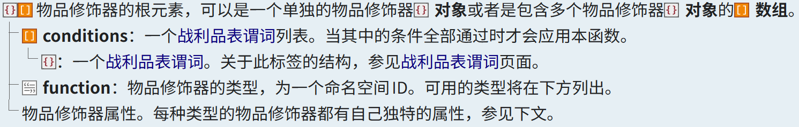
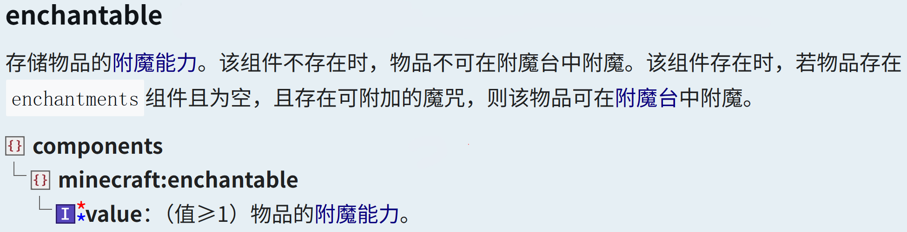
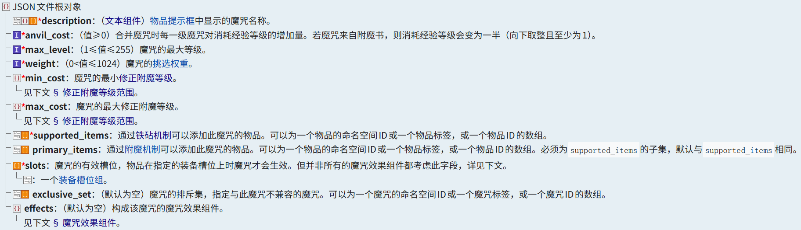
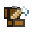
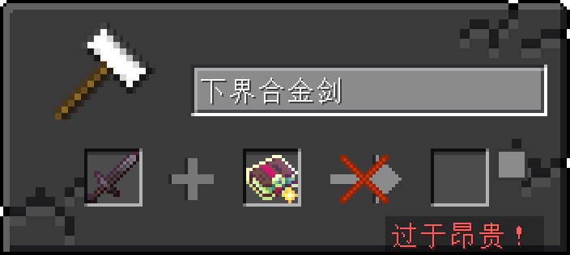
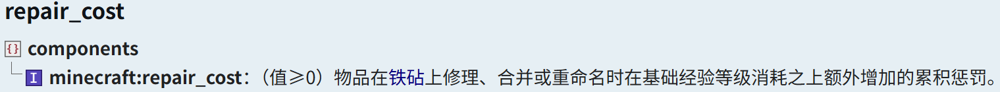
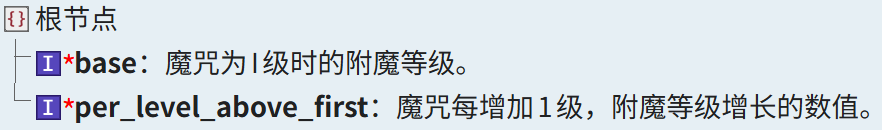
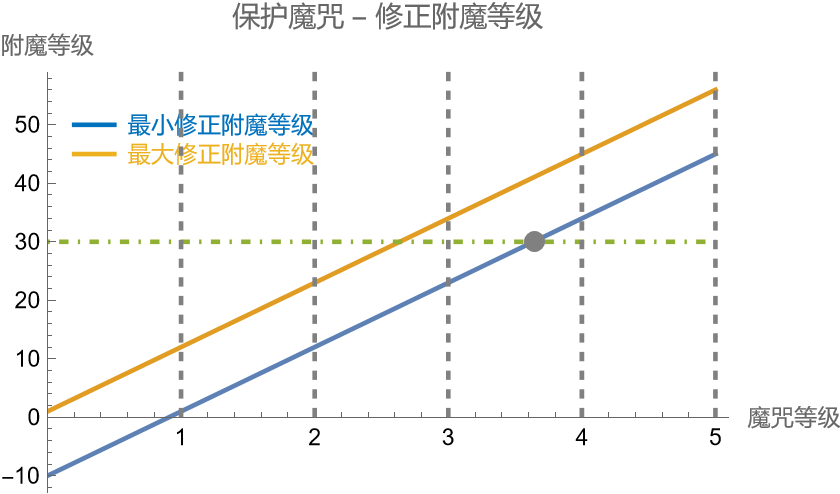

<FeatureHead
    title="Comprehensive application of custom spells"
    authorName="Qipai"
    cover = '../../../../../feature/archive/202512/_assets/3.png'
    :extraAuthors="['Antares','晓舒迢']"
/>

## Summary

Before 1.21, the data pack could only add or delete a small amount of content in the game. If you want to create fresh effects, you need to use function files (mcfunction). Since the triggers provided by Mojang were limited before (advancement, statistical information, etc.), players often need to write very complex functions for event monitoring, which are very limited from the perspective of performance and flexibility. Custom spells are a technical update introduced in 1.21, which drives spells in data. A variety of triggers and effects are provided for the data pack to achieve functions that are difficult or even impossible to achieve in the old version.

This article systematically sorts out the core elements of the enchantment mechanism (including enchantment level, item enchantment ability, enchantment weight and modification level), the experience penalty model of the anvil system, and focuses on analyzing the definition structure of custom enchantments, effect component design and its advanced application scenarios. By combining entity triggers (such as post_attack, location_changed, tick) and diverse effects (such as run_function, apply_impulse, explode, replace_block, etc.), Developers can build highly flexible and low-coupling game logic. In addition, the article also discusses the technological evolution of using implicit equipment slots to implement player or mob event monitoring in different game versions (especially before and after 1.21.5), and shows several typical practice cases in the community.

## 1. Introduction

Since the birth of Minecraft, with its highly open sandbox mechanism and continuously iterative content ecosystem, it has attracted a large number of players and creators to devote themselves to in-depth customization of maps, gameplay, and mechanisms. In the Java version, data pack (Data Pack), as an officially supported non-modular extension method, has long been responsible for core functions such as rule adjustment, loot redefinition, and function automation. However, before version 1.21, the boundaries of the data pack's capabilities were very clear: it lacked the ability to natively respond to "events." If developers want to implement dynamic interactions such as "triggering an effect when the player attacks" or "generating particles when the mob lands", they often need to use the advancement (Advancement) system to indirectly monitor, or poll the status through a high-frequency tick function - this not only results in logical redundancy and poor readability, but also significantly drags down server performance in complex scenarios, especially in new multi-threaded server architectures such as Folia. It is almost impossible.

This dilemma has turned around with the introduction of the "Custom Enchantments" mechanism in Minecraft 1.21. This update completely transforms enchantments from static properties into programmable data-driven entities. By embedding triggers and effects in the enchantment definition, it enables direct capture and response to key in-game behaviors (such as attacking, moving, digging, taking hits, etc.). More importantly, These logics are dispatched natively by the game engine without relying on external function loops, thereby significantly reducing resource overhead while ensuring rich effects.

The emergence of custom enchantments not only redefines the semantics of "enchantment" - from simple attribute addition to general event handler - but also provides data pack developers with a new paradigm of lightweight, efficient and high compatibility. Whether it is to implement weapon special effects, environment interaction, mob AI enhancement, or to build tick-free high-performance gameplay on the Folia server, custom enchantments have shown unprecedented potential.This article aims to systematically sort out the technical principles and application methods of custom enchantments. First, it reviews the basic rules of enchantment and anvil mechanisms, and then deeply analyzes the key fields in the definition of enchantments (especially min_cost/max_cost and effect components). Then it introduces the functional characteristics of various triggers and effects by classification, and discusses its practical strategies in mob and player event monitoring based on version evolution. Finally, it demonstrates its powerful expressiveness in actual projects through typical cases in the community, providing data pack developers provide a complete set of reference frameworks and design ideas.

## 2. Enchantment

Before we start explaining magic, we first need to understand a game mechanism directly related to it - Enchanting is a way to randomly generate one or more magic spells for items that do not have magic spells[^1]. This is the channel and use of magic spells that players can most directly experience in the game. There are many ways to obtain magic spells in vanilla games, which can be roughly divided into cheating and non-cheating:

* **Cheat type**: /enchant, /item, /loot, /data (cannot operate directly on the player);

* **Non-cheating**: Enchanting tables, treasure chest loot, fishing loot, treasure house loot, villager trading, raid mob drops, natural mob drops (normal or hard mode).

In the above method, except for /enchant which directly specifies the enchantment and /data which directly modifies nbt, other operations are implemented directly or indirectly through the item modifier [^8].

### 2.1. Enchanting properties

An enchantment operation is determined by the following factors: enchantment level, enchantment ability (item), selection weight (enchantment), maximum and minimum modified enchantment level (enchantment)[^2].$\textbf{2.1.1.}$**Enchanting Level**[^2][^8][^12]

The enchantment levels obtained through conventional means are as shown in the following table:

| Operation | Enchantment Level |
| :-------------------------------------------------------------: | :----------: |
| Enchanting Table Enchanting | 1-30 levels |
| Fishing and chest loot in fortresses and jungle temples | 5-22 levels |
| Box loot from end cities and ancient cities | 20-39 levels |
| Trial Chamber chest loot and treasure house loot | 0-20 levels |
| Ancient City Chest Loot | 30-50 levels |
| Villager trading | 5-19 levels |
| mob natural equipment (available in [enchantment provider](https://zh.minecraft.wiki/w/魔咒提供器定义格式#魔咒提供器) definition file adjustment) | 5-22 levels |

Obtained by cheating:

Cheating methods include those that have gone through the complete enchantment process`/loot`as well as`/item`subcommand`/item modify`, they all use the item modifier [^8] to add magic spells to the item.

Chinese Minecraft Wiki - item modifier#Main format

Among them, there are 4 modifiers related to enchantment, namely:

- [enchanted_count_increase](https://zh.minecraft.wiki/w/物品修饰器#enchanted_count_increase): Determines the impact of the specified spell on the number of items;
- [enchant_randomly](https://zh.minecraft.wiki/w/物品修饰器#enchant_randomly): Attach a random enchantment to the item. The level of the enchantment is also random;
- [enchant_with_levels](https://zh.minecraft.wiki/w/物品修饰器#enchant_with_levels): Enchant the item using the specified enchantment level (roughly equivalent to using an enchantment table of this level to enchant the item);
-[set_enchantments](https://zh.minecraft.wiki/w/物品修饰器#set_enchantments): Directly set the item's enchantment.

Among them, the two modifiers enchant_randomly and enchant_with_levels will participate in passing the context of the enchantment level.$\textbf{2.1.2.}$**Enchanting ability (item)**[^2]

::: tip About the enchantment ability of items in the game
For details, see [enchantment (item modification) #enchantment ability](https://zh.minecraft.wiki/w/%E9%99%84%E9%AD%94%EF%BC%88%E7%89%A9%E5%93%81%E4%BF%AE%E9%A5%B0%EF%BC%89#%E9%99%84%E9%AD%94%E8%83%BD%E5%8A%9B)
:::

The item's enchanting ability component **(enchantable component)**[^9] was added to the game in version 24w34a (1.21.2), and its definition format is as follows:

Chinese Minecraft Wiki - Data Component

$\textbf{2.1.3.}$**(Charms) Pick Weights & Maximum and Minimum Modified Enchantment Levels**[^5]

Chinese Minecraft Wiki - Spell Definition Format

- The selection weight of the enchantment is defined by **weight**;
- Maximum and minimum modified enchantment levels are defined by **max_level&min_level**.

### 2.2. Charm generation$\textbf{2.2.1.}$**Correct the enchantment level based on the item's enchantment ability**

We assume that the enchantment level is$$c$$, the enchantment ability of item is$$l$$, then the revised enchantment level$$c'$$Calculate [^2] through the following steps:
Add item enchanting ability modification to the enchantment level, and the value increase obeys [triangular distribution](https://zh.wikipedia.org/wiki/三角形分布). $${\rm{randInt}}(k)$$Used to generate in the interval$$[0,k-1]$$Random integers uniformly distributed within;$$
c'=c+1+{\rm{randInt}}\left(\left\lfloor\frac{l}{4}\right\rfloor+1\right)+{\rm{randInt}}\left(\left\lfloor\frac{l}{4}\right\rfloor+1\right)
$$The revised enchantment level is fluctuated, where$${\rm{randFloat}}()$$Used to generate in the interval$$[0,1)$$Random floating point number within;$$
{c'=\{1+0.15[{\rm randFloat}()+{\rm randFloat}()-1]\}c'}^{\rm [Java Edition]}
$$Rounding the modified enchantment level and introducing constraints to make it$$1≤c'≤2^{31}$$.
$$
c'=\max{(\min{(c',2147483647)},1)}
$$
$\textbf{2.2.2.}$**Generate list of optional spells**

- Filter out unenchantable spells, ([Soul Speed](https://zh.minecraft.wiki/w/灵魂疾行), [Swift Stealth](https://zh.minecraft.wiki/w/迅捷潜行), [Wind Explosion](https://zh.minecraft.wiki/w/风爆)) will not appear in the spell list;
- The treasure spell will not appear if it is not in the treasure list;
- According to the spell

**primary_items** field [^6], filter out spells that are not applicable to the target item;
-Filter out and correct the enchantment level that is not in the range$$[{\rm min\_cost}(c'),{\rm max\_cost}(c')]$$The magic spell within [^5], if it is within the interval, select the maximum magic level that satisfies it and add it to the interval;$\textbf{2.2.3.}$**Random enchantments based on weighting in the list of available enchantments**

After the list of optional enchantments is obtained through the above two processes, the game will weight the enchantments in the list according to the **selection weight** of the enchantment itself. If this enchantment passes the enchantment table, the random function will use the player's enchantment seed (XpSeed) for calculation [^2][^4][^11].

::: tip About RNG Enchanting (Enchanting Table)
**RNG (Random Number Generator)** is [random number generator](https://docs.oracle.com/en/java/javase/17/docs/api/java.base/java/util/Random.html). The enchantment seed is generated using the result of the entity's own random number generator. Based on the current enchantment list and the enchantment attached to the item, the enchantment seed can be deduced, and the entity's random number generator seed can be deduced based on the enchantment seed. The entity's random number generator can be updated by discarding the item. Using this feature, the enchantment seed can be "fixed" on a seed that can obtain the specified enchantment, thereby accurately enchanting [^4].
:::

### 2.3. Magic tag

**Enchantment Tags** are a combination of enchantments, used to control the occurrence conditions and some basic functions of enchantments[^6]. Since the introduction of the enchantment definition format in the 1.21 update, most properties of the enchantment can be defined directly through JSON fields, but if you want to create a more complete custom enchantment, you also need to consider the enchantment tag.

This article has screened out some tags from the Wiki that are deeply involved in game mechanics. The following table lists these tags and their responsible functions:

| tag | function |
| :------------------------: | :-------------------------------------------------------------: |
| #curse | A curse that appears in red text in the tooltip and cannot be dispelled. |
| #non_treasure | Non-treasure spells |
| #treasure | Treasure spells |
| #in_enchanting_table | Enchantments that will appear in the enchanting table (default only contains #non_treasure) |
| #on_mob_spawn_equipment | A spell that will appear on the equipment worn by randomly generated mobs |
| #on_random_loot | An enchantment that appears on loot in loot chests |
| #on_traded_equipment | Charms that appear on traded enchanted equipment |
| #tradeable | Charms that appear on enchanted books that are traded |
| #double_trade_price | Charms that cost double emeralds to trade |
| #tooltip_order | affects item[prompt box](https://zh.minecraft.wiki/w/提示框The order of the spells shown in ) |

Loot related:

| tag | function |
| :--------------------------------: | :-------------------------------------------------------------: |
| #smelts_loot | Make the dropped loot go through [smelting](https://zh.minecraft.wiki/w/烧炼)'s curse |
| #prevents_bee_spawns_when_mining | A enchantment that prevents tools from destroying hives and hives without releasing enraged bees |
| #prevents_decorated_pot_shattering | Prevent tools from breaking [decorated pots](https://zh.minecraft.wiki/w/饰纹陶罐)'s curse |
| #prevents_ice_melting | Make the tool not melt [ice](https://zh.minecraft.wiki/w/冰) breaks into [water](https://zh.minecraft.wiki/w/水)'s curse |
| #prevents_infested_spawns | Allow tools to destroy [wormed block](https://zh.minecraft.wiki/w/虫蚀方块) without generating the enchantment of the mob in it |

## 3. Anvil mechanism

By combining the tool with an enchanted book (or the same type of tool that carries the enchantment), the enchantment can be transferred to the tool. Compared to combining the enchantments on two similar items, using an enchanted book costs less and allows the item to gain enchantments that cannot be obtained on the enchantment table[^3].

Although the anvil can easily incorporate enchantments into tools, each anvil operation (except for the renaming operation) will add a "cumulative penalty" to the item. This cumulative penalty will affect the experience required for subsequent operations on the anvil. Assume that the experience penalty for the nth time an item is performed on the anvil is$f(n),~(n \in N)$, again$f(0)=0, f(n+1)=2f(n)+1$, easy to get formula[^13]:$$
f(n)=2^n-1, n \in N
$$We can get the form:

| Cumulative number of operations | Cumulative experience penalty |
| :----------: | :----------: |
| 0 | 0 |
| 1 | 1 |
| 2 | 3 |
| 3 | 7 |
| 4 | 15 |
| 5 | 31 |
| 6 | 63 |
| ...... | ...... |

::: important
In survival mode or adventure mode, the anvil can only perform operations that cost up to 39 experience levels at a time. If the cost is greater than this experience level, the anvil will prompt "Too expensive!" and refuse the operation. There is no such restriction in creative mode.

In creative mode, if a single operation requires more than 2147483647 (the maximum value of a 32-bit signed integer) experience level, the enchantment cost will not be displayed, and the "operation completed" item cannot be taken out, although it will be displayed, and there will be no red cross on the synthesis arrow.
:::

Operations greater than level 39 will prompt that they are too expensive and refuse the operation (survival or adventure mode)

The cumulative penalty component **(repair_cost component)**[^9] is defined in the following format:

Chinese Minecraft Wiki - Data Component

## 4. Custom spell

The spell is used in the game`ENCHANTMENT`registry, in data pack`data/&lt;namespace>/enchantment`Definition in directory [^5].

Chinese Minecraft Wiki - Spell Definition Format

### 4.1. Maximum and minimum modified enchantment levels

As shown in the figure above, the tree structure required to define a spell is given. Fields with clear effects will not be described in detail in this article. If necessary, you can read [Wiki](https://zh.minecraft.wiki/w/魔咒定义格式) page to view. This article focuses on the **minimum/maximum modified enchantment levels** of enchantments.

Corrected enchantment level format

If we want to register a spell with the game ourselves, how should we do it? After writing other fields, we pay attention to the two fields <node type="int" name=" min_cost"/> and <node type="int" name=" max_cost"/>. The description of these two fields on the Wiki is:

> If a enchantment is$n$level, <node type="int" name=" base"/> is$b$, <node type="int" name=" per_level_above_first"/> is$p$, then the enchantment level is$b+p(n−1)$. If the maximum modified enchantment level of an enchantment at a certain level is less than the minimum modified enchantment level, the enchantment of this level cannot be produced through enchantment tables, item modifiers, or other natural means.

That is, in an [Enchanting] (#2.2 Enchantment Generation), if the enchantment level corresponding to the enchantment level happens to be in the area between the maximum modified enchantment level and the minimum modified enchantment level, then the enchantment of this level is optional. For the calculation of enchantment level, please refer to [2.2. Enchantment Generation] (#2.2. Enchantment Generation) above.

The above picture describes the modified enchantment level curve of the protection enchantment. It can be clearly seen from the picture that the enchantment level ranges of level 1, 2, and 3 protection enchantments are 1-12, 12-23 and 23-34, while the minimum modified enchantment level of the level 4 protection enchantment is level 34, which is 30 levels beyond the maximum enchantment level that the enchantment table can provide, so it is not easy to obtain through enchantment on the enchantment table. (It needs to be judged based on the calculation of the item's enchantment ability).

In order to facilitate the operation, the author uses [GeoGebra](https://www.geogebra.org/graphing?lang=zh_CN) created a visualization file, available at [Attachment](#V.I) to view.

### 4.2. Magic effect

In Minecraft, enchantment effects rely on the implementation of effect components. When considering creating a enchantment event flow, there are only two core parts that we need to consider, namely **trigger** and **effector**. They are defined in the <node type="compound" name="effect"/> field of the enchantment. In addition to events, enchantment effect components also support some modifications to item effects. For example, add attribute modifications to the item, change the sound used when charging the crossbow, and change the sound of the trident.

::: warning
The **trigger** and **effector** described here correspond to the **effect component** and **enchantment effect** in Wiki[^5] respectively.
:::$\textbf{4.2.1.}$**Trigger**

According to the difference in parameter relationships that can be passed down, we divide triggers into **value triggers**, **entity triggers** and **damage immunity triggers**. The author's commonly used triggers will be listed below (see Wiki[^5] for a complete list of triggers), and several special triggers will be explained.

::: warning
For the convenience of description, **position-dependent effect components** are grouped into **entity triggers** here.
:::

- **Value Trigger**

  This type of trigger will pass a value variable in the context, which can be attack damage, protection coefficient, cooldown time, quantity, etc.

  | namespaceID | initial value | description |
  | :------------------: | :----------------------------------------------------------------: | :----------------------------------------------------------------: |
  | armor_effectiveness | [Damage reduction] calculated using only item armor value and armor toughness (https://zh.minecraft.wiki/w/盔甲机制#伤害减免) ratio | [Damage reduction] provided by this item (https://zh.minecraft.wiki/w/盔甲机制#伤害减免) ratio, the calculation result is clamped in the interval$$[0,1]$$on. |
  | damage | mob's [Basic melee attack power](https://zh.minecraft.wiki/w/近战攻击#基础近战攻击力) | The damage caused when using this item to attack, that is, [enchantment attack power](https://zh.minecraft.wiki/w/近战攻击#魔咒攻击力) |
  | damage_protection | 0 | The [enchantment protection factor] provided by this item (https://zh.minecraft.wiki/w/盔甲机制#保护魔咒机制). |

  The effect of value triggers is relatively common, so we won’t spend too much space explaining it here.

- **entity trigger**

  This type of trigger will pass event-related entity information in the context, such as entity data, entity location, etc.

  | namespaceID | Trigger scenario | Supplement |
  | :---------------------------------: | :-------------------------------------------------------------: | :----------------------------------------------------------------: |
  | tick | The mob will trigger this effect once every game tick | Can be equipped on the mob to control some independent effects |
  | post_piercing_attack[1.21.11] | · After the mob master holds an item with the enchantment effect component and attacks other entities · The player master holds an item with the enchantment effect component and has`piercing_weapon`[data component](https://zh.minecraft.wiki/w/数据组件) item after pressing the attack button. The trigger interval is affected by`minimum_attack_charge`Data component impact | Stable **left-click listener** |
  | hit_block | The player just starts mining the block, or the arrow or trident entity hits the block. Ignore the <node type="list" name=" slots"/> field **(only triggered by the main hand)**. | Used to perform some **block operations** |
  | post_attack | This effect is triggered after an attack (including the two attack methods of the spear [New: [JE 1.21.11](https://zh.minecraft.wiki/w/Java版1.21.11)] ) Arrow and wind bomb damage will not be triggered if they are not mobent. Explosion damage, etc. will not be triggered. | A very commonly used trigger, which can be **equipped on mob** to create some attack effects, or you can directly edit the nbt of **arrows** to add this type of trigger enchantment to achieve unique effects |
  | location_changed | · This effect is triggered when the **block position** where the mob is located changes (that is, when the coordinate of the mob's feet changes at the edge of the block). · This effect will also be triggered instantaneously when the mob lands. · This effect will also be triggered instantaneously when the item with this enchantment is first equipped. · This effect will not take effect when the player is in spectator mode, and this effect will be triggered once when the player switches out of spectator mode. | The most common usage and the most direct is to **monitor player movement**. Due to its instantaneous nature (triggered within a context), it can also be used to create some **strongly dependent on timing** effects |

- **Damage Immunity Trigger**

  This type of trigger will pass in a damage type context and combine with predicate to achieve immunity to a specific damage type.$\textbf{4.2.2.}$**Effects**

- **Value Effector**

  Used in conjunction with **value trigger** to perform some operations on values.

- **Other Effects**

  | namespaceID | Effect | Supplement |
  | :----------------------------------: | :----------------------------------------------------------------: | :----------------------------------------------------------------: |
  | all_of | Apply each entity effect in order. | - |
  | apply_mob_effect | If the action entity is a mob, apply a status effect with a random multiplier and a random duration. | - |
  | change_item_damage | Modify the [durability] of the current item (the item that triggered this effect) (https://zh.minecraft.wiki/w/耐久度). When using a positive value, the durability will be reduced; when using a negative value, the durability of the item will be increased, and the increased value is not affected by any magic. | - |
  | damage_entity | Randomly sized damage to the affected entity | Damage type can be specified |
  | explode | Explodes according to the position of action. | The only high-degree-of-freedom explosion source in vanilla, which can be equipped on the armor stand in combination with tick or location_changed triggers to achieve highly controllable explosion generation |
  | ignite | Set the active entity on fire | Vanilla's only entity fire excuse, used with the prompt feature of the location_changed trigger |
  | replace_block | Replace a block | - |
  | replace_disk | Replace all blocks within a cylindrical shape around the entity. | - |
  | run_function | Run the specified [function](https://zh.minecraft.wiki/w/Java版函数), taking the role entity as the command executor, taking the role position as the command execution position, taking the direction of the role entity as the execution direction, [authority level](https://zh.minecraft.wiki/w/权限等级) is level 2. | function interface, which can accept custom functions |
  | set_block_properties | Set the block properties of a block. | Can be used as a debugging stick (bushi |
  | spawn_particles | Spawn a single [particle](https://zh.minecraft.wiki/w/粒子). | The particle can inherit the triggerer's momentum. |
  | apply_exhaustion | Increase player's [consumption](https://zh.minecraft.wiki/w/消耗度). Only has practical effect on the player. | Vanilla's only consumption interface. |
  | apply_impulse | Apply an impulse to the target entity. The movement speed can be superimposed by applying the spell effect multiple times. | The player's only momentum interface, no need to detour. |

- **Attribute Effect**

  Temporary attribute modifiers can be added to the mob, which will take effect but cannot be exported.

### 4.3. Advanced usage

In addition to adding new effects to the item, the custom spell itself also benefits from its diverse triggers and effects. We can attach it to the item media and use it as an event listener.

::: warning
Before 1.21.5, although all mobs existed`armor.body`and`saddle`slot, but passes`/item`Command attempts to place items into it will still be rejected, but can still be used.`/data`The command forcibly modifies the mob's slot to monitor mob events, but due to`/data`The player is not operable, so previous version players cannot have a way to use spell triggers and effects without occupying explicit slots. In version 1.21.5, although it can be used`/item`Add items to these two slots of the player, but in`keepInventory`The rule is`false`When the player is killed, there will be a bug that clears the system. Players can stably use spell triggers and effects in version 1.21.6+.
:::$\textbf{4.3.1.}$**Listen to mob**

In terms of player event monitoring, the achievement system provides a series of direct triggers. The statistical information can be used with the tick function to continuously monitor some player operations. However, in the previous version, it was a headache to monitor non-playermob events. But with custom spells, we only need to fill the mob slots with the corresponding spell items to monitor and process mob events within a limited range.$\textbf{4.3.2.}$**Monitor player**

1.21.5+ version combined`equippable`component, use`/item`command installs the enchantment trigger to the player's implicit slot.

## 5. About the application of magic driver in Folia server

As a special server core, Folia is famous for its jail-like difficulty in writing data packs. Function ticks, data, screenboards, functions, etc. are all unusable, so it is extremely difficult to write rich gameplay.
But after 1.21, the situation changed: mc added the magic data driver, and the rich magic components and their effects make it possible to realize most ideas. After discussing with another data pack developer on the server, I decided to store the effects of each special weapon in its own magic spell, and set the magic spell as a curse to make it an inherent part of the weapon. Now nine months have passed, during which I have accumulated a lot of magic spell writing experience and folia Akaishi experience. To this day, I still remember the afternoon when I elbowed the monster with the advancement detection weapon before using the spell, which caused a huge tps drop.
For specific implementation examples, please click [Manual](https://docs.qq.com/aio/DT093Q1ZOV1NpdW5X?p=1vXgZJMFcv0pOUxwgQcO15) (data pack→weapon)

> "The curse is so easy!"
> "It's broken, it's broken!"
> "Safe mode is enabled for this archive"

——Xiao Shutuo

## 6. Community works

- [Disable Creeper Destruction](https://www.mcmod.cn/class/23093.html): use`explode`High degree of freedom explosion achieved by effects;

-[Motionomicon](https://modrinth.com/datapack/motionomicon): use`apply_impulse`Player Motion editing implemented by effects;

  > Regarding player momentum, the previous generation technology used the end crystal explosion, and there is also a library in the community [Player Motion](https://modrinth.com/datapack/player_motion).

- [[data pack]1.21.5+trinket slot](https://www.bilibili.com/video/BV1khMwzEED1/?spm_id_from=333.1387.homepage.video_card.click): use player`armor.body`The slot combination shows the player accessory slot implemented by entityUI technology;

- [Classic KB - low version KB simulation](https://www.bilibili.com/video/BV1iCvAzVEDu): use`post_attack`Low-version KB effect simulation implemented by trigger combined with Crystal Motion;

- [AMR Bot - Drop Protection Module](https://www.bilibili.com/video/BV1TrUpBeErs): use`location_changed`High-altitude fall protection achieved by trigger;

- [ICT server - data pack content](https://docs.qq.com/aio/DT093Q1ZOV1NpdW5X?p=1vXgZJMFcv0pOUxwgQcO15): Rich effect gameplay achieved with the help of magic driver on folia side.

## 7. Conclusion and outlook

The custom enchantment mechanism introduced in Minecraft 1.21 allows data pack developers to no longer rely on complex function polling and can directly respond to key events in the game (such as attacks, movements, mining, etc.). By combining triggers and effects, enchantments can not only achieve traditional enchantment effects, but can also be used as lightweight "event listeners" for various scenarios such as weapon special effects, mob behavior control, player interaction, etc.

Especially on servers that limit tick functions such as Folia, custom spells have become an important tool for building high-performance gameplay due to their advantages of native scheduling and low performance overhead. Many practical cases have emerged in the community, such as fall protection, knockback simulation, particle momentum control, etc., fully demonstrating its flexibility and practicality.

In the future, with the addition of more triggers and effects, as well as improved support for player implicit equipment slots, custom spells are expected to cover a wider range of interaction needs and become one of the core means of vanilla content creation.

## Acknowledgments

- Thanks [Antares](https://space.bilibili.com/123178313) about`spawn_particles`Guidance on effects function;
- Thanks [Xiao Shuyu](https://space.bilibili.com/402383436) Sharing about the experience of using folia magic spell.

## Attachment

**I. Corrected enchantment level visualization file**: [cost_level.ggb](../../../../../feature/archive/202512/3/cost_level.ggb);

## References

[^1]:[Chinese Minecraft Wiki. Charms[DB/OL]. (2025-12-02)[2025-12-06].](https://zh.minecraft.wiki/w/魔咒)
[^2]:[Chinese Minecraft Wiki. Enchanting (item modification) [DB/OL]. (2025-11-25)[2025-12-06].](https://zh.minecraft.wiki/w/附魔(item modification) )
[^3]:[Chinese Minecraft Wiki. Anvil Mechanism[DB/OL]. (2025-12-05)[2025-12-06].](https://zh.minecraft.wiki/w/铁砧机制)
[^4]:[Chinese Minecraft Wiki. Enchanting Table[DB/OL]. (2025-11-30)[2025-12-06].](https://zh.minecraft.wiki/w/附魔台)
[^5]:[Chinese Minecraft Wiki. Spell definition format [DB/OL]. (2025-11-13)[2025-12-06].](https://zh.minecraft.wiki/w/魔咒定义格式)
[^6]:[Chinese Minecraft Wiki. Java version tag[DB/OL]. (2025-11-18)[2025-12-06].](https://zh.minecraft.wiki/w/Java版标签)
[^7]:[Chinese Minecraft Wiki. command/enchant[DB/OL]. (2025-11-25)[2025-12-06].](https://zh.minecraft.wiki/w/命令/enchant)
[^8]:[Chinese Minecraft Wiki. item modifier[DB/OL]. (2025-11-30)[2025-12-06].](https://zh.minecraft.wiki/w/物品修饰器)
[^9]:[Chinese Minecraft Wiki. Data Components[DB/OL]. (2025-12-05)[2025-12-06].](https://zh.minecraft.wiki/w/数据组件)
[^10]:[Chinese Minecraft Wiki. Slot[DB/OL]. (2025-11-13)[2025-12-06].](https://zh.minecraft.wiki/w/槽位)
[^11]:[Chinese Minecraft Wiki. player[DB/OL]. (2025-11-19)[2025-12-06].](https://zh.minecraft.wiki/w/玩家)
[^12]:[Chinese Minecraft Wiki. Spell provider definition format [DB/OL]. (2025-11-13)[2025-12-06].](https://zh.minecraft.wiki/w/魔咒提供器定义格式)

[^13]: [Feijiu_ruby. Questions and answers: F13-How to enchant your weapons and equipment in the best order? [EB/OL]. (2022-01-06)[2025-12-06]](https://www.bilibili.com/opus/612489536438520248?spm_id_from=333.1387.0.0)
[^14]:[Big Brother Mengcha. data pack tutorial: teach you how to create new enchantments! Super detailed-my worlddata pack tutorial [Z/OL]. (2025-12-06)[2025-12-08]](https://www.bilibili.com/video/BV1d62XBZEdd)
[^15]:[Aizen Sosuke-.Things about mc curses: #1 Curse file format [Z/OL]. (2025-12-03)[2025-12-08]](https://www.bilibili.com/video/BV1iVSeBLEYm)
[^16]: [Chinese Minecraft Wiki. Loot Context[DB/OL]. (2025-11-22)[2025-12-08].](https://zh.minecraft.wiki/w/战利品上下文)
